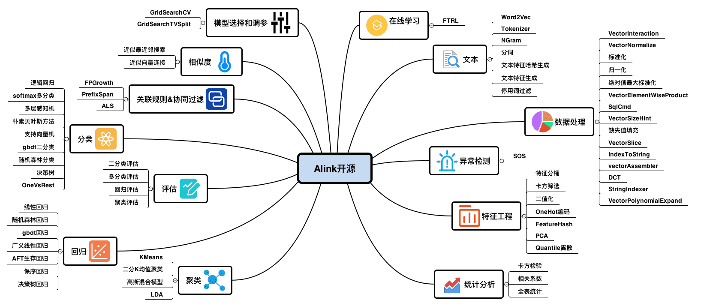

# Alink

文档地址：https://www.yuque.com/pinshu/alink_doc/intro

## Alink是什么

Alink是由阿里巴巴计算平台事业部PAI团队研发的，基于Flink的机器学习算法平台。

- Alink 名称的由来

- - 相关名称的公共部分： Alibaba, Algorithm, AI, Flink, Blink

- 同时支持批式/流式算法，提供丰富的算法库

- - 包含常用统计分析、机器学习、文本处理、推荐、异常检测等多个领域的算法



- 覆盖数据分析、建模和部署的全流程

- - 帮助数据分析和应用开发人员能够从数据探索、模型训练、实时预测、可视化展示，预测服务部署，端

​           到端地完成整个流程。

## 基本概念

在开始使用前，需要了解一些基本概念

### Operator

#### 概念

Alink里每个算法功能都是一个Operator, 分为批式Op和流式Op, 例如逻辑回归包含

- - LogisticRegressionTrainBatchOp(逻辑回归训练)
  - LogisticRegressionPredictBatchOp(逻辑回归批式预测)
  - LogisticRegressionPredictStreamhOp(逻辑回归流式预测)


#### Link/LinkFrom

Operator和Operator之间使用Link/LinkFrom连接，例如: 

```python
# 定义数据
data = CsvSourceBatchOp()
# 逻辑回归训练
lrTrain = LogisticRegressionTrainBatchOp()
# 逻辑回归预测
LrPredict = LogisticRegressionPredictBatchOp()
# 训练
data.link(lrTrain)
# 预测
LrPredict.linkFrom(lrTrain, data)
```

#### 参数

每个Operator都有参数，设置参数的方式是 set + 参数名称。

例如，逻辑回归的参数是

| 名称        | 中文名称     | 描述                   | 类型     | 是否必须？ | 默认值 |
| ----------- | ------------ | ---------------------- | -------- | ---------- | ------ |
| labelCol    | 标签列名     | 输入表中的标签列名     | String   | ✓          |        |
| featureCols | 特征列名数组 | 特征列名数组，默认全选 | String[] |            | null   |

那么，写法是  set + 参数名称

```python
lr = LogisticRegressionTrainBatchOp()\
			.setFeatureCols(colnames)\
			.setLabelCol("label")
```

#### Source/Sink

数据导入和数据导出是一类特殊的Operator,  定义好之后使用Link/LinkFrom就可以和算法组件连接起来了。

Alink包含常用的流式数据源和批式数据源，详情请看算法文档中数据导入和数据导出部分。

#### 示例

```python
df_data = pd.DataFrame([
    [2, 1, 1],
    [3, 2, 1],
    [4, 3, 2],
    [2, 4, 1],
    [2, 2, 1],
    [4, 3, 2],
    [1, 2, 1],
    [5, 3, 2]
])
input = BatchOperator.fromDataframe(df_data, schemaStr='f0 int, f1 int, label int')
# load data
dataTest = input
colnames = ["f0","f1"]
lr = LogisticRegressionTrainBatchOp().setFeatureCols(colnames).setLabelCol("label")
model = input.link(lr)
predictor = LogisticRegressionPredictBatchOp().setPredictionCol("pred")
predictor.linkFrom(model, dataTest).print()
```

### Pipeline

Alink算法支持的另一种方式是Pipeline，可以将数据处理，特征生成，模型训练放在一起，进行训练，预测以及在线服务。

#### 示例

```python
quantileDiscretizer = QuantileDiscretizer()\
			.setNumBuckets(2)\
			.setSelectedCols("sepal_length")

binarizer = Binarizer()\
			.setSelectedCol("petal_width")\
			.setOutputCol("bina")\
			.setReservedCols("sepal_length", "petal_width", "petal_length", "category")\
			.setThreshold(1.);

lda = Lda()\
			.setPredictionCol("lda_pred")\
			.setPredictionDetailCol("lda_pred_detail")\
			.setSelectedCol("category")\
			.setTopicNum(2)\
			.setRandomSeed(0)

pipeline = Pipeline()\
	.add(binarizer)\
	.add(binarizer)\
    .add(lda)
 
pipeline.fit(data1)
pipeline.transform(data2)
```

### Vector

Alink自定义一种数据类型Vector, 包括稀疏向量(SparseVector)和稠密向量(DenseVector)两种

#### 稀疏向量(SparseVector)

示例：$4$1:0.1 2:0.2

解释：两个$符号中间的数字是向量长度，$之后是列索引:列对应的值

#### 稠密向量(DenseVector)

示例: 0.1 0.2 0.3

解释: 按照顺序，以空格为分隔符

另外，在Alink里，如果列是Vector, 那么参数名字一般都是vectorColName.

## Pipeline组件

## 批组件

## 流组件

# 相关资料

- Alink教程（Java版）：https://www.yuque.com/pinshu/alink_tutorial/book_java
- Alink教程（Python版）：https://www.yuque.com/pinshu/alink_tutorial/book_python
- 源代码地址：https://github.com/alibaba/Alink/tree/master/tutorial
- Java版的数据和资料链接：https://www.yuque.com/pinshu/alink_tutorial/book_java_reference
- Python版的数据和资料链接：https://www.yuque.com/pinshu/alink_tutorial/book_python_reference
- 下载部分示例数据的Java代码：https://www.yuque.com/pinshu/alink_tutorial/book_java_download_some_data

## 数据集资料

一些机器学习算法的demo。普通最小二乘法，*决**策**树*（Iris鸢尾花*数**据**集*），KNN（mnist手写*数*字*数**据**集*），朴素贝叶斯分类西瓜*数**据**集*，trec06c*数**据**集*垃圾邮件分类（spam），逻辑斯蒂回归，随机梯度下降SGD与全梯度下降的对比

 https://github.com/ice-tong/ML_demo

本程序实现*决**策**树*的建立与可视化，以及*决**策**树*的预剪枝与后剪枝，*数**据**集*为西瓜书4.2、4.3节中的西瓜*数**据**集* 

https://github.com/JonathonYan1993/ML_DecisionTree_prepruning_postpruning

Engine X - 实时AI智能决策引擎、规则引擎、风控引擎、数据流引擎。 通过可视化界面进行规则配置，无需繁琐开发，节约人力，提升效率，实时监控，减少错误率，随时调整； 支持规则集、评分卡、决策树，名单库管理、机器学习模型、三方数据接入、定制化开发等

https://github.com/FiboAI/EngineX

数据科学的实践 包括：决策树、随机森林、集成模型、朴素贝叶斯

https://github.com/zhjcp/DataScience

采集股票数据，利用统计和计算来选股

https://github.com/albert-feng/blade-fury

TuShare是实现对股票/期货等金融数据从数据采集、清洗加工 到 数据存储过程的工具，满足金融量化分析师和学习数据分析的人在数据获取方面的需求，它的特点是数据覆盖范围广，接口调用简单,响应快速。

https://github.com/andyzsf/TuShare

https://github.com/alibaba/Alink

https://www.bookstack.cn/read/Alink-1.0.1/cn-imputer.md

《机器学习》周志华-西瓜书 PDF

#### 《机器学习》周志华-西瓜书 PDF

链接:[https://pan.baidu.com/s/1oTJjTkxK0PuV2nRExq1wcA](https://links.jianshu.com/go?to=https%3A%2F%2Fpan.baidu.com%2Fs%2F1oTJjTkxK0PuV2nRExq1wcA) 提取码:odp0