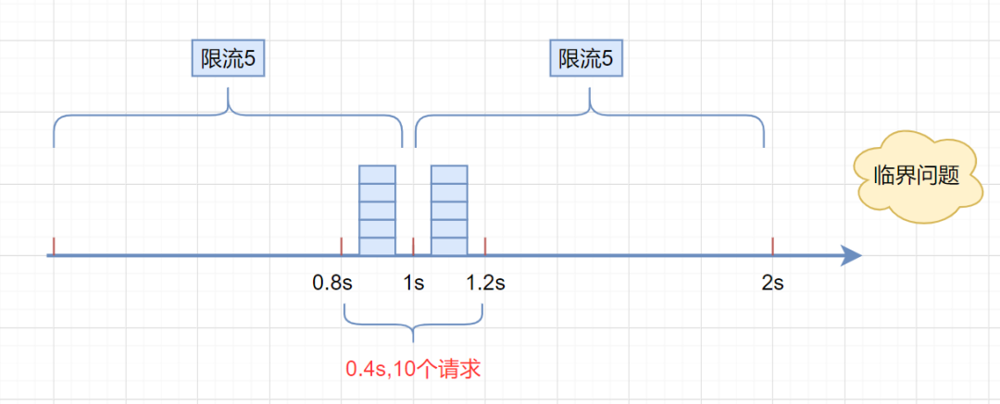

# 分布式限流(Rate limiting)

## 为什么需要限流器

限流(Rate limiting)可以认为服务降级的一种，限流就是限制系统的输入和输出流量已达到保护系统的目的。一般来说系统的吞吐量是可以被测算的，为了保证系统的稳定运行，一旦达到的需要限制的阈值，就需要限制流量并采取一些措施以完成限制流量的目的。比如：延迟处理，拒绝处理，或者部分拒绝处理等等。

举一个简单的例子：假设一个商城，有下单和查看自己的订单这两个业务。限量秒杀的时候，用户下单量在某一时候突然飚高。系统目前容量可能不够承担这么大的并发下单量，导致请求阻塞，排队，并进而导致所有的资源都被下单请求吃掉，用户查看自己订单的请求也无法执行或者很慢。同时，用户请求刷不出来就会不断地刷，导致进一步请求堆积。

## 限流目标

当系统的处理能力不能应对外部请求的突增流量时，为了不让系统奔溃，必须采取限流的措施。

**限流目标**：

- 防止被突发流量冲垮
- 防止恶意请求和攻击
- 保证集群服务中心的健康稳定运行（流量整形）
- API经济的细粒度资源量（请求量）控制

## 限流指标

目前主流的限流方法多采用 HPS 作为限流指标。

### TPS

**TPS（Transactions Per Second）是指每秒事务数**。一个事务是指事务内第一个请求发送到接收到最后一个请求的响应的过程，以此来计算使用的时间和完成的事务个数。

> 但是对实操性来说，按照事务来限流并不现实。在分布式系统中完成一笔事务需要多个系统的配合。比如我们在电商系统购物，需要订单、库存、账户、支付等多个服务配合完成，有的服务需要异步返回，这样完成一笔事务花费的时间可能会很长。如果按照TPS来进行限流，时间粒度可能会很大大，很难准确评估系统的响应性能。

### HPS

 **HPS（Hits Per Second）指每秒点击次数（每秒钟服务端收到客户端的请求数量）**。是指在一秒钟的时间内用户对Web页面的链接、提交按钮等点击总和。 它一般和TPS成正比关系，是B/S系统中非常重要的性能指标之一。

> 如果一个请求完成一笔事务，那TPS和HPS是等同的。但在分布式场景下，完成一笔事务可能需要多次请求，所以TPS和HPS指标不能等同看待。

### QPS

**QPS（Queries Per Second）是指每秒查询率**。是一台服务器每秒能够响应的查询次数（数据库中的每秒执行查询sql的次数），显然这个不够全面，不能描述增删改，所以不建议用QPS来作为系统性能指标。

> 如果后台只有一台服务器，那 HPS 和 QPS 是等同的。但是在分布式场景下，每个请求需要多个服务器配合完成响应。

### RT

**响应时间(RT)是指系统对请求作出响应的时间。**直观上看，这个指标与人对软件性能的主观感受是非常一致的，因为它完整地记录了整个计算机系统处理请求的时间。对于单机的没有并发操作的应用系统而言，人们普遍认为响应时间是一个合理且准确的性能指标。软件性能的高低实际上取决于用户对该响应时间的接受程度。

### Throughput

吞吐量(Throughput)是指系统在单位时间内处理请求的数量。对于单用户的系统，响应时间（或者系统响应时间和应用延迟时间）可以很好地度量系统的性能，但对于并发系统，通常需要用吞吐量作为性能指标。实际上，不同系统的平均响应时间随用户数增加而增长的速度也不大相同，这也是采用吞吐量来度量并发系统的性能的主要原因。一般而言，吞吐量是一个比较通用的指标，两个具有不同用户数和用户使用模式的系统，如果其最大吞吐量基本一致，则可以判断两个系统的处理能力基本一致。

### 并发用户数

并发用户数是指系统可以同时承载的正常使用系统功能的用户的数量。与吞吐量相比，并发用户数是一个更直观但也更笼统的性能指标。相比而言，以在线用户作为性能指标更直观些，而以同时发请求用户数作为性能指标更准确些。

## 限流方案

### **限流方法：两窗两桶（固定窗口、滑动窗口、漏桶、令牌桶）**

### 固定窗口计数器(Fixed Window)

固定窗口计数器(Fixed Window)算法的实现思路非常简单，维护一个固定单位时间内的计数器，如果检测到单位时间已经过去就重置计数器为零。计数限首先维护一个计数器，将单位时间段当做一个窗口，计数器记录这个窗口接收请求的次数。

- 划分时间为多个窗口：固定一个时间周期，如10秒或者30秒
- 当次数少于限流阀值，就允许访问，并且计数器+1
- 当次数大于限流阀值，就拒绝访问
- 当前的时间窗口过去之后，计数器清零

假设单位时间是1秒，限流阀值为3。在单位时间1秒内，每来一个请求,计数器就加1，如果计数器累加的次数超过限流阀值3，后续的请求全部拒绝。等到1s结束后，计数器清0，重新开始计数。如下图：


伪代码如下：

```java
    /**
     * 固定窗口时间算法
     * @return
     */
    boolean fixedWindowsTryAcquire() {
        long currentTime = System.currentTimeMillis();  //获取系统当前时间
        if (currentTime - lastRequestTime > windowUnit) {  //检查是否在时间窗口内
            counter = 0;  // 计数器清0
            lastRequestTime = currentTime;  //开启新的时间窗口
        }
        if (counter < threshold) {  // 小于阀值
            counter++;  //计数器加1
            return true;
        }

        return false;
    }
```

**存在问题**



固定窗口计数器是最为简单的算法，但这个算法有时会让**通过请求量允许为限制的两倍**。考虑如下情况：限制1秒内最多通过5个请求，在第一个窗口的最后半秒内通过了5个请求，第二个窗口的前半秒内又通过了5个请求。这样看来就是在1秒内通过了10个请求。

但是，这种算法有一个很明显的**临界问题**：假设限流阀值为5个请求，单位时间窗口是1s,如果我们在单位时间内的前0.8-1s和1-1.2s，分别并发5个请求。虽然都没有超过阀值，但是如果算0.8-1.2s,则并发数高达10，已经**超过单位时间1s不超过5阀值**的定义啦。

**假如请求的进入非常集中，那么所设定的「限流阈值」等同于你需要承受的最大并发数**。所以，如果需要顾忌到并发问题，那么这里的「固定周期」设定的要尽可能的短，这样的话「限流阈值」的数值就可以相应的减小。甚至限流阈值就可以直接用并发数来指定。考虑到上段的描述，会有请求量超过的情况，往往**限流阈值要小于所能承受的最大并发**。

不过不管怎么设定，固定窗口永远存在的缺点是：**由于流量的进入往往都不是一个恒定的值，所以一旦流量进入速度有所波动，要么计数器会被提前计满，导致这个周期内剩下时间段的请求被“限制”。要么就是计数器计不满，也就是「限流阈值」设定的过大，导致资源无法充分利用**。

### 滑动窗口计数器(Sliding Window)

滑动窗口计数器(Sliding Window)算法限流解决固定窗口临界值的问题。它将单位时间周期分为n个小周期，分别记录每个小周期内接口的访问次数，并且根据时间滑动删除过期的小周期。

- 将时间划分为更小的多个时间区间
- 一个时间窗口占用固定的多个时间区间，每有一次请求，就给一个时间区间计数
- 每经过一个时间区间，就抛弃最老的一个时间区间，加入一个最新的时间区间
- 如果当前窗口内区间的请求计数总和超过了限制数量，则本窗口内所有请求都会被丢弃

一张图解释滑动窗口算法，如下：


假设单位时间还是1s，滑动窗口算法把它划分为5个小周期，也就是滑动窗口（单位时间）被划分为5个小格子。每格表示0.2s。每过0.2s，时间窗口就会往右滑动一格。然后呢，每个小周期，都有自己独立的计数器，如果请求是0.83s到达的，0.8~1.0s对应的计数器就会加1。

我们来看下滑动窗口是如何解决临界问题的？

假设我们1s内的限流阀值还是5个请求，0.8~1.0s内（比如0.9s的时候）来了5个请求，落在黄色格子里。时间过了1.0s这个点之后，又来5个请求，落在紫色格子里。如果**是固定窗口算法，是不会被限流的**，但是**滑动窗口的话，每过一个小周期，它会右移一个小格**。过了1.0s这个点后，会右移一小格，当前的单位时间段是0.2~1.2s，这个区域的请求已经超过限定的5了，已触发限流啦，实际上，紫色格子的请求都被拒绝啦。

**TIPS:** 当滑动窗口的格子周期划分的越多，那么滑动窗口的滚动就越平滑，限流的统计就会越精确。

滑动窗口算法**伪代码实现**如下：

```java
 /**
     * 单位时间划分的小周期（单位时间是1分钟，10s一个小格子窗口，一共6个格子）
     */
    private int SUB_CYCLE = 10;

    /**
     * 每分钟限流请求数
     */
    private int thresholdPerMin = 100;

    /**
     * 计数器, k-为当前窗口的开始时间值秒，value为当前窗口的计数
     */
    private final TreeMap<Long, Integer> counters = new TreeMap<>();

   /**
     * 滑动窗口时间算法实现
     */
    boolean slidingWindowsTryAcquire() {
        long currentWindowTime = LocalDateTime.now().toEpochSecond(ZoneOffset.UTC) / SUB_CYCLE * SUB_CYCLE; //获取当前时间在哪个小周期窗口
        int currentWindowNum = countCurrentWindow(currentWindowTime); //当前窗口总请求数

        //超过阀值限流
        if (currentWindowNum >= thresholdPerMin) {
            return false;
        }

        //计数器+1
        counters.get(currentWindowTime)++;
        return true;
    }

   /**
    * 统计当前窗口的请求数
    */
    private int countCurrentWindow(long currentWindowTime) {
        //计算窗口开始位置
        long startTime = currentWindowTime - SUB_CYCLE* (60s/SUB_CYCLE-1);
        int count = 0;

        //遍历存储的计数器
        Iterator<Map.Entry<Long, Integer>> iterator = counters.entrySet().iterator();
        while (iterator.hasNext()) {
            Map.Entry<Long, Integer> entry = iterator.next();
            // 删除无效过期的子窗口计数器
            if (entry.getKey() < startTime) {
                iterator.remove();
            } else {
                //累加当前窗口的所有计数器之和
                count =count + entry.getValue();
            }
        }
        return count;
    }
```

滑动窗口算法虽然解决了**固定窗口的临界问题**，但是一旦到达限流后，请求都会直接暴力被拒绝。这样我们会损失一部分请求，这其实对于产品来说，并不太友好。滑动时间窗口的优点是解决了流量计数器算法的缺陷，但是也有 2 个问题：

- 流量超过就必须抛弃或者走降级逻辑
- 对流量控制不够精细，不能限制集中在短时间内的流量，也不能削峰填谷

滑动窗口计数器是通过将窗口再细分，并且按照时间"滑动"，这种算法避免了固定窗口计数器带来的双倍突发请求，但时间区间的精度越高，算法所需的空间容量就越大。所以，如果固定区间已经很小了，使用滑动窗口也没有意义了。比如固定区间的周期是1秒，再切分到毫秒，会造成更大的性能和资源损失。

滑动窗口本质上是预先划定时间片的方式，属于一种“预测”，意味着几乎肯定**无法100%**的物尽其用。

### 漏桶算法(Leaky Bucket)

如下图所示，水滴持续滴入漏桶中，底部定速流出。如果水滴滴入的速率大于流出的速率，当存水超过桶的大小的时候就会溢出。规则如下：

- 将每个请求视为“水滴”放入漏桶进行存储
- 漏桶以固定速率漏出水滴（处理请求）
- 漏桶满了，多余的水滴就丢弃


可以看到水滴对应的就是请求。它的特点就是**宽进严出**，无论请求多少，请求的速率有多大，都按照固定的速率流出，对应的就是服务按照固定的速率处理请求。面对突发请求，服务的处理速度和平时是一样的，这其实不是我们想要的，在面对突发流量我们希望在系统平稳的同时，提升用户体验即能更快的处理请求，而不是和正常流量一样，循规蹈矩的处理。而令牌桶在应对突击流量的时候，可以更加的“激进”。

可见这里有两个变量,一个是桶的大小,支持流量突发增多时可以存多少的水(burst),另一个是水桶漏洞的大小(rate)。

漏桶算法伪代码实现如下：

```java
   /**
     * 每秒处理数（出水率）
     */
    private long rate;

    /**
     *  当前剩余水量
     */
    private long currentWater;

    /**
     * 最后刷新时间
     */
    private long refreshTime;

    /**
     * 桶容量
     */
    private long capacity;

    /**
     * 漏桶算法
     * @return
     */
    boolean leakybucketLimitTryAcquire() {
        long currentTime = System.currentTimeMillis();  //获取系统当前时间
        long outWater = (currentTime - refreshTime) / 1000 * rate; //流出的水量 =(当前时间-上次刷新时间)* 出水率
        long currentWater = Math.max(0, currentWater - outWater); // 当前水量 = 之前的桶内水量-流出的水量
        refreshTime = currentTime; // 刷新时间

        // 当前剩余水量还是小于桶的容量，则请求放行
        if (currentWater < capacity) {
            currentWater++;
            return true;
        }
        
        // 当前剩余水量大于等于桶的容量，限流
        return false;
    }
```

简单说来就是：如果当前速率小于阈值则直接处理请求，否则不直接处理请求，进入缓冲区，并增加当前水位

漏桶算法多使用队列实现，服务的请求会存到队列中，服务的提供方则按照固定的速率从队列中取出请求并执行，过多的请求则放在队列中排队或直接拒绝。

漏桶算法的缺陷也很明显，当短时间内有大量的突发请求时，即便此时服务器没有任何负载，每个请求也都得在队列中等待一段时间才能被响应。

### 令牌桶算法(Token Bucket)

令牌桶和漏桶的原理类似，不过漏桶是**定速地流出**，而令牌桶是**定速地往桶里塞入令牌**，然后请求只有拿到了令牌才能通过，之后再被服务器处理。当然令牌桶的大小也是有限制的，假设桶里的令牌满了之后，定速生成的令牌会丢弃。规则：

- 以固定速率的往桶内放入令牌
- 生成的令牌放入令牌桶中存放，如果令牌桶满了则多余的令牌直接丢弃，当请求到达时，会尝试从令牌桶中取令牌，得到令牌的请求可以执行
- 如果桶空了，则丢弃取令牌的请求


可以看出令牌桶在应对突发流量的时候，桶内假如有 100 个令牌，那么这 100 个令牌可以马上被取走，而不像漏桶那样匀速的消费。所以在**应对突发流量的时候令牌桶表现的更佳**。

令牌桶算法伪代码实现如下：

```java
    /**
     * 每秒处理数（放入令牌数量）
     */
    private long putTokenRate;
    
    /**
     * 最后刷新时间
     */
    private long refreshTime;

    /**
     * 令牌桶容量
     */
    private long capacity;
    
    /**
     * 当前桶内令牌数
     */
    private long currentToken = 0L;

    /**
     * 漏桶算法
     * @return
     */
    boolean tokenBucketTryAcquire() {
        long currentTime = System.currentTimeMillis();  //获取系统当前时间
        long generateToken = (currentTime - refreshTime) / 1000 * putTokenRate; //生成的令牌 =(当前时间-上次刷新时间)* 放入令牌速率
        currentToken = Math.min(capacity, generateToken + currentToken); // 当前令牌数量 = 之前的桶内令牌数量+放入的令牌数量
        refreshTime = currentTime; // 刷新时间
        
        //桶里面还有令牌，请求正常处理
        if (currentToken > 0) {
            currentToken--; //令牌数量-1
            return true;
        }
        
        return false;
    }
```

令牌桶的容量大小理论上就是程序需要支撑的最大并发数。令牌桶算法既能够将所有的请求平均分布到时间区间内，又能接受服务器能够承受范围内的突发请求，因此是目前使用较为广泛的一种限流算法。

使用RateLimiter有几个值得注意的地方:允许先消费，后付款，意思就是它可以来一个请求的时候一次性取走几个或者是剩下所有的令牌甚至多取，但是后面的请求就得为上一次请求买单，它需要等待桶中的令牌补齐之后才能继续获取令牌。

### 分布式限流

单节点模式下，使用RateLimiter进行限流一点问题都没有。但线上是分布式系统，布署了多个节点，而且多个节点最终调用的是同一个API/服务商接口。虽然我们对单个节点能做到将QPS限制在N/s，但是多节点条件下，如果每个节点均是N/s，那么到服务商那边的总请求就是**节点数乘以N/s**，于是限流效果失效。使用该方案对单节点的阈值控制是难以适应分布式环境的。

## Nginx限流

### 控制速率(limit_req_zone)

`ngx_http_limit_req_module` 模块提供限制请求处理速率能力，使用`漏桶算法(leaky bucket)`。使用`limit_req_zone` 和`limit_req`两个指令，限制单个IP的请求处理速率。格式：`limit_req_zone key zone rate`

```nginx
http {
    limit_req_zone $binary_remote_addr zone=testRateLimit:10m rate=10r/s;
}
server {
    location /test/ {
		limit_req zone=testRateLimit burst=20 nodelay;
        # 设置(http,server,location)超过限流策略后拒绝请求的响应状态码，默认503
        limit_req_status 555;
        # 设置(http,server,location)限流策略后打印的日志级别：info|notice|warn|error
        limit_req_log_level warn;
        # 设置(http,server,location)启动无过滤模式。启用后不会过滤请求，但仍会记录速率超量的日志，默认为off
        limit_req_dry_run off; 
        proxy_pass http://my_upstream;
    }
    error_page 555 /555json;
    location = /555json  {
        default_type application/json;
        add_header Content-Type 'text/html; charset=utf-8';
        return 200 '{"code": 666, "update":"访问高峰期，请稍后再试"}';
    }
}
```

- **key**：定义限流对象，`$binary_remote_addr` 表示基于 `remote_addr` 来做限流，`binary_` 的目的是压缩内存占用量
- **zone**：定义共享内存区来存储访问信息，`myRateLimit:10m` 表示一个大小为10M，名字为myRateLimit的内存区域。1M能存储16000 IP地址的访问信息，10M可以存储16W IP地址访问信息
- **rate**：设置最大访问速率，`rate=10r/s` 表示每秒最多处理10个请求。Nginx 实际上以毫秒为粒度来跟踪请求信息，因此 10r/s 实际上是限制：每100毫秒处理一个请求。即上一个请求处理完后，后续100毫秒内又有请求到达，将拒绝处理该请求
- **burst**：处理突发流量
  - `burst=20` 表示若同时有21个请求到达，Nginx 会处理第1个请求，剩余20个请求将放入队列，然后每隔100ms从队列中获取一个请求进行处理。若请求数大于21，将拒绝处理多余的请求，直接返回503
  - `burst=20 nodelay` 表示20个请求立马处理，不能延迟。不过即使这20个突发请求立马处理结束，后续来请求也不会立马处理。**burst=20** 相当于缓存队列中占了20个坑，即使请求被处理，这20个位置这只能按100ms一个来释放


### 控制并发连接数(limit_conn_zone)

`ngx_http_limit_conn_module`提供了限制连接数的能力，利用`limit_conn_zone`和`limit_conn`两个指令即可。下面是Nginx官方例子：

```nginx
limit_conn_zone $binary_remote_addr zone=test:10m;
limit_conn_zone $server_name zone=demo:10m;

server {
	# 表示限制单个IP同时最多持有10个连接
    limit_conn test 10;
    # 表示虚拟主机(server) 同时能处理并发连接的总数为100个
    limit_conn demo 100;
    # 设置(http,server,location)超过限流策略后拒绝请求的响应状态码，默认503
    limit_conn_status 555;
    # 设置(http,server,location)限流策略后打印的日志级别：info|notice|warn|error
    limit_conn_log_level warn;
    # 设置(http,server,location)启动无过滤模式。启用后不会过滤请求，但仍会记录速率超量的日志，默认为off
    limit_conn_dry_run off;
    
    error_page 555 /555json;
    location = /555json  {
        default_type application/json;
        add_header Content-Type 'text/html; charset=utf-8';
        return 200 '{"code": 666, "update":"访问高峰期，请稍后再试"}';
    }
}
```

**注意**：只有当 **request header** 被后端server处理后，这个连接才进行计数。

## Tomcat 限流

Tomcat 8.5 版本的最大线程数在 conf/server.xml 配置中，如下所示：

```text
<Connector port="8080" protocol="HTTP/1.1"
          connectionTimeout="20000"
          maxThreads="150"
          redirectPort="8443" />
```

其中 maxThreads 就是 Tomcat 的最大线程数，当请求的并发大于此值（maxThreads）时，请求就会排队执行，这样就完成了限流的目的。

> 小贴士：maxThreads 的值可以适当的调大一些，此值默认为 150（Tomcat 版本 8.5.42），但这个值也不是越大越好，要看具体的硬件配置，需要注意的是每开启一个线程需要耗用 1MB 的 JVM 内存空间用于作为线程栈之用，并且线程越多 GC 的负担也越重。最后需要注意一下，操作系统对于进程中的线程数有一定的限制，Windows 每个进程中的线程数不允许超过 2000，Linux 每个进程中的线程数不允许超过 1000。

## Lua限流

**第一步**：安装说明

环境准备：

```shell
yum install -y gcc gcc-c++ readline-devel pcre-devel openssl-devel tcl perl
```

安装drizzle http://wiki.nginx.org/HttpDrizzleModule：

```shell
cd /usr/local/src/ 
wget http://openresty.org/download/drizzle7-2011.07.21.tar.gz 
tar xzvf drizzle-2011.07.21.tar.gz 
cd drizzle-2011.07.21/ 
./configure --without-server 
make libdrizzle-1.0 
make install-libdrizzle-1.0 
export LD_LIBRARY_PATH=/usr/local/lib:$LD_LIBRARY_PATH
```

安装openresty：

```shell
wget http://openresty.org/download/ngx_openresty-1.7.2.1.tar.gz 
tar xzvf ngx_openresty-1.7.2.1.tar.gz 
cd ngx_openresty-1.7.2.1/ 
./configure --with-http_drizzle_module 
gmake 
gmake install
```

**第二步**：Nginx配置nginx.conf

`/usr/local/openresty/nginx/conf/nginx.conf`：

```nginx
# 添加MySQL配置(drizzle) 
upstream backend { 
    drizzle_server 127.0.0.1:3306 dbname=test user=root password=123456 protocol=mysql; 
    drizzle_keepalive max=200 overflow=ignore mode=single; 
}

server { 
    listen       80; 
    server_name  localhost;

    location / { 
        root   html; 
        index  index.html index.htm; 
    }

    location /lua _test{ 
        default_type text/plain; 
        content_by_lua 'ngx.say("hello, lua")'; 
    }


    location /lua_redis { 
        default_type text/plain; 
        content_by_lua_file /usr/local/lua_test/redis_test.lua; 
    } 

    location /lua_mysql { 
            default_type text/plain; 
            content_by_lua_file /usr/local/lua_test/mysql_test.lua; 
    }


    location @cats-by-name { 
        set_unescape_uri $name $arg_name; 
        set_quote_sql_str $name; 
        drizzle_query 'select * from cats where name=$name'; 
        drizzle_pass backend; 
        rds_json on; 
    }
    location @cats-by-id { 
        set_quote_sql_str $id $arg_id; 
        drizzle_query 'select * from cats where id=$id'; 
        drizzle_pass backend; 
        rds_json on; 
    }
    location = /cats { 
        access_by_lua ' 
            if ngx.var.arg_name then 
                return ngx.exec("@cats-by-name") 
            end

            if ngx.var.arg_id then 
                return ngx.exec("@cats-by-id") 
            end 
        ';

        rds_json_ret 400 "expecting \"name\" or \"id\" query arguments"; 
    }
    # 通过url匹配出name，并编码防止注入，最后以json格式输出结果 
    location ~ '^/mysql/(.*)' { 
        set $name $1; 
        set_quote_sql_str $quote_name $name; 
        set $sql "SELECT * FROM cats WHERE name=$quote_name"; 
        drizzle_query $sql; 
        drizzle_pass backend; 
        rds_json on; 
    }
    # 查看MySQL服务状态 
    location /mysql-status { 
        drizzle_status; 
    } 
} 
```

**第三步**：lua测试脚本

`/usr/local/lua_test/redis_test.lua`：

```lua
local redis = require "resty.redis"
local cache = redis.new()
cache.connect(cache, '127.0.0.1', '6379')
local res = cache:get("foo")
if res==ngx.null then
    ngx.say("This is Null")
    return
end
ngx.say(res)
```

`/usr/local/lua_test/mysql_test.lua`：

```lua
local mysql = require "resty.mysql"
local db, err = mysql:new()
if not db then
    ngx.say("failed to instantiate mysql: ", err)
    return
end

db:set_timeout(1000) -- 1 sec

-- or connect to a unix domain socket file listened
-- by a mysql server:
--     local ok, err, errno, sqlstate =
--           db:connect{
--              path = "/path/to/mysql.sock",
--              database = "ngx_test",
--              user = "ngx_test",
--              password = "ngx_test" }

local ok, err, errno, sqlstate = db:connect{
    host = "127.0.0.1",
    port = 3306,
    database = "test",
    user = "root",
    password = "123456",
    max_packet_size = 1024 * 1024 }

if not ok then
    ngx.say("failed to connect: ", err, ": ", errno, " ", sqlstate)
    return
end

ngx.say("connected to mysql.")

local res, err, errno, sqlstate =
    db:query("drop table if exists cats")
if not res then
    ngx.say("bad result: ", err, ": ", errno, ": ", sqlstate, ".")
    return
end

res, err, errno, sqlstate =
    db:query("create table cats "
             .. "(id serial primary key, "
             .. "name varchar(5))")
if not res then
    ngx.say("bad result: ", err, ": ", errno, ": ", sqlstate, ".")
    return
end

ngx.say("table cats created.")

res, err, errno, sqlstate =
    db:query("insert into cats (name) "
             .. "values (\'Bob\'),(\'\'),(null)")
if not res then
    ngx.say("bad result: ", err, ": ", errno, ": ", sqlstate, ".")
    return
end

ngx.say(res.affected_rows, " rows inserted into table cats ",
        "(last insert id: ", res.insert_id, ")")

-- run a select query, expected about 10 rows in
-- the result set:
res, err, errno, sqlstate =
    db:query("select * from cats order by id asc", 10)
if not res then
    ngx.say("bad result: ", err, ": ", errno, ": ", sqlstate, ".")
    return
end

local cjson = require "cjson"
ngx.say("result: ", cjson.encode(res))

-- put it into the connection pool of size 100,
-- with 10 seconds max idle timeout
local ok, err = db:set_keepalive(10000, 100)
if not ok then
    ngx.say("failed to set keepalive: ", err)
    return
end

-- or just close the connection right away:
-- local ok, err = db:close()
-- if not ok then
--     ngx.say("failed to close: ", err)
--     return
-- end
';
```

**第四步**：验证结果

```shell
$ curl 'http://127.0.0.1/lua_test' 
hello, lua

$ redis-cli set foo 'hello,lua-redis' 
OK 
$ curl 'http://127.0.0.1/lua_redis' 
hello,lua-redis

$ curl 'http://127.0.0.1/lua_mysql' 
connected to mysql. 
table cats created. 
3 rows inserted into table cats (last insert id: 1) 
result: [{"name":"Bob","id":"1"},{"name":"","id":"2"},{"name":null,"id":"3"}]

$ curl 'http://127.0.0.1/cats' 
{"errcode":400,"errstr":"expecting \"name\" or \"id\" query arguments"}

$ curl 'http://127.0.0.1/cats?name=bob' 
[{"id":1,"name":"Bob"}]

$ curl 'http://127.0.0.1/cats?id=2' 
[{"id":2,"name":""}]

$ curl 'http://127.0.0.1/mysql/bob' 
[{"id":1,"name":"Bob"}]

$ curl 'http://127.0.0.1/mysql-status' 
worker process: 32261

upstream backend 
  active connections: 0 
  connection pool capacity: 0 
  servers: 1 
  peers: 1
```

## Redis限流

### 滑动时间窗口算法

所谓的滑动时间算法指的是以当前时间为截止时间，往前取一定的时间，比如往前取 60s 的时间，在这 60s 之内运行最大的访问数为 100，此时算法的执行逻辑为，先清除 60s 之前的所有请求记录，再计算当前集合内请求数量是否大于设定的最大请求数 100，如果大于则执行限流拒绝策略，否则插入本次请求记录并返回可以正常执行的标识给客户端。

滑动时间窗口如下图所示：


其中每一小个表示 10s，被红色虚线包围的时间段则为需要判断的时间间隔，比如 60s 秒允许 100 次请求，那么红色虚线部分则为 60s。

我们可以借助 Redis 的有序集合 ZSet 来实现时间窗口算法限流，实现的过程是先使用 ZSet 的 key 存储限流的 ID，score 用来存储请求的时间，每次有请求访问来了之后，先清空之前时间窗口的访问量，统计现在时间窗口的个数和最大允许访问量对比，如果大于等于最大访问量则返回 false 执行限流操作，负责允许执行业务逻辑，并且在 ZSet 中添加一条有效的访问记录，具体实现代码如下。

我们借助 Jedis 包来操作 Redis，实现在 pom.xml 添加 Jedis 框架的引用，配置如下：

```text
<!-- https://mvnrepository.com/artifact/redis.clients/jedis -->
<dependency>
    <groupId>redis.clients</groupId>
    <artifactId>jedis</artifactId>
    <version>3.3.0</version>
</dependency>
```

具体的 Java 实现代码如下：

```text
import redis.clients.jedis.Jedis;

public class RedisLimit {
    // Redis 操作客户端
    static Jedis jedis = new Jedis("127.0.0.1", 6379);

    public static void main(String[] args) throws InterruptedException {
        for (int i = 0; i < 15; i++) {
            boolean res = isPeriodLimiting("java", 3, 10);
            if (res) {
                System.out.println("正常执行请求：" + i);
            } else {
                System.out.println("被限流：" + i);
            }
        }
        // 休眠 4s
        Thread.sleep(4000);
        // 超过最大执行时间之后，再从发起请求
        boolean res = isPeriodLimiting("java", 3, 10);
        if (res) {
            System.out.println("休眠后，正常执行请求");
        } else {
            System.out.println("休眠后，被限流");
        }
    }

    /**
     * 限流方法（滑动时间算法）
     * @param key      限流标识
     * @param period   限流时间范围（单位：秒）
     * @param maxCount 最大运行访问次数
     * @return
     */
    private static boolean isPeriodLimiting(String key, int period, int maxCount) {
        long nowTs = System.currentTimeMillis(); // 当前时间戳
        // 删除非时间段内的请求数据（清除老访问数据，比如 period=60 时，标识清除 60s 以前的请求记录）
        jedis.zremrangeByScore(key, 0, nowTs - period * 1000);
        long currCount = jedis.zcard(key); // 当前请求次数
        if (currCount >= maxCount) {
            // 超过最大请求次数，执行限流
            return false;
        }
        // 未达到最大请求数，正常执行业务
        jedis.zadd(key, nowTs, "" + nowTs); // 请求记录 +1
        return true;
    }
}
```

此实现方式存在的缺点有两个：

- 使用 ZSet 存储有每次的访问记录，如果数据量比较大时会占用大量的空间，比如 60s 允许 100W 访问时；
- 此代码的执行非原子操作，先判断后增加，中间空隙可穿插其他业务逻辑的执行，最终导致结果不准确。

### 漏桶算法

滑动时间算法有一个问题就是在一定范围内，比如 60s 内只能有 10 个请求，当第一秒时就到达了 10 个请求，那么剩下的 59s 只能把所有的请求都给拒绝掉，而漏桶算法可以解决这个问题。

漏桶算法类似于生活中的漏斗，无论上面的水流倒入漏斗有多大，也就是无论请求有多少，它都是以均匀的速度慢慢流出的。当上面的水流速度大于下面的流出速度时，漏斗会慢慢变满，当漏斗满了之后就会丢弃新来的请求;当上面的水流速度小于下面流出的速度的话，漏斗永远不会被装满，并且可以一直流出。

漏洞算法的实现步骤是，先声明一个队列用来保存请求，这个队列相当于漏斗，当队列容量满了之后就放弃新来的请求，然后重新声明一个线程定期从任务队列中获取一个或多个任务进行执行，这样就实现了漏桶算法。

我们可以借助 Redis 很方便的实现漏洞算法。

我们可以使用 Redis 4.0 版本中提供的 Redis-Cell 模块，该模块使用的是漏斗算法，并且提供了原子的限流指令，而且依靠 Redis 这个天生的分布式程序就可以实现比较完美的限流了。

Redis-Cell 实现限流的方法也很简单，只需要使用一条指令 cl.throttle 即可，使用示例如下：

```text
> cl.throttle mylimit 15 30 60
1）（integer）0 # 0 表示获取成功，1 表示拒绝
2）（integer）15 # 漏斗容量
3）（integer）14 # 漏斗剩余容量
4）（integer）-1 # 被拒绝之后，多长时间之后再试（单位：秒）-1 表示无需重试
5）（integer）2 # 多久之后漏斗完全空出来
```

其中 15 为漏斗的容量，30 / 60s 为漏斗的速率。

### 计数器限流

计数器限流的核心是 `INCRBY` 和 `EXPIRE` 指令，测试用例在此，通常，计数器算法容易出现不平滑的情况，瞬间的 qps 有可能超过系统的承载。

```lua
-- 获取调用脚本时传入的第一个 key 值（用作限流的 key）
local key = KEYS[1]
-- 获取调用脚本时传入的第一个参数值（限流大小）
local limit = tonumber(ARGV[1])
-- 获取计数器的限速区间 TTL
local ttl = tonumber(ARGV[2])

-- 获取当前流量大小
local curentLimit = tonumber(redis.call('get', key) or "0")

-- 是否超出限流
if curentLimit + 1 > limit then
    -- 返回 (拒绝)
    return 0
else
    -- 没有超出 value + 1
    redis.call('INCRBY', key, 1)
    -- 如果 key 中保存的并发计数为 0，说明当前是一个新的时间窗口，它的过期时间设置为窗口的过期时间
    if (current_permits == 0) then
	      redis.call('EXPIRE', key, ttl)
	  end
    -- 返回 (放行)
    return 1
end
```

此段 Lua 脚本的逻辑很直观：

- 通过 `KEYS[1]` 获取传入的 key 参数，为某个限流指标的 key
- 通过 `ARGV[1]` 获取传入的 limit 参数，为限流值
- 通过 `ARGV[2]` 获取限流区间 ttl
- 通过 `redis.call`，拿到 key 对应的值（默认为 0），接着与 limit 判断，如果超出表示该被限流；否则，使用 `INCRBY` 增加 1，未限流（需要处理初始化的情况，设置 `TTL`）

不过上面代码是有问题的，如果 key 之前存在且未设置 `TTL`，那么限速逻辑就会永远生效了（触发 limit 值之后），使用时需要注意。

### 令牌桶

令牌桶算法也是 Guava 中使用的算法，同样采用计算的方式，将时间和 Token 数目联系起来：

```lua
-- key
local key = KEYS[1]
-- 最大存储的令牌数
local max_permits = tonumber(KEYS[2])
-- 每秒钟产生的令牌数
local permits_per_second = tonumber(KEYS[3])
-- 请求的令牌数
local required_permits = tonumber(ARGV[1])

-- 下次请求可以获取令牌的起始时间
local next_free_ticket_micros = tonumber(redis.call('hget', key, 'next_free_ticket_micros') or 0)

-- 当前时间
local time = redis.call('time')
-- time[1] 返回的为秒，time[2] 为 ms
local now_micros = tonumber(time[1]) * 1000000 + tonumber(time[2])

-- 查询获取令牌是否超时（传入参数，单位为 微秒）
if (ARGV[2] ~= nil) then
    -- 获取令牌的超时时间
    local timeout_micros = tonumber(ARGV[2])
    local micros_to_wait = next_free_ticket_micros - now_micros
    if (micros_to_wait> timeout_micros) then
        return micros_to_wait
    end
end

-- 当前存储的令牌数
local stored_permits = tonumber(redis.call('hget', key, 'stored_permits') or 0)
-- 添加令牌的时间间隔（1000000ms 为 1s）
-- 计算生产 1 个令牌需要多少微秒
local stable_interval_micros = 1000000 / permits_per_second

-- 补充令牌
if (now_micros> next_free_ticket_micros) then
    local new_permits = (now_micros - next_free_ticket_micros) / stable_interval_micros
    stored_permits = math.min(max_permits, stored_permits + new_permits)
    -- 补充后，更新下次可以获取令牌的时间
    next_free_ticket_micros = now_micros
end

-- 消耗令牌
local moment_available = next_free_ticket_micros
-- 两种情况：required_permits<=stored_permits 或者 required_permits>stored_permits
local stored_permits_to_spend = math.min(required_permits, stored_permits)
local fresh_permits = required_permits - stored_permits_to_spend;
-- 如果 fresh_permits>0，说明令牌桶的剩余数目不够了，需要等待一段时间
local wait_micros = fresh_permits * stable_interval_micros

-- Redis 提供了 redis.replicate_commands() 函数来实现这一功能，把发生数据变更的命令以事务的方式做持久化和主从复制，从而允许在 Lua 脚本内进行随机写入
redis.replicate_commands()
-- 存储剩余的令牌数：桶中剩余的数目 - 本次申请的数目
redis.call('hset', key, 'stored_permits', stored_permits - stored_permits_to_spend)
redis.call('hset', key, 'next_free_ticket_micros', next_free_ticket_micros + wait_micros)
redis.call('expire', key, 10)

-- 返回需要等待的时间长度
-- 返回为 0（moment_available==now_micros）表示桶中剩余的令牌足够，不需要等待
return moment_available - now_micros
```


## Guava限流

**RateLimiter**使用的是一种叫令牌桶的流控算法，RateLimiter会按照一定的频率往桶里扔令牌，线程拿到令牌才能执行，比如你希望自己的应用程序QPS不要超过1000，那么RateLimiter设置1000的速率后，就会每秒往桶里扔1000个令牌。

### Maven依赖

```
        <dependency>
            <groupId>com.google.guava</groupId>
            <artifactId>guava</artifactId>
            <version>28.2-jre</version>
        </dependency>
```

 Guava的 RateLimiter提供了令牌桶算法实现：平滑突发限流(SmoothBursty)和平滑预热限(SmoothWarmingUp)  实现。

举例来说明如何使用RateLimiter，想象下我们需要处理一个任务列表，但我们不希望每秒的任务提交超过两个

```
//速率是每秒两个许可
final RateLimiter rateLimiter = RateLimiter.create(2.0);

void submitTasks(List tasks, Executor executor) {
    for (Runnable task : tasks) {
        rateLimiter.acquire(); // 也许需要等待
        executor.execute(task);
    }
}
```

再举另外一个例子，想象下我们制造了一个数据流，并希望以每秒5kb的速率处理它。可以通过要求每个字节代表一个许可，然后指定每秒5000个许可来完成：

```
// 每秒5000个许可
final RateLimiter rateLimiter = RateLimiter.create(5000.0); 

void submitPacket(byte[] packet) {
    rateLimiter.acquire(packet.length);
    networkService.send(packet);
}
```

代码示例，模拟一下每秒最多过五个请求：

```
public class RateLimiterTest {

    private static final SimpleDateFormat FORMATTER = new SimpleDateFormat("yyyy-MM-dd HH:mm:ss");
    
    private static final int THREAD_COUNT = 25;
    
    @Test
    public void testRateLimiter1() {
        RateLimiter rateLimiter = RateLimiter.create(5);
        
        Thread[] ts = new Thread[THREAD_COUNT];
        for (int i = 0; i < THREAD_COUNT; i++) {
            ts[i] = new Thread(new RateLimiterThread(rateLimiter), "RateLimiterThread-" + i);
        }
        
        for (int i = 0; i < THREAD_COUNT; i++) {
            ts[i].start();
        }
        
        for (;;);
    }
    
    public class RateLimiterThread implements Runnable {
        
        private RateLimiter rateLimiter;
        
        public RateLimiterThread(RateLimiter rateLimiter) {
            this.rateLimiter = rateLimiter;
        }
        
        @Override
        public void run() {
            rateLimiter.acquire(1);
            
            System.out.println(Thread.currentThread().getName() + "获取到了令牌，时间 = " + FORMATTER.format(new Date()));
        }
        
    }
    
}
```


### 平滑突发限流

使用 `RateLimiter`的静态方法创建一个限流器，设置每秒放置的令牌数为5个。返回的RateLimiter对象可以保证1秒内不会给超过5个令牌，并且以固定速率进行放置，达到平滑输出的效果。

```
```

### 平滑预热限流

`RateLimiter`的 `SmoothWarmingUp`是带有预热期的平滑限流，它启动后会有一段预热期，逐步将分发频率提升到配置的速率。 比如下面代码中的例子，创建一个平均分发令牌速率为2，预热期为3分钟。由于设置了预热时间是3秒，令牌桶一开始并不会0.5秒发一个令牌，而是形成一个平滑线性下降的坡度，频率越来越高，在3秒钟之内达到原本设置的频率，以后就以固定的频率输出。这种功能适合系统刚启动需要一点时间来“热身”的场景。

```

```

### 源码分析

Guava是使用令牌桶算法来实现限流功能的，但也有自己的一些特点：

1. 在每次有请求来获取token的时候，会同时添加令牌到令牌桶中，并不是通过异步任务固定速率添加令牌到令牌桶中，是一个惰性的方法。
2. 超额信用消费，即用将来时间产生的令牌，来满足当前的请求，这样能应对一定的瞬间流量

Guava 中的限流器有两种实现，

1. SmoothBursty，顾名思义，该实现主要通过令牌桶方法实现，能够应对突发流量
2. SmoothWarmingUp，实现也是通过令牌桶方法，但在应对突发流量与流量整形中取了折中，能应对一定的突发流量，同时具有一定的流量整形功能

首先介绍下基类SmoothRateLimiter的关键属性：

| 属性                 | 作用                           | 描述                                                         |
| -------------------- | ------------------------------ | ------------------------------------------------------------ |
| storedPermits        | 当前限流器可用的令牌总数       |                                                              |
| maxPermits           | 当前限流器最大的可用令牌数总数 | storedPermits<= maxPermits                                   |
| stableIntervalMicros | 请求的平均时间间隔             | 如假设当前限流器是每秒5次，所以两次请求的平均间隔是200ms，也表示每隔stableIntervalMicros，会产生一个token |
| nextFreeTicketMicros | 下一次可以产生令牌的时间       | 下一次请求可以获取令牌的起始时间<br/> 由于RateLimiter允许预消费，上次请求预消费令牌后<br/> 下次请求需要等待相应的时间到nextFreeTicketMicros时刻才可以获取令牌 |

看完了 `RateLimiter`的基本使用示例后，我们来学习一下它的实现原理。

#### RateLimiter创建

RateLimiter 通过调用create()方法创建，具体实现如下：

```
static RateLimiter create(SleepingTicker ticker, double permitsPerSecond) {
    RateLimiter rateLimiter = new Bursty(ticker, 1.0 /* maxBurstSeconds */);
    rateLimiter.setRate(permitsPerSecond);
    return rateLimiter;
}
```

SleepingTicker是Guava封装的一个时间类，maxBurstSeconds表示在ReteLimiter未使用时，最多保存几秒的令牌，默认是1；通过new Bursty创建了一个RateLimiter对象，然后调用 RateLimiter.setRate（）方法进行初始化工作。具体实现如下：

```
public final void setRate(double permitsPerSecond) {
    //参数判断
    boolean expression = permitsPerSecond > 0.0 && !Double.isNaN(permitsPerSecond);
    String errorMessage = "rate must be positive";
    if (!expression) {
        throw new IllegalArgumentException(String.valueOf(errorMessage));
    }
    synchronized (mutex) {
        //生成令牌以及更新下一次请求可以获取令牌的起始时间
        resync(readSafeMicros());
        //添加令牌时间间隔计算
        double stableIntervalMicros = TimeUnit.SECONDS.toMicros(1L) / permitsPerSecond;
        this.stableIntervalMicros = stableIntervalMicros;
        doSetRate(permitsPerSecond, stableIntervalMicros);
    }
}
```

上面代码先进行参数判断，然后生成令牌以及更新下一次请求可以获取令牌的起始时间，并且计算添加令牌的时间间隔，最后又调用了Bursty的doSetRate方法设置存储的令牌桶数，下面分析一下resync()和doSetRate()方法的实现。

```
private void resync(long nowMicros) {
    // if nextFreeTicket is in the past, resync to now
    // 如果nextFreeTicket过去的时间，则更新为现在的时间
    if (nowMicros > nextFreeTicketMicros) {
        //更新存储的的令牌桶数
        storedPermits = Math.min(maxPermits,
                storedPermits + (nowMicros - nextFreeTicketMicros) / stableIntervalMicros);
        nextFreeTicketMicros = nowMicros;
    }
}
```

上面判断当前的时间点是否大于上次获取令牌桶时计算出来的下一次请求可以获取令牌的起始时间，如果大于就更新令牌桶数，并且设置下次请求可以获取令牌桶的时间。

```
void doSetRate(double permitsPerSecond, double stableIntervalMicros) {
    double oldMaxPermits = this.maxPermits;
    //设置最大存储令牌桶数
    maxPermits = maxBurstSeconds * permitsPerSecond;
    //设置现有令牌桶数
    storedPermits = (oldMaxPermits == 0.0)
            ? 0.0 // initial state
            : storedPermits * maxPermits / oldMaxPermits;
}
```

#### 获取令牌

通过调用acquire()方法获取令牌，如果之前预消费了令牌，那么就会阻塞，从而实现限制访问速率,下面查看acquire()方法的具体实现。

```
public double acquire(int permits) {
    checkPermits(permits);
    long microsToWait;
    synchronized (mutex) {
        //计算需要阻塞的时间
        microsToWait = reserveNextTicket(permits, readSafeMicros());
    }
    //guava封装的时间类，阻塞
    ticker.sleepMicrosUninterruptibly(microsToWait);
    //返回阻塞的时间，单位为秒
    return 1.0 * microsToWait / TimeUnit.SECONDS.toMicros(1L);
}
```

上面的代码实现中，调用reserveNextTicket()方法计算需要阻塞的时间，下面查看方法的具体实现：

```
private long reserveNextTicket(double requiredPermits, long nowMicros) {
    //生成令牌以及更新下一次请求可以获取令牌的起始时间
    resync(nowMicros);
    //计算需要等待的时间
    long microsToNextFreeTicket = nextFreeTicketMicros - nowMicros;
    double storedPermitsToSpend = Math.min(requiredPermits, this.storedPermits);
    double freshPermits = requiredPermits - storedPermitsToSpend;
    long waitMicros = storedPermitsToWaitTime(this.storedPermits, storedPermitsToSpend)
            + (long) (freshPermits * stableIntervalMicros);
    //更新下次请求可以获取令牌的起始时间
    this.nextFreeTicketMicros = nextFreeTicketMicros + waitMicros;
    this.storedPermits -= storedPermitsToSpend;
    return microsToNextFreeTicket;
}
```

## Spring+拦截器实现限流

### 限流实现

```
import com.google.common.util.concurrent.RateLimiter;
import org.springframework.stereotype.Service;
 
@Service
public class RateLimiterService {
    /**
     * 每秒只发出5个令牌
     */
    RateLimiter rateLimiter = RateLimiter.create(5.0);
 
    /**
     * 尝试获取令牌
     * @return
     */
    public boolean tryAcquire(){
        return rateLimiter.tryAcquire();
    }
}
```

### **自定义拦截器，在拦截器中实现限流**

```
 
@Component
public class RateLimiterInterceptor implements HandlerInterceptor {
    @Resource
    private RateLimiterService accessLimitService;
 
    private Logger logger = LoggerFactory.getLogger(RateLimiterInterceptor.class);
 
    @Override
    public boolean preHandle(HttpServletRequest request, HttpServletResponse response, Object handler) throws Exception {
        if (!(handler instanceof HandlerMethod)) {
            return true;
        }
 
        HandlerMethod handlerMethod = (HandlerMethod) handler;
        RateLimiterAnnotation rateLimiterAnnotation = handlerMethod.getMethod().getAnnotation(RateLimiterAnnotation.class);
        if(rateLimiterAnnotation == null) {
            return true;
        }
 
        if (!accessLimitService.tryAcquire()) {
            logger.info("限流中......");
            return false;
        }
        logger.info("请求成功");
        return true;
    }
 
    @Override
    public void postHandle(HttpServletRequest request, HttpServletResponse response, Object handler, ModelAndView modelAndView) throws Exception {
 
    }
 
    @Override
    public void afterCompletion(HttpServletRequest request, HttpServletResponse response, Object handler, Exception ex) throws Exception {
 
    }
}
```

### **添加自定义拦截器**

```

@SpringBootConfiguration
public class WebConfiguration implements WebMvcConfigurer {
 
    @Resource
    private RateLimiterInterceptor rateLimiterInterceptor;
 
    @Override
    public void addInterceptors(InterceptorRegistry registry) {
        registry.addInterceptor(rateLimiterInterceptor).addPathPatterns("/**");
    }
}
```

### 自定义注解

```
@Retention(RetentionPolicy.RUNTIME)
@Target(ElementType.METHOD)
public @interface RateLimiterAnnotation {
    int rateLimiterNumber() default 1;
}
```

### Controller 类实现

```
@RestController
@RequestMapping("/api")
public class RateLimiterController {
 
    @RateLimiterAnnotation
    @RequestMapping(value = "/rateLimiterTest", method = RequestMethod.GET)
    public RetDTO rateLimiterTest() throws Exception {
        return RetDTO.getReturnJson(ResponseEnum.OK);
    }
}
```

### 通过 Jmeter 进行限流测试

## 网关限流

### Spring Cloud Gateway限流

在Spring Cloud Gateway中，有Filter过滤器，因此可以在“pre”类型的Filter中自行实现上述三种过滤器。但是限流作为网关最基本的功能，Spring Cloud Gateway官方就提供了RequestRateLimiterGatewayFilterFactory这个类，适用Redis和lua脚本实现了令牌桶的方式。具体实现逻辑在RequestRateLimiterGatewayFilterFactory类中，lua脚本在如下图所示的文件夹中：具体源码不打算在这里讲述，读者可以自行查看，代码量较少，先以案例的形式来讲解如何在Spring Cloud Gateway中使用内置的限流过滤器工厂来实现限流。

首先在工程的pom文件中引入gateway的起步依赖和redis的reactive依赖，代码如下：

```
<dependency>
    <groupId>org.springframework.cloud</groupId>
    <artifactId>spring-cloud-starter-gateway</artifactId>
</dependency>

<dependency>
    <groupId>org.springframework.boot</groupId>
    <artifatId>spring-boot-starter-data-redis-reactive</artifactId>
</dependency>

```

在配置文件中做以下的配置：

```
server:
  port: 8081
spring:
  cloud:
    gateway:
      routes:
      - id: limit_route
        uri: http://httpbin.org:80/get
        predicates:
        - After=2017-01-20T17:42:47.789-07:00[America/Denver]
        filters:
        - name: RequestRateLimiter
          args:
            key-resolver: '#{@hostAddrKeyResolver}'
            redis-rate-limiter.replenishRate: 1
            redis-rate-limiter.burstCapacity: 3
  application:
    name: gateway-limiter
  redis:
    host: localhost
    port: 6379
    database: 0
```

在上面的配置文件，指定程序的端口为8081，配置了 redis的信息，并配置了RequestRateLimiter的限流过滤器，该过滤器需要配置三个参数：

burstCapacity，令牌桶总容量。
replenishRate，令牌桶每秒填充平均速率。
key-resolver，用于限流的键的解析器的 Bean 对象的名字。它使用 SpEL 表达式根据#{@beanName}从 Spring 容器中获取 Bean 对象。
KeyResolver需要实现resolve方法，比如根据Hostname进行限流，则需要用hostAddress去判断。实现完KeyResolver之后，需要将这个类的Bean注册到Ioc容器中。

```
public class HostAddrKeyResolver implements KeyResolver {

    @Override
    public Mono<String> resolve(ServerWebExchange exchange) {
        return Mono.just(exchange.getRequest().getRemoteAddress().getAddress().getHostAddress());
    }

}

 @Bean
    public HostAddrKeyResolver hostAddrKeyResolver() {
        return new HostAddrKeyResolver();
    }
```

可以根据uri去限流，这时KeyResolver代码如下：

```
public class UriKeyResolver  implements KeyResolver {

    @Override
    public Mono<String> resolve(ServerWebExchange exchange) {
        return Mono.just(exchange.getRequest().getURI().getPath());
    }

}

 @Bean
    public UriKeyResolver uriKeyResolver() {
        return new UriKeyResolver();
    }
```

RequestRateLimiter是使用Redis来进行限流的，并在redis中存储了2个key。关注这两个key含义可以看lua源代码。

### Sentinel限流

Sentinel 是阿里巴巴提供的一种限流、熔断中间件，与RateLimiter相比，Sentinel提供了丰富的限流、熔断功能。它支持控制台配置限流、熔断规则，支持集群限流，并可以将相应服务调用情况可视化。

#### Sentinel 基本概念

##### 资源

资源是 Sentinel 的关键概念。它可以是 Java 应用程序中的任何内容，例如，由应用程序提供的服务，或由应用程序调用的其它应用提供的服务，甚至可以是一段代码。在接下来的文档中，我们都会用资源来描述代码块。

只要通过 Sentinel API 定义的代码，就是资源，能够被 Sentinel 保护起来。大部分情况下，可以使用方法签名，URL，甚至服务名称作为资源名来标示资源。

##### 规则

围绕资源的实时状态设定的规则，可以包括流量控制规则、熔断降级规则以及系统保护规则。所有规则可以动态实时调整。

#### Sentinel 功能和设计理念

##### 流量控制

##### **什么是流量控制**

流量控制在网络传输中是一个常用的概念，它用于调整网络包的发送数据。然而，从系统稳定性角度考虑，在处理请求的速度上，也有非常多的讲究。任意时间到来的请求往往是随机不可控的，而系统的处理能力是有限的。我们需要根据系统的处理能力对流量进行控制。Sentinel 作为一个调配器，可以根据需要把随机的请求调整成合适的形状，如下图所示：

#### 流量控制设计理念

流量控制有以下几个角度:

- 资源的调用关系，例如资源的调用链路，资源和资源之间的关系；
- 运行指标，例如 QPS、线程池、系统负载等；
- 控制的效果，例如直接限流、冷启动、排队等。

Sentinel 的设计理念是让您自由选择控制的角度，并进行灵活组合，从而达到想要的效果。

#### 熔断降级

##### 什么是熔断降级

除了流量控制以外，及时对调用链路中的不稳定因素进行熔断也是 Sentinel 的使命之一。由于调用关系的复杂性，如果调用链路中的某个资源出现了不稳定，可能会导致请求发生堆积，进而导致级联错误。

Sentinel 和 Hystrix 的原则是一致的: 当检测到调用链路中某个资源出现不稳定的表现，例如请求响应时间长或异常比例升高的时候，则对这个资源的调用进行限制，让请求快速失败，避免影响到其它的资源而导致级联故障。

**熔断降级设计理念**

在限制的手段上，Sentinel 和 Hystrix 采取了完全不一样的方法。

Hystrix 通过 [线程池隔离](https://github.com/Netflix/Hystrix/wiki/How-it-Works#benefits-of-thread-pools) 的方式，来对依赖（在 Sentinel 的概念中对应 *资源*）进行了隔离。这样做的好处是资源和资源之间做到了最彻底的隔离。缺点是除了增加了线程切换的成本（过多的线程池导致线程数目过多），还需要预先给各个资源做线程池大小的分配，并且对于一些使用了 ThreadLocal 的场景来说会有问题（如 Spring 事务）。

Sentinel 对这个问题采取了两种手段:

- 通过并发线程数进行限制

和资源池隔离的方法不同，Sentinel 通过限制资源并发线程的数量，来减少不稳定资源对其它资源的影响。这样不但没有线程切换的损耗，也不需要您预先分配线程池的大小。当某个资源出现不稳定的情况下，例如响应时间变长，对资源的直接影响就是会造成线程数的逐步堆积。当线程数在特定资源上堆积到一定的数量之后，对该资源的新请求就会被拒绝。堆积的线程完成任务后才开始继续接收请求。

- 针对慢调用和异常对资源进行降级

除了对并发线程数进行控制以外，Sentinel 还可以根据响应时间和异常等不稳定因素来快速对不稳定的调用进行熔断。当依赖的资源出现响应时间过长后，所有对该资源的访问都会被直接拒绝，直到过了指定的时间窗口之后才重新渐进式地恢复。

**系统自适应保护**

Sentinel 同时提供系统维度的自适应保护能力。防止雪崩，是系统防护中重要的一环。当系统负载较高的时候，如果还持续让请求进入，可能会导致系统崩溃，无法响应。在集群环境下，网络负载均衡会把本应这台机器承载的流量转发到其它的机器上去。如果这个时候其它的机器也处在一个边缘状态的时候，这个增加的流量就会导致这台机器也崩溃，最后导致整个集群不可用。

针对这个情况，Sentinel 提供了对应的保护机制，让系统的入口流量和系统的负载达到一个平衡，保证系统在能力范围之内处理最多的请求。

#### Sentinel 是如何工作的

Sentinel 的主要工作机制如下：

- 对主流框架提供适配或者显示的 API，来定义需要保护的资源，并提供设施对资源进行实时统计和调用链路分析。
- 根据预设的规则，结合对资源的实时统计信息，对流量进行控制。同时，Sentinel 提供开放的接口，方便您定义及改变规则。
- Sentinel 提供实时的监控系统，方便您快速了解目前系统的状态。

## 业务限流

通过秒杀活动，如果我们运气爆棚，可能会用非常低的价格买到不错的商品（这种概率堪比买福利彩票中大奖）。但有些高手，并不会像我们一样老老实实，通过秒杀页面点击秒杀按钮，抢购商品。他们可能在自己的服务器上，模拟正常用户登录系统，跳过秒杀页面，直接调用秒杀接口。如果是我们手动操作，一般情况下，一秒钟只能点击一次秒杀按钮。

这种差距实在太明显了，如果不做任何限制，绝大部分商品可能是被机器抢到，而非正常的用户，有点不太公平。所以，我们有必要识别这些非法请求，做一些限制。那么，我们该如何现在这些非法请求呢？目前有两种常用的限流方式：

- 基于nginx限流
- 基于redis限流

### 对同一用户限流

为了防止某个用户，请求接口次数过于频繁，可以只针对该用户做限制。

限制同一个用户id，比如每分钟只能请求5次接口。

### 对同一ip限流

有时候只对某个用户限流是不够的，有些高手可以模拟多个用户请求，这种nginx就没法识别。这时需要加同一ip限流功能。

限制同一个ip，比如每分钟只能请求5次接口。但这种限流方式可能会有误杀的情况，比如同一个公司或网吧的出口ip是相同的，如果里面有多个正常用户同时发起请求，有些用户可能会被限制住。

### 对接口限流

别以为限制了用户和ip就万事大吉，有些高手甚至可以使用代理，每次都请求都换一个ip。这时可以限制请求的接口总次数。

在高并发场景下，这种限制对于系统的稳定性是非常有必要的。但可能由于有些非法请求次数太多，达到了该接口的请求上限，而影响其他的正常用户访问该接口。看起来有点得不偿失。


### 加验证码

相对于上面三种方式，加验证码的方式可能更精准一些，同样能限制用户的访问频次，但好处是不会存在误杀的情况。

通常情况下，用户在请求之前，需要先输入验证码。用户发起请求之后，服务端会去校验该验证码是否正确。只有正确才允许进行下一步操作，否则直接返回，并且提示验证码错误。此外，验证码一般是一次性的，同一个验证码只允许使用一次，不允许重复使用。普通验证码，由于生成的数字或者图案比较简单，可能会被破解。优点是生成速度比较快，缺点是有安全隐患。还有一个验证码叫做：`移动滑块`，它生成速度比较慢，但比较安全，是目前各大互联网公司的首选。

### 提高业务门槛

上面说的加验证码虽然可以限制非法用户请求，但是有些影响用户体验。用户点击秒杀按钮前，还要先输入验证码，流程显得有点繁琐，秒杀功能的流程不是应该越简单越好吗？

其实，有时候达到某个目的，不一定非要通过技术手段，通过业务手段也一样。

12306刚开始的时候，全国人民都在同一时刻抢火车票，由于并发量太大，系统经常挂。后来，重构优化之后，将购买周期放长了，可以提前20天购买火车票，并且可以在9点、10、11点、12点等整点购买火车票。调整业务之后（当然技术也有很多调整），将之前集中的请求，分散开了，一下子降低了用户并发量。

回到这里，我们通过提高业务门槛，比如只有会员才能参与秒杀活动，普通注册用户没有权限。或者，只有等级到达3级以上的普通用户，才有资格参加该活动。

这样简单的提高一点门槛，即使是黄牛党也束手无策，他们总不可能为了参加一次秒杀活动，还另外花钱充值会员吧？

# 参考链接

[Guava官方文档-RateLimiter类==☆](https://www.oschina.net/action/GoToLink?url=http%3A%2F%2Fifeve.com%2Fguava-ratelimiter%2F)

[【Guava】使用Guava的RateLimiter做限流](https://www.oschina.net/action/GoToLink?url=https%3A%2F%2Fwww.jianshu.com%2Fp%2F6240c30a7ab1)

[Guava RateLimiter源码解析](https://www.oschina.net/action/GoToLink?url=https%3A%2F%2Fsegmentfault.com%2Fa%2F1190000012875897)

[参考文章-便于理解](https://www.oschina.net/action/GoToLink?url=http%3A%2F%2Fwww.cnblogs.com%2FLBSer%2Fp%2F4083131.html)

[Guava Rate Limiter实现分析-有时间了可以读一下](https://www.oschina.net/action/GoToLink?url=https%3A%2F%2Fwww.jianshu.com%2Fp%2F3dfae5c15eb9)

其他基础知识参考（我的其他的博客）:

[多线程之Callable的简单学习](https://www.oschina.net/action/GoToLink?url=http%3A%2F%2Fblog.51cto.com%2Fhanchaohan%2F1888811)

[springmvc初始化数据](https://www.oschina.net/action/GoToLink?url=http%3A%2F%2Fblog.51cto.com%2Fhanchaohan%2F2048404)