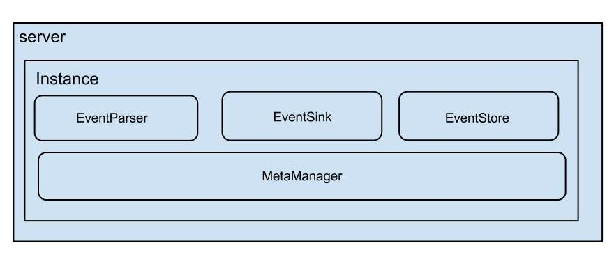

# canal

## 简介

**canal [kə'næl]**，译意为水道/管道/沟渠，主要用途是基于 MySQL 数据库增量日志解析，提供增量数据订阅和消费

早期阿里巴巴因为杭州和美国双机房部署，存在跨机房同步的业务需求，实现方式主要是基于业务 trigger 获取增量变更。从 2010 年开始，业务逐步尝试数据库日志解析获取增量变更进行同步，由此衍生出了大量的数据库增量订阅和消费业务。

基于日志增量订阅和消费的业务包括

- 数据库镜像
- 数据库实时备份
- 索引构建和实时维护(拆分异构索引、倒排索引等)
- 业务 cache 刷新
- 带业务逻辑的增量数据处理

当前的 canal 支持源端 MySQL 版本包括 5.1.x , 5.5.x , 5.6.x , 5.7.x , 8.0.x

GitHub地址： https://github.com/alibaba/canal 

## 工作原理

#### MySQL主备复制原理


- MySQL master 将数据变更写入二进制日志( binary log, 其中记录叫做二进制日志事件binary log events，可以通过 show binlog events 进行查看)
- MySQL slave 将 master 的 binary log events 拷贝到它的中继日志(relay log)
- MySQL slave 重放 relay log 中事件，将数据变更反映它自己的数据

#### canal 工作原理

- canal 模拟 MySQL slave 的交互协议，伪装自己为 MySQL slave ，向 MySQL master 发送dump 协议
- MySQL master 收到 dump 请求，开始推送 binary log 给 slave (即 canal )
- canal 解析 binary log 对象(原始为 byte 流)

## canal架构



- **server代表一个canal运行实例，对应于一个jvm**
- **instance对应于一个数据队列 （1个server可以有1个或多个instance)**

**instance模块：**

- **eventParser (数据源接入，模拟slave协议和master进行交互，协议解析)**
- **eventSink (Parser和Store链接器，进行数据过滤，加工，分发的工作)**
- **eventStore (数据存储)**
- **metaManager (增量订阅&消费信息管理器)**

## 准备

- 对于自建 MySQL , 需要先开启 Binlog 写入功能，配置 binlog-format 为 ROW 模式，my.cnf 中配置如下

  ```
  [mysqld]
  log-bin=mysql-bin # 开启 binlog
  binlog-format=ROW # 选择 ROW 模式
  server_id=1 # 配置 MySQL replaction 需要定义，不要和 canal 的 slaveId 重复
  ```

  - 注意：针对阿里云 RDS for MySQL , 默认打开了 binlog , 并且账号默认具有 binlog dump 权限 , 不需要任何权限或者 binlog 设置,可以直接跳过这一步

- 授权 canal 链接 MySQL 账号具有作为 MySQL slave 的权限, 如果已有账户可直接 grant

  ```
  CREATE USER canal IDENTIFIED BY 'canal';  
  GRANT SELECT, REPLICATION SLAVE, REPLICATION CLIENT ON *.* TO 'canal'@'%';
  -- GRANT ALL PRIVILEGES ON *.* TO 'canal'@'%' ;
  FLUSH PRIVILEGES;
  ```

## 启动

- 下载 canal, 访问 [release 页面](https://github.com/alibaba/canal/releases) , 选择需要的包下载, 如以 1.0.17 版本为例

  ```
  wget https://github.com/alibaba/canal/releases/download/canal-1.0.17/canal.deployer-1.0.17.tar.gz
  ```

- 解压缩

  ```
  mkdir /tmp/canal
  tar zxvf canal.deployer-$version.tar.gz  -C /tmp/canal
  ```

  - 解压完成后，进入 /tmp/canal 目录，可以看到如下结构

    ```
    drwxr-xr-x 2 jianghang jianghang  136 2013-02-05 21:51 bin
    drwxr-xr-x 4 jianghang jianghang  160 2013-02-05 21:51 conf
    drwxr-xr-x 2 jianghang jianghang 1.3K 2013-02-05 21:51 lib
    drwxr-xr-x 2 jianghang jianghang   48 2013-02-05 21:29 logs
    ```

- 配置修改

  ```
  vi conf/example/instance.properties
  ```

  ```
  ## mysql serverId
  canal.instance.mysql.slaveId = 1234
  #position info，需要改成自己的数据库信息
  canal.instance.master.address = 127.0.0.1:3306 
  canal.instance.master.journal.name = 
  canal.instance.master.position = 
  canal.instance.master.timestamp = 
  #canal.instance.standby.address = 
  #canal.instance.standby.journal.name =
  #canal.instance.standby.position = 
  #canal.instance.standby.timestamp = 
  #username/password，需要改成自己的数据库信息
  canal.instance.dbUsername = canal  
  canal.instance.dbPassword = canal
  canal.instance.defaultDatabaseName =
  canal.instance.connectionCharset = UTF-8
  #table regex
  canal.instance.filter.regex = .\*\\\\..\*
  ```

  - canal.instance.connectionCharset 代表数据库的编码方式对应到 java 中的编码类型，比如 UTF-8，GBK , ISO-8859-1
  - 如果系统是1个 cpu，需要将 canal.instance.parser.parallel 设置为 false

- 启动

  ```
  sh bin/startup.sh
  ```

- 查看 server 日志

  ```
  vi logs/canal/canal.log</pre>
  ```

  ```
  2013-02-05 22:45:27.967 [main] INFO  com.alibaba.otter.canal.deployer.CanalLauncher - ## start the canal server.
  2013-02-05 22:45:28.113 [main] INFO  com.alibaba.otter.canal.deployer.CanalController - ## start the canal server[10.1.29.120:11111]
  2013-02-05 22:45:28.210 [main] INFO  com.alibaba.otter.canal.deployer.CanalLauncher - ## the canal server is running now ......
  ```

- 查看 instance 的日志

  ```
  vi logs/example/example.log
  ```

  ```
  2013-02-05 22:50:45.636 [main] INFO  c.a.o.c.i.spring.support.PropertyPlaceholderConfigurer - Loading properties file from class path resource [canal.properties]
  2013-02-05 22:50:45.641 [main] INFO  c.a.o.c.i.spring.support.PropertyPlaceholderConfigurer - Loading properties file from class path resource [example/instance.properties]
  2013-02-05 22:50:45.803 [main] INFO  c.a.otter.canal.instance.spring.CanalInstanceWithSpring - start CannalInstance for 1-example 
  2013-02-05 22:50:45.810 [main] INFO  c.a.otter.canal.instance.spring.CanalInstanceWithSpring - start successful....
  ```

- 关闭

  ```
  sh bin/stop.sh
  ```

## canal实战

### Maven依赖

```
<dependency>
    <groupId>com.alibaba.otter</groupId>
    <artifactId>canal.client</artifactId>
    <version>1.1.0</version>
</dependency>
```

### ClientSample代码

```
package com.alibaba.otter.canal.sample;
import java.net.InetSocketAddress;
import java.util.List;


import com.alibaba.otter.canal.client.CanalConnectors;
import com.alibaba.otter.canal.client.CanalConnector;
import com.alibaba.otter.canal.common.utils.AddressUtils;
import com.alibaba.otter.canal.protocol.Message;
import com.alibaba.otter.canal.protocol.CanalEntry.Column;
import com.alibaba.otter.canal.protocol.CanalEntry.Entry;
import com.alibaba.otter.canal.protocol.CanalEntry.EntryType;
import com.alibaba.otter.canal.protocol.CanalEntry.EventType;
import com.alibaba.otter.canal.protocol.CanalEntry.RowChange;
import com.alibaba.otter.canal.protocol.CanalEntry.RowData;


public class SimpleCanalClientExample {


public static void main(String args[]) {
    // 创建链接
    CanalConnector connector = CanalConnectors.newSingleConnector(new InetSocketAddress(AddressUtils.getHostIp(),
                                                                                        11111), "example", "", "");
    int batchSize = 1000;
    int emptyCount = 0;
    try {
        connector.connect();
        connector.subscribe(".*\\..*");
        connector.rollback();
        int totalEmptyCount = 120;
        while (emptyCount < totalEmptyCount) {
            Message message = connector.getWithoutAck(batchSize); // 获取指定数量的数据
            long batchId = message.getId();
            int size = message.getEntries().size();
            if (batchId == -1 || size == 0) {
                emptyCount++;
                System.out.println("empty count : " + emptyCount);
                try {
                    Thread.sleep(1000);
                } catch (InterruptedException e) {
                }
            } else {
                emptyCount = 0;
                // System.out.printf("message[batchId=%s,size=%s] \n", batchId, size);
                printEntry(message.getEntries());
            }

            connector.ack(batchId); // 提交确认
            // connector.rollback(batchId); // 处理失败, 回滚数据
        }

        System.out.println("empty too many times, exit");
    } finally {
        connector.disconnect();
    }
}

private static void printEntry(List<Entry> entrys) {
    for (Entry entry : entrys) {
        if (entry.getEntryType() == EntryType.TRANSACTIONBEGIN || entry.getEntryType() == EntryType.TRANSACTIONEND) {
            continue;
        }

        RowChange rowChage = null;
        try {
            rowChage = RowChange.parseFrom(entry.getStoreValue());
        } catch (Exception e) {
            throw new RuntimeException("ERROR ## parser of eromanga-event has an error , data:" + entry.toString(),
                                       e);
        }

        EventType eventType = rowChage.getEventType();
        System.out.println(String.format("================&gt; binlog[%s:%s] , name[%s,%s] , eventType : %s",
                                         entry.getHeader().getLogfileName(), entry.getHeader().getLogfileOffset(),
                                         entry.getHeader().getSchemaName(), entry.getHeader().getTableName(),
                                         eventType));

        for (RowData rowData : rowChage.getRowDatasList()) {
            if (eventType == EventType.DELETE) {
                printColumn(rowData.getBeforeColumnsList());
            } else if (eventType == EventType.INSERT) {
                printColumn(rowData.getAfterColumnsList());
            } else {
                System.out.println("-------&gt; before");
                printColumn(rowData.getBeforeColumnsList());
                System.out.println("-------&gt; after");
                printColumn(rowData.getAfterColumnsList());
            }
        }
    }
}

private static void printColumn(List<Column> columns) {
    for (Column column : columns) {
        System.out.println(column.getName() + " : " + column.getValue() + "    update=" + column.getUpdated());
    }
}

}
```

运行Client

启动Canal Client后，可以从控制台从看到类似消息：

```
empty count : 1
empty count : 2
empty count : 3
empty count : 4
```

此时代表当前数据库无变更数据

触发数据库变更

```
mysql> use test;
Database changed
mysql> CREATE TABLE `xdual` (
    ->   `ID` int(11) NOT NULL AUTO_INCREMENT,
    ->   `X` timestamp NOT NULL DEFAULT CURRENT_TIMESTAMP,
    ->   PRIMARY KEY (`ID`)
    -> ) ENGINE=InnoDB AUTO_INCREMENT=3 DEFAULT CHARSET=utf8 ;
Query OK, 0 rows affected (0.06 sec)
mysql> insert into xdual(id,x) values(null,now());Query OK, 1 row affected (0.06 sec)
```

可以从控制台中看到：

```
empty count : 1
empty count : 2
empty count : 3
empty count : 4
================> binlog[mysql-bin.001946:313661577] , name[test,xdual] , eventType : INSERT
ID : 4    update=true
X : 2013-02-05 23:29:46    update=true
```


## 相关开源&产品

- canal 消费端开源项目: Otter
- 阿里巴巴去 Oracle 数据迁移同步工具: yugong
- 阿里巴巴离线同步开源项目 DataX
- 阿里巴巴数据库连接池开源项目 Druid
- 阿里巴巴实时数据同步工具 DTS
- https://github.com/alibaba/canal/wiki
- http://www.bubuko.com/infodetail-1268551.html
- 教程 http://blog.csdn.net/hackerwin7/article/details/37923607
- http://liyonghui160com.iteye.com/blog/2176066

# go-mysql-transfer

go-mysql-transfer是一款MySQL数据库实时增量同步工具。 能够监听MySQL二进制日志(Binlog)的变动，将变更内容形成指定格式的消息，实时发送到接收端。从而在数据库和接收端之间形成一个高性能、低延迟的增量数据同步更新管道。

**特性：**  

1. 简单，不依赖其它组件，一键部署
2. 集成多种接收端，如：Redis、MongoDB、Elasticsearch、RocketMQ、Kafka、RabbitMQ、HTTP API等，无需编写客户端，开箱即用
3. 内置丰富的数据解析、消息生成规则、模板语法
4. 支持Lua脚本扩展，可处理复杂逻辑
5. 集成Prometheus客户端，支持监控告警
6. 集成Web Admin监控页面
7. 支持高可用集群部署
8. 数据同步失败重试
9. 支持全量数据初始化

**与同类工具比较：**

| 特色           | Canal    | mysql_stream     | go-mysql-transfer                                            |
| -------------- | -------- | ---------------- | ------------------------------------------------------------ |
| 开发语言       | Java     | Python           | Golang                                                       |
| 高可用         | 支持     | 支持             | 支持                                                         |
| 接收端         | 编码定制 | Kafka等(MQ)      | Redis、MongoDB、Elasticsearch、RabbitMQ、Kafka、RocketMQ、HTTP API 后续支持更多 |
| 全量数据初始化 | 不支持   | 支持             | 支持                                                         |
| 数据格式       | 编码定制 | Json（固定格式） | Json（规则配置) 模板语法 Lua脚本                             |

 **实现原理：**

1、go-mysql-transfer将自己伪装成MySQL的Slave，

2、向Master发送dump协议获取binlog，解析binlog并生成消息

3、将生成的消息实时、批量发送给接收端

# 利用canal解析本地binlog

```
import com.alibaba.otter.canal.filter.aviater.AviaterRegexFilter;
import com.alibaba.otter.canal.parse.inbound.mysql.LocalBinlogEventParser;
import com.alibaba.otter.canal.parse.index.AbstractLogPositionManager;
import com.alibaba.otter.canal.parse.support.AuthenticationInfo;
import com.alibaba.otter.canal.protocol.CanalEntry;
import com.alibaba.otter.canal.protocol.position.EntryPosition;
import com.alibaba.otter.canal.protocol.position.LogPosition;
import com.alibaba.otter.canal.sink.exception.CanalSinkException;
import org.apache.rocketmq.logging.InternalLogger;
import org.junit.Test;

import java.net.InetSocketAddress;
import java.util.LinkedHashMap;
import java.util.List;
import java.util.Map;
import java.util.concurrent.CountDownLatch;

/**
 * @ClassName LocalBinlogEventParserTest
 * @Description: 本地Binlog回溯
 **/
public class LocalBinlogEventParserTest {
   //自定义日志输出（可以替换log4j输出）
    private final InternalLogger dataChangeLog = DataChangeLogger.getLog("express");
    private static final String MYSQL_ADDRESS = "127.0.0.1";
    private static final String USERNAME      = "canal";
    private static final String PASSWORD      = "canal";
    // 需要提前在该目录放好binlog文件
    private static final String directory = "C:\\project\\canal\\parse\\src\\test\\resources\\binlogs";

    @Test
    public void test() throws InterruptedException {
        final EntryPosition defaultPosition = buildPosition("mysql-bin.000864", null, 1638543000000L);
        final LocalBinlogEventParser controller = new LocalBinlogEventParser();
        controller.setMasterPosition(defaultPosition);
        controller.setMasterInfo(buildAuthentication());
        controller.setDirectory(directory);
        // AbstractCanalEventSinkTest实现CanalEventSink接口
        controller.setEventSink(new AbstractCanalEventSinkTest<List<CanalEntry.Entry>>() {
            @Override
            public boolean sink(List<CanalEntry.Entry> entries, InetSocketAddress inetSocketAddress, String s) throws CanalSinkException, InterruptedException {
                logRecordEntry(entries);
                return true;
            }
        });
        // 过滤（只监听cexpress.po_order的变化）
        controller.setEventFilter(new AviaterRegexFilter("cexpress.po_order"));
        // 设置自定义position管理
        controller.setLogPositionManager(new AbstractLogPositionManager() {

            public void persistLogPosition(String destination, LogPosition logPosition) {
//                System.out.println(logPosition);
            }

            @Override
            public LogPosition getLatestIndexBy(String destination) {
                return null;
            }
        });
        controller.start();

        CountDownLatch countDownLatch = new CountDownLatch(1);
        countDownLatch.await();
    }

    private EntryPosition buildPosition(String binlogFile, Long offest, Long timestamp) {
        return new EntryPosition(binlogFile, offest, timestamp);
    }

    private AuthenticationInfo buildAuthentication() {
        return new AuthenticationInfo(new InetSocketAddress(MYSQL_ADDRESS, 3306), USERNAME, PASSWORD);
    }

    private void logRecordEntry(List<CanalEntry.Entry> entrys) {
        for (CanalEntry.Entry entry : entrys) {
            if (entry.getEntryType() == CanalEntry.EntryType.TRANSACTIONBEGIN
                    || entry.getEntryType() == CanalEntry.EntryType.TRANSACTIONEND) {
                continue;
            }

            if (entry.getEntryType() == CanalEntry.EntryType.ROWDATA) {
                CanalEntry.RowChange rowChange;
                try {
                    rowChange = CanalEntry.RowChange.parseFrom(entry.getStoreValue());
                } catch (Exception e) {
                    throw new RuntimeException("ERROR ## parser of eromanga-event has an error , data:"
                            + entry.toString(), e);
                }

                CanalEntry.EventType eventType = rowChange.getEventType();
                String tableName = entry.getHeader().getTableName();
                for (CanalEntry.RowData rowData : rowChange.getRowDatasList()) {
                    if (eventType == CanalEntry.EventType.DELETE) {
                        List<CanalEntry.Column> beforeColumnsList = rowData.getBeforeColumnsList();
                        Map<String,String> columnDataMap = getColumnDataMap(beforeColumnsList);
                        dataChangeLog.info("删除{}表记录前的数据:{}",tableName, JsonUtil.toJSON(columnDataMap));
                    } else if (eventType == CanalEntry.EventType.INSERT) {
                        List<CanalEntry.Column> afterColumnsList = rowData.getAfterColumnsList();
                        dataChangeLog.info("新增{}表的数据:{}",tableName, LogUtil.generateRowDataLog(afterColumnsList));
                    } else {
                        List<CanalEntry.Column> beforeColumnsList = rowData.getBeforeColumnsList();
                        List<CanalEntry.Column> afterColumnsList = rowData.getAfterColumnsList();
                        dataChangeLog.info("更新{}表的变更数据：{}",tableName,
                                LogUtil.generateRowDataDiffLog(beforeColumnsList,afterColumnsList));
                    }
                }
            }
        }
    }

    private Map<String,String> getColumnDataMap(List<CanalEntry.Column> beforeColumnsList){
        Map<String,String> columnDataMap = new LinkedHashMap<>();
        for(CanalEntry.Column column : beforeColumnsList){
            columnDataMap.put(column.getName(),column.getValue());
        }
        return columnDataMap;
    }
}

```

## 知识科普

mysql的Binlay Log介绍

- http://dev.mysql.com/doc/refman/5.5/en/binary-log.html
- http://www.taobaodba.com/html/474_mysqls-binary-log_details.html

简单点说：

- mysql的binlog是多文件存储，定位一个LogEvent需要通过binlog filename +  binlog position，进行定位
- mysql的binlog数据格式，按照生成的方式，主要分为：statement-based、row-based、mixed。
  1. mysql> show variables like 'binlog_format'; 
  2. +---------------+-------+ 
  3. | Variable_name | Value | 
  4. +---------------+-------+ 
  5. | binlog_format | ROW  | 
  6. +---------------+-------+ 
  7. 1 row in set (0.00 sec) 

目前canal只能支持row模式的增量订阅(statement只有sql，没有数据，所以无法获取原始的变更日志)

 

 

## EventParser设计

大致过程：


整个parser过程大致可分为几步：

1. Connection获取上一次解析成功的位置  (如果第一次启动，则获取初始指定的位置或者是当前数据库的binlog位点)
2. Connection建立链接，发送BINLOG_DUMP指令
    // 0. write command number
    // 1. write 4 bytes bin-log position to start at
    // 2. write 2 bytes bin-log flags
    // 3. write 4 bytes server id of the slave
    // 4. write bin-log file name
3. Mysql开始推送Binaly Log
4. 接收到的Binaly Log的通过Binlog parser进行协议解析，补充一些特定信息
   // 补充字段名字，字段类型，主键信息，unsigned类型处理
5. 传递给EventSink模块进行数据存储，是一个阻塞操作，直到存储成功
6. 存储成功后，定时记录Binaly Log位置

mysql的Binlay Log网络协议：


 

说明：

- 图中的协议4byte header，主要是描述整个binlog网络包的length
- binlog event structure，详细信息请参考： http://dev.mysql.com/doc/internals/en/binary-log.html

## EventSink设计


说明：

- 数据过滤：支持通配符的过滤模式，表名，字段内容等
- 数据路由/分发：解决1:n (1个parser对应多个store的模式)
- 数据归并：解决n:1 (多个parser对应1个store)
- 数据加工：在进入store之前进行额外的处理，比如join

### 数据1:n业务

 为了合理的利用数据库资源， 一般常见的业务都是按照schema进行隔离，然后在mysql上层或者dao这一层面上，进行一个数据源路由，屏蔽数据库物理位置对开发的影响，阿里系主要是通过cobar/tddl来解决数据源路由问题。

 所以，一般一个数据库实例上，会部署多个schema，每个schema会有由1个或者多个业务方关注

 

### 数据n:1业务

 同样，当一个业务的数据规模达到一定的量级后，必然会涉及到水平拆分和垂直拆分的问题，针对这些拆分的数据需要处理时，就需要链接多个store进行处理，消费的位点就会变成多份，而且数据消费的进度无法得到尽可能有序的保证。

 所以，在一定业务场景下，需要将拆分后的增量数据进行归并处理，比如按照时间戳/全局id进行排序归并.

 

## EventStore设计

- \1.  目前仅实现了Memory内存模式，后续计划增加本地file存储，mixed混合模式
- \2.  借鉴了Disruptor的RingBuffer的实现思路

RingBuffer设计：


定义了3个cursor

- Put :  Sink模块进行数据存储的最后一次写入位置
- Get :  数据订阅获取的最后一次提取位置
- Ack :  数据消费成功的最后一次消费位置

借鉴Disruptor的RingBuffer的实现，将RingBuffer拉直来看：


实现说明：

- Put/Get/Ack cursor用于递增，采用long型存储
- buffer的get操作，通过取余或者与操作。(与操作： cusor & (size - 1) , size需要为2的指数，效率比较高)

## Instance设计


 

instance代表了一个实际运行的数据队列，包括了EventPaser,EventSink,EventStore等组件。

抽象了CanalInstanceGenerator，主要是考虑配置的管理方式：

- manager方式： 和你自己的内部web console/manager系统进行对接。(目前主要是公司内部使用)
- spring方式：基于spring xml + properties进行定义，构建spring配置. 

## Server设计


server代表了一个canal的运行实例，为了方便组件化使用，特意抽象了Embeded(嵌入式) / Netty(网络访问)的两种实现

- Embeded :  对latency和可用性都有比较高的要求，自己又能hold住分布式的相关技术(比如failover)
- Netty :  基于netty封装了一层网络协议，由canal server保证其可用性，采用的pull模型，当然latency会稍微打点折扣，不过这个也视情况而定。(阿里系的notify和metaq，典型的 push/pull模型，目前也逐步的在向pull模型靠拢，push在数据量大的时候会有一些问题) 

## 增量订阅/消费设计


具体的协议格式，可参见：[CanalProtocol.proto](https://github.com/alibabatech/canal/blob/master/protocol/src/main/java/com/alibaba/otter/canal/protocol/CanalProtocol.proto)

get/ack/rollback协议介绍：

- Message getWithoutAck(int batchSize)，允许指定batchSize，一次可以获取多条，每次返回的对象为Message，包含的内容为：
  a. batch id 唯一标识
  b. entries 具体的数据对象，对应的数据对象格式：[EntryProtocol.proto](https://github.com/alibabatech/canal/blob/master/protocol/src/main/java/com/alibaba/otter/canal/protocol/EntryProtocol.proto)
- void rollback(long batchId)，顾命思议，回滚上次的get请求，重新获取数据。基于get获取的batchId进行提交，避免误操作
- void ack(long batchId)，顾命思议，确认已经消费成功，通知server删除数据。基于get获取的batchId进行提交，避免误操作

canal的get/ack/rollback协议和常规的jms协议有所不同，允许get/ack异步处理，比如可以连续调用get多次，后续异步按顺序提交ack/rollback，项目中称之为流式api. 

流式api设计的好处：

- get/ack异步化，减少因ack带来的网络延迟和操作成本 (99%的状态都是处于正常状态，异常的rollback属于个别情况，没必要为个别的case牺牲整个性能)
- get获取数据后，业务消费存在瓶颈或者需要多进程/多线程消费时，可以不停的轮询get数据，不停的往后发送任务，提高并行化.  (作者在实际业务中的一个case：业务数据消费需要跨中美网络，所以一次操作基本在200ms以上，为了减少延迟，所以需要实施并行化)

流式api设计：


- 每次get操作都会在meta中产生一个mark，mark标记会递增，保证运行过程中mark的唯一性
- 每次的get操作，都会在上一次的mark操作记录的cursor继续往后取，如果mark不存在，则在last ack cursor继续往后取
- 进行ack时，需要按照mark的顺序进行数序ack，不能跳跃ack. ack会删除当前的mark标记，并将对应的mark位置更新为last ack cusor
- 一旦出现异常情况，客户端可发起rollback情况，重新置位：删除所有的mark, 清理get请求位置，下次请求会从last ack cursor继续往后取

### 数据对象格式：[EntryProtocol.proto](https://github.com/alibabatech/canal/blob/master/protocol/src/main/java/com/alibaba/otter/canal/protocol/EntryProtocol.proto)

1. Entry 
2.   Header 
3. ​    logfileName [binlog文件名] 
4. ​    logfileOffset [binlog position] 
5. ​    executeTime [发生的变更] 
6. ​    schemaName  
7. ​    tableName 
8. ​    eventType [insert/update/delete类型] 
9.   entryType  [事务头BEGIN/事务尾END/数据ROWDATA] 
10.   storeValue [**byte数据,可展开，对应的类型为RowChange]** 
11.    
12. RowChange 
13.   isDdl    [是否是ddl变更操作，比如create table/drop table] 
14.   sql   [具体的ddl sql] 
15.   rowDatas  [具体insert/update/delete的变更数据，可为多条，1个binlog event事件可对应多条变更，比如批处理] 
16. ​    beforeColumns [Column类型的数组] 
17. ​    afterColumns [Column类型的数组] 
18. ​     
19. Column  
20.   index     
21.   sqlType   [jdbc type] 
22.   name    [column name] 
23.   isKey    [是否为主键] 
24.   updated   [是否发生过变更] 
25.   isNull   [值是否为**null]** 
26.   value    [具体的内容，注意为文本] 

说明：

- 可以提供数据库变更前和变更后的字段内容，针对binlog中没有的name,isKey等信息进行补全
- 可以提供ddl的变更语句

 

## HA机制设计

canal的ha分为两部分，canal server和canal client分别有对应的ha实现

- canal server:  为了减少对mysql dump的请求，不同server上的instance要求同一时间只能有一个处于running，其他的处于standby状态. 
- canal client: 为了保证有序性，一份instance同一时间只能由一个canal client进行get/ack/rollback操作，否则客户端接收无法保证有序。

整个HA机制的控制主要是依赖了zookeeper的几个特性，watcher和EPHEMERAL节点(和session生命周期绑定)，可以看下我之前zookeeper的相关文章。

 

Canal Server: 


大致步骤：

1. canal server要启动某个canal instance时都先向zookeeper进行一次尝试启动判断  (实现：创建EPHEMERAL节点，谁创建成功就允许谁启动)
2. 创建zookeeper节点成功后，对应的canal server就启动对应的canal instance，没有创建成功的canal instance就会处于standby状态
3. 一旦zookeeper发现canal server A创建的节点消失后，立即通知其他的canal server再次进行步骤1的操作，重新选出一个canal server启动instance.
4. canal client每次进行connect时，会首先向zookeeper询问当前是谁启动了canal instance，然后和其建立链接，一旦链接不可用，会重新尝试connect.

Canal Client的方式和canal server方式类似，也是利用zokeeper的抢占EPHEMERAL节点的方式进行控制. 

 

## 最后

项目的代码： https://github.com/alibabatech/canal

这里给出了如何快速启动Canal Server和Canal Client的例子，如有问题可随时联系

## Quick Start

- http://agapple.iteye.com/blog/1796070
- https://github.com/alibabatech/canal/wiki/QuickStart

## Client Example

- - http://agapple.iteye.com/blog/1796620
  - [https://github.com/alibabatech/canal/wiki/ClientExample](https://github.com/alibabatech/canal/wiki/ClientExampl)


源码模块：

##### 模块虽多，但是每个模块的代码都很少。各个模块的效果如下所示：

common模块：首要是供给了一些公共的东西类和接口。

client模块：canal的客户端。中心接口为CanalConnector

example模块：供给client模块运用案例。

protocol模块：client和server模块之间的通讯协议

deployer：安顿模块。经过该模块供给的CanalLauncher来建议canal server

server模块：canal服务器端。中心接口为CanalServer

instance模块：一个server有多个instance。每个instance都会仿照成一个mysql实例的slave。instance模块有四个中心组成部分：parser模块、sink模块、store模块，meta模块。中心接口为CanalInstance

parser模块：数据源接入，仿照slave协议和master进行交互，协议解析。parser模块依托于dbsync、driver模块。

driver模块和dbsync模块：从这两个模块的artifactId(canal.parse.driver、canal.parse.dbsync)，就能够看出来，这两个模块实践上是parser模块的组件。事实上parser 是经过driver模块与mysql树立联接，然后获取到binlog。由于原始的binlog都是二进制流，需求解析成对应的binlog作业，这些binlog作业政策都界说在dbsync模块中，dbsync 模块来自于淘宝的tddl。

sink模块：parser和store链接器，进行数据过滤，加工，分发的作业。中心接口为CanalEventSink

store模块：数据存储。中心接口为CanalEventStore

meta模块：增量订阅&消费信息处理器，中心接口为CanalMetaManager，首要用于记载canal消费到的mysql binlog的方位，

##### 下面再经过一张图来阐明各个模块之间的依托联系：

[](https://www.6hu.cc/wp-content/uploads/2021/02/10836-PWw4ej.png)
经过deployer模块，发起一个canal-server，一个cannal-server内部包括多个instance，每个instance都会伪装成一个mysql实例的slave。client与server之间的通讯协议由protocol模块界说。client在订阅binlog信息时，需求传递一个destination参数，server会依据这个destination供认由哪一个instance为其供给服务。

#### 咱们先看一下deployer模块：

canal有两种运用办法：1、独立安顿 2、内嵌到运用中。 deployer模块首要用于独立安顿canal server。关于这两种办法的差异，请拜见server模块源码剖析。deployer模块源码目录结构如下所示：

[](https://www.6hu.cc/wp-content/uploads/2021/02/10836-etlOfD.png)

##### deployer模块首要完毕以下功用：

> - 读取canal,properties装备文件
> - 建议canal server，监听canal client的央求
> - 建议canal instance，联接mysql数据库，伪装成slave，解析binlog
> - 在canal的作业进程中，监听装备文件的改动

startup.sh脚本内，会调用com.alibaba.otter.canal.deployer.CanalLauncher类来进行建议，这是剖析Canal源码的进口类，如下图所示：
[](https://www.6hu.cc/wp-content/uploads/2021/02/10836-hFJ06V.png)

##### 所以咱们来解析一下CanalLauncher类

> - 读取canal.properties文件中的装备
> - 运用读取的装备结构一个CanalController实例，将悉数的建议操作都委派给CanalController进行处理。
> - 毕竟注册一个钩子函数，在JVM间断时同时也连续canal server。

```java
public class CanalLauncher {
private static final String CLASSPATH_URL_PREFIX = "classpath:";
private static final Logger logger               = LoggerFactory.getLogger(CanalLauncher.class);
public static void main(String[] args) throws Throwable {
try {
//1、读取canal.properties文件中装备，默许读取classpath下的canal.properties
String conf = System.getProperty("canal.conf", "classpath:canal.properties");
Properties properties = new Properties();
if (conf.startsWith(CLASSPATH_URL_PREFIX)) {
conf = StringUtils.substringAfter(conf, CLASSPATH_URL_PREFIX);
properties.load(CanalLauncher.class.getClassLoader().getResourceAsStream(conf));
} else {
properties.load(new FileInputStream(conf));
}
//2、建议canal，首要将properties政策传递给CanalController，然后调用其start办法建议
logger.info("## start the canal server.");
final CanalController controller = new CanalController(properties);
controller.start();
logger.info("## the canal server is running now ......");
//3、封闭canal，经过增加JVM的钩子，JVM连续前会回调run办法，其内部调用controller.stop()办法进行连续
Runtime.getRuntime().addShutdownHook(new Thread() {
public void run() {
try {
logger.info("## stop the canal server");
controller.stop();
} catch (Throwable e) {
logger.warn("##something goes wrong when stopping canal Server:n{}",
ExceptionUtils.getFullStackTrace(e));
} finally {
logger.info("## canal server is down.");
}
}
});
} catch (Throwable e) {
logger.error("## Something goes wrong when starting up the canal Server:n{}",
ExceptionUtils.getFullStackTrace(e));
System.exit(0);
}
}
}
```

能够看到，CanalLauncher实践上仅仅担任读取canal.properties装备文件，然后结构CanalController政策，并经过其start和stop办法来敞开和连续canal。因而，假设说CanalLauncher是canal源码剖析的进口类，那么CanalController便是canal源码剖析的中心类。

在CanalController的结构办法中，会对装备文件内容解析，初始化相关成员变量，做好canal server的建议前的准备作业，之后在CanalLauncher中调用CanalController.start办法来建议。

```
public class CanalController {
private static final Logger  logger   = LoggerFactory.getLogger(CanalController.class);
private Long                                     cid;
private String                                   ip;
private int                                  port;
// 默许运用spring的办法载入
private Map<String, InstanceConfig>              instanceConfigs;
private InstanceConfig                           globalInstanceConfig;
private Map<String, CanalConfigClient>           managerClients;
// 监听instance config的改动
private boolean                             autoScan = true;
private InstanceAction                           defaultAction;
private Map<InstanceMode, InstanceConfigMonitor> instanceConfigMonitors;
private CanalServerWithEmbedded                  embededCanalServer;
private CanalServerWithNetty                     canalServer;
private CanalInstanceGenerator                   instanceGenerator;
private ZkClientx                                zkclientx;
public CanalController(){
this(System.getProperties());
}
public CanalController(final Properties properties){
managerClients = MigrateMap.makeComputingMap(new Function<String, CanalConfigClient&gt;() {
public CanalConfigClient apply(String managerAddress) {
return getManagerClient(managerAddress);
}
});
//1、装备解析
globalInstanceConfig = initGlobalConfig(properties);
instanceConfigs = new MapMaker().makeMap();
initInstanceConfig(properties);
// 2、准备canal server
cid = Long.valueOf(getProperty(properties, CanalConstants.CANAL_ID));
ip = getProperty(properties, CanalConstants.CANAL_IP);
port = Integer.valueOf(getProperty(properties, CanalConstants.CANAL_PORT));
embededCanalServer = CanalServerWithEmbedded.instance();
embededCanalServer.setCanalInstanceGenerator(instanceGenerator);// 设置自界说的instanceGenerator
canalServer = CanalServerWithNetty.instance();
canalServer.setIp(ip);
canalServer.setPort(port);
//3、初始化zk相关代码
// 处理下ip为空，默许运用hostIp露出到zk中
if (StringUtils.isEmpty(ip)) {
ip = AddressUtils.getHostIp();
}
final String zkServers = getProperty(properties, CanalConstants.CANAL_ZKSERVERS);
if (StringUtils.isNotEmpty(zkServers)) {
zkclientx = ZkClientx.getZkClient(zkServers);
// 初始化体系目录
zkclientx.createPersistent(ZookeeperPathUtils.DESTINATION_ROOT_NODE, true);
zkclientx.createPersistent(ZookeeperPathUtils.CANAL_CLUSTER_ROOT_NODE, true);
}
//4 CanalInstance作业状况监控
final ServerRunningData serverData = new ServerRunningData(cid, ip + ":" + port);
ServerRunningMonitors.setServerData(serverData);
ServerRunningMonitors.setRunningMonitors(//...);
//5、autoScan机制相关代码
autoScan = BooleanUtils.toBoolean(getProperty(properties, CanalConstants.CANAL_AUTO_SCAN));
if (autoScan) {
defaultAction = new InstanceAction() {//....};
instanceConfigMonitors = //....
}
}
....
}
```

为了读者能够尽量简略的看出CanalController的结构办法中都做了什么，上面代码片段中省掉了部分代码。这样，咱们能够很显着的看出来， ，在CanalController结构办法中的代码分差异为了固定的几个处理进程，下面依照几个进程的差异，逐一进行解说，并具体的介绍CanalController中界说的各个字段的效果。

##### 装备解析相关代码

```
// 初始化大局参数设置
globalInstanceConfig = initGlobalConfig(properties);
instanceConfigs = new MapMaker().makeMap();
// 初始化instance config
initInstanceConfig(properties);
```

标明canal instance的大局装备，类型为InstanceConfig，经过initGlobalConfig办法进行初始化。首要用于解析canal.properties以下几个装备项：

> - canal.instance.global.mode：供认canal instance装备加载办法，取值有manager|spring两种办法
> - canal.instance.global.lazy：供认canal instance是否推延初始化
> - canal.instance.global.manager.address：装备中心地址。假定canal.instance.global.mode=manager，需求供给此装备项
> - canal.instance.global.spring.xml：spring装备文件途径。假定canal.instance.global.mode=spring，需求供给此装备项

initGlobalConfig源码如下所示：

```
private InstanceConfig initGlobalConfig(Properties properties) {
InstanceConfig globalConfig = new InstanceConfig();
//读取canal.instance.global.mode
String modeStr = getProperty(properties, CanalConstants.getInstanceModeKey(CanalConstants.GLOBAL_NAME));
if (StringUtils.isNotEmpty(modeStr)) {
//将modelStr转成枚举InstanceMode，这是一个枚举类，只需2个取值，SPRINGMANAGER，对应两种装备办法
globalConfig.setMode(InstanceMode.valueOf(StringUtils.upperCase(modeStr)));
}
//读取canal.instance.global.lazy
String lazyStr = getProperty(properties, CanalConstants.getInstancLazyKey(CanalConstants.GLOBAL_NAME));
if (StringUtils.isNotEmpty(lazyStr)) {
globalConfig.setLazy(Boolean.valueOf(lazyStr));
}
//读取canal.instance.global.manager.address
String managerAddress = getProperty(properties,
CanalConstants.getInstanceManagerAddressKey(CanalConstants.GLOBAL_NAME));
if (StringUtils.isNotEmpty(managerAddress)) {
globalConfig.setManagerAddress(managerAddress);
}
//读取canal.instance.global.spring.xml
String springXml = getProperty(properties, CanalConstants.getInstancSpringXmlKey(CanalConstants.GLOBAL_NAME));
if (StringUtils.isNotEmpty(springXml)) {
globalConfig.setSpringXml(springXml);
}
instanceGenerator = //...初始化instanceGenerator
return globalConfig;
}
```

其间canal.instance.global.mode用于供认canal instance的大局装备加载办法，其取值规模有2个：spring、manager。咱们知道一个canal server中能够发起多个canal instance，每个instance都有各自的装备。instance的装备也能够放在本地，也能够放在长途装备中心里。咱们能够自界说每个canal instance装备文件存储的方位，假定悉数canal instance的装备都在本地或许长途，此刻咱们就能够经过canal.instance.global.mode这个装备项，来共同的指定配备文件的方位，防止为每个canal instance独自指定。

spring办法：

标明悉数的canal instance的装备文件坐落本地。此刻，咱们有必要供给装备项canal.instance.global.spring.xml指定spring装备文件的途径。canal供给了多个spring装备文件：file-instance.xml、default-instance.xml、memory-instance.xml、local-instance.xml、group-instance.xml。这么多装备文件首要是为了支撑canal instance不同的作业办法。咱们在稍后将会解说各个装备文件的差异。而在这些装备文件的开始，咱们无一例外的能够看到以下装备：

```
<bean class="com.alibaba.otter.canal.instance.spring.support.PropertyPlaceholderConfigurer" lazy-init="false">
<property name="ignoreResourceNotFound" value="true" />
<property name="systemPropertiesModeName" value="SYSTEM_PROPERTIES_MODE_OVERRIDE"/><!-- 允许system掩盖 -->
<property name="locationNames"&gt;
<list>
<value>classpath:canal.properties</value>
&lt;value>classpath:${canal.instance.destination:}/instance.properties</value>
</list>
</property>
</bean>
```

这儿咱们能够看到，所谓经过spring办法加载canal instance装备，无非便是经过spring供给的PropertyPlaceholderConfigurer来加载canal instance的装备文件instance.properties。

这儿instance.properties的文件无缺途径是canal.instance.destination:/instance.properties，其间{canal.instance.destination:}/instance.properties，其间canal.instance.destination:/instance.properties，其中{canal.instance.destination}是一个变量。这是由于咱们能够在一个canal server中装备多个canal instance，每个canal instance装备文件的称号都是instance.properties，因而咱们需求通过目录进行差异。例如咱们经过装备项canal.destinations指定多个canal instance的姓名

```
canal.destinations= example1,example2
```

此时咱们就要conf目录下，新建两个子目录example1和example2，每个目录下各自放置一个instance.properties。

canal在初始化时就会别离运用example1和example2来替换${canal.instance.destination:}，然后别离依据example1/instance.properties和example2/instance.properties创立2个canal instance。

manager办法：

标明悉数的canal instance的装备文件坐落长途装备中心，此刻咱们有必要供给装备项 canal.instance.global.manager.address来指定长途装备中心的地址。现在alibaba内部装备运用这种办法。开发者能够自己完毕CanalConfigClient，联接各自的处理体系，完毕接入。

#### 准备canal server相关代码

```
cid = Long.valueOf(getProperty(properties, CanalConstants.CANAL_ID));
ip = getProperty(properties, CanalConstants.CANAL_IP);
port = Integer.valueOf(getProperty(properties, CanalConstants.CANAL_PORT));
embededCanalServer = CanalServerWithEmbedded.instance();
embededCanalServer.setCanalInstanceGenerator(instanceGenerator);// 设置自界说的instanceGenerator
canalServer = CanalServerWithNetty.instance();
canalServer.setIp(ip);
canalServer.setPort(port);
```

上述代码中，首要解析了cid、ip、port字段，其间：

cid：Long，对应canal.properties文件中的canal.id，现在无实践用处

ip：String，对应canal.properties文件中的canal.ip，canal server监听的ip。

port：int，对应canal.properties文件中的canal.port，canal server监听的端口
之后别离为以下两个字段赋值：

embededCanalServer：类型为CanalServerWithEmbedded

canalServer：类型为CanalServerWithNetty

CanalServerWithEmbedded 和 CanalServerWithNetty都完毕了CanalServer接口，且都完毕了单例办法，经过静态办法instance获取实例。

关于这两种类型的完毕，canal官方文档有以下描绘：
[](https://www.6hu.cc/wp-content/uploads/2021/02/10836-ZRzdvT.png)
说白了，便是咱们能够不用独立安顿canal server。在运用直接运用CanalServerWithEmbedded直连mysql数据库。假定觉得自己的技术hold不住相关代码，就独立安顿一个canal server，运用canal供给的客户端，联接canal server获取binlog解析后数据。而CanalServerWithNetty是在CanalServerWithEmbedded的根底上做的一层封装，用于与客户端通讯。

在独立安顿canal server时，Canal客户端发送的悉数央求都交给CanalServerWithNetty处理解析，解析完毕之后委派给了交给CanalServerWithEmbedded进行处理。因而CanalServerWithNetty便是一个马甲罢了。CanalServerWithEmbedded才是中心。

因而，在上述代码中，咱们看到，用于生成CanalInstance实例的instanceGenerator被设置到了CanalServerWithEmbedded中，而ip和port被设置到CanalServerWithNetty中。

关于CanalServerWithNetty怎样将客户端的央求委派给CanalServerWithEmbedded进行处理，咱们将在server模块源码剖析中进行解说。

#### 初始化zk相关代码

```
 //读取canal.properties中的装备项canal.zkServers，假定没有这个配备，则标明项目不运用zk
final String zkServers = getProperty(properties, CanalConstants.CANAL_ZKSERVERS);
if (StringUtils.isNotEmpty(zkServers)) {
//创立zk实例
zkclientx = ZkClientx.getZkClient(zkServers);
// 初始化体系目录
//destination列表，途径为/otter/canal/destinations
zkclientx.createPersistent(ZookeeperPathUtils.DESTINATION_ROOT_NODE, true);
//整个canal server的集群列表，途径为/otter/canal/cluster
zkclientx.createPersistent(ZookeeperPathUtils.CANAL_CLUSTER_ROOT_NODE, true);
}
```

canal支撑运用了zk来完毕HA机制、以及将当时消费到到的mysql的binlog方位记载到zk中。ZkClientx是canal对ZkClient进行了一层简略的封装。

显着，当咱们没有装备canal.zkServers，那么zkclientx不会被初始化。

关于Canal怎样运用ZK做HA，咱们将在稍后的代码中进行分。而运用zk记载binlog的消费进展，将在之后的章节进行剖析。

#### CanalInstance作业状况监控相关代码

由于这段代码比较长且恶心，这儿笔者暂时对部分代码进行省掉，以便读者看清楚整各条理

```
final ServerRunningData serverData = new ServerRunningData(cid, ip + ":" + port);
ServerRunningMonitors.setServerData(serverData);
ServerRunningMonitors.setRunningMonitors(MigrateMap.makeComputingMap(new Function<String, ServerRunningMonitor>() {
public ServerRunningMonitor apply(final String destination) {
ServerRunningMonitor runningMonitor = new ServerRunningMonitor(serverData);
runningMonitor.setDestination(destination);
runningMonitor.setListener(new ServerRunningListener() {....});//省掉ServerRunningListener的详细完毕
if (zkclientx != null) {
runningMonitor.setZkClient(zkclientx);
}
// 触发创立一下cid节点
runningMonitor.init();
return runningMonitor;
}
}));
```

上述代码中，ServerRunningMonitors是ServerRunningMonitor政策的容器，而ServerRunningMonitor用于监控CanalInstance。

```
canal会为每一个destination创立一个CanalInstance，每个CanalInstance都会由一个ServerRunningMonitor来进行监控。而ServerRunningMonitor共同由ServerRunningMonitors进行处理。
除了CanalInstance需求监控，CanalServer本身也需求监控。因而咱们在代码一开始，就看到往ServerRunningMonitors设置了一个ServerRunningData政策，封装了canal server监听的ip和端口等信息。
```

ServerRunningMonitors源码如下所示：

```
public class ServerRunningMonitors {
private static ServerRunningData serverData;
private static Map               runningMonitors; // <String,ServerRunningMonitor>
public static ServerRunningData getServerData() {
return serverData;
}
public static Map<String, ServerRunningMonitor> getRunningMonitors() {
return runningMonitors;
}
public static ServerRunningMonitor getRunningMonitor(String destination) {
return (ServerRunningMonitor) runningMonitors.get(destination);
}
public static void setServerData(ServerRunningData serverData) {
ServerRunningMonitors.serverData = serverData;
}
public static void setRunningMonitors(Map runningMonitors) {
ServerRunningMonitors.runningMonitors = runningMonitors;
}
}
```

ServerRunningMonitors的setRunningMonitors办法接收的参数是一个Map，其间Map的key是destination，value是ServerRunningMonitor，也便是说针对每一个destination都有一个ServerRunningMonitor来监控。

上述代码中，在往ServerRunningMonitors设置Map时，是经过MigrateMap.makeComputingMap办法来创立的，其接受一个Function类型的参数，这是guava中界说的接口，其声清楚apply笼统办法。其作业原理能够经过下面代码片段进行介绍：

```
Map<String, User> map = MigrateMap.makeComputingMap(new Function<String, User>() {
@Override
public User apply(String name) {
return new User(name);
}
});
User user = map.get("tianshouzhi");//第一次获取时会创立
assert user != null;
assert user == map.get("tianshouzhi");//之后获取，总是回来之前现已创立的政策
```

这段代码中，咱们运用MigrateMap.makeComputingMap创立了一个Map，其间key为String类型，value为User类型。当咱们调用map.get(“tianshouzhi”)办法，开始步这个Map中并没有任何key/value的，所以其就会回调Function的apply办法，运用参数”tianshouzhi”创立一个User政策并回来。之后当咱们再以”tianshouzhi”为key从Map中获取User政策时，会直接将前面创立的政策回来。不会回调apply办法，也便是说，只需在第一次查验获取时，才会回调apply办法。

```
而在上述代码中，实践上就运用了这个特性，只不过是依据destination获取ServerRunningMonitor政策，假定不存在就创立。
```

在创立ServerRunningMonitor政策时，首要依据ServerRunningData创立ServerRunningMonitor实例，之后设置了destination和ServerRunningListener政策，接着，判别假定zkClientx字段假定不为空，也设置到ServerRunningMonitor中，毕竟调用init办法进行初始化。

```
ServerRunningMonitor runningMonitor = new ServerRunningMonitor(serverData);
runningMonitor.setDestination(destination);
runningMonitor.setListener(new ServerRunningListener(){...})//省掉ServerRunningListener详细代码
if (zkclientx != null) {
runningMonitor.setZkClient(zkclientx);
}
// 触发创立一下cid节点
runningMonitor.init();
return runningMonitor;
```

ServerRunningListener的完毕如下：

```
new ServerRunningListener() {
/*内部调用了embededCanalServer的start(destination)办法。
此处需求划要点，阐明每个destination对应的CanalInstance是经过embededCanalServer的start办法建议的，
这与咱们之前剖析将instanceGenerator设置到embededCanalServer中能够对应上。
embededCanalServer担任调用instanceGenerator生成CanalInstance实例，并担任其建议。*/
public void processActiveEnter() {
try {
MDC.put(CanalConstants.MDC_DESTINATION, String.valueOf(destination));
embededCanalServer.start(destination);
} finally {
MDC.remove(CanalConstants.MDC_DESTINATION);
}
}
//内部调用embededCanalServer的stop(destination)办法。与上start办法类似，只不过是连续CanalInstance。
public void processActiveExit() {
try {
MDC.put(CanalConstants.MDC_DESTINATION, String.valueOf(destination));
embededCanalServer.stop(destination);
} finally {
MDC.remove(CanalConstants.MDC_DESTINATION);
}
}
/*处理存在zk的状况下，在Canalinstance建议之前，在zk中创立节点。
途径为：/otter/canal/destinations/{0}/cluster/{1}，其0会被destination替换，1会被ip:port替换。
此办法会在processActiveEnter()之前被调用*/
public void processStart() {
try {
if (zkclientx != null) {
final String path = ZookeeperPathUtils.getDestinationClusterNode(destination, ip + ":" + port);
initCid(path);
zkclientx.subscribeStateChanges(new IZkStateListener() {
public void handleStateChanged(KeeperState state) throws Exception {
}
public void handleNewSession() throws Exception {
initCid(path);
}
});
}
} finally {
MDC.remove(CanalConstants.MDC_DESTINATION);
}
}
//处理存在zk的状况下，在Canalinstance连续前，开释zk节点，途径为/otter/canal/destinations/{0}/cluster/{1}，
//其0会被destination替换，1会被ip:port替换。此办法会在processActiveExit()之前被调用
public void processStop() {
try {
MDC.put(CanalConstants.MDC_DESTINATION, String.valueOf(destination));
if (zkclientx != null) {
final String path = ZookeeperPathUtils.getDestinationClusterNode(destination, ip + ":" + port);
releaseCid(path);
}
} finally {
MDC.remove(CanalConstants.MDC_DESTINATION);
}
}
}
```

上述代码中，咱们能够看到建议一个CanalInstance实践上是在ServerRunningListener的processActiveEnter办法中，经过调用embededCanalServer的start(destination)办法进行的，关于连续也是类似。

那么ServerRunningListener中的相关办法到底是在哪里回调的呢？咱们能够在ServerRunningMonitor的start和stop办法中找到答案，这儿只列出start办法。

```
public class ServerRunningMonitor extends AbstractCanalLifeCycle {
...
public void start() {
super.start();
processStart();//其内部会调用ServerRunningListener的processStart()办法
if (zkClient != null) {//存在zk，以HA办法建议
// 假设需求尽或许开释instance资源，不需求监听running节点，否则即使stop了这台机器，另一台机器立马会start
String path = ZookeeperPathUtils.getDestinationServerRunning(destination);
zkClient.subscribeDataChanges(path, dataListener);
initRunning();
} else {//没有zk，直接建议
processActiveEnter();
}
}
//...stop办法逻辑类似，相关代码省掉
}
```

当ServerRunningMonitor的start办法被调用时，其首要会直接调用processStart办法，这个办法内部直接调了ServerRunningListener的processStart()办法，源码如下所示。经过前面的分析，咱们现已知道在存在zkClient!=null的状况，会往zk中创立一个节点。

```
private void processStart() {
if (listener != null) {
try {
listener.processStart();
} catch (Exception e) {
logger.error("processStart failed", e);
}
}
}
```

之后会判别是否存在zkClient，假设不存在，则以本地办法建议，假定存在，则以HA办法建议。咱们知道，canal server能够安顿成两种办法：集群办法或许独立安顿。其间集群办法是运用zk来做HA，独立安顿则能够直接进行建议。咱们先来看比较简略的直接建议。

直接建议：

不存在zk的状况下，会进入else代码块，调用processActiveEnter办法，其内部调用了listener的processActiveEnter，建议相应destination对应的CanalInstance。

```
private void processActiveEnter() {
if (listener != null) {
try {
listener.processActiveEnter();
} catch (Exception e) {
logger.error("processActiveEnter failed", e);
}
}
}
```

HA办法建议：

存在zk，说明canal server或许做了集群，由于canal便是运用zk来做HA的。首要依据destination结构一个zk的节点途径，然后进行监听。

```
/*构建暂时节点的途径：/otter/canal/destinations/{0}/running，其间占位符{0}会被destination替换。
在集群办法下，或许会有多个canal server一同处理同一个destination，
在某一时间，只能由一个canal server进行处理，处理这个destination的canal server进入running状况，其他canal server进入standby状况。*/
String path = ZookeeperPathUtils.getDestinationServerRunning(destination);
/*对destination对应的running节点进行监听，一旦产生了改动，则阐明或许其他处理相同destination的canal server或许呈现了失常，
此刻需求查验自己进入running状况。*/
zkClient.subscribeDataChanges(path, dataListener);
```

上述仅仅监听代码，之后查验调用initRunning办法经过HA的办法来建议CanalInstance。

```
private void initRunning() {
if (!isStart()) {
return;
}
//构建暂时节点的途径：/otter/canal/destinations/{0}/running，其间占位符{0}会被destination替换
String path = ZookeeperPathUtils.getDestinationServerRunning(destination);
// 序列化
//构建暂时节点的数据，符号当时destination由哪一个canal server处理
byte[] bytes = JsonUtils.marshalToByte(serverData);
try {
mutex.set(false);
//查验创立暂时节点。假定节点现已存在，阐明是其他的canal server现已建议了这个canal instance。
//此刻会抛出ZkNodeExistsException，进入catch代码块。
zkClient.create(path, bytes, CreateMode.EPHEMERAL);
activeData = serverData;
processActiveEnter();//假定创立成功，触发一下作业，内部调用ServerRunningListener的processActiveEnter办法
mutex.set(true);
} catch (ZkNodeExistsException e) {
//创立节点失利，则依据path从zk中获取当时是哪一个canal server创立了当时canal instance的相关信息。
//第二个参数true，标明的是，假定这个path不存在，则回来null。
bytes = zkClient.readData(path, true);
if (bytes == null) {// 假定不存在节点，当即查验一次
initRunning();
} else {
//假定的确存在，则将创立该canal instance实例信息存入activeData中。
activeData = JsonUtils.unmarshalFromByte(bytes, ServerRunningData.class);
}
} catch (ZkNoNodeException e) {//假定/otter/canal/destinations/{0}/节点不存在，进行创立其间占位符{0}会被destination替换
zkClient.createPersistent(ZookeeperPathUtils.getDestinationPath(destination), true);
// 查验创立父节点
initRunning();
}
}
```

能够看到，initRunning办法内部只需在查验在zk中创立节点成功后，才会去调用listener的processActiveEnter办法来实在建议destination对应的canal instance，这是canal HA办法建议的中心。canal官方文档中介绍了CanalServer HA机制建议的流程，如下：

[](https://www.6hu.cc/wp-content/uploads/2021/02/10836-DKXKzV.png)

事实上，这个阐明的前两步，都是在initRunning办法中完毕的。从上面的代码中，咱们能够看出，在HA机建议的状况下，initRunning办法不用定能走到processActiveEnter()办法，由于创立暂时节点或许会犯错。

此外，依据官方文档阐明，假定犯错，那么当时canal instance则进入standBy状况。也便是别的一个canal instance呈现失常时，当时canal instance顶上去。那么相关源码在什么地方呢？在HA办法建议开始步的2行代码的监听逻辑中：

```
String path = ZookeeperPathUtils.getDestinationServerRunning(destination);
zkClient.subscribeDataChanges(path, dataListener);
```

其间dataListener类型是IZkDataListener，这是zkclient客户端供给的接口，界说如下：

```
public interface IZkDataListener {
public void handleDataChange(String dataPath, Object data) throws Exception;
public void handleDataDeleted(String dataPath) throws Exception;
}
```

当zk节点中的数据产生改动时，会主动回调这两个办法，很显着，一个是用于处理节点数据产生改动，一个是用于处理节点数据被删去。

而dataListener是在ServerRunningMonitor的结构办法中初始化的，如下：

```
public ServerRunningMonitor(){
// 创立父节点
dataListener = new IZkDataListener() {
//！！！现在看来，好像并没有存在修正running节点数据的代码，为什么这个办法不是空完毕？
public void handleDataChange(String dataPath, Object data) throws Exception {
MDC.put("destination", destination);
ServerRunningData runningData = JsonUtils.unmarshalFromByte((byte[]) data, ServerRunningData.class);
if (!isMine(runningData.getAddress())) {
mutex.set(false);
}
if (!runningData.isActive() && isMine(runningData.getAddress())) { // 阐明呈现了主动开释的操作，并且本机之前是active
release = true;
releaseRunning();// 完全开释mainstem            }
activeData = (ServerRunningData) runningData;
}
//当其他canal instance呈现失常，暂时节点数据被删去时，会主动回调这个办法，此刻当时canal instance要顶上去
public void handleDataDeleted(String dataPath) throws Exception {
MDC.put("destination", destination);
mutex.set(false);
if (!release &amp;& activeData != null && isMine(activeData.getAddress())) {
// 假定上一次active的状况便是本机，则即时触发一下active抢占
initRunning();
} else {
// 否则便是等候delayTime，防止因网络瞬端或许zk失常，导致呈现一再的切换操作
delayExector.schedule(new Runnable() {
public void run() {
initRunning();//查验自己进入running状况
}
}, delayTime, TimeUnit.SECONDS);
}
}
};
}
```

那么现在问题来了？ServerRunningMonitor的start办法又是在哪里被调用的， 这个办法被调用了，才华实在的建议canal instance。这部分代码咱们放到后边的CanalController中的start办法进行解说。

#### autoScan机制相关代码

[](https://www.6hu.cc/wp-content/uploads/2021/02/10836-qV1Jey.png)

```
//
autoScan = BooleanUtils.toBoolean(getProperty(properties, CanalConstants.CANAL_AUTO_SCAN));
if (autoScan) {
defaultAction = new InstanceAction() {//....};
instanceConfigMonitors = //....
}
```

能够看到，autoScan是否需求主动扫描的开关，只需当autoScan为true时，才会初始化defaultAction字段和instanceConfigMonitors字段。其间：

其间：
defaultAction：其效果是假定装备产生了改动，默许应该选用什么样的操作。其完毕了InstanceAction接口界说的三个笼统办法：start、stop和reload。当新增一个destination装备时，需求调用start办法来建议；当移除一个destination装备时，需求调用stop办法来连续；当某个destination装备产生改动时，需求调用reload办法来进行重启。

instanceConfigMonitors：类型为Map&lt;InstanceMode, InstanceConfigMonitor>。defaultAction字段仅仅定义了装备产生改动默许应该选用的操作，那么总该有一个类来监听装备是否产生了改动，这便是InstanceConfigMonitor的效果。官方文档中，只提到了对canal.conf.dir装备项指定的目录的监听，这指的是经过spring办法加载装备。显着的，经过manager办法加载装备，装备中心的内容也是或许产生改动的，也需求进行监听。此刻能够理解为什么instanceConfigMonitors的类型是一个Map，key为InstanceMode，便是为了对这两种办法的装备加载办法都进行监听。

defaultAction字段初始化源码如下所示：

```
defaultAction = new InstanceAction() {
public void start(String destination) {
InstanceConfig config = instanceConfigs.get(destination);
if (config == null) {
// 从头读取一下instance config
config = parseInstanceConfig(properties, destination);
instanceConfigs.put(destination, config);
}
if (!embededCanalServer.isStart(destination)) {
// HA机制建议
ServerRunningMonitor runningMonitor = ServerRunningMonitors.getRunningMonitor(destination);
if (!config.getLazy() && !runningMonitor.isStart()) {
runningMonitor.start();
}
}
}
public void stop(String destination) {
// 此处的stop，代表强制退出，非HA机制，所以需求退出HA的monitor和装备信息
InstanceConfig config = instanceConfigs.remove(destination);
if (config != null) {
embededCanalServer.stop(destination);
ServerRunningMonitor runningMonitor = ServerRunningMonitors.getRunningMonitor(destination);
if (runningMonitor.isStart()) {
runningMonitor.stop();
}
}
}
public void reload(String destination) {
// 现在任何装备改动，直接重启，简略处理
stop(destination);
start(destination);
}
};
```

instanceConfigMonitors字段初始化源码如下所示：

```
instanceConfigMonitors = MigrateMap.makeComputingMap(new Function<InstanceMode, InstanceConfigMonitor>() {
public InstanceConfigMonitor apply(InstanceMode mode) {
int scanInterval = Integer.valueOf(getProperty(properties, CanalConstants.CANAL_AUTO_SCAN_INTERVAL));
if (mode.isSpring()) {//假定加载办法是spring，回来SpringInstanceConfigMonitor
SpringInstanceConfigMonitor monitor = new SpringInstanceConfigMonitor();
monitor.setScanIntervalInSecond(scanInterval);
monitor.setDefaultAction(defaultAction);
// 设置conf目录，默许是user.dir + conf目录组成
String rootDir = getProperty(properties, CanalConstants.CANAL_CONF_DIR);
if (StringUtils.isEmpty(rootDir)) {
rootDir = "../conf";
}
if (StringUtils.equals("otter-canal", System.getProperty("appName"))) {
monitor.setRootConf(rootDir);
} else {
// eclipse debug办法
monitor.setRootConf("src/main/resources/");
}
return monitor;
} else if (mode.isManager()) {//假定加载办法是manager，回来ManagerInstanceConfigMonitor
return new ManagerInstanceConfigMonitor();
} else {
throw new UnsupportedOperationException("unknow mode :" + mode + " for monitor");
}
}
});
```

能够看到instanceConfigMonitors也是依据mode特点，来选用不同的监控完毕类SpringInstanceConfigMonitor 或许ManagerInstanceConfigMonitor，二者都结束了InstanceConfigMonitor接口。

```
public interface InstanceConfigMonitor extends CanalLifeCycle {
void register(String destination, InstanceAction action);
void unregister(String destination);
}
```

当需求对一个destination进行监听时，调用register办法

当撤销对一个destination监听时，调用unregister办法。

事实上，unregister办法在canal 内部并没有有任何地方被调用，也便是说，某个destination假定敞开了autoScan=true，那么你是无法在作业时连续对其进行监控的。假定要连续，你能够选择将对应的目录删去。

InstanceConfigMonitor本身并不知道哪些canal instance需求进行监控，由于不同的canal instance，有的或许设置autoScan为true，别的一些或许设置为false。

在CanalConroller的start办法中，关于autoScan为true的destination，会调用InstanceConfigMonitor的register办法进行注册，此刻InstanceConfigMonitor才会实在的对这个destination装备进行扫描监听。关于那些autoScan为false的destination，则不会进行监听。

现在SpringInstanceConfigMonitor对这两个办法都进行了完毕，而ManagerInstanceConfigMonitor现在对这两个办法完毕的都是空，需求开发者自己来完毕。

在完毕ManagerInstanceConfigMonitor时，能够参看SpringInstanceConfigMonitor。

此处不计划再继续进行剖析SpringInstanceConfigMonitor的源码，由于逻辑很简略，感兴趣的读者能够自行查看SpringInstanceConfigMonitor 的scan办法，内部在什么状况下会回调defualtAction的start、stop、reload办法 。

#### 总结

deployer模块的首要效果：

> - 读取canal.properties，供认canal instance的配备加载办法
> - 供认canal instance的建议办法：独立建议或许集群办法建议
> - 监听canal instance的装备的改动，动态连续、建议或新增
> - 建议canal server，监听客户端央求