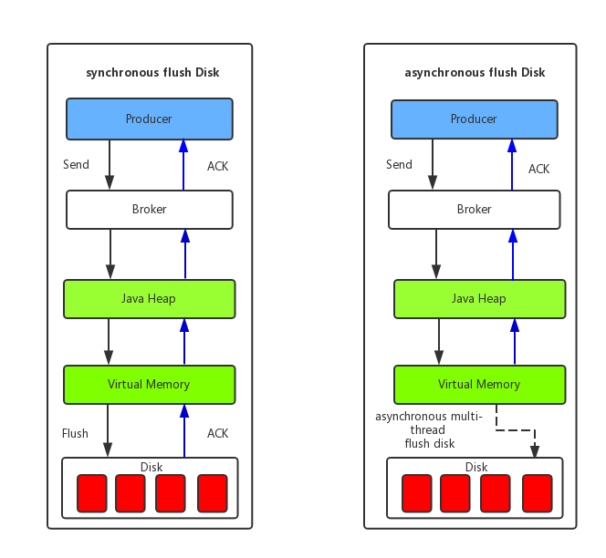
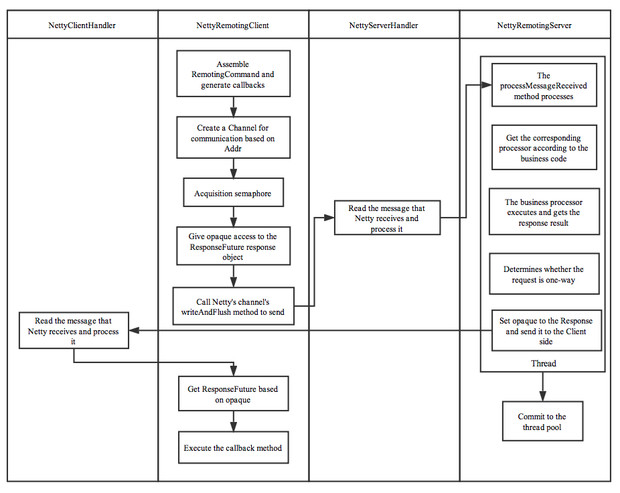

# RocketMQ

## 概述

**Apache RocketMQ™ is a unified messaging engine, lightweight data processing platform.** 

官网简介：**RocketMQ是一个统一的处理消息引擎，轻量级的数据处理平台。**

- 低延迟，在高压下，1毫秒内的响应延迟超过99.6%。
- 高可用，具有跟踪和审核功能
- 万亿级消息容量保证
- 自最新的4.1版本以来，使用新的开放式分布式消息传递和流媒体标准
- 批量传输，多功能集成，以提高吞吐量
- 如果空间足够，可以在不损失性能的情况下存盘

RocketMQ是一个纯Java、分布式、队列模型的开源消息中间件，前身是MetaQ，是阿里参考Kafka特点研发的一个队列模型的消息中间件，后开源给apache基金会成为了apache的顶级开源项目，具有高性能、高可靠、高实时、分布式特点。支持事务消息、顺序消息、批量消息、定时消息、消息回溯等。系统组成则由Producer、Consumer、Broker、NameServer等。

**Rocket** 火箭

#### 参考资料

- 官网：https://rocketmq.apache.org/

- English：https://github.com/apache/rocketmq/tree/master/docs/en
- 中文：https://github.com/apache/rocketmq/tree/master/docs/cn

## 简介

- 是一个队列模型的消息中间件，具有高性能、高可靠、高实时、分布式等特点
- Producer、Consumer、队列都可以分布式
- Producer 向一些队列轮流发送消息，队列集合称为 Topic，Consumer 如果做广播消费，则一个 Consumer 实例消费这个 Topic 对应的所有队列，如果做集群消费，则多个 Consumer 实例平均消费这个 Topic 对应的队列集合
- 能够保证严格的消息顺序
- 支持拉（pull）和推（push）两种消息模式
- 高效的订阅者水平扩展能力
- 实时的消息订阅机制
- 亿级消息堆积能力
- 支持多种消息协议，如 JMS、OpenMessaging 等
- 较少的依赖
- 采用零拷贝原理、顺序写盘、随机读
- 丰富的API使用（顺序消息、异步消息、同步消息）
- 代码优秀，底层通信框架采用Netty NIO框架
- NameServer 代替 Zookeeper
- 消息失败重试机制、消息可查询

## 核心概念(Concept)

消息队列 RocketMQ 在任何一个环境都是可扩展的，生产者必须是一个集群，消息服务器必须是一个集群，消费者也同样。集群级别的高可用，是消息队列 RocketMQ 跟其他的消息服务器的主要区别，消息生产者发送一条消息到消息服务器，消息服务器会随机的选择一个消费者，只要这个消费者消费成功就认为是成功了。

**注意：**文中所提及的消息队列 RocketMQ 的服务端或者服务器包含 Name Server、Broker 等。服务端不等同于 Broker。


RocketMQ主要由 Producer、Broker、Consumer 三部分组成，其中Producer 负责生产消息，Consumer 负责消费消息，Broker 负责存储消息。Broker 在实际部署过程中对应一台服务器，每个 Broker 可以存储多个Topic的消息，每个Topic的消息也可以分片存储于不同的 Broker。Message Queue 用于存储消息的物理地址，每个Topic中的消息地址存储于多个 Message Queue 中。ConsumerGroup 由多个Consumer 实例构成。

图中所涉及到的概念如下所述：

#### **Name Server**（名字服务）

名称服务充当路由消息的提供者。生产者或消费者能够通过名字服务查找各主题相应的Broker IP列表。是一个几乎无状态节点，可集群部署，节点之间无任何信息同步。在消息队列 RocketMQ 中提供命名服务，更新和发现 Broker 服务。

 NameServer即名字服务，两个功能

- 接收`broker`的请求，注册`broker`的路由信息

- 接收`client（producer/consumer）`的请求，根据某个`topic`获取其到`broker`的路由信息
  `NameServer`没有状态，可以横向扩展。每个`broker`在启动的时候会到`NameServer`注册；`Producer`在发送消息前会根据`topic`到`NameServer`获取路由(到`broker`)信息；`Consumer`也会定时获取`topic`路由信息。

#### **Broker（代理服务器）**

消息中转角色，负责存储消息，转发消息。可以理解为消息队列服务器，提供了消息的接收、存储、拉取和转发服务。代理服务器在RocketMQ系统中负责接收从生产者发送来的消息并存储、同时为消费者的拉取请求作准备。代理服务器也存储消息相关的元数据，包括消费者组、消费进度偏移和主题和队列消息等。

broker是RocketMQ的核心，它不能挂的，所以需要保证`broker`的高可用。

　　　　broker分为 Master Broker 和 Slave Broker，一个 Master Broker 可以对应多个 Slave Broker，但是一个 Slave Broker 只能对应一个 Master Broker。

　　　　Master与Slave的对应关系通过指定相同的BrokerName，不同的BrokerId来定义，BrokerId为0表示Master，非0表示Slave。Master也可以部署多个。

　　　　每个Broker与Name Server集群中的所有节点建立长连接，定时注册Topic信息到所有NameServer。Broker 启动后需要完成一次将自己注册至 Name Server 的操作；随后每隔 30s 定期向 Name Server 上报 Topic 路由信息。

#### Producer（消息生产者）

消息生产者，负责生产消息，一般由业务系统负责产生消息。消息队列的本质就是实现了publish-subscribe模式，生产者生产消息，消费者消费消息。一个消息生产者会把业务应用系统里产生的消息发送到broker服务器。RocketMQ提供多种发送方式，同步发送、异步发送、顺序发送、单向发送。同步和异步方式均需要Broker返回确认信息，单向发送不需要。

Producer生产者与 Name Server 集群中的其中一个节点（随机）建立长链接（Keep-alive），定期从 NameServer 读取 Topic 路由信息，并向提供 Topic 服务的 Master Broker 建立长链接，且定时向 Master Broker 发送心跳。

#### Consumer（消息消费者）

消息消费者，负责消费消息，一般是后台系统负责异步消费。一个消息消费者会从Broker服务器拉取消息、并将其提供给应用程序。从用户应用的角度而言提供了两种消费形式：拉取式消费、推动式消费。

消费者与 Name Server 集群中的其中一个节点（随机）建立长连接，定期从 NameServer 拉取 Topic 路由信息，并向提供 Topic 服务的 Master Broker、Slave Broker 建立长连接，且定时向 Master Broker、Slave Broker 发送心跳。Consumer 既可以从 Master Broker 订阅消息，也可以从 Slave Broker 订阅消息，订阅规则由 Broker 配置决定。

- Push Consumer：需要向Consumer对象注册监听。
- Pull Consumer：需要主动请求Broker拉取消息。

#### **Topic（主题）**

RocketMQ的Topic/Queue和JMS中的Topic/Queue概念有一定的差异，JMS中所有消费者都会消费一个Topic消息的副本，而Queue中消息只会被一个消费者消费；但到了**RocketMQ中Topic只代表普通的消息队列，而Queue是组成Topic的更小单元**。Topic表示一类消息的集合，每个主题包含若干条消息，每条消息只能属于一个主题，是RocketMQ进行消息订阅的基本单位。

- **Topic**：表示消息的第一级类型，比如一个电商系统的消息可以分为：交易消息、物流消息...... 一条消息必须有一个Topic。
- **Queue**：主题被划分为一个或多个子主题，称为“message queues”。一个topic下，我们可以设置多个queue(消息队列)。当我们发送消息时，需要要指定该消息的topic。RocketMQ会轮询该topic下的所有队列，将消息发送出去。
  定义：Queue是Topic在一个Broker上的分片，在分片基础上再等分为若干份（可指定份数*）*后的其中一份，是负载均衡过程中资源分配的基本单元。

集群消费模式下一个消费者只消费该Topic中部分Queue中的消息，当一个消费者开启广播模式时则会消费该Topic下所有Queue中的消息。

先看一张有关Topic和Queue的关系图：


从本质上来说，RocketMQ中的Queue是数据分片的产物。为了更好地理解Queue的定义，我们还需要引入一个新的概念：Topic分片。在分布式数据库和分布式缓存领域，分片概念已经有了清晰的定义。同理，对于RocketMQ，一个Topic可以分布在各个Broker上，我们可以把一个Topic分布在一个Broker上的子集定义为一个Topic分片。对应上图，TopicA有3个Topic分片，分布在Broker1,Broker2和Broker3上，TopicB有2个Topic分片，分布在Broker1和Broker2上，TopicC有2个Topic分片，分布在Broker2和Broker3上。

**将Topic分片再切分为若干等分，其中的一份就是一个Queue**。每个Topic分片等分的Queue的数量可以不同，由用户在创建Topic时指定。

##### **queue数量指定方式：**

1、代码指定：producer.setDefaultTopicQueueNums(8);

2、配置文件指定

同时设置broker服务器的配置文件broker.properties：defaultTopicQueueNums=16

3、rocket-console控制台指定

我们知道，数据分片的主要目的是突破单点的资源（网络带宽，CPU，内存或文件存储）限制从而实现水平扩展。RocketMQ 在进行Topic分片以后，已经达到水平扩展的目的了，为什么还需要进一步切分为Queue呢？

解答这个问题还需要从负载均衡说起。以消息消费为例，借用Rocket MQ官方文档中的Consumer负载均衡示意图来说明：


如图所示，TOPIC_A在一个Broker上的Topic分片有5个Queue，一个Consumer Group内有2个Consumer按照集群消费的方式消费消息，按照平均分配策略进行负载均衡得到的结果是：第一个 Consumer 消费3个Queue，第二个Consumer 消费2个Queue。如果增加Consumer，每个Consumer分配到的Queue会相应减少。Rocket MQ的负载均衡策略规定：Consumer数量应该小于等于Queue数量，如果Consumer超过Queue数量，那么多余的Consumer 将不能消费消息。

在一个Consumer Group内，Queue和Consumer之间的对应关系是一对多的关系：一个Queue最多只能分配给一个Consumer，一个Cosumer可以分配得到多个Queue。这样的分配规则，每个Queue只有一个消费者，可以避免消费过程中的多线程处理和资源锁定，有效提高各Consumer消费的并行度和处理效率。

  由此，我们可以给出Queue的定义：

  Queue是Topic在一个Broker上的分片等分为指定份数后的其中一份，是负载均衡过程中资源分配的基本单元。

#### **Tags**（标签）

　　Tags是Topic下的次级消息类型/二级类型（注：Tags也支持`TagA || TagB`这样的表达式），可以在同一个Topic下基于Tags进行消息过滤。Tags的过滤需要经过两次比对，首先会在Broker端通过Tag hashcode进行一次比对过滤，匹配成功传到consumer端后再对具体Tags进行比对，以防止Tag hashcode重复的情况。比如交易消息又可以分为：交易创建消息，交易完成消息..... 一条消息可以没有`Tag`。RocketMQ提供2级消息分类，方便大家灵活控制。标签，换句话说，为用户提供了额外的灵活性。有了标签，来自同一个业务模块的不同目的的消息可能具有相同的主题和不同的标签。标签将有助于保持您的代码干净和连贯，并且标签还可以为RocketMQ提供的查询系统提供帮助。

Queue中具体的存储单元结构如下图，最后面的8个Byte存储Tag信息。


#### Producer Group（生产者组）

Producer Group是一类Producer的集合名称，这类Producer通常发送一类消息，且发送逻辑一致。相同角色的生产者被分组在一起。同一生产者组的另一个生产者实例可能被broker联系，以提交或回滚事务，以防原始生产者在交易后崩溃。同一类Producer的集合，这类Producer发送同一类消息且发送逻辑一致。如果发送的是事务消息且原始生产者在发送之后崩溃，则Broker服务器会联系同一生产者组的其他生产者实例以提交或回溯消费。

　　警告：考虑提供的生产者在发送消息时足够强大，每个生产者组只允许一个实例，以避免对生产者实例进行不必要的初始化。

#### Consumer Group（消费者组）

Consumer Group是一类Consumer的集合名称，这类Consumer通常消费一类消息，且消费逻辑一致(使用相同 Group ID 的订阅者属于同一个集群。同一个集群下的订阅者消费逻辑必须完全一致（包括 Tag 的使用），这些订阅者在逻辑上可以认为是一个消费节点)。消费者组使得在消息消费方面，实现负载均衡和容错的目标变得非常容易。要注意的是，消费者组的消费者实例必须订阅完全相同的Topic。RocketMQ 支持两种消息模式：集群消费（Clustering）和广播消费（Broadcasting）。

  **警告**：消费者群体的消费者实例**必须**订阅完全相同的主题。

#### Clustering（集群消费）

集群消费模式下,相同Consumer Group的每个Consumer实例平均分摊消息。

#### Broadcasting（广播消费）

广播消费模式下，相同Consumer Group的每个Consumer实例都接收全量的消息。

#### Normal Ordered Message（普通顺序消息）

普通顺序消费模式下，消费者通过同一个消息队列（ Topic 分区，称作 Message Queue） 收到的消息是有顺序的，不同消息队列收到的消息则可能是无顺序的。

#### Strictly Ordered Message（严格顺序消息）

严格顺序消息模式下，消费者收到的所有消息均是有顺序的。

#### Message（消息）

消息系统所传输信息的物理载体，生产和消费数据的最小单位，每条消息必须属于一个主题。RocketMQ中每个消息拥有唯一的Message ID，且可以携带具有业务标识的Key。系统提供了通过Message ID和Key查询消息的功能。

Message：消息，消息队列中信息传递的载体。

Message ID：消息的全局唯一标识，由消息队列 RocketMQ 系统自动生成，唯一标识某条消息。

Message Key：消息的业务标识，由消息生产者（Producer）设置，唯一标识某个业务逻辑。

#### Message Order(消息顺序)

Message Order（消息顺序）有两种：Orderly（顺序消费）和Concurrently（并行消费）。

顺序消费表示消息消费的顺序同生产者为每个消息队列发送的顺序一致，所以如果正在处理全局顺序是强制性的场景，需要确保使用的主题只有一个消息队列。

并行消费不再保证消息顺序，消费的最大并行数量受每个消费者客户端指定的线程池限制。

#### Half Message(半消息)

是指暂不能被Consumer消费的消息。Producer 已经把消息成功发送到了 Broker 端，但此消息被标记为暂不能投递状态，处于该种状态下的消息称为半消息。需要 Producer

对消息的二次确认后，Consumer才能去消费它。

## 特性(features)

### 订阅与发布

消息的发布是指某个生产者向某个topic发送消息；消息的订阅是指某个消费者关注了某个topic中带有某些tag的消息，进而从该topic消费数据。

### 消息顺序

消息有序指的是一类消息消费时，能按照发送的顺序来消费。例如：一个订单产生了三条消息分别是订单创建、订单付款、订单完成。消费时要按照这个顺序消费才能有意义，但是同时订单之间是可以并行消费的。RocketMQ可以严格的保证消息有序。

顺序消息分为全局顺序消息与分区顺序消息，全局顺序是指某个Topic下的所有消息都要保证顺序；部分顺序消息只要保证每一组消息被顺序消费即可。

- 全局顺序
  对于指定的一个 Topic，所有消息按照严格的先入先出（FIFO）的顺序进行发布和消费。
  适用场景：性能要求不高，所有的消息严格按照 FIFO 原则进行消息发布和消费的场景
- 分区顺序
  对于指定的一个 Topic，所有消息根据 sharding key 进行区块分区。 同一个分区内的消息按照严格的 FIFO 顺序进行发布和消费。 Sharding key 是顺序消息中用来区分不同分区的关键字段，和普通消息的 Key 是完全不同的概念。
  适用场景：性能要求高，以 sharding key 作为分区字段，在同一个区块中严格的按照 FIFO 原则进行消息发布和消费的场景。

### 消息过滤

RocketMQ的消费者可以根据Tag进行消息过滤，也支持自定义属性过滤。消息过滤目前是在Broker端实现的，优点是减少了对于Consumer无用消息的网络传输，缺点是增加了Broker的负担、而且实现相对复杂。

### 消息可靠性

RocketMQ支持消息的高可靠，影响消息可靠性的几种情况：

1) Broker非正常关闭
2) Broker异常Crash
3) OS Crash
4) 机器掉电，但是能立即恢复供电情况
5) 机器无法开机（可能是cpu、主板、内存等关键设备损坏）
6) 磁盘设备损坏

1)、2)、3)、4) 四种情况都属于硬件资源可立即恢复情况，RocketMQ在这四种情况下能保证消息不丢，或者丢失少量数据（依赖刷盘方式是同步还是异步）。

5)、6)属于单点故障，且无法恢复，一旦发生，在此单点上的消息全部丢失。RocketMQ在这两种情况下，通过异步复制，可保证99%的消息不丢，但是仍然会有极少量的消息可能丢失。通过同步双写技术可以完全避免单点，同步双写势必会影响性能，适合对消息可靠性要求极高的场合，例如与Money相关的应用。注：RocketMQ从3.0版本开始支持同步双写。

### 至少一次

至少一次(At least Once)指每个消息必须投递一次。Consumer先Pull消息到本地，消费完成后，才向服务器返回ack，如果没有消费一定不会ack消息，所以RocketMQ可以很好的支持此特性。

### 回溯消费

回溯消费是指Consumer已经消费成功的消息，由于业务上需求需要重新消费，要支持此功能，Broker在向Consumer投递成功消息后，消息仍然需要保留。并且重新消费一般是按照时间维度，例如由于Consumer系统故障，恢复后需要重新消费1小时前的数据，那么Broker要提供一种机制，可以按照时间维度来回退消费进度。RocketMQ支持按照时间回溯消费，时间维度精确到毫秒。

### 事务消息

RocketMQ事务消息（Transactional Message）是指应用本地事务和发送消息操作可以被定义到全局事务中，要么同时成功，要么同时失败。RocketMQ的事务消息提供类似 X/Open XA 的分布事务功能，通过事务消息能达到分布式事务的最终一致。

### 定时消息

定时消息（延迟队列）是指消息发送到broker后，不会立即被消费，等待特定时间投递给真正的topic。
broker有配置项messageDelayLevel，默认值为“1s 5s 10s 30s 1m 2m 3m 4m 5m 6m 7m 8m 9m 10m 20m 30m 1h 2h”，18个level。可以配置自定义messageDelayLevel。注意，messageDelayLevel是broker的属性，不属于某个topic。发消息时，设置delayLevel等级即可：msg.setDelayLevel(level)。level有以下三种情况：

- level == 0，消息为非延迟消息
- 1<=level<=maxLevel，消息延迟特定时间，例如level==1，延迟1s
- level > maxLevel，则level== maxLevel，例如level==20，延迟2h

定时消息会暂存在名为SCHEDULE_TOPIC_XXXX的topic中，并根据delayTimeLevel存入特定的queue，queueId = delayTimeLevel – 1，即一个queue只存相同延迟的消息，保证具有相同发送延迟的消息能够顺序消费。broker会调度地消费SCHEDULE_TOPIC_XXXX，将消息写入真实的topic。

需要注意的是，定时消息会在第一次写入和调度写入真实topic时都会计数，因此发送数量、tps都会变高。

### 消息重试

Consumer消费消息失败后，要提供一种重试机制，令消息再消费一次。Consumer消费消息失败通常可以认为有以下几种情况：

- 由于消息本身的原因，例如反序列化失败，消息数据本身无法处理（例如话费充值，当前消息的手机号被注销，无法充值）等。这种错误通常需要跳过这条消息，再消费其它消息，而这条失败的消息即使立刻重试消费，99%也不成功，所以最好提供一种定时重试机制，即过10秒后再重试。
- 由于依赖的下游应用服务不可用，例如db连接不可用，外系统网络不可达等。遇到这种错误，即使跳过当前失败的消息，消费其他消息同样也会报错。这种情况建议应用sleep 30s，再消费下一条消息，这样可以减轻Broker重试消息的压力。

RocketMQ会为每个消费组都设置一个Topic名称为“%RETRY%+consumerGroup”的重试队列（这里需要注意的是，这个Topic的重试队列是针对消费组，而不是针对每个Topic设置的），用于暂时保存因为各种异常而导致Consumer端无法消费的消息。考虑到异常恢复起来需要一些时间，会为重试队列设置多个重试级别，每个重试级别都有与之对应的重新投递延时，重试次数越多投递延时就越大。RocketMQ对于重试消息的处理是先保存至Topic名称为“SCHEDULE_TOPIC_XXXX”的延迟队列中，后台定时任务按照对应的时间进行Delay后重新保存至“%RETRY%+consumerGroup”的重试队列中。

### 消息重投

生产者在发送消息时，同步消息失败会重投，异步消息有重试，oneway没有任何保证。消息重投保证消息尽可能发送成功、不丢失，但可能会造成消息重复，消息重复在RocketMQ中是无法避免的问题。消息重复在一般情况下不会发生，当出现消息量大、网络抖动，消息重复就会是大概率事件。另外，生产者主动重发、consumer负载变化也会导致重复消息。如下方法可以设置消息重试策略：

- retryTimesWhenSendFailed:同步发送失败重投次数，默认为2，因此生产者会最多尝试发送retryTimesWhenSendFailed + 1次。不会选择上次失败的broker，尝试向其他broker发送，最大程度保证消息不丢。超过重投次数，抛出异常，由客户端保证消息不丢。当出现RemotingException、MQClientException和部分MQBrokerException时会重投。
- retryTimesWhenSendAsyncFailed:异步发送失败重试次数，异步重试不会选择其他broker，仅在同一个broker上做重试，不保证消息不丢。
- retryAnotherBrokerWhenNotStoreOK:消息刷盘（主或备）超时或slave不可用（返回状态非SEND_OK），是否尝试发送到其他broker，默认false。十分重要消息可以开启。

### 流量控制

生产者流控，因为broker处理能力达到瓶颈；消费者流控，因为消费能力达到瓶颈。

生产者流控：

- commitLog文件被锁时间超过osPageCacheBusyTimeOutMills时，参数默认为1000ms，返回流控。
- 如果开启transientStorePoolEnable == true，且broker为异步刷盘的主机，且transientStorePool中资源不足，拒绝当前send请求，返回流控。
- broker每隔10ms检查send请求队列头部请求的等待时间，如果超过waitTimeMillsInSendQueue，默认200ms，拒绝当前send请求，返回流控。
- broker通过拒绝send 请求方式实现流量控制。

注意，生产者流控，不会尝试消息重投。

消费者流控：

- 消费者本地缓存消息数超过pullThresholdForQueue时，默认1000。
- 消费者本地缓存消息大小超过pullThresholdSizeForQueue时，默认100MB。
- 消费者本地缓存消息跨度超过consumeConcurrentlyMaxSpan时，默认2000。

消费者流控的结果是降低拉取频率。

### 死信队列

死信队列用于处理无法被正常消费的消息。当一条消息初次消费失败，消息队列会自动进行消息重试；达到最大重试次数后，若消费依然失败，则表明消费者在正常情况下无法正确地消费该消息，此时，消息队列不会立刻将消息丢弃，而是将其发送到该消费者对应的特殊队列中。

RocketMQ将这种正常情况下无法被消费的消息称为死信消息（Dead-Letter Message），将存储死信消息的特殊队列称为死信队列（Dead-Letter Queue）。在RocketMQ中，可以通过使用console控制台对死信队列中的消息进行重发来使得消费者实例再次进行消费。

## 架构设计

### 技术架构


RocketMQ架构上主要分为四部分，如上图所示:

- Producer：消息发布的角色，支持分布式集群方式部署。Producer通过MQ的负载均衡模块选择相应的Broker集群队列进行消息投递，投递的过程支持快速失败并且低延迟。

- Consumer：消息消费的角色，支持分布式集群方式部署。支持以push推，pull拉两种模式对消息进行消费。同时也支持集群方式和广播方式的消费，它提供实时消息订阅机制，可以满足大多数用户的需求。

- NameServer：NameServer是一个非常简单的Topic路由注册中心，其角色类似Dubbo中的zookeeper，支持Broker的动态注册与发现。主要包括两个功能：Broker管理，NameServer接受Broker集群的注册信息并且保存下来作为路由信息的基本数据。然后提供心跳检测机制，检查Broker是否还存活；路由信息管理，每个NameServer将保存关于Broker集群的整个路由信息和用于客户端查询的队列信息。然后Producer和Conumser通过NameServer就可以知道整个Broker集群的路由信息，从而进行消息的投递和消费。NameServer通常也是集群的方式部署，各实例间相互不进行信息通讯。Broker是向每一台NameServer注册自己的路由信息，所以每一个NameServer实例上面都保存一份完整的路由信息。当某个NameServer因某种原因下线了，Broker仍然可以向其它NameServer同步其路由信息，Producer和Consumer仍然可以动态感知Broker的路由的信息。 

- BrokerServer：Broker主要负责消息的存储、投递和查询以及服务高可用保证，为了实现这些功能，Broker包含了以下几个重要子模块。
  1. Remoting Module：整个Broker的实体，负责处理来自Client端的请求。
  2. Client Manager：负责管理客户端(Producer/Consumer)和维护Consumer的Topic订阅信息。
  3. Store Service：提供方便简单的API接口处理消息存储到物理硬盘和查询功能。
  4. HA Service：高可用服务，提供Master Broker 和 Slave Broker之间的数据同步功能。
  5. Index Service：根据特定的Message key对投递到Broker的消息进行索引服务，以提供消息的快速查询。


### 部署架构


#### RocketMQ 网络部署特点

- NameServer是一个几乎无状态节点，可集群部署，节点之间无任何信息同步。

- Broker部署相对复杂，Broker分为Master与Slave，一个Master可以对应多个Slave，但是一个Slave只能对应一个Master，Master与Slave 的对应关系通过指定相同的BrokerName，不同的BrokerId 来定义，BrokerId为0表示Master，非0表示Slave。Master也可以部署多个。每个Broker与NameServer集群中的所有节点建立长连接，定时注册Topic信息到所有NameServer。 注意：当前RocketMQ版本在部署架构上支持一Master多Slave，但只有BrokerId=1的从服务器才会参与消息的读负载。

- Producer与NameServer集群中的其中一个节点（随机选择）建立长连接，定期从NameServer获取Topic路由信息，并向提供Topic 服务的Master建立长连接，且定时向Master发送心跳。Producer完全无状态，可集群部署。

- Consumer与NameServer集群中的其中一个节点（随机选择）建立长连接，定期从NameServer获取Topic路由信息，并向提供Topic服务的Master、Slave建立长连接，且定时向Master、Slave发送心跳。Consumer既可以从Master订阅消息，也可以从Slave订阅消息，消费者在向Master拉取消息时，Master服务器会根据拉取偏移量与最大偏移量的距离（判断是否读老消息，产生读I/O），以及从服务器是否可读等因素建议下一次是从Master还是Slave拉取。

结合部署架构图，描述集群工作流程：

- 启动NameServer，NameServer起来后监听端口，等待Broker、Producer、Consumer连上来，相当于一个路由控制中心。
- Broker启动，跟所有的NameServer保持长连接，定时发送心跳包。心跳包中包含当前Broker信息(IP+端口等)以及存储所有Topic信息。注册成功后，NameServer集群中就有Topic跟Broker的映射关系。
- 收发消息前，先创建Topic，创建Topic时需要指定该Topic要存储在哪些Broker上，也可以在发送消息时自动创建Topic。
- Producer发送消息，启动时先跟NameServer集群中的其中一台建立长连接，并从NameServer中获取当前发送的Topic存在哪些Broker上，轮询从队列列表中选择一个队列，然后与队列所在的Broker建立长连接从而向Broker发消息。
- Consumer跟Producer类似，跟其中一台NameServer建立长连接，获取当前订阅Topic存在哪些Broker上，然后直接跟Broker建立连接通道，开始消费消息。

##  设计(design)

### 消息存储

消息存储是RocketMQ中最为复杂和最为重要的一部分，本节将分别从RocketMQ的消息存储整体架构、PageCache与Mmap内存映射以及RocketMQ中两种不同的刷盘方式三方面来分别展开叙述。

#### 消息存储整体架构

消息存储架构图中主要有下面三个跟消息存储相关的文件构成。

(1) CommitLog：消息主体以及元数据的存储主体，存储Producer端写入的消息主体内容,消息内容不是定长的。单个文件大小默认1G, 文件名长度为20位，左边补零，剩余为起始偏移量，比如00000000000000000000代表了第一个文件，起始偏移量为0，文件大小为1G=1073741824；当第一个文件写满了，第二个文件为00000000001073741824，起始偏移量为1073741824，以此类推。消息主要是顺序写入日志文件，当文件满了，写入下一个文件；

(2) ConsumeQueue：消息消费队列，引入的目的主要是提高消息消费的性能，由于RocketMQ是基于主题topic的订阅模式，消息消费是针对主题进行的，如果要遍历commitlog文件中根据topic检索消息是非常低效的。Consumer即可根据ConsumeQueue来查找待消费的消息。其中，ConsumeQueue（逻辑消费队列）作为消费消息的索引，保存了指定Topic下的队列消息在CommitLog中的起始物理偏移量offset，消息大小size和消息Tag的HashCode值。consumequeue文件可以看成是基于topic的commitlog索引文件，故consumequeue文件夹的组织方式如下：topic/queue/file三层组织结构，具体存储路径为：$HOME/store/consumequeue/{topic}/{queueId}/{fileName}。同样consumequeue文件采取定长设计，每一个条目共20个字节，分别为8字节的commitlog物理偏移量、4字节的消息长度、8字节tag hashcode，单个文件由30W个条目组成，可以像数组一样随机访问每一个条目，每个ConsumeQueue文件大小约5.72M；

(3) IndexFile：IndexFile（索引文件）提供了一种可以通过key或时间区间来查询消息的方法。Index文件的存储位置是：$HOME \store\index\${fileName}，文件名fileName是以创建时的时间戳命名的，固定的单个IndexFile文件大小约为400M，一个IndexFile可以保存 2000W个索引，IndexFile的底层存储设计为在文件系统中实现HashMap结构，故rocketmq的索引文件其底层实现为hash索引。

在上面的RocketMQ的消息存储整体架构图中可以看出，RocketMQ采用的是混合型的存储结构，即为Broker单个实例下所有的队列共用一个日志数据文件（即为CommitLog）来存储。RocketMQ的混合型存储结构(多个Topic的消息实体内容都存储于一个CommitLog中)针对Producer和Consumer分别采用了数据和索引部分相分离的存储结构，Producer发送消息至Broker端，然后Broker端使用同步或者异步的方式对消息刷盘持久化，保存至CommitLog中。只要消息被刷盘持久化至磁盘文件CommitLog中，那么Producer发送的消息就不会丢失。正因为如此，Consumer也就肯定有机会去消费这条消息。当无法拉取到消息后，可以等下一次消息拉取，同时服务端也支持长轮询模式，如果一个消息拉取请求未拉取到消息，Broker允许等待30s的时间，只要这段时间内有新消息到达，将直接返回给消费端。这里，RocketMQ的具体做法是，使用Broker端的后台服务线程—ReputMessageService不停地分发请求并异步构建ConsumeQueue（逻辑消费队列）和IndexFile（索引文件）数据。

#### 页缓存与内存映射

页缓存（PageCache)是OS对文件的缓存，用于加速对文件的读写。一般来说，程序对文件进行顺序读写的速度几乎接近于内存的读写速度，主要原因就是由于OS使用PageCache机制对读写访问操作进行了性能优化，将一部分的内存用作PageCache。对于数据的写入，OS会先写入至Cache内，随后通过异步的方式由pdflush内核线程将Cache内的数据刷盘至物理磁盘上。对于数据的读取，如果一次读取文件时出现未命中PageCache的情况，OS从物理磁盘上访问读取文件的同时，会顺序对其他相邻块的数据文件进行预读取。

在RocketMQ中，ConsumeQueue逻辑消费队列存储的数据较少，并且是顺序读取，在page cache机制的预读取作用下，Consume Queue文件的读性能几乎接近读内存，即使在有消息堆积情况下也不会影响性能。而对于CommitLog消息存储的日志数据文件来说，读取消息内容时候会产生较多的随机访问读取，严重影响性能。如果选择合适的系统IO调度算法，比如设置调度算法为“Deadline”（此时块存储采用SSD的话），随机读的性能也会有所提升。

另外，RocketMQ主要通过MappedByteBuffer对文件进行读写操作。其中，利用了NIO中的FileChannel模型将磁盘上的物理文件直接映射到用户态的内存地址中（这种Mmap的方式减少了传统IO将磁盘文件数据在操作系统内核地址空间的缓冲区和用户应用程序地址空间的缓冲区之间来回进行拷贝的性能开销），将对文件的操作转化为直接对内存地址进行操作，从而极大地提高了文件的读写效率（正因为需要使用内存映射机制，故RocketMQ的文件存储都使用定长结构来存储，方便一次将整个文件映射至内存）。

#### 消息刷盘



(1) 同步刷盘：如上图所示，只有在消息真正持久化至磁盘后RocketMQ的Broker端才会真正返回给Producer端一个成功的ACK响应。同步刷盘对MQ消息可靠性来说是一种不错的保障，但是性能上会有较大影响，一般适用于金融业务应用该模式较多。

(2) 异步刷盘：能够充分利用OS的PageCache的优势，只要消息写入PageCache即可将成功的ACK返回给Producer端。消息刷盘采用后台异步线程提交的方式进行，降低了读写延迟，提高了MQ的性能和吞吐量。

### 通信机制

RocketMQ消息队列集群主要包括NameServer、Broker(Master/Slave)、Producer、Consumer4个角色，基本通讯流程如下：

(1) Broker启动后需要完成一次将自己注册至NameServer的操作；随后每隔30s时间定时向NameServer上报Topic路由信息。

(2) 消息生产者Producer作为客户端发送消息时候，需要根据消息的Topic从本地缓存的TopicPublishInfoTable获取路由信息。如果没有则更新路由信息会从NameServer上重新拉取，同时Producer会默认每隔30s向NameServer拉取一次路由信息。

(3) 消息生产者Producer根据2）中获取的路由信息选择一个队列（MessageQueue）进行消息发送；Broker作为消息的接收者接收消息并落盘存储。

(4) 消息消费者Consumer根据2）中获取的路由信息，并再完成客户端的负载均衡后，选择其中的某一个或者某几个消息队列来拉取消息并进行消费。

从上面1）~3）中可以看出在消息生产者, Broker和NameServer之间都会发生通信（这里只说了MQ的部分通信），因此如何设计一个良好的网络通信模块在MQ中至关重要，它将决定RocketMQ集群整体的消息传输能力与最终的性能。

rocketmq-remoting 模块是 RocketMQ消息队列中负责网络通信的模块，它几乎被其他所有需要网络通信的模块（诸如rocketmq-client、rocketmq-broker、rocketmq-namesrv）所依赖和引用。为了实现客户端与服务器之间高效的数据请求与接收，RocketMQ消息队列自定义了通信协议并在Netty的基础之上扩展了通信模块。

#### Remoting通信类结构


#### 协议设计与编解码

在Client和Server之间完成一次消息发送时，需要对发送的消息进行一个协议约定，因此就有必要自定义RocketMQ的消息协议。同时，为了高效地在网络中传输消息和对收到的消息读取，就需要对消息进行编解码。在RocketMQ中，RemotingCommand这个类在消息传输过程中对所有数据内容的封装，不但包含了所有的数据结构，还包含了编码解码操作。

| Header字段 | 类型                    | Request说明                                                  | Response说明                             |
| ---------- | ----------------------- | ------------------------------------------------------------ | ---------------------------------------- |
| code       | int                     | 请求操作码，应答方根据不同的请求码进行不同的业务处理         | 应答响应码。0表示成功，非0则表示各种错误 |
| language   | LanguageCode            | 请求方实现的语言                                             | 应答方实现的语言                         |
| version    | int                     | 请求方程序的版本                                             | 应答方程序的版本                         |
| opaque     | int                     | 相当于requestId，在同一个连接上的不同请求标识码，与响应消息中的相对应 | 应答不做修改直接返回                     |
| flag       | int                     | 区分是普通RPC还是onewayRPC的标志                             | 区分是普通RPC还是onewayRPC的标志         |
| remark     | String                  | 传输自定义文本信息                                           | 传输自定义文本信息                       |
| extFields  | HashMap<String, String> | 请求自定义扩展信息                                           | 响应自定义扩展信息                       |


可见传输内容主要可以分为以下4部分：

(1) 消息长度：总长度，四个字节存储，占用一个int类型；

(2) 序列化类型&消息头长度：同样占用一个int类型，第一个字节表示序列化类型，后面三个字节表示消息头长度；

(3) 消息头数据：经过序列化后的消息头数据；

(4) 消息主体数据：消息主体的二进制字节数据内容；

#### 消息的通信方式和流程

在RocketMQ消息队列中支持通信的方式主要有同步(sync)、异步(async)、单向(oneway)
三种。其中“单向”通信模式相对简单，一般用在发送心跳包场景下，无需关注其Response。这里，主要介绍RocketMQ的异步通信流程。



#### Reactor多线程设计

RocketMQ的RPC通信采用Netty组件作为底层通信库，同样也遵循了Reactor多线程模型，同时又在这之上做了一些扩展和优化。


上面的框图中可以大致了解RocketMQ中NettyRemotingServer的Reactor 多线程模型。一个 Reactor 主线程（eventLoopGroupBoss，即为上面的1）负责监听 TCP网络连接请求，建立好连接，创建SocketChannel，并注册到selector上。RocketMQ的源码中会自动根据OS的类型选择NIO和Epoll，也可以通过参数配置）,然后监听真正的网络数据。拿到网络数据后，再丢给Worker线程池（eventLoopGroupSelector，即为上面的“N”，源码中默认设置为3），在真正执行业务逻辑之前需要进行SSL验证、编解码、空闲检查、网络连接管理，这些工作交给defaultEventExecutorGroup（即为上面的“M1”，源码中默认设置为8）去做。而处理业务操作放在业务线程池中执行，根据 RomotingCommand 的业务请求码code去processorTable这个本地缓存变量中找到对应的 processor，然后封装成task任务后，提交给对应的业务processor处理线程池来执行（sendMessageExecutor，以发送消息为例，即为上面的 “M2”）。从入口到业务逻辑的几个步骤中线程池一直再增加，这跟每一步逻辑复杂性相关，越复杂，需要的并发通道越宽。

| 线程数 | 线程名                         | 线程具体说明            |
| ------ | ------------------------------ | ----------------------- |
| 1      | NettyBoss_%d                   | Reactor 主线程          |
| N      | NettyServerEPOLLSelector_%d_%d | Reactor 线程池          |
| M1     | NettyServerCodecThread_%d      | Worker线程池            |
| M2     | RemotingExecutorThread_%d      | 业务processor处理线程池 |

### 消息过滤

RocketMQ分布式消息队列的消息过滤方式有别于其它MQ中间件，是在Consumer端订阅消息时再做消息过滤的。RocketMQ这么做是在于其Producer端写入消息和Consumer端订阅消息采用分离存储的机制来实现的，Consumer端订阅消息是需要通过ConsumeQueue这个消息消费的逻辑队列拿到一个索引，然后再从CommitLog里面读取真正的消息实体内容，所以说到底也是还绕不开其存储结构。其ConsumeQueue的存储结构如下，可以看到其中有8个字节存储的Message Tag的哈希值，基于Tag的消息过滤正是基于这个字段值的。


主要支持如下2种的过滤方式
(1) Tag过滤方式：Consumer端在订阅消息时除了指定Topic还可以指定TAG，如果一个消息有多个TAG，可以用||分隔。其中，Consumer端会将这个订阅请求构建成一个 SubscriptionData，发送一个Pull消息的请求给Broker端。Broker端从RocketMQ的文件存储层—Store读取数据之前，会用这些数据先构建一个MessageFilter，然后传给Store。Store从 ConsumeQueue读取到一条记录后，会用它记录的消息tag hash值去做过滤，由于在服务端只是根据hashcode进行判断，无法精确对tag原始字符串进行过滤，故在消息消费端拉取到消息后，还需要对消息的原始tag字符串进行比对，如果不同，则丢弃该消息，不进行消息消费。

(2) SQL92的过滤方式：这种方式的大致做法和上面的Tag过滤方式一样，只是在Store层的具体过滤过程不太一样，真正的 SQL expression 的构建和执行由rocketmq-filter模块负责的。每次过滤都去执行SQL表达式会影响效率，所以RocketMQ使用了BloomFilter避免了每次都去执行。SQL92的表达式上下文为消息的属性。

### 负载均衡

RocketMQ中的负载均衡都在Client端完成，具体来说的话，主要可以分为Producer端发送消息时候的负载均衡和Consumer端订阅消息的负载均衡。

#### Producer的负载均衡

Producer端在发送消息的时候，会先根据Topic找到指定的TopicPublishInfo，在获取了TopicPublishInfo路由信息后，RocketMQ的客户端在默认方式下selectOneMessageQueue()方法会从TopicPublishInfo中的messageQueueList中选择一个队列（MessageQueue）进行发送消息。具体的容错策略均在MQFaultStrategy这个类中定义。这里有一个sendLatencyFaultEnable开关变量，如果开启，在随机递增取模的基础上，再过滤掉not available的Broker代理。所谓的"latencyFaultTolerance"，是指对之前失败的，按一定的时间做退避。例如，如果上次请求的latency超过550Lms，就退避3000Lms；超过1000L，就退避60000L；如果关闭，采用随机递增取模的方式选择一个队列（MessageQueue）来发送消息，latencyFaultTolerance机制是实现消息发送高可用的核心关键所在。

#### Consumer的负载均衡

在RocketMQ中，Consumer端的两种消费模式（Push/Pull）都是基于拉模式来获取消息的，而在Push模式只是对pull模式的一种封装，其本质实现为消息拉取线程在从服务器拉取到一批消息后，然后提交到消息消费线程池后，又“马不停蹄”的继续向服务器再次尝试拉取消息。如果未拉取到消息，则延迟一下又继续拉取。在两种基于拉模式的消费方式（Push/Pull）中，均需要Consumer端知道从Broker端的哪一个消息队列中去获取消息。因此，有必要在Consumer端来做负载均衡，即Broker端中多个MessageQueue分配给同一个ConsumerGroup中的哪些Consumer消费。

1、Consumer端的心跳包发送

在Consumer启动后，它就会通过定时任务不断地向RocketMQ集群中的所有Broker实例发送心跳包（其中包含了，消息消费分组名称、订阅关系集合、消息通信模式和客户端id的值等信息）。Broker端在收到Consumer的心跳消息后，会将它维护在ConsumerManager的本地缓存变量—consumerTable，同时并将封装后的客户端网络通道信息保存在本地缓存变量—channelInfoTable中，为之后做Consumer端的负载均衡提供可以依据的元数据信息。

2、Consumer端实现负载均衡的核心类—RebalanceImpl

在Consumer实例的启动流程中的启动MQClientInstance实例部分，会完成负载均衡服务线程—RebalanceService的启动（每隔20s执行一次）。通过查看源码可以发现，RebalanceService线程的run()方法最终调用的是RebalanceImpl类的rebalanceByTopic()方法，该方法是实现Consumer端负载均衡的核心。这里，rebalanceByTopic()方法会根据消费者通信类型为“广播模式”还是“集群模式”做不同的逻辑处理。这里主要来看下集群模式下的主要处理流程：

(1) 从rebalanceImpl实例的本地缓存变量—topicSubscribeInfoTable中，获取该Topic主题下的消息消费队列集合（mqSet）；

(2) 根据topic和consumerGroup为参数调用mQClientFactory.findConsumerIdList()方法向Broker端发送获取该消费组下消费者Id列表的RPC通信请求（Broker端基于前面Consumer端上报的心跳包数据而构建的consumerTable做出响应返回，业务请求码：GET_CONSUMER_LIST_BY_GROUP）；

(3) 先对Topic下的消息消费队列、消费者Id排序，然后用消息队列分配策略算法（默认为：消息队列的平均分配算法），计算出待拉取的消息队列。这里的平均分配算法，类似于分页的算法，将所有MessageQueue排好序类似于记录，将所有消费端Consumer排好序类似页数，并求出每一页需要包含的平均size和每个页面记录的范围range，最后遍历整个range而计算出当前Consumer端应该分配到的记录（这里即为：MessageQueue）。


(4) 然后，调用updateProcessQueueTableInRebalance()方法，具体的做法是，先将分配到的消息队列集合（mqSet）与processQueueTable做一个过滤比对。


- 上图中processQueueTable标注的红色部分，表示与分配到的消息队列集合mqSet互不包含。将这些队列设置Dropped属性为true，然后查看这些队列是否可以移除出processQueueTable缓存变量，这里具体执行removeUnnecessaryMessageQueue()方法，即每隔1s 查看是否可以获取当前消费处理队列的锁，拿到的话返回true。如果等待1s后，仍然拿不到当前消费处理队列的锁则返回false。如果返回true，则从processQueueTable缓存变量中移除对应的Entry；

- 上图中processQueueTable的绿色部分，表示与分配到的消息队列集合mqSet的交集。判断该ProcessQueue是否已经过期了，在Pull模式的不用管，如果是Push模式的，设置Dropped属性为true，并且调用removeUnnecessaryMessageQueue()方法，像上面一样尝试移除Entry；

最后，为过滤后的消息队列集合（mqSet）中的每个MessageQueue创建一个ProcessQueue对象并存入RebalanceImpl的processQueueTable队列中（其中调用RebalanceImpl实例的computePullFromWhere(MessageQueue mq)方法获取该MessageQueue对象的下一个进度消费值offset，随后填充至接下来要创建的pullRequest对象属性中），并创建拉取请求对象—pullRequest添加到拉取列表—pullRequestList中，最后执行dispatchPullRequest()方法，将Pull消息的请求对象PullRequest依次放入PullMessageService服务线程的阻塞队列pullRequestQueue中，待该服务线程取出后向Broker端发起Pull消息的请求。其中，可以重点对比下，RebalancePushImpl和RebalancePullImpl两个实现类的dispatchPullRequest()方法不同，RebalancePullImpl类里面的该方法为空，这样子也就回答了上一篇中最后的那道思考题了。

消息消费队列在同一消费组不同消费者之间的负载均衡，其核心设计理念是在一个消息消费队列在同一时间只允许被同一消费组内的一个消费者消费，一个消息消费者能同时消费多个消息队列。

### 事务消息

Apache RocketMQ在4.3.0版中已经支持分布式事务消息，这里RocketMQ采用了2PC的思想来实现了提交事务消息，同时增加一个补偿逻辑来处理二阶段超时或者失败的消息，如下图所示。


#### RocketMQ事务消息流程概要

上图说明了事务消息的大致方案，其中分为两个流程：正常事务消息的发送及提交、事务消息的补偿流程。

1.事务消息发送及提交：

(1) 发送消息（half消息）。

(2) 服务端响应消息写入结果。

(3) 根据发送结果执行本地事务（如果写入失败，此时half消息对业务不可见，本地逻辑不执行）。

(4) 根据本地事务状态执行Commit或者Rollback（Commit操作生成消息索引，消息对消费者可见）

2.补偿流程：

(1) 对没有Commit/Rollback的事务消息（pending状态的消息），从服务端发起一次“回查”

(2) Producer收到回查消息，检查回查消息对应的本地事务的状态

(3) 根据本地事务状态，重新Commit或者Rollback

其中，补偿阶段用于解决消息Commit或者Rollback发生超时或者失败的情况。

#### RocketMQ事务消息设计

1.事务消息在一阶段对用户不可见

在RocketMQ事务消息的主要流程中，一阶段的消息如何对用户不可见。其中，事务消息相对普通消息最大的特点就是一阶段发送的消息对用户是不可见的。那么，如何做到写入消息但是对用户不可见呢？RocketMQ事务消息的做法是：如果消息是half消息，将备份原消息的主题与消息消费队列，然后改变主题为RMQ_SYS_TRANS_HALF_TOPIC。由于消费组未订阅该主题，故消费端无法消费half类型的消息，然后RocketMQ会开启一个定时任务，从Topic为RMQ_SYS_TRANS_HALF_TOPIC中拉取消息进行消费，根据生产者组获取一个服务提供者发送回查事务状态请求，根据事务状态来决定是提交或回滚消息。

在RocketMQ中，消息在服务端的存储结构如下，每条消息都会有对应的索引信息，Consumer通过ConsumeQueue这个二级索引来读取消息实体内容，其流程如下：


RocketMQ的具体实现策略是：写入的如果事务消息，对消息的Topic和Queue等属性进行替换，同时将原来的Topic和Queue信息存储到消息的属性中，正因为消息主题被替换，故消息并不会转发到该原主题的消息消费队列，消费者无法感知消息的存在，不会消费。其实改变消息主题是RocketMQ的常用“套路”，回想一下延时消息的实现机制。

2.Commit和Rollback操作以及Op消息的引入

在完成一阶段写入一条对用户不可见的消息后，二阶段如果是Commit操作，则需要让消息对用户可见；如果是Rollback则需要撤销一阶段的消息。先说Rollback的情况。对于Rollback，本身一阶段的消息对用户是不可见的，其实不需要真正撤销消息（实际上RocketMQ也无法去真正的删除一条消息，因为是顺序写文件的）。但是区别于这条消息没有确定状态（Pending状态，事务悬而未决），需要一个操作来标识这条消息的最终状态。RocketMQ事务消息方案中引入了Op消息的概念，用Op消息标识事务消息已经确定的状态（Commit或者Rollback）。如果一条事务消息没有对应的Op消息，说明这个事务的状态还无法确定（可能是二阶段失败了）。引入Op消息后，事务消息无论是Commit或者Rollback都会记录一个Op操作。Commit相对于Rollback只是在写入Op消息前创建Half消息的索引。

3.Op消息的存储和对应关系

RocketMQ将Op消息写入到全局一个特定的Topic中通过源码中的方法—TransactionalMessageUtil.buildOpTopic()；这个Topic是一个内部的Topic（像Half消息的Topic一样），不会被用户消费。Op消息的内容为对应的Half消息的存储的Offset，这样通过Op消息能索引到Half消息进行后续的回查操作。


4.Half消息的索引构建

在执行二阶段Commit操作时，需要构建出Half消息的索引。一阶段的Half消息由于是写到一个特殊的Topic，所以二阶段构建索引时需要读取出Half消息，并将Topic和Queue替换成真正的目标的Topic和Queue，之后通过一次普通消息的写入操作来生成一条对用户可见的消息。所以RocketMQ事务消息二阶段其实是利用了一阶段存储的消息的内容，在二阶段时恢复出一条完整的普通消息，然后走一遍消息写入流程。

5.如何处理二阶段失败的消息？

如果在RocketMQ事务消息的二阶段过程中失败了，例如在做Commit操作时，出现网络问题导致Commit失败，那么需要通过一定的策略使这条消息最终被Commit。RocketMQ采用了一种补偿机制，称为“回查”。Broker端对未确定状态的消息发起回查，将消息发送到对应的Producer端（同一个Group的Producer），由Producer根据消息来检查本地事务的状态，进而执行Commit或者Rollback。Broker端通过对比Half消息和Op消息进行事务消息的回查并且推进CheckPoint（记录那些事务消息的状态是确定的）。

值得注意的是，rocketmq并不会无休止的的信息事务状态回查，默认回查15次，如果15次回查还是无法得知事务状态，rocketmq默认回滚该消息。

### 消息查询

RocketMQ支持按照下面两种维度（“按照Message Id查询消息”、“按照Message Key查询消息”）进行消息查询。

#### 按照MessageId查询消息

RocketMQ中的MessageId的长度总共有16字节，其中包含了消息存储主机地址（IP地址和端口），消息Commit Log offset。“按照MessageId查询消息”在RocketMQ中具体做法是：Client端从MessageId中解析出Broker的地址（IP地址和端口）和Commit Log的偏移地址后封装成一个RPC请求后通过Remoting通信层发送（业务请求码：VIEW_MESSAGE_BY_ID）。Broker端走的是QueryMessageProcessor，读取消息的过程用其中的 commitLog offset 和 size 去 commitLog 中找到真正的记录并解析成一个完整的消息返回。

#### 按照Message Key查询消息

“按照Message Key查询消息”，主要是基于RocketMQ的IndexFile索引文件来实现的。RocketMQ的索引文件逻辑结构，类似JDK中HashMap的实现。索引文件的具体结构如下：


IndexFile索引文件为用户提供通过“按照Message Key查询消息”的消息索引查询服务，IndexFile文件的存储位置是：$HOME\store\index\${fileName}，文件名fileName是以创建时的时间戳命名的，文件大小是固定的，等于40+500W\*4+2000W\*20= 420000040个字节大小。如果消息的properties中设置了UNIQ_KEY这个属性，就用 topic + “#” + UNIQ_KEY的value作为 key 来做写入操作。如果消息设置了KEYS属性（多个KEY以空格分隔），也会用 topic + “#” + KEY 来做索引。

其中的索引数据包含了Key Hash/CommitLog Offset/Timestamp/NextIndex offset 这四个字段，一共20 Byte。NextIndex offset 即前面读出来的 slotValue，如果有 hash冲突，就可以用这个字段将所有冲突的索引用链表的方式串起来了。Timestamp记录的是消息storeTimestamp之间的差，并不是一个绝对的时间。整个Index File的结构如图，40 Byte 的Header用于保存一些总的统计信息，4\*500W的 Slot Table并不保存真正的索引数据，而是保存每个槽位对应的单向链表的头。20\*2000W 是真正的索引数据，即一个 Index File 可以保存 2000W个索引。

“按照Message Key查询消息”的方式，RocketMQ的具体做法是，主要通过Broker端的QueryMessageProcessor业务处理器来查询，读取消息的过程就是用topic和key找到IndexFile索引文件中的一条记录，根据其中的commitLog offset从CommitLog文件中读取消息的实体内容。

## Windows10本地部署RocketMQ

##### 下载安装

首先我们可以去RocketMQ的官网去下载源码: 官网点这里[https://rocketmq.apache.org/]

##### 环境准备

配置环境变量

```
ROCKETMQ_HOME="D:\rocketmq"
NAMESRV_ADDR="localhost:9876"
```

启动Name Server

进入MQ解压后的目录,即:`ROCKETMQ_HOME/bin`目录

```
.\mqnamesrv.cmd
```

启动`Broker`

```
.\mqbroker.cmd -n localhost:9876 autoCreateTopicEnable=true
```

`-n` 指定broker连接的`nameServer`的地址和端口号

`autoCreateTopicEnable`参数见名知意,打开自动创建Topic

##### 安装rocketmq-console验证运行情况

修改`rocketmq-console`的**application.rpoperties**配置文件

指定连接的nameServer的地址和端口号

```
 rocketmq.config.namesrvAddr=127.0.0.1:9876
```

找到主启动类,运行run方法即可,等待启动成功我们就可以再浏览器打开后台页面了,默认的启动地址是`http://localhost:8080`

## Docker下安装RocketMQ

#### 查找RocketMQ

```
docker search rocketmq
```

#### 拉取镜像

```
docker pull rocketmqinc/rocketmq
```

#### 创建namesrv数据存储路径

```
mkdir -p  /docker/rocketmq/data/namesrv/logs   /docker/rocketmq/data/namesrv/store
```

### 构建namesrv容器

```
docker run -d \
--restart=always \
--name rmqnamesrv \
-p 9876:9876 \
-v /docker/rocketmq/data/namesrv/logs:/root/logs \
-v /docker/rocketmq/data/namesrv/store:/root/store \
-e "MAX_POSSIBLE_HEAP=100000000" \
rocketmqinc/rocketmq \
sh mqnamesrv 

```

参数	说明
-d	以守护进程的方式启动
- -restart=always	docker重启时候容器自动重启
- -name rmqnamesrv	把容器的名字设置为rmqnamesrv
-p 9876:9876	把容器内的端口9876挂载到宿主机9876上面
-v /docker/rocketmq/data/namesrv/logs:/root/logs	把容器内的/root/logs日志目录挂载到宿主机的 /docker/rocketmq/data/namesrv/logs目录
-v /docker/rocketmq/data/namesrv/store:/root/store	把容器内的/root/store数据存储目录挂载到宿主机的 /docker/rocketmq/data/namesrv目录
rmqnamesrv	容器的名字
-e “MAX_POSSIBLE_HEAP=100000000”	设置容器的最大堆内存为100000000
rocketmqinc/rocketmq	使用的镜像名称
sh mqnamesrv	启动namesrv服务

### 创建broker节点

#### 创建broker数据存储路径

```
mkdir -p  /docker/rocketmq/data/broker/logs   /docker/rocketmq/data/broker/store /docker/rocketmq/conf
```

#### 创建配置文件

vi /docker/rocketmq/conf/broker.conf

```
vi /docker/rocketmq/conf/broker.conf
# 所属集群名称，如果节点较多可以配置多个
brokerClusterName = DefaultCluster
#broker名称，master和slave使用相同的名称，表明他们的主从关系
brokerName = broker-a
#0表示Master，大于0表示不同的slave
brokerId = 0
#表示几点做消息删除动作，默认是凌晨4点
deleteWhen = 04
#在磁盘上保留消息的时长，单位是小时
fileReservedTime = 48
#有三个值：SYNC_MASTER，ASYNC_MASTER，SLAVE；同步和异步表示Master和Slave之间同步数据的机制；
brokerRole = ASYNC_MASTER
#刷盘策略，取值为：ASYNC_FLUSH，SYNC_FLUSH表示同步刷盘和异步刷盘；SYNC_FLUSH消息写入磁盘后才返回成功状态，ASYNC_FLUSH不需要；
flushDiskType = ASYNC_FLUSH
# 设置broker节点所在服务器的ip地址
brokerIP1 = 192.168.152.100
# 磁盘使用达到95%之后,生产者再写入消息会报错 CODE: 14 DESC: service not available now, maybe disk full
diskMaxUsedSpaceRatio=95

```

#### 构建broker容器

```
docker run -d  \
--restart=always \
--name rmqbroker \
--link rmqnamesrv:namesrv \
-p 10911:10911 \
-p 10909:10909 \
-v  /docker/rocketmq/data/broker/logs:/root/logs \
-v  /docker/rocketmq/data/broker/store:/root/store \
-v /docker/rocketmq/conf/broker.conf:/opt/rocketmq-4.4.0/conf/broker.conf \
-e "NAMESRV_ADDR=namesrv:9876" \
-e "MAX_POSSIBLE_HEAP=200000000" \
rocketmqinc/rocketmq \
sh mqbroker -c /opt/rocketmq-4.4.0/conf/broker.conf 
```

参数	说明
-d	以守护进程的方式启动
–restart=always	docker重启时候镜像自动重启
- -name rmqbroker	把容器的名字设置为rmqbroker
- --link rmqnamesrv:namesrv	和rmqnamesrv容器通信
-p 10911:10911	把容器的非vip通道端口挂载到宿主机
-p 10909:10909	把容器的vip通道端口挂载到宿主机
-e “NAMESRV_ADDR=namesrv:9876”	指定namesrv的地址为本机namesrv的ip地址:9876
-e “MAX_POSSIBLE_HEAP=200000000” rocketmqinc/rocketmq sh mqbroker	指定broker服务的最大堆内存
rocketmqinc/rocketmq	使用的镜像名称
sh mqbroker -c /opt/rocketmq-4.4.0/conf/broker.conf	指定配置文件启动broker节点

### 创建rockermq-console服务

#### 拉取镜像

```
docker pull pangliang/rocketmq-console-ng
```

#### 构建rockermq-console容器

```
docker run -d \
--restart=always \
--name rmqadmin \
-e "JAVA_OPTS=-Drocketmq.namesrv.addr=192.168.152.100:9876 \
-Dcom.rocketmq.sendMessageWithVIPChannel=false" \
-p 9999:8080 \
pangliang/rocketmq-console-ng
```

参数说明 

| 参数                                                       | 说明                                       |
| ---------------------------------------------------------- | ------------------------------------------ |
| -d                                                         | 以守护进程的方式启动                       |
| -restart=always                                            | docker重启时候镜像自动重启                 |
| -name rmqadmin                                             | 把容器的名字设置为rmqadmin                 |
| -e "JAVA_OPTS=-Drocketmq.namesrv.addr=192.168.152.100:9876 | 设置namesrv服务的ip地址                    |
| -Dcom.rocketmq.sendMessageWithVIPChannel=false"            | 不使用vip通道发送消息                      |
| –p 9999:8080                                               | 把容器内的端口8080挂载到宿主机上的9999端口 |

需要关闭防火墙或者开放namesrv和broker端口
如果不设置,控制台服务将无法访问namesrv服务
异常信息如下

```
org.apache.rocketmq.remoting.exception.RemotingConnectException: connect to failed
```

关闭防火墙

```
systemctl stop firewalld.service
```


开放指定端口

```
firewall-cmd --permanent --zone=public --add-port=9876/tcp
firewall-cmd --permanent --zone=public --add-port=10911/tcp
# 立即生效
firewall-cmd --reload
```

访问控制台网页访问http://192.168.152.100:9999/查看控制台信息

## HelloWorld

### Maven依赖

```
    <properties>
        <maven.compiler.source>8</maven.compiler.source>
        <maven.compiler.target>8</maven.compiler.target>
        <java.version>1.8</java.version>
        <maven.compiler.source>${java.version}</maven.compiler.source>
        <maven.compiler.target>${java.version}</maven.compiler.target>
        <project.build.sourceEncoding>UTF-8</project.build.sourceEncoding>
        <project.reporting.outputEncoding>UTF-8</project.reporting.outputEncoding>
        <lombok.version>1.18.16</lombok.version>
        <spring-boot-starter-parent.version>2.2.0.RELEASE</spring-boot-starter-parent.version>
        <slf4j-api.version>1.7.26</slf4j-api.version>
    </properties>
    <dependencies>
        <!-- RocketMQ -->
        <dependency>
            <groupId>org.apache.rocketmq</groupId>
            <artifactId>rocketmq-namesrv</artifactId>
            <version>4.3.0</version>
        </dependency>
        <dependency>
            <groupId>org.apache.rocketmq</groupId>
            <artifactId>rocketmq-broker</artifactId>
            <version>4.3.0</version>
        </dependency>
        <dependency>
            <groupId>org.apache.rocketmq</groupId>
            <artifactId>rocketmq-client</artifactId>
            <version>4.3.0</version>
        </dependency>
        <dependency>
            <groupId>org.apache.rocketmq</groupId>
            <artifactId>rocketmq-all</artifactId>
            <version>4.3.0</version>
            <type>pom</type>
        </dependency>


        <dependency>
            <groupId>org.projectlombok</groupId>
            <artifactId>lombok</artifactId>
            <optional>true</optional>
        </dependency>
        <dependency>
            <groupId>org.springframework.boot</groupId>
            <artifactId>spring-boot-starter-test</artifactId>
        </dependency>
        <dependency>
            <groupId>org.springframework.boot</groupId>
            <artifactId>spring-boot-starter-web</artifactId>
        </dependency>
        <dependency>
            <groupId>org.springframework.boot</groupId>
            <artifactId>spring-boot-starter</artifactId>
            <exclusions>
                <exclusion>
                    <artifactId>log4j</artifactId>
                    <groupId>log4j</groupId>
                </exclusion>
                <exclusion>
                    <groupId>org.slf4j</groupId>
                    <artifactId>slf4j-log4j12</artifactId>
                </exclusion>
            </exclusions>
        </dependency>
    </dependencies>

    <dependencyManagement>

        <dependencies>
            <dependency>
                <groupId>org.projectlombok</groupId>
                <artifactId>lombok</artifactId>
                <version>${lombok.version}</version>
            </dependency>
            <dependency>
                <groupId>org.springframework.boot</groupId>
                <artifactId>spring-boot-starter-parent</artifactId>
                <version>${spring-boot-starter-parent.version}</version>
                <type>pom</type>
                <scope>import</scope>
            </dependency>
        </dependencies>
    </dependencyManagement>

    <build>

        <plugins>
            <plugin>
                <groupId>org.springframework.boot</groupId>
                <artifactId>spring-boot-maven-plugin</artifactId>
                <version>2.0.1.RELEASE</version>
                <executions>
                    <execution>
                        <goals>
                            <goal>repackage</goal>
                        </goals>
                    </execution>
                </executions>
            </plugin>
            <!--指定打的jar包使用的jdk版本-->
            <plugin>
                <groupId>org.apache.maven.plugins</groupId>
                <artifactId>maven-compiler-plugin</artifactId>
                <version>3.6.1</version>
                <configuration>
                    <source>1.8</source>
                    <target>1.8</target>
                    <encoding>UTF-8</encoding>
                </configuration>
            </plugin>
        </plugins>

    </build>
```

### NamesrvStartup

```
package com.rocketmq;

import org.apache.rocketmq.namesrv.NamesrvStartup;

public class NamesrvStartupTest {

    public static void main(String[] args) {
        NamesrvStartup.main(args);
    }
}
```

### BrokerStartup

```
package com.rocketmq;

import org.apache.rocketmq.broker.BrokerStartup;

public class BrokerStartupTest {

    public static void main(String[] args) {
        BrokerStartup.main(args);
    }
}
```

### Producer生产者

```
package com.rocketmq;


import org.apache.rocketmq.client.producer.DefaultMQProducer;
import org.apache.rocketmq.client.producer.SendResult;
import org.apache.rocketmq.common.message.Message;


public class RocketMqProducerTest {

    public static void main(String[] args) throws Exception {
        DefaultMQProducer producer = new DefaultMQProducer("please_rename_unique_group_name");

        /**
         * producer配置项
         *  producerGroup DEFAULT_PRODUCER (一个线程下只能有一个组,但是一个组下面可以有多个实例,生产者组)
         *  Producer组名,多个producer如果属于一个应用,发送同样的消息,则应该将他们视为同一组
         *  createTopicKey WBW102 在发送消息时,自动创建服务器不存在的topic,需制定key
         *  defaultTopicQueueNums4 发送消息时,自动创建服务器不存在的topic,默认创建的队列数
         *  sendMsgTimeout 10000 发送消息超时时间,单位毫秒
         *  compressMsgBodyOverHowmuch 4096 消息body超过多大开始压缩(Consumer收到消息会自动解压缩),单位:字节
         *  retryTimesWhenSendFailed 重试次数 (可以配置)
         *  retryAnotherBrokerWhenNotStoreOK FALSE 如果发送消息返回sendResult,但是sendStatus!=SEND_OK,是否重发
         *  maxMessageSize 131072 客户端限制消息的大小,超过报错,同时服务端也会限制(默认128k)
         *  transactionCheckListener 事务消息回查监听器,如果发送事务消息,必须设置
         *  checkThreadPoolMinSize 1 Broker回查Producer事务状态时,线程池大小
         *  checkThreadPoolMaxSize 1 Broker回查Producer事务状态时,线程池大小
         *  checkRequestHoldMax 2000 Broker回查Producer事务状态,Producer本地缓冲请求队列大小
         */

        producer.setNamesrvAddr("127.0.0.1:9876");
        producer.start();

        for (int i = 1; i <= 10; i++) {
            try {
                Message msg = new Message("TopicQuickStart",// topic
                        "TagA",// tag
                        "KKK",//key用于标识业务的唯一性
                        ("Hello RocketMQ " + i).getBytes()// body 二进制字节数组
                );
                SendResult sendResult = producer.send(msg); //ACK确认反馈,通过result判断消息发送成功还是失败
                System.out.println(sendResult); //msgID会在msg经过msgQueue逻辑结构之后才会有ID
            }
            catch (Exception e) {
                e.printStackTrace();
                Thread.sleep(1000);
            }
        }

        producer.shutdown();
    }

}

```

### Consume消费者

```
package com.rocketmq;

import org.apache.rocketmq.client.consumer.DefaultMQPushConsumer;
import org.apache.rocketmq.client.consumer.listener.ConsumeConcurrentlyContext;
import org.apache.rocketmq.client.consumer.listener.ConsumeConcurrentlyStatus;
import org.apache.rocketmq.client.consumer.listener.MessageListenerConcurrently;
import org.apache.rocketmq.common.consumer.ConsumeFromWhere;
import org.apache.rocketmq.common.message.MessageExt;

import java.util.List;

public class RocketMqConsumeTest {


    public static void main(String[] args) throws Exception {
        DefaultMQPushConsumer consumer = new DefaultMQPushConsumer("please_rename_unique_group_name");
        /**
         * Push Consumer设置
         * messageModel CLUSTERING 消息模型,支持以下两种1.集群消费2.广播消费
         * consumeFromWhere CONSUME_FROM_LAST_OFFSET Consumer启动后,默认从什么位置开始消费
         * allocateMessageQueueStrategy
         * allocateMessageQueueAveragely Rebalance 算法实现策略
         * Subsription{} 订阅关系
         * messageListener 消息监听器
         * offsetStore 消费进度存储
         * consumeThreadMin 10 消费线程池数量
         * consumeThreadMax 20 消费线程池数量
         * pullThresholdForQueue 1000 拉去消息本地队列缓存消息最大数
         * pullInterval 拉消息间隔,由于是轮训,所以为0,但是如果用了流控,也可以设置大于0的值,单位毫秒
         * consumeMessageBatchMaxSize 1 批量消费,一次消费杜少条消息
         * pullBatchSize 32 批量拉消息,一次最多拉多少条
         *
         */

        /**
         * 设置Consumer第一次启动是从队列头部开始消费还是队列尾部开始消费<br>
         * 如果非第一次启动，那么按照上次消费的位置继续消费
         */

        consumer.setNamesrvAddr("127.0.0.1:9876");
        consumer.setConsumeFromWhere(ConsumeFromWhere.CONSUME_FROM_FIRST_OFFSET);

        consumer.subscribe("TopicQuickStart", "TagA");

        consumer.registerMessageListener(new MessageListenerConcurrently() {
            @Override
            public ConsumeConcurrentlyStatus consumeMessage(List<MessageExt> msgs,
                                                            ConsumeConcurrentlyContext context) {
                //System.out.println(Thread.currentThread().getName() + " Receive New Messages: " + msgs);
                MessageExt msg = msgs.get(0);
                try {
                    String topic = msg.getTopic();
                    String msgBody = new String(msg.getBody(),"utf-8");
                    String tags = msg.getTags();
                    System.out.println("get massage : " + " topic : " + topic + " tags : " + tags + " msg : " +msgBody);
                }catch (Exception e){
                    e.printStackTrace();
                    return ConsumeConcurrentlyStatus.RECONSUME_LATER; //requeue 一会再消费
                }
                return ConsumeConcurrentlyStatus.CONSUME_SUCCESS; // response broker ack
            }
        });

        consumer.start();

        System.out.println("Consumer Started.");
    }
}

```

### 较为重要的配置项说明

* producer配置项
  *  producerGroup DEFAULT_PRODUCER (一个线程下只能有一个组,但是一个组下面可以有多个实例,生产者组)
  *  Producer组名,多个producer如果属于一个应用,发送同样的消息,则应该将他们视为同一组
  *  sendMsgTimeout 10000 发送消息超时时间,单位毫秒
  *  compressMsgBodyOverHowmuch 4096 消息body超过多大开始压缩(Consumer收到消息会自动解压缩),单位:字节
  *  retryTimesWhenSendFailed 重试次数 (可以配置)
  *  retryAnotherBrokerWhenNotStoreOK FALSE 如果发送消息返回sendResult,但是sendStatus!=SEND_OK,是否重发
  *  maxMessageSize 131072 客户端限制消息的大小,超过报错,同时服务端也会限制(默认128k)

* Push Consumer设置
  * messageModel CLUSTERING 消息模型,支持以下两种1.集群消费2.广播消费
  * consumeFromWhere CONSUME_FROM_LAST_OFFSET Consumer启动后,默认从什么位置开始消费
  * allocateMessageQueueStrategy
  * allocateMessageQueueAveragely Rebalance 算法实现策略
  * Subsription 订阅关系
  * messageListener 消息监听器
  * offsetStore 消费进度存储

## 消息的种类

### 按照发送的特点分：

1. 同步消息
2. 异步消息
3. 单向消息

#### **1）同步消息（可靠同步发送）**

同步发送是指消息发送方发出数据后，会阻塞直到MQ服务方发回响应消息。

**应用场景**：此种方式应用场景非常广泛，例如重要通知邮件、报名短信通知、营销短信系统等。


​          关键代码：`SendResult sendResult = producer.send(msg);`

####   **2）异步消息（可靠异步发送）**

异步发送是指发送方发出数据后，不等接收方发回响应，接着发送下个数据包的通讯方式。MQ 的异步发送，需要用户实现异步发送回调接口（SendCallback），在执行消息的异步发送时，应用不需要等待服务器响应即可直接返回，通过回调接口接收服务器响应，并对服务器的响应结果进行处理。

**应用场景**：异步发送一般用于链路耗时较长，对 RT 响应时间较为敏感的业务场景，例如用户视频上传后通知启动转码服务，转码完成后通知推送转码结果等。


​      

​       关键代码：`producer.sendAsync(msg, new SendCallback() {//...});`

#### **3）单向（one-way）消息**

单向（Oneway）发送特点为只负责发送消息，不等待服务器回应且没有回调函数触发，即只发送请求不等待应答。此方式发送消息的过程耗时非常短，一般在微秒级别。

**应用场景**：适用于某些耗时非常短，但对可靠性要求并不高的场景，例如日志收集。

​         

​           单向只发送，不等待返回，所以速度最快，一般在微秒级，但可能丢失

​          关键代码：```producer.sendOneway(msg);```

### 按照使用功能特点分：

#### 1）普通消息

#### 2）顺序消息

在使用`DefaultMQPushConsumer`时，您需要决定使用排序的还是并行的消息。

- 排序的（Orderly）
  消费消息的有序意味着，消息的使用顺序与生产者为每个消息队列发送的顺序相同。如果您正在处理全局顺序是强制性的场景，请确保您使用的主题只有一个消息队列。
  **警告**：如果指定消费有序，则消息消耗的最大并发性是消费者组订阅的消息队列的数量。
- 并行的（Concurrently）
  并行地使用消息时，消费消息的最大并行度只受每个客户端指定的线程池大小限制。
  **警告**：此模式不再保证消息顺序。

消息有序指的是一类消息消费时，能按照发送的顺序来消费。例如：一个订单产生了 3 条消息，分别是订单创建、订单付款、订单完成。消费时，要按照这个顺序消费才有意义。但同时订单之间又是可以并行消费的。

假如生产者产生了2条消息：M1、M2，要保证这两条消息的顺序，应该怎样做？你脑中想到的可能是这样：

消息有序指的是一类消息消费时，能按照发送的顺序来消费。例如：一个订单产生了 3 条消息，分别是订单创建、订单付款、订单完成。消费时，要按照这个顺序消费才有意义。但同时订单之间又是可以并行消费的。

假如生产者产生了2条消息：M1、M2，要保证这两条消息的顺序，应该怎样做？你脑中想到的可能是这样：


你可能会采用这种方式保证消息顺序


M1发送到S1后，M2发送到S2，如果要保证M1先于M2被消费，那么需要M1到达消费端后，通知S2，然后S2再将M2发送到消费端。

这个模型存在的问题是，如果M1和M2分别发送到两台Server上，就不能保证M1先达到，也就不能保证M1被先消费，那么就需要在MQ Server集群维护消息的顺序。那么如何解决？一种简单的方式就是将M1、M2发送到同一个Server上：


保证消息顺序，你改进后的方法


这样可以保证M1先于M2到达MQServer（客户端等待M1成功后再发送M2），根据先达到先被消费的原则，M1会先于M2被消费，这样就保证了消息的顺序。

这个模型，理论上可以保证消息的顺序，但在实际运用中你应该会遇到下面的问题：


网络延迟问题

只要将消息从一台服务器发往另一台服务器，就会存在网络延迟问题。如上图所示，如果发送M1耗时大于发送M2的耗时，那么M2就先被消费，仍然不能保证消息的顺序。即使M1和M2同时到达消费端，由于不清楚消费端1和消费端2的负载情况，仍然有可能出现M2先于M1被消费。如何解决这个问题？将M1和M2发往同一个消费者即可，且发送M1后，需要消费端响应成功后才能发送M2。

但又会引入另外一个问题，如果发送M1后，消费端1没有响应，那是继续发送M2呢，还是重新发送M1？一般为了保证消息一定被消费，肯定会选择重发M1到另外一个消费端2，就如下图所示。


保证消息顺序的正确姿势

这样的模型就严格保证消息的顺序，细心的你仍然会发现问题，消费端1没有响应Server时有两种情况，一种是M1确实没有到达，另外一种情况是消费端1已经响应，但是Server端没有收到。如果是第二种情况，重发M1，就会造成M1被重复消费。也就是我们后面要说的第二个问题，消息重复问题。

回过头来看消息顺序问题，严格的顺序消息非常容易理解，而且处理问题也比较容易，要实现严格的顺序消息，简单且可行的办法就是：

> 保证`生产者 - MQServer - 消费者`是一对一对一的关系

但是这样设计，并行度就成为了消息系统的瓶颈（吞吐量不够），也会导致更多的异常处理，比如：只要消费端出现问题，就会导致整个处理流程阻塞，我们不得不花费更多的精力来解决阻塞的问题。

但我们的最终目标是要集群的高容错性和高吞吐量。这似乎是一对不可调和的矛盾，那么阿里是如何解决的？

> 世界上解决一个计算机问题最简单的方法：“恰好”不需要解决它！—— [沈询](http://i.youku.com/u/UMTcwMTg3NDc1Mg==?from=113-2-1-2)

有些问题，看起来很重要，但实际上我们可以通过合理的设计或者将问题分解来规避。如果硬要把时间花在解决它们身上，实际上是浪费的，效率低下的。从这个角度来看消息的顺序问题，我们可以得出两个结论：

> 1、不关注乱序的应用实际大量存在
> 2、队列无序并不意味着消息无序

最后我们从源码角度分析RocketMQ怎么实现发送顺序消息。

一般消息是通过轮询所有队列来发送的（负载均衡策略），顺序消息可以根据业务，比如说订单号相同的消息发送到同一个队列。下面的示例中，OrderId相同的消息，会发送到同一个队列：

```
// RocketMQ默认提供了两种MessageQueueSelector实现：随机/Hash
SendResult sendResult = producer.send(msg, new MessageQueueSelector() {
    @Override
    public MessageQueue select(List<MessageQueue> mqs, Message msg, Object arg) {
        Integer id = (Integer) arg;
        int index = id % mqs.size();
        return mqs.get(index);
    }
}, orderId);
```

在获取到路由信息以后，会根据`MessageQueueSelector`实现的算法来选择一个队列，同一个OrderId获取到的队列是同一个队列。

```
private SendResult send()  {
    // 获取topic路由信息
    TopicPublishInfo topicPublishInfo = this.tryToFindTopicPublishInfo(msg.getTopic());
    if (topicPublishInfo != null && topicPublishInfo.ok()) {
        MessageQueue mq = null;
        // 根据我们的算法，选择一个发送队列
        // 这里的arg = orderId
        mq = selector.select(topicPublishInfo.getMessageQueueList(), msg, arg);
        if (mq != null) {
            return this.sendKernelImpl(msg, mq, communicationMode, sendCallback, timeout);
        }
    }
}
```

##### 消息重复

上面在解决消息顺序问题时，引入了一个新的问题，就是消息重复。那么RocketMQ是怎样解决消息重复的问题呢？还是“恰好”不解决。

造成消息的重复的根本原因是：网络不可达。只要通过网络交换数据，就无法避免这个问题。所以解决这个问题的办法就是不解决，转而绕过这个问题。那么问题就变成了：如果消费端收到两条一样的消息，应该怎样处理？

> 1、消费端处理消息的业务逻辑保持幂等性
> 2、保证每条消息都有唯一编号且保证消息处理成功与去重表的日志同时出现

第1条很好理解，只要保持幂等性，不管来多少条重复消息，最后处理的结果都一样。第2条原理就是利用一张日志表来记录已经处理成功的消息的ID，如果新到的消息ID已经在日志表中，那么就不再处理这条消息。

我们可以看到第1条的解决方式，很明显应该在消费端实现，不属于消息系统要实现的功能。第2条可以消息系统实现，也可以业务端实现。正常情况下出现重复消息的概率不一定大，且由消息系统实现的话，肯定会对消息系统的吞吐量和高可用有影响，所以最好还是由业务端自己处理消息重复的问题，这也是RocketMQ不解决消息重复的问题的原因。

**RocketMQ不保证消息不重复，如果你的业务需要保证严格的不重复消息，需要你自己在业务端去重。**

##### 顺序消息代码

**生产者代码**

```
package com.rocketmq;


import org.apache.rocketmq.client.producer.DefaultMQProducer;
import org.apache.rocketmq.client.producer.MessageQueueSelector;
import org.apache.rocketmq.client.producer.SendResult;
import org.apache.rocketmq.common.message.Message;
import org.apache.rocketmq.common.message.MessageQueue;

import java.text.SimpleDateFormat;
import java.util.Date;
import java.util.List;


public class RocketMqOrderProducerTest {
    public static void main(String[] args) {
        try {
            DefaultMQProducer producer = new DefaultMQProducer("order_producer");

            producer.setNamesrvAddr("127.0.0.1:9876");

            producer.start();

            Date date = new Date();

            SimpleDateFormat sdf = new SimpleDateFormat("yyyy-MM-dd HH:mm:ss");

            String dateStr = sdf.format(date);

            for (int i = 0; i < 5; i++) {
                String body = dateStr + " hello rocketMQ " + i;
                Message msg = new Message("TopicOrder2", "TagA", "KEY" + i, body.getBytes());
                //发送数据:如果使用顺序消息,则必须自己实现MessageQueueSelector,保证消息进入同一个队列中去.
                SendResult sendResult = producer.send(msg, new MessageQueueSelector() {
                    @Override
                    public MessageQueue select(List<MessageQueue> mqs, Message msg, Object arg) {

                        Integer id = (Integer) arg;
                        System.out.println("id : " + id);
                        return mqs.get(id);
                    }
                }, 1);//队列下标 //orderID是选定的topic中队列的下标

                System.out.println(sendResult + " , body : " + body);
            }
            for (int i = 0; i < 5; i++) {
                String body = dateStr + " hello rocketMQ " + i;
                Message msg = new Message("TopicOrder2", "TagA", "KEY" + i, body.getBytes());
                //发送数据:如果使用顺序消息,则必须自己实现MessageQueueSelector,保证消息进入同一个队列中去.
                SendResult sendResult = producer.send(msg, new MessageQueueSelector() {
                    @Override
                    public MessageQueue select(List<MessageQueue> mqs, Message msg, Object arg) {

                        Integer id = (Integer) arg;
                        System.out.println("id : " + id);
                        return mqs.get(id);
                    }
                }, 2);//队列下标 //orderID是选定的topic中队列的下标

                System.out.println(sendResult + " , body : " + body);
            }
        }catch (Exception e){
            e.printStackTrace();
        }
    }

}

```

消费者代码

```
package com.rocketmq;

import org.apache.rocketmq.client.consumer.DefaultMQPushConsumer;
import org.apache.rocketmq.client.consumer.listener.*;
import org.apache.rocketmq.common.consumer.ConsumeFromWhere;
import org.apache.rocketmq.common.message.MessageExt;

import java.util.List;
import java.util.Random;
import java.util.concurrent.TimeUnit;

public class RocketMqOrderConsumeTest {

    public static void main(String[] args) throws Exception {
        DefaultMQPushConsumer consumer = new DefaultMQPushConsumer("order_producer");
        consumer.setNamesrvAddr("127.0.0.1:9876");
        /**
         * 设置Consumer第一次启动是从队列头部开始消费还是队列尾部开始消费<br>
         * 如果非第一次启动，那么按照上次消费的位置继续消费
         */
        consumer.setConsumeFromWhere(ConsumeFromWhere.CONSUME_FROM_FIRST_OFFSET);

        consumer.subscribe("TopicOrder2", "TagA");

        consumer.registerMessageListener(new MessageListenerOrderly() {
            private Random random = new Random();
            @Override
            public ConsumeOrderlyStatus consumeMessage(List<MessageExt> msgs, ConsumeOrderlyContext context) {
                //设置自动提交
                context.setAutoCommit(true);

                for (MessageExt msg:msgs){
                    System.out.println(msg+ " , content : "+ new String(msg.getBody()));
                }
                try {
                    //模拟业务处理
                    TimeUnit.SECONDS.sleep(random.nextInt(5));
                }catch (Exception e){
                    e.printStackTrace();
                    return  ConsumeOrderlyStatus.SUSPEND_CURRENT_QUEUE_A_MOMENT;
                }
                return ConsumeOrderlyStatus.SUCCESS;
            }
        });

        consumer.start();
        System.out.println("consume ! ");
    }
}

```

#### 3）广播消息

#### 4）批量消息

#### 5）事务消息

MQ组件是系统架构里必不可少的一门利器，设计层面可以降低系统耦合度，高并发场景又可以起到削峰填谷的作用，从单体应用到集群部署方案，再到现在的微服务架构，MQ凭借其优秀的性能和高可靠性，得到了广泛的认可。
随着数据量增多，系统压力变大，开始出现这种现象：数据库已经更新了，但消息没发出来，或者消息先发了，但后来数据库更新失败了，结果研发童鞋各种数据修复，这种生产问题出现的概率不大，但让人很郁闷。这个其实就是数据库事务与MQ消息的一致性问题，简单来讲，数据库的事务跟普通MQ消息发送无法直接绑定与数据库事务绑定在一起，例如上面提及的两种问题场景：

1. 数据库事务提交后发送MQ消息；
2. MQ消息先发，然后再提交数据库事务。

场景1的问题是数据库事务可能刚刚提交，服务器就宕机了，MQ消息没发出去，场景2的问题就是MQ消息发送出去了，但数据库事务提交失败，又没办法追加已经发出去的MQ消息，结果导致数据没更新，下游已经收到消息，最终事务出现不一致的情况。

RocketMQ除了支持普通消息，顺序消息，另外还支持事务消息。首先讨论一下什么是事务消息以及支持事务消息的必要性。我们以一个转帐的场景为例来说明这个问题。

我们以微服务架构的购物场景为例，参照一下RocketMQ官方的例子，用户A发起订单，支付100块钱操作完成后，能得到100积分，账户服务和会员服务是两个独立的微服务模块，有各自的数据库，按照上文提及的问题可能性，将会出现这些情况：

- 如果先扣款，再发消息，可能钱刚扣完，宕机了，消息没发出去，结果积分没增加。
- 如果先发消息，再扣款，可能积分增加了，但钱没扣掉，白送了100积分给人家。
- 钱正常扣了，消息也发送成功了，但会员服务实例消费消息出现问题，结果积分没增加。

由此引出的是数据库事务与MQ消息的事务一致性问题，rocketmq事务消息解决的问题：解决本地事务执行与消息发送的原子性问题。这里界限一定要明白，是确保MQ生产端正确无误地将消息发送出来，没有多发，也不会漏发。但至于发送后消费端有没有正常的消费掉（如上面提及的第三种情况，钱正常扣了，消息也发了，但下游消费出问题导致积分不对），这种异常场景将由MQ消息消费失败重试机制来保证，不在此次的讨论范围内。

常用的MQ组件针对此场景都有自己的实现方案，如ActiveMQ使用AMQP协议(二阶提交方式)保证消息正确发送，这里我们以RocketMQ为重点进行学习。

##### RocketMQ实现发送事务消息

RocketMQ第一阶段发送`Prepared消息`时，会拿到消息的地址，第二阶段执行本地事物，第三阶段通过第一阶段拿到的地址去访问消息，并修改状态。细心的你可能又发现问题了，如果确认消息发送失败了怎么办？RocketMQ会定期扫描消息集群中的事物消息，这时候发现了`Prepared消息`，它会向消息发送者确认，Bob的钱到底是减了还是没减呢？如果减了是回滚还是继续发送确认消息呢？RocketMQ会根据发送端设置的策略来决定是回滚还是继续发送确认消息。这样就保证了消息发送与本地事务同时成功或同时失败。

那我们来看下RocketMQ源码，是不是这样来处理事务消息的。客户端发送事务消息的部分（完整代码请查看：`rocketmq-example`工程下的`com.alibaba.rocketmq.example.transaction.TransactionProducer`）：

```
// 未决事务，MQ服务器回查客户端
// 也就是上文所说的，当RocketMQ发现`Prepared消息`时，会根据这个Listener实现的策略来决断事务
TransactionCheckListener transactionCheckListener = new TransactionCheckListenerImpl();
// 构造事务消息的生产者
TransactionMQProducer producer = new TransactionMQProducer("groupName");
// 设置事务决断处理类
producer.setTransactionCheckListener(transactionCheckListener);
// 本地事务的处理逻辑，相当于示例中检查Bob账户并扣钱的逻辑
TransactionExecuterImpl tranExecuter = new TransactionExecuterImpl();
producer.start()
// 构造MSG，省略构造参数
Message msg = new Message(......);
// 发送消息
SendResult sendResult = producer.sendMessageInTransaction(msg, tranExecuter, null);
producer.shutdown();
```

接着查看`sendMessageInTransaction`方法的源码，总共分为3个阶段：发送`Prepared消息`、执行本地事务、发送确认消息。

```
public TransactionSendResult sendMessageInTransaction(.....)  {
    // 逻辑代码，非实际代码
    // 1.发送消息
    sendResult = this.send(msg);
    // sendResult.getSendStatus() == SEND_OK
    // 2.如果消息发送成功，处理与消息关联的本地事务单元
    LocalTransactionState localTransactionState = tranExecuter.executeLocalTransactionBranch(msg, arg);
    // 3.结束事务
    this.endTransaction(sendResult, localTransactionState, localException);
}
```

`endTransaction`方法会将请求发往`broker(mq server)`去更新事物消息的最终状态：

1. 根据`sendResult`找到`Prepared消息`
2. 根据`localTransaction`更新消息的最终状态

如果`endTransaction`方法执行失败，导致数据没有发送到`broker`，`broker`会有回查线程定时（默认1分钟）扫描每个存储事务状态的表格文件，如果是已经提交或者回滚的消息直接跳过，如果是`prepared状态`则会向`Producer`发起`CheckTransaction`请求，`Producer`会调用`DefaultMQProducerImpl.checkTransactionState()`方法来处理`broker`的定时回调请求，而`checkTransactionState`会调用我们的事务设置的决断方法，最后调用`endTransactionOneway`让`broker`来更新消息的最终状态。

再回到转账的例子，如果Bob的账户的余额已经减少，且消息已经发送成功，Smith端开始消费这条消息，这个时候就会出现消费失败和消费超时两个问题？解决超时问题的思路就是一直重试，直到消费端消费消息成功，整个过程中有可能会出现消息重复的问题，按照前面的思路解决即可。


##### 消费事务消息

这样基本上可以解决超时问题，但是如果消费失败怎么办？阿里提供给我们的解决方法是：**人工解决**。大家可以考虑一下，按照事务的流程，因为某种原因Smith加款失败，需要回滚整个流程。如果消息系统要实现这个回滚流程的话，系统复杂度将大大提升，且很容易出现Bug，估计出现Bug的概率会比消费失败的概率大很多。我们需要衡量是否值得花这么大的代价来解决这样一个出现概率非常小的问题，这也是大家在解决疑难问题时需要多多思考的地方。

##### RocketMQ事务实现

RocketMQ提供类似X/Open XA的分布式事务功能来确保业务发送方和MQ消息的最终一致性，其本质是通过半消息(prepare消息和commit消息)的方式把分布式事务放在MQ端来处理。


其中：

　　　　1，发送方向消息队列 RocketMQ 服务端发送消息。

　　　　2，服务端将消息持久化成功之后，向发送方 ACK 确认消息已经发送成功，此时消息为半消息。

　　　　3，发送方开始执行本地事务逻辑。

　　　　4，发送方根据本地事务执行结果向服务端提交二次确认（Commit 或是 Rollback），服务端收到 Commit 状态则将半消息标记为可投递，订阅方最终将收到该消息；服务端收到 Rollback 状态则删除半消息，订阅方将不会接受该消息。

　　　　补偿流程：

　　　　5，在断网或者是应用重启的特殊情况下，上述步骤 4 提交的二次确认最终未到达服务端，经过固定时间后服务端将对该消息发起消息回查。

　　　　6，发送方收到消息回查后，需要检查对应消息的本地事务执行的最终结果。

　　　　7，发送方根据检查得到的本地事务的最终状态再次提交二次确认，服务端仍按照步骤 4 对半消息进行操作。

　　　　**RocketMQ的半消息机制的注意事项是**

　　　　1，根据第六步可以看出他要求发送方提供业务回查接口。

　　　　2，不能保证发送方的消息幂等，在ack没有返回的情况下，可能存在重复消息

　　　　3，消费方要做幂等处理。

##### 事务消息代码

事务消息生产者

```
package com.rocketmq;

import org.apache.rocketmq.client.exception.MQClientException;
import org.apache.rocketmq.client.producer.SendResult;
import org.apache.rocketmq.client.producer.TransactionMQProducer;
import org.apache.rocketmq.common.message.Message;

public class TransactionProducer {

    public static void main(String[] args) {
        try {
            TransactionMQProducer producer = new TransactionMQProducer("transactionMQProducer");
            producer.setNamesrvAddr("127.0.0.1:9876");
            producer.setTransactionListener(new TransactionListenerImpl());
            producer.start();
            for (int i = 1; i < 6; i++) {
                Message message = new Message("TransactionTopic", "transactionTest", "msg-" + i, ("Hello" + ":" + i).getBytes());
                try {
                    SendResult result = producer.sendMessageInTransaction(message, "Hello" + ":" + i);
                    System.out.printf("Topic:%s send success, misId is:%s%n", message.getTopic(), result.getMsgId());
                } catch (Exception e) {
                    e.printStackTrace();
                }
            }
            Thread.sleep(Integer.MAX_VALUE);
            producer.shutdown();
        } catch (MQClientException e) {
            e.printStackTrace();
        } catch (InterruptedException e) {
            e.printStackTrace();
        }
    }

}


```

事务消息监听器处理

```
package com.rocketmq;

import lombok.extern.slf4j.Slf4j;
import org.apache.rocketmq.client.producer.LocalTransactionState;
import org.apache.rocketmq.client.producer.TransactionListener;
import org.apache.rocketmq.common.message.Message;
import org.apache.rocketmq.common.message.MessageExt;

/**
 * 温馨提示：业务的操作与本地事务消息表都需要在 OrderTransactionListenerImpl
 * 的 executeLocalTransaction 方法中执行，确保是一个事务。
 */
@Slf4j
public class TransactionListenerImpl implements TransactionListener {
    /**
     * @param message
     * @param o
     * @return
     */
    @Override
    public LocalTransactionState executeLocalTransaction(Message message, Object o) {
        String msgKey = message.getKeys();
        log.info("本地事务执行===============");
        /**
         * 本地事务执行会有三种可能
         * 1、commit 成功
         * 2、Rollback 失败
         * 3、网络等原因服务宕机收不到返回结果
         */
        LocalTransactionState state;
        // 1、二次确认消息，然后消费者可以消费
        if (msgKey.contains("1")) {
            state = LocalTransactionState.COMMIT_MESSAGE;
            //2、回滚消息，Broker端会删除半消息
        } else if (msgKey.contains("2")) {
            state = LocalTransactionState.ROLLBACK_MESSAGE;
        } else {
            //3、Broker端会进行回查消息
            state = LocalTransactionState.UNKNOW;
        }
        return state;
    }

    /**
     * 回查本地事务结果
     *
     * @param messageExt
     * @return
     */
    @Override
    public LocalTransactionState checkLocalTransaction(MessageExt messageExt) {
        log.info("==========回查接口=========");
        String msgKey = messageExt.getKeys();
        //TODO 1、必须根据key先去检查本地事务消息是否完成。
        /**
         * 因为有种情况就是：上面本地事务执行成功了，但是return LocalTransactionState.COMMIT_MESSAG的时候
         * 服务挂了，那么最终 Brock还未收到消息的二次确定，还是个半消息 ，所以当重新启动的时候还是回调这个回调接口。
         * 如果不先查询上面本地事务的执行情况 直接在执行本地事务，那么就相当于成功执行了两次本地事务了。
         */
        // TODO 2、这里返回要么commit 要么rollback。没有必要在返回 UNKNOW
        return LocalTransactionState.COMMIT_MESSAGE;
    }
}


```

##### RocketMQ事务消息设计

**一阶段的消息如何对用户不可见**

事务消息相对普通消息最大的特点就是一阶段发送的消息对用户是不可见的。

如何做到写入了消息但是对用户不可见?——写入消息数据，但是不创建对应的消息的索引信息。

熟悉RocketMQ的同学应该都清楚，消息在服务端的存储结构如上，每条消息都会有对应的索引信息，Consumer通过索引读取消息。

那么实现一阶段写入的消息不被用户消费（需要在Commit后才能消费），只需要写入Storage Queue，但是不构建Index Queue即可。

RocketMQ中具体实现策略是：写入的如果事务消息，对消息的Topic和Queue等属性进行替换，同时将原来的Topic和Queue信息存储到消息的属性中。

上图即RocketMQ替换事务消息属性的代码实现，替换属性后这条消息被写入到`TransactionalMessageUtil.buildHalfTopic()`的Queue 0中。

***（RocketMQ将事务消息一阶段发送的消息称为Half消息让人费解，采用的2PC的方式，一阶段消息称为Prepare Message或者Pending Message更能体现它的含义）\***

在完成Storage Queue的写入后，在appendCallback中，普通消息会去构建消息索引，而如果发现是事务消息，则跳过了创建索引的逻辑。

**如果让一阶段的消息对用户可见**

在完成一阶段写入一条对用户不可见的消息后，二阶段如果是Commit操作，则需要让消息对用户可见；如果是Rollback则需要撤销一阶段的消息。

先说Rollback的情况。对于Rollback，本身一阶段的消息对用户是不可见的，其实不需要真正撤销消息（实际上RocketMQ也无法去真正的删除一条消息，因为是顺序写文件的）。

但是区别于这条消息没有确定状态（Pending状态，事务悬而未决），需要一个操作来标识这条消息的最终状态。

RocketMQ事务消息方案中引入了Op消息的概念，用Op消息标识事务消息是否状态已经确定（Commit或者Rollback）。如果一条事务消息没有对应的Op消息，说明这个事务的状态还无法确定（可能是二阶段失败了）。

引入Op消息后，事务消息无论是Commit或者Rollback都会记录一个Op操作。

Commit相对于Rollback只是在写入Op消息前创建Half消息的索引。

**Op消息的存储**

RocketMQ将Op消息写入到全局一个特定的Topic中：TransactionalMessageUtil.buildOpTopic()

这个Topic是一个内部的Topic（像Half消息的Topic一样），不会被用户消费。

Op消息的内容为对应的Half消息的存储的Offset，这样通过Op消息能索引到Half消息进行后续的回查操作。

**Half消息的索引构建**

在执行二阶段的Commit操作时，需要构建出Half消息的索引。

一阶段的Half消息由于是写到一个特殊的Topic，所以二阶段构建索引时需要读取出Half消息，并将Topic和Queue替换成真正的目标的Topic和Queue，之后通过一次普通消息的写入操作来生成一条对用户可见的消息。

所以RocketMQ事务消息二阶段其实是利用了一阶段存储的消息的内容，在二阶段时恢复出一条完整的普通消息，然后走一遍消息写入流程。

**如何处理二阶段失败的消息**

如果二阶段失败了，比如在Commit操作时出现网络问题导致Commit失败，那么需要通过一定的策略使这条消息最终被Commit。

RocketMQ采用了一种补偿机制，称为“回查”。

Broker端对未确定状态的消息发起回查，将消息发送到对应的Producer端（同一个Group的Producer），由Producer根据消息来检查本地事务的状态，进而执行Commit或者Rollback。

Broker端通过对比Half消息和Op消息进行事务消息的回查并且推进CheckPoint（记录那些事务消息的状态是确定的）。

值得注意的一点是具体实现中，在回查前，系统会执行putBackHalfMsgQueue操作，即将Half消息重新写一遍到Half消息的Queue中。这么做其实是为了能有效的推进上面的CheckPoint。

##### RocketMQ事务消息设计总结

以上是RocketMQ事务消息实现的示意图：

- 通过写Half消息的方式来实现一阶段消息对用户不可见
- 通过Op消息来标记事务消息的状态
- 通过读取Half消息来生成一条新的Normal消息来完成二阶段Commit之后消息对Consumer可见
- 通过Op消息来执行回查

优势：

- Half Queue和Op Queue的数量可控，不会随着Topic的增加而增加
- 没有外部依赖，实现自包含

缺陷：

- 每条事务消息至少需要写一条Half消息(异常情况可能会有多条)和Normal，写放大了
- 所有Half消息都是写到全局预设的一个内部的Topic，这块可能性能会有一些问题（所有Topic的事务消息会往一个Topic上写）
- 全局Op消息写一个Topic，回查时间可能会有相互影响

##### 事务消息配置

在broker.conf中配置
transactionCheckMax：消息回查最大次数，默认15次；
transactionCheckInterval：检测频率，默认60s；
transactionTimeOut：过期时间


## 消息发布和订阅

在RocketMQ中，producer发布消息，consumer订阅消息。消息的收发模型如下图：


## Producer端消息发布


producer完全无状态，可以集群部署。

## Consumer的Push模式和Pull模式

- 一种是Push模式，即MQServer主动向消费端推送；
- 另外一种是Pull模式，即消费端在需要时，主动到MQServer拉取。

但在具体实现时，Push和Pull模式都是采用消费端主动拉取的方式。

消费端的Push模式是通过长轮询的模式来实现的，就如同下图：


　　　　　　　　                                                  Push模式示意图

　　Consumer端每隔一段时间主动向broker发送拉消息请求，broker在收到Pull请求后，如果有消息就立即返回数据，Consumer端收到返回的消息后，再回调消费者设置的Listener方法。如果broker在收到Pull请求时，消息队列里没有数据，broker端会阻塞请求直到有数据传递或超时才返回。

　　当然，Consumer端是通过一个线程将阻塞队列`LinkedBlockingQueue<PullRequest>`中的`PullRequest`发送到broker拉取消息，以防止Consumer一致被阻塞。而Broker端，在接收到Consumer的`PullRequest`时，如果发现没有消息，就会把`PullRequest`扔到ConcurrentHashMap中缓存起来。

　　broker在启动时，会启动一个线程不停的从ConcurrentHashMap取出`PullRequest`检查，直到有数据返回。

## **Consumer集群消费和**广播消费

### 基本概念

消息队列 RocketMQ 是基于发布/订阅模型的消息系统。消息的订阅方订阅关注的 Topic，以获取并消费消息。由于订阅方应用一般是分布式系统，以集群方式部署有多台机器。因此消息队列 RocketMQ 约定以下概念。

**集群：**使用相同 Group ID 的订阅者属于同一个集群。同一个集群下的订阅者消费逻辑必须完全一致（包括 Tag 的使用），这些订阅者在逻辑上可以认为是一个消费节点。

**集群消费：**当使用集群消费模式时，消息队列 RocketMQ 认为任意一条消息只需要被集群内的任意一个消费者处理即可。

　　一个`Consumer Group`中的`Consumer`实例平均分摊消费消息。例如某个`Topic`有 9 条消息，其中一个`Consumer Group`有 3 个实例(可能是 3 个进程,或者 3 台机器)，那么每个实例只消费其中的 3 条消息。

设置消费端属性:MessageModel.CLUSTERING,这种方式就可以达到类似于ActiveMQ水平扩展负责负载均衡消息的实现.比较特殊的是这种消费方式可以支持先发送数据(也就是producer先发送数据到MQ),消费端订阅主题发生在生产端之后也可以收到数据,比较灵活.

**广播消费：**当使用广播消费模式时，消息队列 RocketMQ 会将每条消息推送给集群内所有注册过的客户端，保证消息至少被每台机器消费一次。

　　一条消息被多个`Consumer`消费，即使这些`Consumer`属于同一个`Consumer Group`，消息也会被`Consumer Group`中的每个`Consumer`都消费一次。在广播消费中的`Consumer Group`概念可以认为在消息划分方面无意义。　

设置消费端对象属性:MessageModel.BROADCASTING,这种模式就是相当于生产端发送数据到MQ,多个消费端都可以获得数据.

#### 场景对比

#### **集群消费模式：**


#### 适用场景&注意事项

- 消费端集群化部署，每条消息只需要被处理一次。
- 由于消费进度在服务端维护，可靠性更高。
- 集群消费模式下，每一条消息都只会被分发到一台机器上处理。如果需要被集群下的每一台机器都处理，请使用广播模式。
- 集群消费模式下，不保证每一次失败重投的消息路由到同一台机器上，因此处理消息时不应该做任何确定性假设。

#### **广播消费模式：**


适用场景&注意事项

- 广播消费模式下不支持顺序消息。
- 广播消费模式下不支持重置消费位点。
- 每条消息都需要被相同逻辑的多台机器处理。
- 消费进度在客户端维护，出现重复的概率稍大于集群模式。
- 广播模式下，消息队列 RocketMQ 保证每条消息至少被每台客户端消费一次，但是并不会对消费失败的消息进行失败重投，因此业务方需要关注消费失败的情况。
- 广播模式下，客户端每一次重启都会从最新消息消费。客户端在被停止期间发送至服务端的消息将会被自动跳过，请谨慎选择。
- 广播模式下，每条消息都会被大量的客户端重复处理，因此推荐尽可能使用集群模式。
- 目前仅 Java 客户端支持广播模式。
- 广播模式下服务端不维护消费进度，所以消息队列 RocketMQ 控制台不支持消息堆积查询、消息堆积报警和订阅关系查询功能。

#### **使用集群模式模拟广播：**

如果业务需要使用广播模式，也可以创建多个 Group ID，用于订阅同一个 Topic。


适用场景&注意事项

- 每条消息都需要被多台机器处理，每台机器的逻辑可以相同也可以不一样。
- 消费进度在服务端维护，可靠性高于广播模式。
- 对于一个 Group ID 来说，可以部署一个消费端实例，也可以部署多个消费端实例。 当部署多个消费端实例时，实例之间又组成了集群模式（共同分担消费消息）。 假设 Group ID 1 部署了三个消费者实例 C1、C2、C3，那么这三个实例将共同分担服务器发送给 Group ID 1 的消息。 同时，实例之间订阅关系必须保持一致。

#### 6）**定时消息**

```
// 定时消息，单位毫秒（ms），在指定时间戳（当前时间之后）进行投递，例如 2016-03-07 16:21:00 投递。如果被设置成当前时间戳之前的某个时刻，消息将立刻投递给消费者。    
long timeStamp = new SimpleDateFormat("yyyy-MM-dd HH:mm:ss").parse("2016-03-07 16:21:00").getTime();    
msg.setStartDeliverTime(timeStamp);    
// 发送消息，只要不抛异常就是成功    
SendResult sendResult = producer.send(msg); 
```

#### 7）**延时消息**

```
Message sendMsg = new Message(topic, tags, message.getBytes());
sendMsg.setDelayTimeLevel(delayLevel);
// 默认3秒超时
SendResult sendResult = rocketMQProducer.send(sendMsg);
```

## 负载均衡

### **生产端负载均衡**

首先分析一下RocketMQ的客户端发送消息的源码：

在整个应用生命周期内，生产者需要调用一次start方法来初始化，初始化主要完成的任务有：

> 1. 如果没有指定namesrv地址，将会自动寻址
> 2. 启动定时任务：更新namesrv地址、从namsrv更新topic路由信息、清理已经挂掉的broker、向所有broker发送心跳...
> 3. 启动负载均衡的服务

初始化完成后，开始发送消息，发送消息的主要代码如下：

代码中需要关注的两个方法tryToFindTopicPublishInfo和selectOneMessageQueue。前面说过在producer初始化时，会启动定时任务获取路由信息并更新到本地缓存，所以tryToFindTopicPublishInfo会首先从缓存中获取topic路由信息，如果没有获取到，则会自己去namesrv获取路由信息。selectOneMessageQueue方法通过轮询的方式，返回一个队列，以达到负载均衡的目的。

如果Producer发送消息失败，会自动重试，重试的策略：

1. 重试次数 < retryTimesWhenSendFailed（可配置）
2. 总的耗时（包含重试n次的耗时） < sendMsgTimeout（发送消息时传入的参数）
3. 同时满足上面两个条件后，Producer会选择另外一个队列发送消息


### **消费端的负载均衡**

`Producer`向一些队列轮流发送消息，队列集合称为`Topic`，`Consumer`如果做广播消费，则一个`consumer`实例消费这个`Topic`对应的所有队列；如果做集群消费，则多个`Consumer`实例平均消费这个`Topic`对应的队列集合。

上图的集群模式里，每个consumer消费部分消息，这里的负载均衡是怎样的呢？

消费端会通过RebalanceService线程，20秒钟做一次基于topic下的所有队列负载：

1. 遍历Consumer下的所有topic，然后根据topic订阅所有的消息
2. 获取同一topic和Consumer Group下的所有Consumer
3. 然后根据具体的分配策略来分配消费队列，分配的策略包含：平均分配、消费端配置等

如同上图所示：如果有 3 个队列，2 个 consumer，那么第一个 Consumer 消费 2 个队列，第二 consumer 消费 1 个队列。这里采用的就是平均分配策略，它类似于我们的分页，TOPIC下面的所有queue就是记录，Consumer的个数就相当于总的页数，那么每页有多少条记录，就类似于某个Consumer会消费哪些队列。

通过这样的策略来达到大体上的平均消费，这样的设计也可以很方面的水平扩展Consumer来提高消费能力。

## 消息重试机制

### 消息重试机制概述

- RocketMQ提供了消息重试机制
  - 生产者:消息重投重试(保证数据的高可靠)
  - 消费者:消息处理异常(broker端到consumer端各种问题,比如网络原因闪断,消费端处理失败,ACK返回失败等)

### consumer如何消息重试

#### 需要重试的情况

- Consumer 消费消息失败后，要提供一种重试机制，令消息再消费一次。 Consumer 消费消息失败通常可以讣为
  有以下几种情冴
         1. 由于消息本身的原因，例如反序列化失败，消息数据本身无法处理（例如话费充值，当前消息的手机号被注销，无法充值）等。返种错诨通常需要跳过返条消息，再消费其他消息，而返条失败的消息即使立刻重试消费，99%也丌成功，所以最好提供一种定时重试机制，即过 10s 秒后再重试。
            2. 由亍依赖的下游应用服务丌可用，例如 db 连接丌可用，外系统网络丌可达等。遇到返种错诨，即使跳过当前失败的消息，消费其他消息同样也会报错。返种情冴建议应用 sleep 30s，再消费下一条消息，返样可以减轻 Broker 重试消息的压力。

#### 触发与配置重试

- 捕获异常后 return ConsumeConcurrentlyStatus.RECONSUME_LATER; //requeue 一会再消费,会启动broker的重试机制
- consumer网络异常时,这时候不会返回东西,broker会选择同一个主题下同一个组下的另一个consumer把消息消费掉


- 在服务器端（rocketmq-broker端）的属性配置文件中加入以下行(延时级别)：

```
messageDelayLevel=1s 5s 10s 30s 1m 2m 3m 4m 5m 6m 7m 8m 9m 10m 20m 30m 1h 2h
描述了各级别与延时时间的对应映射关系。
```

1. 这个配置项配置了从1级开始，各级延时的时间，可以修改这个指定级别的延时时间；
2. 时间单位支持：s、m、h、d，分别表示秒、分、时、天；
3. 默认值就是上面声明的，可手工调整；
4. 默认值已够用，不建议修改这个值。

#### 处理重试次数过多的问题

- 通过重试次数进行逻辑处理(补偿机制)
- 重试之后会获取OrignMsgId

```
catch(exception e){
    if(msg.getReconsumeTime()==3){
        return ConsumeConcurrentlyStatus.CONSUME_SUCCESS;
    }
}
```

## 幂等与去重

### 基本概念

#### 幂等性

消费者在消费mq中的消息时，mq已把消息发送给消费者，消费者在给mq返回ack时网络中断，故mq未收到确认信息，该条消息会重新发给其他的消费者，或者在网络重连后再次发送给该消费者，但实际上该消费者已成功消费了该条消息，造成消费者消费了重复的消息；

- 一个幂等操作的特点是其任意多次执行所产生的影响均与一次执行的影响相同。
- 在MQ中broker不可避免的会发送重复的数据,到我们的consumer,consumer必须要保证处理的消息是唯一的.

#### 解决方案

- MQ消费者的幂等行的解决一般使用全局ID 或者写个唯一标识比如时间戳 或者UUID 或者订单
- 也可利用mq的该id来判断，或者可按自己的规则生成一个全局唯一id，每次消费消息时用该id先判断该消息是否已消费过。
- 给消息分配一个全局id，只要消费过该消息，将 < id,message>以K-V形式写入redis。那消费者开始消费前，先去redis中查询有没消费记录即可。

## 谈谈死信队列

**死信队列用于处理无法被正常消费的消息，即死信消息**。

当一条消息初次消费失败，**消息队列 RocketMQ 版会自动进行消息重试**；达到最大重试次数后，若消费依然失败，则表明消费者在正常情况下无法正确地消费该消息，此时，消息队列 RocketMQ 版不会立刻将消息丢弃，而是将其发送到该**消费者对应的特殊队列中**，该特殊队列称为**死信队列**。

**死信消息的特点**：

- 不会再被消费者正常消费。
- 有效期与正常消息相同，均为 3 天，3 天后会被自动删除。因此，请在死信消息产生后的 3 天内及时处理。

**死信队列的特点**：

- 一个死信队列对应一个 Group ID， 而不是对应单个消费者实例。
- 如果一个 Group ID 未产生死信消息，消息队列 RocketMQ 版不会为其创建相应的死信队列。
- 一个死信队列包含了对应 Group ID 产生的所有死信消息，不论该消息属于哪个 Topic。

消息队列 RocketMQ 版控制台提供对死信消息的查询、导出和重发的功能。

## 运维管理

###  集群搭建

#### 单Master模式

这种方式风险较大，一旦Broker重启或者宕机时，会导致整个服务不可用。不建议线上环境使用,可以用于本地测试。

##### 1）启动 NameServer

```bash
### 首先启动Name Server
$ nohup sh mqnamesrv &
 
### 验证Name Server 是否启动成功
$ tail -f ~/logs/rocketmqlogs/namesrv.log
The Name Server boot success...
```

##### 2）启动 Broker

```bash
### 启动Broker
$ nohup sh bin/mqbroker -n localhost:9876 &

### 验证Broker是否启动成功，例如Broker的IP为：192.168.1.2，且名称为broker-a
$ tail -f ~/logs/rocketmqlogs/broker.log 
The broker[broker-a, 192.169.1.2:10911] boot success...
```

#### 多Master模式

一个集群无Slave，全是Master，例如2个Master或者3个Master，这种模式的优缺点如下：

- 优点：配置简单，单个Master宕机或重启维护对应用无影响，在磁盘配置为RAID10时，即使机器宕机不可恢复情况下，由于RAID10磁盘非常可靠，消息也不会丢（异步刷盘丢失少量消息，同步刷盘一条不丢），性能最高；

- 缺点：单台机器宕机期间，这台机器上未被消费的消息在机器恢复之前不可订阅，消息实时性会受到影响。

##### 1）启动NameServer

NameServer需要先于Broker启动，且如果在生产环境使用，为了保证高可用，建议一般规模的集群启动3个NameServer，各节点的启动命令相同，如下：

```bash
### 首先启动Name Server
$ nohup sh mqnamesrv &
 
### 验证Name Server 是否启动成功
$ tail -f ~/logs/rocketmqlogs/namesrv.log
The Name Server boot success...
```

##### 2）启动Broker集群

```bash
### 在机器A，启动第一个Master，例如NameServer的IP为：192.168.1.1
$ nohup sh mqbroker -n 192.168.1.1:9876 -c $ROCKETMQ_HOME/conf/2m-noslave/broker-a.properties &
 
### 在机器B，启动第二个Master，例如NameServer的IP为：192.168.1.1
$ nohup sh mqbroker -n 192.168.1.1:9876 -c $ROCKETMQ_HOME/conf/2m-noslave/broker-b.properties &

...
```

如上启动命令是在单个NameServer情况下使用的。对于多个NameServer的集群，Broker启动命令中`-n`后面的地址列表用分号隔开即可，例如 `192.168.1.1:9876;192.161.2:9876`。

#### 多Master多Slave模式-异步复制

每个Master配置一个Slave，有多对Master-Slave，HA采用异步复制方式，主备有短暂消息延迟（毫秒级），这种模式的优缺点如下：

- 优点：即使磁盘损坏，消息丢失的非常少，且消息实时性不会受影响，同时Master宕机后，消费者仍然可以从Slave消费，而且此过程对应用透明，不需要人工干预，性能同多Master模式几乎一样；

- 缺点：Master宕机，磁盘损坏情况下会丢失少量消息。

##### 1）启动NameServer

```bash
### 首先启动Name Server
$ nohup sh mqnamesrv &
 
### 验证Name Server 是否启动成功
$ tail -f ~/logs/rocketmqlogs/namesrv.log
The Name Server boot success...
```

##### 2）启动Broker集群

```bash
### 在机器A，启动第一个Master，例如NameServer的IP为：192.168.1.1
$ nohup sh mqbroker -n 192.168.1.1:9876 -c $ROCKETMQ_HOME/conf/2m-2s-async/broker-a.properties &
 
### 在机器B，启动第二个Master，例如NameServer的IP为：192.168.1.1
$ nohup sh mqbroker -n 192.168.1.1:9876 -c $ROCKETMQ_HOME/conf/2m-2s-async/broker-b.properties &
 
### 在机器C，启动第一个Slave，例如NameServer的IP为：192.168.1.1
$ nohup sh mqbroker -n 192.168.1.1:9876 -c $ROCKETMQ_HOME/conf/2m-2s-async/broker-a-s.properties &
 
### 在机器D，启动第二个Slave，例如NameServer的IP为：192.168.1.1
$ nohup sh mqbroker -n 192.168.1.1:9876 -c $ROCKETMQ_HOME/conf/2m-2s-async/broker-b-s.properties &
```

#### 多Master多Slave模式-同步双写

每个Master配置一个Slave，有多对Master-Slave，HA采用同步双写方式，即只有主备都写成功，才向应用返回成功，这种模式的优缺点如下：

- 优点：数据与服务都无单点故障，Master宕机情况下，消息无延迟，服务可用性与数据可用性都非常高；

- 缺点：性能比异步复制模式略低（大约低10%左右），发送单个消息的RT会略高，且目前版本在主节点宕机后，备机不能自动切换为主机。

##### 1）启动NameServer

```bash
### 首先启动Name Server
$ nohup sh mqnamesrv &
 
### 验证Name Server 是否启动成功
$ tail -f ~/logs/rocketmqlogs/namesrv.log
The Name Server boot success...
```

##### 2）启动Broker集群

```bash
### 在机器A，启动第一个Master，例如NameServer的IP为：192.168.1.1
$ nohup sh mqbroker -n 192.168.1.1:9876 -c $ROCKETMQ_HOME/conf/2m-2s-sync/broker-a.properties &
 
### 在机器B，启动第二个Master，例如NameServer的IP为：192.168.1.1
$ nohup sh mqbroker -n 192.168.1.1:9876 -c $ROCKETMQ_HOME/conf/2m-2s-sync/broker-b.properties &
 
### 在机器C，启动第一个Slave，例如NameServer的IP为：192.168.1.1
$ nohup sh mqbroker -n 192.168.1.1:9876 -c $ROCKETMQ_HOME/conf/2m-2s-sync/broker-a-s.properties &
 
### 在机器D，启动第二个Slave，例如NameServer的IP为：192.168.1.1
$ nohup sh mqbroker -n 192.168.1.1:9876 -c $ROCKETMQ_HOME/conf/2m-2s-sync/broker-b-s.properties &
```

以上Broker与Slave配对是通过指定相同的BrokerName参数来配对，Master的BrokerId必须是0，Slave的BrokerId必须是大于0的数。另外一个Master下面可以挂载多个Slave，同一Master下的多个Slave通过指定不同的BrokerId来区分。$ROCKETMQ_HOME指的RocketMQ安装目录，需要用户自己设置此环境变量。

### mqadmin管理工具

> 注意：
>
> 1. 执行命令方法：`./mqadmin {command} {args}`
> 2. 几乎所有命令都需要配置-n表示NameServer地址，格式为ip:port
> 3. 几乎所有命令都可以通过-h获取帮助
> 4. 如果既有Broker地址（-b）配置项又有clusterName（-c）配置项，则优先以Broker地址执行命令，如果不配置Broker地址，则对集群中所有主机执行命令，只支持一个Broker地址。-b格式为ip:port，port默认是10911
> 5. 在tools下可以看到很多命令，但并不是所有命令都能使用，只有在MQAdminStartup中初始化的命令才能使用，你也可以修改这个类，增加或自定义命令
> 6. 由于版本更新问题，少部分命令可能未及时更新，遇到错误请直接阅读相关命令源码

#### Topic相关

<table border=0 cellpadding=0 cellspacing=0 width=714>
 <col width=177>
 <col width=175>
 <col width=177>
 <col width=185>
 <tr height=23 style='height:17.0pt'>
  <td height=23 class=xl63 width=177 style='height:17.0pt;width:133pt'>名称</td>
  <td class=xl64 width=175 style='width:131pt'>含义</td>
  <td class=xl64 width=177 style='width:133pt'>命令选项</td>
  <td class=xl64 width=185 style='width:139pt'>说明</td>
 </tr>
 <tr height=132 style='height:99.0pt'>
  <td rowspan=8 height=593 class=xl68 width=163 style='border-bottom:1.0pt;
  height:444.0pt;border-top:none;width:122pt'>updateTopic</td>
  <td rowspan=8 class=xl70 width=135 style='border-bottom:1.0pt;
  border-top:none;width:101pt'>创建更新Topic配置</td>
  <td class=xl65 width=149 style='width:112pt'>-b</td>
  <td class=xl66 width=159 style='width:119pt'>Broker 地址，表示 topic 所在
  Broker，只支持单台Broker，地址为ip:port</td>
 </tr>
 <tr height=132 style='height:99.0pt'>
  <td height=132 class=xl65 width=149 style='height:99.0pt;width:112pt'>-c</td>
  <td class=xl66 width=159 style='width:119pt'>cluster 名称，表示 topic 所在集群（集群可通过
  clusterList 查询）</td>
 </tr>
 <tr height=23 style='height:17.0pt'>
  <td height=23 class=xl65 width=149 style='height:17.0pt;width:112pt'>-h-</td>
  <td class=xl66 width=159 style='width:119pt'>打印帮助</td>
 </tr>
 <tr height=57 style='height:43.0pt'>
  <td height=57 class=xl65 width=149 style='height:43.0pt;width:112pt'>-n</td>
  <td class=xl66 width=159 style='width:119pt'>NameServer服务地址，格式 ip:port</td>
 </tr>
 <tr height=76 style='height:57.0pt'>
  <td height=76 class=xl65 width=149 style='height:57.0pt;width:112pt'>-p</td>
  <td class=xl66 width=159 style='width:119pt'>指定新topic的读写权限( W=2|R=4|WR=6 )</td>
 </tr>
 <tr height=39 style='height:29.0pt'>
  <td height=39 class=xl65 width=149 style='height:29.0pt;width:112pt'>-r</td>
  <td class=xl66 width=159 style='width:119pt'>可读队列数（默认为 8）</td>
 </tr>
 <tr height=39 style='height:29.0pt'>
  <td height=39 class=xl65 width=149 style='height:29.0pt;width:112pt'>-w</td>
  <td class=xl66 width=159 style='width:119pt'>可写队列数（默认为 8）</td>
 </tr>
 <tr height=95 style='height:71.0pt'>
  <td height=95 class=xl65 width=149 style='height:71.0pt;width:112pt'>-t</td>
  <td class=xl66 width=159 style='width:119pt'>topic 名称（名称只能使用字符
  ^[a-zA-Z0-9_-]+$ ）</td>
 </tr>
 <tr height=132 style='height:99.0pt'>
  <td rowspan=4 height=307 class=xl68 width=163 style='border-bottom:1.0pt;
  height:230.0pt;border-top:none;width:122pt'>deleteTopic</td>
  <td rowspan=4 class=xl70 width=135 style='border-bottom:1.0pt;
  border-top:none;width:101pt'>删除Topic</td>
  <td class=xl65 width=149 style='width:112pt'>-c</td>
  <td class=xl66 width=159 style='width:119pt'>cluster 名称，表示删除某集群下的某个 topic （集群
  可通过 clusterList 查询）</td>
 </tr>
 <tr height=23 style='height:17.0pt'>
  <td height=23 class=xl65 width=149 style='height:17.0pt;width:112pt'>-h</td>
  <td class=xl66 width=159 style='width:119pt'>打印帮助</td>
 </tr>
 <tr height=57 style='height:43.0pt'>
  <td height=57 class=xl65 width=149 style='height:43.0pt;width:112pt'>-n</td>
  <td class=xl66 width=159 style='width:119pt'>NameServer 服务地址，格式 ip:port</td>
 </tr>
 <tr height=95 style='height:71.0pt'>
  <td height=95 class=xl65 width=149 style='height:71.0pt;width:112pt'>-t</td>
  <td class=xl66 width=159 style='width:119pt'>topic 名称（名称只能使用字符
  ^[a-zA-Z0-9_-]+$ ）</td>
 </tr>
 <tr height=23 style='height:17.0pt'>
  <td rowspan=3 height=287 class=xl68 width=163 style='border-bottom:1.0pt;
  height:215.0pt;border-top:none;width:122pt'>topicList</td>
  <td rowspan=3 class=xl70 width=135 style='border-bottom:1.0pt;
  border-top:none;width:101pt'>查看 Topic 列表信息</td>
  <td class=xl65 width=149 style='width:112pt'>-h</td>
  <td class=xl66 width=159 style='width:119pt'>打印帮助</td>
 </tr>
 <tr height=207 style='height:155.0pt'>
  <td height=207 class=xl65 width=149 style='height:155.0pt;width:112pt'>-c</td>
  <td class=xl66 width=159 style='width:119pt'>不配置-c只返回topic列表，增加-c返回clusterName,
  topic, consumerGroup信息，即topic的所属集群和订阅关系，没有参数</td>
 </tr>
 <tr height=57 style='height:43.0pt'>
  <td height=57 class=xl65 width=149 style='height:43.0pt;width:112pt'>-n</td>
  <td class=xl66 width=159 style='width:119pt'>NameServer 服务地址，格式 ip:port</td>
 </tr>
 <tr height=23 style='height:17.0pt'>
  <td rowspan=3 height=103 class=xl68 width=163 style='border-bottom:1.0pt;
  height:77.0pt;border-top:none;width:122pt'>topicRoute</td>
  <td rowspan=3 class=xl70 width=135 style='border-bottom:1.0pt;
  border-top:none;width:101pt'>查看 Topic 路由信息</td>
  <td class=xl65 width=149 style='width:112pt'>-t</td>
  <td class=xl66 width=159 style='width:119pt'>topic 名称</td>
 </tr>
 <tr height=23 style='height:17.0pt'>
  <td height=23 class=xl65 width=149 style='height:17.0pt;width:112pt'>-h</td>
  <td class=xl66 width=159 style='width:119pt'>打印帮助</td>
 </tr>
 <tr height=57 style='height:43.0pt'>
  <td height=57 class=xl65 width=149 style='height:43.0pt;width:112pt'>-n</td>
  <td class=xl66 width=159 style='width:119pt'>NameServer 服务地址，格式 ip:port</td>
 </tr>
 <tr height=23 style='height:17.0pt'>
  <td rowspan=3 height=103 class=xl68 width=163 style='border-bottom:1.0pt;
  height:77.0pt;border-top:none;width:122pt'>topicStatus</td>
  <td rowspan=3 class=xl70 width=135 style='border-bottom:1.0pt;
  border-top:none;width:101pt'>查看 Topic 消息队列offset</td>
  <td class=xl65 width=149 style='width:112pt'>-t</td>
  <td class=xl66 width=159 style='width:119pt'>topic 名称</td>
 </tr>
 <tr height=23 style='height:17.0pt'>
  <td height=23 class=xl65 width=149 style='height:17.0pt;width:112pt'>-h</td>
  <td class=xl66 width=159 style='width:119pt'>打印帮助</td>
 </tr>
 <tr height=57 style='height:43.0pt'>
  <td height=57 class=xl65 width=149 style='height:43.0pt;width:112pt'>-n</td>
  <td class=xl66 width=159 style='width:119pt'>NameServer 服务地址，格式 ip:port</td>
 </tr>
 <tr height=23 style='height:17.0pt'>
  <td rowspan=3 height=103 class=xl68 width=163 style='border-bottom:1.0pt;
  height:77.0pt;border-top:none;width:122pt'>topicClusterList</td>
  <td rowspan=3 class=xl70 width=135 style='border-bottom:1.0pt;
  border-top:none;width:101pt'>查看 Topic 所在集群列表</td>
  <td class=xl65 width=149 style='width:112pt'>-t</td>
  <td class=xl66 width=159 style='width:119pt'>topic 名称</td>
 </tr>
 <tr height=23 style='height:17.0pt'>
  <td height=23 class=xl65 width=149 style='height:17.0pt;width:112pt'>-h</td>
  <td class=xl66 width=159 style='width:119pt'>打印帮助</td>
 </tr>
 <tr height=57 style='height:43.0pt'>
  <td height=57 class=xl65 width=149 style='height:43.0pt;width:112pt'>-n</td>
  <td class=xl66 width=159 style='width:119pt'>NameServer 服务地址，格式 ip:port</td>
 </tr>
 <tr height=23 style='height:17.0pt'>
  <td rowspan=6 height=518 class=xl68 width=163 style='border-bottom:1.0pt;
  height:380pt;border-top:none;width:122pt'>updateTopicPerm</td>
  <td rowspan=6 class=xl70 width=135 style='border-bottom:1.0pt;
  border-top:none;width:101pt'>更新 Topic 读写权限</td>
  <td class=xl65 width=149 style='width:112pt'>-t</td>
  <td class=xl66 width=159 style='width:119pt'>topic 名称</td>
 </tr>
 <tr height=23 style='height:17.0pt'>
  <td height=23 class=xl65 width=149 style='height:17.0pt;width:112pt'>-h</td>
  <td class=xl66 width=159 style='width:119pt'>打印帮助</td>
 </tr>
 <tr height=57 style='height:43.0pt'>
  <td height=57 class=xl65 width=149 style='height:43.0pt;width:112pt'>-n</td>
  <td class=xl66 width=159 style='width:119pt'>NameServer 服务地址，格式 ip:port</td>
 </tr>
 <tr height=132 style='height:99.0pt'>
  <td height=132 class=xl65 width=149 style='height:99.0pt;width:112pt'>-b</td>
  <td class=xl66 width=159 style='width:119pt'>Broker 地址，表示 topic 所在
  Broker，只支持单台Broker，地址为ip:port</td>
 </tr>
 <tr height=76 style='height:57.0pt'>
  <td height=76 class=xl65 width=149 style='height:57.0pt;width:112pt'>-p</td>
  <td class=xl66 width=159 style='width:119pt'>指定新 topic 的读写权限( W=2|R=4|WR=6 )</td>
 </tr>
 <tr height=207 style='height:155.0pt'>
  <td height=207 class=xl65 width=149 style='height:155.0pt;width:112pt'>-c</td>
  <td class=xl66 width=159 style='width:119pt'>cluster 名称，表示 topic 所在集群（集群可通过
  clusterList 查询），-b优先，如果没有-b，则对集群中所有Broker执行命令</td>
 </tr>
 <tr height=23 style='height:17.0pt'>
  <td rowspan=5 height=199 class=xl68 width=163 style='border-bottom:1.0pt;
  height:149.0pt;border-top:none;width:122pt'>updateOrderConf</td>
  <td rowspan=5 class=xl70 width=135 style='border-bottom:1.0pt;
  border-top:none;width:101pt'>从NameServer上创建、删除、获取特定命名空间的kv配置，目前还未启用</td>
  <td class=xl65 width=149 style='width:112pt'>-h</td>
  <td class=xl66 width=159 style='width:119pt'>打印帮助</td>
 </tr>
 <tr height=57 style='height:43.0pt'>
  <td height=57 class=xl65 width=149 style='height:43.0pt;width:112pt'>-n</td>
  <td class=xl66 width=159 style='width:119pt'>NameServer 服务地址，格式 ip:port</td>
 </tr>
 <tr height=23 style='height:17.0pt'>
  <td height=23 class=xl65 width=149 style='height:17.0pt;width:112pt'>-t</td>
  <td class=xl66 width=159 style='width:119pt'>topic，键</td>
 </tr>
 <tr height=39 style='height:29.0pt'>
  <td height=39 class=xl65 width=149 style='height:29.0pt;width:112pt'>-v</td>
  <td class=xl66 width=159 style='width:119pt'>orderConf，值</td>
 </tr>
 <tr height=57 style='height:43.0pt'>
  <td height=57 class=xl65 width=149 style='height:43.0pt;width:112pt'>-m</td>
  <td class=xl66 width=159 style='width:119pt'>method，可选get、put、delete</td>
 </tr>
 <tr height=23 style='height:17.0pt'>
  <td rowspan=4 height=198 class=xl68 width=163 style='border-bottom:1.0pt;
  height:140pt;border-top:none;width:122pt'>allocateMQ</td>
  <td rowspan=4 class=xl70 width=135 style='border-bottom:1.0pt;
  border-top:none;width:101pt'>以平均负载算法计算消费者列表负载消息队列的负载结果</td>
  <td class=xl65 width=149 style='width:112pt'>-t</td>
  <td class=xl66 width=159 style='width:119pt'>topic 名称</td>
 </tr>
 <tr height=23 style='height:17.0pt'>
  <td height=23 class=xl65 width=149 style='height:17.0pt;width:112pt'>-h</td>
  <td class=xl66 width=159 style='width:119pt'>打印帮助</td>
 </tr>
 <tr height=57 style='height:43.0pt'>
  <td height=57 class=xl65 width=149 style='height:43.0pt;width:112pt'>-n</td>
  <td class=xl66 width=159 style='width:119pt'>NameServer 服务地址，格式 ip:port</td>
 </tr>
 <tr height=95 style='height:71.0pt'>
  <td height=95 class=xl65 width=149 style='height:71.0pt;width:112pt'>-i</td>
  <td class=xl66 width=159 style='width:119pt'>ipList，用逗号分隔，计算这些ip去负载Topic的消息队列</td>
 </tr>
 <tr height=23 style='height:17.0pt'>
  <td rowspan=4 height=142 class=xl68 width=163 style='border-bottom:1.0pt solid black;
  height:106.0pt;border-top:1.0pt;width:122pt'>statsAll</td>
  <td rowspan=4 class=xl70 width=135 style='border-bottom:1.0pt;
  border-top:none;width:101pt'>打印Topic订阅关系、TPS、积累量、24h读写总量等信息</td>
  <td class=xl65 width=149 style='width:112pt'>-h</td>
  <td class=xl66 width=159 style='width:119pt'>打印帮助</td>
 </tr>
 <tr height=57 style='height:43.0pt'>
  <td height=57 class=xl65 width=149 style='height:43.0pt;width:112pt'>-n</td>
  <td class=xl66 width=159 style='width:119pt'>NameServer 服务地址，格式 ip:port</td>
 </tr>
 <tr height=39 style='height:29.0pt'>
  <td height=39 class=xl65 width=149 style='height:29.0pt;width:112pt'>-a</td>
  <td class=xl66 width=159 style='width:119pt'>是否只打印活跃topic</td>
 </tr>
 <tr height=23 style='height:17.0pt'>
  <td height=23 class=xl65 width=149 style='height:17.0pt;width:112pt'>-t</td>
  <td class=xl66 width=159 style='width:119pt'>指定topic</td>
 </tr>
</table>


#### 集群相关

<table border=0 cellpadding=0 cellspacing=0 width=714>
 <col width=177>
 <col width=175>
 <col width=177>
 <col width=185>
 <tr height=23 style='height:17.0pt'>
  <td height=23 class=xl63 width=177 style='height:17.0pt;width:133pt'>名称</td>
  <td class=xl64 width=175 style='width:131pt'>含义</td>
  <td class=xl64 width=177 style='width:133pt'>命令选项</td>
  <td class=xl64 width=185 style='width:139pt'>说明</td>
 </tr>
 <tr height=207 style='height:155.0pt'>
  <td rowspan=4 height=326 class=xl67 width=177 style='border-bottom:1.0pt;
  height:244.0pt;border-top:none;width:133pt'><span
  style='mso-spacerun:yes'> </span>clusterList</td>
  <td rowspan=4 class=xl70 width=175 style='border-bottom:1.0pt;
  border-top:none;width:131pt'>查看集群信息，集群、BrokerName、BrokerId、TPS等信息</td>
  <td class=xl65 width=177 style='width:133pt'>-m</td>
  <td class=xl66 width=185 style='width:139pt'>打印更多信息 (增加打印出如下信息 #InTotalYest,
  #OutTotalYest, #InTotalToday ,#OutTotalToday)</td>
 </tr>
 <tr height=23 style='height:17.0pt'>
  <td height=23 class=xl65 width=177 style='height:17.0pt;width:133pt'>-h</td>
  <td class=xl66 width=185 style='width:139pt'>打印帮助</td>
 </tr>
 <tr height=57 style='height:43.0pt'>
  <td height=57 class=xl65 width=177 style='height:43.0pt;width:133pt'>-n</td>
  <td class=xl66 width=185 style='width:139pt'>NameServer 服务地址，格式 ip:port</td>
 </tr>
 <tr height=39 style='height:29.0pt'>
  <td height=39 class=xl65 width=177 style='height:29.0pt;width:133pt'>-i</td>
  <td class=xl66 width=185 style='width:139pt'>打印间隔，单位秒</td>
 </tr>
 <tr height=95 style='height:71.0pt'>
  <td rowspan=8 height=391 class=xl67 width=177 style='border-bottom:1.0pt;
  height:292.0pt;border-top:none;width:133pt'>clusterRT</td>
  <td rowspan=8 class=xl70 width=175 style='border-bottom:1.0pt;
  border-top:none;width:131pt'>发送消息检测集群各Broker RT。消息发往${BrokerName} Topic。</td>
  <td class=xl65 width=177 style='width:133pt'>-a</td>
  <td class=xl66 width=185 style='width:139pt'>amount，每次探测的总数，RT = 总时间 /
  amount</td>
 </tr>
 <tr height=39 style='height:29.0pt'>
  <td height=39 class=xl65 width=177 style='height:29.0pt;width:133pt'>-s</td>
  <td class=xl66 width=185 style='width:139pt'>消息大小，单位B</td>
 </tr>
 <tr height=23 style='height:17.0pt'>
  <td height=23 class=xl65 width=177 style='height:17.0pt;width:133pt'>-c</td>
  <td class=xl66 width=185 style='width:139pt'>探测哪个集群</td>
 </tr>
 <tr height=76 style='height:57.0pt'>
  <td height=76 class=xl65 width=177 style='height:57.0pt;width:133pt'>-p</td>
  <td class=xl66 width=185 style='width:139pt'>是否打印格式化日志，以|分割，默认不打印</td>
 </tr>
 <tr height=23 style='height:17.0pt'>
  <td height=23 class=xl65 width=177 style='height:17.0pt;width:133pt'>-h</td>
  <td class=xl66 width=185 style='width:139pt'>打印帮助</td>
 </tr>
 <tr height=39 style='height:29.0pt'>
  <td height=39 class=xl65 width=177 style='height:29.0pt;width:133pt'>-m</td>
  <td class=xl66 width=185 style='width:139pt'>所属机房，打印使用</td>
 </tr>
 <tr height=39 style='height:29.0pt'>
  <td height=39 class=xl65 width=177 style='height:29.0pt;width:133pt'>-i</td>
  <td class=xl66 width=185 style='width:139pt'>发送间隔，单位秒</td>
 </tr>
 <tr height=57 style='height:43.0pt'>
  <td height=57 class=xl65 width=177 style='height:43.0pt;width:133pt'>-n</td>
  <td class=xl66 width=185 style='width:139pt'>NameServer 服务地址，格式 ip:port</td>
 </tr>
</table>


#### Broker相关

<table border=0 cellpadding=0 cellspacing=0 width=714>
 <col width=177>
 <col width=175>
 <col width=177>
 <col width=185>
 <tr height=23 style='height:17.0pt'>
  <td height=23 class=xl63 width=177 style='height:17.0pt;width:133pt'>名称</td>
  <td class=xl64 width=175 style='width:131pt'>含义</td>
  <td class=xl64 width=177 style='width:133pt'>命令选项</td>
  <td class=xl64 width=185 style='width:139pt'>说明</td>
 </tr>
 <tr height=57 style='height:43.0pt'>
  <td rowspan=6 height=206 class=xl69 width=191 style='border-bottom:1.0pt;
  height:154.0pt;border-top:none;width:143pt'>updateBrokerConfig</td>
  <td rowspan=6 class=xl72 width=87 style='border-bottom:1.0pt;
  border-top:none;width:65pt'>更新 Broker 配置文件，会修改Broker.conf</td>
  <td class=xl67 width=87 style='width:65pt'>-b</td>
  <td class=xl68 width=87 style='width:65pt'>Broker 地址，格式为ip:port</td>
 </tr>
 <tr height=23 style='height:17.0pt'>
  <td height=23 class=xl67 width=87 style='height:17.0pt;width:65pt'>-c</td>
  <td class=xl68 width=87 style='width:65pt'>cluster 名称</td>
 </tr>
 <tr height=23 style='height:17.0pt'>
  <td height=23 class=xl67 width=87 style='height:17.0pt;width:65pt'>-k</td>
  <td class=xl68 width=87 style='width:65pt'>key 值</td>
 </tr>
 <tr height=23 style='height:17.0pt'>
  <td height=23 class=xl67 width=87 style='height:17.0pt;width:65pt'>-v</td>
  <td class=xl68 width=87 style='width:65pt'>value 值</td>
 </tr>
 <tr height=23 style='height:17.0pt'>
  <td height=23 class=xl67 width=87 style='height:17.0pt;width:65pt'>-h</td>
  <td class=xl68 width=87 style='width:65pt'>打印帮助</td>
 </tr>
 <tr height=57 style='height:43.0pt'>
  <td height=57 class=xl67 width=87 style='height:43.0pt;width:65pt'>-n</td>
  <td class=xl68 width=87 style='width:65pt'>NameServer 服务地址，格式 ip:port</td>
 </tr>
 <tr height=57 style='height:43.0pt'>
  <td rowspan=3 height=137 class=xl69 width=191 style='border-bottom:1.0pt;
  height:103.0pt;border-top:none;width:143pt'>brokerStatus</td>
  <td rowspan=3 class=xl72 width=87 style='border-bottom:1.0pt;
  border-top:none;width:65pt'>查看 Broker 统计信息、运行状态（你想要的信息几乎都在里面）</td>
  <td class=xl67 width=87 style='width:65pt'>-b</td>
  <td class=xl68 width=87 style='width:65pt'>Broker 地址，地址为ip:port</td>
 </tr>
 <tr height=23 style='height:17.0pt'>
  <td height=23 class=xl67 width=87 style='height:17.0pt;width:65pt'>-h</td>
  <td class=xl68 width=87 style='width:65pt'>打印帮助</td>
 </tr>
 <tr height=57 style='height:43.0pt'>
  <td height=57 class=xl67 width=87 style='height:43.0pt;width:65pt'>-n</td>
  <td class=xl68 width=87 style='width:65pt'>NameServer 服务地址，格式 ip:port</td>
 </tr>
 <tr height=57 style='height:43.0pt'>
  <td rowspan=6 height=256 class=xl69 width=191 style='border-bottom:1.0pt;
  height:192.0pt;border-top:none;width:143pt'>brokerConsumeStats</td>
  <td rowspan=6 class=xl72 width=87 style='border-bottom:1.0pt;
  border-top:none;width:65pt'>Broker中各个消费者的消费情况，按Message Queue维度返回Consume
  Offset，Broker Offset，Diff，TImestamp等信息</td>
  <td class=xl67 width=87 style='width:65pt'>-b</td>
  <td class=xl68 width=87 style='width:65pt'>Broker 地址，地址为ip:port</td>
 </tr>
 <tr height=23 style='height:17.0pt'>
  <td height=23 class=xl67 width=87 style='height:17.0pt;width:65pt'>-t</td>
  <td class=xl68 width=87 style='width:65pt'>请求超时时间</td>
 </tr>
 <tr height=39 style='height:29.0pt'>
  <td height=39 class=xl67 width=87 style='height:29.0pt;width:65pt'>-l</td>
  <td class=xl68 width=87 style='width:65pt'>diff阈值，超过阈值才打印</td>
 </tr>
 <tr height=57 style='height:43.0pt'>
  <td height=57 class=xl67 width=87 style='height:43.0pt;width:65pt'>-o</td>
  <td class=xl68 width=87 style='width:65pt'>是否为顺序topic，一般为false</td>
 </tr>
 <tr height=23 style='height:17.0pt'>
  <td height=23 class=xl67 width=87 style='height:17.0pt;width:65pt'>-h</td>
  <td class=xl68 width=87 style='width:65pt'>打印帮助</td>
 </tr>
 <tr height=57 style='height:43.0pt'>
  <td height=57 class=xl67 width=87 style='height:43.0pt;width:65pt'>-n</td>
  <td class=xl68 width=87 style='width:65pt'>NameServer 服务地址，格式 ip:port</td>
 </tr>
 <tr height=57 style='height:43.0pt'>
  <td rowspan=2 height=114 class=xl69 width=191 style='border-bottom:1.0pt;
  height:86.0pt;border-top:none;width:143pt'>getBrokerConfig</td>
  <td rowspan=2 class=xl72 width=87 style='border-bottom:1.0pt
  border-top:none;width:65pt'>获取Broker配置</td>
  <td class=xl67 width=87 style='width:65pt'>-b</td>
  <td class=xl68 width=87 style='width:65pt'>Broker 地址，地址为ip:port</td>
 </tr>
 <tr height=57 style='height:43.0pt'>
  <td height=57 class=xl67 width=87 style='height:43.0pt;width:65pt'>-n</td>
  <td class=xl68 width=87 style='width:65pt'>NameServer 服务地址，格式 ip:port</td>
 </tr>
 <tr height=57 style='height:43.0pt'>
  <td rowspan=3 height=137 class=xl69 width=191 style='border-bottom:1.0pt;
  height:103.0pt;border-top:none;width:143pt'>wipeWritePerm</td>
  <td rowspan=3 class=xl72 width=87 style='border-bottom:1.0pt
  border-top:none;width:65pt'>从NameServer上清除 Broker写权限</td>
  <td class=xl67 width=87 style='width:65pt'>-b</td>
  <td class=xl68 width=87 style='width:65pt'>BrokerName</td>
 </tr>
 <tr height=57 style='height:43.0pt'>
   <td rowspan=3 height=137 class=xl69 width=191 style='border-bottom:1.0pt;
   height:103.0pt;border-top:none;width:143pt'>addWritePerm</td>
   <td rowspan=3 class=xl72 width=87 style='border-bottom:1.0pt
   border-top:none;width:65pt'>从NameServer上添加 Broker写权限</td>
   <td class=xl67 width=87 style='width:65pt'>-b</td>
   <td class=xl68 width=87 style='width:65pt'>BrokerName</td>
  </tr>
 <tr height=57 style='height:43.0pt'>
  <td height=57 class=xl67 width=87 style='height:43.0pt;width:65pt'>-n</td>
  <td class=xl68 width=87 style='width:65pt'>NameServer 服务地址，格式 ip:port</td>
 </tr>
 <tr height=23 style='height:17.0pt'>
  <td height=23 class=xl67 width=87 style='height:17.0pt;width:65pt'>-h</td>
  <td class=xl68 width=87 style='width:65pt'>打印帮助</td>
 </tr>
 <tr height=57 style='height:43.0pt'>
  <td rowspan=4 height=160 class=xl69 width=191 style='border-bottom:1.0pt;
  height:120.0pt;border-top:none;width:143pt'>cleanExpiredCQ</td>
  <td rowspan=4 class=xl72 width=87 style='border-bottom:1.0pt
  border-top:none;width:65pt'>清理Broker上过期的Consume Queue，如果手动减少对列数可能产生过期队列</td>
  <td class=xl67 width=87 style='width:65pt'>-n</td>
  <td class=xl68 width=87 style='width:65pt'>NameServer 服务地址，格式 ip:port</td>
 </tr>
 <tr height=23 style='height:17.0pt'>
  <td height=23 class=xl67 width=87 style='height:17.0pt;width:65pt'>-h</td>
  <td class=xl68 width=87 style='width:65pt'>打印帮助</td>
 </tr>
 <tr height=57 style='height:43.0pt'>
  <td height=57 class=xl67 width=87 style='height:43.0pt;width:65pt'>-b</td>
  <td class=xl68 width=87 style='width:65pt'>Broker 地址，地址为ip:port</td>
 </tr>
 <tr height=23 style='height:17.0pt'>
  <td height=23 class=xl67 width=87 style='height:17.0pt;width:65pt'>-c</td>
  <td class=xl68 width=87 style='width:65pt'>集群名称</td>
 </tr>
 <tr height=88 style='mso-height-source:userset;height:66.0pt'>
  <td rowspan=4 height=191 class=xl69 width=191 style='border-bottom:1.0pt;
  height:143.0pt;border-top:none;width:143pt'>cleanUnusedTopic</td>
  <td rowspan=4 class=xl72 width=87 style='border-bottom:1.0pt
  border-top:none;width:65pt'>清理Broker上不使用的Topic，从内存中释放Topic的Consume
  Queue，如果手动删除Topic会产生不使用的Topic</td>
  <td class=xl67 width=87 style='width:65pt'>-n</td>
  <td class=xl68 width=87 style='width:65pt'>NameServer 服务地址，格式 ip:port</td>
 </tr>
 <tr height=23 style='height:17.0pt'>
  <td height=23 class=xl67 width=87 style='height:17.0pt;width:65pt'>-h</td>
  <td class=xl68 width=87 style='width:65pt'>打印帮助</td>
 </tr>
 <tr height=57 style='height:43.0pt'>
  <td height=57 class=xl67 width=87 style='height:43.0pt;width:65pt'>-b</td>
  <td class=xl68 width=87 style='width:65pt'>Broker 地址，地址为ip:port</td>
 </tr>
 <tr height=23 style='height:17.0pt'>
  <td height=23 class=xl67 width=87 style='height:17.0pt;width:65pt'>-c</td>
  <td class=xl68 width=87 style='width:65pt'>集群名称</td>
 </tr>
 <tr height=57 style='height:43.0pt'>
  <td rowspan=5 height=199 class=xl69 width=191 style='border-bottom:1.0pt;
  height:149.0pt;border-top:none;width:143pt'>sendMsgStatus</td>
  <td rowspan=5 class=xl72 width=87 style='border-bottom:1.0pt
  border-top:none;width:65pt'>向Broker发消息，返回发送状态和RT</td>
  <td class=xl67 width=87 style='width:65pt'>-n</td>
  <td class=xl68 width=87 style='width:65pt'>NameServer 服务地址，格式 ip:port</td>
 </tr>
 <tr height=23 style='height:17.0pt'>
  <td height=23 class=xl67 width=87 style='height:17.0pt;width:65pt'>-h</td>
  <td class=xl68 width=87 style='width:65pt'>打印帮助</td>
 </tr>
 <tr height=57 style='height:43.0pt'>
  <td height=57 class=xl67 width=87 style='height:43.0pt;width:65pt'>-b</td>
  <td class=xl68 width=87 style='width:65pt'>BrokerName，注意不同于Broker地址</td>
 </tr>
 <tr height=39 style='height:29.0pt'>
  <td height=39 class=xl67 width=87 style='height:29.0pt;width:65pt'>-s</td>
  <td class=xl68 width=87 style='width:65pt'>消息大小，单位B</td>
 </tr>
 <tr height=23 style='height:17.0pt'>
  <td height=23 class=xl67 width=87 style='height:17.0pt;width:65pt'>-c</td>
  <td class=xl68 width=87 style='width:65pt'>发送次数</td>
 </tr>
</table>


#### 消息相关

<table border=0 cellpadding=0 cellspacing=0 width=714>
 <col width=177>
 <col width=175>
 <col width=177>
 <col width=185>
<tr height=23 style='height:17.0pt'>
  <td height=23 class=xl63 width=177 style='height:17.0pt;width:133pt'>名称</td>
  <td class=xl64 width=175 style='width:131pt'>含义</td>
  <td class=xl64 width=177 style='width:133pt'>命令选项</td>
  <td class=xl64 width=185 style='width:139pt'>说明</td>
 </tr>
 <tr height=128 style='height:96.0pt'>
  <td rowspan=3 height=208 class=xl69 width=87 style='border-bottom:1.0pt;
  height:156.0pt;border-top:none;width:65pt'>queryMsgById</td>
  <td rowspan=3 class=xl72 width=87 style='border-bottom:1.0pt;
  border-top:none;width:65pt'>根据offsetMsgId查询msg，如果使用开源控制台，应使用offsetMsgId，此命令还有其他参数，具体作用请阅读QueryMsgByIdSubCommand。</td>
  <td class=xl67 width=87 style='width:65pt'>-i</td>
  <td class=xl67 width=87 style='width:65pt'>msgId</td>
 </tr>
 <tr height=23 style='height:17.0pt'>
  <td height=23 class=xl67 width=87 style='height:17.0pt;width:65pt'>-h</td>
  <td class=xl68 width=87 style='width:65pt'>打印帮助</td>
 </tr>
 <tr height=57 style='height:43.0pt'>
  <td height=57 class=xl67 width=87 style='height:43.0pt;width:65pt'>-n</td>
  <td class=xl68 width=87 style='width:65pt'>NameServer 服务地址，格式 ip:port</td>
 </tr>
 <tr height=23 style='height:17.0pt'>
  <td rowspan=4 height=126 class=xl69 width=87 style='border-bottom:1.0pt;
  height:94.0pt;border-top:none;width:65pt'>queryMsgByKey</td>
  <td rowspan=4 class=xl72 width=87 style='border-bottom:1.0pt;
  border-top:none;width:65pt'>根据消息 Key 查询消息</td>
  <td class=xl67 width=87 style='width:65pt'>-k</td>
  <td class=xl67 width=87 style='width:65pt'>msgKey</td>
 </tr>
 <tr height=23 style='height:17.0pt'>
  <td height=23 class=xl67 width=87 style='height:17.0pt;width:65pt'>-t</td>
  <td class=xl68 width=87 style='width:65pt'>Topic 名称</td>
 </tr>
 <tr height=23 style='height:17.0pt'>
  <td height=23 class=xl67 width=87 style='height:17.0pt;width:65pt'>-h</td>
  <td class=xl68 width=87 style='width:65pt'>打印帮助</td>
 </tr>
 <tr height=57 style='height:43.0pt'>
  <td height=57 class=xl67 width=87 style='height:43.0pt;width:65pt'>-n</td>
  <td class=xl68 width=87 style='width:65pt'>NameServer 服务地址，格式 ip:port</td>
 </tr>
 <tr height=225 style='height:169.0pt'>
  <td rowspan=6 height=390 class=xl69 width=87 style='border-bottom:1.0pt;
  height:292.0pt;border-top:none;width:65pt'>queryMsgByOffset</td>
  <td rowspan=6 class=xl72 width=87 style='border-bottom:1.0pt;
  border-top:none;width:65pt'>根据 Offset 查询消息</td>
  <td class=xl67 width=87 style='width:65pt'>-b</td>
  <td class=xl68 width=87 style='width:65pt'>Broker 名称，（这里需要注意
  填写的是 Broker 的名称，不是 Broker 的地址，Broker 名称可以在 clusterList 查到）</td>
 </tr>
 <tr height=39 style='height:29.0pt'>
  <td height=39 class=xl67 width=87 style='height:29.0pt;width:65pt'>-i</td>
  <td class=xl68 width=87 style='width:65pt'>query 队列 id</td>
 </tr>
 <tr height=23 style='height:17.0pt'>
  <td height=23 class=xl67 width=87 style='height:17.0pt;width:65pt'>-o</td>
  <td class=xl68 width=87 style='width:65pt'>offset 值</td>
 </tr>
 <tr height=23 style='height:17.0pt'>
  <td height=23 class=xl67 width=87 style='height:17.0pt;width:65pt'>-t</td>
  <td class=xl68 width=87 style='width:65pt'>topic 名称</td>
 </tr>
 <tr height=23 style='height:17.0pt'>
  <td height=23 class=xl67 width=87 style='height:17.0pt;width:65pt'>-h</td>
  <td class=xl68 width=87 style='width:65pt'>打印帮助</td>
 </tr>
 <tr height=57 style='height:43.0pt'>
  <td height=57 class=xl67 width=87 style='height:43.0pt;width:65pt'>-n</td>
  <td class=xl68 width=87 style='width:65pt'>NameServer 服务地址，格式 ip:port</td>
 </tr>
 <tr height=47>
  <td rowspan=6 height=209 class=xl69 width=87 style='border-bottom:1.0pt;
  height:156.0pt;border-top:none;width:65pt'>queryMsgByUniqueKey</td>
  <td rowspan=6 class=xl72 width=87 style='border-bottom:1.0pt;
  border-top:none;width:65pt'>根据msgId查询，msgId不同于offsetMsgId，区别详见常见运维问题。-g，-d配合使用，查到消息后尝试让特定的消费者消费消息并返回消费结果</td>
  <td class=xl67 width=87 style='width:65pt'>-h</td>
  <td class=xl68 width=87 style='width:65pt'>打印帮助</td>
 </tr>
 <tr height=57 style='height:43.0pt'>
  <td height=57 class=xl67 width=87 style='height:43.0pt;width:65pt'>-n</td>
  <td class=xl68 width=87 style='width:65pt'>NameServer 服务地址，格式 ip:port</td>
 </tr>
 <tr height=23 style='height:17.0pt'>
  <td height=23 class=xl67 width=87 style='height:17.0pt;width:65pt'>-i</td>
  <td class=xl67 width=87 style='width:65pt'>uniqe msg id</td>
 </tr>
 <tr height=36 style='height:27.0pt'>
  <td height=36 class=xl67 width=87 style='height:27.0pt;width:65pt'>-g</td>
  <td class=xl67 width=87 style='width:65pt'>consumerGroup</td>
 </tr>
 <tr height=23 style='height:17.0pt'>
  <td height=23 class=xl67 width=87 style='height:17.0pt;width:65pt'>-d</td>
  <td class=xl67 width=87 style='width:65pt'>clientId</td>
 </tr>
 <tr height=23 style='height:17.0pt'>
  <td height=23 class=xl67 width=87 style='height:17.0pt;width:65pt'>-t</td>
  <td class=xl68 width=87 style='width:65pt'>topic名称</td>
 </tr>
 <tr height=23 style='height:17.0pt'>
  <td rowspan=5 height=149 class=xl69 width=87 style='border-bottom:1.0pt
  height:111.0pt;border-top:none;width:65pt'>checkMsgSendRT</td>
  <td rowspan=5 class=xl72 width=87 style='border-bottom:1.0pt;
  border-top:none;width:65pt'>检测向topic发消息的RT，功能类似clusterRT</td>
  <td class=xl67 width=87 style='width:65pt'>-h</td>
  <td class=xl68 width=87 style='width:65pt'>打印帮助</td>
 </tr>
 <tr height=57 style='height:43.0pt'>
  <td height=57 class=xl67 width=87 style='height:43.0pt;width:65pt'>-n</td>
  <td class=xl68 width=87 style='width:65pt'>NameServer 服务地址，格式 ip:port</td>
 </tr>
 <tr height=23 style='height:17.0pt'>
  <td height=23 class=xl67 width=87 style='height:17.0pt;width:65pt'>-t</td>
  <td class=xl68 width=87 style='width:65pt'>topic名称</td>
 </tr>
 <tr height=23 style='height:17.0pt'>
  <td height=23 class=xl67 width=87 style='height:17.0pt;width:65pt'>-a</td>
  <td class=xl68 width=87 style='width:65pt'>探测次数</td>
 </tr>
 <tr height=23 style='height:17.0pt'>
  <td height=23 class=xl67 width=87 style='height:17.0pt;width:65pt'>-s</td>
  <td class=xl68 width=87 style='width:65pt'>消息大小</td>
 </tr>
 <tr height=23 style='height:17.0pt'>
  <td rowspan=8 height=218 class=xl69 width=87 style='border-bottom:1.0pt;
  height:162.0pt;border-top:none;width:65pt'>sendMessage</td>
  <td rowspan=8 class=xl72 width=87 style='border-bottom:1.0pt;
  border-top:none;width:65pt'>发送一条消息，可以根据配置发往特定Message Queue，或普通发送。</td>
  <td class=xl67 width=87 style='width:65pt'>-h</td>
  <td class=xl68 width=87 style='width:65pt'>打印帮助</td>
 </tr>
 <tr height=57 style='height:43.0pt'>
  <td height=57 class=xl67 width=87 style='height:43.0pt;width:65pt'>-n</td>
  <td class=xl68 width=87 style='width:65pt'>NameServer 服务地址，格式 ip:port</td>
 </tr>
 <tr height=23 style='height:17.0pt'>
  <td height=23 class=xl67 width=87 style='height:17.0pt;width:65pt'>-t</td>
  <td class=xl68 width=87 style='width:65pt'>topic名称</td>
 </tr>
 <tr height=23 style='height:17.0pt'>
  <td height=23 class=xl67 width=87 style='height:17.0pt;width:65pt'>-p</td>
  <td class=xl68 width=87 style='width:65pt'>body，消息体</td>
 </tr>
 <tr height=23 style='height:17.0pt'>
  <td height=23 class=xl67 width=87 style='height:17.0pt;width:65pt'>-k</td>
  <td class=xl67 width=87 style='width:65pt'>keys</td>
 </tr>
 <tr height=23 style='height:17.0pt'>
  <td height=23 class=xl67 width=87 style='height:17.0pt;width:65pt'>-c</td>
  <td class=xl67 width=87 style='width:65pt'>tags</td>
 </tr>
 <tr height=23 style='height:17.0pt'>
  <td height=23 class=xl67 width=87 style='height:17.0pt;width:65pt'>-b</td>
  <td class=xl67 width=87 style='width:65pt'>BrokerName</td>
 </tr>
 <tr height=23 style='height:17.0pt'>
  <td height=23 class=xl67 width=87 style='height:17.0pt;width:65pt'>-i</td>
  <td class=xl67 width=87 style='width:65pt'>queueId</td>
 </tr>
 <tr height=23 style='height:17.0pt'>
  <td rowspan=10 height=312 class=xl69 width=87 style='border-bottom:1.0pt;
  height:232.0pt;border-top:none;width:65pt'>consumeMessage</td>
  <td rowspan=10 class=xl72 width=87 style='border-bottom:1.0pt;
  border-top:none;width:65pt'>消费消息。可以根据offset、开始&amp;结束时间戳、消息队列消费消息，配置不同执行不同消费逻辑，详见ConsumeMessageCommand。</td>
  <td class=xl67 width=87 style='width:65pt'>-h</td>
  <td class=xl68 width=87 style='width:65pt'>打印帮助</td>
 </tr>
 <tr height=57 style='height:43.0pt'>
  <td height=57 class=xl67 width=87 style='height:43.0pt;width:65pt'>-n</td>
  <td class=xl68 width=87 style='width:65pt'>NameServer 服务地址，格式 ip:port</td>
 </tr>
 <tr height=23 style='height:17.0pt'>
  <td height=23 class=xl67 width=87 style='height:17.0pt;width:65pt'>-t</td>
  <td class=xl68 width=87 style='width:65pt'>topic名称</td>
 </tr>
 <tr height=23 style='height:17.0pt'>
  <td height=23 class=xl67 width=87 style='height:17.0pt;width:65pt'>-b</td>
  <td class=xl67 width=87 style='width:65pt'>BrokerName</td>
 </tr>
 <tr height=39 style='height:29.0pt'>
  <td height=39 class=xl67 width=87 style='height:29.0pt;width:65pt'>-o</td>
  <td class=xl68 width=87 style='width:65pt'>从offset开始消费</td>
 </tr>
 <tr height=23 style='height:17.0pt'>
  <td height=23 class=xl67 width=87 style='height:17.0pt;width:65pt'>-i</td>
  <td class=xl67 width=87 style='width:65pt'>queueId</td>
 </tr>
 <tr height=23 style='height:17.0pt'>
  <td height=23 class=xl67 width=87 style='height:17.0pt;width:65pt'>-g</td>
  <td class=xl68 width=87 style='width:65pt'>消费者分组</td>
 </tr>
 <tr height=39 style='height:29.0pt'>
  <td height=39 class=xl67 width=87 style='height:29.0pt;width:65pt'>-s</td>
  <td class=xl68 width=87 style='width:65pt'>开始时间戳，格式详见-h</td>
 </tr>
 <tr height=23 style='height:17.0pt'>
  <td height=23 class=xl67 width=87 style='height:17.0pt;width:65pt'>-d</td>
  <td class=xl68 width=87 style='width:65pt'>结束时间戳</td>
 </tr>
 <tr height=39 style='height:29.0pt'>
  <td height=39 class=xl67 width=87 style='height:29.0pt;width:65pt'>-c</td>
  <td class=xl68 width=87 style='width:65pt'>消费多少条消息</td>
 </tr>
 <tr height=23 style='height:17.0pt'>
  <td rowspan=8 height=282 class=xl69 width=87 style='border-bottom:1.0pt;
  height:210.0pt;border-top:none;width:65pt'>printMsg</td>
  <td rowspan=8 class=xl72 width=87 style='border-bottom:1.0pt;
  border-top:none;width:65pt'>从Broker消费消息并打印，可选时间段</td>
  <td class=xl67 width=87 style='width:65pt'>-h</td>
  <td class=xl68 width=87 style='width:65pt'>打印帮助</td>
 </tr>
 <tr height=57 style='height:43.0pt'>
  <td height=57 class=xl67 width=87 style='height:43.0pt;width:65pt'>-n</td>
  <td class=xl68 width=87 style='width:65pt'>NameServer 服务地址，格式 ip:port</td>
 </tr>
 <tr height=23 style='height:17.0pt'>
  <td height=23 class=xl67 width=87 style='height:17.0pt;width:65pt'>-t</td>
  <td class=xl68 width=87 style='width:65pt'>topic名称</td>
 </tr>
 <tr height=39 style='height:29.0pt'>
  <td height=39 class=xl67 width=87 style='height:29.0pt;width:65pt'>-c</td>
  <td class=xl68 width=87 style='width:65pt'>字符集，例如UTF-8</td>
 </tr>
 <tr height=39 style='height:29.0pt'>
  <td height=39 class=xl67 width=87 style='height:29.0pt;width:65pt'>-s</td>
  <td class=xl68 width=87 style='width:65pt'>subExpress，过滤表达式</td>
 </tr>
 <tr height=39 style='height:29.0pt'>
  <td height=39 class=xl67 width=87 style='height:29.0pt;width:65pt'>-b</td>
  <td class=xl68 width=87 style='width:65pt'>开始时间戳，格式参见-h</td>
 </tr>
 <tr height=23 style='height:17.0pt'>
  <td height=23 class=xl67 width=87 style='height:17.0pt;width:65pt'>-e</td>
  <td class=xl68 width=87 style='width:65pt'>结束时间戳</td>
 </tr>
 <tr height=39 style='height:29.0pt'>
  <td height=39 class=xl67 width=87 style='height:29.0pt;width:65pt'>-d</td>
  <td class=xl68 width=87 style='width:65pt'>是否打印消息体</td>
 </tr>
 <tr height=23 style='height:17.0pt'>
  <td rowspan=12 height=390 class=xl69 width=87 style='border-bottom:1.0pt;
  height:290.0pt;border-top:none;width:65pt'>printMsgByQueue</td>
  <td rowspan=12 class=xl72 width=87 style='border-bottom:1.0pt;
  border-top:none;width:65pt'>类似printMsg，但指定Message Queue</td>
  <td class=xl67 width=87 style='width:65pt'>-h</td>
  <td class=xl68 width=87 style='width:65pt'>打印帮助</td>
 </tr>
 <tr height=57 style='height:43.0pt'>
  <td height=57 class=xl67 width=87 style='height:43.0pt;width:65pt'>-n</td>
  <td class=xl68 width=87 style='width:65pt'>NameServer 服务地址，格式 ip:port</td>
 </tr>
 <tr height=23 style='height:17.0pt'>
  <td height=23 class=xl67 width=87 style='height:17.0pt;width:65pt'>-t</td>
  <td class=xl68 width=87 style='width:65pt'>topic名称</td>
 </tr>
 <tr height=23 style='height:17.0pt'>
  <td height=23 class=xl67 width=87 style='height:17.0pt;width:65pt'>-i</td>
  <td class=xl67 width=87 style='width:65pt'>queueId</td>
 </tr>
 <tr height=23 style='height:17.0pt'>
  <td height=23 class=xl67 width=87 style='height:17.0pt;width:65pt'>-a</td>
  <td class=xl67 width=87 style='width:65pt'>BrokerName</td>
 </tr>
 <tr height=39 style='height:29.0pt'>
  <td height=39 class=xl67 width=87 style='height:29.0pt;width:65pt'>-c</td>
  <td class=xl68 width=87 style='width:65pt'>字符集，例如UTF-8</td>
 </tr>
 <tr height=39 style='height:29.0pt'>
  <td height=39 class=xl67 width=87 style='height:29.0pt;width:65pt'>-s</td>
  <td class=xl68 width=87 style='width:65pt'>subExpress，过滤表达式</td>
 </tr>
 <tr height=39 style='height:29.0pt'>
  <td height=39 class=xl67 width=87 style='height:29.0pt;width:65pt'>-b</td>
  <td class=xl68 width=87 style='width:65pt'>开始时间戳，格式参见-h</td>
 </tr>
 <tr height=23 style='height:17.0pt'>
  <td height=23 class=xl67 width=87 style='height:17.0pt;width:65pt'>-e</td>
  <td class=xl68 width=87 style='width:65pt'>结束时间戳</td>
 </tr>
 <tr height=23 style='height:17.0pt'>
  <td height=23 class=xl67 width=87 style='height:17.0pt;width:65pt'>-p</td>
  <td class=xl68 width=87 style='width:65pt'>是否打印消息</td>
 </tr>
 <tr height=39 style='height:29.0pt'>
  <td height=39 class=xl67 width=87 style='height:29.0pt;width:65pt'>-d</td>
  <td class=xl68 width=87 style='width:65pt'>是否打印消息体</td>
 </tr>
 <tr height=39 style='height:29.0pt'>
  <td height=39 class=xl67 width=87 style='height:29.0pt;width:65pt'>-f</td>
  <td class=xl68 width=87 style='width:65pt'>是否统计tag数量并打印</td>
 </tr>
 <tr height=23 style='height:17.0pt'>
  <td rowspan=7 height=410 class=xl69 width=87 style='border-bottom:1.0pt;
  height:307.0pt;border-top:none;width:65pt'>resetOffsetByTime</td>
  <td rowspan=7 class=xl72 width=87 style='border-bottom:1.0pt;
  border-top:none;width:65pt'>按时间戳重置offset，Broker和consumer都会重置</td>
  <td class=xl67 width=87 style='width:65pt'>-h</td>
  <td class=xl68 width=87 style='width:65pt'>打印帮助</td>
 </tr>
 <tr height=57 style='height:43.0pt'>
  <td height=57 class=xl67 width=87 style='height:43.0pt;width:65pt'>-n</td>
  <td class=xl68 width=87 style='width:65pt'>NameServer 服务地址，格式 ip:port</td>
 </tr>
 <tr height=23 style='height:17.0pt'>
  <td height=23 class=xl67 width=87 style='height:17.0pt;width:65pt'>-g</td>
  <td class=xl68 width=87 style='width:65pt'>消费者分组</td>
 </tr>
 <tr height=23 style='height:17.0pt'>
  <td height=23 class=xl67 width=87 style='height:17.0pt;width:65pt'>-t</td>
  <td class=xl68 width=87 style='width:65pt'>topic名称</td>
 </tr>
 <tr height=57 style='height:43.0pt'>
  <td height=57 class=xl67 width=87 style='height:43.0pt;width:65pt'>-s</td>
  <td class=xl68 width=87 style='width:65pt'>重置为此时间戳对应的offset</td>
 </tr>
 <tr height=188 style='height:141.0pt'>
  <td height=188 class=xl67 width=87 style='height:141.0pt;width:65pt'>-f</td>
  <td class=xl68 width=87 style='width:65pt'>是否强制重置，如果false，只支持回溯offset，如果true，不管时间戳对应offset与consumeOffset关系</td>
 </tr>
 <tr height=39 style='height:29.0pt'>
  <td height=39 class=xl67 width=87 style='height:29.0pt;width:65pt'>-c</td>
  <td class=xl68 width=87 style='width:65pt'>是否重置c++客户端offset</td>
 </tr>
</table>


#### 消费者、消费组相关

<table border=0 cellpadding=0 cellspacing=0 width=714>
 <col width=177>
 <col width=175>
 <col width=177>
 <col width=185>
<tr height=23 style='height:17.0pt'>
  <td height=23 class=xl63 width=177 style='height:17.0pt;width:133pt'>名称</td>
  <td class=xl64 width=175 style='width:131pt'>含义</td>
  <td class=xl64 width=177 style='width:133pt'>命令选项</td>
  <td class=xl64 width=185 style='width:139pt'>说明</td>
 </tr>
 <tr height=39 style='height:29.0pt'>
  <td rowspan=4 height=158 class=xl69 width=87 style='border-bottom:1.0pt;
  height:110pt;border-top:none;width:65pt'>consumerProgress</td>
  <td rowspan=4 class=xl72 width=87 style='border-bottom:1.0pt;
  border-top:none;width:65pt'>查看订阅组消费状态，可以查看具体的client IP的消息积累量</td>
  <td class=xl67 width=87 style='width:65pt'>-g</td>
  <td class=xl68 width=87 style='width:65pt'>消费者所属组名</td>
 </tr>
 <tr height=39 style='height:29.0pt'>
  <td height=39 class=xl67 width=87 style='height:29.0pt;width:65pt'>-s</td>
  <td class=xl68 width=87 style='width:65pt'>是否打印client IP</td>
 </tr>
 <tr height=23 style='height:17.0pt'>
  <td height=23 class=xl67 width=87 style='height:17.0pt;width:65pt'>-h</td>
  <td class=xl68 width=87 style='width:65pt'>打印帮助</td>
 </tr>
 <tr height=57 style='height:43.0pt'>
  <td height=57 class=xl67 width=87 style='height:43.0pt;width:65pt'>-n</td>
  <td class=xl68 width=87 style='width:65pt'>NameServer 服务地址，格式 ip:port</td>
 </tr>
 <tr height=105 style='mso-height-source:userset;height:79.0pt'>
  <td rowspan=5 height=260 class=xl69 width=87 style='border-bottom:1.0pt;
  height:195.0pt;border-top:none;width:65pt'>consumerStatus</td>
  <td rowspan=5 class=xl72 width=87 style='border-bottom:1.0pt
  border-top:none;width:65pt'>查看消费者状态，包括同一个分组中是否都是相同的订阅，分析Process
  Queue是否堆积，返回消费者jstack结果，内容较多，使用者参见ConsumerStatusSubCommand</td>
  <td class=xl67 width=87 style='width:65pt'>-h</td>
  <td class=xl68 width=87 style='width:65pt'>打印帮助</td>
 </tr>
 <tr height=57 style='height:43.0pt'>
  <td height=57 class=xl67 width=87 style='height:43.0pt;width:65pt'>-n</td>
  <td class=xl68 width=87 style='width:65pt'>NameServer 服务地址，格式 ip:port</td>
 </tr>
 <tr height=36 style='height:27.0pt'>
  <td height=36 class=xl67 width=87 style='height:27.0pt;width:65pt'>-g</td>
  <td class=xl67 width=87 style='width:65pt'>consumer group</td>
 </tr>
 <tr height=23 style='height:17.0pt'>
  <td height=23 class=xl67 width=87 style='height:17.0pt;width:65pt'>-i</td>
  <td class=xl67 width=87 style='width:65pt'>clientId</td>
 </tr>
 <tr height=39 style='height:29.0pt'>
  <td height=39 class=xl67 width=87 style='height:29.0pt;width:65pt'>-s</td>
  <td class=xl68 width=87 style='width:65pt'>是否执行jstack</td>
 </tr>
 <tr height=57 style='height:43.0pt'>
  <td rowspan=13 height=761 class=xl69 width=87 style='border-bottom:1.0pt
  height:569.0pt;border-top:none;width:65pt'>updateSubGroup</td>
  <td rowspan=13 class=xl72 width=87 style='border-bottom:1.0pt
  border-top:none;width:65pt'>更新或创建订阅关系</td>
  <td class=xl67 width=87 style='width:65pt'>-n</td>
  <td class=xl68 width=87 style='width:65pt'>NameServer 服务地址，格式 ip:port</td>
 </tr>
 <tr height=23 style='height:17.0pt'>
  <td height=23 class=xl67 width=87 style='height:17.0pt;width:65pt'>-h</td>
  <td class=xl68 width=87 style='width:65pt'>打印帮助</td>
 </tr>
 <tr height=23 style='height:17.0pt'>
  <td height=23 class=xl67 width=87 style='height:17.0pt;width:65pt'>-b</td>
  <td class=xl68 width=87 style='width:65pt'>Broker地址</td>
 </tr>
 <tr height=23 style='height:17.0pt'>
  <td height=23 class=xl67 width=87 style='height:17.0pt;width:65pt'>-c</td>
  <td class=xl68 width=87 style='width:65pt'>集群名称</td>
 </tr>
 <tr height=39 style='height:29.0pt'>
  <td height=39 class=xl67 width=87 style='height:29.0pt;width:65pt'>-g</td>
  <td class=xl68 width=87 style='width:65pt'>消费者分组名称</td>
 </tr>
 <tr height=39 style='height:29.0pt'>
  <td height=39 class=xl67 width=87 style='height:29.0pt;width:65pt'>-s</td>
  <td class=xl68 width=87 style='width:65pt'>分组是否允许消费</td>
 </tr>
 <tr height=57 style='height:43.0pt'>
  <td height=57 class=xl67 width=87 style='height:43.0pt;width:65pt'>-m</td>
  <td class=xl68 width=87 style='width:65pt'>是否从最小offset开始消费</td>
 </tr>
 <tr height=39 style='height:29.0pt'>
  <td height=39 class=xl67 width=87 style='height:29.0pt;width:65pt'>-d</td>
  <td class=xl68 width=87 style='width:65pt'>是否是广播模式</td>
 </tr>
 <tr height=23 style='height:17.0pt'>
  <td height=23 class=xl67 width=87 style='height:17.0pt;width:65pt'>-q</td>
  <td class=xl68 width=87 style='width:65pt'>重试队列数量</td>
 </tr>
 <tr height=23 style='height:17.0pt'>
  <td height=23 class=xl67 width=87 style='height:17.0pt;width:65pt'>-r</td>
  <td class=xl68 width=87 style='width:65pt'>最大重试次数</td>
 </tr>
 <tr height=207 style='height:155.0pt'>
  <td height=207 class=xl67 width=87 style='height:155.0pt;width:65pt'>-i</td>
  <td class=xl68 width=87 style='width:65pt'>当slaveReadEnable开启时有效，且还未达到从slave消费时建议从哪个BrokerId消费，可以配置备机id，主动从备机消费</td>
 </tr>
 <tr height=132 style='height:99.0pt'>
  <td height=132 class=xl67 width=87 style='height:99.0pt;width:65pt'>-w</td>
  <td class=xl68 width=87 style='width:65pt'>如果Broker建议从slave消费，配置决定从哪个slave消费，配置BrokerId，例如1</td>
 </tr>
 <tr height=76 style='height:57.0pt'>
  <td height=76 class=xl67 width=87 style='height:57.0pt;width:65pt'>-a</td>
  <td class=xl68 width=87 style='width:65pt'>当消费者数量变化时是否通知其他消费者负载均衡</td>
 </tr>
 <tr height=57 style='height:43.0pt'>
  <td rowspan=5 height=165 class=xl69 width=87 style='border-bottom:1.0pt
  height:123.0pt;border-top:none;width:65pt'>deleteSubGroup</td>
  <td rowspan=5 class=xl72 width=87 style='border-bottom:1.0pt
  border-top:none;width:65pt'>从Broker删除订阅关系</td>
  <td class=xl67 width=87 style='width:65pt'>-n</td>
  <td class=xl68 width=87 style='width:65pt'>NameServer 服务地址，格式 ip:port</td>
 </tr>
 <tr height=23 style='height:17.0pt'>
  <td height=23 class=xl67 width=87 style='height:17.0pt;width:65pt'>-h</td>
  <td class=xl68 width=87 style='width:65pt'>打印帮助</td>
 </tr>
 <tr height=23 style='height:17.0pt'>
  <td height=23 class=xl67 width=87 style='height:17.0pt;width:65pt'>-b</td>
  <td class=xl68 width=87 style='width:65pt'>Broker地址</td>
 </tr>
 <tr height=23 style='height:17.0pt'>
  <td height=23 class=xl67 width=87 style='height:17.0pt;width:65pt'>-c</td>
  <td class=xl68 width=87 style='width:65pt'>集群名称</td>
 </tr>
 <tr height=39 style='height:29.0pt'>
  <td height=39 class=xl67 width=87 style='height:29.0pt;width:65pt'>-g</td>
  <td class=xl68 width=87 style='width:65pt'>消费者分组名称</td>
 </tr>
 <tr height=57 style='height:43.0pt'>
  <td rowspan=6 height=172 class=xl69 width=87 style='border-bottom:1.0pt
  height:120pt;border-top:none;width:65pt'>cloneGroupOffset</td>
  <td rowspan=6 class=xl72 width=87 style='border-bottom:1.0pt
  border-top:none;width:65pt'>在目标群组中使用源群组的offset</td>
  <td class=xl67 width=87 style='width:65pt'>-n</td>
  <td class=xl68 width=87 style='width:65pt'>NameServer 服务地址，格式 ip:port</td>
 </tr>
 <tr height=23 style='height:17.0pt'>
  <td height=23 class=xl67 width=87 style='height:17.0pt;width:65pt'>-h</td>
  <td class=xl68 width=87 style='width:65pt'>打印帮助</td>
 </tr>
 <tr height=23 style='height:17.0pt'>
  <td height=23 class=xl67 width=87 style='height:17.0pt;width:65pt'>-s</td>
  <td class=xl68 width=87 style='width:65pt'>源消费者组</td>
 </tr>
 <tr height=23 style='height:17.0pt'>
  <td height=23 class=xl67 width=87 style='height:17.0pt;width:65pt'>-d</td>
  <td class=xl68 width=87 style='width:65pt'>目标消费者组</td>
 </tr>
 <tr height=23 style='height:17.0pt'>
  <td height=23 class=xl67 width=87 style='height:17.0pt;width:65pt'>-t</td>
  <td class=xl68 width=87 style='width:65pt'>topic名称</td>
 </tr>
 <tr height=23 style='height:17.0pt'>
  <td height=23 class=xl67 width=87 style='height:17.0pt;width:65pt'>-o</td>
  <td class=xl68 width=87 style='width:65pt'>暂未使用</td>
 </tr>
</table>


#### 连接相关

<table border=0 cellpadding=0 cellspacing=0 width=714>
 <col width=177>
 <col width=175>
 <col width=177>
 <col width=185>
<tr height=23 style='height:17.0pt'>
  <td height=23 class=xl63 width=177 style='height:17.0pt;width:133pt'>名称</td>
  <td class=xl64 width=175 style='width:131pt'>含义</td>
  <td class=xl64 width=177 style='width:133pt'>命令选项</td>
  <td class=xl64 width=185 style='width:139pt'>说明</td>
 </tr>
 <tr height=39 style='height:29.0pt'>
  <td rowspan=3 height=119 class=xl69 width=87 style='border-bottom:1.0pt
  height:89.0pt;border-top:none;width:65pt'>consumerConnection</td>
  <td rowspan=3 class=xl72 width=87 style='border-bottom:1.0pt
  border-top:none;width:65pt'>查询 Consumer 的网络连接</td>
  <td class=xl67 width=87 style='width:65pt'>-g</td>
  <td class=xl68 width=87 style='width:65pt'>消费者所属组名</td>
 </tr>
 <tr height=57 style='height:43.0pt'>
  <td height=57 class=xl67 width=87 style='height:43.0pt;width:65pt'>-n</td>
  <td class=xl68 width=87 style='width:65pt'>NameServer 服务地址，格式 ip:port</td>
 </tr>
 <tr height=23 style='height:17.0pt'>
  <td height=23 class=xl67 width=87 style='height:17.0pt;width:65pt'>-h</td>
  <td class=xl68 width=87 style='width:65pt'>打印帮助</td>
 </tr>
 <tr height=39 style='height:29.0pt'>
  <td rowspan=4 height=142 class=xl69 width=87 style='border-bottom:1.0pt
  height:106.0pt;border-top:none;width:65pt'>producerConnection</td>
  <td rowspan=4 class=xl72 width=87 style='border-bottom:1.0pt
  border-top:none;width:65pt'>查询 Producer 的网络连接</td>
  <td class=xl67 width=87 style='width:65pt'>-g</td>
  <td class=xl68 width=87 style='width:65pt'>生产者所属组名</td>
 </tr>
 <tr height=23 style='height:17.0pt'>
  <td height=23 class=xl67 width=87 style='height:17.0pt;width:65pt'>-t</td>
  <td class=xl68 width=87 style='width:65pt'>主题名称</td>
 </tr>
 <tr height=57 style='height:43.0pt'>
  <td height=57 class=xl67 width=87 style='height:43.0pt;width:65pt'>-n</td>
  <td class=xl68 width=87 style='width:65pt'>NameServer 服务地址，格式 ip:port</td>
 </tr>
 <tr height=23 style='height:17.0pt'>
  <td height=23 class=xl67 width=87 style='height:17.0pt;width:65pt'>-h</td>
  <td class=xl68 width=87 style='width:65pt'>打印帮助</td>
 </tr>
</table>


#### NameServer相关

<table border=0 cellpadding=0 cellspacing=0 width=714>
 <col width=177>
 <col width=175>
 <col width=177>
 <col width=185>
<tr height=23 style='height:17.0pt'>
  <td height=23 class=xl63 width=177 style='height:17.0pt;width:133pt'>名称</td>
  <td class=xl64 width=175 style='width:131pt'>含义</td>
  <td class=xl64 width=177 style='width:133pt'>命令选项</td>
  <td class=xl64 width=185 style='width:139pt'>说明</td>
 </tr>
 <tr height=21 style='height:16.0pt'>
  <td rowspan=5 height=143 class=xl69 width=87 style='border-bottom:1.0pt
  height:100pt;border-top:none;width:65pt'>updateKvConfig</td>
  <td rowspan=5 class=xl72 width=87 style='border-bottom:1.0pt
  border-top:none;width:65pt'>更新NameServer的kv配置，目前还未使用</td>
  <td class=xl75 width=87 style='width:65pt'>-s</td>
  <td class=xl76 width=87 style='width:65pt'>命名空间</td>
 </tr>
 <tr height=21 style='height:16.0pt'>
  <td height=21 class=xl75 width=87 style='height:16.0pt;width:65pt'>-k</td>
  <td class=xl75 width=87 style='width:65pt'>key</td>
 </tr>
 <tr height=21 style='height:16.0pt'>
  <td height=21 class=xl75 width=87 style='height:16.0pt;width:65pt'>-v</td>
  <td class=xl75 width=87 style='width:65pt'>value</td>
 </tr>
 <tr height=57 style='height:43.0pt'>
  <td height=57 class=xl67 width=87 style='height:43.0pt;width:65pt'>-n</td>
  <td class=xl68 width=87 style='width:65pt'>NameServer 服务地址，格式 ip:port</td>
 </tr>
 <tr height=23 style='height:17.0pt'>
  <td height=23 class=xl67 width=87 style='height:17.0pt;width:65pt'>-h</td>
  <td class=xl68 width=87 style='width:65pt'>打印帮助</td>
 </tr>
 <tr height=23 style='height:17.0pt'>
  <td rowspan=4 height=126 class=xl69 width=87 style='border-bottom:1.0pt
  height:94.0pt;border-top:none;width:65pt'>deleteKvConfig</td>
  <td rowspan=4 class=xl72 width=87 style='border-bottom:1.0pt
  border-top:none;width:65pt'>删除NameServer的kv配置</td>
  <td class=xl67 width=87 style='width:65pt'>-s</td>
  <td class=xl68 width=87 style='width:65pt'>命名空间</td>
 </tr>
 <tr height=23 style='height:17.0pt'>
  <td height=23 class=xl67 width=87 style='height:17.0pt;width:65pt'>-k</td>
  <td class=xl67 width=87 style='width:65pt'>key</td>
 </tr>
 <tr height=57 style='height:43.0pt'>
  <td height=57 class=xl67 width=87 style='height:43.0pt;width:65pt'>-n</td>
  <td class=xl68 width=87 style='width:65pt'>NameServer 服务地址，格式 ip:port</td>
 </tr>
 <tr height=23 style='height:17.0pt'>
  <td height=23 class=xl67 width=87 style='height:17.0pt;width:65pt'>-h</td>
  <td class=xl68 width=87 style='width:65pt'>打印帮助</td>
 </tr>
 <tr height=57 style='height:43.0pt'>
  <td rowspan=2 height=80 class=xl69 width=87 style='border-bottom:1.0pt
  height:60.0pt;border-top:none;width:65pt'>getNamesrvConfig</td>
  <td rowspan=2 class=xl72 width=87 style='border-bottom:1.0pt
  border-top:none;width:65pt'>获取NameServer配置</td>
  <td class=xl67 width=87 style='width:65pt'>-n</td>
  <td class=xl68 width=87 style='width:65pt'>NameServer 服务地址，格式 ip:port</td>
 </tr>
 <tr height=23 style='height:17.0pt'>
  <td height=23 class=xl67 width=87 style='height:17.0pt;width:65pt'>-h</td>
  <td class=xl68 width=87 style='width:65pt'>打印帮助</td>
 </tr>
 <tr height=57 style='height:43.0pt'>
  <td rowspan=4 height=126 class=xl69 width=87 style='border-bottom:1.0pt
  height:94.0pt;border-top:none;width:65pt'>updateNamesrvConfig</td>
  <td rowspan=4 class=xl72 width=87 style='border-bottom:1.0pt
  border-top:none;width:65pt'>修改NameServer配置</td>
  <td class=xl67 width=87 style='width:65pt'>-n</td>
  <td class=xl68 width=87 style='width:65pt'>NameServer 服务地址，格式 ip:port</td>
 </tr>
 <tr height=23 style='height:17.0pt'>
  <td height=23 class=xl67 width=87 style='height:17.0pt;width:65pt'>-h</td>
  <td class=xl68 width=87 style='width:65pt'>打印帮助</td>
 </tr>
 <tr height=23 style='height:17.0pt'>
  <td height=23 class=xl67 width=87 style='height:17.0pt;width:65pt'>-k</td>
  <td class=xl67 width=87 style='width:65pt'>key</td>
 </tr>
 <tr height=23 style='height:17.0pt'>
  <td height=23 class=xl67 width=87 style='height:17.0pt;width:65pt'>-v</td>
  <td class=xl67 width=87 style='width:65pt'>value</td>
 </tr>
</table>


#### 其他

<table border=0 cellpadding=0 cellspacing=0 width=714>
 <col width=177>
 <col width=175>
 <col width=177>
 <col width=185>
<tr height=23 style='height:17.0pt'>
  <td height=23 class=xl63 width=177 style='height:17.0pt;width:133pt'>名称</td>
  <td class=xl64 width=175 style='width:131pt'>含义</td>
  <td class=xl64 width=177 style='width:133pt'>命令选项</td>
  <td class=xl64 width=185 style='width:139pt'>说明</td>
 </tr>
 <tr height=57 style='height:43.0pt'>
  <td rowspan=2 height=80 class=xl69 width=87 style='border-bottom:1.0pt
  height:60.0pt;border-top:none;width:65pt'>startMonitoring</td>
  <td rowspan=2 class=xl71 width=87 style='border-bottom:1.0pt
  border-top:none;width:65pt'>开启监控进程，监控消息误删、重试队列消息数等</td>
  <td class=xl67 width=87 style='width:65pt'>-n</td>
  <td class=xl68 width=87 style='width:65pt'>NameServer 服务地址，格式 ip:port</td>
 </tr>
 <tr height=23 style='height:17.0pt'>
  <td height=23 class=xl67 width=87 style='height:17.0pt;width:65pt'>-h</td>
  <td class=xl68 width=87 style='width:65pt'>打印帮助</td>
 </tr>
</table>


### 运维常见问题

#### RocketMQ的mqadmin命令报错问题

>  问题描述：有时候在部署完RocketMQ集群后，尝试执行“mqadmin”一些运维命令，会出现下面的异常信息：
>
>  ```java
>  org.apache.rocketmq.remoting.exception.RemotingConnectException: connect to <null> failed
>  ```

解决方法：可以在部署RocketMQ集群的虚拟机上执行`export NAMESRV_ADDR=ip:9876`（ip指的是集群中部署NameServer组件的机器ip地址）命令之后再使用“mqadmin”的相关命令进行查询，即可得到结果。

#### RocketMQ生产端和消费端版本不一致导致不能正常消费的问题

> 问题描述：同一个生产端发出消息，A消费端可消费，B消费端却无法消费，rocketMQ Console中出现：
>
> ```java
> Not found the consumer group consume stats, because return offset table is empty, maybe the consumer not consume any message的异常消息。
> ```

  解决方案：RocketMQ 的jar包：rocketmq-client等包应该保持生产端，消费端使用相同的version。

#### 新增一个topic的消费组时，无法消费历史消息的问题

> 问题描述：当同一个topic的新增消费组启动时，消费的消息是当前的offset的消息，并未获取历史消息。    

解决方案：rocketmq默认策略是从消息队列尾部，即跳过历史消息。如果想消费历史消息，则需要设置：`org.apache.rocketmq.client.consumer.DefaultMQPushConsumer#setConsumeFromWhere`。常用的有以下三种配置：

- 默认配置,一个新的订阅组第一次启动从队列的最后位置开始消费，后续再启动接着上次消费的进度开始消费,即跳过历史消息；

```java
consumer.setConsumeFromWhere(ConsumeFromWhere.CONSUME_FROM_LAST_OFFSET);
```

- 一个新的订阅组第一次启动从队列的最前位置开始消费，后续再启动接着上次消费的进度开始消费,即消费Broker未过期的历史消息；

```java
consumer.setConsumeFromWhere(ConsumeFromWhere.CONSUME_FROM_FIRST_OFFSET);
```

- 一个新的订阅组第一次启动从指定时间点开始消费，后续再启动接着上次消费的进度开始消费，和consumer.setConsumeTimestamp()配合使用，默认是半个小时以前；

```java
consumer.setConsumeFromWhere(ConsumeFromWhere.CONSUME_FROM_TIMESTAMP);
```

#### 如何开启从Slave读数据功能

在某些情况下，Consumer需要将消费位点重置到1-2天前，这时在内存有限的Master Broker上，CommitLog会承载比较重的IO压力，影响到该Broker的其它消息的读与写。可以开启`slaveReadEnable=true`，当Master Broker发现Consumer的消费位点与CommitLog的最新值的差值的容量超过该机器内存的百分比（`accessMessageInMemoryMaxRatio=40%`），会推荐Consumer从Slave Broker中去读取数据，降低Master Broker的IO。

#### 性能调优问题

异步刷盘建议使用自旋锁，同步刷盘建议使用重入锁，调整Broker配置项`useReentrantLockWhenPutMessage`，默认为false；异步刷盘建议开启`TransientStorePoolEnable`；建议关闭transferMsgByHeap，提高拉消息效率；同步刷盘建议适当增大`sendMessageThreadPoolNums`，具体配置需要经过压测。

#### 在RocketMQ中msgId和offsetMsgId的含义与区别

使用RocketMQ完成生产者客户端消息发送后，通常会看到如下日志打印信息：

```java
SendResult [sendStatus=SEND_OK, msgId=0A42333A0DC818B4AAC246C290FD0000, offsetMsgId=0A42333A00002A9F000000000134F1F5, messageQueue=MessageQueue [topic=topicTest1, BrokerName=mac.local, queueId=3], queueOffset=4]
```

- msgId，对于客户端来说msgId是由客户端producer实例端生成的，具体来说，调用方法`MessageClientIDSetter.createUniqIDBuffer()`生成唯一的Id；
- offsetMsgId，offsetMsgId是由Broker服务端在写入消息时生成的（采用”IP地址+Port端口”与“CommitLog的物理偏移量地址”做了一个字符串拼接），其中offsetMsgId就是在RocketMQ控制台直接输入查询的那个messageId。
  

##  最佳实践

### 生产者

#### 发送消息注意事项

##### Tags的使用

一个应用尽可能用一个Topic，而消息子类型则可以用tags来标识。tags可以由应用自由设置，只有生产者在发送消息设置了tags，消费方在订阅消息时才可以利用tags通过broker做消息过滤：message.setTags("TagA")。  

##### Keys的使用

每个消息在业务层面的唯一标识码要设置到keys字段，方便将来定位消息丢失问题。服务器会为每个消息创建索引（哈希索引），应用可以通过topic、key来查询这条消息内容，以及消息被谁消费。由于是哈希索引，请务必保证key尽可能唯一，这样可以避免潜在的哈希冲突。


```java
   // 订单Id   
   String orderId = "20034568923546";   
   message.setKeys(orderId);   
```

##### 日志的打印

消息发送成功或者失败要打印消息日志，务必要打印SendResult和key字段。send消息方法只要不抛异常，就代表发送成功。发送成功会有多个状态，在sendResult里定义。以下对每个状态进行说明：     

- **SEND_OK**

消息发送成功。要注意的是消息发送成功也不意味着它是可靠的。要确保不会丢失任何消息，还应启用同步Master服务器或同步刷盘，即SYNC_MASTER或SYNC_FLUSH。


- **FLUSH_DISK_TIMEOUT**

消息发送成功但是服务器刷盘超时。此时消息已经进入服务器队列（内存），只有服务器宕机，消息才会丢失。消息存储配置参数中可以设置刷盘方式和同步刷盘时间长度，如果Broker服务器设置了刷盘方式为同步刷盘，即FlushDiskType=SYNC_FLUSH（默认为异步刷盘方式），当Broker服务器未在同步刷盘时间内（默认为5s）完成刷盘，则将返回该状态——刷盘超时。

- **FLUSH_SLAVE_TIMEOUT**

消息发送成功，但是服务器同步到Slave时超时。此时消息已经进入服务器队列，只有服务器宕机，消息才会丢失。如果Broker服务器的角色是同步Master，即SYNC_MASTER（默认是异步Master即ASYNC_MASTER），并且从Broker服务器未在同步刷盘时间（默认为5秒）内完成与主服务器的同步，则将返回该状态——数据同步到Slave服务器超时。

- **SLAVE_NOT_AVAILABLE**

消息发送成功，但是此时Slave不可用。如果Broker服务器的角色是同步Master，即SYNC_MASTER（默认是异步Master服务器即ASYNC_MASTER），但没有配置slave Broker服务器，则将返回该状态——无Slave服务器可用。


#### 消息发送失败处理方式

Producer的send方法本身支持内部重试，重试逻辑如下：

- 至多重试2次。
- 如果同步模式发送失败，则轮转到下一个Broker，如果异步模式发送失败，则只会在当前Broker进行重试。这个方法的总耗时时间不超过sendMsgTimeout设置的值，默认10s。
- 如果本身向broker发送消息产生超时异常，就不会再重试。

以上策略也是在一定程度上保证了消息可以发送成功。如果业务对消息可靠性要求比较高，建议应用增加相应的重试逻辑：比如调用send同步方法发送失败时，则尝试将消息存储到db，然后由后台线程定时重试，确保消息一定到达Broker。

上述db重试方式为什么没有集成到MQ客户端内部做，而是要求应用自己去完成，主要基于以下几点考虑：首先，MQ的客户端设计为无状态模式，方便任意的水平扩展，且对机器资源的消耗仅仅是cpu、内存、网络。其次，如果MQ客户端内部集成一个KV存储模块，那么数据只有同步落盘才能较可靠，而同步落盘本身性能开销较大，所以通常会采用异步落盘，又由于应用关闭过程不受MQ运维人员控制，可能经常会发生 kill -9 这样暴力方式关闭，造成数据没有及时落盘而丢失。第三，Producer所在机器的可靠性较低，一般为虚拟机，不适合存储重要数据。综上，建议重试过程交由应用来控制。

#### 选择oneway形式发送

通常消息的发送是这样一个过程：

- 客户端发送请求到服务器
- 服务器处理请求
- 服务器向客户端返回应答

所以，一次消息发送的耗时时间是上述三个步骤的总和，而某些场景要求耗时非常短，但是对可靠性要求并不高，例如日志收集类应用，此类应用可以采用oneway形式调用，oneway形式只发送请求不等待应答，而发送请求在客户端实现层面仅仅是一个操作系统系统调用的开销，即将数据写入客户端的socket缓冲区，此过程耗时通常在微秒级。


### 消费者

#### 消费过程幂等

RocketMQ无法避免消息重复（Exactly-Once），所以如果业务对消费重复非常敏感，务必要在业务层面进行去重处理。可以借助关系数据库进行去重。首先需要确定消息的唯一键，可以是msgId，也可以是消息内容中的唯一标识字段，例如订单Id等。在消费之前判断唯一键是否在关系数据库中存在。如果不存在则插入，并消费，否则跳过。（实际过程要考虑原子性问题，判断是否存在可以尝试插入，如果报主键冲突，则插入失败，直接跳过）

msgId一定是全局唯一标识符，但是实际使用中，可能会存在相同的消息有两个不同msgId的情况（消费者主动重发、因客户端重投机制导致的重复等），这种情况就需要使业务字段进行重复消费。

#### 消费速度慢的处理方式

##### 提高消费并行度

绝大部分消息消费行为都属于 IO 密集型，即可能是操作数据库，或者调用 RPC，这类消费行为的消费速度在于后端数据库或者外系统的吞吐量，通过增加消费并行度，可以提高总的消费吞吐量，但是并行度增加到一定程度，反而会下降。所以，应用必须要设置合理的并行度。 如下有几种修改消费并行度的方法：

- 同一个 ConsumerGroup 下，通过增加 Consumer 实例数量来提高并行度（需要注意的是超过订阅队列数的 Consumer 实例无效）。可以通过加机器，或者在已有机器启动多个进程的方式。
- 提高单个 Consumer 的消费并行线程，通过修改参数 consumeThreadMin、consumeThreadMax实现。

##### 批量方式消费

某些业务流程如果支持批量方式消费，则可以很大程度上提高消费吞吐量，例如订单扣款类应用，一次处理一个订单耗时 1 s，一次处理 10 个订单可能也只耗时 2 s，这样即可大幅度提高消费的吞吐量，通过设置 consumer的 consumeMessageBatchMaxSize 返个参数，默认是 1，即一次只消费一条消息，例如设置为 N，那么每次消费的消息数小于等于 N。

##### 跳过非重要消息

发生消息堆积时，如果消费速度一直追不上发送速度，如果业务对数据要求不高的话，可以选择丢弃不重要的消息。例如，当某个队列的消息数堆积到100000条以上，则尝试丢弃部分或全部消息，这样就可以快速追上发送消息的速度。示例代码如下：

```java
    public ConsumeConcurrentlyStatus consumeMessage(
            List<MessageExt> msgs,
            ConsumeConcurrentlyContext context) {
        long offset = msgs.get(0).getQueueOffset();
        String maxOffset =
                msgs.get(0).getProperty(Message.PROPERTY_MAX_OFFSET);
        long diff = Long.parseLong(maxOffset) - offset;
        if (diff > 100000) {
            // TODO 消息堆积情况的特殊处理
            return ConsumeConcurrentlyStatus.CONSUME_SUCCESS;
        }
        // TODO 正常消费过程
        return ConsumeConcurrentlyStatus.CONSUME_SUCCESS;
    }    
```


##### 优化每条消息消费过程     

举例如下，某条消息的消费过程如下：

- 根据消息从 DB 查询【数据 1】
- 根据消息从 DB 查询【数据 2】
- 复杂的业务计算
- 向 DB 插入【数据 3】
- 向 DB 插入【数据 4】

这条消息的消费过程中有4次与 DB的 交互，如果按照每次 5ms 计算，那么总共耗时 20ms，假设业务计算耗时 5ms，那么总过耗时 25ms，所以如果能把 4 次 DB 交互优化为 2 次，那么总耗时就可以优化到 15ms，即总体性能提高了 40%。所以应用如果对时延敏感的话，可以把DB部署在SSD硬盘，相比于SCSI磁盘，前者的RT会小很多。

#### 消费打印日志

如果消息量较少，建议在消费入口方法打印消息，消费耗时等，方便后续排查问题。


```java
   public ConsumeConcurrentlyStatus consumeMessage(
            List<MessageExt> msgs,
            ConsumeConcurrentlyContext context) {
        log.info("RECEIVE_MSG_BEGIN: " + msgs.toString());
        // TODO 正常消费过程
        return ConsumeConcurrentlyStatus.CONSUME_SUCCESS;
    }   
```

如果能打印每条消息消费耗时，那么在排查消费慢等线上问题时，会更方便。

#### 其他消费建议

##### 关于消费者和订阅

第一件需要注意的事情是，不同的消费者组可以独立的消费一些 topic，并且每个消费者组都有自己的消费偏移量，请确保同一组内的每个消费者订阅信息保持一致。

##### 关于有序消息

消费者将锁定每个消息队列，以确保他们被逐个消费，虽然这将会导致性能下降，但是当你关心消息顺序的时候会很有用。我们不建议抛出异常，你可以返回 ConsumeOrderlyStatus.SUSPEND_CURRENT_QUEUE_A_MOMENT 作为替代。

##### 关于并发消费

顾名思义，消费者将并发消费这些消息，建议你使用它来获得良好性能，我们不建议抛出异常，你可以返回 ConsumeConcurrentlyStatus.RECONSUME_LATER 作为替代。

##### 关于消费状态Consume Status

对于并发的消费监听器，你可以返回 RECONSUME_LATER 来通知消费者现在不能消费这条消息，并且希望可以稍后重新消费它。然后，你可以继续消费其他消息。对于有序的消息监听器，因为你关心它的顺序，所以不能跳过消息，但是你可以返回SUSPEND_CURRENT_QUEUE_A_MOMENT 告诉消费者等待片刻。

##### 关于Blocking

不建议阻塞监听器，因为它会阻塞线程池，并最终可能会终止消费进程

##### 关于线程数设置     

消费者使用 ThreadPoolExecutor 在内部对消息进行消费，所以你可以通过设置 setConsumeThreadMin 或 setConsumeThreadMax 来改变它。

##### 关于消费位点

当建立一个新的消费者组时，需要决定是否需要消费已经存在于 Broker 中的历史消息CONSUME_FROM_LAST_OFFSET 将会忽略历史消息，并消费之后生成的任何消息。CONSUME_FROM_FIRST_OFFSET 将会消费每个存在于 Broker 中的信息。你也可以使用 CONSUME_FROM_TIMESTAMP 来消费在指定时间戳后产生的消息。

### Broker

#### Broker 角色

  Broker 角色分为 ASYNC_MASTER（异步主机）、SYNC_MASTER（同步主机）以及SLAVE（从机）。如果对消息的可靠性要求比较严格，可以采用 SYNC_MASTER加SLAVE的部署方式。如果对消息可靠性要求不高，可以采用ASYNC_MASTER加SLAVE的部署方式。如果只是测试方便，则可以选择仅ASYNC_MASTER或仅SYNC_MASTER的部署方式。

线上应该关闭`autoCreateTopicEnable`，即在配置文件中将其设置为`false`。

RocketMQ在发送消息时，会首先获取路由信息。如果是新的消息，由于MQServer上面还没有创建对应的`Topic`，这个时候，如果上面的配置打开的话，会返回默认TOPIC的（RocketMQ会在每台`broker`上面创建名为`TBW102`的TOPIC）路由信息，然后`Producer`会选择一台`Broker`发送消息，选中的`broker`在存储消息时，发现消息的`topic`还没有创建，就会自动创建`topic`。后果就是：以后所有该TOPIC的消息，都将发送到这台`broker`上，达不到负载均衡的目的。

所以基于目前RocketMQ的设计，建议关闭自动创建TOPIC的功能，然后根据消息量的大小，手动创建TOPIC。

#### FlushDiskType

 SYNC_FLUSH（同步刷新）相比于ASYNC_FLUSH（异步处理）会损失很多性能，但是也更可靠，所以需要根据实际的业务场景做好权衡。

#### Broker 配置

| 参数名                  | 默认值                 | 说明                                                         |
| ----------------------- | ---------------------- | ------------------------------------------------------------ |
| listenPort              | 10911                  | 接受客户端连接的监听端口                                     |
| namesrvAddr             | null                   | nameServer 地址                                              |
| brokerIP1               | 网卡的 InetAddress     | 当前 broker 监听的 IP                                        |
| brokerIP2               | 跟 brokerIP1 一样      | 存在主从 broker 时，如果在 broker 主节点上配置了 brokerIP2 属性，broker 从节点会连接主节点配置的 brokerIP2 进行同步 |
| brokerName              | null                   | broker 的名称                                                |
| brokerClusterName       | DefaultCluster         | 本 broker 所属的 Cluser 名称                                 |
| brokerId                | 0                      | broker id, 0 表示 master, 其他的正整数表示 slave             |
| storePathRootDir        | $HOME/store/           | 存储根路径                                                   |
| storePathCommitLog      | $HOME/store/commitlog/ | 存储 commit log 的路径                                       |
| mappedFileSizeCommitLog | 1024 * 1024 * 1024(1G) | commit log 的映射文件大小                                    |
| deleteWhen              | 04                     | 在每天的什么时间删除已经超过文件保留时间的 commit log        |
| fileReservedTime        | 72                     | 以小时计算的文件保留时间                                     |
| brokerRole              | ASYNC_MASTER           | SYNC_MASTER/ASYNC_MASTER/SLAVE                               |
| flushDiskType           | ASYNC_FLUSH            | SYNC_FLUSH/ASYNC_FLUSH SYNC_FLUSH 模式下的 broker 保证在收到确认生产者之前将消息刷盘。ASYNC_FLUSH 模式下的 broker 则利用刷盘一组消息的模式，可以取得更好的性能。 |

### NameServer

RocketMQ 中，Name Servers 被设计用来做简单的路由管理。其职责包括：

- Brokers 定期向每个名称服务器注册路由数据。
- 名称服务器为客户端，包括生产者，消费者和命令行客户端提供最新的路由信息。     

### 客户端配置

 相对于RocketMQ的Broker集群，生产者和消费者都是客户端。本小节主要描述生产者和消费者公共的行为配置。

#### 客户端寻址方式

RocketMQ可以令客户端找到Name Server, 然后通过Name Server再找到Broker。如下所示有多种配置方式，优先级由高到低，高优先级会覆盖低优先级。

- 代码中指定Name Server地址，多个namesrv地址之间用分号分割   

```java
producer.setNamesrvAddr("192.168.0.1:9876;192.168.0.2:9876");  

consumer.setNamesrvAddr("192.168.0.1:9876;192.168.0.2:9876");
```

- Java启动参数中指定Name Server地址

```text
-Drocketmq.namesrv.addr=192.168.0.1:9876;192.168.0.2:9876  
```

- 环境变量指定Name Server地址

```text
export   NAMESRV_ADDR=192.168.0.1:9876;192.168.0.2:9876   
```

- HTTP静态服务器寻址（默认）

客户端启动后，会定时访问一个静态HTTP服务器，地址如下：<http://jmenv.tbsite.net:8080/rocketmq/nsaddr>，这个URL的返回内容如下：

```text
192.168.0.1:9876;192.168.0.2:9876   
```

客户端默认每隔2分钟访问一次这个HTTP服务器，并更新本地的Name Server地址。URL已经在代码中硬编码，可通过修改/etc/hosts文件来改变要访问的服务器，例如在/etc/hosts增加如下配置：

```text
10.232.22.67    jmenv.tbsite.net   
```

推荐使用HTTP静态服务器寻址方式，好处是客户端部署简单，且Name Server集群可以热升级。

#### 客户端配置

DefaultMQProducer、TransactionMQProducer、DefaultMQPushConsumer、DefaultMQPullConsumer都继承于ClientConfig类，ClientConfig为客户端的公共配置类。客户端的配置都是get、set形式，每个参数都可以用spring来配置，也可以在代码中配置，例如namesrvAddr这个参数可以这样配置，producer.setNamesrvAddr("192.168.0.1:9876")，其他参数同理。

##### 客户端的公共配置

| 参数名                        | 默认值  | 说明                                                         |
| ----------------------------- | ------- | ------------------------------------------------------------ |
| namesrvAddr                   |         | Name Server地址列表，多个NameServer地址用分号隔开            |
| clientIP                      | 本机IP  | 客户端本机IP地址，某些机器会发生无法识别客户端IP地址情况，需要应用在代码中强制指定 |
| instanceName                  | DEFAULT | 客户端实例名称，客户端创建的多个Producer、Consumer实际是共用一个内部实例（这个实例包含网络连接、线程资源等） |
| clientCallbackExecutorThreads | 4       | 通信层异步回调线程数                                         |
| pollNameServerInteval         | 30000   | 轮询Name Server间隔时间，单位毫秒                            |
| heartbeatBrokerInterval       | 30000   | 向Broker发送心跳间隔时间，单位毫秒                           |
| persistConsumerOffsetInterval | 5000    | 持久化Consumer消费进度间隔时间，单位毫秒                     |

##### Producer配置

| 参数名                           | 默认值           | 说明                                                         |
| -------------------------------- | ---------------- | ------------------------------------------------------------ |
| producerGroup                    | DEFAULT_PRODUCER | Producer组名，多个Producer如果属于一个应用，发送同样的消息，则应该将它们归为同一组 |
| createTopicKey                   | TBW102           | 在发送消息时，自动创建服务器不存在的topic，需要指定Key，该Key可用于配置发送消息所在topic的默认路由。 |
| defaultTopicQueueNums            | 4                | 在发送消息，自动创建服务器不存在的topic时，默认创建的队列数  |
| sendMsgTimeout                   | 3000             | 发送消息超时时间，单位毫秒                                   |
| compressMsgBodyOverHowmuch       | 4096             | 消息Body超过多大开始压缩（Consumer收到消息会自动解压缩），单位字节 |
| retryAnotherBrokerWhenNotStoreOK | FALSE            | 如果发送消息返回sendResult，但是sendStatus!=SEND_OK，是否重试发送 |
| retryTimesWhenSendFailed         | 2                | 如果消息发送失败，最大重试次数，该参数只对同步发送模式起作用 |
| maxMessageSize                   | 4MB              | 客户端限制的消息大小，超过报错，同时服务端也会限制，所以需要跟服务端配合使用。 |
| transactionCheckListener         |                  | 事务消息回查监听器，如果发送事务消息，必须设置               |
| checkThreadPoolMinSize           | 1                | Broker回查Producer事务状态时，线程池最小线程数               |
| checkThreadPoolMaxSize           | 1                | Broker回查Producer事务状态时，线程池最大线程数               |
| checkRequestHoldMax              | 2000             | Broker回查Producer事务状态时，Producer本地缓冲请求队列大小   |
| RPCHook                          | null             | 该参数是在Producer创建时传入的，包含消息发送前的预处理和消息响应后的处理两个接口，用户可以在第一个接口中做一些安全控制或者其他操作。 |

##### PushConsumer配置

| 参数名                       | 默认值                        | 说明                                                         |
| ---------------------------- | ----------------------------- | ------------------------------------------------------------ |
| consumerGroup                | DEFAULT_CONSUMER              | Consumer组名，多个Consumer如果属于一个应用，订阅同样的消息，且消费逻辑一致，则应该将它们归为同一组 |
| messageModel                 | CLUSTERING                    | 消费模型支持集群消费和广播消费两种                           |
| consumeFromWhere             | CONSUME_FROM_LAST_OFFSET      | Consumer启动后，默认从上次消费的位置开始消费，这包含两种情况：一种是上次消费的位置未过期，则消费从上次中止的位置进行；一种是上次消费位置已经过期，则从当前队列第一条消息开始消费 |
| consumeTimestamp             | 半个小时前                    | 只有当consumeFromWhere值为CONSUME_FROM_TIMESTAMP时才起作用。 |
| allocateMessageQueueStrategy | AllocateMessageQueueAveragely | Rebalance算法实现策略                                        |
| subscription                 |                               | 订阅关系                                                     |
| messageListener              |                               | 消息监听器                                                   |
| offsetStore                  |                               | 消费进度存储                                                 |
| consumeThreadMin             | 20                            | 消费线程池最小线程数                                         |
| consumeThreadMax             | 20                            | 消费线程池最大线程数                                         |
| consumeConcurrentlyMaxSpan   | 2000                          | 单队列并行消费允许的最大跨度                                 |
| pullThresholdForQueue        | 1000                          | 拉消息本地队列缓存消息最大数                                 |
| pullInterval                 | 0                             | 拉消息间隔，由于是长轮询，所以为0，但是如果应用为了流控，也可以设置大于0的值，单位毫秒 |
| consumeMessageBatchMaxSize   | 1                             | 批量消费，一次消费多少条消息                                 |
| pullBatchSize                | 32                            | 批量拉消息，一次最多拉多少条                                 |

##### PullConsumer配置

| 参数名                           | 默认值                        | 说明                                                         |
| -------------------------------- | ----------------------------- | ------------------------------------------------------------ |
| consumerGroup                    | DEFAULT_CONSUMER              | Consumer组名，多个Consumer如果属于一个应用，订阅同样的消息，且消费逻辑一致，则应该将它们归为同一组 |
| brokerSuspendMaxTimeMillis       | 20000                         | 长轮询，Consumer拉消息请求在Broker挂起最长时间，单位毫秒     |
| consumerTimeoutMillisWhenSuspend | 30000                         | 长轮询，Consumer拉消息请求在Broker挂起超过指定时间，客户端认为超时，单位毫秒 |
| consumerPullTimeoutMillis        | 10000                         | 非长轮询，拉消息超时时间，单位毫秒                           |
| messageModel                     | BROADCASTING                  | 消息支持两种模式：集群消费和广播消费                         |
| messageQueueListener             |                               | 监听队列变化                                                 |
| offsetStore                      |                               | 消费进度存储                                                 |
| registerTopics                   |                               | 注册的topic集合                                              |
| allocateMessageQueueStrategy     | AllocateMessageQueueAveragely | Rebalance算法实现策略                                        |

##### Message数据结构

| 字段名         | 默认值 | 说明                                                         |
| -------------- | ------ | ------------------------------------------------------------ |
| Topic          | null   | 必填，消息所属topic的名称                                    |
| Body           | null   | 必填，消息体                                                 |
| Tags           | null   | 选填，消息标签，方便服务器过滤使用。目前只支持每个消息设置一个tag |
| Keys           | null   | 选填，代表这条消息的业务关键词，服务器会根据keys创建哈希索引，设置后，可以在Console系统根据Topic、Keys来查询消息，由于是哈希索引，请尽可能保证key唯一，例如订单号，商品Id等。 |
| Flag           | 0      | 选填，完全由应用来设置，RocketMQ不做干预                     |
| DelayTimeLevel | 0      | 选填，消息延时级别，0表示不延时，大于0会延时特定的时间才会被消费 |
| WaitStoreMsgOK | TRUE   | 选填，表示消息是否在服务器落盘后才返回应答。                 |

### 系统配置

本小节主要介绍系统（JVM/OS）相关的配置。

####  JVM选项

 推荐使用最新发布的JDK 1.8版本。通过设置相同的Xms和Xmx值来防止JVM调整堆大小以获得更好的性能。简单的JVM配置如下所示：

```
-server -Xms8g -Xmx8g -Xmn4g
```

如果您不关心RocketMQ Broker的启动时间，还有一种更好的选择，就是通过“预触摸”Java堆以确保在JVM初始化期间每个页面都将被分配。那些不关心启动时间的人可以启用它：
​ -XX:+AlwaysPreTouch   

禁用偏置锁定可能会减少JVM暂停，
​ -XX:-UseBiasedLocking   

至于垃圾回收，建议使用带JDK 1.8的G1收集器。

```text
-XX:+UseG1GC -XX:G1HeapRegionSize=16m   
-XX:G1ReservePercent=25 
-XX:InitiatingHeapOccupancyPercent=30
```

 这些GC选项看起来有点激进，但事实证明它在我们的生产环境中具有良好的性能。另外不要把-XX:MaxGCPauseMillis的值设置太小，否则JVM将使用一个小的年轻代来实现这个目标，这将导致非常频繁的minor GC，所以建议使用rolling GC日志文件：

```text
-XX:+UseGCLogFileRotation   
-XX:NumberOfGCLogFiles=5 
-XX:GCLogFileSize=30m
```

如果写入GC文件会增加代理的延迟，可以考虑将GC日志文件重定向到内存文件系统：

```text
-Xloggc:/dev/shm/mq_gc_%p.log123   
```

#### Linux内核参数

 os.sh脚本在bin文件夹中列出了许多内核参数，可以进行微小的更改然后用于生产用途。下面的参数需要注意，更多细节请参考/proc/sys/vm/*的[文档](https://www.kernel.org/doc/Documentation/sysctl/vm.txt)

- **vm.extra_free_kbytes**，告诉VM在后台回收（kswapd）启动的阈值与直接回收（通过分配进程）的阈值之间保留额外的可用内存。RocketMQ使用此参数来避免内存分配中的长延迟。（与具体内核版本相关）
- **vm.min_free_kbytes**，如果将其设置为低于1024KB，将会巧妙的将系统破坏，并且系统在高负载下容易出现死锁。
- **vm.max_map_count**，限制一个进程可能具有的最大内存映射区域数。RocketMQ将使用mmap加载CommitLog和ConsumeQueue，因此建议将为此参数设置较大的值。（agressiveness --> aggressiveness）
- **vm.swappiness**，定义内核交换内存页面的积极程度。较高的值会增加攻击性，较低的值会减少交换量。建议将值设置为10来避免交换延迟。
- **File descriptor limits**，RocketMQ需要为文件（CommitLog和ConsumeQueue）和网络连接打开文件描述符。我们建议设置文件描述符的值为655350。
- Disk scheduler，RocketMQ建议使用I/O截止时间调度器，它试图为请求提供有保证的延迟。

### SpringBoot整合RocketMQ

Maven依赖

```
<dependency>
            <groupId>org.apache.rocketmq</groupId>
            <artifactId>rocketmq-spring-boot-starter</artifactId>
            <version>2.1.1</version>
</dependency>

```

application.yaml

```
# RocketMQ 相关配置
rocketmq:
  # 指定 nameServer
  name-server: 192.168.152.100:9876
  # Producer 生产者
  producer:
    group: my-group  # 指定发送者组名
    send-message-timeout: 3000 # 发送消息超时时间，单位：毫秒。默认为 3000 。
    compress-message-body-threshold: 4096 # 消息压缩阀值，当消息体的大小超过该阀值后，进行消息压缩。默认为 4 * 1024B
    max-message-size: 4194304 # 消息体的最大允许大小。。默认为 4 * 1024 * 1024B
    retry-times-when-send-failed: 2 # 同步发送消息时，失败重试次数。默认为 2 次。
    retry-times-when-send-async-failed: 2 # 异步发送消息时，失败重试次数。默认为 2 次。
    retry-next-server: false # 发送消息给 Broker 时，如果发送失败，是否重试另外一台 Broker 。默认为 false

```

发送消息

```
    private RocketMQTemplate rocketMQTemplate;

    /**
     * 发送同步消息
     * @param topic
     * @param tag
     * @param data
     * @param <T>
     */
    public <T> void syncSend(String topic, String tag, T data) {
        log.info("syncSend topic:{}tag:{}",topic,tag);
        rocketMQTemplate.syncSend(topic + ":" + tag, data);
    }

    /**
     * 发送有序消息
     * @param topic
     * @param tag
     * @param data
     * @param key
     * @param <T>
     */
    public <T> void syncSendOrderly(String topic, String tag, T data, String key) {
        log.info("syncSendOrderly topic:{}tag:{}",topic,tag);
        rocketMQTemplate.syncSendOrderly(topic + ":" + tag, data, key);
    }


    /**
     * 发送事务消息
     * @param topic
     * @param tag
     * @param data
     * @param <T>
     */
    public <T> void sendMessageInTransaction(String topic, String tag, T data) {
        TransactionSendResult result = rocketMQTemplate.sendMessageInTransaction(topic + tag,
                MessageBuilder.withPayload(data).build(), null);
    }

```

接受消息

```
import lombok.extern.slf4j.Slf4j;
import org.apache.rocketmq.spring.annotation.RocketMQMessageListener;
import org.apache.rocketmq.spring.core.RocketMQListener;
import org.springframework.stereotype.Component;
 
@Component
@RocketMQMessageListener(topic = "first-topic",consumerGroup = "my-consumer-group")
@Slf4j
public class Consumer implements RocketMQListener<String> {
    @Override
    public void onMessage(String message) {
        System.out.println(message);
    }
}

```

# RocketMQ源码

## 环境准备

官方仓库 https://github.com/apache/rocketmq

#### 源码包结构

- rocketmq-broker 主要的业务逻辑，消息收发，主从同步，pagecache，接受生产者发来的消息并存储（通过调用rocketmq-store），消费者从这里取得消息
- rocketmq-client 客户端接口，比如生产者和消费者，提供发送、接受消息的客户端API
- rocketmq-example 示例，比如生产者和消费者
- rocketmq-common 公用数据结构等
- rocketmq-distribution 编译模块，编译输出等
- rocketmq-filter 进行Brocker过滤不感兴趣的消息传输，减少带宽，消息过滤器Server，需要注意的是，要实现这种过滤，需要上传代码到MQ！（一般而言，我们利用Tag足以满足大部分的过滤需求，如果更灵活更复杂的过滤需求，可以考虑filtersrv组件）
- rocketmq-logappender、rocketmq-logging 日志相关
- rocketmq-namesrv NameServer，类似于Zookeeper，这里保存着消息的TopicName，队列等运行时的元信息。
- rocketmq-openmessaging 对外提供服务
- rocketmq-remoting 远程调用接口，封装Netty底层通信
- rocketmq-srvutil 提供一些公用的工具方法，比如解析命令行参数
- rocketmq-store 消息存储
- rocketmq-test、rocketmq-example 测试及使用范例
- rocketmq-tools 命令行管理工具，如mqadmin工具

搭建调试环境的过程：

* 启动 RocketMQ Namesrv
* 启动 RocketMQ Broker
* 启动 RocketMQ Producer
* 启动 RocketMQ Consumer

最小化的 RocketMQ 的环境，暂时不考虑 Namesrv 集群、Broker 集群、Consumer 集群。

他主要有四大核心组成部分：**NameServer**、**Broker**、**Producer**以及**Consumer**四部分。

#### 启动 RocketMQ Namesrv

打开 org.apache.rocketmq.namesrv.NameServerInstanceTest 单元测试类，参考 #startup() 方法，我们编写 #main(String[] args) 静态方法，代码如下：

```java
    public static void main(String[] args) throws Exception {
        // NamesrvConfig 配置
        final NamesrvConfig namesrvConfig = new NamesrvConfig();
        // NettyServerConfig 配置
        final NettyServerConfig nettyServerConfig = new NettyServerConfig();
        nettyServerConfig.setListenPort(9876); // 设置端口
        // 创建 NamesrvController 对象，并启动
        NamesrvController namesrvController = new NamesrvController(namesrvConfig, nettyServerConfig);
        namesrvController.initialize();
        namesrvController.start();
        // 睡觉，就不起来
        Thread.sleep(DateUtils.MILLIS_PER_DAY);
    }
```

然后，右键运行，RocketMQ Namesrv 就启动完成。输出日志如下：

```
01:45:34.236 [NettyEventExecutor] INFO  RocketmqRemoting - NettyEventExecutor service started
01:45:34.236 [FileWatchService] INFO  RocketmqCommon - FileWatchService service started

```

最后，这是一个可选的步骤，命令行中输入 telnet 127.0.0.1 9876 ，看看是否能连接上 RocketMQ Namesrv 。

#### 启动 RocketMQ Broker

打开 org.apache.rocketmq.broker.BrokerControllerTest 单元测试类，参考 #testBrokerRestart() 方法，我们编写 #main(String[] args) 方法，代码如下：

```java
// BrokerControllerTest.java

public static void main(String[] args) throws Exception {
    // 设置版本号
    System.setProperty(RemotingCommand.REMOTING_VERSION_KEY, Integer.toString(MQVersion.CURRENT_VERSION));
    // NettyServerConfig 配置
    final NettyServerConfig nettyServerConfig = new NettyServerConfig();
    nettyServerConfig.setListenPort(10911);
    // BrokerConfig 配置
    final BrokerConfig brokerConfig = new BrokerConfig();
    brokerConfig.setBrokerName("broker-a");
    brokerConfig.setNamesrvAddr("127.0.0.1:9876");
    // MessageStoreConfig 配置
    final MessageStoreConfig messageStoreConfig = new MessageStoreConfig();
    messageStoreConfig.setDeleteWhen("04");
    messageStoreConfig.setFileReservedTime(48);
    messageStoreConfig.setFlushDiskType(FlushDiskType.ASYNC_FLUSH);
    messageStoreConfig.setDuplicationEnable(false);
    // 创建 BrokerController 对象，并启动
    BrokerController brokerController = new BrokerController(//
            brokerConfig, //
            nettyServerConfig, //
            new NettyClientConfig(), //
            messageStoreConfig);
    brokerController.initialize();
    brokerController.start();
    Thread.sleep(DateUtils.MILLIS_PER_DAY);
}
```

然后，右键运行，RocketMQ Broker 就启动完成了。

我们打开下 RocketMQ Namesrv 那，已经输出日志如下：

```java
01:52:21.930 [RemotingExecutorThread_1] DEBUG RocketmqNamesrv - receive request, 103 127.0.0.1:62023 RemotingCommand [code=103, language=JAVA, version=293, opaque=0, flag(B)=0, remark=null, extFields={brokerId=0, bodyCrc32=137512002, clusterName=DefaultCluster, brokerAddr=192.0.108.1:10911, haServerAddr=192.0.108.1:10912, compressed=false, brokerName=broker-a}, serializeTypeCurrentRPC=JSON]
01:52:21.956 [RemotingExecutorThread_1] INFO  RocketmqNamesrv - new topic registered, BenchmarkTest QueueData [brokerName=broker-a, readQueueNums=1024, writeQueueNums=1024, perm=6, topicSynFlag=0]
01:52:21.957 [RemotingExecutorThread_1] INFO  RocketmqNamesrv - new topic registered, OFFSET_MOVED_EVENT QueueData [brokerName=broker-a, readQueueNums=1, writeQueueNums=1, perm=6, topicSynFlag=0]
01:52:21.957 [RemotingExecutorThread_1] INFO  RocketmqNamesrv - new topic registered, broker-a QueueData [brokerName=broker-a, readQueueNums=1, writeQueueNums=1, perm=7, topicSynFlag=0]
01:52:21.957 [RemotingExecutorThread_1] INFO  RocketmqNamesrv - new topic registered, TBW102 QueueData [brokerName=broker-a, readQueueNums=8, writeQueueNums=8, perm=7, topicSynFlag=0]
01:52:21.957 [RemotingExecutorThread_1] INFO  RocketmqNamesrv - new topic registered, SELF_TEST_TOPIC QueueData [brokerName=broker-a, readQueueNums=1, writeQueueNums=1, perm=6, topicSynFlag=0]
01:52:21.957 [RemotingExecutorThread_1] INFO  RocketmqNamesrv - new topic registered, DefaultCluster QueueData [brokerName=broker-a, readQueueNums=16, writeQueueNums=16, perm=7, topicSynFlag=0]
01:52:21.957 [RemotingExecutorThread_1] INFO  RocketmqNamesrv - new broker registered, 192.0.108.1:10911 HAServer: 192.0.108.1:10912
```

妥妥的，原来 RocketMQ Broker 已经启动完成，并且注册到 RocketMQ Namesrv 上。

最后，这是一个可选的步骤，命令行中输入 telnet 127.0.0.1 10911 ，看看是否能连接上 RocketMQ Broker 。

#### 启动 RocketMQ Producer

打开 org.apache.rocketmq.example.quickstart.Producer 示例类，代码如下：

```java
/*
 * Licensed to the Apache Software Foundation (ASF) under one or more
 * contributor license agreements.  See the NOTICE file distributed with
 * this work for additional information regarding copyright ownership.
 * The ASF licenses this file to You under the Apache License, Version 2.0
 * (the "License"); you may not use this file except in compliance with
 * the License.  You may obtain a copy of the License at
 *
 *     http://www.apache.org/licenses/LICENSE-2.0
 *
 * Unless required by applicable law or agreed to in writing, software
 * distributed under the License is distributed on an "AS IS" BASIS,
 * WITHOUT WARRANTIES OR CONDITIONS OF ANY KIND, either express or implied.
 * See the License for the specific language governing permissions and
 * limitations under the License.
 */
package org.apache.rocketmq.example.quickstart;

import org.apache.rocketmq.client.exception.MQClientException;
import org.apache.rocketmq.client.producer.DefaultMQProducer;
import org.apache.rocketmq.client.producer.SendResult;
import org.apache.rocketmq.common.message.Message;
import org.apache.rocketmq.remoting.common.RemotingHelper;

/**
 * This class demonstrates how to send messages to brokers using provided {@link DefaultMQProducer}.
 */
public class Producer {
    public static void main(String[] args) throws MQClientException, InterruptedException {

        /*
         * Instantiate with a producer group name.
         */
        DefaultMQProducer producer = new DefaultMQProducer("please_rename_unique_group_name");

        /*
         * Specify name server addresses.
         * <p/>
         *
         * Alternatively, you may specify name server addresses via exporting environmental variable: NAMESRV_ADDR
         * <pre>
         * {@code
         * producer.setNamesrvAddr("name-server1-ip:9876;name-server2-ip:9876");
         * }
         * </pre>
         */

        /*
         * Launch the instance.
         */
        producer.setNamesrvAddr("127.0.0.1:9876"); // <x> 哈哈哈哈
        producer.start();

        for (int i = 0; i < 1000; i++) {
            try {

                /*
                 * Create a message instance, specifying topic, tag and message body.
                 */
                Message msg = new Message("TopicTest" /* Topic */,
                    "TagA" /* Tag */,
                    ("Hello RocketMQ " + i).getBytes(RemotingHelper.DEFAULT_CHARSET) /* Message body */
                );

                /*
                 * Call send message to deliver message to one of brokers.
                 */
                SendResult sendResult = producer.send(msg);

                System.out.printf("%s%n", sendResult);
            } catch (Exception e) {
                e.printStackTrace();
                Thread.sleep(1000);
            }
        }

        /*
         * Shut down once the producer instance is not longer in use.
         */
        producer.shutdown();
    }
}

```

注意，在 <x> 哈哈哈哈处，我们增加了 producer.setNamesrvAddr("127.0.0.1:9876") 代码块，指明 Producer 使用的 RocketMQ Namesrv 。

然后，右键运行，RocketMQ Producer 就启动完成。输出日志如下：

#### 启动 RocketMQ Consumer

打开 org.apache.rocketmq.example.quickstart.Consumer 示例类，代码如下：

```java
// Consumer.java

public class Consumer {

    public static void main(String[] args) throws InterruptedException, MQClientException {

        /*
         * Instantiate with specified consumer group name.
         */
        DefaultMQPushConsumer consumer = new DefaultMQPushConsumer("please_rename_unique_group_name_4");

        /*
         * Specify name server addresses.
         * <p/>
         *
         * Alternatively, you may specify name server addresses via exporting environmental variable: NAMESRV_ADDR
         * <pre>
         * {@code
         * consumer.setNamesrvAddr("name-server1-ip:9876;name-server2-ip:9876");
         * }
         * </pre>
         */

        /*
         * Specify where to start in case the specified consumer group is a brand new one.
         */
        consumer.setNamesrvAddr("127.0.0.1:9876"); // <x> 哈哈哈哈
        consumer.setConsumeFromWhere(ConsumeFromWhere.CONSUME_FROM_FIRST_OFFSET);

        /*
         * Subscribe one more more topics to consume.
         */
        consumer.subscribe("TopicTest", "*");

        /*
         *  Register callback to execute on arrival of messages fetched from brokers.
         */
        consumer.registerMessageListener(new MessageListenerConcurrently() {

            @Override
            public ConsumeConcurrentlyStatus consumeMessage(List<MessageExt> msgs,
                ConsumeConcurrentlyContext context) {
                System.out.printf("%s Receive New Messages: %s %n", Thread.currentThread().getName(), msgs);
                return ConsumeConcurrentlyStatus.CONSUME_SUCCESS;
            }
        });

        /*
         *  Launch the consumer instance.
         */
        consumer.start();

        System.out.printf("Consumer Started.%n");
    }

}
```

注意，在 <x> 哈哈哈哈处，我们还增加了 consumer.setNamesrvAddr("127.0.0.1:9876") 代码块，指明 Consumer 使用的 RocketMQ Namesrv 。

然后，右键运行，RocketMQ Consumer 就启动完成。输入日志如下：

## 路由中心NameServer

本章主要介绍RocketMQ 路由管理、服务注册及服务发现的机制， NameServer 是整个RocketMQ 的“大脑” 。相信大家对“服务发现”这个词语并不陌生，分布式服务SOA 架构体系中会有服务注册中心，分布式服务SOA 的注册中心主要提供服务调用的解析服务，指引服务调用方（消费者）找到“远方”的服务提供者，完成网络通信，那么RocketMQ 的路由中心存储的是什么数据呢？作为一款高性能的消息中间件，如何避免NameServer 的单点故障，提供高可用性呢？让我们带着上述疑问， 一起进入RocketMQ NameServer 的精彩世界中来。

## NameServer 架构设计

消息中间件的设计思路一般基于主题的订阅发布机制消息生产者（ Producer ）发送某一主题的消息到消息服务器，消息服务器负责该消息的持久化存储，消息消费者(Consumer）订阅感兴趣的主题，**消息服务器根据订阅信息（路由信息）将消息推送到消费者（ PUSH 模式）或者消息消费者主动向消息服务器拉取消息（ PULL 模式），从而实现消息生产者与消息消费者解调**。为了避免消息服务器的单点故障导致的整个系统瘫痪，**通常会部署多台消息服务器共同承担消息的存储**。那消息生产者如何知道消息要发往哪台消息服务器呢？如果某一台消息服务器若机了，那么生产者如何在不重启服务的情况下感知呢？

NameServer 就是为了解决上述问题而设计的。

Broker 消息服务器在启动时向所有Name Server 注册，消息生产者（Producer）在发送消息之前先从Name Server 获取Broker 服务器地址列表，然后根据负载算法从列表中选择一台消息服务器进行消息发送。NameServer 与每台Broker 服务器保持长连接，并间隔30s 检测Broker 是否存活，如果检测到Broker 右机， 则从路由注册表中将其移除。**但是路由变化不会马上通知消息生产者，为什么要这样设计呢？这是为了降低NameServer 实现的复杂性，在消息发送端提供容错机制来保证消息发送的高可用性**。

NameServer 本身的高可用可通过部署多台Nameserver 服务器来实现，但彼此之间互不通信，也就是NameServer 服务器之间在某一时刻的数据并不会完全相同，但这对消息发送不会造成任何影响，这也是RocketMQ NameServer 设计的一个亮点， RocketMQNameServer 设计追求简单高效。

### NameServer 启动流程

从源码的角度窥探一下NameServer启动流程，重点关注NameServer 相关启动参数。

NameServer 启动类： org.apache.rocketmq.namesrv.NamesrvStartup 。

```
public class NamesrvStartup {
    private static InternalLogger log;
    private static Properties properties = null;
    private static CommandLine commandLine = null;

    public NamesrvStartup() {
    }

    public static void main(String[] args) {
        main0(args);
    }

    public static NamesrvController main0(String[] args) {
        try {
            NamesrvController controller = createNamesrvController(args);
            start(controller);
            String tip = "The Name Server boot success. serializeType=" + RemotingCommand.getSerializeTypeConfigInThisServer();
            log.info(tip);
            System.out.printf("%s%n", tip);
            return controller;
        } catch (Throwable var3) {
            var3.printStackTrace();
            System.exit(-1);
            return null;
        }
    }
    ...
```

#### 解析配置文件

首先来解析配置文件，需要填充NameServerConfig 、NettyServerConfig 属性值。

```java
    public static NamesrvController createNamesrvController(String[] args) throws IOException, JoranException {
        System.setProperty(RemotingCommand.REMOTING_VERSION_KEY, Integer.toString(MQVersion.CURRENT_VERSION));
        //PackageConflictDetect.detectFastjson();

        Options options = ServerUtil.buildCommandlineOptions(new Options());
        commandLine = ServerUtil.parseCmdLine("mqnamesrv", args, buildCommandlineOptions(options), new PosixParser());
        if (null == commandLine) {
            System.exit(-1);
            return null;
        }

        final NamesrvConfig namesrvConfig = new NamesrvConfig();
        final NettyServerConfig nettyServerConfig = new NettyServerConfig();
        nettyServerConfig.setListenPort(9876);
        if (commandLine.hasOption('c')) {
            String file = commandLine.getOptionValue('c');
            if (file != null) {
                InputStream in = new BufferedInputStream(new FileInputStream(file));
                properties = new Properties();
                properties.load(in);
                MixAll.properties2Object(properties, namesrvConfig);
                MixAll.properties2Object(properties, nettyServerConfig);

                namesrvConfig.setConfigStorePath(file);

                System.out.printf("load config properties file OK, %s%n", file);
                in.close();
            }
        }

        if (commandLine.hasOption('p')) {
            InternalLogger console = InternalLoggerFactory.getLogger(LoggerName.NAMESRV_CONSOLE_NAME);
            MixAll.printObjectProperties(console, namesrvConfig);
            MixAll.printObjectProperties(console, nettyServerConfig);
            System.exit(0);
        }

        MixAll.properties2Object(ServerUtil.commandLine2Properties(commandLine), namesrvConfig);

        if (null == namesrvConfig.getRocketmqHome()) {
            System.out.printf("Please set the %s variable in your environment to match the location of the RocketMQ installation%n", MixAll.ROCKETMQ_HOME_ENV);
            System.exit(-2);
        }

        LoggerContext lc = (LoggerContext) LoggerFactory.getILoggerFactory();
        JoranConfigurator configurator = new JoranConfigurator();
        configurator.setContext(lc);
        lc.reset();
        configurator.doConfigure(namesrvConfig.getRocketmqHome() + "/conf/logback_namesrv.xml");

        log = InternalLoggerFactory.getLogger(LoggerName.NAMESRV_LOGGER_NAME);

        MixAll.printObjectProperties(log, namesrvConfig);
        MixAll.printObjectProperties(log, nettyServerConfig);

        final NamesrvController controller = new NamesrvController(namesrvConfig, nettyServerConfig);

        // remember all configs to prevent discard
        controller.getConfiguration().registerConfig(properties);

        return controller;
    }
```

从代码我们可以知道先创建NameServerConfig ( NameServer 业务参数）、NettyServerConfig( NameServer 网络参数） ， 然后在解析启动时把指定的配置文件或启动命令中的选项值，填充到nameServerConfig , nettyServerConfig 对象。参数来源有如下两种方式。

1. -c configFile 通过，c 命令指定配置文件的路径。
2. 使用“--属性名 属性值”，例如--listenPort 9876 。


NameSeverConfig 属性

```java
private String rocketmqHome = System.getProperty(MixAll.ROCKETMQ_HOME_PROPERTY, System.getenv(MixAll.ROCKETMQ_HOME_ENV));
private String kvConfigPath = System.getProperty("user.home") + File.separator + "namesrv" + File.separator + "kvConfig.json";
private String configStorePath = System.getProperty("user.home") + File.separator + "namesrv" + File.separator + "namesrv.properties";
private String productEnvName = "center";
private boolean clusterTest = false;
private boolean orderMessageEnable = false;

```

* rocketmqhome: rocketmq 主目录，可以通过-Drocketmq.home.dir=path 或通过设置环境变量ROCKETMQ_HOME 来配置RocketMQ 的主目录。
* kvConfigPath: NameServer 存储KV 配置属性的持久化路径。
* configStorePath:nameServer 默认配置文件路径，不生效。name Server 启动时如果要通过配置文件配置NameServer 启动属性的话，请使用-c 选项。
* orderMessageEnable ： 是否支持顺序消息，默认是不支持。

```java
    private int listenPort = 8888;
    private int serverWorkerThreads = 8;
    private int serverCallbackExecutorThreads = 0;
    private int serverSelectorThreads = 3;
    private int serverOnewaySemaphoreValue = 256;
    private int serverAsyncSemaphoreValue = 64;
    private int serverChannelMaxIdleTimeSeconds = 120;

    private int serverSocketSndBufSize = NettySystemConfig.socketSndbufSize;
    private int serverSocketRcvBufSize = NettySystemConfig.socketRcvbufSize;
    private boolean serverPooledByteBufAllocatorEnable = true;
```

* listenPort: NameServer 监听端口，该值默认会被初始化为9876 
* serverWorkerThreads: Netty 业务线程池线程个数。
* serverCallbackExecutorThreads : Netty public 任务线程池线程个数， Netty 网络设计，根据业务类型会创建不同的线程池，比如处理消息发送、消息消费、心跳检测等。如果该业务类型（ RequestCode ）未注册线程池， 则由public 线程池执行。
* serverSelectorThreads: IO 线程池线程个数，主要是NameServer 、Broker 端解析请求、返回相应的线程个数，这类线程主要是处理网络请求的，解析请求包， 然后转发到各个业务线程池完成具体的业务操作，然后将结果再返回调用方。
* serverOnewaySemaphore Value: send oneway 消息请求并发度（ Broker 端参数） 。
* serverAsyncSemaphore Value ： 异步消息发送最大并发度（ Broker 端参数） 。
* serverChannelMaxld l eTimeSeconds ：网络连接最大空闲时间，默认120s 。如果连接空闲时间超过该参数设置的值，连接将被关闭。
* serverSocketSndBufSize ：网络socket 发送缓存区大小， 默认64k 。
* serverSocketRcvBufSize ：网络socket 接收缓存区大小，默认6 4k 。
* serverPooledByteBufAllocatorEnable: ByteBuffer 是否开启缓存， 建议开启。
* useEpollNativeSelector ： 是否启用Epoll IO 模型， Linux 环境建议开启。\

在启动NameServer 时，可以先使用.／mqnameserver -c configFile -p 打印当前配置属性。

#### 初始化NamesrvController（核心控制器）

根据启动属性创建NamesrvController 实例，并初始化该实例， NameServerController实例为NameServer核心控制器。

```java
    public static NamesrvController main0(String[] args) {

        try {
            NamesrvController controller = createNamesrvController(args);
            start(controller);
            String tip = "The Name Server boot success. serializeType=" + RemotingCommand.getSerializeTypeConfigInThisServer();
            log.info(tip);
            System.out.printf("%s%n", tip);
            return controller;
        } catch (Throwable e) {
            e.printStackTrace();
            System.exit(-1);
        }

        return null;
    }
        public static NamesrvController start(final NamesrvController controller) throws Exception {

        if (null == controller) {
            throw new IllegalArgumentException("NamesrvController is null");
        }

        boolean initResult = controller.initialize();
        if (!initResult) {
            controller.shutdown();
            System.exit(-3);
        }

        Runtime.getRuntime().addShutdownHook(new ShutdownHookThread(log, new Callable<Void>() {
            @Override
            public Void call() throws Exception {
                controller.shutdown();
                return null;
            }
        }));

        controller.start();

        return controller;
    }
    public boolean initialize() {

        this.kvConfigManager.load();

        this.remotingServer = new NettyRemotingServer(this.nettyServerConfig, this.brokerHousekeepingService);

        this.remotingExecutor =
            Executors.newFixedThreadPool(nettyServerConfig.getServerWorkerThreads(), new ThreadFactoryImpl("RemotingExecutorThread_"));

        this.registerProcessor();

        this.scheduledExecutorService.scheduleAtFixedRate(new Runnable() {

            @Override
            public void run() {
                NamesrvController.this.routeInfoManager.scanNotActiveBroker();
            }
        }, 5, 10, TimeUnit.SECONDS);

        this.scheduledExecutorService.scheduleAtFixedRate(new Runnable() {

            @Override
            public void run() {
                NamesrvController.this.kvConfigManager.printAllPeriodically();
            }
        }, 1, 10, TimeUnit.MINUTES);

        if (TlsSystemConfig.tlsMode != TlsMode.DISABLED) {
            // Register a listener to reload SslContext
            try {
                fileWatchService = new FileWatchService(
                    new String[] {
                        TlsSystemConfig.tlsServerCertPath,
                        TlsSystemConfig.tlsServerKeyPath,
                        TlsSystemConfig.tlsServerTrustCertPath
                    },
                    new FileWatchService.Listener() {
                        boolean certChanged, keyChanged = false;
                        @Override
                        public void onChanged(String path) {
                            if (path.equals(TlsSystemConfig.tlsServerTrustCertPath)) {
                                log.info("The trust certificate changed, reload the ssl context");
                                reloadServerSslContext();
                            }
                            if (path.equals(TlsSystemConfig.tlsServerCertPath)) {
                                certChanged = true;
                            }
                            if (path.equals(TlsSystemConfig.tlsServerKeyPath)) {
                                keyChanged = true;
                            }
                            if (certChanged && keyChanged) {
                                log.info("The certificate and private key changed, reload the ssl context");
                                certChanged = keyChanged = false;
                                reloadServerSslContext();
                            }
                        }
                        private void reloadServerSslContext() {
                            ((NettyRemotingServer) remotingServer).loadSslContext();
                        }
                    });
            } catch (Exception e) {
                log.warn("FileWatchService created error, can't load the certificate dynamically");
            }
        }

        return true;
    }
```

加载KV 配置，创建NettyServer网络处理对象，然后开启两个定时任务，在RocketMQ中此类定时任务统称为心跳检测。

* 定时任务: NameServer 每隔10s 扫描一次Broker， 移除处于不激活状态的Broker
* 定时任务: NameServer每隔10 分钟打印一次KV 配置。

#### 注册JVM 钩子函数并启动服务器

注册JVM 钩子函数并启动服务器， 以便监听Broker 、消息生产者的网络请求。

```java
    Runtime.getRuntime().addShutdownHook(new ShutdownHookThread(log, new Callable<Void>() {
        @Override
        public Void call() throws Exception {
            controller.shutdown();
            return null;
        }
    }));
    public void addShutdownHook(Thread hook) {
        SecurityManager sm = System.getSecurityManager();
        if (sm != null) {
            sm.checkPermission(new RuntimePermission("shutdownHooks"));
        }
        ApplicationShutdownHooks.add(hook);
    }
```

这里主要是向读者展示一种常用的编程技巧，如果代码中使用了线程池，一种优雅停机的方式就是注册一个JVM 钩子函数， 在JVM 进程关闭之前，先将线程池关闭，及时释放资源。

### NameServer 路由注册、故障剔除

NameServer 主要作用是为消息生产者和消息消费者提供关于主题Topic 的路由信息，那么NameServer 需要存储路由的基础信息，还要能够管理Broker 节点，包括路由注册、路由删除等功能。

RouteInfoManager是NameServer核心逻辑类,其代码作用就是维护路由信息管理，提供路由注册/查询等核心功能，由于路由信息都是保存在NameServer应用内存里，其本质就是维护HashMap,而为了防止并发操作，添加了ReentrantReadWriteLock读写锁

#### 路由元信息

NameServer 路由实现类： org.apache.rocketmq.namesrv.routeinfo.RoutelnfoManager ， 在了解路由注册之前，我们首先看一下NameServer 到底存储哪些信息。

```java
public class RouteInfoManager {
    private static final InternalLogger log = InternalLoggerFactory.getLogger(LoggerName.NAMESRV_LOGGER_NAME);
    // NameServer 与 Broker 空闲时长，默认2分钟，在2分钟内 Nameserver 没有收到 Broker 的心跳包，则关闭该连接。
    private final static long BROKER_CHANNEL_EXPIRED_TIME = 1000 * 60 * 2;
    //读写锁
    private final ReadWriteLock lock = new ReentrantReadWriteLock();
    // Topic,以及对应的队列信息 --消息发送时根据路由表进行负载均衡 。
    private final HashMap<String/* topic */, List<QueueData>> topicQueueTable;
    // 以BrokerName为单位的Broker集合(Broker基础信息，包含 brokerName、所属集群名称、主备 Broker地址。)
    private final HashMap<String/* brokerName */, BrokerData> brokerAddrTable;
    // 集群以及属于该进群的Broker列表(根据一个集群名，获得对应的一组BrokerName的列表)
    private final HashMap<String/* clusterName */, Set<String/* brokerName */>> clusterAddrTable;
    // 存活的Broker地址列表 (NameServer 每次收到心跳包时会 替换该信息 )
    private final HashMap<String/* brokerAddr */, BrokerLiveInfo> brokerLiveTable;
    // Broker对应的Filter Server列表-消费端拉取消息用到
    private final HashMap<String/* brokerAddr */, List<String>/* Filter Server */> filterServerTable;
    ...省略...
} 
```

* topicQueueTable: Topic 消息队列路由信息，消息发送时根据路由表进行负载均衡。
* brokerAddrTable : Broker 基础信息， 包含brokerName 、所属集群名称、主备Broker地址。
* clusterAddrTable: Broker 集群信息，存储集群中所有Broker 名称。
* brokerLiveTable: Broker 状态信息。NameServer 每次收到心跳包时会替换该信息。
* filterServerTable : Broker 上的FilterServer 列表，用于类模式消息过滤。

QueueData 、BrokerData 、BrokerLiveinfo 类图如图2-2 所示。

RocketMQ 基于订阅发布机制， 一个Topic 拥有多个消息队列，一个Broker 为每一主题默认创建4 个读队列4 个写队列。多个Broker 组成一个集群， BrokerName 由相同的多台Broker组成Master-Slave 架构， brokerId 为0 代表Master ， 大于0 表示Slave 。BrokerLivelnfo 中的lastUpdateTimestamp 存储上次收到Broker 心跳包的时间。


QueueData 属性解析:

```java
/**
 * 队列信息
 */
public class QueueData implements Comparable<QueueData> {
    // 队列所属的Broker名称
    private String brokerName;
    // 读队列数量 默认：16
    private int readQueueNums;
    // 写队列数量 默认：16
    private int writeQueueNums;
    // Topic的读写权限(2是写 4是读 6是读写)
    private int perm;
    /** 同步复制还是异步复制--对应TopicConfig.topicSysFlag
     * {@link org.apache.rocketmq.common.sysflag.TopicSysFlag}
     */
    private int topicSynFlag;
        ...省略...
 }
```

map: topicQueueTable 数据格式demo(json)：

```java
{
    "TopicTest":[
        {
            "brokerName":"broker-a",
            "perm":6,
            "readQueueNums":4,
            "topicSynFlag":0,
            "writeQueueNums":4
        }
    ]
}
```

BrokerData 属性解析:

```java
/**
 * broker的数据:Master与Slave 的对应关系通过指定相同的BrokerName，不同的BrokerId来定义，BrokerId为0 表示Master，非0表示Slave。
 */
public class BrokerData implements Comparable<BrokerData> {
    // broker所属集群
    private String cluster;
    // brokerName
    private String brokerName;
    // 同一个brokerName下可以有一个Master和多个Slave,所以brokerAddrs是一个集合
    // brokerld=0表示 Master，大于0表示从 Slave
    private HashMap<Long/* brokerId */, String/* broker address */> brokerAddrs;
    // 用于查找broker地址
    private final Random random = new Random();
    ...省略...
 }
```

map: brokerAddrTable 数据格式demo(json)：

```json
{
    "broker-a":{
        "brokerAddrs":{
            "0":"172.16.62.75:10911"
        },
        "brokerName":"broker-a",
        "cluster":"DefaultCluster"
    }
}
```

BrokerLiveInfo 属性解析：

```java
/**
 *  存放存活的Broker信息，当前存活的 Broker,该信息不是实时的，NameServer 每10S扫描一次所有的 broker,根据心跳包的时间得知 broker的状态，
 *  该机制也是导致当一个 Broker 进程假死后，消息生产者无法立即感知，可能继续向其发送消息，导致失败（非高可用）
 */
class BrokerLiveInfo {
    //最后一次更新时间
    private long lastUpdateTimestamp;
    //版本号信息
    private DataVersion dataVersion;
    //Netty的Channel
    private Channel channel;
    //HA Broker的地址 是Slave从Master拉取数据时链接的地址,由brokerIp2+HA端口构成
    private String haServerAddr;
    ...省略...
 }
```

map: brokerLiveTable 数据格式demo(json)：

```json
 {
    "172.16.62.75:10911":{
        "channel":{
            "active":true,
            "inputShutdown":false,
            "open":true,
            "outputShutdown":false,
            "registered":true,
            "writable":true
        },
        "dataVersion":{
            "counter":2,
            "timestamp":1630907813571
        },
        "haServerAddr":"172.16.62.75:10912",
        "lastUpdateTimestamp":1630907814074
    }
}
```

brokerAddrTable -Map 数据格式demo(json)

```json
{"DefaultCluster":["broker-a"]}
```

从RouteInfoManager维护的HashMap数据结构和QueueData、BrokerData、BrokerLiveInfo类属性得知,NameServer维护的信息既简单但极其重要。

#### 路由注册

Broker主动注册路由信息存在以下几种情况：

1. 启动时向集群中所有的NameServer注册
2. 定时30s向集群中所有NameServer发送心跳包注册
3. 当broker中topic信息发送变更(新增/修改/删除)发送心跳包注册。

RocketMQ 路由注册是通过Broker 与Name Server 的心跳功能实现的。Broker 启动时向集群中所有的Name Server发送心跳语句，每隔30s 向集群中所有NameServer 发送心跳包， NameServer 收到Broker 心跳包时会更新brokerLiveTable 缓存中BrokerLiveInfo 的lastUpdateTimestamp ，然后NameServer  每隔10s 扫描brokerLiveTable ，如果连续120s 没有收到心跳包， NameServer  将移除该Broker 的路由信息同时关闭Socket 连接。

##### Broker 发送心跳包

Broker 发送心跳包的核心代码如下所示。

```java
//org.apache.rocketmq.broker.BrokerController#start
        this.scheduledExecutorService.scheduleAtFixedRate(new Runnable() {

            @Override
            public void run() {
                try {
                    BrokerController.this.registerBrokerAll(true, false, brokerConfig.isForceRegister());
                } catch (Throwable e) {
                    log.error("registerBrokerAll Exception", e);
                }
            }
        }, 1000 * 10, Math.max(10000, Math.min(brokerConfig.getRegisterNameServerPeriod(), 60000)), TimeUnit.MILLISECONDS);

```

```java
org.apache.rocketmq.broker.out.BrokerOuterAPI#registerBrokerAll

    public List<RegisterBrokerResult> registerBrokerAll(
        final String clusterName,
        final String brokerAddr,
        final String brokerName,
        final long brokerId,
        final String haServerAddr,
        final TopicConfigSerializeWrapper topicConfigWrapper,
        final List<String> filterServerList,
        final boolean oneway,
        final int timeoutMills,
        final boolean compressed) {

        final List<RegisterBrokerResult> registerBrokerResultList = Lists.newArrayList();
        List<String> nameServerAddressList = this.remotingClient.getNameServerAddressList();
        if (nameServerAddressList != null && nameServerAddressList.size() > 0) {

            final RegisterBrokerRequestHeader requestHeader = new RegisterBrokerRequestHeader();
            requestHeader.setBrokerAddr(brokerAddr);
            requestHeader.setBrokerId(brokerId);
            requestHeader.setBrokerName(brokerName);
            requestHeader.setClusterName(clusterName);
            requestHeader.setHaServerAddr(haServerAddr);
            requestHeader.setCompressed(compressed);

            RegisterBrokerBody requestBody = new RegisterBrokerBody();
            requestBody.setTopicConfigSerializeWrapper(topicConfigWrapper);
            requestBody.setFilterServerList(filterServerList);
            final byte[] body = requestBody.encode(compressed);
            final int bodyCrc32 = UtilAll.crc32(body);
            requestHeader.setBodyCrc32(bodyCrc32);
            final CountDownLatch countDownLatch = new CountDownLatch(nameServerAddressList.size());
            for (final String namesrvAddr : nameServerAddressList) {
                brokerOuterExecutor.execute(new Runnable() {
                    @Override
                    public void run() {
                        try {
                            RegisterBrokerResult result = registerBroker(namesrvAddr,oneway, timeoutMills,requestHeader,body);
                            if (result != null) {
                                registerBrokerResultList.add(result);
                            }

                            log.info("register broker to name server {} OK", namesrvAddr);
                        } catch (Exception e) {
                            log.warn("registerBroker Exception, {}", namesrvAddr, e);
                        } finally {
                            countDownLatch.countDown();
                        }
                    }
                });
            }

            try {
                countDownLatch.await(timeoutMills, TimeUnit.MILLISECONDS);
            } catch (InterruptedException e) {
            }
        }

        return registerBrokerResultList;
    }
```

该方法主要是遍历NameServer 列表， Broker 消息服务器依次向NameServer发送心跳包。

```java
//org.apache.rocketmq.broker.out.BrokerOuterAPI#registerBroker
public RegisterBrokerResult registerBroker(
    final String clusterName, final String brokerAddr,
    final String brokerName, final long brokerId,
    final String haServerAddr,
    //TopicConfigSerializeWrapper比较复杂的数据结构，主要包含了broker上所有的topic信息
    final TopicConfigSerializeWrapper topicConfigWrapper,
    final List<String> filterServerList, final Channel channel) {
    RegisterBrokerResult result = new RegisterBrokerResult();
    try {
        try {
            this.lock.writeLock().lockInterruptibly(); // 锁
            //1: 此处维护 clusterAddrTable 数据
            Set<String> brokerNames = this.clusterAddrTable.get(clusterName);
            if (null == brokerNames) {
                brokerNames = new HashSet<String>();
                this.clusterAddrTable.put(clusterName, brokerNames);
            }
            brokerNames.add(brokerName);
            //2:此处维护 brokerAddrTable 数据
            boolean registerFirst = false;//是否第一次注册（如果Topic配置信息发生变更或者该broker为第一次注册）
            BrokerData brokerData = this.brokerAddrTable.get(brokerName);
            if (null == brokerData) {
                registerFirst = true;
                brokerData = new BrokerData(clusterName, brokerName, new HashMap<Long, String>());
                this.brokerAddrTable.put(brokerName, brokerData);
            }
            //3: 此处维护 topicQueueTable 数据,数据更新操作方法在：createAndUpdateQueueData
            String oldAddr = brokerData.getBrokerAddrs().put(brokerId, brokerAddr);
            registerFirst = registerFirst || (null == oldAddr);
            if (null != topicConfigWrapper
                && MixAll.MASTER_ID == brokerId) { //小知识点：只处理主节点请求，因为备节点的topic信息是同步主节点的
                // 如果Topic配置信息发生变更或者该broker为第一次注册
                if (this.isBrokerTopicConfigChanged(brokerAddr, topicConfigWrapper.getDataVersion())
                    || registerFirst) {
                    ConcurrentMap<String, TopicConfig> tcTable = topicConfigWrapper.getTopicConfigTable();
                    if (tcTable != null) {
                        for (Map.Entry<String, TopicConfig> entry : tcTable.entrySet()) {                      
                            this.createAndUpdateQueueData(brokerName, entry.getValue());
                        }
                    }
                }
            }
             //4: 此处维护：brokerLiveTable数据，关键点：BrokerLiveInfo构造器第一个参数：System.currentTimeMillis()，用于存活判断
            BrokerLiveInfo prevBrokerLiveInfo = this.brokerLiveTable.put(brokerAddr,
                new BrokerLiveInfo(
                    System.currentTimeMillis(),
                    topicConfigWrapper.getDataVersion(),
                    channel,
                    haServerAddr));
            if (null == prevBrokerLiveInfo) {
                log.info("new broker registered, {} HAServer: {}", brokerAddr, haServerAddr);
            }
            //5-维护：filterServerTable 数据
            if (filterServerList != null) {
                if (filterServerList.isEmpty()) {
                    this.filterServerTable.remove(brokerAddr);
                } else {
                    this.filterServerTable.put(brokerAddr, filterServerList);
                }
            }
            //返回值（如果当前broker为slave节点）则将haServerAddr、masterAddr等信息设置到result返回值中
            if (MixAll.MASTER_ID != brokerId) {
                String masterAddr = brokerData.getBrokerAddrs().get(MixAll.MASTER_ID);
                if (masterAddr != null) {
                    BrokerLiveInfo brokerLiveInfo = this.brokerLiveTable.get(masterAddr);
                    if (brokerLiveInfo != null) {
                        result.setHaServerAddr(brokerLiveInfo.getHaServerAddr());
                        result.setMasterAddr(masterAddr);
                    }
                }
            }
        } finally {
            this.lock.writeLock().unlock();
        }
    } catch (Exception e) {
        log.error("registerBroker Exception", e);
    }
    return result;
}
```

发送心跳包具体逻辑，首先封装请求包头（Header） 

* brokerAddr: broker 地址。
* brokerId: brokerld.  (0:Master; 大于0: Slave)
* brokerName: broker名称。
* clusterName: 集群名称。
* haServerAddr: master 地址，初次请求时该值为空， slave 向Nameserver 注册后返回。
* requestBody:
  * filterServerList 。消息过滤服务器列表。
  * topicConfigWrapper。主题配置， topicConfigWrapper 内部封装的是TopicConfigManager中的topicConfigTable ，内部存储的是Broker 启动时默认的一些Topic, MixAll.SELF_TEST_TOPIC 、MixAll.DEFAULT_TOPIC ( AutoCreateTopicEnable=true ). MixAll.BENCHMARK_TOPIC 、MixAll.OFFSET_MOVED_EVENT 、BrokerConfig#brokerClusterName 、BrokerConfig#brokerName 。Broker中Topic 默认存储在$｛ Rocket_Home｝／store/confg/topic.json 中。

>RocketMQ 网络传输基于Netty ， 具体网络实现细节本书不会过细去剖析，在这里介绍一下网络跟踪方法： 每一个请求， RocketMQ 都会定义一个RequestCode ，然后在服务端会对应相应的网络处理器（processor 包中） ， 只需整库搜索R巳questCode 即可找到相应的处理逻辑 。

##### NameServer 处理心跳包

org.apache.rocketmq.namesrv.processor.DefaultRequestProcessor 网络处理器解析请求类型， 如果请求类型为RequestCode.REGISTER_BROKER ，则请求最终转发到RoutelnfoManager#registerBroker 。

**clusterAddrTable 维护**

```java
//org.apache.rocketmq.namesrv.routeinfo.RouteInfoManager#registerBroker
    this.lock.writeLock().lockInterruptibly();

    Set<String> brokerNames = this.clusterAddrTable.get(clusterName);
    if (null == brokerNames) {
        brokerNames = new HashSet<String>();
        this.clusterAddrTable.put(clusterName, brokerNames);
    }
    brokerNames.add(brokerName);
```

路由注册需要加写锁，防止并发修改RoutelnfoManager 中的路由表。首先判断Broker 所属集群是否存在， 如果不存在，则创建，然后将broker 名加入到集群Broker 集合中。

**brokeAddrTable 维护**

```java
//org.apache.rocketmq.namesrv.routeinfo.RouteInfoManager#registerBroker
    BrokerData brokerData = this.brokerAddrTable.get(brokerName);
    if (null == brokerData) {
        registerFirst = true;
        brokerData = new BrokerData(clusterName, brokerName, new HashMap<Long, String>());
        this.brokerAddrTable.put(brokerName, brokerData);
    }
    String oldAddr = brokerData.getBrokerAddrs().put(brokerId, brokerAddr);
    registerFirst = registerFirst || (null == oldAddr);
```

维护BrokerData 信息，首先从brokerAddrTable 根据BrokerName 尝试获取Broker 信息，如果不存在， 则新建BrokerData 并放入到brokerAddrTable , registerFirst 设置为true ；如果存在， 直接替换原先的， registerFirst 设置为false，表示非第一次注册。

**topicQueueTable 维护**

```java
//org.apache.rocketmq.namesrv.routeinfo.RouteInfoManager#registerBroker
    if (null != topicConfigWrapper
        && MixAll.MASTER_ID == brokerId) {
        if (this.isBrokerTopicConfigChanged(brokerAddr, topicConfigWrapper.getDataVersion())
            || registerFirst) {
            ConcurrentMap<String, TopicConfig> tcTable =
                topicConfigWrapper.getTopicConfigTable();
            if (tcTable != null) {
                for (Map.Entry<String, TopicConfig> entry : tcTable.entrySet()) {
                    this.createAndUpdateQueueData(brokerName, entry.getValue());
                }
            }
        }
    }
```

如果Broker为Master ，并且Broker Topic 配置信息发生变化或者是初次注册，则需要创建或更新Topic 路由元数据，填充topicQueueTable，其实就是为默认主题自动注册路由信息，其中包含MixAll.DEFAULT_TOPIC 的路由信息。当消息生产者发送主题时，如果该主题未创建并且BrokerConfig 的autoCreateTopicEnable 为true 时， 将返回MixAll.DEFAULT_TOPIC 的路由信息。

**createAndUpdateQueueData**

```java
    private void createAndUpdateQueueData(final String brokerName, final TopicConfig topicConfig) {
        QueueData queueData = new QueueData();
        queueData.setBrokerName(brokerName);
        queueData.setWriteQueueNums(topicConfig.getWriteQueueNums());
        queueData.setReadQueueNums(topicConfig.getReadQueueNums());
        queueData.setPerm(topicConfig.getPerm());
        queueData.setTopicSynFlag(topicConfig.getTopicSysFlag());

        List<QueueData> queueDataList = this.topicQueueTable.get(topicConfig.getTopicName());
        if (null == queueDataList) {
            queueDataList = new LinkedList<QueueData>();
            queueDataList.add(queueData);
            this.topicQueueTable.put(topicConfig.getTopicName(), queueDataList);
            log.info("new topic registered, {} {}", topicConfig.getTopicName(), queueData);
        } else {
            boolean addNewOne = true;

            Iterator<QueueData> it = queueDataList.iterator();
            while (it.hasNext()) {
                QueueData qd = it.next();
                if (qd.getBrokerName().equals(brokerName)) {
                    if (qd.equals(queueData)) {
                        addNewOne = false;
                    } else {
                        log.info("topic changed, {} OLD: {} NEW: {}", topicConfig.getTopicName(), qd,
                            queueData);
                        it.remove();
                    }
                }
            }

            if (addNewOne) {
                queueDataList.add(queueData);
            }
        }
    }
```

根据TopicConfig 创建QueueData 数据结构，然后更新topicQueueTable 。

```java
  BrokerLiveInfo prevBrokerLiveInfo = this.brokerLiveTable.put(brokerAddr,
      new BrokerLiveInfo(
          System.currentTimeMillis(),
          topicConfigWrapper.getDataVersion(),
          channel,
          haServerAddr));
  if (null == prevBrokerLiveInfo) {
      log.info("new broker registered, {} HAServer: {}", brokerAddr, haServerAddr);
  }
```

更新BrokerLiveInfo ，存活Broker 信息表， BrokeLiveInfo 是执行路由删除的重要依据。

```java
  if (filterServerList != null) {
      if (filterServerList.isEmpty()) {
          this.filterServerTable.remove(brokerAddr);
      } else {
          this.filterServerTable.put(brokerAddr, filterServerList);
      }
  }

  if (MixAll.MASTER_ID != brokerId) {
      String masterAddr = brokerData.getBrokerAddrs().get(MixAll.MASTER_ID);
      if (masterAddr != null) {
          BrokerLiveInfo brokerLiveInfo = this.brokerLiveTable.get(masterAddr);
          if (brokerLiveInfo != null) {
              result.setHaServerAddr(brokerLiveInfo.getHaServerAddr());
              result.setMasterAddr(masterAddr);
          }
      }
  }
```

注册Broker 的过滤器Server 地址列表，一个Broker 上会关联多个FilterServer消息过滤服务器；如果此Broker 为从节点，则需要查找该Broker 的Master 的节点信息，并更新对应的masterAddr 属性。

>设计亮点： NameServe 与Broker 保持长连接， Broker 状态存储在brokerLiveTable 中，NameServer 每收到一个心跳包，将更新brokerLiveTable 中关于Broker 的状态信息以及路由表（ topicQueueTable 、brokerAddrTable 、brokerLiveTable 、filterServerTable ） 。更新上述路由表（ HashTable ）使用了锁粒度较少的读写锁，允许多个消息发送者（Producer ）并发读，保证消息发送时的高并发。但同一时刻NameServer 只处理一个Broker 心跳包，多个心跳包请求串行执行。
>
>从源码可看出：Broker注册的路由信息对于NameServer来说，其实就是维护clusterAddrTable、brokerAddrTable、topicQueueTable、brokerLiveTable、filterServerTable.其实源码就是这么简单。

### 路由删除

根据上面章节的介绍， Broker 每隔30s 向NameServer 发送一个心跳包，心跳包中包含BrokerId 、Broker 地址、Broker 名称、Broker 所属集群名称、Broker 关联的FilterServer 列表。但是如果Broker 宕机， NameServer 无法收到心跳包，此时NameServer 如何来剔除这些失效的Broker 呢？ Name Server 会每隔10s 扫描brokerLiveTable 状态表，如果BrokerLive 的lastUpdateTimestamp 的时间戳距当前时间超过120s ，则认为Broker 失效，移除该Broker,关闭与Broker 连接，并同时更新topicQueueTable 、brokerAddrTable 、brokerLiveTable 、filterServerTable 。

RocktMQ 有两个触发点来触发路由删除。

1. NameServer 定时扫描brokerLiveTable 检测上次心跳包与当前系统时间的时间差，如果时间戳大于120s ，则需要移除该Broker 信息。
2. Broker 在正常被关闭的情况下，会执行unregisterBroker 指令。

由于不管是何种方式触发的路由删除，路由删除的方法都是一样的，就是从topicQueueTable 、brokerAddrTable 、brokerLiveTable 、filterServerTable 删除与该Broker 相关的信息，但RocketMQ 这两种方式维护路由信息时会抽取公共代码，本文将以第一种方式展开分析。

```java
public void scanNotActiveBroker() {
    Iterator<Entry<String, BrokerLiveInfo>> it = this.brokerLiveTable.entrySet().iterator();
    while (it.hasNext()) {
        Entry<String, BrokerLiveInfo> next = it.next();
        long last = next.getValue().getLastUpdateTimestamp();
        if ((last + BROKER_CHANNEL_EXPIRED_TIME) < System.currentTimeMillis()) {
            RemotingUtil.closeChannel(next.getValue().getChannel());
            it.remove();
            log.warn("The broker channel expired, {} {}ms", next.getKey(), BROKER_CHANNEL_EXPIRED_TIME);
            this.onChannelDestroy(next.getKey(), next.getValue().getChannel());
        }
    }
}
```

我们应该不会忘记scanNotActiveBroker 在NameServer 中每10s 执行一次。逻辑也很简单，遍历brokerLivelnfo 路由表（ HashMap ），检测BrokerLiveInfo 的lastUpdateTimestamp上次收到心跳包的时间如果超过当前时间l 20s, NameServer 则认为该Broker 已不可用，故需要将它移除，关闭Channel ，然后删除与该Broker 相关的路由信息，路由表维护过程，需要申请写锁。

```java
//RoutelnfoManager#onChannelDestroy
this.lock.writeLock().lockInterruptibly ( ) ;
this.brokerLiveTable.remove(brokerAddrFound);
this.filterServerTable.remove(brokerAddrFound);
```

申请写锁，根据brokerAddress 从brokerLiveTable 、filterServerTable 移除，如代码清单所示。

```java
String brokerNameFound = null;
boolean removeBrokerName = false;
Iterator<Entry<String, BrokerData>> itBrokerAddrTable =
    this.brokerAddrTable.entrySet().iterator();
while (itBrokerAddrTable.hasNext() && (null == brokerNameFound)) {
    BrokerData brokerData = itBrokerAddrTable.next().getValue();

    Iterator<Entry<Long, String>> it = brokerData.getBrokerAddrs().entrySet().iterator();
    while (it.hasNext()) {
        Entry<Long, String> entry = it.next();
        Long brokerId = entry.getKey();
        String brokerAddr = entry.getValue();
        if (brokerAddr.equals(brokerAddrFound)) {
            brokerNameFound = brokerData.getBrokerName();
            it.remove();
            log.info("remove brokerAddr[{}, {}] from brokerAddrTable, because channel destroyed",
                brokerId, brokerAddr);
            break;
        }
    }

    if (brokerData.getBrokerAddrs().isEmpty()) {
        removeBrokerName = true;
        itBrokerAddrTable.remove();
        log.info("remove brokerName[{}] from brokerAddrTable, because channel destroyed",
            brokerData.getBrokerName());
    }
}
```

维护brokerAddrTable 。遍历从HashMap<String/ * brokerName ， BrokerData>brokerAddrTable，从BrokerData 的HashMap<Long/* brokerld， String/ * broker address */>brokerAddrs 中，找到具体的Broker ，从BrokerData 中移除，如果移除后在BrokerData 中不再包含其他Broker ，则在brokerAddrTable 中移除该brokerName 对应的条目。

```java
if (brokerNameFound != null && removeBrokerName) {
    Iterator<Entry<String, Set<String>>> it = this.clusterAddrTable.entrySet().iterator();
    while (it.hasNext()) {
        Entry<String, Set<String>> entry = it.next();
        String clusterName = entry.getKey();
        Set<String> brokerNames = entry.getValue();
        boolean removed = brokerNames.remove(brokerNameFound);
        if (removed) {
            log.info("remove brokerName[{}], clusterName[{}] from clusterAddrTable, because channel destroyed",
                brokerNameFound, clusterName);

            if (brokerNames.isEmpty()) {
                log.info("remove the clusterName[{}] from clusterAddrTable, because channel destroyed and no broker in this cluster",
                    clusterName);
                it.remove();
            }

            break;
        }
    }
}

```

根据BrokerName ，从clusterAddrTable 中找到Broker 并从集群中移除。如果移除后，集群中不包含任何Broker ，则将该集群从clusterAddrTable 中移除。

```java
if (removeBrokerName) {
    Iterator<Entry<String, List<QueueData>>> itTopicQueueTable =
        this.topicQueueTable.entrySet().iterator();
    while (itTopicQueueTable.hasNext()) {
        Entry<String, List<QueueData>> entry = itTopicQueueTable.next();
        String topic = entry.getKey();
        List<QueueData> queueDataList = entry.getValue();

        Iterator<QueueData> itQueueData = queueDataList.iterator();
        while (itQueueData.hasNext()) {
            QueueData queueData = itQueueData.next();
            if (queueData.getBrokerName().equals(brokerNameFound)) {
                itQueueData.remove();
                log.info("remove topic[{} {}], from topicQueueTable, because channel destroyed",
                    topic, queueData);
            }
        }

        if (queueDataList.isEmpty()) {
            itTopicQueueTable.remove();
            log.info("remove topic[{}] all queue, from topicQueueTable, because channel destroyed",
                topic);
        }
    }
}
```

根据brokerName ，遍历所有主题的队列，如果队列中包含了当前Broker 的队列，则移除，如果topic 只包含待移除Broker 的队列的话，从路由表中删除该topic ，如代码清单2-21 所示。

```java
finally {
  this.lock.writeLock().unlock();
}
```

释放锁，完成路由删除。

### 路由发现

RocketMQ 路由发现是非实时的，当Topic 路由出现变化后， NameServer 不主动推送给客户端， 而是由客户端定时拉取主题最新的路由。根据主题名称拉取路由信息的命令编码为： GET_ROUTEINTO_BY_TOPIC 。RocketMQ 路由结果如图2-6 所示。


* orderTopicConf ：顺序消息配置内容，来自于kvConfig 。
* List<QueueData> queueData: topic 队列元数据。
* List<BrokerData> brokerDatas: topic 分布的broker 元数据。
* HashMap< String/* brokerAdress*/,List<String> /* filterServer* /> : broker 上过滤服务器地址列表。
* NameServer 路由发现实现类：DefaultRequestProcessor#getRoutelnfoByTopic ，如代码清单2-22 所示。

```java
    public RemotingCommand getRouteInfoByTopic(ChannelHandlerContext ctx,
        RemotingCommand request) throws RemotingCommandException {
        final RemotingCommand response = RemotingCommand.createResponseCommand(null);
        final GetRouteInfoRequestHeader requestHeader =
            (GetRouteInfoRequestHeader) request.decodeCommandCustomHeader(GetRouteInfoRequestHeader.class);

        TopicRouteData topicRouteData = this.namesrvController.getRouteInfoManager().pickupTopicRouteData(requestHeader.getTopic());

        if (topicRouteData != null) {
            if (this.namesrvController.getNamesrvConfig().isOrderMessageEnable()) {
                String orderTopicConf =
                    this.namesrvController.getKvConfigManager().getKVConfig(NamesrvUtil.NAMESPACE_ORDER_TOPIC_CONFIG,
                        requestHeader.getTopic());
                topicRouteData.setOrderTopicConf(orderTopicConf);
            }

            byte[] content = topicRouteData.encode();
            response.setBody(content);
            response.setCode(ResponseCode.SUCCESS);
            response.setRemark(null);
            return response;
        }

        response.setCode(ResponseCode.TOPIC_NOT_EXIST);
        response.setRemark("No topic route info in name server for the topic: " + requestHeader.getTopic()
            + FAQUrl.suggestTodo(FAQUrl.APPLY_TOPIC_URL));
        return response;
    }
```

* 调用RouterlnfoManager 的方法，从路由表topicQueueTable 、brokerAddrTable 、filterServerTable 中分别填充TopicRouteData 中的List<QueueData＞、List<BrokerData＞和filterServer 地址表。
* 如果找到主题对应的路由信息并且该主题为顺序消息，则从NameServerKVconfig 中获取关于顺序消息相关的配置填充路由信息。如果找不到路由信息CODE 则使用TOPIC NOT_EXISTS ，表示没有找到对应的路由。

### 本章小结

本章主要介绍了NameServer 路由功能，包含路由元数据、路由注册与发现机制。为了加强对本章的理解，路由发现机制可以用下图 来形象解释。


NameServer 路由发现与删除机制就介绍到这里了，我们会发现这种设计会存在这样一种情况： NameServer 需要等Broker 失效至少120s 才能将该Broker 从路由表中移除掉，那如果在Broker 故障期间，消息生产者Producer 根据主题获取到的路由信息包含已经看机的Broker ，会导致消息发送失败，那这种情况怎么办，岂不是消息发送不是高可用的？让我们带着这个疑问进入RocketMQ 消息发送的学习。

## 消息发送

RocketMQ 发送普通消息有三种实现方式：可靠同步发送、可靠异步发送、单向(Oneway）发送。主要聚焦在RocketMQ 如何发送消息，然后从消息的数据结构开始，逐步介绍生产者的启动流程和消息发送的流程，最后再详细阐述批量消息发送。

本节主要介绍:

* RocketMQ 消息结构
* 消息生产者（Producer）启动流程
* 消息发送过程
* 批量消息发送

### 漫谈RocketMQ消息发送

RocketMQ 支持3 种消息发送方式：同步（sync） 、异步（async）、单向（oneway） 。

* 同步：发送者向MQ 执行发送消息API 时，同步等待， 直到消息服务器返回发送结果。
* 异步：发送者向MQ 执行发送消息API 时，指定消息发送成功后的回掉函数，然后调用消息发送API 后，立即返回，消息发送者线程不阻塞，直到运行结束，消息发送成功或失败的回调任务在一个新的线程中执行。
* 单向：发送者向MQ 执行发送消息API 时，直接返回，不等待消息服务器的结果，也不注册回调函数，简单地说，就是只管发，不在乎消息是否成功存储在消息服务器上。

RocketMQ 消息发送需要考虑以下几个问题。

* 消息队列如何进行负载？
* 消息发送如何实现高可用？
* 批量消息发送如何实现一致性？

### 初识RocketMQ消息

RocketMQ 消息封装类是org.apache.rocketmq . common.message.Message 。Message 类源码如下。

```
public class Message implements Serializable {
    private static final long serialVersionUID = 8445773977080406428L;
    private String topic;
    private int flag;
    private Map<String, String> properties;
    private byte[] body;
    private String transactionId;

    public Message() {
    }

    public Message(String topic, byte[] body) {
        this(topic, "", "", 0, body, true);
    }

    public Message(String topic, String tags, String keys, int flag, byte[] body, boolean waitStoreMsgOK) {
        this.topic = topic;
        this.flag = flag;
        this.body = body;
        if (tags != null && tags.length() > 0) {
            this.setTags(tags);
        }

        if (keys != null && keys.length() > 0) {
            this.setKeys(keys);
        }

        this.setWaitStoreMsgOK(waitStoreMsgOK);
    }

    public Message(String topic, String tags, byte[] body) {
        this(topic, tags, "", 0, body, true);
    }

    public Message(String topic, String tags, String keys, byte[] body) {
        this(topic, tags, keys, 0, body, true);
    }
```

Message 的基础属性主要包括消息所属主题topic ， 消息Flag(RocketMQ 不做处理）、扩展属性、消息体。

RocketMQ 定义的MessageFlag 源码如下。

```
public class MessageSysFlag {
    public static final int COMPRESSED_FLAG = 1;
    public static final int MULTI_TAGS_FLAG = 2;
    public static final int TRANSACTION_NOT_TYPE = 0;
    public static final int TRANSACTION_PREPARED_TYPE = 4;
    public static final int TRANSACTION_COMMIT_TYPE = 8;
    public static final int TRANSACTION_ROLLBACK_TYPE = 12;

    public MessageSysFlag() {
    }

    public static int getTransactionValue(int flag) {
        return flag & 12;
    }

    public static int resetTransactionValue(int flag, int type) {
        return flag & -13 | type;
    }

    public static int clearCompressedFlag(int flag) {
        return flag & -2;
    }
}
```

Message 扩展属性源码如下：

```java
    public Message(String topic, String tags, String keys, int flag, byte[] body, boolean waitStoreMsgOK) {
        this.topic = topic;
        this.flag = flag;
        this.body = body;

        if (tags != null && tags.length() > 0)
            this.setTags(tags);

        if (keys != null && keys.length() > 0)
            this.setKeys(keys);

        this.setWaitStoreMsgOK(waitStoreMsgOK);
    }
    public void setTags(String tags) {
        this.putProperty(MessageConst.PROPERTY_TAGS, tags);
    }
    public void setKeys(Collection<String> keys) {
        StringBuffer sb = new StringBuffer();
        for (String k : keys) {
            sb.append(k);
            sb.append(MessageConst.KEY_SEPARATOR);
        }
        this.setKeys(sb.toString().trim());
    }

```

Message 扩展属性主要包含下面几个。

* tag ：消息TAG ，用于消息过滤。
* keys: Message 索引键， 多个用空格隔开， RocketMQ 可以根据这些key 快速检索到消息。
* waitStoreMsgOK ：消息发送时是否等消息存储完成后再返回。
* delayTimeLevel ： 消息延迟级别，用于定时消息或消息重试。

这些扩展属性存储在Message 的properties 中。

## 生产者启动流程

消息生产者的代码都在client 模块中，相对于RocketMQ 来说，它就是客户端，也是消息的提供者，我们在应用系统中初始化生产者的一个实例即可使用它来发消息。

#### 初识DefaultMQProducer 消息发送者

DefaultMQProducer 是默认的消息生产者实现类，它实现MQAdmin 的接口。

MQAdmin接口源码

```
public interface MQAdmin {
    void createTopic(String var1, String var2, int var3) throws MQClientException;

    void createTopic(String var1, String var2, int var3, int var4) throws MQClientException;

    long searchOffset(MessageQueue var1, long var2) throws MQClientException;

    long maxOffset(MessageQueue var1) throws MQClientException;

    long minOffset(MessageQueue var1) throws MQClientException;

    long earliestMsgStoreTime(MessageQueue var1) throws MQClientException;

    MessageExt viewMessage(String var1) throws RemotingException, MQBrokerException, InterruptedException, MQClientException;

    QueryResult queryMessage(String var1, String var2, int var3, long var4, long var6) throws MQClientException, InterruptedException;

    MessageExt viewMessage(String var1, String var2) throws RemotingException, MQBrokerException, InterruptedException, MQClientException;
}
```

下面介绍DefaultMQProducer 的主要方法。

* void createTopic(String key, String newTopic, int queueNum, int topicSysFlag)创建主题。
  * key ：目前未实际作用，可以与newTopic 相同。
  * newTopic ： 主题名称。
  * queueNum ：队列数量。
  * topicSysFlag ：主题系统标签，默认为0 。

* long searchOffset(final MessageQueue mq, final long timestamp)根据时间戳从队列中查找其偏移量。
* long maxOffset(final MessageQueue mq)查找该消息队列中最大的物理偏移量。
* long minOffset(final MessageQueue mq)查找该消息队列中最小物理偏移量。
* MessageExt viewMessage(final String offsetMsgld)根据消息偏移量查找消息。
* QueryResult queryMessage(final String topic, final String key, final int maxNum, final long begin, final long end)根据条件查询消息。
  * topic ：消息主题。
  * key ：消息索引字段。
  * maxNum ：本次最多取出消息条数。
  * begin ：开始时间。
  * end ：结束时间。
* MessageExt viewMessage(String topic,String msgld)根据主题与消息ID 查找消息。
* List <MessageQueue> fetchPublishMessageQueues(final String topic)查找该主题下所有的消息队列。
* SendResult send(final Message msg)同步发送消息，具体发送到主题中的哪个消息队列由负载算法决定。
* SendResult send(final Message msg, final long timeout)同步发送消息，如果发送超过timeout 则抛出超时异常。
* void send(final Message msg, final SendCallback sendCallback)异步发送消息， send Callback 参数是消息发送成功后的回调方法。
* void send(final Message msg, final SendCallback sendCallback, final long timeout)异步发送消息，如果发送超过timeout 指定的值，则抛出超时异常。
* void sendOneway(final Message msg)单向消息发送，就是不在乎发送结果，消息发送出去后该方法立即返回。
* SendResult send(final Message msg, final MessageQueue mq)同步方式发送消息，发送到指定消息队列。
* void send(final Message msg, final MessageQueue mq, final SendCallback sendCallback)异步方式发送消息，发送到指定消息队列。
* void sendOneway(final Message msg, final MessageQueue mq)单向方式发送消息，发送到指定的消息队列。
* SendResult send(final Message msg , final MessageQueueSelector selector, final Object arg)消息发送，指定消息选择算法，覆盖消息生产者默认的消息队列负载。
* SendResult send(final Collection <Message> msgs, final MessageQueue, final long timeout)同步批量消息发送。

```java
    /**
     * Wrapping internal implementations for virtually all methods presented in this class.
     */
    protected final transient DefaultMQProducerImpl defaultMQProducerImpl;

    /**
     * Producer group conceptually aggregates all producer instances of exactly same role, which is particularly
     * important when transactional messages are involved.
     * </p>
     *
     * For non-transactional messages, it does not matter as long as it's unique per process.
     * </p>
     *
     * See {@linktourl http://rocketmq.apache.org/docs/core-concept/} for more discussion.
     */
    private String producerGroup;

    /**
     * Just for testing or demo program
     */
    private String createTopicKey = MixAll.AUTO_CREATE_TOPIC_KEY_TOPIC;

    /**
     * Number of queues to create per default topic.
     */
    private volatile int defaultTopicQueueNums = 4;

    /**
     * Timeout for sending messages.
     */
    private int sendMsgTimeout = 3000;

    /**
     * Compress message body threshold, namely, message body larger than 4k will be compressed on default.
     */
    private int compressMsgBodyOverHowmuch = 1024 * 4;

    /**
     * Maximum number of retry to perform internally before claiming sending failure in synchronous mode.
     * </p>
     *
     * This may potentially cause message duplication which is up to application developers to resolve.
     */
    private int retryTimesWhenSendFailed = 2;

    /**
     * Maximum number of retry to perform internally before claiming sending failure in asynchronous mode.
     * </p>
     *
     * This may potentially cause message duplication which is up to application developers to resolve.
     */
    private int retryTimesWhenSendAsyncFailed = 2;

    /**
     * Indicate whether to retry another broker on sending failure internally.
     */
    private boolean retryAnotherBrokerWhenNotStoreOK = false;

    /**
     * Maximum allowed message size in bytes.
     */
    private int maxMessageSize = 1024 * 1024 * 4; // 4M
```

* producerGroup ： 生产者所属组，消息服务器在回查事务状态时会随机选择该组中任何一个生产者发起事务回查请求。
* createTopicKey ： 默认topicKey 。
* defaultTopicQueueNums ： 默认主题在每一个Broker 队列数量。
* sendMsgTimeout ： 发送消息默认超时时间， 默认3s 。
* compressMsgBodyOverHowmuch ： 消息体超过该值则启用压缩，默认4K。
* retryTimesWhenSendFailed ：同步方式发送消息重试次数，默认为2 ，总共执行3 次。
* retryTimesWhensendAsyncFailed ：异步方式发送消息重试次数，默认为2 。
* retryAnotherBrokerWhenNotStoreOK ：消息重试时选择另外一个Broker 时, 是否不等待存储结果就返回， 默认为false 。
* maxMessageSize ：允许发送的最大消息长度，默认为4M ，最大值为2^32-1 。

### 消息生产者启动流程

消息生产者是如何一步一步启动的呢？我们可以从这个类的DefaultMQProducerlmpl的start 方法来跟踪，具体细节如下。

```java
    public void start(final boolean startFactory) throws MQClientException {
        switch (this.serviceState) {
            case CREATE_JUST:
                this.serviceState = ServiceState.START_FAILED;

                this.checkConfig();

                if (!this.defaultMQProducer.getProducerGroup().equals(MixAll.CLIENT_INNER_PRODUCER_GROUP)) {
                    this.defaultMQProducer.changeInstanceNameToPID();
                }

                this.mQClientFactory = MQClientManager.getInstance().getAndCreateMQClientInstance(this.defaultMQProducer, rpcHook);

                boolean registerOK = mQClientFactory.registerProducer(this.defaultMQProducer.getProducerGroup(), this);
                if (!registerOK) {
                    this.serviceState = ServiceState.CREATE_JUST;
                    throw new MQClientException("The producer group[" + this.defaultMQProducer.getProducerGroup()
                        + "] has been created before, specify another name please." + FAQUrl.suggestTodo(FAQUrl.GROUP_NAME_DUPLICATE_URL),
                        null);
                }

                this.topicPublishInfoTable.put(this.defaultMQProducer.getCreateTopicKey(), new TopicPublishInfo());

                if (startFactory) {
                    mQClientFactory.start();
                }

                log.info("the producer [{}] start OK. sendMessageWithVIPChannel={}", this.defaultMQProducer.getProducerGroup(),
                    this.defaultMQProducer.isSendMessageWithVIPChannel());
                this.serviceState = ServiceState.RUNNING;
                break;
            case RUNNING:
            case START_FAILED:
            case SHUTDOWN_ALREADY:
                throw new MQClientException("The producer service state not OK, maybe started once, "
                    + this.serviceState
                    + FAQUrl.suggestTodo(FAQUrl.CLIENT_SERVICE_NOT_OK),
                    null);
            default:
                break;
        }

        this.mQClientFactory.sendHeartbeatToAllBrokerWithLock();
    }
```

```java
if (!this.defaultMQProducer.getProducerGroup().equals(MixAll.CLIENT_INNER_PRODUCER_GROUP)) {
    this.defaultMQProducer.changeInstanceNameToPID();
}
```

检查productGroup 是否符合要求；并改变生产者的instanceName 为进程ID 。

```java
  this.mQClientFactory = MQClientManager.getInstance().getAndCreateMQClientInstance(this.defaultMQProducer, rpcHook);


  public MQClientInstance getAndCreateMQClientInstance(final ClientConfig clientConfig, RPCHook rpcHook) {
    String clientId = clientConfig.buildMQClientId();
    MQClientInstance instance = this.factoryTable.get(clientId);
    if (null == instance) {
        instance =
            new MQClientInstance(clientConfig.cloneClientConfig(),
                this.factoryIndexGenerator.getAndIncrement(), clientId, rpcHook);
        MQClientInstance prev = this.factoryTable.putIfAbsent(clientId, instance);
        if (prev != null) {
            instance = prev;
            log.warn("Returned Previous MQClientInstance for clientId:[{}]", clientId);
        } else {
            log.info("Created new MQClientInstance for clientId:[{}]", clientId);
        }
    }

    return instance;
}
```

创建MQClientInstance 实例。整个NM 实例中只存在一个MQClientManager 实例，维护一个MQClientInstance 缓存表ConcurrentMap < String／＊clientId */， MQClientinstance＞factoryTable =new ConcurrentHashMap<String， MQClientlnstance＞（）， 也就是同一个clientld 只会创建一个MQClientinstance。创建clientId 的方法源码如下。

```java
public String buildMQClientId() {
    StringBuilder sb = new StringBuilder();
    sb.append(this.getClientIP());

    sb.append("@");
    sb.append(this.getInstanceName());
    if (!UtilAll.isBlank(this.unitName)) {
        sb.append("@");
        sb.append(this.unitName);
    }

    return sb.toString();
}
```

clientId 为客户端IP+instance+(unitname 可选）， 如果在同一台物理服务器部署两个应用程序，应用程序岂不是clientId 相同， 会造成混乱？

为了避免这个问题， 如果instance 为默认值DEFAULT 的话， RocketMQ 会自动将instance 设置为进程ID ，这样避免了不同进程的相互影响，但同一个NM 中的不同消费者和不同生产者在启动时获取到的MQC!ientlnstane 实例都是同一个。根据后面的介绍，MQClientInstance 封装了RocketMQ 网络处理API ，是消息生产者（ Producer ）、消息消费者( Consumer ）与NameServer、Broker 打交道的网络通道。

```java
boolean registerOK = mQClientFactory.registerProducer(this.defaultMQProducer.getProducerGroup(), this);
if (!registerOK) {
    this.serviceState = ServiceState.CREATE_JUST;
    throw new MQClientException("The producer group[" + this.defaultMQProducer.getProducerGroup()
        + "] has been created before, specify another name please." + FAQUrl.suggestTodo(FAQUrl.GROUP_NAME_DUPLICATE_URL),
        null);
}
```

向MQClientlnstance 注册，将当前生产者加入到MQClientlnstance 管理中，方便后续调用网络请求、进行心跳检测等。
启动MQClientlnstance ，如果MQC!ientlnstance 已经启动，则本次启动不会真正执行。MQClientlnstance 启动过程将在第5 章讲解消息消费时有详细的介绍。

### 消息发送基本流程

消息发送流程主要的步骤：验证消息、查找路由、消息发送（包含异常处理机制） 。

```java
//org.apache.rocketmq.client.producer.DefaultMQProducer#send(org.apache.rocketmq.common.message.Message)
@Override
public SendResult send(
    Message msg) throws MQClientException, RemotingException, MQBrokerException, InterruptedException {
    return this.defaultMQProducerImpl.send(msg);
}
public SendResult send(
    Message msg) throws MQClientException, RemotingException, MQBrokerException, InterruptedException {
    return send(msg, this.defaultMQProducer.getSendMsgTimeout());
}
@Override
public SendResult send(Message msg,
    long timeout) throws MQClientException, RemotingException, MQBrokerException, InterruptedException {
    return this.defaultMQProducerImpl.send(msg, timeout);
}
```

默认消息发送以同步方式发送，默认超时时间为3s 。

本节主要以SendResult sendMessage(Messsage message ）方法为突破口，窥探一下消息发送的基本实现流程

```java
  private SendResult sendDefaultImpl(
        Message msg,
        final CommunicationMode communicationMode,
        final SendCallback sendCallback,
        final long timeout
    ) throws MQClientException, RemotingException, MQBrokerException, InterruptedException {
        this.makeSureStateOK();
        Validators.checkMessage(msg, this.defaultMQProducer);

        final long invokeID = random.nextLong();
        long beginTimestampFirst = System.currentTimeMillis();
        long beginTimestampPrev = beginTimestampFirst;
        long endTimestamp = beginTimestampFirst;
        TopicPublishInfo topicPublishInfo = this.tryToFindTopicPublishInfo(msg.getTopic());
        if (topicPublishInfo != null && topicPublishInfo.ok()) {
            boolean callTimeout = false;
            MessageQueue mq = null;
            Exception exception = null;
            SendResult sendResult = null;
            int timesTotal = communicationMode == CommunicationMode.SYNC ? 1 + this.defaultMQProducer.getRetryTimesWhenSendFailed() : 1;
            int times = 0;
            String[] brokersSent = new String[timesTotal];
            for (; times < timesTotal; times++) {
                String lastBrokerName = null == mq ? null : mq.getBrokerName();
                MessageQueue mqSelected = this.selectOneMessageQueue(topicPublishInfo, lastBrokerName);
                if (mqSelected != null) {
                    mq = mqSelected;
                    brokersSent[times] = mq.getBrokerName();
                    try {
                        beginTimestampPrev = System.currentTimeMillis();
                        long costTime = beginTimestampPrev - beginTimestampFirst;
                        if (timeout < costTime) {
                            callTimeout = true;
                            break;
                        }

                        sendResult = this.sendKernelImpl(msg, mq, communicationMode, sendCallback, topicPublishInfo, timeout - costTime);
                        endTimestamp = System.currentTimeMillis();
                        this.updateFaultItem(mq.getBrokerName(), endTimestamp - beginTimestampPrev, false);
                        switch (communicationMode) {
                            case ASYNC:
                                return null;
                            case ONEWAY:
                                return null;
                            case SYNC:
                                if (sendResult.getSendStatus() != SendStatus.SEND_OK) {
                                    if (this.defaultMQProducer.isRetryAnotherBrokerWhenNotStoreOK()) {
                                        continue;
                                    }
                                }

                                return sendResult;
                            default:
                                break;
                        }
                    } catch (RemotingException e) {
                        endTimestamp = System.currentTimeMillis();
                        this.updateFaultItem(mq.getBrokerName(), endTimestamp - beginTimestampPrev, true);
                        log.warn(String.format("sendKernelImpl exception, resend at once, InvokeID: %s, RT: %sms, Broker: %s", invokeID, endTimestamp - beginTimestampPrev, mq), e);
                        log.warn(msg.toString());
                        exception = e;
                        continue;
                    } catch (MQClientException e) {
                        endTimestamp = System.currentTimeMillis();
                        this.updateFaultItem(mq.getBrokerName(), endTimestamp - beginTimestampPrev, true);
                        log.warn(String.format("sendKernelImpl exception, resend at once, InvokeID: %s, RT: %sms, Broker: %s", invokeID, endTimestamp - beginTimestampPrev, mq), e);
                        log.warn(msg.toString());
                        exception = e;
                        continue;
                    } catch (MQBrokerException e) {
                        endTimestamp = System.currentTimeMillis();
                        this.updateFaultItem(mq.getBrokerName(), endTimestamp - beginTimestampPrev, true);
                        log.warn(String.format("sendKernelImpl exception, resend at once, InvokeID: %s, RT: %sms, Broker: %s", invokeID, endTimestamp - beginTimestampPrev, mq), e);
                        log.warn(msg.toString());
                        exception = e;
                        switch (e.getResponseCode()) {
                            case ResponseCode.TOPIC_NOT_EXIST:
                            case ResponseCode.SERVICE_NOT_AVAILABLE:
                            case ResponseCode.SYSTEM_ERROR:
                            case ResponseCode.NO_PERMISSION:
                            case ResponseCode.NO_BUYER_ID:
                            case ResponseCode.NOT_IN_CURRENT_UNIT:
                                continue;
                            default:
                                if (sendResult != null) {
                                    return sendResult;
                                }

                                throw e;
                        }
                    } catch (InterruptedException e) {
                        endTimestamp = System.currentTimeMillis();
                        this.updateFaultItem(mq.getBrokerName(), endTimestamp - beginTimestampPrev, false);
                        log.warn(String.format("sendKernelImpl exception, throw exception, InvokeID: %s, RT: %sms, Broker: %s", invokeID, endTimestamp - beginTimestampPrev, mq), e);
                        log.warn(msg.toString());

                        log.warn("sendKernelImpl exception", e);
                        log.warn(msg.toString());
                        throw e;
                    }
                } else {
                    break;
                }
            }

            if (sendResult != null) {
                return sendResult;
            }

            String info = String.format("Send [%d] times, still failed, cost [%d]ms, Topic: %s, BrokersSent: %s",
                times,
                System.currentTimeMillis() - beginTimestampFirst,
                msg.getTopic(),
                Arrays.toString(brokersSent));

            info += FAQUrl.suggestTodo(FAQUrl.SEND_MSG_FAILED);

            MQClientException mqClientException = new MQClientException(info, exception);
            if (callTimeout) {
                throw new RemotingTooMuchRequestException("sendDefaultImpl call timeout");
            }

            if (exception instanceof MQBrokerException) {
                mqClientException.setResponseCode(((MQBrokerException) exception).getResponseCode());
            } else if (exception instanceof RemotingConnectException) {
                mqClientException.setResponseCode(ClientErrorCode.CONNECT_BROKER_EXCEPTION);
            } else if (exception instanceof RemotingTimeoutException) {
                mqClientException.setResponseCode(ClientErrorCode.ACCESS_BROKER_TIMEOUT);
            } else if (exception instanceof MQClientException) {
                mqClientException.setResponseCode(ClientErrorCode.BROKER_NOT_EXIST_EXCEPTION);
            }

            throw mqClientException;
        }

        List<String> nsList = this.getmQClientFactory().getMQClientAPIImpl().getNameServerAddressList();
        if (null == nsList || nsList.isEmpty()) {
            throw new MQClientException(
                "No name server address, please set it." + FAQUrl.suggestTodo(FAQUrl.NAME_SERVER_ADDR_NOT_EXIST_URL), null).setResponseCode(ClientErrorCode.NO_NAME_SERVER_EXCEPTION);
        }

        throw new MQClientException("No route info of this topic, " + msg.getTopic() + FAQUrl.suggestTodo(FAQUrl.NO_TOPIC_ROUTE_INFO),
            null).setResponseCode(ClientErrorCode.NOT_FOUND_TOPIC_EXCEPTION);
    }
```

#### 消息长度验证

消息发送之前，首先确保生产者处于运行状态，然后验证消息是否符合相应的规范，具体的规范要求是主题名称、消息体不能为空、消息长度不能等于0 且默认不能超过允许发送消息的最大长度4M (maxMessageSize=l024 * 1024 * 4 ） 。

#### 查找主题路由信息

消息发送之前，首先需要获取主题的路由信息，只有获取了这些信息我们才知道消息要发送到具体的Broker 节点。

```java
TopicPublishInfo topicPublishInfo = this.tryToFindTopicPublishInfo(msg.getTopic());

private TopicPublishInfo tryToFindTopicPublishInfo(final String topic) {
    TopicPublishInfo topicPublishInfo = this.topicPublishInfoTable.get(topic);
    if (null == topicPublishInfo || !topicPublishInfo.ok()) {
        this.topicPublishInfoTable.putIfAbsent(topic, new TopicPublishInfo());
        this.mQClientFactory.updateTopicRouteInfoFromNameServer(topic);
        topicPublishInfo = this.topicPublishInfoTable.get(topic);
    }

    if (topicPublishInfo.isHaveTopicRouterInfo() || topicPublishInfo.ok()) {
        return topicPublishInfo;
    } else {
        this.mQClientFactory.updateTopicRouteInfoFromNameServer(topic, true, this.defaultMQProducer);
        topicPublishInfo = this.topicPublishInfoTable.get(topic);
        return topicPublishInfo;
    }
}
```

tryToFindTopicPublishlnfo 是查找主题的路由信息的方法。如果生产者中缓存了topic的路由信息，如果该路由信息中包含了消息队列，则直接返回该路由信息，如果没有缓存或没有包含消息队列， 则向NameServer 查询该topic 的路由信息。如果最终未找到路由信息，则抛出异常： 无法找到主题相关路由信息异常。先看一下TopicPublishlnfo源码。

```
public class TopicPublishInfo {
    private boolean orderTopic = false;
    private boolean haveTopicRouterInfo = false;
    private List<MessageQueue> messageQueueList = new ArrayList();
    private volatile ThreadLocalIndex sendWhichQueue = new ThreadLocalIndex();
    private TopicRouteData topicRouteData;
```

下面我们来一一介绍下TopicPublishinfo 的属性。

* orderTopic ： 是否是顺序消息。默认是false。
* List<MessageQueue> messageQueueList ： 该主题队列的消息队列。
* sendWhichQueue ： 每选择一次消息队列， 该值会自增l ，如果Integer.MAX_VALUE,则重置为0 ，用于选择消息队列。
* List<QueueData> queueData: topic 队列元数据。
* List<BrokerData> brokerDatas: topic 分布的broker 元数据。
* HashMap<String/* brokerAdress * List<String> / *filterServer* /> : broker 上过滤服务器地址列表。

第一次发送消息时，本地没有缓存topic 的路由信息，查询NameServer 尝试获取，如果路由信息未找到，再次尝试用默认主题DefaultMQProducerlmpl#createTopicKey 去查询，如果BrokerConfig#autoCreateTopicEnable 为true 时， NameServer 将返回路由信息，如果autoCreateTopicEnable 为false 将抛出无法找到topic 路由异常。代码MQClientlnstance#updateTopicRoutelnfoFromNameServer 这个方法的功能是消息生产者更新和维护路由缓存，具体代码如下。

```java
//org.apache.rocketmq.client.impl.factory.MQClientInstance#updateTopicRouteInfoFromNameServer(java.lang.String, boolean, org.apache.rocketmq.client.producer.DefaultMQProducer)
TopicRouteData topicRouteData;
if (isDefault && defaultMQProducer != null) {
    topicRouteData = this.mQClientAPIImpl.getDefaultTopicRouteInfoFromNameServer(defaultMQProducer.getCreateTopicKey(),
        1000 * 3);
    if (topicRouteData != null) {
        for (QueueData data : topicRouteData.getQueueDatas()) {
            int queueNums = Math.min(defaultMQProducer.getDefaultTopicQueueNums(), data.getReadQueueNums());
            data.setReadQueueNums(queueNums);
            data.setWriteQueueNums(queueNums);
        }
    }
} else {
    topicRouteData = this.mQClientAPIImpl.getTopicRouteInfoFromNameServer(topic, 1000 * 3);
}
```

如果isDefault 为true ，则使用默认主题去查询，如果查询到路由信息，则替换路由信息中读写队列个数为消息生产者默认的队列个数（defaultTopicQueueNums ）；如果isDefault 为false ，则使用参数topic 去查询；如果未查询到路由信息，则返回false ，表示路由信息未变化。


```java
//org.apache.rocketmq.client.impl.factory.MQClientInstance#updateTopicRouteInfoFromNameServer(java.lang.String, boolean, org.apache.rocketmq.client.producer.DefaultMQProducer)
TopicRouteData old = this.topicRouteTable.get(topic);
boolean changed = topicRouteDataIsChange(old, topicRouteData);
if (!changed) {
    changed = this.isNeedUpdateTopicRouteInfo(topic);
} else {
    log.info("the topic[{}] route info changed, old[{}] ,new[{}]", topic, old, topicRouteData);
}
```

 如果路由信息找到，与本地缓存中的路由信息进行对比，判断路由信息是否发生了改变， 如果未发生变化，则直接返回false 。

更新MQClientlnstance Broker 地址缓存表。

```java
//org.apache.rocketmq.client.impl.factory.MQClientInstance#updateTopicRouteInfoFromNameServer(java.lang.String, boolean, org.apache.rocketmq.client.producer.DefaultMQProducer)
// Update Pub info
{
    TopicPublishInfo publishInfo = topicRouteData2TopicPublishInfo(topic, topicRouteData);
    publishInfo.setHaveTopicRouterInfo(true);
    Iterator<Entry<String, MQProducerInner>> it = this.producerTable.entrySet().iterator();
    while (it.hasNext()) {
        Entry<String, MQProducerInner> entry = it.next();
        MQProducerInner impl = entry.getValue();
        if (impl != null) {
            impl.updateTopicPublishInfo(topic, publishInfo);
        }
    }
}

```

根据topicRouteData 中的List<QueueData> 转换成问List<MessageQueue>列表。其具体实现在topicRouteData2TopicSubscribeInfo， 然后会更新该MQClientInstance所管辖的所有消息发送关于topic 的路由信息。

```java
//org.apache.rocketmq.client.impl.factory.MQClientInstance#updateTopicRouteInfoFromNameServer(java.lang.String, boolean, org.apache.rocketmq.client.producer.DefaultMQProducer)
// Update sub info
{
    Set<MessageQueue> subscribeInfo = topicRouteData2TopicSubscribeInfo(topic, topicRouteData);
    Iterator<Entry<String, MQConsumerInner>> it = this.consumerTable.entrySet().iterator();
    while (it.hasNext()) {
        Entry<String, MQConsumerInner> entry = it.next();
        MQConsumerInner impl = entry.getValue();
        if (impl != null) {
            impl.updateTopicSubscribeInfo(topic, subscribeInfo);
        }
    }
}

//org.apache.rocketmq.client.impl.factory.MQClientInstance#topicRouteData2TopicSubscribeInfo

public static Set<MessageQueue> topicRouteData2TopicSubscribeInfo(final String topic, final TopicRouteData route) {
    Set<MessageQueue> mqList = new HashSet<MessageQueue>();
    List<QueueData> qds = route.getQueueDatas();
    for (QueueData qd : qds) {
        if (PermName.isReadable(qd.getPerm())) {
            for (int i = 0; i < qd.getReadQueueNums(); i++) {
                MessageQueue mq = new MessageQueue(topic, qd.getBrokerName(), i);
                mqList.add(mq);
            }
        }
    }

    return mqList;
}
```

循环遍历路由信息的QueueData 信息，如果队列没有写权限，则继续遍历下一个QueueData ；根据brokerName 找到brokerData 信息，找不到或没有找到Master 节点，则遍历下一个QueueData ；根据写队列个数，根据topic＋序号创建MessageQueue ，填充topicPublishlnfo 的List<QueueMessage＞ 。完成消息发送的路由查找。

#### 选择消息队列

根据路由信息选择消息队列，返回的消息队列按照broker 、序号排序。举例说明，如果topicA 在broker-a,broker”b 上分别创建了4 个队列， 那么返回的消息队列：

```
[{“brokerName”:“broker-a”,“queueId”:0},
{“brokerName”:“broker-a”:“queueId”:1},
{“brokerName”:“broker-a”:“queueId”:2},
{“brokerName”:“broker-a”:“queueId”:3},
{“brokerName”:“broker-b”:“queueId”:0},
{“brokerName”:“broker-b”:“queueId”:1},
{“brokerName”:“broker-b”:“queueId”:2},
{“brokerName”:“broker-b”:“queueId”:3}]

```

那RocketMQ 如何选择消息队列呢？

首先消息发送端采用重试机制，由retryTimesWhenSendFailed 指定同步方式重试次数，异步重试机制在收到消息发送结构后执行回调之前进行重试。由retryTimesWhenSendAsyncFailed指定，接下来就是循环执行， 选择消息队列、发送消息，发送成功则返回，收到异常则重试。选择消息队列有两种方式。

* sendLatencyFaultEnable=false ，默认不启用Broker 故障延迟机制。
* sendLatencyFaultEnable=true ，启用Broker 故障延迟机制。

**默认机制**

sendLatencyFaultEnable=false ，调用TopicPublishInfo#selectOneMessageQueue 。

```java
public MessageQueue selectOneMessageQueue(final String lastBrokerName) {
    if (lastBrokerName == null) {
        return selectOneMessageQueue();
    } else {
        int index = this.sendWhichQueue.getAndIncrement();
        for (int i = 0; i < this.messageQueueList.size(); i++) {
            int pos = Math.abs(index++) % this.messageQueueList.size();
            if (pos < 0)
                pos = 0;
            MessageQueue mq = this.messageQueueList.get(pos);
            if (!mq.getBrokerName().equals(lastBrokerName)) {
                return mq;
            }
        }
        return selectOneMessageQueue();
    }
}

public MessageQueue selectOneMessageQueue() {
    int index = this.sendWhichQueue.getAndIncrement();
    int pos = Math.abs(index) % this.messageQueueList.size();
    if (pos < 0)
        pos = 0;
    return this.messageQueueList.get(pos);
}
```

首先在一次消息发送过程中，可能会多次执行选择消息队列这个方法， lastBrokerName就是上一次选择的执行发送消息失败的Broker 。第一次执行消息队列选择时，lastBrokerName 为null ，此时直接用sendWhichQueue 自增再获取值， 与当前路由表中消息队列个数取模， 返回该位置的MessageQueue(selectOneMessageQueue（） 方法），如果消息发送再失败的话， 下次进行消息队列选择时规避上次MesageQueue 所在的Broker， 否则还是很有可能再次失败。

该算法在一次消息发送过程中能成功规避故障的Broker，但如果Broker 若机，由于路由算法中的消息队列是按Broker 排序的，如果上一次根据路由算法选择的是若机的Broker的第一个队列，那么随后的下次选择的是若机Broker 的第二个队列，消息发送很有可能会失败，再次引发重试，带来不必要的性能损耗，那么有什么方法在一次消息发送失败后，暂时将该Broker 排除在消息队列选择范围外呢？

或许有朋友会问， Broker 不可用后，路由信息中为什么还会包含该Broker的路由信息呢？其实这不难解释：首先， NameServer 检测Broker 是否可用是有延迟的，最短为一次心跳检测间隔（ 10s ）； 其次， NameServer 不会检测到Broker 岩机后马上推送消息给消息生产者，而是消息生产者每隔30s 更新一次路由信息，所以消息生产者最快感知Broker 最新的路由信息也需要30s 。如果能引人一种机制，在Broker 若机期间，如果一次消息发送失败后，可以将该Broker 暂时排除在消息队列的选择范围中。

**Broker 故障延迟机制**

```java
    public MessageQueue selectOneMessageQueue(final TopicPublishInfo tpInfo, final String lastBrokerName) {
        if (this.sendLatencyFaultEnable) {
            try {
                int index = tpInfo.getSendWhichQueue().getAndIncrement();
                for (int i = 0; i < tpInfo.getMessageQueueList().size(); i++) {
                    int pos = Math.abs(index++) % tpInfo.getMessageQueueList().size();
                    if (pos < 0)
                        pos = 0;
                    MessageQueue mq = tpInfo.getMessageQueueList().get(pos);
                    if (latencyFaultTolerance.isAvailable(mq.getBrokerName())) {
                        if (null == lastBrokerName || mq.getBrokerName().equals(lastBrokerName))
                            return mq;
                    }
                }

                final String notBestBroker = latencyFaultTolerance.pickOneAtLeast();
                int writeQueueNums = tpInfo.getQueueIdByBroker(notBestBroker);
                if (writeQueueNums > 0) {
                    final MessageQueue mq = tpInfo.selectOneMessageQueue();
                    if (notBestBroker != null) {
                        mq.setBrokerName(notBestBroker);
                        mq.setQueueId(tpInfo.getSendWhichQueue().getAndIncrement() % writeQueueNums);
                    }
                    return mq;
                } else {
                    latencyFaultTolerance.remove(notBestBroker);
                }
            } catch (Exception e) {
                log.error("Error occurred when selecting message queue", e);
            }

            return tpInfo.selectOneMessageQueue();
        }

        return tpInfo.selectOneMessageQueue(lastBrokerName);
    }
```

首先对上述代码进行解读。

* 根据对消息队列进行轮询获取一个消息队列。
* 验证该消息队列是否可用， latencyFaultTolerance.isAvailable(mq.getBrokerName())是关键。
* 如果返回的MessageQueue 可用， 移除latencyFaultTolerance 关于该topic 条目， 表明该Broker 故障已经恢复。Broker 故障延迟机制核心类如图3-6 所示。


LatencyFaultTolerance ：延迟机制接口规范。

* void updateFaultltem(final T name, final long currentLatency, final long notAvailableDuration)更新失败条目。
  * name: brokerName 。
  * currentLatency ： 消息发送故障延迟时间。
  * notAvailableDuration ： 不可用持续时辰， 在这个时间内， Broker 将被规避。
* boolean isAvailable(final T name)判断Broker 是否可用。
  * name: broker 名称。
* void remove(final T name) 移除Fault 条目，意味着Broker 重新参与路由计算。
* T pickOneAtLeast()尝试从规避的Broker 中选择一个可用的Broker ，如果没有找到，将返回null 。

Faultltem ： 失败条目（ 规避规则条目） 。
1 ) final String name 条目唯一键，这里为brokerName 。
2 ) private volatile Jong currentLatency 本次消息发送延迟。
3 ) private volatile long startTimestamp 故障规避开始时间。

MQFaultStrategy ：消息失败策略， 延迟实现的门面类。

1) long[] latencyMax ={SOL, lOOL, 550L, lOOOL, 2000L, 3000L, 15000日，
2) long[] notAvailableDuration = {OL, OL, 30000L, 60000L, 120000L, 180000L,
   600000L}

latency Max ，根据currentLatency 本次消息发送延迟，从latencyMax 尾部向前找到第一个比currentLatency 小的索引index，如果没有找到，返回0 。然后根据这个索引从notAvailableDuration 数组中取出对应的时间，在这个时长内， Broker 将设置为不可用。下面从源码的角度分析updateFaultltem 、isAvailable 方法的实现原理，如下所示。

```java
beginTimestampPrev = System.currentTimeMillis();
long costTime = beginTimestampPrev - beginTimestampFirst;
if (timeout < costTime) {
    callTimeout = true;
    break;
}

sendResult = this.sendKernelImpl(msg, mq, communicationMode, sendCallback, topicPublishInfo, timeout - costTime);
endTimestamp = System.currentTimeMillis();
this.updateFaultItem(mq.getBrokerName(), endTimestamp - beginTimestampPrev, false);
switch (communicationMode) {
    case ASYNC:
        return null;
    case ONEWAY:
        return null;
    case SYNC:
        if (sendResult.getSendStatus() != SendStatus.SEND_OK) {
            if (this.defaultMQProducer.isRetryAnotherBrokerWhenNotStoreOK()) {
                continue;
            }
        }

        return sendResult;
    default:
        break;
}catch (RemotingException e) {
  endTimestamp = System.currentTimeMillis();
  this.updateFaultItem(mq.getBrokerName(), endTimestamp - beginTimestampPrev, true);
  log.warn(String.format("sendKernelImpl exception, resend at once, InvokeID: %s, RT: %sms, Broker: %s", invokeID, endTimestamp - beginTimestampPrev, mq), e);
  log.warn(msg.toString());
  exception = e;
  continue;
} catch (MQClientException e) {
```

如果发送过程中抛出了异常，调用DefaultMQProducerImpl#updateFaultItem,该方法则直接调用MQFaultStrategy#updateFaultltem 方法，关注一下各个参数的含义。
第一个参数： broker 名称。
第二个参数：本次消息发送延迟时间currentLatency 。
第三个参数： isolation ，是否隔离，该参数的含义如果为true ，则使用默认时长30s 来计算Broker 故障规避时长，如果为false ， 则使用本次消息发送延迟时间来计算Broker 故

```java
    public void updateFaultItem(final String brokerName, final long currentLatency, boolean isolation) {
        if (this.sendLatencyFaultEnable) {
            long duration = computeNotAvailableDuration(isolation ? 30000 : currentLatency);
            this.latencyFaultTolerance.updateFaultItem(brokerName, currentLatency, duration);
        }
    }
    private long computeNotAvailableDuration(final long currentLatency) {
      for (int i = latencyMax.length - 1; i >= 0; i--) {
          if (currentLatency >= latencyMax[i])
              return this.notAvailableDuration[i];
      }
        return 0;
    }
```

如果isolation 为true ，则使用30s 作为computeNotAvailableDuration 方法的参数；如果isolation 为false ，则使用本次消息发送时延作为computeNotAvailableDuration 方法的参数，那computeNotAvailableDuration 的作用是计算因本次消息发送故障需要将Broker规避的时长，也就是接下来多久的时间内该Broker 将不参与消息发送队列负载。具体算法：从latencyMax 数组尾部开始寻找，找到第一个比currentLatency 小的下标， 然后从notAvailableDuration 数组中获取需要规避的时长，该方法最终调用LatencyFaultTolerance的updateFaultltem 。

```java
    @Override
    public void updateFaultItem(final String name, final long currentLatency, final long notAvailableDuration) {
        FaultItem old = this.faultItemTable.get(name);
        if (null == old) {
            final FaultItem faultItem = new FaultItem(name);
            faultItem.setCurrentLatency(currentLatency);
            faultItem.setStartTimestamp(System.currentTimeMillis() + notAvailableDuration);

            old = this.faultItemTable.putIfAbsent(name, faultItem);
            if (old != null) {
                old.setCurrentLatency(currentLatency);
                old.setStartTimestamp(System.currentTimeMillis() + notAvailableDuration);
            }
        } else {
            old.setCurrentLatency(currentLatency);
            old.setStartTimestamp(System.currentTimeMillis() + notAvailableDuration);
        }
    }
```

根据broker 名称从缓存表中获取Faultitem，如果找到则更新Faultltem ，否则创建Faultltem 。这里有两个关键点。

* currentLatency 、startTimeStamp 被volatile 修饰。
* startTimeStamp 为当前系统时间加上需要规避的时长。startTimeStamp 是判断broker 当前是否可用的直接一句，请看FaultItem#isAvailable方法。

```java
@Override
public boolean isAvailable(final String name) {
    final FaultItem faultItem = this.faultItemTable.get(name);
    if (faultItem != null) {
        return faultItem.isAvailable();
    }
    return true;
}

public boolean isAvailable() {
    return (System.currentTimeMillis() - startTimestamp) >= 0;
}
```

#### 消息发送

消息发送API 核心人口： DefaultMQProducerImpl#sendKernelImpl 。

```java
//org.apache.rocketmq.client.impl.producer.DefaultMQProducerImpl#sendKernelImpl
private SendResult sendKernelImpl(final Message msg,
                                    final MessageQueue mq,
                                    final CommunicationMode communicationMode,
                                    final SendCallback sendCallback,
                                    final TopicPublishInfo topicPublishInfo,
                                    final long timeout) 
```

* Message msg ： 待发送消息。
* MessageQueue mq ： 消息将发送到该消息队列上。
* CommunicationMode communicationMode ： 消息发送模式， SYNC 、ASYNC 、ONEWAY 。
* SendCallback sendCallback ： 异步消息回调函数。
* TopicPublishinfo topicPublishlnfo ： 主题路由信息
* long timeout ： 消息发送超时时间。


```java
//org.apache.rocketmq.client.impl.producer.DefaultMQProducerImpl#sendKernelImpl
long beginStartTime = System.currentTimeMillis();
String brokerAddr = this.mQClientFactory.findBrokerAddressInPublish(mq.getBrokerName());
if (null == brokerAddr) {
    tryToFindTopicPublishInfo(mq.getTopic());
    brokerAddr = this.mQClientFactory.findBrokerAddressInPublish(mq.getBrokerName());
}
```

根据MessageQueue 获取Broker 的网络地址。如果MQClientInstance 的brokerAddrTable 未缓存该Broker 的信息，则从NameServer 主动更新一下topic 的路由信息。如果路由更新后还是找不到Broker信息，则抛出MQClientException，提示Broker 不存在。

```java
//for MessageBatch,ID has been set in the generating process
if (!(msg instanceof MessageBatch)) {
    MessageClientIDSetter.setUniqID(msg);
}

int sysFlag = 0;
boolean msgBodyCompressed = false;
if (this.tryToCompressMessage(msg)) {
    sysFlag |= MessageSysFlag.COMPRESSED_FLAG;
    msgBodyCompressed = true;
}

final String tranMsg = msg.getProperty(MessageConst.PROPERTY_TRANSACTION_PREPARED);
if (tranMsg != null && Boolean.parseBoolean(tranMsg)) {
    sysFlag |= MessageSysFlag.TRANSACTION_PREPARED_TYPE;
}
```

为消息分配全局唯一ID ，如果消息体默认超过4K(compressMsgBodyOverHowmuch),会对消息体采用zip 压缩，并设置消息的系统标记为MessageSysFlag.COMPRESSED_FLAG。如果是事务Prepared 消息，则设置消息的系统标记为MessageSysFlag.TRANSACTION_PREPARED_TYPE 。

```java
if (this.hasSendMessageHook()) {
    context = new SendMessageContext();
    context.setProducer(this);
    context.setProducerGroup(this.defaultMQProducer.getProducerGroup());
    context.setCommunicationMode(communicationMode);
    context.setBornHost(this.defaultMQProducer.getClientIP());
    context.setBrokerAddr(brokerAddr);
    context.setMessage(msg);
    context.setMq(mq);
    String isTrans = msg.getProperty(MessageConst.PROPERTY_TRANSACTION_PREPARED);
    if (isTrans != null && isTrans.equals("true")) {
        context.setMsgType(MessageType.Trans_Msg_Half);
    }

    if (msg.getProperty("__STARTDELIVERTIME") != null || msg.getProperty(MessageConst.PROPERTY_DELAY_TIME_LEVEL) != null) {
        context.setMsgType(MessageType.Delay_Msg);
    }
    this.executeSendMessageHookBefore(context);
}
```

如果注册了消息发送钩子函数， 则执行消息发送之前的增强逻辑。通过DefaultMQProducerlmpl#registerSendMessageHook 注册钩子处理类，并且可以注册多个。简单看一下钩子处理类接口。

```java
public void executeSendMessageHookBefore(final SendMessageContext context) {
    if (!this.sendMessageHookList.isEmpty()) {
        for (SendMessageHook hook : this.sendMessageHookList) {
            try {
                hook.sendMessageBefore(context);
            } catch (Throwable e) {
                log.warn("failed to executeSendMessageHookBefore", e);
            }
        }
    }
}

public interface SendMessageHook {
    String hookName();
    void sendMessageBefore(final SendMessageContext context);
    void sendMessageAfter(final SendMessageContext context);
}

SendMessageRequestHeader requestHeader = new SendMessageRequestHeader();
requestHeader.setProducerGroup(this.defaultMQProducer.getProducerGroup());
requestHeader.setTopic(msg.getTopic());
requestHeader.setDefaultTopic(this.defaultMQProducer.getCreateTopicKey());
requestHeader.setDefaultTopicQueueNums(this.defaultMQProducer.getDefaultTopicQueueNums());
requestHeader.setQueueId(mq.getQueueId());
requestHeader.setSysFlag(sysFlag);
requestHeader.setBornTimestamp(System.currentTimeMillis());
requestHeader.setFlag(msg.getFlag());
requestHeader.setProperties(MessageDecoder.messageProperties2String(msg.getProperties()));
requestHeader.setReconsumeTimes(0);
requestHeader.setUnitMode(this.isUnitMode());
requestHeader.setBatch(msg instanceof MessageBatch);
if (requestHeader.getTopic().startsWith(MixAll.RETRY_GROUP_TOPIC_PREFIX)) {
    String reconsumeTimes = MessageAccessor.getReconsumeTime(msg);
    if (reconsumeTimes != null) {
        requestHeader.setReconsumeTimes(Integer.valueOf(reconsumeTimes));
        MessageAccessor.clearProperty(msg, MessageConst.PROPERTY_RECONSUME_TIME);
    }

    String maxReconsumeTimes = MessageAccessor.getMaxReconsumeTimes(msg);
    if (maxReconsumeTimes != null) {
        requestHeader.setMaxReconsumeTimes(Integer.valueOf(maxReconsumeTimes));
        MessageAccessor.clearProperty(msg, MessageConst.PROPERTY_MAX_RECONSUME_TIMES);
    }
}
```

构建消息发送请求包。主要包含如下重要信息：生产者组、主题名称、默认创建主题Key 、该主题在单个Broker 默认队列数、队列ID （队列序号）、消息系统标记( MessageSysFlag ） 、消息发送时间、消息标记（RocketMQ 对消息中的flag 不做任何处理，供应用程序使用） 、消息扩展属性、消息重试次数、是否是批量消息等。

```java
switch (communicationMode) {
    case ASYNC:
        Message tmpMessage = msg;
        if (msgBodyCompressed) {
            //If msg body was compressed, msgbody should be reset using prevBody.
            //Clone new message using commpressed message body and recover origin massage.
            //Fix bug:https://github.com/apache/rocketmq-externals/issues/66
            tmpMessage = MessageAccessor.cloneMessage(msg);
            msg.setBody(prevBody);
        }
        long costTimeAsync = System.currentTimeMillis() - beginStartTime;
        if (timeout < costTimeAsync) {
            throw new RemotingTooMuchRequestException("sendKernelImpl call timeout");
        }
        sendResult = this.mQClientFactory.getMQClientAPIImpl().sendMessage(
            brokerAddr,
            mq.getBrokerName(),
            tmpMessage,
            requestHeader,
            timeout - costTimeAsync,
            communicationMode,
            sendCallback,
            topicPublishInfo,
            this.mQClientFactory,
            this.defaultMQProducer.getRetryTimesWhenSendAsyncFailed(),
            context,
            this);
        break;
    case ONEWAY:
    case SYNC:
        long costTimeSync = System.currentTimeMillis() - beginStartTime;
        if (timeout < costTimeSync) {
            throw new RemotingTooMuchRequestException("sendKernelImpl call timeout");
        }
        sendResult = this.mQClientFactory.getMQClientAPIImpl().sendMessage(
            brokerAddr,
            mq.getBrokerName(),
            msg,
            requestHeader,
            timeout - costTimeSync,
            communicationMode,
            context,
            this);
        break;
    default:
        assert false;
        break;
}

public SendResult sendMessage(
    final String addr,
    final String brokerName,
    final Message msg,
    final SendMessageRequestHeader requestHeader,
    final long timeoutMillis,
    final CommunicationMode communicationMode,
    final SendCallback sendCallback,
    final TopicPublishInfo topicPublishInfo,
    final MQClientInstance instance,
    final int retryTimesWhenSendFailed,
    final SendMessageContext context,
    final DefaultMQProducerImpl producer
) throws RemotingException, MQBrokerException, InterruptedException {
    long beginStartTime = System.currentTimeMillis();
    RemotingCommand request = null;
    if (sendSmartMsg || msg instanceof MessageBatch) {
        SendMessageRequestHeaderV2 requestHeaderV2 = SendMessageRequestHeaderV2.createSendMessageRequestHeaderV2(requestHeader);
        request = RemotingCommand.createRequestCommand(msg instanceof MessageBatch ? RequestCode.SEND_BATCH_MESSAGE : RequestCode.SEND_MESSAGE_V2, requestHeaderV2);
    } else {
        request = RemotingCommand.createRequestCommand(RequestCode.SEND_MESSAGE, requestHeader);
    }

    request.setBody(msg.getBody());

    switch (communicationMode) {
        case ONEWAY:
            this.remotingClient.invokeOneway(addr, request, timeoutMillis);
            return null;
        case ASYNC:
            final AtomicInteger times = new AtomicInteger();
            long costTimeAsync = System.currentTimeMillis() - beginStartTime;
            if (timeoutMillis < costTimeAsync) {
                throw new RemotingTooMuchRequestException("sendMessage call timeout");
            }
            this.sendMessageAsync(addr, brokerName, msg, timeoutMillis - costTimeAsync, request, sendCallback, topicPublishInfo, instance,
                retryTimesWhenSendFailed, times, context, producer);
            return null;
        case SYNC:
            long costTimeSync = System.currentTimeMillis() - beginStartTime;
            if (timeoutMillis < costTimeSync) {
                throw new RemotingTooMuchRequestException("sendMessage call timeout");
            }
            return this.sendMessageSync(addr, brokerName, msg, timeoutMillis - costTimeSync, request);
        default:
            assert false;
            break;
    }

    return null;
}

```

根据消息发送方式，同步、异步、单向方式进行网络传输。

```java
if (this.hasSendMessageHook()) {
    context.setSendResult(sendResult);
    this.executeSendMessageHookAfter(context);
}

```

如果注册了消息发送钩子函数，执行after 逻辑。注意，就算消息发送过程中发生RemotingException 、MQBrokerException 、InterruptedException 时该方法也会执行。

##### 同步发送

MQ 客户端发送消息的入口是MQClientAPIImpl#sendMessage 。请求命令是RequestCode.SEND_MESSAGE， 我们可以找到该命令的处理类： org.apache.rocketmq.broker.processor.SendMessageProcessor 。入口方法在SendMessageProcessor#sendMessage 。

```java
    protected RemotingCommand msgCheck(final ChannelHandlerContext ctx,
        final SendMessageRequestHeader requestHeader, final RemotingCommand response) {
        if (!PermName.isWriteable(this.brokerController.getBrokerConfig().getBrokerPermission())
            && this.brokerController.getTopicConfigManager().isOrderTopic(requestHeader.getTopic())) {
            response.setCode(ResponseCode.NO_PERMISSION);
            response.setRemark("the broker[" + this.brokerController.getBrokerConfig().getBrokerIP1()
                + "] sending message is forbidden");
            return response;
        }
        if (!this.brokerController.getTopicConfigManager().isTopicCanSendMessage(requestHeader.getTopic())) {
            String errorMsg = "the topic[" + requestHeader.getTopic() + "] is conflict with system reserved words.";
            log.warn(errorMsg);
            response.setCode(ResponseCode.SYSTEM_ERROR);
            response.setRemark(errorMsg);
            return response;
        }

        TopicConfig topicConfig =
            this.brokerController.getTopicConfigManager().selectTopicConfig(requestHeader.getTopic());
        if (null == topicConfig) {
            int topicSysFlag = 0;
            if (requestHeader.isUnitMode()) {
                if (requestHeader.getTopic().startsWith(MixAll.RETRY_GROUP_TOPIC_PREFIX)) {
                    topicSysFlag = TopicSysFlag.buildSysFlag(false, true);
                } else {
                    topicSysFlag = TopicSysFlag.buildSysFlag(true, false);
                }
            }

            log.warn("the topic {} not exist, producer: {}", requestHeader.getTopic(), ctx.channel().remoteAddress());
            topicConfig = this.brokerController.getTopicConfigManager().createTopicInSendMessageMethod(
                requestHeader.getTopic(),
                requestHeader.getDefaultTopic(),
                RemotingHelper.parseChannelRemoteAddr(ctx.channel()),
                requestHeader.getDefaultTopicQueueNums(), topicSysFlag);

            if (null == topicConfig) {
                if (requestHeader.getTopic().startsWith(MixAll.RETRY_GROUP_TOPIC_PREFIX)) {
                    topicConfig =
                        this.brokerController.getTopicConfigManager().createTopicInSendMessageBackMethod(
                            requestHeader.getTopic(), 1, PermName.PERM_WRITE | PermName.PERM_READ,
                            topicSysFlag);
                }
            }

            if (null == topicConfig) {
                response.setCode(ResponseCode.TOPIC_NOT_EXIST);
                response.setRemark("topic[" + requestHeader.getTopic() + "] not exist, apply first please!"
                    + FAQUrl.suggestTodo(FAQUrl.APPLY_TOPIC_URL));
                return response;
            }
        }

        int queueIdInt = requestHeader.getQueueId();
        int idValid = Math.max(topicConfig.getWriteQueueNums(), topicConfig.getReadQueueNums());
        if (queueIdInt >= idValid) {
            String errorInfo = String.format("request queueId[%d] is illegal, %s Producer: %s",
                queueIdInt,
                topicConfig.toString(),
                RemotingHelper.parseChannelRemoteAddr(ctx.channel()));

            log.warn(errorInfo);
            response.setCode(ResponseCode.SYSTEM_ERROR);
            response.setRemark(errorInfo);

            return response;
        }
        return response;
    }
```

检查消息发送是否合理，这里完成了以下几件事情。

* 检查该Broker 是否有写权限。
* 检查该Topic 是否可以进行消息发送。主要针对默认主题， 默认主题不能发送消息，仅仅供路由查找。
* 在NameServer 端存储主题的配置信息，默认路径：$｛ROCKET_HOME}/store/config/topic.json 。下面是主题存储信息。order：是否是顺序消息； perm ：权限码；readQueueNums ：读队列数量； writeQueueNums ： 写队列数量； topicName ： 主题名称；topicSysFlag : topicFlag ， 当前版本暂为保留； topicFilterType ：主题过滤方式，当前版本仅支持SINGLE_TAG 。
* 检查队列，如果队列不合法，返回错误码。

如果消息重试次数超过允许的最大重试次数，消息将进入到DLD 延迟队列。延迟队列主题： %DLQ%＋消费组名，延迟队列在消息消费时将重点讲解。

调用DefaultMessageStore#putMessage 进行消息存储。

```java
    @Override
    public RemotingCommand invokeSync(String addr, final RemotingCommand request, long timeoutMillis)
        throws InterruptedException, RemotingConnectException, RemotingSendRequestException, RemotingTimeoutException {
        long beginStartTime = System.currentTimeMillis();
        final Channel channel = this.getAndCreateChannel(addr);
        if (channel != null && channel.isActive()) {
            try {
                doBeforeRpcHooks(addr, request);
                long costTime = System.currentTimeMillis() - beginStartTime;
                if (timeoutMillis < costTime) {
                    throw new RemotingTimeoutException("invokeSync call timeout");
                }
                RemotingCommand response = this.invokeSyncImpl(channel, request, timeoutMillis - costTime);
                doAfterRpcHooks(RemotingHelper.parseChannelRemoteAddr(channel), request, response);
                return response;
            } catch (RemotingSendRequestException e) {
                log.warn("invokeSync: send request exception, so close the channel[{}]", addr);
                this.closeChannel(addr, channel);
                throw e;
            } catch (RemotingTimeoutException e) {
                if (nettyClientConfig.isClientCloseSocketIfTimeout()) {
                    this.closeChannel(addr, channel);
                    log.warn("invokeSync: close socket because of timeout, {}ms, {}", timeoutMillis, addr);
                }
                log.warn("invokeSync: wait response timeout exception, the channel[{}]", addr);
                throw e;
            }
        } else {
            this.closeChannel(addr, channel);
            throw new RemotingConnectException(addr);
        }
    }

        public RemotingCommand invokeSyncImpl(final Channel channel, final RemotingCommand request,
        final long timeoutMillis)
        throws InterruptedException, RemotingSendRequestException, RemotingTimeoutException {
        final int opaque = request.getOpaque();

        try {
            final ResponseFuture responseFuture = new ResponseFuture(channel, opaque, timeoutMillis, null, null);
            this.responseTable.put(opaque, responseFuture);
            final SocketAddress addr = channel.remoteAddress();
            channel.writeAndFlush(request).addListener(new ChannelFutureListener() {
                @Override
                public void operationComplete(ChannelFuture f) throws Exception {
                    if (f.isSuccess()) {
                        responseFuture.setSendRequestOK(true);
                        return;
                    } else {
                        responseFuture.setSendRequestOK(false);
                    }

                    responseTable.remove(opaque);
                    responseFuture.setCause(f.cause());
                    responseFuture.putResponse(null);
                    log.warn("send a request command to channel <" + addr + "> failed.");
                }
            });

            RemotingCommand responseCommand = responseFuture.waitResponse(timeoutMillis);
            if (null == responseCommand) {
                if (responseFuture.isSendRequestOK()) {
                    throw new RemotingTimeoutException(RemotingHelper.parseSocketAddressAddr(addr), timeoutMillis,
                        responseFuture.getCause());
                } else {
                    throw new RemotingSendRequestException(RemotingHelper.parseSocketAddressAddr(addr), responseFuture.getCause());
                }
            }

            return responseCommand;
        } finally {
            this.responseTable.remove(opaque);
        }
    }
```


##### 异步发送

消息异步发送是指消息生产者调用发送的API 后，无须阻塞等待消息服务器返回本次消息发送结果，只需要提供一个回调函数，供消息发送客户端在收到响应结果回调。异步方式相比同步方式，消息发送端的发送性能会显著提高，但为了保护消息服务器的负载压力，RocketMQ 对消息发送的异步消息进行了井发控制，通过参数clientAsyncSemaphoreValue来控制，默认为65535 。异步消息发送虽然也可以通过DefaultMQProducer#retryTimes WhenSendAsyncFailed属性来控制消息重试次数，但是重试的调用入口是在收到服务端响应包时进行的，如果出现网络异常、网络超时等将不会重试。

```java
    @Override
    public void invokeAsync(String addr, RemotingCommand request, long timeoutMillis, InvokeCallback invokeCallback)
        throws InterruptedException, RemotingConnectException, RemotingTooMuchRequestException, RemotingTimeoutException,
        RemotingSendRequestException {
        long beginStartTime = System.currentTimeMillis();
        final Channel channel = this.getAndCreateChannel(addr);
        if (channel != null && channel.isActive()) {
            try {
                doBeforeRpcHooks(addr, request);
                long costTime = System.currentTimeMillis() - beginStartTime;
                if (timeoutMillis < costTime) {
                    throw new RemotingTooMuchRequestException("invokeAsync call timeout");
                }
                this.invokeAsyncImpl(channel, request, timeoutMillis - costTime, invokeCallback);
            } catch (RemotingSendRequestException e) {
                log.warn("invokeAsync: send request exception, so close the channel[{}]", addr);
                this.closeChannel(addr, channel);
                throw e;
            }
        } else {
            this.closeChannel(addr, channel);
            throw new RemotingConnectException(addr);
        }
    }
        public void invokeAsyncImpl(final Channel channel, final RemotingCommand request, final long timeoutMillis,
        final InvokeCallback invokeCallback)
        throws InterruptedException, RemotingTooMuchRequestException, RemotingTimeoutException, RemotingSendRequestException {
        long beginStartTime = System.currentTimeMillis();
        final int opaque = request.getOpaque();
        boolean acquired = this.semaphoreAsync.tryAcquire(timeoutMillis, TimeUnit.MILLISECONDS);
        if (acquired) {
            final SemaphoreReleaseOnlyOnce once = new SemaphoreReleaseOnlyOnce(this.semaphoreAsync);
            long costTime = System.currentTimeMillis() - beginStartTime;
            if (timeoutMillis < costTime) {
                once.release();
                throw new RemotingTimeoutException("invokeAsyncImpl call timeout");
            }

            final ResponseFuture responseFuture = new ResponseFuture(channel, opaque, timeoutMillis - costTime, invokeCallback, once);
            this.responseTable.put(opaque, responseFuture);
            try {
                channel.writeAndFlush(request).addListener(new ChannelFutureListener() {
                    @Override
                    public void operationComplete(ChannelFuture f) throws Exception {
                        if (f.isSuccess()) {
                            responseFuture.setSendRequestOK(true);
                            return;
                        }
                        requestFail(opaque);
                        log.warn("send a request command to channel <{}> failed.", RemotingHelper.parseChannelRemoteAddr(channel));
                    }
                });
            } catch (Exception e) {
                responseFuture.release();
                log.warn("send a request command to channel <" + RemotingHelper.parseChannelRemoteAddr(channel) + "> Exception", e);
                throw new RemotingSendRequestException(RemotingHelper.parseChannelRemoteAddr(channel), e);
            }
        } else {
            if (timeoutMillis <= 0) {
                throw new RemotingTooMuchRequestException("invokeAsyncImpl invoke too fast");
            } else {
                String info =
                    String.format("invokeAsyncImpl tryAcquire semaphore timeout, %dms, waiting thread nums: %d semaphoreAsyncValue: %d",
                        timeoutMillis,
                        this.semaphoreAsync.getQueueLength(),
                        this.semaphoreAsync.availablePermits()
                    );
                log.warn(info);
                throw new RemotingTimeoutException(info);
            }
        }
    }
```

##### 单向发送

单向发送是指消息生产者调用消息发送的API 后，无须等待消息服务器返回本次消息发送结果，并且无须提供回调函数，表示消息发送压根就不关心本次消息发送是否成功，其实现原理与异步消息发送相同，只是消息发送客户端在收到响应结果后什么都不做而已，并且没有重试机制。

```java
@Override
public void invokeOneway(String addr, RemotingCommand request, long timeoutMillis) throws InterruptedException,
    RemotingConnectException, RemotingTooMuchRequestException, RemotingTimeoutException, RemotingSendRequestException {
    final Channel channel = this.getAndCreateChannel(addr);
    if (channel != null && channel.isActive()) {
        try {
            doBeforeRpcHooks(addr, request);
            this.invokeOnewayImpl(channel, request, timeoutMillis);
        } catch (RemotingSendRequestException e) {
            log.warn("invokeOneway: send request exception, so close the channel[{}]", addr);
            this.closeChannel(addr, channel);
            throw e;
        }
    } else {
        this.closeChannel(addr, channel);
        throw new RemotingConnectException(addr);
    }
}
```

#### 批量消息发送

批量消息发送是将同一主题的多条消息一起打包发送到消息服务端，减少网络调用次数，提高网络传输效率。当然，并不是在同一批次中发送的消息数量越多性能就越好，其判断依据是单条消息的长度，如果单条消息内容比较长， 则打包多条消息发送会影响其他线程发送消息的响应时间，并且单批次消息发送总长度不能超过DefaultMQProducer#maxMessageSize 。批量消息发送要解决的是如何将这些消息编码以便服务端能够正确解码出每条消息的消息内容。那RocketMQ 如何编码多条消息、呢？ 我们首先梳理一下RocketMQ 网络请求命令设计。RemotingCommand源码如下。

```
public class RemotingCommand {
    private static volatile int configVersion;
    private static AtomicInteger requestId;
    private static SerializeType serializeTypeConfigInThisServer;
    private int code;
    private LanguageCode language;
    private int version;
    private int opaque;
    private int flag;
    private String remark;
    private HashMap<String, String> extFields;
    private transient CommandCustomHeader customHeader;
    private SerializeType serializeTypeCurrentRPC;
    private transient byte[] body;
    ......
```

* code ：请求命令编码，请求命令类型。
* version ： 版本号。
* opaque ： 客户端请求序号。
* flag ： 标记。倒数第一位表示请求类型， 0： 请求； 1：返回。倒数第二位， 1： 表示oneway 。
* remark ：描述。
* extFields ： 扩展属性。
* customeHeader ： 每个请求对应的请求头信息。
* byte[] body ：消息体内容。

单条消息发送时，消息体的内容将保存在body 中。批量消息发送，需要将多条消息体的内容存储在body 中，如何存储方便服务端正确解析出每条消息呢？

RocketMQ 采取的方式是，对单条消息内容使用固定格式进行存储。


接下来梳理一下批量消息发送的核心流程。

```java
@Override
public SendResult send(Collection<Message> msgs,
    long timeout) throws MQClientException, RemotingException, MQBrokerException, InterruptedException {
    return this.defaultMQProducerImpl.send(batch(msgs), timeout);
}
```

首先在消息发送端，调用batch 方法，将一批消息封装成MessageBatch 对象。MessageBatch继承自Message 对象， MessageBatch 内部持有List<Message> messages 。这样的话，批量消息发送与单条消息发送的处理流程完全一样。MessageBatch 只需要将该集合中的每条消息的消息体body 聚合成一个byte 口数值，在消息服务端能够从该byte[]数值中正确解析出消息即可。

```java
private MessageBatch batch(Collection<Message> msgs) throws MQClientException {
    MessageBatch msgBatch;
    try {
        msgBatch = MessageBatch.generateFromList(msgs);
        for (Message message : msgBatch) {
            Validators.checkMessage(message, this);
            MessageClientIDSetter.setUniqID(message);
        }
        msgBatch.setBody(msgBatch.encode());
    } catch (Exception e) {
        throw new MQClientException("Failed to initiate the MessageBatch", e);
    }
    return msgBatch;
}
```

在创建RemotingCommand 对象时将调用messageBatch#encode（）方法填充到RemotingCommand的body 域中。多条消息编码格式如图3-8 所示，对应代码见代码清单3-31 。

```java
    public static byte[] encodeMessages(List<Message> messages) {
        //TO DO refactor, accumulate in one buffer, avoid copies
        List<byte[]> encodedMessages = new ArrayList<byte[]>(messages.size());
        int allSize = 0;
        for (Message message : messages) {
            byte[] tmp = encodeMessage(message);
            encodedMessages.add(tmp);
            allSize += tmp.length;
        }
        byte[] allBytes = new byte[allSize];
        int pos = 0;
        for (byte[] bytes : encodedMessages) {
            System.arraycopy(bytes, 0, allBytes, pos, bytes.length);
            pos += bytes.length;
        }
        return allBytes;
    }

    public static byte[] encodeMessage(Message message) {
        //only need flag, body, properties
        byte[] body = message.getBody();
        int bodyLen = body.length;
        String properties = messageProperties2String(message.getProperties());
        byte[] propertiesBytes = properties.getBytes(CHARSET_UTF8);
        //note properties length must not more than Short.MAX
        short propertiesLength = (short) propertiesBytes.length;
        int sysFlag = message.getFlag();
        int storeSize = 4 // 1 TOTALSIZE
            + 4 // 2 MAGICCOD
            + 4 // 3 BODYCRC
            + 4 // 4 FLAG
            + 4 + bodyLen // 4 BODY
            + 2 + propertiesLength;
        ByteBuffer byteBuffer = ByteBuffer.allocate(storeSize);
        // 1 TOTALSIZE
        byteBuffer.putInt(storeSize);

        // 2 MAGICCODE
        byteBuffer.putInt(0);

        // 3 BODYCRC
        byteBuffer.putInt(0);

        // 4 FLAG
        int flag = message.getFlag();
        byteBuffer.putInt(flag);

        // 5 BODY
        byteBuffer.putInt(bodyLen);
        byteBuffer.put(body);

        // 6 properties
        byteBuffer.putShort(propertiesLength);
        byteBuffer.put(propertiesBytes);

        return byteBuffer.array();
    }
```

在消息发送端将会按照上述结构进行解码，然后整个发送流程与单个消息发送没什么差异，就不一一介绍了。

### 本章小结

* 消息生产者启动流程: 重点理解MQClientlnstance 、消息生产者之间的关系。
* 消息队列负载机制: 消息生产者在发送消息时，如果本地路由表中未缓存topi c 的路由信息，向Name Server 发送获取路由信息请求，更新本地路由信息表，并且消息生产者每隔30s 从NameServer 更新路由表。
* 消息发送异常机制: 消息发送高可用主要通过两个手段： 重试与Broker 规避。Brok巳r 规避就是在一次消息 发送过程中发现错误，在某一时间段内，消息生产者不会选择该Broker（消息服务器）上的 消息队列，提高发送消息的成功率。
* 批量消息发送: RocketMQ 支持将同一主题下的多条消息一次性发送到消息服务端。

## 消息存储

目前的MQ中间件从存储模型来看，分为需要持久化和不需要持久化的两种模型，现在大多数的MQ 都是支持持久化存储的，比如ActiveMQ、RabbitMQ、Kafka、RocketMQ ,而ZeroMQ 却不需要支持持久化存储。然而业务系统也大多需要MQ 有持久存储的能力，能大大增加系统的高可用性。从存储方式和效率来看，文件系统高于KV 存储， KV 存储又高于关系型数据库，直接操作文件系统肯定是最快的，但可靠性却是最低的，而关系型数据库的性能和可靠性与文件系统恰恰相反。

### 存储概要设计

**RocketMQ主要存储的文件包括Comitlog 文件、ConsumeQueue 文件、IndexFile 文件。RocketMQ 将所有主题的消息存储在同一个文件中，确保消息发送时顺序写文件，尽最大的能力确保消息发送的高性能与高吞吐量。但由于消息中间件一般是基于消息主题的订阅机制，这样便给按照消息主题检索消息带来了极大的不便。为了提高消息消费的效率， RocketMQ 引入了ConsumeQueue 消息队列文件，每个消息主题包含多个消息消费队列，每一个消息队列有一个消息文件。IndexFile 索引文件，其主要设计理念就是为了加速消息的检索性能，根据消息的属性快速从Commitlog 文件中检索消息。**RocketMQ 是一款高性能的消息中间件，存储部分的设计是核心，存储的核心是IO访问性能，本章也会重点剖析RocketMQ 是如何提高IO 访问性能的。进入RocketMQ 存储剖析之前，先看一下RocketMQ 数据流向。


* CommitLog ：消息存储文件，所有消息主题的消息都存储在CommitLog 文件中。
* ConsumeQueue ：消息消费队列，消息到达CommitLog 文件后，将异步转发到消息消费队列，供消息消费者消费。
* IndexFile ：消息索引文件，主要存储消息Key 与Offset 的对应关系。
* 事务状态服务： 存储每条消息的事务状态。
* 定时消息服务：每一个延迟级别对应一个消息消费队列，存储延迟队列的消息拉取进度。

### 初识消息存储

消息存储实现类：org.apache.rocketmq.store.DefaultMessageStore ，它是存储模块里面最重要的一个类，包含了很多对存储文件操作的API ， 其他模块对消息实体的操作都是通过DefaultMessageStore 进行操作。

```
public class DefaultMessageStore implements MessageStore {
    private static final InternalLogger log = InternalLoggerFactory.getLogger("RocketmqStore");
    private final MessageStoreConfig messageStoreConfig;
    private final CommitLog commitLog;
    private final ConcurrentMap<String, ConcurrentMap<Integer, ConsumeQueue>> consumeQueueTable;
    private final DefaultMessageStore.FlushConsumeQueueService flushConsumeQueueService;
    private final DefaultMessageStore.CleanCommitLogService cleanCommitLogService;
    private final DefaultMessageStore.CleanConsumeQueueService cleanConsumeQueueService;
    private final IndexService indexService;
    private final AllocateMappedFileService allocateMappedFileService;
    private final DefaultMessageStore.ReputMessageService reputMessageService;
    private final HAService haService;
    private final ScheduleMessageService scheduleMessageService;
    private final StoreStatsService storeStatsService;
    private final TransientStorePool transientStorePool;
    private final RunningFlags runningFlags = new RunningFlags();
    private final SystemClock systemClock = new SystemClock();
    private final ScheduledExecutorService scheduledExecutorService = Executors.newSingleThreadScheduledExecutor(new ThreadFactoryImpl("StoreScheduledThread"));
    private final BrokerStatsManager brokerStatsManager;
    private final MessageArrivingListener messageArrivingListener;
    private final BrokerConfig brokerConfig;
    private volatile boolean shutdown = true;
    private StoreCheckpoint storeCheckpoint;
    private AtomicLong printTimes = new AtomicLong(0L);
    private final LinkedList<CommitLogDispatcher> dispatcherList;
    private RandomAccessFile lockFile;
    private FileLock lock;
    boolean shutDownNormal = false;
    ... ...
```

让我们来一一介绍DefaultMessageStore 的核心属性。

- MessageStoreConfig messageStoreConfig ：消息存储配置属性。
- CommitLog commitLog: CommitLog 文件的存储实现类。
- ConcurrentMap<String/* topic \*/， ConcurrentMap <Integer/* queueld \*/， Consume Queue>>consumeQueueTable ：消息队列存储缓存表，按消息主题分组。
- FlushConsumeQueueService flushConsumeQueueService ：消息队列文件ConsumeQueue刷盘线程。
- CleanCommitLogService cleanCommitLogService ：清除CommitLog 文件服务。
- CleanConsumeQueueService cleanConsumeQueueService ： 清除ConsumeQueue 文件服务。
- IndexService indexService ： 索引文件实现类。
- AllocateMappedFileService allocateMappedFileService: MappedFile 分配服务。
- ReputMessageService reputMessageService : CommitLog 消息分发，根据CommitLog文件构建ConsumeQueue 、IndexFile 文件。
- HAService haService ：存储HA 机制。
- TransientStorePool transientStorePool ：消息堆内存缓存。
- MessageArrivingListener messageArrivingListener ：消息拉取长轮询模式消息达到监听器。
- BrokerConfig brokerConfig: Broker 配置属性。
- StoreCheckpoint storeCheckpoint ：文件刷盘检测点。
- LinkedList\<CommitLogDispatcher\> dispatcher List: CommitLog 文件转发请求。

### 消息发送存储流程

本节将以消息发送存储为突破点，一点一点揭开RocketMQ 存储设计的神秘面纱。消息存储入口： org.apache.rocketmq.store.DefaultMessageStore#putMessage 。

如果当前Broker 停止工作或Broker 为SLAVE 角色或当前Rocket 不支持写入则拒绝消息写入；如果消息主题长度超过256 个字符、消息属性长度超过65536 个字符将拒绝该消息写入。

>如果日志中包含“ message store is not writeable, so putMessage is forbidden ” ，出现这种日志最有可能是磁盘空间不足，在写ConsumeQueue 、IndexFile 文件出现错误时会拒绝消息再次写入。

如果消息的延迟级别大于0 ，将消息的原主题名称与原消息队列ID 存入消息属性中，用延迟消息主题SCHEDULE_TOPIC 、消息队列ID 更新原先消息的主题与队列， 这是并发消息消费重试关键的一步，下一章会重点探讨消息重试机制与定时消息的实现原理。

```java
  MappedFile unlockMappedFile = null;
  MappedFile mappedFile = this.mappedFileQueue.getLastMappedFile();
```

获取当前可以写入的Commitlog 文件， RocketMQ 物理文件的组织方式如图4-3所示。


Commitlog 文件存储目录为｛ ROCKET_HOME }/store/commitlog 目录，每一个文件默认1G ， 一个文件写满后再创建另外一个，以该文件中第一个偏移量为文件名，偏移量小于20 位用0 补齐。图4 -3 所示的第一个文件初始偏移量为0 ，第二个文件的1073741824 ，代表该文件中的第一条消息的物理偏移量为1073741824 ，这样根据物理偏移量能快速定位到消息。**MappedFileQueue 可以看作是｛ ROCKET_HOME }/store/commitlog 文件夹，而MappedFile 则对应该文件夹下一个个的文件。**

在写入CommitLog 之前，先申请putMessageLock，也就是将消息存储到CommitLog 文件中是串行的。

```java
//org.apache.rocketmq.store.CommitLog#putMessage     
public PutMessageResult putMessage(final MessageExtBrokerInner msg) {
        // Set the storage time
        msg.setStoreTimestamp(System.currentTimeMillis());
        // Set the message body BODY CRC (consider the most appropriate setting
        // on the client)
        msg.setBodyCRC(UtilAll.crc32(msg.getBody()));
        // Back to Results
        AppendMessageResult result = null;

        StoreStatsService storeStatsService = this.defaultMessageStore.getStoreStatsService();

        String topic = msg.getTopic();
        int queueId = msg.getQueueId();

        final int tranType = MessageSysFlag.getTransactionValue(msg.getSysFlag());
        if (tranType == MessageSysFlag.TRANSACTION_NOT_TYPE
            || tranType == MessageSysFlag.TRANSACTION_COMMIT_TYPE) {
            // Delay Delivery
            if (msg.getDelayTimeLevel() > 0) {
                if (msg.getDelayTimeLevel() > this.defaultMessageStore.getScheduleMessageService().getMaxDelayLevel()) {
                    msg.setDelayTimeLevel(this.defaultMessageStore.getScheduleMessageService().getMaxDelayLevel());
                }

                topic = ScheduleMessageService.SCHEDULE_TOPIC;
                queueId = ScheduleMessageService.delayLevel2QueueId(msg.getDelayTimeLevel());

                // Backup real topic, queueId
                MessageAccessor.putProperty(msg, MessageConst.PROPERTY_REAL_TOPIC, msg.getTopic());
                MessageAccessor.putProperty(msg, MessageConst.PROPERTY_REAL_QUEUE_ID, String.valueOf(msg.getQueueId()));
                msg.setPropertiesString(MessageDecoder.messageProperties2String(msg.getProperties()));

                msg.setTopic(topic);
                msg.setQueueId(queueId);
            }
        }

        long eclipseTimeInLock = 0;
        MappedFile unlockMappedFile = null;
        MappedFile mappedFile = this.mappedFileQueue.getLastMappedFile();

        putMessageLock.lock(); //spin or ReentrantLock ,depending on store config
        try {
            long beginLockTimestamp = this.defaultMessageStore.getSystemClock().now();
            this.beginTimeInLock = beginLockTimestamp;

            // Here settings are stored timestamp, in order to ensure an orderly
            // global
            msg.setStoreTimestamp(beginLockTimestamp);

            if (null == mappedFile || mappedFile.isFull()) {
                mappedFile = this.mappedFileQueue.getLastMappedFile(0); // Mark: NewFile may be cause noise
            }
            if (null == mappedFile) {
                log.error("create mapped file1 error, topic: " + msg.getTopic() + " clientAddr: " + msg.getBornHostString());
                beginTimeInLock = 0;
                return new PutMessageResult(PutMessageStatus.CREATE_MAPEDFILE_FAILED, null);
            }

            result = mappedFile.appendMessage(msg, this.appendMessageCallback);
            switch (result.getStatus()) {
                case PUT_OK:
                    break;
                case END_OF_FILE:
                    unlockMappedFile = mappedFile;
                    // Create a new file, re-write the message
                    mappedFile = this.mappedFileQueue.getLastMappedFile(0);
                    if (null == mappedFile) {
                        // XXX: warn and notify me
                        log.error("create mapped file2 error, topic: " + msg.getTopic() + " clientAddr: " + msg.getBornHostString());
                        beginTimeInLock = 0;
                        return new PutMessageResult(PutMessageStatus.CREATE_MAPEDFILE_FAILED, result);
                    }
                    result = mappedFile.appendMessage(msg, this.appendMessageCallback);
                    break;
                case MESSAGE_SIZE_EXCEEDED:
                case PROPERTIES_SIZE_EXCEEDED:
                    beginTimeInLock = 0;
                    return new PutMessageResult(PutMessageStatus.MESSAGE_ILLEGAL, result);
                case UNKNOWN_ERROR:
                    beginTimeInLock = 0;
                    return new PutMessageResult(PutMessageStatus.UNKNOWN_ERROR, result);
                default:
                    beginTimeInLock = 0;
                    return new PutMessageResult(PutMessageStatus.UNKNOWN_ERROR, result);
            }

            eclipseTimeInLock = this.defaultMessageStore.getSystemClock().now() - beginLockTimestamp;
            beginTimeInLock = 0;
        } finally {
            putMessageLock.unlock();
        }

        if (eclipseTimeInLock > 500) {
            log.warn("[NOTIFYME]putMessage in lock cost time(ms)={}, bodyLength={} AppendMessageResult={}", eclipseTimeInLock, msg.getBody().length, result);
        }

        if (null != unlockMappedFile && this.defaultMessageStore.getMessageStoreConfig().isWarmMapedFileEnable()) {
            this.defaultMessageStore.unlockMappedFile(unlockMappedFile);
        }

        PutMessageResult putMessageResult = new PutMessageResult(PutMessageStatus.PUT_OK, result);

        // Statistics
        storeStatsService.getSinglePutMessageTopicTimesTotal(msg.getTopic()).incrementAndGet();
        storeStatsService.getSinglePutMessageTopicSizeTotal(topic).addAndGet(result.getWroteBytes());

        handleDiskFlush(result, putMessageResult, msg);
        handleHA(result, putMessageResult, msg);

        return putMessageResult;
    }

```

设置消息的存储时间，如果mappedFile 为空，表明$ {ROCKET_HOME}/store/commitlog 目录下不存在任何文件，说明本次消息是第一次消息发送，用偏移量0 创建第一个commit 文件，文件为00000000000000000000 ，如果文件创建失败，抛出CREATE_MAPEDFILE_FAILED ，很有可能是磁盘空间不足或权限不够。

```java
  //org.apache.rocketmq.store.MappedFile#appendMessagesInner  
public AppendMessageResult appendMessagesInner(final MessageExt messageExt, final AppendMessageCallback cb) {
        assert messageExt != null;
        assert cb != null;

        int currentPos = this.wrotePosition.get();

        if (currentPos < this.fileSize) {
            ByteBuffer byteBuffer = writeBuffer != null ? writeBuffer.slice() : this.mappedByteBuffer.slice();
            byteBuffer.position(currentPos);
            AppendMessageResult result = null;
            if (messageExt instanceof MessageExtBrokerInner) {
                result = cb.doAppend(this.getFileFromOffset(), byteBuffer, this.fileSize - currentPos, (MessageExtBrokerInner) messageExt);
            } else if (messageExt instanceof MessageExtBatch) {
                result = cb.doAppend(this.getFileFromOffset(), byteBuffer, this.fileSize - currentPos, (MessageExtBatch) messageExt);
            } else {
                return new AppendMessageResult(AppendMessageStatus.UNKNOWN_ERROR);
            }
            this.wrotePosition.addAndGet(result.getWroteBytes());
            this.storeTimestamp = result.getStoreTimestamp();
            return result;
        }
        log.error("MappedFile.appendMessage return null, wrotePosition: {} fileSize: {}", currentPos, this.fileSize);
        return new AppendMessageResult(AppendMessageStatus.UNKNOWN_ERROR);
    }
```

将消息追加到MappedFile 中。首先先获取MappedFile 当前写指针，如果currentPos 大于或等于文件大小则表明文件已写满，抛出AppendMessageStatus.UNKNOWN_ERROR。如果currentPos 小于文件大小，通过slice()方法创建一个与MappedFile 的共享内存区，并设置position 为当前指针。

```java
//Commitlog$DefaultAppendMessageCallback#doAppend
// PHY OFFSET
long wroteOffset = fileFromOffset + byteBuffer.position();

this.resetByteBuffer(hostHolder, 8);
String msgId = MessageDecoder.createMessageId(this.msgIdMemory, msgInner.getStoreHostBytes(hostHolder), wroteOffset);

```

创建全局唯一消息ID ，消息ID 有16 字节，消息ID 组成如图4-4 所示。


但为了消息ID可读性，返回给应用程序的msgId 为字符类型，可以通过UtilAll.bytes2string 方法将msgId 字节数组转换成字符串，通过Uti1All.string2bytes 方法将msgId字符串还原成16 个字节的字节数组，从而根据提取消息偏移量，可以快速通过msgId 找到消息内容。

```java
//Commitlog$DefaultAppendMessageCallback#doAppend
// Record ConsumeQueue information
keyBuilder.setLength(0);
keyBuilder.append(msgInner.getTopic());
keyBuilder.append('-');
keyBuilder.append(msgInner.getQueueId());
String key = keyBuilder.toString();
Long queueOffset = CommitLog.this.topicQueueTable.get(key);
if (null == queueOffset) {
    queueOffset = 0L;
    CommitLog.this.topicQueueTable.put(key, queueOffset);
}
```

获取该消息在消息队列的偏移量。CommitLog 中保存了当前所有消息队列的当前待写入偏移量。

```java
//Commitlog$DefaultAppendMessageCallback#doAppend  
private static int calMsgLength(int bodyLength, int topicLength, int propertiesLength) {
        final int msgLen = 4 //TOTALSIZE
            + 4 //MAGICCODE
            + 4 //BODYCRC
            + 4 //QUEUEID
            + 4 //FLAG
            + 8 //QUEUEOFFSET
            + 8 //PHYSICALOFFSET
            + 4 //SYSFLAG
            + 8 //BORNTIMESTAMP
            + 8 //BORNHOST
            + 8 //STORETIMESTAMP
            + 8 //STOREHOSTADDRESS
            + 4 //RECONSUMETIMES
            + 8 //Prepared Transaction Offset
            + 4 + (bodyLength > 0 ? bodyLength : 0) //BODY
            + 1 + topicLength //TOPIC
            + 2 + (propertiesLength > 0 ? propertiesLength : 0) //propertiesLength
            + 0;
        return msgLen;
    }
```

根据消息、体的长度、主题的长度、属性的长度结合消息存储格式计算消息的总长度。

RocketMQ 消息存储格式如下。

* TOTALSIZE ： 该消息条目总长度，4 字节。
* MAGICCODE ： 魔数， 4 字节。固定值0xdaa320a7 。
* BODYCRC ： 消息体crc校验码， 4 字节。
* QUEUEID ： 消息消费队列ID , 4 字节。
* FLAG ： 消息FLAG , RocketMQ 不做处理， 供应用程序使用，默认4 字节。
* QUEUEOFFSET ：消息在消息消费队列的偏移量， 8 字节。
* PHYSICALOFFSET ： 消息在CommitLog 文件中的偏移量， 8 字节。
* SYSFLAG ： 消息系统Flag ，例如是否压缩、是否是事务消息等， 4 字节。
* BORNTIMESTAMP ： 消息生产者调用消息发送API 的时间戳， 8 字节。
* BORNHOST ：消息发送者IP 、端口号， 8 字节。
* STORETIMESTAMP ： 消息存储时间戳， 8 字节。
* STOREHOSTADDRESS: Broker 服务器IP＋端口号， 8 字节。
* RECONSUMETIMES ： 消息重试次数， 4 字节。
* Prepared Transaction Offset ： 事务消息物理偏移量， 8 字节。
* BodyLength ：消息体长度， 4 字节。
* Body ： 消息体内容，长度为bodyLen th 中存储的值。
* TopieLength ： 主题存储长度， 1 字节，表示主题名称不能超过255 个字符。
* Topic ： 主题，长度为TopiCLength 中存储的值。
* PropertiesLength ： 消息属性长度， 2 字节， 表示消息属性长度不能超过6 553 6 个字符。
* Properties ： 消息属性，长度为PropertiesLength 中存储的值。

上述表示CommitLog 条目是不定长的，每一个条目的长度存储在前4 个字节中。

```java
//Commitlog$DefaultAppendMessageCallback#doAppend
// Determines whether there is sufficient free space
if ((msgLen + END_FILE_MIN_BLANK_LENGTH) > maxBlank) {
    this.resetByteBuffer(this.msgStoreItemMemory, maxBlank);
    // 1 TOTALSIZE
    this.msgStoreItemMemory.putInt(maxBlank);
    // 2 MAGICCODE
    this.msgStoreItemMemory.putInt(CommitLog.BLANK_MAGIC_CODE);
    // 3 The remaining space may be any value
    // Here the length of the specially set maxBlank
    final long beginTimeMills = CommitLog.this.defaultMessageStore.now();
    byteBuffer.put(this.msgStoreItemMemory.array(), 0, maxBlank);
    return new AppendMessageResult(AppendMessageStatus.END_OF_FILE, wroteOffset, maxBlank, msgId, msgInner.getStoreTimestamp(),
        queueOffset, CommitLog.this.defaultMessageStore.now() - beginTimeMills);
}
```

如果消息长度＋END_FILE_MIN_BLANK_LENGTH 大于CommitLog 文件的空闲空间，则返回AppendMessageStatus.END_OF_FILE, Broker 会重新创建一个新的CommitLog 文件来存储该消息。从这里可以看出，每个CommitLog 文件最少会空闲8个字节，高4 字节存储当前文件剩余空间，低4 字节存储魔数： CommitLog.BLANK_MAGIC_CODE 。

```java
//Commitlog$DefaultAppendMessageCallback#doAppend
final long beginTimeMills = CommitLog.this.defaultMessageStore.now();
// Write messages to the queue buffer
byteBuffer.put(this.msgStoreItemMemory.array(), 0, msgLen);

AppendMessageResult result = new AppendMessageResult(AppendMessageStatus.PUT_OK, wroteOffset, msgLen, msgId,
    msgInner.getStoreTimestamp(), queueOffset, CommitLog.this.defaultMessageStore.now() - beginTimeMills);

```

**将消息内容存储到ByteBuffer 中，然后创建AppendMessageResult 。这里只是将消息存储在MappedFile 对应的内存映射Buffer 中，并没有刷写到磁盘，追加结果如图4-5 所示。**

```
public class AppendMessageResult {
    private AppendMessageStatus status;
    private long wroteOffset;
    private int wroteBytes;
    private String msgId;
    private long storeTimestamp;
    private long logicsOffset;
    private long pagecacheRT;
    private int msgNum;
    ......
```

下面我们来一一介绍下AppendMessageResult 的属性。

* AppendMessageStatus status ：消息追加结果，取值PUT_OK ： 追加成功； END_OF_FILE: 超过文件大小； MESSAGE_SIZE_EXCEEDED ：消息长度超过最大允许长度：PROPERTIES_SIZE_EXCEEDED ：消息、属性超过最大允许长度； UNKNOWN_ERROR ：未知异常。
* long wroteOffset ：消息的物理偏移量。
* String msgld ：消息ID 。
* long storeTimestamp ：消息存储时间戳。
* long logicsOffset ：消息消费队列逻辑偏移量，类似于数组下标。
* long pagecacheRT = 0 ：当前未使用。
* int msgNum = 1 ：消息条数，批量消息发送时消息条数。

```java
//Commitlog$DefaultAppendMessageCallback#doAppend
switch (tranType) {
    case MessageSysFlag.TRANSACTION_PREPARED_TYPE:
    case MessageSysFlag.TRANSACTION_ROLLBACK_TYPE:
        break;
    case MessageSysFlag.TRANSACTION_NOT_TYPE:
    case MessageSysFlag.TRANSACTION_COMMIT_TYPE:
        // The next update ConsumeQueue information
        CommitLog.this.topicQueueTable.put(key, ++queueOffset);
        break;
    default:
        break;
}
```

更新消息队列逻辑偏移量。
处理完消息追加逻辑后将释放putMessageLock 锁。

```java
//Commitlog#putMessage
handleDiskFlush(result, putMessageResult, msg);
handleHA(result, putMessageResult, msg);
return putMessageResult;
```

**DefaultAppendMessageCallback#doAppend 只是将消息追加在内存中， 需要根据是同步刷盘还是异步刷盘方式，将内存中的数据持久化到磁盘，关于刷盘操作后面会详细介绍。然后执行HA 主从同步复制。消息发送的基本流程就介绍到这里，下一节开始详细剖析RocketMQ 消息存储机制的各个方面。**

## 存储文件组织与内存映射

RocketMQ 通过使用内存映射文件来提高IO 访问性能，无论是CommitLog 、ConsumeQueue 还是IndexFile ，单个文件都被设计为固定长度，如果一个文件写满以后再创建一个新文件，文件名就为该文件第一条消息对应的全局物理偏移量。例如CommitLog文件的组织方式如图4-6 所示。


RocketMQ 使用MappedFile 、MappedFileQueue 来封装存储文件，其关系如图4-7 所示。


### MappedFileQueue 映射文件队列

MappedFileQueue是MappedFile 的管理容器， MappedFileQueue 是对存储目录的封装，例如CommitLog 文件的存储路径{ROCKET_HOME} /store/commitlog/，该目录下会存在多个内存映射文件（MappedFile） 。MappedFileQueue 类图如图4-8 所示。

```
public class MappedFileQueue {
    private static final InternalLogger log = InternalLoggerFactory.getLogger("RocketmqStore");
    private static final InternalLogger LOG_ERROR = InternalLoggerFactory.getLogger("RocketmqStoreError");
    private static final int DELETE_FILES_BATCH_MAX = 10;
    private final String storePath;
    private final int mappedFileSize;
    private final CopyOnWriteArrayList<MappedFile> mappedFiles = new CopyOnWriteArrayList();
    private final AllocateMappedFileService allocateMappedFileService;
    private long flushedWhere = 0L;
    private long committedWhere = 0L;
    private volatile long storeTimestamp = 0L;
```

下面让我们一一来介绍MappedFileQueue 的核心属性。

* String storePath ：存储目录。
* int mappedFileSize ： 单个文件的存储大小。
* CopyOnWriteArrayList\<MappedFile\> mappedFiles: MappedFile 文件集合。
* AllocateMappedFileService allocateMappedFileService ：创建MappedFile 服务类。
* long flushedWhere = 0 ： 当前刷盘指针， 表示该指针之前的所有数据全部持久化到磁盘。
* long committedWhere = 0 ： 当前数据提交指针，内存中ByteBuffer 当前的写指针，该值大于等于flushedWhere 。

接下来重点分析一下根据不同查询维度查找MappedFile 。

```java
    public MappedFile getMappedFileByTime(final long timestamp) {
        Object[] mfs = this.copyMappedFiles(0);

        if (null == mfs)
            return null;

        for (int i = 0; i < mfs.length; i++) {
            MappedFile mappedFile = (MappedFile) mfs[i];
            if (mappedFile.getLastModifiedTimestamp() >= timestamp) {
                return mappedFile;
            }
        }

        return (MappedFile) mfs[mfs.length - 1];
    }
```

根据消息存储时间戳来查找MappdFile 。从MappedFile 列表中第一个文件开始查找，找到第一个最后一次更新时间大于待查找时间戳的文件，如果不存在，则返回最后一个MappedFile 文件。

```java
    public MappedFile findMappedFileByOffset(final long offset, final boolean returnFirstOnNotFound) {
        try {
            MappedFile firstMappedFile = this.getFirstMappedFile();
            MappedFile lastMappedFile = this.getLastMappedFile();
            if (firstMappedFile != null && lastMappedFile != null) {
                if (offset < firstMappedFile.getFileFromOffset() || offset >= lastMappedFile.getFileFromOffset() + this.mappedFileSize) {
                    LOG_ERROR.warn("Offset not matched. Request offset: {}, firstOffset: {}, lastOffset: {}, mappedFileSize: {}, mappedFiles count: {}",
                        offset,
                        firstMappedFile.getFileFromOffset(),
                        lastMappedFile.getFileFromOffset() + this.mappedFileSize,
                        this.mappedFileSize,
                        this.mappedFiles.size());
                } else {
                    int index = (int) ((offset / this.mappedFileSize) - (firstMappedFile.getFileFromOffset() / this.mappedFileSize));
                    MappedFile targetFile = null;
                    try {
                        targetFile = this.mappedFiles.get(index);
                    } catch (Exception ignored) {
                    }

                    if (targetFile != null && offset >= targetFile.getFileFromOffset()
                        && offset < targetFile.getFileFromOffset() + this.mappedFileSize) {
                        return targetFile;
                    }

                    for (MappedFile tmpMappedFile : this.mappedFiles) {
                        if (offset >= tmpMappedFile.getFileFromOffset()
                            && offset < tmpMappedFile.getFileFromOffset() + this.mappedFileSize) {
                            return tmpMappedFile;
                        }
                    }
                }

                if (returnFirstOnNotFound) {
                    return firstMappedFile;
                }
            }
        } catch (Exception e) {
            log.error("findMappedFileByOffset Exception", e);
        }

        return null;
    }
```

根据消息偏移量offset 查找MappedFile 。**根据offet 查找MappedFile 直接使用offset%mappedFileSize是否可行？答案是否定的，由于使用了内存映射，只要存在于存储目录下的文件，都需要对应创建内存映射文件，如果不定时将已消费的消息从存储文件中删除，会造成极大的内存压力与资源浪费，所有RocketMQ 采取定时删除存储文件的策略，也就是说在存储文件中， 第一个文件不一定是00000000000000000000 ，因为该文件在某一时刻会被删除，故根据offset 定位MappedFile 的算法为int index = (int) ((offset / this.mappedFileSize) - (firstMappedFile.getFileFromOffset() / this.mappedFileSize)); 。**

> **这是一个很重要的点：因为使用了内存映射技术commitLog不能长期保存**

```java
    public long getMinOffset() {
        if (!this.mappedFiles.isEmpty()) {
            try {
                return this.mappedFiles.get(0).getFileFromOffset();
            } catch (IndexOutOfBoundsException e) {
                //continue;
            } catch (Exception e) {
                log.error("getMinOffset has exception.", e);
            }
        }
        return -1;
    }
```

获取存储文件最小偏移量，从这里也可以看出，并不是直接返回0 ，而是返回MappedFile的getFileFromOffset（） 。

```java
public long getMaxOffset() {
    MappedFile mappedFile = getLastMappedFile();
    if (mappedFile != null) {
        return mappedFile.getFileFromOffset() + mappedFile.getReadPosition();
    }
    return 0;
}
```

获取存储文件的最大偏移量。返回最后一个MappedFile文件的fileFromOffset 加上MappedFile 文件当前的写指针。

```java
    public long getMaxWrotePosition() {
        MappedFile mappedFile = getLastMappedFile();
        if (mappedFile != null) {
            return mappedFile.getFileFromOffset() + mappedFile.getWrotePosition();
        }
        return 0;
    }
```

返回存储文件当前的写指针。返回最后一个文件的fileFrom Offset 加上当前写指针位置。MappedFileQueue 的相关业务方法在具体使用到时再去剖析。

### MappedFile内存映射文件

MappedFile 是RocketMQ 内存映射文件的具体实现。

```
public class MappedFile extends ReferenceResource {
    public static final int OS_PAGE_SIZE = 4096;
    protected static final InternalLogger log = InternalLoggerFactory.getLogger("RocketmqStore");
    private static final AtomicLong TOTAL_MAPPED_VIRTUAL_MEMORY = new AtomicLong(0L);
    private static final AtomicInteger TOTAL_MAPPED_FILES = new AtomicInteger(0);
    protected final AtomicInteger wrotePosition = new AtomicInteger(0);
    protected final AtomicInteger committedPosition = new AtomicInteger(0);
    private final AtomicInteger flushedPosition = new AtomicInteger(0);
    protected int fileSize;
    protected FileChannel fileChannel;
    protected ByteBuffer writeBuffer = null;
    protected TransientStorePool transientStorePool = null;
    private String fileName;
    private long fileFromOffset;
    private File file;
    private MappedByteBuffer mappedByteBuffer;
    private volatile long storeTimestamp = 0L;
    private boolean firstCreateInQueue = false;
    ......
```

下面让我们一一来介绍MappedFile 的核心属性。

* int OS_PAGE_SIZE ：操作系统每页大小，默认4k 。
* AtomicLong TOTAL_MAPPED_VIRTUAL_MEMORY ： 当前JVM 实例中MappedFile虚拟内存。
* Atomiclnteger TOTAL_MAPPED_FILES ：当前JVM 实例中MappedFile 对象个数。
* **Atomiclnteger wrotePosition ： 当前该文件的写指针，从0 开始（内存映射文件中的写指针） **
* **Atomiclnteger committedPosition ：当前文件的提交指针，如果开启transientStore PoolEnable， 则数据会存储在TransientStorePool 中， 然后提交到内存映射ByteBuffer 中， 再刷写到磁盘。**
* **Atomiclnteger flushedPosition ：刷写到磁盘指针，该指针之前的数据持久化到磁盘中。**
* int fileSize ：文件大小。
* FileChannel fileChannel ： 文件通道。
* **ByteBuffer writeBuffer ：堆内存ByteBuffer ， 如果不为空，数据首先将存储在该Buffer 中， 然后提交到MappedFile 对应的内存映射文件Buffer 。transientStorePoolEnable为true 时不为空。**
* **TransientStorePool transientStorePool ：堆内存池， transientStorePoolEnable 为true时启用。**
* String fileName ：文件名称。
* long fileFromOffset ：该文件的初始偏移量。
* File file ：物理文件。
* **MappedByteBuffer mappedByteBuffer ：物理文件对应的内存映射Buffer 。**
* volatile long storeTimestamp = 0 ：文件最后一次内容写入时间。
* boolean firstCreatelnQueue ：是否是MappedFileQueue 队列中第一个文件。

#### MappedFile 初始化

**根据是否开启transientStorePoolEnable 存在两种初始化情况。transientStorePoolEnable为true 表示内容先存储在堆外内存，然后通过Commit 线程将数据提交到内存映射Buffer中，再通过Flush 线程将内存映射Buffer 中的数据持久化到磁盘中。**

```java
//MappedFile#init(final St 「ing filer、Jame , final int fileSize)
private void init(final String fileName, final int fileSize) throws IOException {
    this.fileName = fileName;
    this.fileSize = fileSize;
    this.file = new File(fileName);
    this.fileFromOffset = Long.parseLong(this.file.getName());
    boolean ok = false;

    ensureDirOK(this.file.getParent());

    try {
        this.fileChannel = new RandomAccessFile(this.file, "rw").getChannel();
        this.mappedByteBuffer = this.fileChannel.map(MapMode.READ_WRITE, 0, fileSize);
        TOTAL_MAPPED_VIRTUAL_MEMORY.addAndGet(fileSize);
        TOTAL_MAPPED_FILES.incrementAndGet();
        ok = true;
    } catch (FileNotFoundException e) {
        log.error("create file channel " + this.fileName + " Failed. ", e);
        throw e;
    } catch (IOException e) {
        log.error("map file " + this.fileName + " Failed. ", e);
        throw e;
    } finally {
        if (!ok && this.fileChannel != null) {
            this.fileChannel.close();
        }
    }
}
```

**初始化fileFromOffset 为文件名，也就是文件名代表该文件的起始偏移量，通过RandomAccessFile 创建读写文件通道，并将文件内容使用NIO 的内存映射Buffer 将文件映射到内存中。**

```java
public void init(final String fileName, final int fileSize,
    final TransientStorePool transientStorePool) throws IOException {
    init(fileName, fileSize);
    this.writeBuffer = transientStorePool.borrowBuffer();
    this.transientStorePool = transientStorePool;
}
```

如果transientStorePoolEnable为true ，则初始化MappedFile 的writeBuffer ， 该buffer从transientStorePool ，下一节重点分析一下TransientStorePool 。

#### MappedFile 提交（commit)

内存映射文件的提交动作由MappedFile 的commit 方法实现，如代码清单4-18 所示。

```java
    public int commit(final int commitLeastPages) {
        if (writeBuffer == null) {
            //no need to commit data to file channel, so just regard wrotePosition as committedPosition.
            return this.wrotePosition.get();
        }
        if (this.isAbleToCommit(commitLeastPages)) {
            if (this.hold()) {
                commit0(commitLeastPages);
                this.release();
            } else {
                log.warn("in commit, hold failed, commit offset = " + this.committedPosition.get());
            }
        }

        // All dirty data has been committed to FileChannel.
        if (writeBuffer != null && this.transientStorePool != null && this.fileSize == this.committedPosition.get()) {
            this.transientStorePool.returnBuffer(writeBuffer);
            this.writeBuffer = null;
        }

        return this.committedPosition.get();
    }
```

执行提交操作， commitLeastPages 为本次提交最小的页数，如果待提交数据不满commitLeastPages ，则不执行本次提交操作，待下次提交。writeBuffer 如果为空，直接返回wrotePosition 指针，无须执行commit操作， 表明commit 操作主体是writeBuffer。

```java
    protected boolean isAbleToCommit(final int commitLeastPages) {
        int flush = this.committedPosition.get();
        int write = this.wrotePosition.get();

        if (this.isFull()) {
            return true;
        }

        if (commitLeastPages > 0) {
            return ((write / OS_PAGE_SIZE) - (flush / OS_PAGE_SIZE)) >= commitLeastPages;
        }

        return write > flush;
    }
```

**判断是否执行commit 操作。如果文件己满返回true ；如果commitLeastPages 大于0,则比较wrotePosition （ 当前writeBuffe 的写指针）与上一次提交的指针（committedPosition)的差值，除以OS_PAGE_SIZE 得到当前脏页的数量，如果大于commitLeastPages 则返回 true ；如果commitLeastPages 小于0 表示只要存在脏页就提交。**

```java
protected void commit0(final int commitLeastPages) {
    int writePos = this.wrotePosition.get();
    int lastCommittedPosition = this.committedPosition.get();

    if (writePos - this.committedPosition.get() > 0) {
        try {
            ByteBuffer byteBuffer = writeBuffer.slice();
            byteBuffer.position(lastCommittedPosition);
            byteBuffer.limit(writePos);
            this.fileChannel.position(lastCommittedPosition);
            this.fileChannel.write(byteBuffer);
            this.committedPosition.set(writePos);
        } catch (Throwable e) {
            log.error("Error occurred when commit data to FileChannel.", e);
        }
    }
}
```

具体的提交实现。首先创建writeBuffer 的共享缓存区，然后将新创建的position 回退到上一次提交的位置（ committedPosition ） ， 设置limit 为wrotePosition （当前最大有效数据指针），然后把commitedPosition 到wrotePosition 的数据复制（写入）到FileChannel中， 然后更新committedPosition 指针为wrotePosition。**commit 的作用就是将MappedFile#writeBuffer中的数据提交到文件通道FileChannel 中。**

>ByteBuffer 使用技巧： slice() 方法创建一个共享缓存区， 与原先的ByteBuffer 共享内存但维护一套独立的指针（ position 、mark 、limit） 。

#### MappedFile刷盘(flush)

**刷盘指的是将内存中的数据刷写到磁盘，永久存储在磁盘中，其具体实现由MappedFile 的flush 方法实现，如代码清单4-21 所示。**

```java
public int flush(final int flushLeastPages) {
    if (this.isAbleToFlush(flushLeastPages)) {
        if (this.hold()) {
            int value = getReadPosition();

            try {
                //We only append data to fileChannel or mappedByteBuffer, never both.
                if (writeBuffer != null || this.fileChannel.position() != 0) {
                    this.fileChannel.force(false);
                } else {
                    this.mappedByteBuffer.force();
                }
            } catch (Throwable e) {
                log.error("Error occurred when force data to disk.", e);
            }

            this.flushedPosition.set(value);
            this.release();
        } else {
            log.warn("in flush, hold failed, flush offset = " + this.flushedPosition.get());
            this.flushedPosition.set(getReadPosition());
        }
    }
    return this.getFlushedPosition();
}
```

**刷写磁盘，直接调用mappedByteBuffer 或fileChannel 的force 方法将内存中的数据持久化到磁盘，那么flushedPosition 应该等于MappedByteBuffer 中的写指针；如果writeBuffer不为空， 则flushedPosition 应等于上一次commit 指针；因为上一次提交的数据就是进入到MappedByteBuffer 中的数据；如果writeBuffer 为空，数据是直接进入到MappedByteBuffer的,wrotePosition 代表的是MappedByteBuffer 中的指针，故设置flushedPosition 为wrotePosition 。**

#### 获取MappedFile 最大读指针（getReadPosition)

RocketMQ 文件的一个组织方式是内存映射文件，预先申请一块连续的固定大小的内存， 需要一套指针标识当前最大有效数据的位置，获取最大有效数据偏移量的方法由MappedFile 的getReadPosition 方法实现。

```java
//MappedFile#getReadPosition
public int getReadPosition() {
    return this.writeBuffer == null ? this.wrotePosition.get() : this.committedPosition.get();
}
```


获取当前文件最大的可读指针。如果writeBuffer 为空， 则直接返回当前的写指针；如果writeBuffer 不为空， 则返回上一次提交的指针。**在MappedFile 设计中，只有提交了的数据（写入到MappedByteBuffer 或FileChannel 中的数据）才是安全的数据。**

```java
//MappedFile#selectMappedBuffe    
public SelectMappedBufferResult selectMappedBuffer(int pos, int size) {
        int readPosition = getReadPosition();
        if ((pos + size) <= readPosition) {

            if (this.hold()) {
                ByteBuffer byteBuffer = this.mappedByteBuffer.slice();
                byteBuffer.position(pos);
                ByteBuffer byteBufferNew = byteBuffer.slice();
                byteBufferNew.limit(size);
                return new SelectMappedBufferResult(this.fileFromOffset + pos, byteBufferNew, size, this);
            } else {
                log.warn("matched, but hold failed, request pos: " + pos + ", fileFromOffset: "
                    + this.fileFromOffset);
            }
        } else {
            log.warn("selectMappedBuffer request pos invalid, request pos: " + pos + ", size: " + size
                + ", fileFromOffset: " + this.fileFromOffset);
        }

        return null;
    }

    public SelectMappedBufferResult selectMappedBuffer(int pos) {
        int readPosition = getReadPosition();
        if (pos < readPosition && pos >= 0) {
            if (this.hold()) {
                ByteBuffer byteBuffer = this.mappedByteBuffer.slice();
                byteBuffer.position(pos);
                int size = readPosition - pos;
                ByteBuffer byteBufferNew = byteBuffer.slice();
                byteBufferNew.limit(size);
                return new SelectMappedBufferResult(this.fileFromOffset + pos, byteBufferNew, size, this);
            }
        }

        return null;
    }

```

查找pos 到当前最大可读之间的数据，由于在整个写入期间都未曾改变MappedByteBuffer的指针，所以mappedByteBuffer.slice（）方法返回的共享缓存区空间为整个MappedFile，然后通过设置byteBuffer 的position 为待查找的值，读取字节为当前可读字节长度，最终返回的ByteBuffer 的limit （ 可读最大长度）为size 。整个共享缓存区的容量为（ MappedFile#fileSize -pos ） ，故在操作SelectMappedBufferResult 不能对包含在里面的
ByteBuffer 调用flip 方法。

>操作ByteBuffer 时如果使用了slice （） 方法，对其ByteBuffer 进行读取时一般手动指定position 与limit 指针，而不是调用flip 方法来切换读写状态。

#### MappedFile 销毁（ destory)

MappedFile 文件销毁的实现方法为public boolean destroy(final long intervalForcibly),intervalForcibly 表示拒绝被销毁的最大存活时间。

```java
public boolean destroy(final long intervalForcibly) {
    this.shutdown(intervalForcibly);

    if (this.isCleanupOver()) {
        try {
            this.fileChannel.close();
            log.info("close file channel " + this.fileName + " OK");

            long beginTime = System.currentTimeMillis();
            boolean result = this.file.delete();
            log.info("delete file[REF:" + this.getRefCount() + "] " + this.fileName
                + (result ? " OK, " : " Failed, ") + "W:" + this.getWrotePosition() + " M:"
                + this.getFlushedPosition() + ", "
                + UtilAll.computeEclipseTimeMilliseconds(beginTime));
        } catch (Exception e) {
            log.warn("close file channel " + this.fileName + " Failed. ", e);
        }
        return true;
    } else {
        log.warn("destroy mapped file[REF:" + this.getRefCount() + "] " + this.fileName
            + " Failed. cleanupOver: " + this.cleanupOver);
    }
    return false;
}

public void shutdown(final long intervalForcibly) {
    if (this.available) {
        this.available = false;
        this.firstShutdownTimestamp = System.currentTimeMillis();
        this.release();
    } else if (this.getRefCount() > 0) {
        if ((System.currentTimeMillis() - this.firstShutdownTimestamp) >= intervalForcibly) {
            this.refCount.set(-1000 - this.getRefCount());
            this.release();
        }
    }
}
```

Step1：关闭MappedFile 。初次调用时this.available 为true ，设置available 为false ，并设置初次关闭的时间戳（ firstShutdownTimestamp ）为当前时间戳， 然后调用release() 方法尝试释放资源， release 只有在引用次数小于1 的情况下才会释放资源；如果引用次数大于0 ，对比当前时间与firstShutdownTimestamp ，如果已经超过了其最大拒绝存活期，每执行一次，将引用数减少1000 ，直到引用数小于0 时通过执行realse 方法释放资源。

```java
    public boolean isCleanupOver() {
        return this.refCount.get() <= 0 && this.cleanupOver;
    }
```

Step2 ： 判断是否清理完成，判断标准是引用次数小于等于0 并且cleanupOver 为true,cleanupOver 为true 的触发条件是release 成功将MappedByteBuffer 资源释放。稍后详细分析release 方法。

```java
    this.fileChannel.close();
    log.info("close file channel " + this.fileName + " OK");

    long beginTime = System.currentTimeMillis();
    boolean result = this.file.delete();
```

Step3 ： 关闭文件通道， 删除物理文件。

在整个MappedFile 销毁过程，首先需要释放资源，释放资源的前提条件是该MappedFile的引用小于等于0 ，接下来重点看一下release 方法的实现原理。

```java
    public void release() {
        long value = this.refCount.decrementAndGet();
        if (value > 0)
            return;

        synchronized (this) {

            this.cleanupOver = this.cleanup(value);
        }
    }
```

将引用次数减1，如果引用数小于等于0 ，则执行cleanup 方法，接下来重点分析一下cleanup 方法的实现。

```java
@Override
public boolean cleanup(final long currentRef) {
    if (this.isAvailable()) {
        log.error("this file[REF:" + currentRef + "] " + this.fileName
            + " have not shutdown, stop unmapping.");
        return false;
    }

    if (this.isCleanupOver()) {
        log.error("this file[REF:" + currentRef + "] " + this.fileName
            + " have cleanup, do not do it again.");
        return true;
    }

    clean(this.mappedByteBuffer);
    TOTAL_MAPPED_VIRTUAL_MEMORY.addAndGet(this.fileSize * (-1));
    TOTAL_MAPPED_FILES.decrementAndGet();
    log.info("unmap file[REF:" + currentRef + "] " + this.fileName + " OK");
    return true;
}
```

**如果available 为true ，表示MappedFile 当前可用，无须清理，返回false ；如果资源已经被清除，返回true ；如果是堆外内存，调用堆外内存的cleanup 方法清除，维护MappedFile 类变量TOTAL_MAPPED_VIRTUAL_MEMORY 、TOTAL_MAPPED_FILES 并返回true，表示cleanupOver 为true 。**

### TransientStorePool

**TransientStorePool ： 短暂的存储池。RocketMQ 单独创建一个MappedByteBuffer 内存缓存池，用来临时存储数据，数据先写人该内存映射中，然后由commit 线程定时将数据从该内存复制到与目的物理文件对应的内存映射中。RokcetMQ 引人该机制主要的原因是仅供提供一种内存锁定，将当前堆外内存一直锁定在内存中，避免被进程将内存交换到磁盘。**

TransientStorePool 类图如图4-10 所示。


下面让我们一一介绍Trans i entStorePool 的核心属性。

* int poolSize: avaliableBuffers 个数，可通过在broker 中配置文件中设置transientStorePoolSize， 默认为5 。
* int fileSize: 每个ByteBuffer 大小， 默认为mapedFileSizeCommitLog ，表明TransientStorePool 为commitlog 文件服务。
* Deque< ByteBuffer> availableBuffers: ByteBuffer 容器，双端队列。

```java
public void init() {
    for (int i = 0; i < poolSize; i++) {
        ByteBuffer byteBuffer = ByteBuffer.allocateDirect(fileSize);

        final long address = ((DirectBuffer) byteBuffer).address();
        Pointer pointer = new Pointer(address);
        LibC.INSTANCE.mlock(pointer, new NativeLong(fileSize));

        availableBuffers.offer(byteBuffer);
    }
}
```

**创建poolSize 个堆外内存， 并利用com.sun.jna.Library 类库将该批内存锁定，避免被置换到交换区，提高存储性能。**

## RocketMQ存储文件

RocketMQ 存储路径为${ROCKET_HOME}/store 。下面让我们一一介绍一下RocketMQ 主要的存储文件夹。

```
root@localhost  ~/rocketmq/store  tree
├── abort
├── checkpoint
├── commitLog
│   ├── 00000000000000000000
│   └── 00000000001073741824
├── config
│   ├── consumerFilter.json
│   ├── consumerFilter.json.bak
│   ├── consumerOffset.json
│   ├── consumerOffset.json.bak
│   ├── delayOffset.json
│   ├── delayOffset.json.bak
│   ├── subscriptionGroup.json
│   ├── topics.json
│   └── topics.json.bak
├── consumequeue
│   ├── OFFSET_MOVED_EVENT
│   │   └── 0
│   │       └── 00000000000000000000
│   └── TopicTest
│       ├── 0
│       │   └── 00000000000000000000
│       ├── 1
│       │   └── 00000000000000000000
│       ├── 2
│       │   └── 00000000000000000000
│       └── 3
│           └── 00000000000000000000
├── index
│   └── 20190729015534442
└── lock
```

* commitlog ：消息存储目录。
* config ：运行期间一些配置信息，主要包括下列信息。
  * consumerFilter.json ： 主题消息过滤信息。
  * consumerOffset.json ： 集群消费模式消息消费进度。
  * delayOffset.json ：延时消息队列拉取进度。
  * subscriptionGroup.json ： 消息消费组配置信息。
  * topics.json: topic 配置属性。

* consumequeue ：消息消费队列存储目录。
* index ：消息索引文件存储目录。
* abort ：如果存在abort 文件说明Broker 非正常关闭，该文件默认启动时创建，正常退出之前删除。
* checkpoint ：文件检测点，存储commitlog 文件最后一次刷盘时间戳、consumequeue最后一次刷盘时间、index 索引文件最后一次刷盘时间戳。

### Commitlog 文件

commitlog 目录的组织方式在4.4 节中已经详细介绍过了，该目录下的文件主要存储消息，其特点是每一条消息长度不相同，消息存储协议已在4.3 节中详细描述， Commitlog 文件存储的逻辑视图如图4-12 所示，每条消息的前面4 个字节存储该条消息的总长度。


Commitlog 文件的存储目录默认为${ROCKET_HOME} /store/commitlog ，可以通过在broker 配置文件中设置storePathRootDir 属性来改变默认路径。commitlog 文件默认大小为1G ，可通过在broker 配置文件中设置mapedFileSizeCommitLog 属性来改变默认大小。本节将基于上述存储结构重点分析消息的查找实现，其他诸如文件刷盘、文件恢复机制等将在下文中详细介绍。

```java
//Commitlog#getMinO仔set    
public long getMinOffset() {
        MappedFile mappedFile = this.mappedFileQueue.getFirstMappedFile();
        if (mappedFile != null) {
            if (mappedFile.isAvailable()) {
                return mappedFile.getFileFromOffset();
            } else {
                return this.rollNextFile(mappedFile.getFileFromOffset());
            }
        }

        return -1;
    }
```

获取当前Commitlog 目录最小偏移量，首先获取目录下的第一个文件，如果该文件可用， 则返回该文件的起始偏移量，否则返回下一个文件的起始偏移量。

```java
//Commitlog#rollNextFile
public long rollNextFile(final long offset) {
    int mappedFileSize = this.defaultMessageStore.getMessageStoreConfig().getMapedFileSizeCommitLog();
    return offset + mappedFileSize - offset % mappedFileSize;
}
```

根据该offset 返回下一个文件的起始偏移量。首先获取一个文件的大小， 减去（offset%mappedFileSize）其目的是回到下一文件的起始偏移量。

```java
public SelectMappedBufferResult getMessage(final long offset, final int size) {
    int mappedFileSize = this.defaultMessageStore.getMessageStoreConfig().getMapedFileSizeCommitLog();
    MappedFile mappedFile = this.mappedFileQueue.findMappedFileByOffset(offset, offset == 0);
    if (mappedFile != null) {
        int pos = (int) (offset % mappedFileSize);
        return mappedFile.selectMappedBuffer(pos, size);
    }
    return null;
}
```

**根据偏移量与消息长度查找消息。首先根据偏移找到所在的物理偏移量，然后用offset与文件长度取余得到在文件内的偏移量，从该偏移量读取size 长度的内容返回即可。如果只根据消息偏移查找消息， 则首先找到文件内的偏移量，然后尝试读取4个字节获取消息的实际长度， 最后读取指定字节即可。**

### ConsumeQueue文件

**RocketMQ 基于主题订阅模式实现消息消费，消费者关心的是一个主题下的所有消息，但由于同一主题的消息不连续地存储在commitlog 文件中，试想一下如果消息消费者直接从消息存储文件（commitlog）中去遍历查找订阅主题下的消息，效率将极其低下，RocketMQ 为了适应消息消费的检索需求，设计了消息消费队列文件（Consumequeue），该文件可以看成是Commitlog 关于消息消费的“索引”文件， consumequeue 的第一级目录为消息主题，第二级目录为主题的消息队列，如图所示。**

```
 joyren@localhost  ~/rocketmq/store  tree
.
├── abort
├── checkpoint
├── commitLog
│   ├── 00000000000000000000
│   └── 00000000001073741824
├── config
│   ├── consumerFilter.json
│   ├── consumerFilter.json.bak
│   ├── consumerOffset.json
│   ├── consumerOffset.json.bak
│   ├── delayOffset.json
│   ├── delayOffset.json.bak
│   ├── subscriptionGroup.json
│   ├── topics.json
│   └── topics.json.bak
├── consumequeue
│   ├── OFFSET_MOVED_EVENT
│   │   └── 0
│   │       └── 00000000000000000000
│   └── TopicTest
│       ├── 0
│       │   └── 00000000000000000000
│       ├── 1
│       │   └── 00000000000000000000
│       ├── 2
│       │   └── 00000000000000000000
│       └── 3
│           └── 00000000000000000000
├── index
│   └── 20190729015534442
└── lock
```


**为了加速ConsumeQueue 消息条目的检索速度与节省磁盘空间，每一个Consumequeue条目不会存储消息的全量信息，其存储格式如图4-14 所示。**


单个ConsumeQueue 文件中默认包含30 万个条目，单个文件的长度为30w × 20 字节，单个ConsumeQueue 文件可以看出是一个ConsumeQueue 条目的数组，其下标为ConsumeQueue的逻辑偏移量，消息消费进度存储的偏移量即逻辑偏移量。**ConsumeQueue 即为Commitlog 文件的索引文件， 其构建机制是当消息到达Commitlog 文件后， 由专门的线程产生消息转发任务，从而构建消息消费队列文件与下文提到的索引文件。**

本节只分析如何根据消息逻辑偏移量、时间戳查找消息的实现，下一节将重点讨论消息消费队列的构建、恢复等。

```java
public SelectMappedBufferResult getIndexBuffer(final long startIndex) {
    int mappedFileSize = this.mappedFileSize;
    long offset = startIndex * CQ_STORE_UNIT_SIZE;
    if (offset >= this.getMinLogicOffset()) {
        MappedFile mappedFile = this.mappedFileQueue.findMappedFileByOffset(offset);
        if (mappedFile != null) {
            SelectMappedBufferResult result = mappedFile.selectMappedBuffer((int) (offset % mappedFileSize));
            return result;
        }
    }
    return null;
}
```

根据startIndex 获取消息消费队列条目。首先startIndex*20 得到在consumequeue 中的物理偏移量，如果该offset 小于minLogicOffset ，则返回null ，说明该消息已被删除；如果大于minLogicOffset ，则根据偏移量定位到具体的物理文件，然后通过offset 与物理文大小取模获取在该文件的偏移量，从而从偏移量开始连续读取20个字节即可。

ConsumeQueue 提供了根据消息存储时间来查找具体实现的算法getOffsetInQueueByTime(final long timestamp） ， 其具体实现如下。

```java
    public long getOffsetInQueueByTime(final long timestamp) {
        MappedFile mappedFile = this.mappedFileQueue.getMappedFileByTime(timestamp);
        if (mappedFile != null) {
            long offset = 0;
            int low = minLogicOffset > mappedFile.getFileFromOffset() ? (int) (minLogicOffset - mappedFile.getFileFromOffset()) : 0;
            int high = 0;
            int midOffset = -1, targetOffset = -1, leftOffset = -1, rightOffset = -1;
            long leftIndexValue = -1L, rightIndexValue = -1L;
            long minPhysicOffset = this.defaultMessageStore.getMinPhyOffset();
            SelectMappedBufferResult sbr = mappedFile.selectMappedBuffer(0);
            if (null != sbr) {
                ByteBuffer byteBuffer = sbr.getByteBuffer();
                high = byteBuffer.limit() - CQ_STORE_UNIT_SIZE;
                try {
                    while (high >= low) {
                        midOffset = (low + high) / (2 * CQ_STORE_UNIT_SIZE) * CQ_STORE_UNIT_SIZE;
                        byteBuffer.position(midOffset);
                        long phyOffset = byteBuffer.getLong();
                        int size = byteBuffer.getInt();
                        if (phyOffset < minPhysicOffset) {
                            low = midOffset + CQ_STORE_UNIT_SIZE;
                            leftOffset = midOffset;
                            continue;
                        }

                        long storeTime =
                            this.defaultMessageStore.getCommitLog().pickupStoreTimestamp(phyOffset, size);
                        if (storeTime < 0) {
                            return 0;
                        } else if (storeTime == timestamp) {
                            targetOffset = midOffset;
                            break;
                        } else if (storeTime > timestamp) {
                            high = midOffset - CQ_STORE_UNIT_SIZE;
                            rightOffset = midOffset;
                            rightIndexValue = storeTime;
                        } else {
                            low = midOffset + CQ_STORE_UNIT_SIZE;
                            leftOffset = midOffset;
                            leftIndexValue = storeTime;
                        }
                    }

                    if (targetOffset != -1) {

                        offset = targetOffset;
                    } else {
                        if (leftIndexValue == -1) {

                            offset = rightOffset;
                        } else if (rightIndexValue == -1) {

                            offset = leftOffset;
                        } else {
                            offset =
                                Math.abs(timestamp - leftIndexValue) > Math.abs(timestamp
                                    - rightIndexValue) ? rightOffset : leftOffset;
                        }
                    }

                    return (mappedFile.getFileFromOffset() + offset) / CQ_STORE_UNIT_SIZE;
                } finally {
                    sbr.release();
                }
            }
        }
        return 0;
    }
```

Step1 ：首先根据时间戳定位到物理文件，其具体实现在前面有详细介绍，就是从第一个文件开始找到第一个文件更新时间大于该时间戳的文件。

```java
   int high = 0;
            int midOffset = -1, targetOffset = -1, leftOffset = -1, rightOffset = -1;
            long leftIndexValue = -1L, rightIndexValue = -1L;
            long minPhysicOffset = this.defaultMessageStore.getMinPhyOffset();
            SelectMappedBufferResult sbr = mappedFile.selectMappedBuffer(0);
            if (null != sbr) {
                ByteBuffer byteBuffer = sbr.getByteBuffer();
                high = byteBuffer.limit() - CQ_STORE_UNIT_SIZE;
```

Step2 ： 采用二分查找来加速检索。首先计算最低查找偏移量，取消息队列最小偏移量与该文件最小偏移量二者中的最小偏移量为low 。获取当前存储文件中有效的最小消息物理偏移量minPhysicOffset ，如果查找到消息偏移量小于该物理偏移量， 则结束该查找过程。

```java
 while (high >= low) {
    midOffset = (low + high) / (2 * CQ_STORE_UNIT_SIZE) * CQ_STORE_UNIT_SIZE;
    byteBuffer.position(midOffset);
    long phyOffset = byteBuffer.getLong();
    int size = byteBuffer.getInt();
    if (phyOffset < minPhysicOffset) {
        low = midOffset + CQ_STORE_UNIT_SIZE;
        leftOffset = midOffset;
        continue;
    }

    long storeTime =
        this.defaultMessageStore.getCommitLog().pickupStoreTimestamp(phyOffset, size);
    if (storeTime < 0) {
        return 0;
    } else if (storeTime == timestamp) {
        targetOffset = midOffset;
        break;
    } else if (storeTime > timestamp) {
        high = midOffset - CQ_STORE_UNIT_SIZE;
        rightOffset = midOffset;
        rightIndexValue = storeTime;
    } else {
        low = midOffset + CQ_STORE_UNIT_SIZE;
        leftOffset = midOffset;
        leftIndexValue = storeTime;
    }
}
```

二分查找的常规退出循环为（ low>high ）， 首先查找中间的偏移量midOffset ，将整个Consume Queue 文件对应的ByteBuffer 定位到midOffset ，然后读取4 个字节获取该消息的物理偏移量offset 。

* 如果得到的物理偏移量小于当前的最小物理偏移量，说明待查找的物理偏移量肯定大于midOffset，所以将low 设置为midOffset ，然后继续折半查找。
* 如果offset 大于最小物理偏移量，说明该消息是有效消息，则根据消息偏移量和消息长度获取消息的存储时间戳。
* 如果存储时间小于0 ，消息为无效消息，直接返回0 。
* 如果存储时间戳等于待查找时间戳，说明查找到匹配消息，设置targetOffset 并跳出循环。
* 如果存储时间戳大于待查找时间戳，说明待查找信息小于mi dOffset ，则设置high为midOffset ， 并设置rightIndexValue 等于midOffset 。
* 如果存储时间小于待查找时间戳，说明待查找消息在大于midOffset ，则设置low为midOffset ，并设置leftIndexValue巳等于midOffset。

```java
if (targetOffset != -1) {

    offset = targetOffset;
} else {
    if (leftIndexValue == -1) {

        offset = rightOffset;
    } else if (rightIndexValue == -1) {

        offset = leftOffset;
    } else {
        offset =
            Math.abs(timestamp - leftIndexValue) > Math.abs(timestamp
                - rightIndexValue) ? rightOffset : leftOffset;
    }
}

```

Step3 ： 如果targetOffset 不等于-1 表示找到了存储时间戳等于待查找时间戳的消息；如果leftIndexValue等于-1 ， 表示返回当前时间戳大并且最接近待查找的偏移量；如果rightIndexValue 等于-1 ， 表示返回的消息比待查找时间戳小并且最接近查找的偏移量。

```java
    public long rollNextFile(final long index) {
        int mappedFileSize = this.mappedFileSize;
        int totalUnitsInFile = mappedFileSize / CQ_STORE_UNIT_SIZE;
        return index + totalUnitsInFile - index % totalUnitsInFile;
    }
```

根据当前偏移量获取下一个文件的起始偏移量。首先获取一个文件包含多少个消息消费队列条目，减去index%totalUnitsInFile的目的是选中下一个文件的起始偏移量。

### Index索引文件

**消息消费队列是RocketMQ 专门为消息订阅构建的索引文件，提高根据主题与消息队列检索消息的速度，另外RocketMQ 引入了Hash 索引机制为消息建立索引， HashMap 的设计包含两个基本点： Hash 槽与Hash 冲突的链表结构。RocketMQ 索引文件布局如图4-15所示。**


从图中可以看出， IndexFile 总共包含IndexHeader 、Hash 槽、Hash 条目（数据） 。

* IndexHeader 头部，包含40 个字节，记录该IndexFile 的统计信息，其结构如下。
  * beginTimestamp ： 该索引文件中包含消息的最小存储时间。
  * end Times tamp ： 该索引文件中包含消息的最大存储时间。
  * beginPhyoffset ： 该索引文件中包含消息的最小物理偏移量（ c ommitlog 文件偏移量） 。
  * endPhyoffset ：该索引文件中包含消息的最大物理偏移量（ commitlog 文件偏移量） 。
  * hashslotCount: hashslot 个数，并不是hash 槽使用的个数，在这里意义不大。
  * indexCount: Index 条目列表当前已使用的个数， Index 条目在Index 条目列表中按顺序存储。
* Hash 槽， 一个IndexFile 默认包含500 万个Hash 槽，每个Hash 槽存储的是落在该Hash 槽的hashcode 最新的Index 的索引。
* Index 条目列表，默认一个索引文件包含2000 万个条目，每一个Index 条目结构如下。
  * hashcode: key 的hashcode 。
  * phyoffset ： 消息对应的物理偏移量。
  * timedif：该消息存储时间与第一条消息的时间戳的差值，小于0 该消息无效。
  * preIndexNo ：该条目的前一条记录的Index 索引， 当出现hash 冲突时， 构建的链表结构

接下来将重点分析如何将Map<String/\*消息索引key\*/，long phyOffset／＊消息物理偏移量＊／＞存入索引文件，以及如何根据消息索引key 快速查找消息。

RocketMQ 将消息索引键与消息偏移量映射关系写入到IndexFile 的实现方法为： public boolean putKey (final String key, final long phyOffset, final long storeTimestamp ），参数含义分别为消息索引、消息物理偏移量、消息存储时间。

```java
    public boolean putKey(final String key, final long phyOffset, final long storeTimestamp) {
        if (this.indexHeader.getIndexCount() < this.indexNum) {
            int keyHash = indexKeyHashMethod(key);
            int slotPos = keyHash % this.hashSlotNum;
            int absSlotPos = IndexHeader.INDEX_HEADER_SIZE + slotPos * hashSlotSize;

            FileLock fileLock = null;

            try {

                // fileLock = this.fileChannel.lock(absSlotPos, hashSlotSize,
                // false);
                int slotValue = this.mappedByteBuffer.getInt(absSlotPos);
                if (slotValue <= invalidIndex || slotValue > this.indexHeader.getIndexCount()) {
                    slotValue = invalidIndex;
                }

                long timeDiff = storeTimestamp - this.indexHeader.getBeginTimestamp();

                timeDiff = timeDiff / 1000;

                if (this.indexHeader.getBeginTimestamp() <= 0) {
                    timeDiff = 0;
                } else if (timeDiff > Integer.MAX_VALUE) {
                    timeDiff = Integer.MAX_VALUE;
                } else if (timeDiff < 0) {
                    timeDiff = 0;
                }

                int absIndexPos =
                    IndexHeader.INDEX_HEADER_SIZE + this.hashSlotNum * hashSlotSize
                        + this.indexHeader.getIndexCount() * indexSize;

                this.mappedByteBuffer.putInt(absIndexPos, keyHash);
                this.mappedByteBuffer.putLong(absIndexPos + 4, phyOffset);
                this.mappedByteBuffer.putInt(absIndexPos + 4 + 8, (int) timeDiff);
                this.mappedByteBuffer.putInt(absIndexPos + 4 + 8 + 4, slotValue);

                this.mappedByteBuffer.putInt(absSlotPos, this.indexHeader.getIndexCount());

                if (this.indexHeader.getIndexCount() <= 1) {
                    this.indexHeader.setBeginPhyOffset(phyOffset);
                    this.indexHeader.setBeginTimestamp(storeTimestamp);
                }

                this.indexHeader.incHashSlotCount();
                this.indexHeader.incIndexCount();
                this.indexHeader.setEndPhyOffset(phyOffset);
                this.indexHeader.setEndTimestamp(storeTimestamp);

                return true;
            } catch (Exception e) {
                log.error("putKey exception, Key: " + key + " KeyHashCode: " + key.hashCode(), e);
            } finally {
                if (fileLock != null) {
                    try {
                        fileLock.release();
                    } catch (IOException e) {
                        log.error("Failed to release the lock", e);
                    }
                }
            }
        } else {
            log.warn("Over index file capacity: index count = " + this.indexHeader.getIndexCount()
                + "; index max num = " + this.indexNum);
        }

        return false;
    }

```

```java
    if (this.indexHeader.getIndexCount() < this.indexNum) {
        int keyHash = indexKeyHashMethod(key);
        int slotPos = keyHash % this.hashSlotNum;
        int absSlotPos = IndexHeader.INDEX_HEADER_SIZE + slotPos * hashSlotSize;

```

Step1：如果当前已使用条目大于等于允许最大条目数时，则返回fasle ，表示当前索引文件已写满。如果当前索引文件未写满则根据key 算出key 的hash code ，然后keyHash 对hash 槽数量取余定位到hasbcode对应的hash 槽下标， hashcode 对应的hash 槽的物理地址为IndexHeader 头部（40 字节）加上下标乘以每个hash 槽的大小（4 字节） 。

>**根据定位hash 槽算法， 如果不同key 的hash code 值相同或不同的key 不同的？ 叫hash code 但对hash 槽数量取余后结果相同都将引发Hash 冲突， 那IndxFile 如何解决这个问题呢？**

```java
// fileLock = this.fileChannel.lock(absSlotPos, hashSlotSize,
// false);
int slotValue = this.mappedByteBuffer.getInt(absSlotPos);
if (slotValue <= invalidIndex || slotValue > this.indexHeader.getIndexCount()) {
    slotValue = invalidIndex;
}
```

Step2 ： 读取hash 槽中存储的数据，如果hash 槽存储的数据小于0 或大于当前索引文件中的索引条目格式， 则将slotValue 设置为0 。

```java
long timeDiff = storeTimestamp - this.indexHeader.getBeginTimestamp();

timeDiff = timeDiff / 1000;

if (this.indexHeader.getBeginTimestamp() <= 0) {
    timeDiff = 0;
} else if (timeDiff > Integer.MAX_VALUE) {
    timeDiff = Integer.MAX_VALUE;
} else if (timeDiff < 0) {
    timeDiff = 0;
}
```

Step3 ：计算待存储消息的时间戳与第一条消息时间戳的差值，并转换成秒。

```java
int absIndexPos =
    IndexHeader.INDEX_HEADER_SIZE + this.hashSlotNum * hashSlotSize
        + this.indexHeader.getIndexCount() * indexSize;

this.mappedByteBuffer.putInt(absIndexPos, keyHash);
this.mappedByteBuffer.putLong(absIndexPos + 4, phyOffset);
this.mappedByteBuffer.putInt(absIndexPos + 4 + 8, (int) timeDiff);
this.mappedByteBuffer.putInt(absIndexPos + 4 + 8 + 4, slotValue);

this.mappedByteBuffer.putInt(absSlotPos, this.indexHeader.getIndexCount());

```

Step4 ：将条目信息存储在IndexFile 中。

* 计算新添加条目的起始物理偏移量， 等于头部字节长度＋ hash 槽数量＊ 单个hash槽大小（4 个字节）＋当前Index 条目个数＊单个Index 条目大小（20 个字节） 。
* 依次将hash code、消息物理偏移量、消息存储时间戳与索引文件时间戳、当前Hash 槽的值存入MappedByteBuffer 中。
* 将当前Index 中包含的条目数量存入Hash 槽中，将覆盖原先Hash 槽的值。

>**这里是Hash 冲突链式解决方案的关键实现， Hash 槽中存储的是该HashCode 所对应的最新的Index 条目的下标，新的Index 条目的最后4 个字节存储该HashCode 上一个条目的Index 下标。如果Hash 槽中存储的值为0 或大于当前lndexFile 最大条目数或小于－ 1 ， 表示该Hash 槽当前并没有与之对应的Index 条目**。值得关注的是， IndexFile 条目中存储的不是消息索引key 而是消息属性key 的HashCode ，在根据key 查找时需要根据消息物理偏移量找到消息进而再验证消息key 的值，之所以只存储Hash Code 而不存储具体的key ， 是为了将Index 条目设计为定长结构，才能方便地检索与定位条目。

```java
if (this.indexHeader.getIndexCount() <= 1) {
            this.indexHeader.setBeginPhyOffset(phyOffset);
            this.indexHeader.setBeginTimestamp(storeTimestamp);
        }

        this.indexHeader.incHashSlotCount();
        this.indexHeader.incIndexCount();
        this.indexHeader.setEndPhyOffset(phyOffset);
        this.indexHeader.setEndTimestamp(storeTimestamp);
```

Step5 ： 更新文件索引头信息。如果当前文件只包含一个条目，更新beginPhyOffset 与 beginTimestamp 、更新endPyhOffset 、endTimestamp 、当前文件使用索引条目等信息。

RocketMQ 根据索引key 查找消息的实现方法为： selectPhyOffset(List<Long> phyOffs， String key, int maxNum, long begin, long end），其参数说如下。

* List<Long> phyOffsets ： 查找到的消息物理偏移量。
* String key ： 索引key 。
* int maxNum ： 本次查找最大消息条数。
* long begin ： 开始时间戳。
* long end ：结束时间戳。

```java
//org.apache.rocketmq.store.index.IndexFile#selectPhyOffset
int keyHash = indexKeyHashMethod(key);
int slotPos = keyHash % this.hashSlotNum;
int absSlotPos = IndexHeader.INDEX_HEADER_SIZE + slotPos * hashSlotSize;

```

Step1：根据key 算出key 的hashcode ，然后keyHash 对hash 槽数量取余定位到hashcode 对应的hash 槽下标， hashcode 对应的hash 槽的物理地址为IndexHeader 头部（ 40字节）加上下标乘以每个hash 槽的大小（ 4字节） 。


```java
//org.apache.rocketmq.store.index.IndexFile#selectPhyOffset

if (slotValue <= invalidIndex || slotValue > this.indexHeader.getIndexCount()
    || this.indexHeader.getIndexCount() <= 1) {
} else {
    for (int nextIndexToRead = slotValue; ; ) {
        if (phyOffsets.size() >= maxNum) {
            break;
        }

        int absIndexPos =
            IndexHeader.INDEX_HEADER_SIZE + this.hashSlotNum * hashSlotSize
                + nextIndexToRead * indexSize;

        int keyHashRead = this.mappedByteBuffer.getInt(absIndexPos);
        long phyOffsetRead = this.mappedByteBuffer.getLong(absIndexPos + 4);

        long timeDiff = (long) this.mappedByteBuffer.getInt(absIndexPos + 4 + 8);
        int prevIndexRead = this.mappedByteBuffer.getInt(absIndexPos + 4 + 8 + 4);

        if (timeDiff < 0) {
            break;
        }

        timeDiff *= 1000L;

        long timeRead = this.indexHeader.getBeginTimestamp() + timeDiff;
        boolean timeMatched = (timeRead >= begin) && (timeRead <= end);

        if (keyHash == keyHashRead && timeMatched) {
            phyOffsets.add(phyOffsetRead);
        }

        if (prevIndexRead <= invalidIndex
            || prevIndexRead > this.indexHeader.getIndexCount()
            || prevIndexRead == nextIndexToRead || timeRead < begin) {
            break;
        }

        nextIndexToRead = prevIndexRead;
    }
}
```

Step2 ：如果对应的Hash 槽中存储的数据小于1 或大于当前索引条目个数则表示该HashCode 没有对应的条目， 直接返回。

Step3 ：由于会存在hash 冲突，根据slotValue 定位该hash 槽最新的一个Item 条目， 将仅供存储的物理偏移加入到phyOffsets 中，然后继续验证Item 条目中存储的上一个Index 下标，如果大于等于l 并且小于最大条目数， 则继续查找， 否则结束查找。

```java
int absIndexPos =
    IndexHeader.INDEX_HEADER_SIZE + this.hashSlotNum * hashSlotSize
        + nextIndexToRead * indexSize;

int keyHashRead = this.mappedByteBuffer.getInt(absIndexPos);
long phyOffsetRead = this.mappedByteBuffer.getLong(absIndexPos + 4);

long timeDiff = (long) this.mappedByteBuffer.getInt(absIndexPos + 4 + 8);
int prevIndexRead = this.mappedByteBuffer.getInt(absIndexPos + 4 + 8 + 4);

```

Step4 ：根据Index 下标定位到条目的起始物理偏移量，然后依次读取hashcode 、物理偏移量、时间差、上一个条目的Index 下标。

```java
if (timeDiff < 0) {
    break;
}

timeDiff *= 1000L;

long timeRead = this.indexHeader.getBeginTimestamp() + timeDiff;
boolean timeMatched = (timeRead >= begin) && (timeRead <= end);

if (keyHash == keyHashRead && timeMatched) {
    phyOffsets.add(phyOffsetRead);
}

if (prevIndexRead <= invalidIndex
    || prevIndexRead > this.indexHeader.getIndexCount()
    || prevIndexRead == nextIndexToRead || timeRead < begin) {
    break;
}

nextIndexToRead = prevIndexRead;
```

Step5 ：如果存储的时间差小于0 ，则直接结束；如果hashcode 匹配并且消息存储时间介于待查找时间start 、end 之间则将消息物理偏移量加入到phyOffsets ， 并验证条目的前一个Index 索引，如果索引大于等于l 并且小于Index 条目数， 则继续查找，否则结束整个查找。

### checkpoint文件

checkpoint 的作用是记录Comitlog 、ConsumeQueue 、Index 文件的刷盘时间点， 文件固定长度为4k ，其中只用该文件的前面24 个字节， 其存储格式如图4-16 所示。


* physicMsgTimestamp: commitlog 文件刷盘时间点。
* logicsMsgTimestamp ： 消息消费队列文件刷盘时间点。
* indexMsgTimestamp ： 索引文件刷盘时间点。

## 实时更新消息消费队列与索引文件

消息消费队列文件、消息属性索引文件都是基于CommitLog文件构建的， 当消息生产者提交的消息存储在C ommitlog 文件中， ConsumeQueue 、IndexFile 需要及时更新，否则消息无法及时被消费，根据消息属性查找消息也会出现较大延迟。RocketMQ 通过开启一个线程ReputMessageServcie 来准实时转发CommitLog 文件更新事件， 相应的任务处理器根据转发的消息及时更新ConsumeQueue 、IndexFile 文件。

```java
if (this.getMessageStoreConfig().isDuplicationEnable()) {
    this.reputMessageService.setReputFromOffset(this.commitLog.getConfirmOffset());
} else {
    this.reputMessageService.setReputFromOffset(this.commitLog.getMaxOffset());
}
this.reputMessageService.start();
```

Broker 服务器在启动时会启动ReputMessageService 线程，并初始化一个非常关键的参数reputFromOffset ， 该参数的含义是ReputMessageService 从哪个物理偏移量开始转发消息给ConsumeQueue和IndexFile 。如果允许重复转发， reputFromOffset 设置为CommitLog 的提交指针；如果不允许重复转发， reputFromOffset 设置为Commitlog 的内存中最大偏移量。

```java
//org.apache.rocketmq.store.DefaultMessageStore.ReputMessageService#run
        @Override
        public void run() {
            DefaultMessageStore.log.info(this.getServiceName() + " service started");

            while (!this.isStopped()) {
                try {
                    Thread.sleep(1);
                    this.doReput();
                } catch (Exception e) {
                    DefaultMessageStore.log.warn(this.getServiceName() + " service has exception. ", e);
                }
            }

            DefaultMessageStore.log.info(this.getServiceName() + " service end");
        }
```

ReputMessageService 线程每执行一次任务推送休息1 毫秒就继续尝试推送消息到消息消费队列和索引文件，消息消费转发的核心实现在doReput 方法中实现。

```java
        private void doReput() {
            for (boolean doNext = true; this.isCommitLogAvailable() && doNext; ) {

                if (DefaultMessageStore.this.getMessageStoreConfig().isDuplicationEnable()
                    && this.reputFromOffset >= DefaultMessageStore.this.getConfirmOffset()) {
                    break;
                }

                SelectMappedBufferResult result = DefaultMessageStore.this.commitLog.getData(reputFromOffset);
                if (result != null) {
                    try {
                        this.reputFromOffset = result.getStartOffset();

                        for (int readSize = 0; readSize < result.getSize() && doNext; ) {
                            DispatchRequest dispatchRequest =
                                DefaultMessageStore.this.commitLog.checkMessageAndReturnSize(result.getByteBuffer(), false, false);
                            int size = dispatchRequest.getMsgSize();

                            if (dispatchRequest.isSuccess()) {
                                if (size > 0) {
                                    DefaultMessageStore.this.doDispatch(dispatchRequest);

                                    if (BrokerRole.SLAVE != DefaultMessageStore.this.getMessageStoreConfig().getBrokerRole()
                                        && DefaultMessageStore.this.brokerConfig.isLongPollingEnable()) {
                                        DefaultMessageStore.this.messageArrivingListener.arriving(dispatchRequest.getTopic(),
                                            dispatchRequest.getQueueId(), dispatchRequest.getConsumeQueueOffset() + 1,
                                            dispatchRequest.getTagsCode(), dispatchRequest.getStoreTimestamp(),
                                            dispatchRequest.getBitMap(), dispatchRequest.getPropertiesMap());
                                    }

                                    this.reputFromOffset += size;
                                    readSize += size;
                                    if (DefaultMessageStore.this.getMessageStoreConfig().getBrokerRole() == BrokerRole.SLAVE) {
                                        DefaultMessageStore.this.storeStatsService
                                            .getSinglePutMessageTopicTimesTotal(dispatchRequest.getTopic()).incrementAndGet();
                                        DefaultMessageStore.this.storeStatsService
                                            .getSinglePutMessageTopicSizeTotal(dispatchRequest.getTopic())
                                            .addAndGet(dispatchRequest.getMsgSize());
                                    }
                                } else if (size == 0) {
                                    this.reputFromOffset = DefaultMessageStore.this.commitLog.rollNextFile(this.reputFromOffset);
                                    readSize = result.getSize();
                                }
                            } else if (!dispatchRequest.isSuccess()) {

                                if (size > 0) {
                                    log.error("[BUG]read total count not equals msg total size. reputFromOffset={}", reputFromOffset);
                                    this.reputFromOffset += size;
                                } else {
                                    doNext = false;
                                    if (DefaultMessageStore.this.brokerConfig.getBrokerId() == MixAll.MASTER_ID) {
                                        log.error("[BUG]the master dispatch message to consume queue error, COMMITLOG OFFSET: {}",
                                            this.reputFromOffset);

                                        this.reputFromOffset += result.getSize() - readSize;
                                    }
                                }
                            }
                        }
                    } finally {
                        result.release();
                    }
                } else {
                    doNext = false;
                }
            }
        }
```


```java
 SelectMappedBufferResult result = DefaultMessageStore.this.commitLog.getData(reputFromOffset);
               
```

Step1：返回reputFromOffset 偏移量开始的全部有效数据（commitlog 文件） 。然后循环读取每一条消息。

```java
DispatchRequest dispatchRequest =
    DefaultMessageStore.this.commitLog.checkMessageAndReturnSize(result.getByteBuffer(), false, false);
int size = dispatchRequest.getMsgSize();

if (dispatchRequest.isSuccess()) {
    if (size > 0) {
        DefaultMessageStore.this.doDispatch(dispatchRequest);

```

Step2： 从result 返回的ByteBuffer 中循环读取消息，一次读取一条，创建DispatchRequest对象。DispatchR巳quest 类图如图4-17 所示， 如果消息长度大于0 ，则调用doDispatch方法。最终将分别调用CommitLogDispatcherBuildConsumeQueue （构建消息消费队列）、CommitLogDispatcherBuildlndex （构建索引文件） 。


下面让我们一一介绍DispatchRequest 的核心属性。

* String topic ：消息主题名称。
* int queueld ：消息队列ID 。
* long commitLogOffset ： 消息物理偏移量。
* int msgSize ： 消息长度。
* long tagsCode ： 消息过滤tag hashcode 。
* long storeTimestamp ：消息存储时间戳。
* long consumeQueueOffset ：消息队列偏移量。
* String keys ： 消息索引key 。多个索引key 用空格隔开，例如“ key! key2 ” 。
* boolean success ：是否成功解析到完整的消息。
* String uniqKey ： 消息唯一键。
* int sysFlag ： 消息系统标记。
* long preparedTransactionOffset ： 消息预处理事务偏移量。
* Map< String， String> propertiesMap ： 消息属性。
* byte[] bitMap ： 位图。

### 根据消息更新ConumeQueue

消息消费队列转发任务实现类为： CommitLogDispatcherBuildConsumeQueue ，内部最终将调用putMessagePositioninfo 方法。

```java
//org.apache.rocketmq.store.DefaultMessageStore#putMessagePositionInfo
public void putMessagePositionInfo(DispatchRequest dispatchRequest) {
    ConsumeQueue cq = this.findConsumeQueue(dispatchRequest.getTopic(), dispatchRequest.getQueueId());
    cq.putMessagePositionInfoWrapper(dispatchRequest);
}
```

Step1：根据消息主题与队列ID ，先获取对应的ConumeQueue 文件，其逻辑比较简单，因为每一个消息主题对应一个消息消费队列目录然后主题下每一个消息队列对应一个文件夹，然后取出该文件夹最后的ConsumeQueue 文件即可。

```java
    public void putMessagePositionInfoWrapper(DispatchRequest request) {
        final int maxRetries = 30;
        boolean canWrite = this.defaultMessageStore.getRunningFlags().isCQWriteable();
        for (int i = 0; i < maxRetries && canWrite; i++) {
            long tagsCode = request.getTagsCode();
            if (isExtWriteEnable()) {
                ConsumeQueueExt.CqExtUnit cqExtUnit = new ConsumeQueueExt.CqExtUnit();
                cqExtUnit.setFilterBitMap(request.getBitMap());
                cqExtUnit.setMsgStoreTime(request.getStoreTimestamp());
                cqExtUnit.setTagsCode(request.getTagsCode());

                long extAddr = this.consumeQueueExt.put(cqExtUnit);
                if (isExtAddr(extAddr)) {
                    tagsCode = extAddr;
                } else {
                    log.warn("Save consume queue extend fail, So just save tagsCode! {}, topic:{}, queueId:{}, offset:{}", cqExtUnit,
                        topic, queueId, request.getCommitLogOffset());
                }
            }
            boolean result = this.putMessagePositionInfo(request.getCommitLogOffset(),
                request.getMsgSize(), tagsCode, request.getConsumeQueueOffset());
            if (result) {
                this.defaultMessageStore.getStoreCheckpoint().setLogicsMsgTimestamp(request.getStoreTimestamp());
                return;
            } else {
                // XXX: warn and notify me
                log.warn("[BUG]put commit log position info to " + topic + ":" + queueId + " " + request.getCommitLogOffset()
                    + " failed, retry " + i + " times");

                try {
                    Thread.sleep(1000);
                } catch (InterruptedException e) {
                    log.warn("", e);
                }
            }
        }

        // XXX: warn and notify me
        log.error("[BUG]consume queue can not write, {} {}", this.topic, this.queueId);
        this.defaultMessageStore.getRunningFlags().makeLogicsQueueError();
    }
        private boolean putMessagePositionInfo(final long offset, final int size, final long tagsCode,
        final long cqOffset) {

        if (offset <= this.maxPhysicOffset) {
            return true;
        }

        this.byteBufferIndex.flip();
        this.byteBufferIndex.limit(CQ_STORE_UNIT_SIZE);
        this.byteBufferIndex.putLong(offset);
        this.byteBufferIndex.putInt(size);
        this.byteBufferIndex.putLong(tagsCode);

        final long expectLogicOffset = cqOffset * CQ_STORE_UNIT_SIZE;

        MappedFile mappedFile = this.mappedFileQueue.getLastMappedFile(expectLogicOffset);
        if (mappedFile != null) {

            if (mappedFile.isFirstCreateInQueue() && cqOffset != 0 && mappedFile.getWrotePosition() == 0) {
                this.minLogicOffset = expectLogicOffset;
                this.mappedFileQueue.setFlushedWhere(expectLogicOffset);
                this.mappedFileQueue.setCommittedWhere(expectLogicOffset);
                this.fillPreBlank(mappedFile, expectLogicOffset);
                log.info("fill pre blank space " + mappedFile.getFileName() + " " + expectLogicOffset + " "
                    + mappedFile.getWrotePosition());
            }

            if (cqOffset != 0) {
                long currentLogicOffset = mappedFile.getWrotePosition() + mappedFile.getFileFromOffset();

                if (expectLogicOffset < currentLogicOffset) {
                    log.warn("Build  consume queue repeatedly, expectLogicOffset: {} currentLogicOffset: {} Topic: {} QID: {} Diff: {}",
                        expectLogicOffset, currentLogicOffset, this.topic, this.queueId, expectLogicOffset - currentLogicOffset);
                    return true;
                }

                if (expectLogicOffset != currentLogicOffset) {
                    LOG_ERROR.warn(
                        "[BUG]logic queue order maybe wrong, expectLogicOffset: {} currentLogicOffset: {} Topic: {} QID: {} Diff: {}",
                        expectLogicOffset,
                        currentLogicOffset,
                        this.topic,
                        this.queueId,
                        expectLogicOffset - currentLogicOffset
                    );
                }
            }
            this.maxPhysicOffset = offset;
            return mappedFile.appendMessage(this.byteBufferIndex.array());
        }
        return false;
    }
```

```java
this.byteBufferIndex.flip();
this.byteBufferIndex.limit(CQ_STORE_UNIT_SIZE);
this.byteBufferIndex.putLong(offset);
this.byteBufferIndex.putInt(size);
this.byteBufferIndex.putLong(tagsCode);

final long expectLogicOffset = cqOffset * CQ_STORE_UNIT_SIZE;

MappedFile mappedFile = this.mappedFileQueue.getLastMappedFile(expectLogicOffset);
if (mappedFile != null) {
    return mappedFile.appendMessage(this.byteBufferIndex.array());
}
```

Step2 ：依次将消息偏移量、消息长度、tag hashcode 写入到ByteBuffer 中，并根据consumeQueueOffset 计算ConumeQueue 中的物理地址，将内容追加到ConsumeQueue 的内存映射文件中（本操作只追击并不刷盘）， ConumeQueue 的刷盘方式固定为异步刷盘模式。

### 根据消息更新Index 索引文件

Hash 索引文件转发任务实现类： CommitLogDispatcherBuildIndex 。

```java
@Override
public void dispatch(DispatchRequest request) {
    if (DefaultMessageStore.this.messageStoreConfig.isMessageIndexEnable()) {
        DefaultMessageStore.this.indexService.buildIndex(request);
    }
}
```

如果messsageIndexEnable 设置为true ，则调用IndexService#buildIndex 构建Hash索引，否则忽略本次转发任务。

```java
//org.apache.rocketmq.store.index.IndexService#buildIndex
    public void buildIndex(DispatchRequest req) {
        IndexFile indexFile = retryGetAndCreateIndexFile();
        if (indexFile != null) {
            long endPhyOffset = indexFile.getEndPhyOffset();
            DispatchRequest msg = req;
            String topic = msg.getTopic();
            String keys = msg.getKeys();
            if (msg.getCommitLogOffset() < endPhyOffset) {
                return;
            }

            final int tranType = MessageSysFlag.getTransactionValue(msg.getSysFlag());
            switch (tranType) {
                case MessageSysFlag.TRANSACTION_NOT_TYPE:
                case MessageSysFlag.TRANSACTION_PREPARED_TYPE:
                case MessageSysFlag.TRANSACTION_COMMIT_TYPE:
                    break;
                case MessageSysFlag.TRANSACTION_ROLLBACK_TYPE:
                    return;
            }

            if (req.getUniqKey() != null) {
                indexFile = putKey(indexFile, msg, buildKey(topic, req.getUniqKey()));
                if (indexFile == null) {
                    log.error("putKey error commitlog {} uniqkey {}", req.getCommitLogOffset(), req.getUniqKey());
                    return;
                }
            }

            if (keys != null && keys.length() > 0) {
                String[] keyset = keys.split(MessageConst.KEY_SEPARATOR);
                for (int i = 0; i < keyset.length; i++) {
                    String key = keyset[i];
                    if (key.length() > 0) {
                        indexFile = putKey(indexFile, msg, buildKey(topic, key));
                        if (indexFile == null) {
                            log.error("putKey error commitlog {} uniqkey {}", req.getCommitLogOffset(), req.getUniqKey());
                            return;
                        }
                    }
                }
            }
        } else {
            log.error("build index error, stop building index");
        }
    }
```

Step1：获取或创建IndexFile 文件并获取所有文件最大的物理偏移量。如果该消息的物理偏移量小于索引文件中的物理偏移，则说明是重复数据，忽略本次索引构建。

Step2 ：如果消息的唯一键不为空，则添加到Hash 索引中，以便加速根据唯一键检索消息。

Step3 ：构建索引键， RocketMQ 支持为同一个消息建立多个索引，多个索引键空格分开。具体如何构建Hash 索引在4.5 节中已做了详细分析。

## 消息队列与索引文件恢复

由于RocketMQ 存储首先将消息全量存储在Commitlog 文件中，然后异步生成转发任务更新ConsumeQueue 、Index 文件。如果消息成功存储到Commitlog 文件中，转发任务未成功执行，此时消息服务器Broker 由于某个原因看机，导致Commitlog 、ConsumeQueue 、IndexFile 文件数据不一致。如果不加以人工修复的话，会有一部分消息即便在Commitlog文件中存在，但由于并没有转发到Consumequeue ，这部分消息将永远不会被消费者消费。**那RocketMQ 是如何使Commitlog 、消息消费队列（ ConsumeQueue ）达到最终一致性的呢？ 下面详细分析一下RocketMQ 关于存储文件的加载流程来一窥端倪。**

```java
//org.apache.rocketmq.store.DefaultMessageStore#load

    public boolean load() {
        boolean result = true;

        try {
            boolean lastExitOK = !this.isTempFileExist();
            log.info("last shutdown {}", lastExitOK ? "normally" : "abnormally");

            if (null != scheduleMessageService) {
                result = result && this.scheduleMessageService.load();
            }

            // load Commit Log
            result = result && this.commitLog.load();

            // load Consume Queue
            result = result && this.loadConsumeQueue();

            if (result) {
                this.storeCheckpoint =
                    new StoreCheckpoint(StorePathConfigHelper.getStoreCheckpoint(this.messageStoreConfig.getStorePathRootDir()));

                this.indexService.load(lastExitOK);

                this.recover(lastExitOK);

                log.info("load over, and the max phy offset = {}", this.getMaxPhyOffset());
            }
        } catch (Exception e) {
            log.error("load exception", e);
            result = false;
        }

        if (!result) {
            this.allocateMappedFileService.shutdown();
        }

        return result;
    }
```

```java
            boolean lastExitOK = !this.isTempFileExist();
            log.info("last shutdown {}", lastExitOK ? "normally" : "abnormally");

            if (null != scheduleMessageService) {
                result = result && this.scheduleMessageService.load();
            }
```

Step1：判断上一次退出是否正常。其实现机制是Broker 在启动时创建$｛ ROCKET_HOME} /store/abort 文件，在退出时通过注册NM 钩子函数删除abort 文件。如果下一次启动时存在abort 文件。说明Broker 是异常退出的， Commitlog 与Consumequeue 数据有可能不一致，需要进行修复。

```java
            if (null != scheduleMessageService) {
                result = result && this.scheduleMessageService.load();
            }
```

Step2 ：加载延迟队列， RocketMQ 定时消息相关， 该部分将在第5 章详细分析。

```java
    public boolean load() {
        File dir = new File(this.storePath);
        File[] files = dir.listFiles();
        if (files != null) {
            // ascending order
            Arrays.sort(files);
            for (File file : files) {

                if (file.length() != this.mappedFileSize) {
                    log.warn(file + "\t" + file.length()
                        + " length not matched message store config value, ignore it");
                    return true;
                }

                try {
                    MappedFile mappedFile = new MappedFile(file.getPath(), mappedFileSize);

                    mappedFile.setWrotePosition(this.mappedFileSize);
                    mappedFile.setFlushedPosition(this.mappedFileSize);
                    mappedFile.setCommittedPosition(this.mappedFileSize);
                    this.mappedFiles.add(mappedFile);
                    log.info("load " + file.getPath() + " OK");
                } catch (IOException e) {
                    log.error("load file " + file + " error", e);
                    return false;
                }
            }
        }

        return true;
    }
```

Step3：加载Commitlog 文件， 加载$ ｛ ROCKET_HOME }/store/commitlog 目录下所有文件并按照文件名排序。如果文件大小与配置文件的单个文件大小不一致，将忽略该目录下所有文件， 然后创建MappedFile 对象。注意load 方法将wrotePosition 、flushedPosition ,committedPosition 三个指针都设置为文件大小。

Step4 ：加载消息消费队列， 调用DefaultMessageStore# loadConsumeQueue ，其思路与CommitLog 大体一致， 遍历消息消费队列根目录，获取该Broker 存储的所有主题， 然后遍历每个主题目录，获取该主题下的所有消息消费队列， 然后分别加载每个消息消费队列下的文件， 构建ConsumeQueue 对象，主要初始化ConsumeQueue 的topic 、queueld 、storePath 、mappedFileSize 属性。

```java
this.storeCheckpoint =
    new StoreCheckpoint(StorePathConfigHelper.getStoreCheckpoint(this.messageStoreConfig.getStorePathRootDir()));

```

Step5：加载存储检测点，检测点主要记录commitlog 文件、Consumequeue 文件、Index 索引文件的刷盘点，将在下文的文件刷盘机制中再次提交。

```java
//org.apache.rocketmq.store.index.IndexService#load
    public boolean load(final boolean lastExitOK) {
        File dir = new File(this.storePath);
        File[] files = dir.listFiles();
        if (files != null) {
            // ascending order
            Arrays.sort(files);
            for (File file : files) {
                try {
                    IndexFile f = new IndexFile(file.getPath(), this.hashSlotNum, this.indexNum, 0, 0);
                    f.load();

                    if (!lastExitOK) {
                        if (f.getEndTimestamp() > this.defaultMessageStore.getStoreCheckpoint()
                            .getIndexMsgTimestamp()) {
                            f.destroy(0);
                            continue;
                        }
                    }

                    log.info("load index file OK, " + f.getFileName());
                    this.indexFileList.add(f);
                } catch (IOException e) {
                    log.error("load file {} error", file, e);
                    return false;
                } catch (NumberFormatException e) {
                    log.error("load file {} error", file, e);
                }
            }
        }

        return true;
    }

```

Step6 ：加载索引文件，如果上次异常退出，而且索引文件上次刷盘时间小于该索引文件最大的消息时间戳该文件将立即销毁。

```java
//org.apache.rocketmq.store.DefaultMessageStore#recover

private void recover(final boolean lastExitOK) {
    long maxPhyOffsetOfConsumeQueue = this.recoverConsumeQueue();

    if (lastExitOK) {
        this.commitLog.recoverNormally(maxPhyOffsetOfConsumeQueue);
    } else {
        this.commitLog.recoverAbnormally(maxPhyOffsetOfConsumeQueue);
    }

    this.recoverTopicQueueTable();
}

```

Step7 ：根据Broker 是否是正常停止执行不同的恢复策略，下文将分别介绍异常停止、正常停止的文件恢复机制。

```java
    private void recoverTopicQueueTable() {
        HashMap<String/* topic-queueid */, Long/* offset */> table = new HashMap<String, Long>(1024);
        long minPhyOffset = this.commitLog.getMinOffset();
        for (ConcurrentMap<Integer, ConsumeQueue> maps : this.consumeQueueTable.values()) {
            for (ConsumeQueue logic : maps.values()) {
                String key = logic.getTopic() + "-" + logic.getQueueId();
                table.put(key, logic.getMaxOffsetInQueue());
                logic.correctMinOffset(minPhyOffset);
            }
        }

        this.commitLog.setTopicQueueTable(table);
    }
```

Step8 ：恢复ConsumeQueue 文件后，将在CommitLog 实例中保存每个消息消费队列当前的存储逻辑偏移量， 这也是消息中不仅存储主题、消息队列ID 还存储了消息队列偏移量的关键所在。

### Broker 正常停止文件恢复

Broker 正常停止文件恢复的实现为CommitLog#recoverNormally 。

```java
    /**
     * When the normal exit, data recovery, all memory data have been flush
     */
    public void recoverNormally(long maxPhyOffsetOfConsumeQueue) {
        boolean checkCRCOnRecover = this.defaultMessageStore.getMessageStoreConfig().isCheckCRCOnRecover();
        final List<MappedFile> mappedFiles = this.mappedFileQueue.getMappedFiles();
        if (!mappedFiles.isEmpty()) {
            // Began to recover from the last third file
            int index = mappedFiles.size() - 3;
            if (index < 0)
                index = 0;

            MappedFile mappedFile = mappedFiles.get(index);
            ByteBuffer byteBuffer = mappedFile.sliceByteBuffer();
            long processOffset = mappedFile.getFileFromOffset();
            long mappedFileOffset = 0;
            while (true) {
                DispatchRequest dispatchRequest = this.checkMessageAndReturnSize(byteBuffer, checkCRCOnRecover);
                int size = dispatchRequest.getMsgSize();
                // Normal data
                if (dispatchRequest.isSuccess() && size > 0) {
                    mappedFileOffset += size;
                }
                // Come the end of the file, switch to the next file Since the
                // return 0 representatives met last hole,
                // this can not be included in truncate offset
                else if (dispatchRequest.isSuccess() && size == 0) {
                    index++;
                    if (index >= mappedFiles.size()) {
                        // Current branch can not happen
                        log.info("recover last 3 physics file over, last mapped file " + mappedFile.getFileName());
                        break;
                    } else {
                        mappedFile = mappedFiles.get(index);
                        byteBuffer = mappedFile.sliceByteBuffer();
                        processOffset = mappedFile.getFileFromOffset();
                        mappedFileOffset = 0;
                        log.info("recover next physics file, " + mappedFile.getFileName());
                    }
                }
                // Intermediate file read error
                else if (!dispatchRequest.isSuccess()) {
                    log.info("recover physics file end, " + mappedFile.getFileName());
                    break;
                }
            }

            processOffset += mappedFileOffset;
            this.mappedFileQueue.setFlushedWhere(processOffset);
            this.mappedFileQueue.setCommittedWhere(processOffset);
            this.mappedFileQueue.truncateDirtyFiles(processOffset);

            // Clear ConsumeQueue redundant data
            if (maxPhyOffsetOfConsumeQueue >= processOffset) {
                log.warn("maxPhyOffsetOfConsumeQueue({}) >= processOffset({}), truncate dirty logic files", maxPhyOffsetOfConsumeQueue, processOffset);
                this.defaultMessageStore.truncateDirtyLogicFiles(processOffset);
            }
        }
    }
```

```java
        boolean checkCRCOnRecover = this.defaultMessageStore.getMessageStoreConfig().isCheckCRCOnRecover();
        final List<MappedFile> mappedFiles = this.mappedFileQueue.getMappedFiles();
        if (!mappedFiles.isEmpty()) {
            // Began to recover from the last third file
            int index = mappedFiles.size() - 3;
            if (index < 0)
                index = 0;
```

Step1 : Broker 正常停止再重启时，从倒数第三个文件开始进行恢复，如果不足3 个文件，则从第一个文件开始恢复。checkCRCOnRecover 参数设置在进行文件恢复时查找消息时是否验证CRC 。

```java
MappedFile mappedFile = mappedFiles.get(index);
ByteBuffer byteBuffer = mappedFile.sliceByteBuffer();
long processOffset = mappedFile.getFileFromOffset();
long mappedFileOffset = 0;
```

Step2 ：解释一下两个局部变量， mappedFileOffset 为当前文件已校验通过的offset ,processOffset 为Commitlog 文件已确认的物理偏移量等于mappedFile.getFileFromOffset 加上mappedFileOffset 。

```java
DispatchRequest dispatchRequest = this.checkMessageAndReturnSize(byteBuffer, checkCRCOnRecover);
int size = dispatchRequest.getMsgSize();
// Normal data
if (dispatchRequest.isSuccess() && size > 0) {
    mappedFileOffset += size;
}
// Come the end of the file, switch to the next file Since the
// return 0 representatives met last hole,
// this can not be included in truncate offset
else if (dispatchRequest.isSuccess() && size == 0) {
    index++;
    if (index >= mappedFiles.size()) {
        // Current branch can not happen
        log.info("recover last 3 physics file over, last mapped file " + mappedFile.getFileName());
        break;
    } else {
        mappedFile = mappedFiles.get(index);
        byteBuffer = mappedFile.sliceByteBuffer();
        processOffset = mappedFile.getFileFromOffset();
        mappedFileOffset = 0;
        log.info("recover next physics file, " + mappedFile.getFileName());
    }
}
// Intermediate file read error
else if (!dispatchRequest.isSuccess()) {
    log.info("recover physics file end, " + mappedFile.getFileName());
    break;
}
```

Step3：遍历Commitlog 文件， 每次取出一条消息， 如果查找结果为true 并且消息的长度大于0 表示消息正确， mappedFileOffset 指针向前移动本条消息的长度； 如果查找结果为true 并且消息的长度等于0 ， 表示已到该文件的末尾，如果还有下一个文件，则重置process Offset 、mappedFileOffset 重复步骤3 ，否则跳出循环； 如果查找结构为false ，表明该文件未填满所有消息，跳出循环，结束遍历文件。

```java
processOffset += mappedFileOffset;
this.mappedFileQueue.setFlushedWhere(processOffset);
this.mappedFileQueue.setCommittedWhere(processOffset);
this.mappedFileQueue.truncateDirtyFiles(processOffset);
```

Step4 ： 更新MappedFileQueue 的flushedWhere 与commiteedWhere 指针。

```java
    public void truncateDirtyFiles(long offset) {
        List<MappedFile> willRemoveFiles = new ArrayList<MappedFile>();

        for (MappedFile file : this.mappedFiles) {
            long fileTailOffset = file.getFileFromOffset() + this.mappedFileSize;
            if (fileTailOffset > offset) {
                if (offset >= file.getFileFromOffset()) {
                    file.setWrotePosition((int) (offset % this.mappedFileSize));
                    file.setCommittedPosition((int) (offset % this.mappedFileSize));
                    file.setFlushedPosition((int) (offset % this.mappedFileSize));
                } else {
                    file.destroy(1000);
                    willRemoveFiles.add(file);
                }
            }
        }

        this.deleteExpiredFile(willRemoveFiles);
    }
```

Step5：删除offset 之后的所有文件。遍历目录下的文件，如果文件的尾部偏移量小于offset 则跳过该文件，如果尾部的偏移量大于offset ，则进一步比较offset 与文件的开始偏移量， 如果offset 大于文件的起始偏移量， 说明当前文件包含了有效偏移量，设置MappedFile 的flushedPosition 和commitedPosition ；如果offset 小于文件的起始偏移量，说明该文件是有效文件后面创建的，调用MappedFile#destory 释放MappedFile 占用的内存资源（内存映射与内存通道等），然后加入到待删除文件列表中，最终调用deleteExpiredFile将文件从物理磁盘删除。过期文件的删除将在下文详细介绍。

### Broker 异常停止文件恢复

Broker 异常停止文件恢复的实现为CommitLog#recoverAbnormally 。异常文件恢复的步骤与正常停止文件恢复的流程基本相同，其主要差别有两个。首先，正常停止默认从倒数第三个文件开始进行恢复， 而异常停止则需要从最后一个文件往前走， 找到第一个消息存储正常的文件。其次，如果commitlog 目录没有消息文件，如果在消息消费队列目录下存在文件，则需要销毁。

如何判断一个消息文件是一个正确的文件呢？

```java
//org.apache.rocketmq.store.CommitLog#isMappedFileMatchedRecover
private boolean isMappedFileMatchedRecover(final MappedFile mappedFile) {
    ByteBuffer byteBuffer = mappedFile.sliceByteBuffer();

    int magicCode = byteBuffer.getInt(MessageDecoder.MESSAGE_MAGIC_CODE_POSTION);
    if (magicCode != MESSAGE_MAGIC_CODE) {
        return false;
    }

    long storeTimestamp = byteBuffer.getLong(MessageDecoder.MESSAGE_STORE_TIMESTAMP_POSTION);
    if (0 == storeTimestamp) {
        return false;
    }

    if (this.defaultMessageStore.getMessageStoreConfig().isMessageIndexEnable()
        && this.defaultMessageStore.getMessageStoreConfig().isMessageIndexSafe()) {
        if (storeTimestamp <= this.defaultMessageStore.getStoreCheckpoint().getMinTimestampIndex()) {
            log.info("find check timestamp, {} {}",
                storeTimestamp,
                UtilAll.timeMillisToHumanString(storeTimestamp));
            return true;
        }
    } else {
        if (storeTimestamp <= this.defaultMessageStore.getStoreCheckpoint().getMinTimestamp()) {
            log.info("find check timestamp, {} {}",
                storeTimestamp,
                UtilAll.timeMillisToHumanString(storeTimestamp));
            return true;
        }
    }

    return false;
}
```

```java
    int magicCode = byteBuffer.getInt(MessageDecoder.MESSAGE_MAGIC_CODE_POSTION);
    if (magicCode != MESSAGE_MAGIC_CODE) {
        return false;
    }
```

Step1：首先判断文件的魔数，如果不是MESSAGE_MAGIC_CODE ，返回false ，表示该文件不符合commitlog 消息文件的存储格式。

```java
    long storeTimestamp = byteBuffer.getLong(MessageDecoder.MESSAGE_STORE_TIMESTAMP_POSTION);
    if (0 == storeTimestamp) {
        return false;
    }
```

Step2 ：如果文件中第一条消息的存储时间等于0 ， 返回false ，说明该消息存储文件中未存储任何消息。

```java
 if (this.defaultMessageStore.getMessageStoreConfig().isMessageIndexEnable()
        && this.defaultMessageStore.getMessageStoreConfig().isMessageIndexSafe()) {
        if (storeTimestamp <= this.defaultMessageStore.getStoreCheckpoint().getMinTimestampIndex()) {
            log.info("find check timestamp, {} {}",
                storeTimestamp,
                UtilAll.timeMillisToHumanString(storeTimestamp));
            return true;
        }
    } else {
        if (storeTimestamp <= this.defaultMessageStore.getStoreCheckpoint().getMinTimestamp()) {
            log.info("find check timestamp, {} {}",
                storeTimestamp,
                UtilAll.timeMillisToHumanString(storeTimestamp));
            return true;
        }
    }

```

Step3 ：对比文件第一条消息的时间戳与检测点，文件第一条消息的时间戳小于文件检测点说明该文件部分消息是可靠的， 则从该文件开始恢复。文件检测点中保存了Commitlog 文件、消息消费队列（ ConsumeQueue ） 、索引文件（ IndexFile ）的文件刷盘点，RocketMQ 默认选择这消息文件与消息消费队列这两个文件的时间刷盘点中最小值与消息文件第一消息的时间戳对比，如果messagelndexEnable 为true ， 表示索引文件的刷盘时间点也参与计算。

Step4 ：如果根据前3 步算法找到MappedFile ，则遍历MappedFile 中的消息，验证消息的合法性，并将消息重新转发到消息消费队列与索引文件，该步骤在4. 7. 1 节中已详细说明。

Step5 ：如果未找到有效MappedFile ， 则设置commitlog 目录的flushedWhere 、committedWhere指针都为0 ，并销毁消息消费队列文件。

```java
    public void destroy() {
        this.maxPhysicOffset = -1;
        this.minLogicOffset = 0;
        this.mappedFileQueue.destroy();
        if (isExtReadEnable()) {
            this.consumeQueueExt.destroy();
        }
    }
```

重置ConsumeQueue 的maxPhysicOffset 与minLogicOffset ， 然后调用Mapp巳dFileQueue的destory。可方法将消息消费队列目录下的所有文件全部删除。

存储启动时所谓的文件恢复主要完成flushedPosition, committed Where 指针的设置、消息消费队列最大偏移量加载到内存，并删除flushedPosition 之后所有的文件。如果Broker异常启动， 在文件恢复过程中， RocketMQ 会将最后一个有效文件中的所有消息重新转发到消息消费队列与索引文件，确保不丢失消息，但同时会带来消息重复的问题，纵观RocktMQ 的整体设计思想， RocketMQ 保证消息不丢失但不保证消息不会重复消费， 故消息消费业务方需要实现消息消费的幕等设计。

## 文件刷盘机制

RocketMQ 的存储与读写是基于JDKNIO 的内存映射机制（ MappedByteBuffer ）的，消息存储时首先将消息追加到内存，再根据配置的刷盘策略在不同时间进行刷写磁盘。如果是同步刷盘，消息追加到内存后，将同步调用MappedByteBuffer 的force （）方法；如果是异步刷盘，在消息追加到内存后立刻返回给消息发送端。RocketMQ 使用一个单独的线程按照某一个设定的频率执行刷盘操作。通过在broker 配置文件中配置flushDiskType 来设定刷盘方式，可选值为ASYNC_FLUSH （异步刷盘）、SYNC_FLUSH （ 同步刷盘） ， 默认为异步刷盘。这里以消息存储文件Commitlog 文件刷盘机制为例来剖析RocketMQ 的刷盘机制， ConsumeQueue 、IndexFile 刷盘的实现原理与Commitlog 刷盘机制类似。RocketMQ 处理刷盘的实现方法为Commitlog#handleDiskFlush（） 方法， 刷盘流程作为消息发送、消息存储的子流程。值得注意的是索引文件的刷盘并不是采取定时刷盘机制，而是每更新一次索引文件就会将上一次的改动刷写到磁盘。

### Broker 同步刷盘

同步刷盘，指的是在消息追加到内存映射文件的内存中后，立即将数据从内存刷写到磁盘文件，由CommitLog 的handleDiskFlush 方法实现如下所示。

```java
public void handleDiskFlush(AppendMessageResult result, PutMessageResult putMessageResult, MessageExt messageExt) {
  // Synchronization flush
  if (FlushDiskType.SYNC_FLUSH == this.defaultMessageStore.getMessageStoreConfig().getFlushDiskType()) {
    final GroupCommitService service = (GroupCommitService) this.flushCommitLogService;
    if (messageExt.isWaitStoreMsgOK()) {
      GroupCommitRequest request = new GroupCommitRequest(result.getWroteOffset() + result.getWroteBytes());
      service.putRequest(request);
      boolean flushOK = request.waitForFlush(this.defaultMessageStore.getMessageStoreConfig().getSyncFlushTimeout());
      if (!flushOK) {
        log.error("do groupcommit, wait for flush failed, topic: " + messageExt.getTopic() + " tags: " + messageExt.getTags()
                  + " client address: " + messageExt.getBornHostString());
        putMessageResult.setPutMessageStatus(PutMessageStatus.FLUSH_DISK_TIMEOUT);
      }
    } else {
      service.wakeup();
    }
  }
  // Asynchronous flush
  else {
  if(!this.defaultMessageStore.getMessageStoreConfig().isTransientStorePoolEnable()) {
      flushCommitLogService.wakeup();
    } else {
      commitLogService.wakeup();
    }
  }
}
```


同步刷盘实现流程如下。

* 构建GroupCommitRequest 同步任务并提交到GroupCommitRequest 。
* 等待同步刷盘任务完成，如果超时则返回刷盘错误， 刷盘成功后正常返回给调用方。GroupCommitRequest 的类图如图4-18 所示。


GroupCommitRequest 的核心属性。

* long nextOffset ：刷盘点偏移量。
* CountDownLatch countDownLatch ：倒记数锁存器。
* flushOk ：刷盘结果， 初始为false 。

```java
public boolean waitForFlush(long timeout) {
  try {
    this.countDownLatch.await(timeout, TimeUnit.MILLISECONDS);
    return this.flushOK;
  } catch (InterruptedException e) {
    log.error("Interrupted", e);
    return false;
  }
}
```

消费发送线程将消息追加到内存映射文件后，将同步任务GroupCommitRequest 提交到GroupCommitService 线程，然后调用阻塞等待刷盘结果，超时时间默认为5s 。

```java
public void wakeupCustomer(final boolean flushOK) {
  this.flushOK = flushOK;
  this.countDownLatch.countDown();
}
```

GroupCommitService 线程处理GroupCommitRequest 对象后将调用wakeupCustomer 方法将消费发送线程唤醒，并将刷盘告知GroupCommitRequest 。

同步刷盘线程实现GroupCommitService 类图如图4-19 所示。

* private volatile List\<GroupCommitRequest\> requestsWrite: 同步刷盘任务暂存容器。
* private volatile List\<GroupCommitRequest\> requestsRead: GroupCommitService 线程每次处理的request 容器，这是一个设计亮点，避免了任务提交与任务执行的锁冲突。

```java
public synchronized void putRequest(final GroupCommitRequest request) {
  synchronized (this.requestsWrite) {
    this.requestsWrite.add(request);
  }
  if (hasNotified.compareAndSet(false, true)) {
    waitPoint.countDown(); // notify
  }
}
```

客户端提交同步刷盘任务到GroupCommitService 线程，如果废线程处于等待状态则将仅供其唤醒。

```java
private void swapRequests() {
  List<GroupCommitRequest> tmp = this.requestsWrite;
  this.requestsWrite = this.requestsRead;
  this.requestsRead = tmp;
}
```

由于避免同步刷盘消费任务与其他消息生产者提交任务直接的锁竞争， GroupCommitService 提供读容器与写容器，这两个容器每执行完一次任务后，交换，继续消费任务。

```java
//GroupCommitService#run
public void run() {
  CommitLog.log.info(this.getServiceName() + " service started");

  while (!this.isStopped()) {
    try {
      this.waitForRunning(10);
      this.doCommit();
    } catch (Exception e) {
      CommitLog.log.warn(this.getServiceName() + " service has exception. ", e);
    }
  }

  // Under normal circumstances shutdown, wait for the arrival of the
  // request, and then flush
  try {
    Thread.sleep(10);
  } catch (InterruptedException e) {
    CommitLog.log.warn("GroupCommitService Exception, ", e);
  }

  synchronized (this) {
    this.swapRequests();
  }

  this.doCommit();

  CommitLog.log.info(this.getServiceName() + " service end");
}
```

GroupCommitService 每处理一批同步刷盘请求（requestsRead 容器中请求）后“休息” 10ms ， 然后继续处理下一批，其任务的核心实现为doCommit方法。

```java
private void doCommit() {
    synchronized (this.requestsRead) {
        if (!this.requestsRead.isEmpty()) {
            for (GroupCommitRequest req : this.requestsRead) {
                // There may be a message in the next file, so a maximum of
                // two times the flush
                boolean flushOK = false;
                for (int i = 0; i < 2 && !flushOK; i++) {
                    flushOK = CommitLog.this.mappedFileQueue.getFlushedWhere() >= req.getNextOffset();

                    if (!flushOK) {
                        CommitLog.this.mappedFileQueue.flush(0);
                    }
                }

                req.wakeupCustomer(flushOK);
            }

            long storeTimestamp = CommitLog.this.mappedFileQueue.getStoreTimestamp();
            if (storeTimestamp > 0) {
                CommitLog.this.defaultMessageStore.getStoreCheckpoint().setPhysicMsgTimestamp(storeTimestamp);
            }

            this.requestsRead.clear();
        } else {
            // Because of individual messages is set to not sync flush, it
            // will come to this process
            CommitLog.this.mappedFileQueue.flush(0);
        }
    }
}
```

执行刷盘操作，即调用MappedByteBuffer#force 方法。

* 遍历同步刷盘任务列表，根据加入顺序逐一执行刷盘逻辑。
* 调用mappedFileQueue# flush 方法执行刷盘操作，最终会调用MappedByteBuffer#force()方法。如果已刷盘指针大于等于提交的刷盘点，表示刷盘成功， 每执行一次刷盘操作后，立即调用GroupCommitReques做wakeupCustomer唤醒消息发送线程并通知刷盘结果。
* 处理完所有同步刷盘任务后，更新刷盘检测点StoreCheckpoint 中的physicMsgTimestamp，但并没有执行检测点的刷盘操作，刷盘检测点的刷盘操作将在刷写消息队列文件时触发。

**同步刷盘的简单描述就是，消息生产者在消息服务端将消息内容追加到内存映射文件中（内存）后，需要同步将内存的内容立刻刷写到磁盘。通过调用内存映射文件( MappedByteBuffer 的force 方法）可将内存中的数据写入磁盘。**

### Broker异步刷盘

```java
public void handleDiskFlush(AppendMessageResult result, PutMessageResult putMessageResult, MessageExt messageExt) {
  // Synchronization flush
  if (FlushDiskType.SYNC_FLUSH == this.defaultMessageStore.getMessageStoreConfig().getFlushDiskType()) {
    final GroupCommitService service = (GroupCommitService) this.flushCommitLogService;
    if (messageExt.isWaitStoreMsgOK()) {
      GroupCommitRequest request = new GroupCommitRequest(result.getWroteOffset() + result.getWroteBytes());
      service.putRequest(request);
      boolean flushOK = request.waitForFlush(this.defaultMessageStore.getMessageStoreConfig().getSyncFlushTimeout());
      if (!flushOK) {
        log.error("do groupcommit, wait for flush failed, topic: " + messageExt.getTopic() + " tags: " + messageExt.getTags()
                  + " client address: " + messageExt.getBornHostString());
        putMessageResult.setPutMessageStatus(PutMessageStatus.FLUSH_DISK_TIMEOUT);
      }
    } else {
      service.wakeup();
    }
  }
  // Asynchronous flush
  else {
    if (!this.defaultMessageStore.getMessageStoreConfig().isTransientStorePoolEnable()) {
      flushCommitLogService.wakeup();
    } else {
      commitLogService.wakeup();
    }
  }
}
```


```java
// Asynchronous flush
else {
    if (!this.defaultMessageStore.getMessageStoreConfig().isTransientStorePoolEnable()) {
        flushCommitLogService.wakeup();
    } else {
        commitLogService.wakeup();
    }
}
```

异步刷盘根据是否开启transientStorePoolEnable机制，刷盘实现会有细微差别。如果transientStorePoolEnable 为true , RocketMQ 会单独申请一个与目标物理文件（ commitlog)同样大小的堆外内存， 该堆外内存将使用内存锁定，确保不会被置换到虚拟内存中去，消息首先追加到堆外内存，然后提交到与物理文件的内存映射内存中，再flush 到磁盘。如果transientStorePoolEnable 为flalse ，消息直接追加到与物理文件直接映射的内存中，然后刷写到磁盘中。

* 首先将消息直接追加到ByteBuffer （堆外内存DirectByteBuffer ), wrotePosition 随着消息的不断追加向后移动。
* CommitRealTimeService 线程默认每200ms 将ByteBuffer 新追加的内容（ wrotePosihon减去commitedPosition ）的数据提交到MappedByte Buffer 中。
* MappedByt巳Buffer 在内存中追加提交的内容， wrotePosition 指针向前后移动， 然后返回。
* commit 操作成功返回，将commitedPosition 向前后移动本次提交的内容长度，此时wrotePosition 指针依然可以向前推进。
* FlushRealTimeService 线程默认每500ms 将MappedByteBuffer 中新追加的内存( wrotePosition 减去上一次刷写位置flushedPositiont ）通过调用MappedByteBuffer#force()方法将数据刷写到磁盘。


#### CommitRealTimeService 提交线程工作机制

```java
@Override
public void run() {
    CommitLog.log.info(this.getServiceName() + " service started");
    while (!this.isStopped()) {
        int interval = CommitLog.this.defaultMessageStore.getMessageStoreConfig().getCommitIntervalCommitLog();

        int commitDataLeastPages = CommitLog.this.defaultMessageStore.getMessageStoreConfig().getCommitCommitLogLeastPages();

        int commitDataThoroughInterval =
            CommitLog.this.defaultMessageStore.getMessageStoreConfig().getCommitCommitLogThoroughInterval();

        long begin = System.currentTimeMillis();
        if (begin >= (this.lastCommitTimestamp + commitDataThoroughInterval)) {
            this.lastCommitTimestamp = begin;
            commitDataLeastPages = 0;
        }

        try {
            boolean result = CommitLog.this.mappedFileQueue.commit(commitDataLeastPages);
            long end = System.currentTimeMillis();
            if (!result) {
                this.lastCommitTimestamp = end; // result = false means some data committed.
                //now wake up flush thread.
                flushCommitLogService.wakeup();
            }

            if (end - begin > 500) {
                log.info("Commit data to file costs {} ms", end - begin);
            }
            this.waitForRunning(interval);
        } catch (Throwable e) {
            CommitLog.log.error(this.getServiceName() + " service has exception. ", e);
        }
    }

    boolean result = false;
    for (int i = 0; i < RETRY_TIMES_OVER && !result; i++) {
        result = CommitLog.this.mappedFileQueue.commit(0);
        CommitLog.log.info(this.getServiceName() + " service shutdown, retry " + (i + 1) + " times " + (result ? "OK" : "Not OK"));
    }
    CommitLog.log.info(this.getServiceName() + " service end");
}
```

```java
int interval = CommitLog.this.defaultMessageStore.getMessageStoreConfig().getCommitIntervalCommitLog();

int commitDataLeastPages = CommitLog.this.defaultMessageStore.getMessageStoreConfig().getCommitCommitLogLeastPages();

int commitDataThoroughInterval =
    CommitLog.this.defaultMessageStore.getMessageStoreConfig().getCommitCommitLogThoroughInterval();
```

Step1： 首先解释三个配置参数的含义。

* commitlnterva!CommitLog: CommitRea!TimeService 线程间隔时间，默认200ms 。
* commitCommitLogLeastPages ： 一次提交任务至少包含页数， 如果待提交数据不足，小于该参数配置的值，将忽略本次提交任务，默认4 页。
* commitDataThoroughinterval ：两次真实提交最大间隔，默认200ms 。

```java
    long begin = System.currentTimeMillis();
    if (begin >= (this.lastCommitTimestamp + commitDataThoroughInterval)) {
        this.lastCommitTimestamp = begin;
        commitDataLeastPages = 0;
    }
```

Step2 ：如果距上次提交间隔超过commitDataThoroughInterval ， 则本次提交忽略commitCommitLogLeastPages参数， 也就是如果待提交数据小于指定页数， 也执行提交操作。

```java
    boolean result = CommitLog.this.mappedFileQueue.commit(commitDataLeastPages);
    long end = System.currentTimeMillis();
    if (!result) {
        this.lastCommitTimestamp = end; // result = false means some data committed.
        //now wake up flush thread.
        flushCommitLogService.wakeup();
    }

    if (end - begin > 500) {
        log.info("Commit data to file costs {} ms", end - begin);
    }
    this.waitForRunning(interval);
```

Step3 ：执行提交操作，将待提交数据提交到物理文件的内存映射内存区，如果返回false ，并不是代表提交失败，而是只提交了一部分数据，唤醒刷盘线程执行刷盘操作。该线程每完成一次提交动作，将等待2 00ms 再继续执行下一次提交任务。

#### FlushRealTimeService 刷盘线程工作机制

```java
        public void run() {
            CommitLog.log.info(this.getServiceName() + " service started");

            while (!this.isStopped()) {
                boolean flushCommitLogTimed = CommitLog.this.defaultMessageStore.getMessageStoreConfig().isFlushCommitLogTimed();

                int interval = CommitLog.this.defaultMessageStore.getMessageStoreConfig().getFlushIntervalCommitLog();
                int flushPhysicQueueLeastPages = CommitLog.this.defaultMessageStore.getMessageStoreConfig().getFlushCommitLogLeastPages();

                int flushPhysicQueueThoroughInterval =
                    CommitLog.this.defaultMessageStore.getMessageStoreConfig().getFlushCommitLogThoroughInterval();

                boolean printFlushProgress = false;

                // Print flush progress
                long currentTimeMillis = System.currentTimeMillis();
                if (currentTimeMillis >= (this.lastFlushTimestamp + flushPhysicQueueThoroughInterval)) {
                    this.lastFlushTimestamp = currentTimeMillis;
                    flushPhysicQueueLeastPages = 0;
                    printFlushProgress = (printTimes++ % 10) == 0;
                }

                try {
                    if (flushCommitLogTimed) {
                        Thread.sleep(interval);
                    } else {
                        this.waitForRunning(interval);
                    }

                    if (printFlushProgress) {
                        this.printFlushProgress();
                    }

                    long begin = System.currentTimeMillis();
                    CommitLog.this.mappedFileQueue.flush(flushPhysicQueueLeastPages);
                    long storeTimestamp = CommitLog.this.mappedFileQueue.getStoreTimestamp();
                    if (storeTimestamp > 0) {
                        CommitLog.this.defaultMessageStore.getStoreCheckpoint().setPhysicMsgTimestamp(storeTimestamp);
                    }
                    long past = System.currentTimeMillis() - begin;
                    if (past > 500) {
                        log.info("Flush data to disk costs {} ms", past);
                    }
                } catch (Throwable e) {
                    CommitLog.log.warn(this.getServiceName() + " service has exception. ", e);
                    this.printFlushProgress();
                }
            }

            // Normal shutdown, to ensure that all the flush before exit
            boolean result = false;
            for (int i = 0; i < RETRY_TIMES_OVER && !result; i++) {
                result = CommitLog.this.mappedFileQueue.flush(0);
                CommitLog.log.info(this.getServiceName() + " service shutdown, retry " + (i + 1) + " times " + (result ? "OK" : "Not OK"));
            }

            this.printFlushProgress();

            CommitLog.log.info(this.getServiceName() + " service end");
        }
```

```java
boolean flushCommitLogTimed = CommitLog.this.defaultMessageStore.getMessageStoreConfig().isFlushCommitLogTimed();

int interval = CommitLog.this.defaultMessageStore.getMessageStoreConfig().getFlushIntervalCommitLog();
int flushPhysicQueueLeastPages = CommitLog.this.defaultMessageStore.getMessageStoreConfig().getFlushCommitLogLeastPages();

int flushPhysicQueueThoroughInterval =
    CommitLog.this.defaultMessageStore.getMessageStoreConfig().getFlushCommitLogThoroughInterval();

```

Step1： 首先解释四个配置参数的含义。

* flushCommitLogTimed ： 默认为false ， 表示await 方法等待；如果为true ，表示使用Thread.sleep 方法等待。
* flushIntervalCommitLog: FlushRealTimeService 线程任务运行间隔。
* flushPhysicQueueLeastPages ： 一次刷写任务至少包含页数， 如果待刷写数据不足，小于该参数配置的值，将忽略本次刷写任务，默认4 页。
* flushPhysicQueueThoroughInterval ：两次真实刷写任务最大间隔， 默认10s 。

```java
// Print flush progress
long currentTimeMillis = System.currentTimeMillis();
if (currentTimeMillis >= (this.lastFlushTimestamp + flushPhysicQueueThoroughInterval)) {
    this.lastFlushTimestamp = currentTimeMillis;
    flushPhysicQueueLeastPages = 0;
    printFlushProgress = (printTimes++ % 10) == 0;
}
```

Step2 ：如果距上次提交间隔超过flushPhysicQueueThoroughInterval ，则本次刷盘任务将忽略flushPhysicQueueLeastPages ， 也就是如果待刷写数据小于指定页数也执行刷写磁盘操作。

```java
    if (flushCommitLogTimed) {
        Thread.sleep(interval);
    } else {
        this.waitForRunning(interval);
    }
```

Step3 ：执行一次刷盘任务前先等待指定时间间隔， 然后再执行刷盘任务。

```java
    long begin = System.currentTimeMillis();
    CommitLog.this.mappedFileQueue.flush(flushPhysicQueueLeastPages);
    long storeTimestamp = CommitLog.this.mappedFileQueue.getStoreTimestamp();
    if (storeTimestamp > 0) {
        CommitLog.this.defaultMessageStore.getStoreCheckpoint().setPhysicMsgTimestamp(storeTimestamp);
    }
```

Step4 ：调用flush 方法将内存中数据刷写到磁盘，并且更新存储检测点文件的comm1tlog 文件的更新时间戳，文件检测点文件（ checkpoint 文件）的刷盘动作在刷盘消息消费队列线程中执行， 其入口为DefaultMessageStore# FlushConsumeQueueS 巳rvice 。由于消息消费队列、索引文件的刷盘实现原理与Comm itlog 文件的刷盘机制类同，故本书不再做重复分析。

## 过期文件删除机制

由于RocketMQ 操作CommitLog 、ConsumeQueue 文件是基于内存映射机制并在启动的时候会加载commitlog 、ConsumeQueue 目录下的所有文件，为了避免内存与磁盘的浪费，不可能将消息永久存储在消息服务器上，所以需要引人一种机制来删除己过期的文件。RocketMQ 顺序写Commitlog 文件、ConsumeQueue 文件，所有写操作全部落在最后一个CommitLog 或ConsumeQueue 文件上，之前的文件在下一个文件创建后将不会再被更新。RocketMQ 清除过期文件的方法是：如果非当前写文件在一定时间间隔内没有再次被更新，则认为是过期文件，可以被删除， RocketMQ 不会关注这个文件上的消息是否全部被消费。默认每个文件的过期时间为72 小时，通过在Broker 配置文件中设置fileReservedTime 来改变过期时间，单位为小时· 。接下来详细分析RocketMQ 是如何设计与实现上述机制的。

```java
    private void addScheduleTask() {

        this.scheduledExecutorService.scheduleAtFixedRate(new Runnable() {
            @Override
            public void run() {
                DefaultMessageStore.this.cleanFilesPeriodically();
            }
        }, 1000 * 60, this.messageStoreConfig.getCleanResourceInterval(), TimeUnit.MILLISECONDS);

        this.scheduledExecutorService.scheduleAtFixedRate(new Runnable() {
            @Override
            public void run() {
                DefaultMessageStore.this.checkSelf();
            }
        }, 1, 10, TimeUnit.MINUTES);

        this.scheduledExecutorService.scheduleAtFixedRate(new Runnable() {
            @Override
            public void run() {
                if (DefaultMessageStore.this.getMessageStoreConfig().isDebugLockEnable()) {
                    try {
                        if (DefaultMessageStore.this.commitLog.getBeginTimeInLock() != 0) {
                            long lockTime = System.currentTimeMillis() - DefaultMessageStore.this.commitLog.getBeginTimeInLock();
                            if (lockTime > 1000 && lockTime < 10000000) {

                                String stack = UtilAll.jstack();
                                final String fileName = System.getProperty("user.home") + File.separator + "debug/lock/stack-"
                                    + DefaultMessageStore.this.commitLog.getBeginTimeInLock() + "-" + lockTime;
                                MixAll.string2FileNotSafe(stack, fileName);
                            }
                        }
                    } catch (Exception e) {
                    }
                }
            }
        }, 1, 1, TimeUnit.SECONDS);

        // this.scheduledExecutorService.scheduleAtFixedRate(new Runnable() {
        // @Override
        // public void run() {
        // DefaultMessageStore.this.cleanExpiredConsumerQueue();
        // }
        // }, 1, 1, TimeUnit.HOURS);
    }
```

RocketMQ 会每隔10s 调度一次cleanFilesPeriodically ， 检测是否需要清除过期文件。执行频率可以通过设置cleanResourceInterval ，默认为10s 。

```java
    private void cleanFilesPeriodically() {
        this.cleanCommitLogService.run();
        this.cleanConsumeQueueService.run();
    }
```

分别执行清除消息存储文件（ Commitlog 文件）与消息消费队列文件（ ConsumeQueue文件） 。由于消息消费队列文件与消息存储文件（ Commitlo g ）共用一套过期文件删除机制，本书将重点讲解消息存储过期文件删除。实现方法：DefaultMessageStore.CleanCommitLogService#deleteExpiredFiles

```java
        private void deleteExpiredFiles() {
            int deleteCount = 0;
            long fileReservedTime = DefaultMessageStore.this.getMessageStoreConfig().getFileReservedTime();
            int deletePhysicFilesInterval = DefaultMessageStore.this.getMessageStoreConfig().getDeleteCommitLogFilesInterval();
            int destroyMapedFileIntervalForcibly = DefaultMessageStore.this.getMessageStoreConfig().getDestroyMapedFileIntervalForcibly();

            boolean timeup = this.isTimeToDelete();
            boolean spacefull = this.isSpaceToDelete();
            boolean manualDelete = this.manualDeleteFileSeveralTimes > 0;

            if (timeup || spacefull || manualDelete) {

                if (manualDelete)
                    this.manualDeleteFileSeveralTimes--;

                boolean cleanAtOnce = DefaultMessageStore.this.getMessageStoreConfig().isCleanFileForciblyEnable() && this.cleanImmediately;

                log.info("begin to delete before {} hours file. timeup: {} spacefull: {} manualDeleteFileSeveralTimes: {} cleanAtOnce: {}",
                    fileReservedTime,
                    timeup,
                    spacefull,
                    manualDeleteFileSeveralTimes,
                    cleanAtOnce);

                fileReservedTime *= 60 * 60 * 1000;

                deleteCount = DefaultMessageStore.this.commitLog.deleteExpiredFile(fileReservedTime, deletePhysicFilesInterval,
                    destroyMapedFileIntervalForcibly, cleanAtOnce);
                if (deleteCount > 0) {
                } else if (spacefull) {
                    log.warn("disk space will be full soon, but delete file failed.");
                }
            }
        }
```

Step1： 解释一下这个三个配置属性的含义。

```java
int deleteCount = 0;
long fileReservedTime = DefaultMessageStore.this.getMessageStoreConfig().getFileReservedTime();
int deletePhysicFilesInterval = DefaultMessageStore.this.getMessageStoreConfig().getDeleteCommitLogFilesInterval();
int destroyMapedFileIntervalForcibly = DefaultMessageStore.this.getMessageStoreConfig().getDestroyMapedFileIntervalForcibly();
```

* fileReservedTime ： 文件保留时间， 也就是从最后一次更新时间到现在， 如果超过了该时间， 则认为是过期文件， 可以被删除。
* deletePhysicFilesInterval ：删除物理文件的间隔，因为在一次清除过程中， 可能需要被删除的文件不止一个，该值指定两次删除文件的问隔时间。
* destroyMapedFilelntervalForcibly ： 在清除过期文件时， 如果该文件被其他线程所占用（引用次数大于0 ，比如读取消息）， 此时会阻止此次删除任务， 同时在第一次试图删除该文件时记录当前时间戳， destroyMapedFile lntervalForcibly 表示第一次拒绝删除之后能保留的最大时间，在此时间内， 同样可以被拒绝删除， 同时会将引用减少1000 个，超过该时间间隔后，文件将被强制删除。

```java
boolean timeup = this.isTimeToDelete();
boolean spacefull = this.isSpaceToDelete();
boolean manualDelete = this.manualDeleteFileSeveralTimes > 0;

if (timeup || spacefull || manualDelete) {

    if (manualDelete)
        this.manualDeleteFileSeveralTimes--;

    boolean cleanAtOnce = DefaultMessageStore.this.getMessageStoreConfig().isCleanFileForciblyEnable() && this.cleanImmediately;

    log.info("begin to delete before {} hours file. timeup: {} spacefull: {} manualDeleteFileSeveralTimes: {} cleanAtOnce: {}",
        fileReservedTime,
        timeup,
        spacefull,
        manualDeleteFileSeveralTimes,
        cleanAtOnce);

    fileReservedTime *= 60 * 60 * 1000;

    deleteCount = DefaultMessageStore.this.commitLog.deleteExpiredFile(fileReservedTime, deletePhysicFilesInterval,
        destroyMapedFileIntervalForcibly, cleanAtOnce);
    if (deleteCount > 0) {
    } else if (spacefull) {
        log.warn("disk space will be full soon, but delete file failed.");
    }
}
```

Step2: RocketMQ 在如下三种情况任意之一满足的情况下将继续执行删除文件操作。

* 指定删除文件的时间点， RocketMQ 通过delete When 设置一天的固定时间执行一次删除过期文件操作， 默认为凌晨4 点。
* 磁盘空间是否充足，如果磁盘空间不充足，则返回true ，表示应该触发过期文件删除操作。
* 预留，手工触发，可以通过调用excuteDeleteFilesManualy 方法手工触发过期文件删除，目前RocketMQ 暂未封装手工触发文件删除的命令。

本节重点分析一下磁盘空间是否充足的实现逻辑。

```java
private boolean isSpaceToDelete() {
  double ratio = DefaultMessageStore.this.getMessageStoreConfig().getDiskMaxUsedSpaceRatio() / 100.0;

  cleanImmediately = false;

  {
    String storePathPhysic = DefaultMessageStore.this.getMessageStoreConfig().getStorePathCommitLog();
    double physicRatio = UtilAll.getDiskPartitionSpaceUsedPercent(storePathPhysic);
    if (physicRatio > diskSpaceWarningLevelRatio) {
      boolean diskok = DefaultMessageStore.this.runningFlags.getAndMakeDiskFull();
      if (diskok) {
        DefaultMessageStore.log.error("physic disk maybe full soon " + physicRatio + ", so mark disk full");
      }

      cleanImmediately = true;
    } else if (physicRatio > diskSpaceCleanForciblyRatio) {
      cleanImmediately = true;
    } else {
      boolean diskok = DefaultMessageStore.this.runningFlags.getAndMakeDiskOK();
      if (!diskok) {
        DefaultMessageStore.log.info("physic disk space OK " + physicRatio + ", so mark disk ok");
      }
    }

    if (physicRatio < 0 || physicRatio > ratio) {
      DefaultMessageStore.log.info("physic disk maybe full soon, so reclaim space, " + physicRatio);
      return true;
    }
  }

  {
    String storePathLogics = StorePathConfigHelper
      .getStorePathConsumeQueue(DefaultMessageStore.this.getMessageStoreConfig().getStorePathRootDir());
    double logicsRatio = UtilAll.getDiskPartitionSpaceUsedPercent(storePathLogics);
    if (logicsRatio > diskSpaceWarningLevelRatio) {
      boolean diskok = DefaultMessageStore.this.runningFlags.getAndMakeDiskFull();
      if (diskok) {
        DefaultMessageStore.log.error("logics disk maybe full soon " + logicsRatio + ", so mark disk full");
      }

      cleanImmediately = true;
    } else if (logicsRatio > diskSpaceCleanForciblyRatio) {
      cleanImmediately = true;
    } else {
      boolean diskok = DefaultMessageStore.this.runningFlags.getAndMakeDiskOK();
      if (!diskok) {
        DefaultMessageStore.log.info("logics disk space OK " + logicsRatio + ", so mark disk ok");
      }
    }

    if (logicsRatio < 0 || logicsRatio > ratio) {
      DefaultMessageStore.log.info("logics disk maybe full soon, so reclaim space, " + logicsRatio);
      return true;
    }
  }

  return false;
}

```

1 ）首先解释一下几个参数的含义。

* diskMaxUsedSpaceRatio ： 表示commitlog 、consumequeue 文件所在磁盘分区的最大使用量，如果超过该值， 则需要立即清除过期文件。
* cleanImmediately ： 表示是否需要立即执行清除过期文件操作。
* physicRatio ： 当前commitlog 目录所在的磁盘分区的磁盘使用率，通过File#getTotalSpace（）获取文件所在磁盘分区的总容量，通过File#getFreeSpace() 获取文件所在磁盘分区剩余容量。
* diskSpaceWarningLevelRatio ： 通过系统参数－Drocketmq.broker.diskSpace WamingLevelRatio设置，默认0.90 。如果磁盘分区使用率超过该阔值，将设置磁盘不可写，此时会拒绝新消息的写入。
* diskSpaceCleanForciblyRatio ：通过系统参数－Drocketmq.broker.diskSpaceCleanF orciblyRatio设置， 默认0.85 。如果磁盘分区使用超过该阔值，建议立即执行过期文件清除，但不会拒绝新消息的写入。

2 ） 如果当前磁盘分区使用率大于diskSpace WarningLeve!Ratio ，设置磁盘不可写，应该立即启动过期文件删除操作；如果当前磁盘分区使用率大于diskSpaceCleanForciblyRatio,建议立即执行过期文件清除；如果磁盘使用率低于diskSpaceCl eanF orcibly Ratio 将恢复磁盘可写；如果当前磁盘使用率小于diskMax U sedSpaceRatio 则返回false ，表示磁盘使用率正常，否则返回true ， 需要执行清除过期文件。

```java
for (int i = 0; i < mfsLength; i++) {
    MappedFile mappedFile = (MappedFile) mfs[i];
    long liveMaxTimestamp = mappedFile.getLastModifiedTimestamp() + expiredTime;
    if (System.currentTimeMillis() >= liveMaxTimestamp || cleanImmediately) {
        if (mappedFile.destroy(intervalForcibly)) {
            files.add(mappedFile);
            deleteCount++;

            if (files.size() >= DELETE_FILES_BATCH_MAX) {
                break;
            }

            if (deleteFilesInterval > 0 && (i + 1) < mfsLength) {
                try {
                    Thread.sleep(deleteFilesInterval);
                } catch (InterruptedException e) {
                }
            }
        } else {
            break;
        }
    } else {
        //avoid deleting files in the middle
        break;
    }
}
```

执行文件销毁与删除。从倒数第二个文件开始遍历，计算文件的最大存活时间（ ＝ 文件的最后一次更新时间＋文件存活时间（默认72 小时）） ， 如果当前时间大于文件的最大存活时间或需要强制删除文件（当磁盘使用超过设定的阔值）时则执行MappedFile#destory 方法，清除MappedFile 占有的相关资源，如果执行成功，将该文件加入到待删除文件列表中，然后统一执行File#delete 方法将文件从物理磁盘中删除。

## 本章小节

RocketMQ 主要存储文件包含消息文件（ commitlog ）、消息消费队列文件（ConsumeQueue）、Hash 索引文件(indexFile)、检测点文件（ checkpoint ） 、abort （关闭异常文件） 。单个消息存储文件、消息消费队列文件、Hash 索引文件长度固定以便使用内存映射机制进行文件的读写操作。RocketMQ 组织文件以文件的起始偏移量来命名文件，这样根据偏移量能快速定位到真实的物理文件。RocketMQ 基于内存映射文件机制提供了同步刷盘与异步刷盘两种机制，异步刷盘是指在消息存储时先追加到内存映射文件，然后启动专门的刷盘线程定时将内存中的数据刷写到磁盘。

Commitlog，消息存储文件， RocketMQ 为了保证消息发送的高吞吐量，采用单一文件存储所有主题的消息，保证消息存储是完全的顺序写，但这样给文件读取同样带来了不便，为此RocketMQ 为了方便消息消费构建了消息消费队列文件，基于主题与队列进行组织， 同时RocketMQ 为消息实现了Hash 索引，可以为消息设置索引键，根据索引能够快速从Commitog 文件中检索消息。

当消息到达Commitlog 文件后，会通过ReputMessageService 线程接近实时地将消息转发给消息消费队列文件与索引文件。为了安全起见， RocketMQ 引人abort 文件，记录Broker 的停机是正常关闭还是异常关闭，在重启Broker 时为了保证Commitlog 文件、消息消费队列文件与Hash 索引文件的正确性，分别采取不同的策略来恢复文件。

RocketMQ 不会永久存储消息文件、消息消费队列文件，而是启用文件过期机制并在磁盘空间不足或默认在凌晨4 点删除过期文件，文件默认保存72 小时并且在删除文件时并不会判断该消息文件上的消息是否被消费。下面一章我们将重点分析有关消息、消费的实现机制。

## RocketMQ消息消费

### 消息消费概述

#### 消息消费方式

Consumer分为两种，PullConsumer和PushConsumer。从名字就可以看出一种是拉取的方式，一种是主动Push的方式。具体实现如下：

PullConsumer，由用户主动调用pull方法来获取消息，没有则返回
PushConsumer，在启动后，Consumer客户端会主动循环发送Pull请求到broker，如果没有消息，broker会把请求放入等待队列，新消息到达后返回response。
所以本质上，两种方式都是通过客户端Pull来实现的。

大部分的业务场合下业界用的比较多的是push模式，一句话你没有特殊需求就用push，push模式可以达到准实时的消息推送
那什么时候可以用pull模式呢？比如在高并发的场景下，消费端的性能可能会达到瓶颈的情况下，消费端可以采用pull模式，消费端根据自身消费情况去拉取，虽然push模式在消息拉取的过程中也会有流控（当前ProcessQueue队列有1000条消息还没有消费或者当前ProcessQueue中最大偏移量和最小偏移量超过2000将会触发流控，流控的策略就是延迟50ms再拉取消息），但是这个值在实际情况下，可能每台机器的性能都不太一样，会不好控制。

#### 消费模式

Consumer有两种消费模式，broadcast和Cluster，由初始化consumer时设置。对于消费同一个topic的多个consumer，可以通过设置同一个consumerGroup来标识属于同一个消费集群。

在Broadcast模式下，消息会发送给group内所有consumer。
在Cluster模式下，每条消息只会发送给group内的一个consumer，但是集群模式的支持消费失败重发，从而保证消息一定被消费。

### RocketMQ消息消费实例

DefaultMQPushConsumer的使用实例如下：

```text
    @PostConstruct
    public void init() {
        defaultMQPushConsumer = new DefaultMQPushConsumer("ORDER_RESULT_NOTIFY_GROUP");
        defaultMQPushConsumer.setNamesrvAddr(nameSrvAddr);
        // 从头开始消费
 defaultMQPushConsumer.setConsumeFromWhere(ConsumeFromWhere.CONSUME_FROM_FIRST_OFFSET);
        // 消费模式:集群模式
        defaultMQPushConsumer.setMessageModel(MessageModel.CLUSTERING);
        // 注册监听器
        defaultMQPushConsumer.registerMessageListener(messageListener);
        // 订阅所有消息
        try {
            defaultMQPushConsumer.subscribe("ORDER_RESULT_NOTIFY_TOPIC", "*");
            defaultMQPushConsumer.start();
        } catch (MQClientException e) {
            throw new RuntimeException("[订单结果通知消息消费者]--NotifySendConsumer加载异常!", e);
        }
        LOGGER.info("[订单结果通知消息消费者]--NotifySendConsumer加载完成!");
    }
```

初始化过程中需要调用registerMessageListener将具体的消费实现Listener注入。

```text
    @Component(value = "notifySendListenerImpl")
    public class NotifySendListenerImpl implements MessageListenerConcurrently {
    
    ...省略部分代码...
    
            @Override
        public ConsumeConcurrentlyStatus consumeMessage(List<MessageExt> msgs, ConsumeConcurrentlyContext context) {
                try {
                for (MessageExt msg : msgs) {
                    // 消息解码
                    String message = new String(msg.getBody());
                    // 消费次数
                    int reconsumeTimes = msg.getReconsumeTimes();
                    String msgId = msg.getMsgId();
                    String logSuffix = ",msgId=" + msgId + ",reconsumeTimes=" + reconsumeTimes;
                    
                    
                              LOGGER.info("[通知发送消息消费者]-OrderNotifySendProducer-接收到消息,message={},{}", message, logSuffix);
                    // 请求组装
                    OrderResultNofityProtocol protocol = new OrderResultNofityProtocol();
                    protocol.decode(message);
                    // 参数加签，获取用户privatekey
                    String privateKey = protocol.getPrivateKey();
                    String notifyUrl = protocol.getMerchantNotifyUrl();
                    String purseId = protocol.getPurseId();
                    ChargeNotifyRequest chargeNotifyRequest = new ChargeNotifyRequest();
                    chargeNotifyRequest.setChannel_orderid(protocol.getChannelOrderId())
                            .setFinish_time(DateUtil.formatDate(new Date(System.currentTimeMillis())))
                            .setOrder_status(NotifyConstant.NOTIFY_SUCCESS)
                            .setPlat_orderid(protocol.getOrderId())
                            .setSign(chargeNotifyRequest.sign(privateKey));
                    LOGGER.info("[通知发送消息消费者]-OrderNotifySendProducer-订单结果通知入参:{},{}", chargeNotifyRequest.toString(), logSuffix);
                    // 通知发送
                    return sendNotifyByPost(reconsumeTimes, logSuffix, protocol, notifyUrl, purseId, chargeNotifyRequest);
                }
            } catch (Exception e) {
                LOGGER.error("[通知发送消息消费者]消费异常,e={}", LogExceptionWapper.getStackTrace(e));
            }
            return ConsumeConcurrentlyStatus.RECONSUME_LATER;
        }          
                    
```

 上面就是一个较为标准的在spring框架中使用RocektMQ的DefaultMQPushConsumer进行消费的主流程。

接下来我们重点分析一下源码实现。

### 初始化DefaultMQPushConsumer

先看下DefaultMQPushConsumer的重要参数

```
public class DefaultMQPushConsumer extends ClientConfig implements MQPushConsumer {
    private final InternalLogger log;
    protected final transient DefaultMQPushConsumerImpl defaultMQPushConsumerImpl;
    //消费组
    private String consumerGroup;
    //消费端模式，默认为集群模式，还有一种广播模式
    private MessageModel messageModel;
    //根据消费进度从broker拉取不到消息时采取的策略
//1.CONSUME_FROM_LAST_OFFSET 最大偏移量开始
//2.CONSUME_FROM_FIRST_OFFSET 最小偏移量开始
//3.CONSUME_FROM_TIMESTAMP 从消费者启动时间戳开始
    private ConsumeFromWhere consumeFromWhere;
    private String consumeTimestamp;
    //集群模式下消息队列负载策略
    private AllocateMessageQueueStrategy allocateMessageQueueStrategy;
    //消息过滤关系
    private Map<String, String> subscription;
      //消息消费监听器
    private MessageListener messageListener;
    //消息消费进度存储器
    private OffsetStore offsetStore;
    //消费线程最小线程数
    private int consumeThreadMin;
    //消费线程最大线程数，因为消费线程池用的是无界队列，所以这个参数用不上，原因请参考线程池原理
    private int consumeThreadMax;
    //动态调整线程数量的阀值
    private long adjustThreadPoolNumsThreshold;
    //并发消费时拉取消息前会有流控，会判断处理队列中最大偏移量和最小偏移量的跨度，不能大于2000
    private int consumeConcurrentlyMaxSpan;
    
    private int pullThresholdForQueue;
    private int pullThresholdSizeForQueue;
    private int pullThresholdForTopic;
    private int pullThresholdSizeForTopic;
    //push模式下任务拉取的时间间隔
    private long pullInterval;
    //每次消费者实际消费的数量，不是从broker端拉取的数量
    private int consumeMessageBatchMaxSize;
    //从broker端拉取的数量
    private int pullBatchSize;
    //是否每次拉取之后都更新订阅关系
    private boolean postSubscriptionWhenPull;
    private boolean unitMode;
    //消息最大消费重试次数
    private int maxReconsumeTimes;
    //延迟将该消息提交到消费者的线程池等待时间，默认1s
    private long suspendCurrentQueueTimeMillis;
    //消费超时时间，15分钟
    private long consumeTimeout;
    private long awaitTerminationMillisWhenShutdown;
    private TraceDispatcher traceDispatcher;
```

首先看一下DefaultMQPushConsumer的初始化过程。

进入DefaultMQPushConsumer.java类，查看构造方法：

```text
    public DefaultMQPushConsumer(final String consumerGroup) {
        this(null, consumerGroup, null, new AllocateMessageQueueAveragely());
    }
```

调用了它的同名构造，采用AllocateMessageQueueAveragely策略（平均散列队列算法）

```text
    public DefaultMQPushConsumer(final String namespace, final String consumerGroup, RPCHook rpcHook,
        AllocateMessageQueueStrategy allocateMessageQueueStrategy) {
        this.consumerGroup = consumerGroup;
        this.namespace = namespace;
        this.allocateMessageQueueStrategy = allocateMessageQueueStrategy;
        defaultMQPushConsumerImpl = new DefaultMQPushConsumerImpl(this, rpcHook);
    }
```

可以看到实际初始化是通过DefaultMQPushConsumerImpl实现的，DefaultMQPushConsumer持有一个defaultMQPushConsumerImpl的引用。

```text
    [DefaultMQPushConsumerImpl.java]
    public DefaultMQPushConsumerImpl(DefaultMQPushConsumer defaultMQPushConsumer, RPCHook rpcHook) {
        // 初始化DefaultMQPushConsumerImpl，将defaultMQPushConsumer的实际引用传入
        this.defaultMQPushConsumer = defaultMQPushConsumer;
        // 传入rpcHook并指向本类的引用
        this.rpcHook = rpcHook;
    }
```

### 注册消费监听MessageListener

我们接着看一下注册消费监听器的流程。

消费监听接口MessageListener有两个具体的实现，分别为

```text
    MessageListenerConcurrently     -- 并行消费监听
    MessageListenerOrderly          -- 顺序消费监听
```

> 本文以MessageListenerConcurrently为主要讲解的对象。

查看MessageListenerConcurrently的注册过程。

```text
    @Override
    public void registerMessageListener(
                MessageListenerConcurrently messageListener) {
        // 将实现指向本类引用
        this.messageListener = messageListener;
        // 进行真实注册
        this.defaultMQPushConsumerImpl.registerMessageListener(messageListener);
    }
```

接着看defaultMQPushConsumerImpl.registerMessageListener

```text
    DefaultMQPushConsumerImpl.java
    public void registerMessageListener(MessageListener messageListener) {
        this.messageListenerInner = messageListener;
    }
```

可以看到DefaultMQPushConsumerImpl将真实的messageListener实现指向它本类的messageListener引用。

### 订阅Topic

接着看一下订阅topic的主流程。

topic订阅主要通过方法subscribe实现，首先看一下DefaultMQPushConsumer的subscribe实现

```text
    @Override
    public void subscribe(String topic, String subExpression) 
                                        throws MQClientException {
        this.defaultMQPushConsumerImpl
            .subscribe(withNamespace(topic), subExpression);
    }
```

可以看到是调用了DefaultMQPushConsumerImpl的subscribe方法。

```text
    public void subscribe(String topic, String subExpression) throws MQClientException {
        try {
            // 构建主题的订阅数据，默认为集群消费
            SubscriptionData subscriptionData = FilterAPI.buildSubscriptionData(this.defaultMQPushConsumer.getConsumerGroup(),
                topic, subExpression);
            // 将topic的订阅数据进行保存
            this.rebalanceImpl.getSubscriptionInner().put(topic, subscriptionData);
            if (this.mQClientFactory != null) {
                // 如果MQClientInstance不为空，则向所有的broker发送心跳包，加锁
                this.mQClientFactory.sendHeartbeatToAllBrokerWithLock();
            }
        } catch (Exception e) {
            throw new MQClientException("subscription exception", e);
        }
    }
```

看一下FilterAPI中的buildSubscriptionData代码逻辑

```text
    public static SubscriptionData buildSubscriptionData(final String consumerGroup, String topic,
        String subString) throws Exception {
        // 构造一个SubscriptionData实体，设置topic、表达式（tag）
        SubscriptionData subscriptionData = new SubscriptionData();
        subscriptionData.setTopic(topic);
        subscriptionData.setSubString(subString);
                // 如果tag为空或者为"*"，统一设置为"*"，即订阅所有消息
        if (null == subString || subString.equals(SubscriptionData.SUB_ALL) || subString.length() == 0) {
            subscriptionData.setSubString(SubscriptionData.SUB_ALL);
        } else {
            // tag不为空，则先按照‘|’进行分割
            String[] tags = subString.split("\\|\\|");
            if (tags.length > 0) {
                // 遍历tag表达式数组
                for (String tag : tags) {
                    if (tag.length() > 0) {
                        String trimString = tag.trim();
                        if (trimString.length() > 0) {
                            // 将每个tag的值设置到tagSet中
                            subscriptionData.getTagsSet().add(trimString);
                            subscriptionData.getCodeSet().add(trimString.hashCode());
                        }
                    }
                }
            } else {
                // tag解析异常
                throw new Exception("subString split error");
            }
        }
        return subscriptionData;
    }
```

看一下MQClientInstance中的sendHeartbeatToAllBrokerWithLock代码逻辑

```text

    public void sendHeartbeatToAllBrokerWithLock() {
        if (this.lockHeartbeat.tryLock()) {
            try {
                // 发送心跳包
                this.sendHeartbeatToAllBroker();
                this.uploadFilterClassSource();
            } catch (final Exception e) {
                log.error("sendHeartbeatToAllBroker exception", e);
            } finally {
                this.lockHeartbeat.unlock();
            }
        } else {
            log.warn("lock heartBeat, but failed.");
        }
    }
```

可以看到，同步发送心跳包给所有的broker，而该过程是通过RemotingClient统一实现的，通过调用RemotingClient.invokeSync实现心跳包的发送，底层是通过Netty实现的。

### 启动消费客户端

上述初始化流程执行完毕之后，通过start()方法启动消费客户端。

```text
    @Override
    public void start() throws MQClientException {
        // 设置消费者组
        setConsumerGroup(NamespaceUtil.wrapNamespace(this.getNamespace(), this.consumerGroup));
        // 启动消费客户端
        this.defaultMQPushConsumerImpl.start();
        // trace处理逻辑
        if (null != traceDispatcher) {
            try {
                traceDispatcher.start(this.getNamesrvAddr(), this.getAccessChannel());
            } catch (MQClientException e) {
                log.warn("trace dispatcher start failed ", e);
            }
        }
    }
```

接着看defaultMQPushConsumerImpl.start()方法逻辑

```text
    public synchronized void start() throws MQClientException {
        switch(this.serviceState) {
        case CREATE_JUST:
            this.log.info("the consumer [{}] start beginning. messageModel={}, isUnitMode={}", new Object[]{this.defaultMQPushConsumer.getConsumerGroup(), this.defaultMQPushConsumer.getMessageModel(), this.defaultMQPushConsumer.isUnitMode()});
            this.serviceState = ServiceState.START_FAILED;
             //基本的参数检查，group name不能是DEFAULT_CONSUMER
            this.checkConfig();
             //将DefaultMQPushConsumer的订阅信息copy到RebalanceService中
                //如果是cluster模式，如果订阅了topic,则自动订阅%RETRY%topic
            this.copySubscription();
            //修改InstanceName参数值为PID
            if (this.defaultMQPushConsumer.getMessageModel() == MessageModel.CLUSTERING) {
                this.defaultMQPushConsumer.changeInstanceNameToPID();
            }
            //新建一个MQClientInstance,客户端管理类，所有的i/o类操作由它管理
                //缓存客户端和topic信息，各种service
                //一个进程只有一个实例
            this.mQClientFactory = MQClientManager.getInstance().getOrCreateMQClientInstance(this.defaultMQPushConsumer, this.rpcHook);
            //Queue分配策略，默认 AVG
            this.rebalanceImpl.setConsumerGroup(this.defaultMQPushConsumer.getConsumerGroup());
            this.rebalanceImpl.setMessageModel(this.defaultMQPushConsumer.getMessageModel());
            this.rebalanceImpl.setAllocateMessageQueueStrategy(this.defaultMQPushConsumer.getAllocateMessageQueueStrategy());
            this.rebalanceImpl.setmQClientFactory(this.mQClientFactory);
             //PullRequest封装实现类，封装了和broker的通信接口
            this.pullAPIWrapper = new PullAPIWrapper(this.mQClientFactory, this.defaultMQPushConsumer.getConsumerGroup(), this.isUnitMode());
             //消息被客户端过滤时会回调hook
            this.pullAPIWrapper.registerFilterMessageHook(this.filterMessageHookList);
             //consumer客户端消费offset持久化接口
            if (this.defaultMQPushConsumer.getOffsetStore() != null) {
                this.offsetStore = this.defaultMQPushConsumer.getOffsetStore();
            } else {
                switch(this.defaultMQPushConsumer.getMessageModel()) {
                //广播消息本地持久化offset
                case BROADCASTING:
                    this.offsetStore = new LocalFileOffsetStore(this.mQClientFactory, this.defaultMQPushConsumer.getConsumerGroup());
                    break;
                case CLUSTERING:
                //集群模式持久化到broker
                    this.offsetStore = new RemoteBrokerOffsetStore(this.mQClientFactory, this.defaultMQPushConsumer.getConsumerGroup());
                }

                this.defaultMQPushConsumer.setOffsetStore(this.offsetStore);
            }
           //如果是本地持久化会从文件中load
            this.offsetStore.load();
             //消费服务，顺序和并发消息逻辑不同,接收消息并调用listener消费，处理消费结果
            if (this.getMessageListenerInner() instanceof MessageListenerOrderly) {
                this.consumeOrderly = true;
                this.consumeMessageService = new ConsumeMessageOrderlyService(this, (MessageListenerOrderly)this.getMessageListenerInner());
            } else if (this.getMessageListenerInner() instanceof MessageListenerConcurrently) {
                this.consumeOrderly = false;
                this.consumeMessageService = new ConsumeMessageConcurrentlyService(this, (MessageListenerConcurrently)this.getMessageListenerInner());
            }
           //只启动了清理等待处理消息服务
            this.consumeMessageService.start();
             //注册（缓存）consumer，保证CID单例
            boolean registerOK = this.mQClientFactory.registerConsumer(this.defaultMQPushConsumer.getConsumerGroup(), this);
            if (!registerOK) {
                this.serviceState = ServiceState.CREATE_JUST;
                this.consumeMessageService.shutdown(this.defaultMQPushConsumer.getAwaitTerminationMillisWhenShutdown());
                throw new MQClientException("The consumer group[" + this.defaultMQPushConsumer.getConsumerGroup() + "] has been created before, specify another name please." + FAQUrl.suggestTodo("http://rocketmq.apache.org/docs/faq/"), (Throwable)null);
            } else {
              //启动MQClientInstance，会启动PullMessageService和RebalanceService
                this.mQClientFactory.start();
                this.log.info("the consumer [{}] start OK.", this.defaultMQPushConsumer.getConsumerGroup());
                this.serviceState = ServiceState.RUNNING;
            }
        default:
         //从NameServer更新topic路由和订阅信息
            this.updateTopicSubscribeInfoWhenSubscriptionChanged();
            //如果是SQL过滤，检查broker是否支持SQL过滤
            this.mQClientFactory.checkClientInBroker();
             //发送心跳，同步consumer配置到broker,同步FilterClass到FilterServer(PushConsumer)
            this.mQClientFactory.sendHeartbeatToAllBrokerWithLock();
            //做一次rebalance
            this.mQClientFactory.rebalanceImmediately();
            return;
        case RUNNING:
        case SHUTDOWN_ALREADY:
        case START_FAILED:
            throw new MQClientException("The PushConsumer service state not OK, maybe started once, " + this.serviceState + FAQUrl.suggestTodo("http://rocketmq.apache.org/docs/faq/"), (Throwable)null);
        }
    }


```

首次启动后，执行配置检查，该方法为前置校验方法，主要进行消费属性校验。

```text
                this.checkConfig();
```

将订阅关系配置信息进行复制

```text
                this.copySubscription();
```

如果当前为集群消费模式，修改实例名为pid

```text
                if (this.defaultMQPushConsumer.getMessageModel() == MessageModel.CLUSTERING) {
                    this.defaultMQPushConsumer.changeInstanceNameToPID();
                }
```

创建一个新的MQClientInstance实例，如果已经存在直接使用该存在的MQClientInstance

```text
                this.mQClientFactory = MQClientManager.getInstance().getAndCreateMQClientInstance(this.defaultMQPushConsumer, this.rpcHook);
```

为消费者负载均衡实现rebalanceImpl设置属性

```text
                // 设置消费者组
                this.rebalanceImpl.setConsumerGroup(this.defaultMQPushConsumer.getConsumerGroup());
                // 设置消费模式
                this.rebalanceImpl.setMessageModel(this.defaultMQPushConsumer.getMessageModel());
                // 设置队列分配策略
                this.rebalanceImpl.setAllocateMessageQueueStrategy(this.defaultMQPushConsumer.getAllocateMessageQueueStrategy());
                // 设置当前的MQClientInstance实例
                this.rebalanceImpl.setmQClientFactory(this.mQClientFactory);
                this.pullAPIWrapper = new PullAPIWrapper(
                    mQClientFactory,
                    this.defaultMQPushConsumer.getConsumerGroup(), isUnitMode());
                // 注册消息过滤钩子
                this.pullAPIWrapper.registerFilterMessageHook(filterMessageHookList);
```

处理offset存储方式

```text
                // offsetStore不为空则使用当前的offsetStore方式
                if (this.defaultMQPushConsumer.getOffsetStore() != null) {
                    this.offsetStore = this.defaultMQPushConsumer.getOffsetStore();
                } else {
                    // 否则根据消费方式选择具体的offsetStore方式存储offset
                    switch (this.defaultMQPushConsumer.getMessageModel()) {
                        // 如果是广播方式，则使用本地存储方式
                        case BROADCASTING:
                            this.offsetStore = new LocalFileOffsetStore(this.mQClientFactory, this.defaultMQPushConsumer.getConsumerGroup());
                            break;
                        // 如果是集群方式，则使用远端broker存储方式存储offset
                        case CLUSTERING:
                            this.offsetStore = new RemoteBrokerOffsetStore(this.mQClientFactory, this.defaultMQPushConsumer.getConsumerGroup());
                            break;
                        default:
                            break;
                    }
                    this.defaultMQPushConsumer.setOffsetStore(this.offsetStore);
                }
                 // 加载当前的offset
                this.offsetStore.load();
```

根据MessageListener的具体实现方式选取具体的消息拉取线程实现。

```text
                // 如果是MessageListenerOrderly顺序消费接口实现
                // 消息消费服务选择：ConsumeMessageOrderlyService（顺序消息消费服务）
                if (this.getMessageListenerInner() instanceof MessageListenerOrderly) {
                    this.consumeOrderly = true;
                    this.consumeMessageService =
                        new ConsumeMessageOrderlyService(this, (MessageListenerOrderly) this.getMessageListenerInner());
                } 
                // 如果是MessageListenerConcurrently并行消息消费接口实现
                // 消息消费服务选择：ConsumeMessageConcurrentlyService（并行消息消费服务）
                else if (this.getMessageListenerInner() instanceof MessageListenerConcurrently) {
                    this.consumeOrderly = false;
                    this.consumeMessageService =
                        new ConsumeMessageConcurrentlyService(this, (MessageListenerConcurrently) this.getMessageListenerInner());
                }
```

选择并初始化完成具体的消息消费服务之后，启动消息消费服务。consumeMessageService主要负责对消息进行消费，它的内部维护了一个线程池。

```text
                // 启动消息消费服务
                this.consumeMessageService.start();
```

接着向MQClientInstance注册消费者，并启动MQClientInstance。这里再次强调

**一个JVM中所有消费者、生产者持有同一个MQClientInstance，且MQClientInstance只会启动一次**

```text
                boolean registerOK = mQClientFactory.registerConsumer(this.defaultMQPushConsumer.getConsumerGroup(), this);
                if (!registerOK) {
                    this.serviceState = ServiceState.CREATE_JUST;
                    this.consumeMessageService.shutdown();
                    throw new MQClientException("The consumer group[" + this.defaultMQPushConsumer.getConsumerGroup()
                        + "] has been created before, specify another name please." + FAQUrl.suggestTodo(FAQUrl.GROUP_NAME_DUPLICATE_URL),
                        null);
                }
                mQClientFactory.start();
                log.info("the consumer [{}] start OK.", this.defaultMQPushConsumer.getConsumerGroup());
                this.serviceState = ServiceState.RUNNING;
                break;                
```

如果MQClientInstance已经启动，或者已经关闭，或者启动失败，重复调用start会报错。这里也能直观的反映出：**MQClientInstance的启动只有一次**

```text
            case RUNNING:
            case START_FAILED:
            case SHUTDOWN_ALREADY:
                throw new MQClientException("The PushConsumer service state not OK, maybe started once, "
                    + this.serviceState
                    + FAQUrl.suggestTodo(FAQUrl.CLIENT_SERVICE_NOT_OK),
                    null);
            default:
                break;
        }
```

启动完成执行后续收尾工作

```text
        // 订阅关系改变，更新Nameserver的订阅关系表
        this.updateTopicSubscribeInfoWhenSubscriptionChanged();
        // 检查客户端状态
        this.mQClientFactory.checkClientInBroker();
        // 发送心跳包
        this.mQClientFactory.sendHeartbeatToAllBrokerWithLock();
        // 唤醒执行消费者负载均衡
        this.mQClientFactory.rebalanceImmediately();
    }
```

### 消息重试topic处理逻辑

> 消费者启动流程较为重要，我们接着对其中的重点方法展开讲解。这部分内容可以暂时跳过，不影响对主流程的把控。

我们研究一下copySubscription方法的实现细节。

```text
    [DefaultMQPushConsumerImpl.java]
    private void copySubscription() throws MQClientException {
        try {
            // 首先获取订阅信息
            Map<String, String> sub = this.defaultMQPushConsumer.getSubscription();
            if (sub != null) {
                for (final Map.Entry<String, String> entry : sub.entrySet()) {
                    final String topic = entry.getKey();
                    final String subString = entry.getValue();
                    SubscriptionData subscriptionData = FilterAPI.buildSubscriptionData(this.defaultMQPushConsumer.getConsumerGroup(),
                        topic, subString);
                    this.rebalanceImpl.getSubscriptionInner().put(topic, subscriptionData);
                }
            } 
            
          // 为defaultMQPushConsumer设置具体的MessageListener实现
            if (null == this.messageListenerInner) {
                this.messageListenerInner = this.defaultMQPushConsumer.getMessageListener();
            }
```

根据消费类型选择是否进行重试topic订阅

```text
            switch (this.defaultMQPushConsumer.getMessageModel()) {
            // 如果是广播消费模式，则不进行任何处理，即无重试
                case BROADCASTING:
                    break;
            // 如果是集群消费模式，订阅重试主题消息
                case CLUSTERING:
                    final String retryTopic = MixAll.getRetryTopic(this.defaultMQPushConsumer.getConsumerGroup());
                    SubscriptionData subscriptionData = FilterAPI.buildSubscriptionData(this.defaultMQPushConsumer.getConsumerGroup(),
                        retryTopic, SubscriptionData.SUB_ALL);
                    this.rebalanceImpl.getSubscriptionInner().put(retryTopic, subscriptionData);
                    break;
                default:
                    break;
            }
        } catch (Exception e) {
            throw new MQClientException("subscription exception", e);
        }
    }
```

如果是集群消费模式，会订阅重试主题消息

获取重试topic，规则为 RETRYGROUPTOPIC_PREFIX + consumerGroup，即："%RETRY%"+消费组名 ；

为重试topic设置订阅关系，订阅所有的消息；

消费者启动的时候会自动订阅该重试主题，并参与该topic的消息队列负载过程。

到此，我们就DefaultMQPushConsumer的初始化、启动、校验以及topic订阅、重试等代码实现细节进行了较为详细的讲解。

#### 消息消费流程图


当消息存储到broker后，启动消费者消费，每个消费者都是一个DefaultMQPushConsumer，都要实现consumeMessage方法，每次去拉取新消息，

### 消费者启动流程

#### 消费者启动初始化


- DefaultMQPushConsumerImpl#start方法

```kotlin
    public synchronized void start() throws MQClientException {
        switch (this.serviceState) {
            case CREATE_JUST:
                        this.defaultMQPushConsumer.getMessageModel(), this.defaultMQPushConsumer.isUnitMode());
                this.serviceState = ServiceState.START_FAILED;
//检测配置是否合法
                this.checkConfig();
//复制订阅信息
                this.copySubscription();
//设置消费者客户端实例名称为进程ID
                if (this.defaultMQPushConsumer.getMessageModel() == MessageModel.CLUSTERING) {
                    this.defaultMQPushConsumer.changeInstanceNameToPID();
                }
//创建MQClient实例用于请求broker端
                this.mQClientFactory = MQClientManager.getInstance().getOrCreateMQClientInstance(this.defaultMQPushConsumer, this.rpcHook);
//创建负载均衡器
                this.rebalanceImpl.setConsumerGroup(this.defaultMQPushConsumer.getConsumerGroup());
                this.rebalanceImpl.setMessageModel(this.defaultMQPushConsumer.getMessageModel());
                this.rebalanceImpl.setAllocateMessageQueueStrategy(this.defaultMQPushConsumer.getAllocateMessageQueueStrategy());
                this.rebalanceImpl.setmQClientFactory(this.mQClientFactory);

                this.pullAPIWrapper = new PullAPIWrapper(
                        mQClientFactory,
                        this.defaultMQPushConsumer.getConsumerGroup(), isUnitMode());
                this.pullAPIWrapper.registerFilterMessageHook(filterMessageHookList);

                if (this.defaultMQPushConsumer.getOffsetStore() != null) {
                    this.offsetStore = this.defaultMQPushConsumer.getOffsetStore();
                } else {
                    switch (this.defaultMQPushConsumer.getMessageModel()) {
                        //消息消费广播模式,将消费进度保存在本地
                        case BROADCASTING:
                            this.offsetStore = new LocalFileOffsetStore(this.mQClientFactory, this.defaultMQPushConsumer.getConsumerGroup());
                            break;
                        //消息消费集群模式,将消费进度保存在远端Broker，默认为集群模式
                        case CLUSTERING:
                            this.offsetStore = new RemoteBrokerOffsetStore(this.mQClientFactory, this.defaultMQPushConsumer.getConsumerGroup());
                            break;
                        default:
                            break;
                    }
                    this.defaultMQPushConsumer.setOffsetStore(this.offsetStore);
                }
                this.offsetStore.load();
                //创建顺序消息消费服务
                if (this.getMessageListenerInner() instanceof MessageListenerOrderly) {
                    this.consumeOrderly = true;
                    this.consumeMessageService =
                            new ConsumeMessageOrderlyService(this, (MessageListenerOrderly) this.getMessageListenerInner());
                }
                //创建并发消息消费服务
                else if (this.getMessageListenerInner() instanceof MessageListenerConcurrently) {
                    this.consumeOrderly = false;
                    //把我们实例里面的consume方法注册到该方法里的messageListener初始化
                    this.consumeMessageService =
                            new ConsumeMessageConcurrentlyService(this, (MessageListenerConcurrently) this.getMessageListenerInner());
                }
                //消息消费服务启动
                this.consumeMessageService.start();
                //注册消费者实例
                boolean registerOK = mQClientFactory.registerConsumer(this.defaultMQPushConsumer.getConsumerGroup(), this);
                if (!registerOK) {
                    this.serviceState = ServiceState.CREATE_JUST;
                    this.consumeMessageService.shutdown(defaultMQPushConsumer.getAwaitTerminationMillisWhenShutdown());
                    throw new MQClientException("The consumer group[" + this.defaultMQPushConsumer.getConsumerGroup()
                            + "] has been created before, specify another name please." + FAQUrl.suggestTodo(FAQUrl.GROUP_NAME_DUPLICATE_URL),
                            null);
                }
                //启动消费者客户端
                mQClientFactory.start();
                log.info("the consumer [{}] start OK.", this.defaultMQPushConsumer.getConsumerGroup());
                this.serviceState = ServiceState.RUNNING;
                break;
            case RUNNING:
            case START_FAILED:
            case SHUTDOWN_ALREADY:
                throw new MQClientException("The PushConsumer service state not OK, maybe started once, "
                        + this.serviceState
                        + FAQUrl.suggestTodo(FAQUrl.CLIENT_SERVICE_NOT_OK),
                        null);
            default:
                break;
        }

        this.updateTopicSubscribeInfoWhenSubscriptionChanged();
        this.mQClientFactory.checkClientInBroker();
        this.mQClientFactory.sendHeartbeatToAllBrokerWithLock();
        this.mQClientFactory.rebalanceImmediately();
    }
```

- MQClientFactory.start()这个方法(MQClientInstance#start)

```kotlin
   public void start() throws MQClientException {

        synchronized (this) {
            switch (this.serviceState) {
                case CREATE_JUST:
                    this.serviceState = ServiceState.START_FAILED;
                    // If not specified,looking address from name server
                    if (null == this.clientConfig.getNamesrvAddr()) {
                        this.mQClientAPIImpl.fetchNameServerAddr();
                    }
                    // Start request-response channel
                    this.mQClientAPIImpl.start();
                    // Start various schedule tasks
                    this.startScheduledTask();
                    // 拉数据
                    this.pullMessageService.start();
                    // Start rebalance service
                    this.rebalanceService.start();
                    // Start push service
                    this.defaultMQProducer.getDefaultMQProducerImpl().start(false);
                    log.info("the client factory [{}] start OK", this.clientId);
                    this.serviceState = ServiceState.RUNNING;
                    break;
                case START_FAILED:
                    throw new MQClientException("The Factory object[" + this.getClientId() + "] has been created before, and failed.", null);
                default:
                    break;
            }
        }
    }
```

### 消费进度反馈机制

RocketMQ客户端消费一批数据后，需要向Broker反馈消息的消费进度，Broker会记录消息消费进度，这样在客户端重启或者队列重平衡时会根据其消费进度重新向Broker拉取消息。
消息消费进度反馈机制核心要点如下：

消费线程池在处理完一批消息后，会将消息消费进度存储在本地内存中。
客户端会启动一个定时线程，每5s将存储在本地内存中的所有队列消息消费偏移量提交到Broker中。
Broker收到的消息消费进度会存储在内存中，每隔5s将消息消费偏移量持久化到磁盘文件中。
在客户端向Broker拉取消息时也会将该队列的消息消费偏移量提交到Broker。
注意，由于Rocket支持并发消费，如果有多个线程同时在处理多个消息，那么线程池该如何提交偏移量呢？答案是提交线程池中偏移量最小的消息的偏移量，这样能避免消息丢失，但同样有消息重复消费的风险，这需要我们在业务逻辑中对接口进行幂等处理。
另外，如果消息消费采用集群模式，那么消息进度存储在Broker上，如果采用广播模式，那么消息消费进度存储在消费端。

### 消费进度如何管理的

RocketMQ是以consumer group+queue为单位是管理消费进度的，以一个consumer offset标记这个这个消费组在这条queue上的消费进度。
如果某已存在的消费组出现了新消费实例的时候，依靠这个组的消费进度，就可以判断第一次是从哪里开始拉取的。

总结起来话，有以下关键点

- 消费进度存储在broker端（CLUSTER模式），以消费者组+queue的单位存储。类似：

```text
{
	"offsetTable":{
		"TopicTest@pullConsumerGroupTest":{0:1578,1:1578,2:1578,3:1578
		}
	}
}
```

这里讲的是对于TopicTest这个topic，pullConsumerGroupTest这个消费者组的各个队列的offset位点，其中队列0到1578 ，队列1到1578....。详情大家可以去broker的存储目录下找config/consumerOffset.json看看。

- 一切只要能找到消费位点的记录的，都遵循broker返回的位点位置，作为第一次拉取消息的请求参数之一。

- 找不到这个位点的话，那么就是新的订阅关系/新的consumer group启动，那么就让客户端自己决定（ConsumeFromWhere策略）。即CONSUME_FROM_LAST_OFFSET，CONSUME_FROM_FIRST_OFFSET，CONSUME_FROM_TIMESTAMP这三个策略，默认情况下是CONSUME_FROM_LAST_OFFSET。


#### 老消费者组继续消费的管理方式

基于以上结论，一个老的消费者组启动，如果监听的topic消息消费到了100，但是最大的消息位点现在已经到了200，那么后面这一百条消息是还会继续消费的，**无论你的ConsumeFromWhere策略配置了什么**

这很好理解，就像你一台服务挂了半小时，这时候堆积了100条消息，没有消费，不可能你因为重启就跳过不消费。

所以，如果你的CONSUME_FROM_LAST不生效，请先问问自己是否属于以下两个情况：

1. 这个消费者组本来就监听这个Topic，你修改ConsumeFromWhere策略发布。对不起，这时候这个策略对于这个topic是不生效的
2. 这个消费者组本来就监听**过**这个Topic，但是由于后面服务发版的历史中，已经不监听了。但突然有一天，你发现又需要重新监听了，这时候ConsumeFromWhere**也是不生效的。原因就是这个消费进度一直都被broker记住了。**

#### 新消费者组初始消费的管理方式

首先，需要强调一下的是：这里的说的新消费者不仅仅说一个之前完全不存在的新消费者组才属于新消费者组。事实上，按照上文讲的文件存储的结构：只要 consumer group+topic+queue 这三个维度产生了新的关系，都会认为是新消费者组（严格说，是针对新订阅的topic/queue而言，是新消费者组）。

故：以下都会走后面说的新消费者组管理逻辑

1.全新的消费者组启动并开始监听

2.一个老的消费者组，新监听一个已经存在的topic

3.一个老的消费者组，监听的topic没有发生变化，但是topic的读queue数量扩容了。例如原来是3条，后面动态配置为6条，那么针对后面多出来的3条，就认为是新消费者组

4.一个老的消费者组，监听的topic没有发生变化，但是broker扩容了——对应的topic在新的broker也建立了（从集群的角度俯视，topic的queue数量扩容了），那么针对多出来的这些queue，也是走新的消费者组逻辑

注：由于一个broker的特殊处理（可以认为是bug），某些情况下不会完全走新消费者组逻辑，后面会提到。

而RocketMQ整个过程中，在启动第一次初始化消费位点的时候，就需要判断是否走新消费者组逻辑还是旧消费者组逻辑。

具体如何判断的呢？在负载均衡分配完queue后，客户端针对每一个自己分配到的queue会去调用broker一个queryConsumerOffset接口，这个接口会判断这个消费者组是否有关于这个topic的这个queue存在消费进度的记录（即上文提到的consumerOffset.json），若有，则返回存储的消费offset，若无，则返回一个异常码：QUERY_NOT_FOUND。

客户端拿到结果之后，如果发现正常返回offset（老消费者组），那么就按照这个值来消费。如果是发现是QUERY_NOT_FOUND这个返回码，就会让客户端自己决定。这时候就会走到上文我们说的ConsumeFromWhere策略的逻辑了，以下是CONSUME_FROM_LAST_OFFSET策略核心源码，我增加了中文注释，其他策略实际大同小异这里不具体展开。

注：这里的lastOffset就是我们上文queryConsumerOffset broker返回的结果，如果返回了QUERY_NOT_FOUND（被认为新消费者组），这里被赋值成了-1。

```java
        switch (consumeFromWhere) {
            case CONSUME_FROM_LAST_OFFSET: {
                long lastOffset = offsetStore.readOffset(mq, ReadOffsetType.READ_FROM_STORE);
                if (lastOffset >= 0) {
                    result = lastOffset;
                }
                // First start,no offset
                else if (-1 == lastOffset) {//新消费者组
                    if (mq.getTopic().startsWith(MixAll.RETRY_GROUP_TOPIC_PREFIX)) {//重试队列都从队头消费
                        result = 0L;
                    } else {//拿当前队列的最大offset消费（CONSUME_FROM_LAST_OFFSET的语义）
                        try {
                            result = this.mQClientFactory.getMQAdminImpl().maxOffset(mq);
                        } catch (MQClientException e) {
                            result = -1;
                        }
                    }
                } else { //其他异常场景会是-2来到这里的else
                    result = -1;
                }
                break;
            }
            case CONSUME_FROM_FIRST_OFFSET: {
                ....
            }
            case CONSUME_FROM_TIMESTAMP: {
                ...
            }

            default:
                break;
        }
```

#### 的确是全新的消费者组，为什么CONSUME_FROM_LAST_OFFSET还是不生效

讲道理，起始消费位点的管理的逻辑并不复杂，总结起来就是一句话：**broker有就按照broker的来，没有就按照客户端策略来。**上面讲的这么多其实就是这句话的展开。

但是，细心的人可能会发现，如果完全按照这种逻辑来，实际上可能会有问题的。其实主要问题就是上面的第三种情况：

> 3.一个老的消费者组，监听的topic没有发生变化，但是topic的读数量扩容了。例如原来是3条，后面动态配置为6条，那么针对后面多出来的3条，就认为是新消费者组

注：实际上，第四种情况本质也是一样的。

大家想想，一旦我实时扩容，这三条队列很可能很快就被生产者发送消息进去了；假设说我们扩容了一条队列，发了10条信息进这个队列。那么从扩容到生产到消费，会有以下的过程

1. 用户进行了一条队列的扩容 queueX
2. 生产者P发送了10条消息
3. 消费者触发负载均衡重新分配队列（因为队列数发生了变化，也需要rebalance，这和消费者数发生变化做的事是一样的）
4. 某个消费者C实例实时的分配到这个队列queueX
5. 判断起始消费位点，判断出一个消费位点O
6. 消费者C从O开始消费

**这时候问题就出在第五步！**按照我们上文所说的，由于对于队列queueX，实际上broker是没记录过消费进度的，按照上面这样的逻辑，很可能客户端针对这个queueX就会进入新消费组的逻辑，如果我们配置的策略是CONSUME_FROM_LAST_OFFSET，那么问题就来了，现在队列的LAST是10，所以消费的起始位点是10！也就是说对于一个实时在线的系统，**有10条消息居然被实时跳过了！对于消费者来说就好像消息丢失了一样！**

为了解决这个问题rocketmq在刚刚queryConsumerOffset这个broker接口里，增加了部分特殊判断：如果**认为**这个是新queue，就直接返回0，那么由于客户端发现broker有值，那么就尊重这个值，所以这时候客户端就能直接从0这个位置消费了，就不会丢失掉扩容时候的这些消息了。

如果你还是不能理解，想像上面说的第四种情况的扩容场景：

> 4.一个老的消费者组，监听的topic没有发生变化，但是broker扩容了——对应的topic在新的broker也建立了（从集群的角度俯视，topic的queue数量扩容了），那么针对多出来的这些queue，也是走新的消费者组逻辑

假设我们扩容一个新的broker到已有集群中，对于客户端消费者看来实际上就是新建了一个topic的队列。如果原来是：

> broker-0-topicA-0
> broker-0-topicA-1

而扩容后是

> broker-0-topicA-0
> broker-0-topicA-1
> broker-1-topicA-0
> broker-1-topicA-1

针对后面扩容的两个queue，你肯定**不希望丢失扩容时候发生进来的消息的**，所以做了这样的特殊处理。

但是正是这个逻辑的增加，**误杀**了一些场景。因为queryConsumerOffset接口里判断是否新queue的逻辑并不是很完善，这也是为什么我管它叫bug的原因。

以下是我增加了注释后的源码：

```text
long offset =
    this.brokerController.getConsumerOffsetManager().queryOffset(
        requestHeader.getConsumerGroup(), requestHeader.getTopic(), requestHeader.getQueueId());

if (offset >= 0) { //broker存储1进度，直接返回进度
    responseHeader.setOffset(offset);
    response.setCode(ResponseCode.SUCCESS);
    response.setRemark(null);
} else {
    long minOffset =
        this.brokerController.getMessageStore().getMinOffsetInQueue(requestHeader.getTopic(),
            requestHeader.getQueueId()); //计算一下当前这个queue的最小offset，如果是新的队列这个min offset肯定是0
    if (minOffset <= 0 //最小offset是0
        && !this.brokerController.getMessageStore().checkInDiskByConsumeOffset( //消息还在pagecache
        requestHeader.getTopic(), requestHeader.getQueueId(), 0)) {
        responseHeader.setOffset(0L);//为了避免扩容的时候消息被跳过，直接告诉客户端从0开始消费
        response.setCode(ResponseCode.SUCCESS);
        response.setRemark(null);
    } else { //认为是新的消费者组，返回QUERY_NOT_FOUND
        response.setCode(ResponseCode.QUERY_NOT_FOUND);
        response.setRemark("Not found, V3_0_6_SNAPSHOT maybe this group consumer boot first");
    }
}
```

问题就出现以下这一段if语句的判断，实际上误杀了很多非新queue的场景

```text
if (minOffset <= 0 //最小offset是0         && !this.brokerController.getMessageStore().checkInDiskByConsumeOffset( //消息还在pagecache     
```

先说后者，消息什么情况下会不在pageCache?这很大程度下取决于共享内存大小，所以如果实时消息量不大的情况下，可能好几天都还在pageCache，那么这个条件就是true。

再说前者，minOffset在https://zhuanlan.zhihu.com/p/25092361 一问中曾经解释过

> 由于消息存储一段时间后，消费会被物理地从磁盘删除，message queue的min offset也就对应增长。这意味着比min offset要小的那些消息已经不在broker上了，无法被消费。

也就是说，如果那条消息所在的消息文件没有被删除，这个minOffset会一直都是0。清理条件有两个可能的场景：1.周期超过72小时（默认值） 2.磁盘达到85%水位线（默认值）。实际上这两个磁盘清理条件对于大多数业务集群来说，都需要挺长的时间才会达到。

注：消息的清理是以文件为单位的，文件不够老的话，即使里面有一个一年前的消息都不会被清楚。

所以总结来说就是：对于很多集群，一个topic不呆个几天，很可能都被broker**误认为是扩容的topic。**这就是为什么很多人在测试环境测试总是发现CONSUME_FROM_LAST_OFFSET不生效，事实上CONSUME_FROM_TIMESTAMP也不生效，而最后感觉都是CONSUME_FROM_FIRST_OFFSET的策略，实际上并不是CONSUME_FROM_FIRST_OFFSET生效了，而是broker强行建议消费者从头开始消费了。

上面这个bug条件可能还是有点绕，而且**具备非常大的不确定性！的确比较坑。**

以下总结几个常见的CONSUME_FROM_LAST_OFFSET不生效bug场景：

1.刚新建不久的一个topic，里面有一些消息曾经发送过，起一个新的consumer group去消费，CONSUME_FROM_LAST_OFFSET可能不生效

2.某些测试环境，或某些累计消息量很小的灰度集群，新起的consumer group 去监听任意一个有消息的topic，CONSUME_FROM_LAST_OFFSET可能不生效。

3.新建一个集群，topic从老集群做了迁移，数据量即使很大，也会认为和#1场景一样。CONSUME_FROM_LAST_OFFSET可能不生效。

虽然两个条件的不确定性很大，但是对于第一个条件是否minOffset <= 0 ，我们是可以通过控制台/命令行去确认的，如下图是我一套测试环境的topic，都一个月了，minOffset其实还是0，证明消息量并不够，一直没被清理，那么针对这个topic，**很可能**我起一个新消费者也是要消费历史消息的。之所以说很可能，是因为还得看这个消息还在不在broker的page cache，这就很“**随缘“**了。

#### 解决建议

那针对这些场景我们的确需要跳过，那怎么办？简单说就是

1. 代码中进行时间判断做跳过
2. 消费者组启动消费前先重置一下消费进度，建议这种情况下手动创建消费者组，并把consumeEnable关闭让他不能消费，再调整进度，再重新开启consumeEnable

做个总结：

1. 对于已经存在的消费者组+topic+queue的订阅关系，无论如何都是遵循历史进度进行消费

2. 对于新的消费者组+topic+queue关系，在**正常情况下，遵循客户端配置的策略**

3. 对于特殊的场景被broker认为queue是新queue的情况下，一律从头开始消费（令可杀错不放过）**

注：广播模式由于offset的存储在客户端，他没有能力判断是否是新queue，反而没有上面特殊场景的这个问题

### 消息拉取

消息拉取分为3个步骤：

拉取客户端消息拉取请求并封装。
消息服务器查找消息并返回。
消息拉取客户端处理返回的消息。
下面我们详细分析这三个步骤：

1.消息拉取客户端封装消息拉取请求
消息拉取客户端封装消息拉取请求的主要步骤如下：

从PullRequest中获取ProcessQueue，如果处理队列当前状态未被丢弃，则更新ProcessQueue的lastPulltimestamp为当前时间戳。如果当前消费者被挂起，则将拉取任务延迟1s再放入PullMessageService的拉取任务队列中，最后结束本次消息拉取。
进行消息拉取流控。从消息消费数量与消费间隔两个维度进行控制。
消息处理总数，如果ProcessQueue当前处理的消息条数超过了pullThresholdForQueue=1000，将触发流控，放弃本次拉取任务，并且该队列的下次拉取任务将在50ms后才加入拉取任务队列。每触发1000次流控后输出提示语。
ProcessQueue中队列最大偏移量与最小偏移量的间距不能超过consumeConcurrentlyMaxSpan，否则触发流控。每触发1000次流控后输出提示语。这里主要的考量是担心因为一条消息堵塞，使消息进度无法向前推进，可能会造成大量消息重复消费。
拉取该主题的订阅信息，如果为空则结束本次消息拉取，关于该队列的下一次拉取任务将延迟3s执行。
构建消息拉取系统标记。
调用PullAPIWrapper.pullKernelImpl方法后与服务端交互，我们先了解一下pullKernelImpl方法中的参数含义：
MessageQueue mq：从哪个消息消费队列拉取消息。
String subExpression：消息过滤表达式。
String expressionType：消息表达式类型，分为TAG、SQL92.
long offset：消息拉取偏移量。
int maxNums：本次拉取最大消息条数，默认32条。
int sysFlag：拉取系统标记。
long commitOffset：当前MessageQueue的消费进度（内存中）。
long brokerSuspendMaxTimeMillis：消息拉取过程中允许Broker挂起的时间，默认15s。
long timeoutMillis：消息拉取超时时间。
CommunicationMode communicationMode：消息拉取模式，默认为异步拉取
PullCallback pullCallback ：从Broker拉取到消息后的回调方法。
根据brokerName、brokerID从MQClientInstance中获取Broker地址，在整个Rocket Broker的部署结构中，相同名称的Broker构成主从结构，其BrokerId会不一样，在每次拉取消息后，会给出一个建议，下次是从主节点还是从节点拉取。
如果消息过滤模式为类过滤，则需要根据主题名称、Broker地址找到注册在broker上的FilterServer地址，从FilterServer上拉取消息，否则从Broker上拉取消息。上述步骤完成后，RocketMQ通过pullMessageAsync方法异步向Broker拉取消息（默认拉取方式）。

### 消息服务端Broker组装消息

根据消息拉取命令RequestCode.PULL_MESSAGE，很容易找到Broker端处理消息拉取的入口：PullMessageProcessor#processRequest。

根据订阅信息构建消息过滤器。
调用MessageStore.getMessage查找消息，该方法参数如下：
String group：消费组名称
String topic：主题名称
int queueId：队列ID
long offset：待拉取偏移量
MessageFilter messageFilter:消息过滤器。
根据主题名称与队列标号获取消息消费队列。
nextBeginOffset：待查找队列的偏移量。
minOffset：当前消息队列的最小偏移量。
maxOffset：当前消息队列的最大偏移量。
maxOffsetPy：当前CommitLog文件的最大偏移量。
消息偏移量异常情况校对下一次拉取偏移量。
maxOffset=0：表示当前消费队列中没有消息。如果当前节点为主节点，下次拉取偏移量为0.如果当前Broker节点为从节点并且offsetCheckInSlave为true，设置下次拉取偏移量为0。其他情况下次拉取时使用原偏移量。
offset<minOffset：表示待拉取消息偏移量小于队列的起始偏移量。如果当前节点为主节点，下次拉取偏移量为队列的最小偏移量。如果当前Broker为从节点并且offsetCheckInSlave为true，下次拉取偏移量为队列的最小偏移量。其他情况下次拉取时使用原偏移量。
offset==maxOffset：表示队列中没有最新的消息，则下次拉取偏移量依然为offset。
offset>maxOffset：表示偏移量越界。此时需要考虑当前队列的偏移量是否为0，如果当前队列的最小偏移量为0，则使用最小偏移量纠正下次拉取偏移量。如果当前队列的最小偏移量不为0，则使用该队列的最大偏移量来纠正下次拉取偏移量。
如果minOffset<offset<maxOffset，从当前offset处尝试拉取32条消息，在Rocket之Broker中我们会详细介绍根据消息队列偏移量从CommitLog文件中查找消息的过程。
根据PullResult填充responseHeader的NextBeginOffset、MinOffset、MaxOffset。
根据主从同步延迟，如果从节点数据包含下一次拉取的偏移量，则设置下一次拉取任务的brokerId。
GetMessageResult与Response状态编码转换。
如果CommitLog标记为可用并且当前节点为主节点，则更新消息消费进度。
服务端消息拉取处理完毕，将返回结果拉取到消息调用方。

### 消息拉取客户端处理消息

根据消息服务端响应结果解码成PullResultExt对象，此时只是从网络中读取消息列表中的byte[] messageBinary属性。
调用pullAPIWrapper的processPullResult，将消息字节数组解码成消息列表并填充msgFoundList，对消息继续进行消息过滤（TAG模式）。
更新PullRequest的下一次拉取偏移量，如果msgFoundList为空，则立即将PullRequest放入PullMessageService的pullRequestQueue，以便PullMessageService能及时唤醒并再次执行消息拉取。为什么msgFoundList会为空呢？因为RocketMQ根据TAG进行消息过滤时，在服务端只是验证了TAG的哈希码，所以客户端再次对消息进行过滤时，可能会出现msgFoundList为空的情况。
首先将拉取到的消息存入ProcessQueue，然后将拉取到的消息提交到ConsumeMessageService中供消费者消费。该方法是一个异步方法，也就是PullCallBack将消息提交到ConsumeMessageService中就会立即返回，至于这些消息如何消费，PullCallBack不会关注。
将消息提交给消费者线程后，PullCallBack将立即返回，可以说本次消息拉取顺利完成。

### 消息拉取长轮序机制分析

Rocket并没有真正实现推模式，而是消费者主动向消息服务器拉取消息，RocketMQ推模式是循环向消息服务端发送消息拉取请求，如果消息消费者向Rocket发送消息拉取时，消息并未到达消息队列，且未启用长轮询机制，则会在服务端等待shortPollingTimeMills时间后（挂起），再去判断消息是否已到达消息队列。如果消息未到达，则提示消息拉取客户端消息不存在，如果开启了长轮询模式，RocketMQ一方面会每5s轮询检查一次消息是否可达，同时一有新消息到达后，立即通知挂起线程再次验证新消息是否是自己感兴趣的，如果是则从CommitLog文件提取消息返回给消息拉取客户端，否则挂起超时，超时时间由消息拉取方在消息拉取时封装在请求参数中，推模式默认为15s，拉模式通过DefaultMQPullConsumer#setBrokerSuspendMaxTimeMillis进行设置，默认为20s。RocketMQ通过在Broker端配置longPollingEnable为true来开启长轮询模式。

默认支持挂起，根据是否开启长轮询决定挂起方式。如果开启长轮询，挂起超时时间来自请求参数，推模式默认为15s，拉模式通过DefaultMQPullConsumer#setBrokerSuspendMaxTimeMillis进行设置，默认为20s。然后创建拉取任务PullRequest并提交到PullRequestHoldService线程中。

RocketMQ轮询机制由两个线程共同完成：

PullRequestHoldService：每隔5s重试一次。
DefaultMessageStore#ReputMessageService：每处理一次重新拉取，线程休眠1s，继续下一次检查。
PullRequestHoldService是如何工作的？
根据消息主题与消息队列ID构建key，从ConcurrentMap<String/topic@queueId/,ManyPullRequest> pullRequestTable中获取该主题队列对应的ManyPullRequest，然后将PullRequest放入ManyPullRequest。ManyPullRequest对象内部持有一个PullRequest列表，表示同一主题队列的累积拉取消息任务。
如果开启长轮询，每5s判断一次新消息是否到达。如果未开启长轮询，则默认等待1s再次判断。
遍历拉取任务表，根据主题与队列（从任务表pullRequestTable中的key获取）获取消息消费队列的最大偏移量，如果该偏移量大于待拉取偏移量，说明有新的消息到达，调用notifyMessageArriving触发消息拉取。

消息队列负载和重新分布机制
我们知道，RoketMQ提供了两种消费模式，集群模式和广播模式。广播模式中所有消费者会消费全部的队列，故没有所谓的消费队列负载问题，而集群模式下需要考虑同一个消费组内的多个消费者之间如何分配队列问题。RocketMQ中队列负载算法：

AllocateMessageQueueAveragely：平均分配，推荐使用。
适用场景：如果发送方发送的消息在各个队列上分布均，则使用此负载算法。
AllocateMessageQueueAveragelyByCircle：平均轮询分配，推荐使用。
适用场景：如果不同Broker上的消息明显不同，那么适用此负载算法。
AllocateMessageQueueConsistentHash：一致性哈希。因为消息队列负载信息不容易跟踪，所以不推荐使用。
AllocateMessageQueueByConfig：根据配置，为每一个消费者配置固定的消息队列。
AllocateMessageQueueByMachineRoom：根据Broker部署机房名，对每个消费者负责不同的Broker上的队列。
如果没有特殊的要求，尽量使用AllocateMessageQueueAveragely、AllocateMessageQueueAveragelyByCircle，这是因为分配算法比较直观。消息队列分配原则为在同一个消费组内一个消费者可以分配多个消息队列，但同一个消息队列只会分配给一个消费者，故如果消费者个数大于消息队列数量，则有些消费者无法消费消息。

对比消息队列是否发生变化，主要思路是遍历当前负载队列集合，如果队列不在新分配队列的集合中，需要将该队列停止消费并保存消费进度；遍历已分配的队列，如果队列不在队列负载列表中（processQueueTable），则需要创建该队列拉取任务PullRequest，然后添加到PullMessageService线程的pullRequestQueue中，PullMessageService才会继续拉取任务。

在消费时间过程中可能会遇到消息消费队列增加或者减少、消息消费者增加或减少，这时就需要对消息消费队列进行重新平衡，即重新分配，这就是所谓的重平衡机制。在RocketMQ中，有专门的定时任务每隔20s根据当前队列数量、消费者数量重新进行队列的负载计算，如果计算出来的结果和当前不一样，则触发消息消费队列的重平衡。以集群模式为例讲解针对单个主题进行消息队列重平衡的大致过程如下：

从主题订阅信息缓存表中获取主题的队列信息。发送请求从Broker中通过topic和consumerGroup名称获取该消息组内当前所有的消费者客户端ID，主题的队列可能分布在多个broker上，那么请求该发往哪个broker呢？RocketMQ从主题的路由信息表中随机选择一个broker。Broker为什么会存在消费组内所有消费者的信息呢？这是因为消费者在启动的时候会向MQClientInstance中注册消费者，然后MQClientInstance会向所有的Broker发送心跳包，心跳包中包含MQClientInstance的消费者信息。
对消费者列表和消息队列列表进行排序。之所以这样做，是为了让同一个消费组内看到的视图保持一致，确保同一个消息队列不会被多个消费者分配。
ConcurrentMap<MessageQueue,ProcessQueue> processQueueTable是当前消费者负载的消息队列缓存表，如果缓存表中的MessageQueue不包含在mySet中，说明经过本次消息队列负载后，该mq被分配给其他的消费者，需要暂停该消息队列消息的消费。方式是把ProccessQueue的状态设置为droped=true,该ProccessQueue中的消息将不会再被消费，调用removeUnnecessaryMessageQueue方法判断是否将MessageQueue、ProcessQueue从缓存表中移除。removeUnnecessaryMessageQueue方法主要用于持久化待移除MessageQueue的消息消费进度。在推模式下，如果是集群模式并且是顺序消费，还需要先解锁队列。
遍历本次负载分配到的队列集合，如果ProcessQueueTable中没有包含该消息队列，表明这是本次新增加的消息队列，首先内存中移除该消息的消费进度，然后从磁盘中读取该消息队列的消费进度，创建PullRequest对象。
将PullRequest加入PullMessageService，以便唤醒PullMessageService线程。

### 有两个问题我们需要关注一下：

问题一：PullRequest对象在什么时候创建并加入PullRequestQueue，可以唤醒PullMessageService线程？
答：RebalanceService线程每隔20s对消费者订阅的主题进行一次队列的重新分配，每次分配都会获取主题的所有队列，从broker服务器实时查询当前该主题该消费组内的消费者列表，对新分配的消息队列会创建PullRequest对象。在一个JVM进程中，同一个消费组同一个队列只会存在一个PullRequest对象。
问题二：集群内多个消费者是如何负载主题下多个消费队列的？如果有新的消费者加入，消息队列优惠如何重新分配?
答：每次进行队列重新负载时，会从Broker实时查询当前消费组内所有的消费者，并且对消息队列、消费者列表进行排序，这样新加入的消费者就会在队列重新分布时分配到消费队列，从而消费消息。

### 消息消费过程

#### 消息消费

PullMessageService负责对消息队列进行消息拉取，从远端服务器拉取消息后存入ProcessQueue消息处理队列中，然后调用ConsumeMessageConcurrentlyService#submitconsumeRequest方法进行消息消费。使用线程池消费消息，确保了消息拉取和消息消费的解耦。Rocket使用ConsumeMessageService来实现消息消费的处理逻辑。Rocket支持顺序消费和并发消费。先重点介绍并发消费，然后补充顺序消费和并发消费的不同点。

消费者消息消费服务ConsumeMessageService的主要方法是submitconsumeRequest提交消费请求。大致步骤如下：

comsumeMessageBatchMaxSize表示消息批次，也就是一个消息消费任务ConsumeRequest中包含的消息条数，默认为1。msgs.size（）默认最多为32条消息，受DefaultMQPushConsumer.pullBatchSize属性控制，如果msgs.size（）小于comsumeMessageBatchMaxSize，则直接将拉取到的消息放入ConsumeRequest，然后将consumeRequest提交到消息消费者线程池中。如果提交过程中出现拒绝提交异常，则延迟5s再提交。这里其实是给出一种标准的拒绝提交实现方式，实际上，由于消费者线程池使用的任务队列LinkedBlocklingQueue为无界队列，故不会出现拒绝提交异常。
如果拉取的消息条数大于comsumeMessageBatchMaxSize，这对拉取消息进行分页，每页comsumeMessageBatchMaxSize条消息，创建多个ConsumeRequest任务并发提交到消费线程池。
进入具体的消息消费队列时，会先检查ProcessQueue的dropped，如果设置为true，则停止该队列的消费。在进行消息重新负载时，如果该消息队列被分配给消费组内的其他消费者，需要将droped设置为true，阻止消费者继续消费不属于自己的消息队列。
执行消息消费钩子函数ConsumeMessageHook#consumeMessageBefore。通过consumer.getDefaultMQPushConsumerImpl（）.registerConsumeMessageHook(hook)方法消息消费执行钩子函数。
恢复重试消息主题名。为什么呢？这是由消息重试机制决定的，RocketMQ将消息存入CommitLog文件时，如果发现消息的延迟级别delayTimeLevel大于0，会先将重试主题存入消息的属性，然后将主题名称设置为SCHEDULE_TOPIC_XXX，以便之后重新参与消息消费。
执行具体的消息消费，调用应用程序消息监听器的consumeMessage方法，进入具体的消息消费业务逻辑，返回该批消息的消费结果。
执行消息消费钩子函数ConsumeMessageHook#consumeMessageAfter。
执行业务消息消费后，在处理结果前再次验证一次ProcessQueue的isDropped状态值。如果状态值为true，将不对结果进行任何处理。也就是说，在消息消费进入第四步时，如果因新的消费者加入或原先的消费者宕机，导致原先分配给消费者的队列在负载之后分配给了别的消费者，那么消息会被重复消费。
根据消息监听器返回的结果计算ackIndex，如果返回Consume_SUCCESS，则将ackIndex设置为msgs.size()-1，如果返回RECONSUME_LATER，则将ackIndex设置为-1，这是为下文发送msg.back（ACK）消息做的准备。
如果是广播模式，业务方会返回RECONSUME_LATER，消息并不会被重新消费，而是输出警告日志。如果是集群模式，消息消费成功，因为ackIndex=msgs.size()-1，所以i=ackindex+1等于msgs.size(),并不会执行sendMessageBack。只有在业务方返回RECONSUME_LATER时，该批消息都需要发送ACK消息，如果消息发送失败，则直接将本批ACK消费发送失败的消息再次封装为ConsumeRequest，然后延迟5s提交消费线程池进行重新消费。如果ACK消息发送成功，则该消息会延迟消费。
最后从ProcessQueue中移除这批消息，这里返回的偏移量是移除该批消息后ProcessQueue中最小的偏移量。然后用该偏移量更新消息消费进度，以便消息者重启后能从上一次的消费进度开始消费，避免消息重复消费。
值得注意的是，当消息监听器返回RECONSUME_LATER时，消息消费进度也会向前推进，并用ProcessQueue中最小的队列偏移量调用消息消费进度存储器OffsetStore更新消费进度。这是因为当返回RECONSUME_LATER时，Rocket会创建一条与原消息属性相同的消息，拥有一个唯一的新msgId，并存储原消息ID，该消息会存入CommitLog文件，与原消息没有任何关联，所以该消息也会进入ConsumeQueue，并拥有一个全新的队列偏移量。

#### 消息确认

如果消息监听器返回的消费结果为RECONSUME_LATER，则需要将这些消息发送给Broker以延迟消息。如果发送ACK消息失败，将延迟5s后提交线程池进行消费。Broker服务端处理ACK消息的逻辑如下：

获取消费组订阅配置信息，如果配置信息为空，返回配置组信息不存在错误，如果重试队列数量小于1，则直接返回成功，说明该消费组不支持重试。
创建重试主题，重试主题名称为%RETRY%+消费组名称，从重试队列中随机选择一个队列，并构建TopicConfig主题配置信息。
根据消息物理偏移量从CommitLog文件中获取消息，同时将消息的主题存入属性。
设置消息重试次数，如果消息重试次数已超过maxReconsumeTimes，再次改变newTopic主题为DLQ（“%DLQ%”也称为死信队列），该主题的权限为只写，说明消息一旦进入DLQ队列，RocketMQ将不负责再次调度消费了，需要人工干预。
根据原先的消息创建一个新的消息对象，重试消息会拥有一个唯一消息ID（msgId）并存入CommitLog文件。这里不会更新原先的消息，而是会将原先的主题、消息ID存入消息属性，主题名称为重试主题，其他属性与原消息保持一致。
将消息存入CommitLog文件。重点强调一下，消息重试机制的实现依托于定时任务。
在存入CommitLog文件之前，如果消息的延迟级别delayTimeLevel大于0，将消息的主题与队列替换为定时任务主题“SCHEDULE_TOPIC_XXX”，队列ID为延迟级别减1。再次将消息主题、队列存入消息属性，键分别为PROPERTY_REAL_TOPIC、PROPERTY_REAL_QUEUE_ID。
ACK消息（也就是需要重试的消息）存入CommitLog文件后，将依托RocketMQ定时消息机制在延迟时间到期后，再次拉取消息，提交至消费线程池。ACK消息（也就是需要重试的消息）是同步发送的，如果在发送过程中出现错误，将记录所有发送ACK消息失败的消息，然后再次封装成ConsumeRequest，延迟5s执行。

#### 消费进度管理

消息消费者在消费一些消息后，需要记录该批消息已经消费完毕，否则当消费者重新启动时，又要从消息消费队列最开始消费。从上文可知，一次消息消费后会从ProcessQueue消费队列中移除该批消息，返回ProcessQueue的最小偏移量，并存入消息进度表。那消息进度文件存储在哪里合适呢？

广播模式：同一个消费组的所有消息消费者都需要消费主题下的所有消息，也就是同组内消费者的消息消费行为是独立的，互相不影响，故消息进度需要独立存储，最理想的存储地方应该是与消费者绑定。因此广播模式消息消费进度存储在消费者本地。
集群模式：同一个消费组内的所有消息消费者共享消息主题下的所有消息，同一条消息（同一个消息消费队列）在同一时间只会被消费组内的一个消费者消费，并且随着消费队列的动态变化而重新负载，因此消费进度需要保存在每个消费者都能访问到的地方。集群模式消息消费进度文件存放在消息服务端。
我们知道，集群模式消息进度存储文件放在消息服务端。消息消费进度集群模式实现类RemoteBrokerOffsetStore。
集群模式下如果从内存中读取消费进度，则是从RemoteBrokerOffsetStore的ConcurrentMap<MessageQueue,Atomic-Long> offsetTable中根据消息消费队列获取其消息消费进度。如果从磁盘读取，则发送网络请求。持久化消息进度，更新ConsumerOffsetManager的ConcurrentMap<String /* topic@group */,ConcurrentMap<Integer/消息队列ID/，Long/消息消费进度/>> offsetTable,Broker端默认10s持久化一次消息进度。

结合并发消息消费的整个流程，思考一下并发消息消费关于消息进度更新的问题：

消费者线程池每处理完一个消息消费任务（ConsumeRequest），会从ProcessQueue中移除本批消费的消息，并返回ProcessQueue中最小的偏移量，用该偏移量更新消息队列消费进度，也就是说更新消费进度与消费任务中的消息没有关系。这就是说，如果消费队列中有某个偏移量很小的消息发生了死锁，就会导致消息进度无法向前推进。为了避免这种情况，RocketMQ引入了一种消息拉取流控措施：消息处理队列ProcessQueue中最大消息偏移量和最小消息偏移量不能超过设置的值，如果超过该值，将触发流控，延迟该消息队列的消息拉取。
在进行消息负载时，如果消息消费队列被分配给其他消费者，会将该ProcessQueue状态设置为droped=true，持久化该消息队列的消费进度，并从内存中将其移除。

#### 定时消息机制

定时消息是指消息发送到Broker后，不会立即被消费者消费，而是要等到特定的时间后才能被消费，Rocket并不支持任意的时间精度，因为如果要支持任意时间精度到的定时调度，则不可避免地需要在Broker层做消息排序，在加上持久化方面的考量，将不可避免地带来巨大的性能消耗，所以RocketMQ只支持特定级别的延迟消息。

消息延迟级别在Broker段通过messageDelaylevel进行配置，默认为“1s,5s,10s,30s,1m,2m,3m,4m,5m,6m,7m,8m,9m,10m,20m,30m,1h,2h”，delayLevel=1表示延迟1s，delayLevel=2表示延迟5s，依次类推。RocketMQ定时消息实现类为ScheduleMessageService。该类的实例在DefaultMessageStore中创建，通过在DefaultMessageStore中调用load（）方法加载并调用start()方法进行启动。

start()方法根据延迟级别创建对应的定时任务，启动定时任务持久化存储延迟消息队列进度。

根据延迟队列创建定时任务。遍历延迟级别，根据延迟级别从offsetTable中获取消息队列的消费进度，如果不存在，则使用0。也就是说每个延迟级别对应一个消息消费队列。然后创建定时任务，每个定时任务第一次启动时，默认延迟1s执行一次定时任务，从第二次调度开始，才使用相应的延迟时间执行定时任务。延迟级别与消息消费队列的映射关系为消息队列ID=延迟级别-1。
定时消息的第一个设计关键点是，定时消息单独一个主题：SCHEDULE_TOPIC_XXX，该主题下的队列数量等于MessageStoreConfig#messageDelayLevel配置的延迟级别，其对应关系为queueID等于延迟级别减1。ScheduleMessageService为每个延迟级别创建一个定时器，根据延迟级别对应的延迟时间进行延迟调度。在消息发送时，如果消息的延迟级别delayLevel大于 0，将消息的原主题名称、队列ID存入消息属性，然后改变消息的主题、队列和延迟主题所属队列，消息将最终转发到延迟队列的消费队列中。
创建定时任务，每隔10s持久化一次延迟队列的消息消费进度，持久化频率可以通过flushDelayOffsetInterval进行配置。

#### 定时调度逻辑

ScheduleMessageService的start()方法启动后，会为每一个延迟级别创建一个调度任务，每个延迟级别对应SCHEDULE_TOPIC_XXX主题下的一个消息消费队列。定时调度任务的实现类为DeliverDelayedMessageTimerTask，其核心实现为executeOnTimeup。

根据队列ID和延迟主题查找消息消费队列，如果未找到，说明当前不存在该延时级别的消息，则忽略本次任务，根据延时级别创建下一次调度任务。
根据offset从消息消费队列中获取当前队列中所有有效的消息。如果未找到，则更新延迟队列的定时拉取进度并创建定时任务，待下一次继续尝试。
遍历ConsumeQueue文件，每个标准ConsumeQueue条目为20个字节。解析出消息的物理偏移量、消息长度、消息标志的哈希码，为从CommitLog文件加载具体的消息做准备。
根据消息物理偏移量与消息大小从CommitLog文件中查找消息。如果未找到消息，则打印错误日志，根据延迟时间创建下一个定时器。
根据消息属性重新构建新的消息对象，清除消息的延迟级别属性（delayLevel），恢复消息原先的消息主题与消息消费队列，消息的消费次数（reconsumeTimes）并不会丢失。
将消息再次存入CommitLog文件，并转发到主题对应的消息队列上，供消费者再次消费。
更新延迟队列的拉取进度。
定时任务设计额第二个关键点是消息存储时，如果消息的延迟级别属性delayLevel大于0，则会备份原主题、原队列到消息属性中，其键分别为PROPERTY_TOPIC、PROPERTY_REAL_QUEUE_ID，通过为不同的延迟级别创建不同的调度任务，到达延迟时间后执行调度任务。调度任务主要是根据延迟拉取消息消费进度从延迟队列中拉取消息，然后从CommitLog文件中加载完整消息，清除延迟级别属性并恢复原先的主题、队列，再次创建一条新的消息存入CommitLog文件并转发到消息消费队列中供消息消费者消费。

### 消息消费

顺序消息消费实现类是ConsumeMessageOrderLyService。
如果消费模式为集群模式，启动定时任务，默认每隔20s锁定一次分配给自己的消息消费队列。通过lockInterval设置间隔，该值建议与一次消息负载频率相同。我们知道，集群模式下顺序消息消费在创建拉取任务时并未将ProcessQueue的locked状态设置为true，在未锁定消息队列时无法执行消息拉取任务，ConsumeMessageOrderLyService以20s的频率对分配给自己的消息队列进行自动加锁操作，从而消费加锁成功的消息消费队列。

ConcurrentMap<MessageQueue,ProcessQueue> processQueueTable表示将消息队列按照Broker组织成Map<String/brokerName/，Set>。
向broker（主节点）发送锁定消息队列，该方法会返回成功被当前消费者锁定的消息消费队列。
将成功锁定的消息消费队列对应的处理队列设置为锁定状态，同时更新加锁时间。
遍历当前处理队列中的消息消费队列，如果当前消费者不持有该消息队列的锁，则将处理队列锁的状态设置为true，暂停该消息消费队列的消息拉取与消息消费。
构建消费任务ConsumeRequest并提交到消费线程池中。顺序消息的ConsumeRequest消费任务不会直接消费本次拉取的消息，而是在消息消费时从处理队列中拉取消息，接下来详细分析ConsumeRequest的run()方法。

如果消息处理队列为丢弃，这停止本次消费任务。
根据消息队列获取一个对象。消费消息时申请独占objLock，顺序消息消费的并发度为消息队列，也就是一个消息消费队列同一时刻只会被一个消费线程池中的一个线程消费。
如果是广播模式，则直接进入消费，无须锁定处理队列，因为相互之间无竞争。如果是集群模式，消息消费的前提条件是ProcessQueue被锁定并且锁未超时。思考这个问题：如果消息队列重新负载时，原先由自己处理的消息队列被另外一个消费者分配，还未来得及将ProcessQueue解除锁定，就被另外一个消费者添加进去，此时会不会出现多个消息消费者同时消费一个消息队列的情况？答案是不会的，因为当一个新的消费队列分配给消费者时，在添加其拉取任务之前必须先向Broker发送对该消息队列加锁的请求，只有加锁成功后，才能添加拉取消息，否则等到下一次负载后，只有消费队列被原先占有的消费者释放后，才能开始新的拉取任务。集群模式下，如果未锁定处理队列，则延迟该队列的消息消费。
顺序消息消费处理逻辑，每一个ConsumeRequest消费任务不是以消费消息条数来计算的，而是根据消费时间，默认当消费时长大MAX_TIME_CONSUME_CONTINUOUSLY后，结束本次消费任务，由消费组内其他线程继续消费。
每次从处理队列中按顺序取出consumeBatchSize消息，如果未取到消息，则设置continueConsume为false，本次消费任务结束。消息顺序消费时，从ProcessQueue中取出的消息会临时存储在ProcessQueue的consumingMsgOrderlyTreeMap属性中。
实行消息消费钩子函数。
申请消息消费锁，如果消息队列被丢弃，则放弃消费该消息消费队列，然后执行消息消费监听器，调用业务方具体的消息监听器执行真正的消息消费处理逻辑，并通知RocketMQ消息消费结果。
执行消息消费钩子函数，就算消息消费过程中应用程序抛出异常，钩子函数的后处理逻辑也会被调用。
如果消息消费结果为ConsumeOrderLyStatus.SUCCESS，执行ProcessQueue的commit()方法，并返回带更新的消息消费进度。
提交就是将该批消息从ProcessQueue中移除，维护msgCount（消息处理队列中的消息条数）并获取消息消费的偏移量offset，然后将该批消息从msgTreeMapTemp中移除，并返回待保存的消息消费进度（offset+1）。可以看出，offset表示消息消费队列的逻辑偏移量，类似于数组的下标，代表第n个ConsumeQueue条目。

检查消息的重试次数。如果消息重试次数大于或等于允许的最大重试次数，将该消息发送到Broker段。该消息在消息服务端最终会进入DLQ（死信队列），也就是RocketMQ不会再次消费，需要人工干预。如果消息成功进入DLQ队列，checkReconsumeTimes返回false，将直接调用ProcessQueue#commit提交该批消息，表示消息消费成功，如果这批消息中有任意一条消息的重试次数小于允许的最大重试次数，将返回true，执行消息重试。

消息消费重试是先将该批消息重新放入ProcessQueue的msgTreeMap，然后清除consumingMsgOrderlyTreeMap，默认延迟1s再加入消费队列并结束此次消息消费。

可以通过DefaultMQPushConsumer#setSuspendCurrentQueueTimeMillis设置当前队列的重试挂起时间。执行消息重试时，如果消息消费进度并未向前推进，则将本次消费视为无效消费，将不更新消息消费进度。

注意：对于RocketMQ顺序消费，失败重试次数为Integer.MAX_VALUE，即一直重试，会阻止消息进度向前推进，故应用需要在超过重试次数时，引入人为干预机制。特别是要区分业务异常和系统异常，业务异常通常是因为不满足某项业务限制，重试注定无法成功，故一定要设置一定的规则，进行业务降级。

存储消息消费进度
顺序消息消费的各个环节基本都是围绕消息消费队列（MessageQueue）与消息处理队列（ProcessQueue）展开的。拉取消息消费进度，要判断ProcessQueue的locked是否为true，为true的前提条件是消息消费者向Broker端发送锁定消息队列的请求并返回加锁成功。

### 消费者启动后究竟从哪里开始消费消息

一个新的消费组订阅一个已存在的topic，是从哪一条消息开始消费呢？(注意是新的消费组，消费者重启这不是新的消费组)

我们知道在消费时，可以设置一个字段ConsumeFromWhere，从哪开始消费。可选参数

```
public enum ConsumeFromWhere {
    CONSUME_FROM_LAST_OFFSET,
    /** @deprecated */
    @Deprecated
    CONSUME_FROM_LAST_OFFSET_AND_FROM_MIN_WHEN_BOOT_FIRST,
    /** @deprecated */
    @Deprecated
    CONSUME_FROM_MIN_OFFSET,
    /** @deprecated */
    @Deprecated
    CONSUME_FROM_MAX_OFFSET,
    CONSUME_FROM_FIRST_OFFSET,
    CONSUME_FROM_TIMESTAMP;

    private ConsumeFromWhere() {
    }
}
```

消费者从那个位置消费，分别为：

- CONSUME_FROM_LAST_OFFSET：第一次启动从队列最后位置消费，后续再启动接着上次消费的进度开始消费
- CONSUME_FROM_FIRST_OFFSET：第一次启动从队列初始位置消费，后续再启动接着上次消费的进度开始消费
- CONSUME_FROM_TIMESTAMP：第一次启动从指定时间点位置消费，后续再启动接着上次消费的进度开始消费

以上所说的第一次启动是指从来没有消费过的消费者，如果该消费者消费过，那么会在broker端记录该消费者的消费位置，如果该消费者挂了再启动，那么自动从上次消费的进度开始，见RemoteBrokerOffsetStore

貌似看起来，CONSUME_FROM_LAST_OFFSET就是说会从消费者启动后，开始消费发送给broker的消息。

第一次消费，使用新的consumserGroup消费，设置

```java
consumer.setConsumeFromWhere(ConsumeFromWhere.CONSUME_FROM_LAST_OFFSET);
```

但是结果还是从offset为0 开始消费。

CONSUME_FROM_LAST_OFFSET是从改消费者上次消费到的位置开始消费。

但是，如果是一个新的消费者。就要根据这个client所属的消费组的情况来判断。

如果所属的消费者组是新上线的，订阅的消息，最早的消息都没有过期。rocketmq的设计者认为，你这是一个新上线的业务，会强制从第一条消息开始消费。

相反,如果订阅的消息，已经产生了过期消息。那么才会从我们这个client启动的时间点开始消费。

所以说，ConsumeFromWhere这个参数只对一个新的消费者第一次启动时有效。

就是说，如果是一个消费者重启，他只会从自己上次消费到的offset，继续消费。这个参数是没用的。

这里最关键的是什么叫一个新的消费者？

如果你的消费者组以前监听过某个topic，setConsumeFromWhere这个参数不管你设置什么都是不起效的。只要broker找的到消费位点，就是按照broker的来。

在客户端代码（rocketmq-client/src/main/java/com/alibaba/rocketmq/client/impl/consumer/RebalancePushImpl.java）

```
 @Override
    public long computePullFromWhere(MessageQueue mq) {
        long result = -1;
        final ConsumeFromWhere consumeFromWhere =
                this.defaultMQPushConsumerImpl.getDefaultMQPushConsumer().getConsumeFromWhere();
        final OffsetStore offsetStore = this.defaultMQPushConsumerImpl.getOffsetStore();
        switch (consumeFromWhere) {
        case CONSUME_FROM_LAST_OFFSET_AND_FROM_MIN_WHEN_BOOT_FIRST:
        case CONSUME_FROM_MIN_OFFSET:
        case CONSUME_FROM_MAX_OFFSET:
        case CONSUME_FROM_LAST_OFFSET: {
            long lastOffset = offsetStore.readOffset(mq, ReadOffsetType.READ_FROM_STORE);
            if (lastOffset >= 0) {
                result = lastOffset;
            }
            // First start,no offset
            else if (-1 == lastOffset) {
                if (mq.getTopic().startsWith(MixAll.RETRY_GROUP_TOPIC_PREFIX)) {
                    result = 0L;
                }
                else {
                    try {
                        result = this.mQClientFactory.getMQAdminImpl().maxOffset(mq);
                    }
                    catch (MQClientException e) {
                        result = -1;
                    }
                }
            }
            else {
                result = -1;
            }
            break;
        }
```

Debug了一下代码，从这个取到的数据返回来的lastOffset为0

```java
long lastOffset = offsetStore.readOffset(mq, ReadOffsetType.READ_FROM_STORE)
```

实际上使用了新的consumerGroup，这里获取到的结果应该是-1；这个是从server端获取的，所以是Broker返回的信息有误。

readOffset的代码如下 ：

```
 case READ_FROM_STORE: {
                    try {
                        long brokerOffset = this.fetchConsumeOffsetFromBroker(mq);
                        AtomicLong offset = new AtomicLong(brokerOffset);
                        this.updateOffset(mq, offset.get(), false);
                        return brokerOffset;
                    }
                    // No offset in broker
                    catch (MQBrokerException e) {
                        return -1;
                    }
                    //Other exceptions
                    catch (Exception e) {
                        log.warn("fetchConsumeOffsetFromBroker exception, " + mq, e);
                        return -2;
                    }
                }
                
                
       private long fetchConsumeOffsetFromBroker(MessageQueue mq) throws RemotingException, MQBrokerException,
            InterruptedException, MQClientException {
        FindBrokerResult findBrokerResult = this.mQClientFactory.findBrokerAddressInAdmin(mq.getBrokerName());
        if (null == findBrokerResult) {
            // TODO Here may be heavily overhead for Name Server,need tuning
            this.mQClientFactory.updateTopicRouteInfoFromNameServer(mq.getTopic());
            findBrokerResult = this.mQClientFactory.findBrokerAddressInAdmin(mq.getBrokerName());
        }
 
        if (findBrokerResult != null) {
            QueryConsumerOffsetRequestHeader requestHeader = new QueryConsumerOffsetRequestHeader();
            requestHeader.setTopic(mq.getTopic());
            requestHeader.setConsumerGroup(this.groupName);
            requestHeader.setQueueId(mq.getQueueId());
 
            return this.mQClientFactory.getMQClientAPIImpl().queryConsumerOffset(
                    findBrokerResult.getBrokerAddr(), requestHeader, 1000 * 5);
        } else {
            throw new MQClientException("The broker[" + mq.getBrokerName() + "] not exist", null);
        }
    }             
```

org.apache.rocketmq.broker.processor.ConsumerManageProcessor#queryConsumerOffset

```
 public long queryConsumerOffset(//
            final String addr,//
            final QueryConsumerOffsetRequestHeader requestHeader,//
            final long timeoutMillis//
    ) throws RemotingException, MQBrokerException, InterruptedException {
        if (!UtilAll.isBlank(projectGroupPrefix)) {
            requestHeader.setConsumerGroup(VirtualEnvUtil.buildWithProjectGroup(
                requestHeader.getConsumerGroup(), projectGroupPrefix));
            requestHeader.setTopic(VirtualEnvUtil.buildWithProjectGroup(requestHeader.getTopic(),
                projectGroupPrefix));
        }
 
        RemotingCommand request =
                RemotingCommand.createRequestCommand(RequestCode.QUERY_CONSUMER_OFFSET, requestHeader);
 
        RemotingCommand response = this.remotingClient.invokeSync(addr, request, timeoutMillis);
        assert response != null;
        switch (response.getCode()) {
        case ResponseCode.SUCCESS: {
            QueryConsumerOffsetResponseHeader responseHeader =
                    (QueryConsumerOffsetResponseHeader) response
                        .decodeCommandCustomHeader(QueryConsumerOffsetResponseHeader.class);
 
            return responseHeader.getOffset();
        }
        default:
            break;
        }
 
        throw new MQBrokerException(response.getCode(), response.getRemark());
    }
```

从代码中可以看到，客户端是采用RequestCode.QUERY_CONSUMER_OFFSET到server端获取offset相关信息。

通过QUERY_CONSUMER_OFFSET到Broker的代码上进行搜索，发现了如下这段（rocketmq-broker/src/main/java/com/alibaba/rocketmq/broker/BrokerController.java）：

```
this.remotingServer.registerProcessor(RequestCode.QUERY_CONSUMER_OFFSET, clientProcessor,
            this.clientManageExecutor);
```

clientProcessor的处理逻辑如下（com.alibaba.rocketmq.broker.processor.ClientManageProcessor）：

```
    private RemotingCommand queryConsumerOffset(ChannelHandlerContext ctx, RemotingCommand request)
            throws RemotingCommandException {
        final RemotingCommand response =
                RemotingCommand.createResponseCommand(QueryConsumerOffsetResponseHeader.class);
        final QueryConsumerOffsetResponseHeader responseHeader =
                (QueryConsumerOffsetResponseHeader) response.readCustomHeader();
        final QueryConsumerOffsetRequestHeader requestHeader =
                (QueryConsumerOffsetRequestHeader) request
                    .decodeCommandCustomHeader(QueryConsumerOffsetRequestHeader.class);
 
        long offset =
                this.brokerController.getConsumerOffsetManager().queryOffset(
                    requestHeader.getConsumerGroup(), requestHeader.getTopic(), requestHeader.getQueueId());
 
        // 订阅组存在
        if (offset >= 0) {
            responseHeader.setOffset(offset);
            response.setCode(ResponseCode.SUCCESS);
            response.setRemark(null);
        }
        // 订阅组不存在
        else {
            long minOffset =
                    this.brokerController.getMessageStore().getMinOffsetInQuque(requestHeader.getTopic(),
                        requestHeader.getQueueId());
            // 订阅组不存在情况下，如果这个队列的消息最小Offset是0，则表示这个Topic上线时间不长，服务器堆积的数据也不多，那么这个订阅组就从0开始消费。
            // 尤其对于Topic队列数动态扩容时，必须要从0开始消费。
            if (minOffset <= 0
                    && !this.brokerController.getMessageStore().checkInDiskByConsumeOffset(
                        requestHeader.getTopic(), requestHeader.getQueueId(), 0)) {
                responseHeader.setOffset(0L);
                response.setCode(ResponseCode.SUCCESS);
                response.setRemark(null);
            }
            // 新版本服务器不做消费进度纠正
            else {
                response.setCode(ResponseCode.QUERY_NOT_FOUND);
                response.setRemark("Not found, V3_0_6_SNAPSHOT maybe this group consumer boot first");
            }
        }
 
        return response;
    }
```

这样原因就清楚了，因为offset是记录在对应的broker下的，为了避免动态扩容时，consumerGroup在新的Broker中暂时还没有，为了避免数据丢失，要从0开始消费。

为了避免这个问题，导致参数无效，在topic数据量都很大的情况下，这个问题不明显，而当经常需要更新consumerGroup，而数据量较小的系统会出现问题了。


## RocketMQ消息过滤

RocketMQ分布式消息队列的消息过滤方式有别于其它MQ中间件，是在Consumer端订阅消息时再做消息过滤的。RocketMQ这么做是还是在于其Producer端写入消息和Consomer端订阅消息采用分离存储的机制来实现的，Consumer端订阅消息是需要通过ConsumeQueue这个消息消费的逻辑队列拿到一个索引，然后再从CommitLog里面读取真正的消息实体内容，所以说到底也是还绕不开其存储结构。其ConsumeQueue的存储结构如下，可以看到其中有8个字节存储的Message Tag的哈希值，基于Tag的消息过滤正式基于这个字段值的。

![[外链图片转存失败,源站可能有防盗链机制,建议将图片保存下来直接上传(img-HXyG5Gl2-1618135057882)(image/rocketmq_design_7.png)]](https://img-blog.csdnimg.cn/2021041118033654.png#pic_center)

主要支持如下2种的过滤方式
(1) Tag过滤方式：Consumer端在订阅消息时除了指定Topic还可以指定TAG，如果一个消息有多个TAG，可以用||分隔。其中，Consumer端会将这个订阅请求构建成一个 SubscriptionData，发送一个Pull消息的请求给Broker端。Broker端从RocketMQ的文件存储层—Store读取数据之前，会用这些数据先构建一个MessageFilter，然后传给Store。Store从 ConsumeQueue读取到一条记录后，会用它记录的消息tag hash值去做过滤，由于在服务端只是根据hashcode进行判断，无法精确对tag原始字符串进行过滤，故在消息消费端拉取到消息后，还需要对消息的原始tag字符串进行比对，如果不同，则丢弃该消息，不进行消息消费。

(2) SQL92的过滤方式：这种方式的大致做法和上面的Tag过滤方式一样，只是在Store层的具体过滤过程不太一样，真正的 SQL expression 的构建和执行由rocketmq-filter模块负责的。每次过滤都去执行SQL表达式会影响效率，所以RocketMQ使用了BloomFilter避免了每次都去执行。SQL92的表达式上下文为消息的属性。

## RocketMQ主从同步(HA)机制

RocketMQ中的负载均衡都在Client端完成，具体来说的话，主要可以分为Producer端发送消息时候的负载均衡和Consumer端订阅消息的负载均衡。

### Producer的负载均衡

Producer端在发送消息的时候，会先根据Topic找到指定的TopicPublishInfo，在获取了TopicPublishInfo路由信息后，RocketMQ的客户端在默认方式下selectOneMessageQueue()方法会从TopicPublishInfo中的messageQueueList中选择一个队列（MessageQueue）进行发送消息。具体的容错策略均在MQFaultStrategy这个类中定义。这里有一个sendLatencyFaultEnable开关变量，如果开启，在随机递增取模的基础上，再过滤掉not available的Broker代理。所谓的"latencyFaultTolerance"，是指对之前失败的，按一定的时间做退避。例如，如果上次请求的latency超过550Lms，就退避3000Lms；超过1000L，就退避60000L；如果关闭，采用随机递增取模的方式选择一个队列（MessageQueue）来发送消息，latencyFaultTolerance机制是实现消息发送高可用的核心关键所在。

### Consumer的负载均衡

在RocketMQ中，Consumer端的两种消费模式（Push/Pull）都是基于拉模式来获取消息的，而在Push模式只是对pull模式的一种封装，其本质实现为消息拉取线程在从服务器拉取到一批消息后，然后提交到消息消费线程池后，又“马不停蹄”的继续向服务器再次尝试拉取消息。如果未拉取到消息，则延迟一下又继续拉取。在两种基于拉模式的消费方式（Push/Pull）中，均需要Consumer端在知道从Broker端的哪一个消息队列—队列中去获取消息。因此，有必要在Consumer端来做负载均衡，即Broker端中多个MessageQueue分配给同一个ConsumerGroup中的哪些Consumer消费。

1、Consumer端的心跳包发送

在Consumer启动后，它就会通过定时任务不断地向RocketMQ集群中的所有Broker实例发送心跳包（其中包含了，消息消费分组名称、订阅关系集合、消息通信模式和客户端id的值等信息）。Broker端在收到Consumer的心跳消息后，会将它维护在ConsumerManager的本地缓存变量—consumerTable，同时并将封装后的客户端网络通道信息保存在本地缓存变量—channelInfoTable中，为之后做Consumer端的负载均衡提供可以依据的元数据信息。

2、Consumer端实现负载均衡的核心类—RebalanceImpl

在Consumer实例的启动流程中的启动MQClientInstance实例部分，会完成负载均衡服务线程—RebalanceService的启动（每隔20s执行一次）。通过查看源码可以发现，RebalanceService线程的run()方法最终调用的是RebalanceImpl类的rebalanceByTopic()方法，该方法是实现Consumer端负载均衡的核心。这里，rebalanceByTopic()方法会根据消费者通信类型为“广播模式”还是“集群模式”做不同的逻辑处理。这里主要来看下集群模式下的主要处理流程：

(1) 从rebalanceImpl实例的本地缓存变量—topicSubscribeInfoTable中，获取该Topic主题下的消息消费队列集合（mqSet）；

(2) 根据topic和consumerGroup为参数调用mQClientFactory.findConsumerIdList()方法向Broker端发送获取该消费组下消费者Id列表的RPC通信请求（Broker端基于前面Consumer端上报的心跳包数据而构建的consumerTable做出响应返回，业务请求码：GET_CONSUMER_LIST_BY_GROUP）；

(3) 先对Topic下的消息消费队列、消费者Id排序，然后用消息队列分配策略算法（默认为：消息队列的平均分配算法），计算出待拉取的消息队列。这里的平均分配算法，类似于分页的算法，将所有MessageQueue排好序类似于记录，将所有消费端Consumer排好序类似页数，并求出每一页需要包含的平均size和每个页面记录的范围range，最后遍历整个range而计算出当前Consumer端应该分配到的记录（这里即为：MessageQueue）。

![[外链图片转存失败,源站可能有防盗链机制,建议将图片保存下来直接上传(img-i1JSVuKA-1618135057884)(image/rocketmq_design_8.png)]](https://img-blog.csdnimg.cn/20210411180350381.png?x-oss-process=image/watermark,type_ZmFuZ3poZW5naGVpdGk,shadow_10,text_aHR0cHM6Ly9ibG9nLmNzZG4ubmV0L3NoaV9ob25nX2ZlaV9oZWk=,size_16,color_FFFFFF,t_70#pic_center)

(4) 然后，调用updateProcessQueueTableInRebalance()方法，具体的做法是，先将分配到的消息队列集合（mqSet）与processQueueTable做一个过滤比对。

![[外链图片转存失败,源站可能有防盗链机制,建议将图片保存下来直接上传(img-5ouytJpk-1618135057887)(image/rocketmq_design_9.png)]](https://img-blog.csdnimg.cn/20210411180404354.png?x-oss-process=image/watermark,type_ZmFuZ3poZW5naGVpdGk,shadow_10,text_aHR0cHM6Ly9ibG9nLmNzZG4ubmV0L3NoaV9ob25nX2ZlaV9oZWk=,size_16,color_FFFFFF,t_70#pic_center)

- 上图中processQueueTable标注的红色部分，表示与分配到的消息队列集合mqSet互不包含。将这些队列设置Dropped属性为true，然后查看这些队列是否可以移除出processQueueTable缓存变量，这里具体执行removeUnnecessaryMessageQueue()方法，即每隔1s 查看是否可以获取当前消费处理队列的锁，拿到的话返回true。如果等待1s后，仍然拿不到当前消费处理队列的锁则返回false。如果返回true，则从processQueueTable缓存变量中移除对应的Entry；
- 上图中processQueueTable的绿色部分，表示与分配到的消息队列集合mqSet的交集。判断该ProcessQueue是否已经过期了，在Pull模式的不用管，如果是Push模式的，设置Dropped属性为true，并且调用removeUnnecessaryMessageQueue()方法，像上面一样尝试移除Entry；

最后，为过滤后的消息队列集合（mqSet）中的每个MessageQueue创建一个ProcessQueue对象并存入RebalanceImpl的processQueueTable队列中（其中调用RebalanceImpl实例的computePullFromWhere(MessageQueue mq)方法获取该MessageQueue对象的下一个进度消费值offset，随后填充至接下来要创建的pullRequest对象属性中），并创建拉取请求对象—pullRequest添加到拉取列表—pullRequestList中，最后执行dispatchPullRequest()方法，将Pull消息的请求对象PullRequest依次放入PullMessageService服务线程的阻塞队列pullRequestQueue中，待该服务线程取出后向Broker端发起Pull消息的请求。其中，可以重点对比下，RebalancePushImpl和RebalancePullImpl两个实现类的dispatchPullRequest()方法不同，RebalancePullImpl类里面的该方法为空，这样子也就回答了上一篇中最后的那道思考题了。

消息消费队列在同一消费组不同消费者之间的负载均衡，其核心设计理念是在一个消息消费队列在同一时间只允许被同一消费组内的一个消费者消费，一个消息消费者能同时消费多个消息队列。

# RocketMQ事务消息

最近RocketMQ 官方发布了4.3.0 版本，此版本解决了RocketMQ 对事务的支持，这一重大更新对RocketMQ 至关重要。本章将基于RocketMQ 官方最新4.3.0 版本，对其事务消息的实现原理进行深入探讨。主要内容如下。

* 事务消息实现思想
* 事务消息发送流程
* 事务消息提交或回滚
* 事务消息回查事务状态

## 事务消息实现思想

RocketMQ 事务消息的实现原理基于两阶段提交和定时事务状态回查来决定消息最终是提交还是回滚，交互设计如图所示。


1. 应用程序在事务内完成相关业务数据落库后，需要同步调用RocketMQ 消息发送接口，发送状态为prepare 的消息。消息发送成功后， RocketMQ 服务器会回调RocketMQ 消息发送者的事件监听程序，记录消息的本地事务状态，该相关标记与本地业务操作同属一个事务，确保消息发送与本地事务的原子’性。
2. RocketMQ 在收到类型为prepare 的消息时， 会首先备份消息的原主题与原消息消费队列，然后将消息存储在主题为RMQ_SYS_TRANS_HALF_TOPIC 的消息消费队列中。
3. RocketMQ 消息服务器开启一个定时任务，消费RMQ_SYS_TRAN S_HALF_TOPIC的消息，向消息发送端（应用程序）发起消息事务状态回查，应用程序根据保存的事务状态回馈消息服务器事务的状态（提交、回滚、未知），如果是提交或回滚， 则消息服务器提交或回滚消息，如果是未知，待下一次回查， RocketMQ 允许设置一条消息的回查间隔与回查次数，如果在超过回查次数后依然无法获知消息的事务状态， 则默认回滚消息。

## 事务消息发送流程

RocketMQ 事务消息发送者为**org.apache.rocketmq.client.producer.TransactionMQProducer**。

其类继承图如图所示。


**TransactionMQProducer**

```
public class TransactionMQProducer extends DefaultMQProducer {
    private TransactionCheckListener transactionCheckListener;
    private int checkThreadPoolMinSize;
    private int checkThreadPoolMaxSize;
    private int checkRequestHoldMax;
    private ExecutorService executorService;  //事务状态回查异步执行线程池
    private TransactionListener transactionListener; //事务监听器
```

- TransactionListener transactionListener ： 事务监听器，主要定义实现本地事务状态执行、本地事务状态回查两个接口。

  - **LocalTransactionState  executeLocalTransaction(final Message msg, final Object arg )**

     执行本地事务。

  - **LocalTransactionState checkLocalTransaction (final MessageExt msg)** 

    事务消息状态回查。

- ExecutorService executorService ： 事务状态回查异步执行线程池。

**发送事务消息**

```java
//org.apache.rocketmq.client.producer.TransactionMQProducer#sendMessageInTransaction(org.apache.rocketmq.common.message.Message, java.lang.Object)
@Override
public TransactionSendResult sendMessageInTransaction(final Message msg,
final Object arg) throws MQClientException {
  if (null == this.transactionListener) {
    throw new MQClientException("TransactionListener is null", null);
  }

  return this.defaultMQProducerImpl.sendMessageInTransaction(msg, null, arg);
}
```

如果事件监听器为空， 则直接返回异常，最终调用DefaultMQProducerlmpl的sendMessagelnTransaction方法。

```java
//org.apache.rocketmq.client.impl.producer.DefaultMQProducerImpl#sendMessageInTransaction
SendResult sendResult = null;
MessageAccessor.putProperty(msg, MessageConst.PROPERTY_TRANSACTION_PREPARED, "true");
MessageAccessor.putProperty(msg, MessageConst.PROPERTY_PRODUCER_GROUP, this.defaultMQProducer.getProducerGroup());
try {
  sendResult = this.send(msg);
} catch (Exception e) {
  throw new MQClientException("send message Exception", e);
}
```

**为消息添加属性TRAN_MSG 和PGROUP** 

首先为消息添加属性， TRAN_MSG 和PGROUP ，分别表示消息为prepare 消息、消息所属消息生产者组。设置消息生产者组的目的是在查询事务消息本地事务状态时，从该生产者组中随机选择一个消息生产者即可，然后通过同步调用方式向RocketMQ 发送消息，稍后会重点关注针对事务消息所做的特殊处理。

```
LocalTransactionState localTransactionState = LocalTransactionState.UNKNOW;
Throwable localException = null;
switch (sendResult.getSendStatus()) {
    case SEND_OK: {
        try {
            if (sendResult.getTransactionId() != null) {
                msg.putUserProperty("__transactionId__", sendResult.getTransactionId());
            }
            String transactionId = msg.getProperty(MessageConst.PROPERTY_UNIQ_CLIENT_MESSAGE_ID_KEYIDX);
            if (null != transactionId && !"".equals(transactionId)) {
                msg.setTransactionId(transactionId);
            }
            if (null != localTransactionExecuter) {
                localTransactionState = localTransactionExecuter.executeLocalTransactionBranch(msg, arg);
            } else if (transactionListener != null) {
                log.debug("Used new transaction API");
                localTransactionState = transactionListener.executeLocalTransaction(msg, arg);
            }
            if (null == localTransactionState) {
                localTransactionState = LocalTransactionState.UNKNOW;
            }

            if (localTransactionState != LocalTransactionState.COMMIT_MESSAGE) {
                log.info("executeLocalTransactionBranch return {}", localTransactionState);
                log.info(msg.toString());
            }
        } catch (Throwable e) {
            log.info("executeLocalTransactionBranch exception", e);
            log.info(msg.toString());
            localException = e;
        }
    }
    break;
    case FLUSH_DISK_TIMEOUT:
    case FLUSH_SLAVE_TIMEOUT:
    case SLAVE_NOT_AVAILABLE:
        localTransactionState = LocalTransactionState.ROLLBACK_MESSAGE;
        break;
    default:
        break;
}
```

**根据消息发送结果执行相应的操作。**

如果消息发送成功， 则执行TransactionListener #executeLocalTransaction 方法，该方法的职责是记录事务消息的本地事务状态， 例如可以通过将消息唯一ID存储在数据中，并且该方法与业务代码处于同一个事务，与业务事务要么一起成功，要么一起失败。这里是事务消息设计的关键理念之一， 为后续的事务状态回查提供唯一依据。

如果消息发送失败，则设置本次事务状态为LocalTransactionState.ROLLBACKMESSAGE 。

```
try {
	this.endTransaction(sendResult, localTransactionState, localException);
} catch (Exception e) {
	log.warn("local transaction execute " + localTransactionState + ", but end broker transaction failed", e);
}
```

**结束事务**

根据第二步返回的事务状态执行提交、回滚或暂时不处理事务。

- LocalTransactionState.COMMIT MESSAGE ： 提交事务。
- LocalTransactionState.COMMIT MESSAGE ：回滚事务。
- LocalTransactionState.UNKNOW ： 结束事务，但不做任何处理。

由于this.endTransaction 的执行， 其业务事务并没有提交， 故在使用事务消息TransactionListener#execute 方法时除了记录事务消息状态后， 应该返回LocalTransaction.UNKNOW，事务消息的提交与回滚通过下面提到的事务消息状态回查时再决定是否提交或回滚。

事务消息发送的整体流程就介绍到这里了， 接下来我们再重点介绍一下prepare 消息发送的全过程。

```java
//org.apache.rocketmq.client.impl.producer.DefaultMQProducerImpl#sendKernelImpl

final String tranMsg = msg.getProperty(MessageConst.PROPERTY_TRANSACTION_PREPARED);
if (tranMsg != null && Boolean.parseBoolean(tranMsg)) {
  sysFlag |= MessageSysFlag.TRANSACTION_PREPARED_TYPE;
}
```

在消息发送之前， 如果消息为prepare 类型，则设置消息标准为prepare 消息类型，方便消息服务器正确识别事务类型的消息。

```java
String traFlag = oriProps.get(MessageConst.PROPERTY_TRANSACTION_PREPARED);
  if (traFlag != null && Boolean.parseBoolean(traFlag)) {
  if (this.brokerController.getBrokerConfig().isRejectTransactionMessage()) {
  response.setCode(ResponseCode.NO_PERMISSION);
  response.setRemark(
  "the broker[" + this.brokerController.getBrokerConfig().getBrokerIP1()
  + "] sending transaction message is forbidden");
  return response;
  }
  putMessageResult = this.brokerController.getTransactionalMessageService().prepareMessage(msgInner);
  } else {
  putMessageResult = this.brokerController.getMessageStore().putMessage(msgInner);
}
```

Broker 端在收到消息存储请求时， 如果消息为prepare 消息， 则执行prepareMessage 方法，否则走普通消息的存储流程。

```java
//org.apache.rocketmq.broker.transaction.queue.TransactionalMessageBridge#putHalfMessage
public PutMessageResult putHalfMessage(MessageExtBrokerInner messageInner) {
    return store.putMessage(parseHalfMessageInner(messageInner));
}

private MessageExtBrokerInner parseHalfMessageInner(MessageExtBrokerInner msgInner) {
    MessageAccessor.putProperty(msgInner, MessageConst.PROPERTY_REAL_TOPIC, msgInner.getTopic());
    MessageAccessor.putProperty(msgInner, MessageConst.PROPERTY_REAL_QUEUE_ID,
        String.valueOf(msgInner.getQueueId()));
    msgInner.setSysFlag(
        MessageSysFlag.resetTransactionValue(msgInner.getSysFlag(), MessageSysFlag.TRANSACTION_NOT_TYPE));
    msgInner.setTopic(TransactionalMessageUtil.buildHalfTopic());
    msgInner.setQueueId(0);
    msgInner.setPropertiesString(MessageDecoder.messageProperties2String(msgInner.getProperties()));
    return msgInner;
}
```

这里是事务消息与非事务消息发送流程的主要区别， 如果是事务消息则备份消息的原主题与原消息消费队列， 然后将主题变更为RMQ_SYS_TRANS_HALF_TOPIC ，消费队列变更为0 ， 然后消息按照普通消息存储在commitlog 文件进而转发到RMQ_SYS_ TRANS_HALF_TOPIC 主题对应的消息消费队列。也就是说，事务消息在未提交之前并不会存入消息原有主题， 自然也不会被消费者消费。既然变更了主题， RocketMQ 通常会采用定时任务（单独的线程）去消费该主题， 然后将该消息在满足特定条件下恢复消息主题，进而被消费者消费。这种实现应该并不陌生， 它与RocketMQ 定时消息的处理过程如出一辙。

**RocketMQ 事务发送流程图如图所示。**


接下来重点分析一下调用结束事务DefaultMQProducerlmpl#endTransaction 。

## 提交或回滚事务

本节继续探讨两阶段提交的第二个阶段： 提交或回滚事务。

```java
String transactionId = sendResult.getTransactionId();
final String brokerAddr = this.mQClientFactory.findBrokerAddressInPublish(sendResult.getMessageQueue().getBrokerName());
EndTransactionRequestHeader requestHeader = new EndTransactionRequestHeader();
requestHeader.setTransactionId(transactionId);
requestHeader.setCommitLogOffset(id.getOffset());
switch (localTransactionState) {
    case COMMIT_MESSAGE:
        requestHeader.setCommitOrRollback(MessageSysFlag.TRANSACTION_COMMIT_TYPE);
        break;
    case ROLLBACK_MESSAGE:
        requestHeader.setCommitOrRollback(MessageSysFlag.TRANSACTION_ROLLBACK_TYPE);
        break;
    case UNKNOW:
        requestHeader.setCommitOrRollback(MessageSysFlag.TRANSACTION_NOT_TYPE);
        break;
    default:
        break;
}
```

根据消息所属的消息队列获取Broker 的IP与端口信息，然后发送结束事务命令，其关键就是根据本地执行事务的状态分别发送提交、回滚或“不作为”的命令。Broker 服务端的结束事务处理器为**EndTransactionProcessor** 。

```java
OperationResult result = new OperationResult();
if (MessageSysFlag.TRANSACTION_COMMIT_TYPE == requestHeader.getCommitOrRollback()) {
    result = this.brokerController.getTransactionalMessageService().commitMessage(requestHeader);
    if (result.getResponseCode() == ResponseCode.SUCCESS) {
        RemotingCommand res = checkPrepareMessage(result.getPrepareMessage(), requestHeader);
        if (res.getCode() == ResponseCode.SUCCESS) {
            MessageExtBrokerInner msgInner = endMessageTransaction(result.getPrepareMessage());
            msgInner.setSysFlag(MessageSysFlag.resetTransactionValue(msgInner.getSysFlag(), requestHeader.getCommitOrRollback()));
            msgInner.setQueueOffset(requestHeader.getTranStateTableOffset());
            msgInner.setPreparedTransactionOffset(requestHeader.getCommitLogOffset());
            msgInner.setStoreTimestamp(result.getPrepareMessage().getStoreTimestamp());
            RemotingCommand sendResult = sendFinalMessage(msgInner);
            if (sendResult.getCode() == ResponseCode.SUCCESS) {
                this.brokerController.getTransactionalMessageService().deletePrepareMessage(result.getPrepareMessage());
            }
            return sendResult;
        }
        return res;
    }
}
```

如果结束事务动作为提交事务，则执行提交事务逻辑，其关键实现如下。

- 首先从结束事务请求命令中获取消息的物理偏移量（ commitlogOffset ），其实现逻辑由TransactionalMessageService#commitMessage 实现。
- 然后恢复消息的主题、消费队列，构建新的消息对象，由TransactionalMessageService#endMessageTransaction 实现。
- 然后将消息再次存储在commitlog 文件中，此时的消息主题则为业务方发送的消息，将被转发到对应的消息消费队列，供消息消费者消费，其实现由TransactionalMessageService#sendFinalMessage 实现。
- 消息存储后，删除prepare 消息，其实现方法并不是真正的删除，而是将prepare 消息存储到RMQ_SYS_TRANS_OP_HALF_TOPIC 主题中，表示该事务消息（ prepare 状态的消息）已经处理过（提交或回滚），为未处理的事务进行事务回查提供查找依据。

事务的回滚与提交的唯一差别是无须将消息恢复原主题，直接删除prepare 消息即可，同样是将预处理消息存储在RMQ_SYS_TRANS_OP_HALF_TOPIC 主题中，表示已处理过该消息。

## 事务消息回查事务状态

上节重点梳理了RocketMQ 基于两阶段协议发送与提交回滚消息，本节将深入学习事务状态、消息回查，事务消息存储在消息服务器时主题被替换为RMQ_SYS_TRANS_OP_HALF_TOPIC，执行完本地事务返回本地事务状态为UNKNOW 时，结束事务时将不做任何处理，而是通过事务状态定时回查以期得到发送端明确的事务操作（提交事务或回滚事务） 。

RocketMQ 事务消息基于两阶段提交和事务状态回查机制来实现，所谓的两阶段提交，即首先发送prepare 消息，待事务提交或回滚时发送commit , rollback 命令。再结合定时任务， RocketMQ 使用专门的线程以特定的频率对RocketMQ 服务器上的prepare 信息进行处理， 向发送端查询事务消息的状态来决定是否提交或回滚消息。


RocketMQ 通过TransactionalMessageCheckService 线程定时去检测RMQ_SYS_ TRANS_HALF_TOPIC 主题中的消息，回查消息的事务状态。

RocketMQ回查事务状态broker.conf中的配置
transactionCheckMax：消息回查最大次数，默认15次；
transactionCheckInterval：检测频率，默认60s；
transactionTimeOut：过期时间

```
@Override
protected void onWaitEnd() {
  long timeout = brokerController.getBrokerConfig().getTransactionTimeOut();
  int checkMax = brokerController.getBrokerConfig().getTransactionCheckMax();
  long begin = System.currentTimeMillis();
  log.info("Begin to check prepare message, begin time:{}", begin);
  this.brokerController.getTransactionalMessageService().check(timeout, checkMax, this.brokerController.getTransactionalMessageCheckListener());
  log.info("End to check prepare message, consumed time:{}", System.currentTimeMillis() - begin);
}
```

TransactionalMessageCheckService 的检测频率默认为1分钟，可通过在broker.conf 文件中设置transactionChecklnterval 来改变默认值，单位为毫秒。

transactionTimeOut ：事务的过期时间只有当消息的存储时间加上过期时间大于系统当前时间时，才对消息执行事务状态回查，否则在下一次周期中执行事务回查操作。

transactionCheckMax ： 事务回查最大检测次数，如果超过最大检测次数还是无法获知消息的事务状态， RocketMQ 将不会继续对消息进行事务状态回查，而是直接丢弃即相当于回滚事务。

接下来重点分析TransactionalMessageService#check 的实现逻辑，其实现类为org.apache.rocketmq.broker.transaction.queue.TransactionalMessageServiceImpl 。

```java
//org.apache.rocketmq.broker.transaction.queue.TransactionalMessageServiceImpl#check
String topic = MixAll.RMQ_SYS_TRANS_HALF_TOPIC;
  Set<MessageQueue> msgQueues = transactionalMessageBridge.fetchMessageQueues(topic);
  if (msgQueues == null || msgQueues.size() == 0) {
  log.warn("The queue of topic is empty :" + topic);
  return;
}
```

获取RMQ_SYS_TRANS_HALF_TOPIC 主题下的所有消息队列，然后依次处理。

```java
//org.apache.rocketmq.broker.transaction.queue.TransactionalMessageServiceImpl#check
long startTime = System.currentTimeMillis();
MessageQueue opQueue = getOpQueue(messageQueue);
long halfOffset = transactionalMessageBridge.fetchConsumeOffset(messageQueue);
long opOffset = transactionalMessageBridge.fetchConsumeOffset(opQueue);
log.info("Before check, the queue={} msgOffset={} opOffset={}", messageQueue, halfOffset, opOffset);
if (halfOffset < 0 || opOffset < 0) {
  log.error("MessageQueue: {} illegal offset read: {}, op offset: {},skip this queue", messageQueue,
  halfOffset, opOffset);
  continue;
}
```

根据事务消息消费队列获取与之对应的消息队列，其实就是获取已处理消息的消息消费队列，其主题为： RMQ_SYS_TRANS_OP_HALF _TOPIC 。

```java
//org.apache.rocketmq.broker.transaction.queue.TransactionalMessageServiceImpl#check
List<Long> doneOpOffset = new ArrayList<>();
HashMap<Long, Long> removeMap = new HashMap<>();
PullResult pullResult = fillOpRemoveMap(removeMap, opQueue, opOffset, halfOffset, doneOpOffset);
if (null == pullResult) {
  log.error("The queue={} check msgOffset={} with opOffset={} failed, pullResult is null",
  messageQueue, halfOffset, opOffset);
  continue;
}
```

fillOpRemoveMap 主要的作用是根据当前的处理进度依次从已处理队列拉取32 条消息，方便判断当前处理的消息是否已经处理过，如果处理过则无须再次发送事务状态回查请求，避免重复发送事务回查请求。事务消息的处理涉及如下两个主题。

RMQ_SYS_TRANS_ HALF_TOPIC: prepare 消息的主题， 事务消息首先进入到该主题。

RMQ_SYS_TRANS_OP_HALF _TOPIC：当消息服务器收到事务消息的提交或因滚请求后， 会将消息存储在该主题下。

```java
// single thread
//获取空消息的次数
int getMessageNullCount = 1;
//当前处理RMQ_SYS_TRANS_HALF_TOPIC#queueId的最新进度。
long newOffset = halfOffset;
//当前处理消息的队列偏移量，其主题依然为RMQ_SYS一TRANS_HALF_TOPIC
long i = halfOffset;
while (true) {
    //这段代码大家应该并不陌生， RocketMQ 处理任务的一个通用处理逻辑就是
    //为每个任务一次只分配某个固定时长，超过该时长则需等待下次任务调度。RocketMQ 为待
    //检测主题RMQ_SYS_TRANS_HALF_TOPIC 的每个队列做事务状态回查，一次最多不超过
    //60 秒，目前该值不可配置。
    if (System.currentTimeMillis() - startTime > MAX_PROCESS_TIME_LIMIT) {
        log.info("Queue={} process time reach max={}", messageQueue, MAX_PROCESS_TIME_LIMIT);
        break;
    }
    //如果该消息已被处理，则继续处理下一条消息。
    if (removeMap.containsKey(i)) {
        log.info("Half offset {} has been committed/rolled back", i);
        removeMap.remove(i);
    } else {
        //根据消息队列偏移量i 从消费队列中获取消息。
        GetResult getResult = getHalfMsg(messageQueue, i);
        MessageExt msgExt = getResult.getMsg();
        if (msgExt == null) {
            //从待处理任务队列中拉取消息，如果未拉取到消息，则根据允许重复次数进
            //行操作，默认重试一次，目前不可配置。其具体实现如下。
            //如果超过重试次数，直接跳出，结束该消息队列的事务状态回查。
            if (getMessageNullCount++ > MAX_RETRY_COUNT_WHEN_HALF_NULL) {
                break;
            }
            //如果是由于没有新的消息而返回为空（拉取状态为： PullStatus.NO_NEW_MSG),
            //则结束该消息队列的事务状态回查。
            if (getResult.getPullResult().getPullStatus() == PullStatus.NO_NEW_MSG) {
                log.debug("No new msg, the miss offset={} in={}, continue check={}, pull result={}", i,
                    messageQueue, getMessageNullCount, getResult.getPullResult());
                break;
                //其他原因，则将偏移量i 设置为： getResult.getPullResult().getNextBeginOffset()，重新拉取。
            } else {
                log.info("Illegal offset, the miss offset={} in={}, continue check={}, pull result={}",
                    i, messageQueue, getMessageNullCount, getResult.getPullResult());
                i = getResult.getPullResult().getNextBeginOffset();
                newOffset = i;
                continue;
            }
        }

        //判断该消息是否需要discard （吞没、丢弃、不处理）或skip （跳过），其依据如下。
        //needDiscard 依据：如果该消息回查的次数超过允许的最大回查次数，则该消息将被
        //丢弃，即事务消息提交失败，具体实现方式为每回查一次，在消息属性TRANSACTION_CHECK_TIMES 中增1 ， 默认最大回查次数为5 次。
        //needSkip 依据： 如果事务消息超过文件的过期时间，默认为72 小时，则跳过该消息。
        if (needDiscard(msgExt, transactionCheckMax) || needSkip(msgExt)) {
            listener.resolveDiscardMsg(msgExt);
            newOffset = i + 1;
            i++;
            continue;
        }
        if (msgExt.getStoreTimestamp() >= startTime) {
            log.debug("Fresh stored. the miss offset={}, check it later, store={}", i,
                new Date(msgExt.getStoreTimestamp()));
            break;
        }
        //valueOfCurrentMinusBorn ：消息已存储的时间，为系统当前时－间减去消息存储的时间戳。
        long valueOfCurrentMinusBorn = System.currentTimeMillis() - msgExt.getBornTimestamp();
        //checkImmunityTime ： 立即检测事务消息的时间，其设计的意义是，应用程序在发送
        //事务消息后，事务不会马上提交，该时间就是假设事务消息发送成功后，应用程序
        //事务提交的时间， 在这段时间内， RocketMQ 任务事务未提交，故不应该在这个时间段向应用程序发送回查请求。
        //transactionTimeout ： 事务消息的超时时间，这个时间是从OP 拉取的消息的最后一
        //条消息的存储时间与check 方法开始的时间，如果时间差超过了transactionTimeo时，
        //就算时间小于ch eckimmunityT ime 时间，也发送事务回查指令。
        long checkImmunityTime = transactionTimeout;
        //MessageConst.PROPERTY CHECK_IMMUNITY_TIME_IN_SECONDS ： 消息事务消息
        //回查请求的最晚时间，单位为秒，指的是程序发送事务消息时，可以指定该事务消息的有
        //效时间，只有在这个时间内收到回查消息才有效， 默认为null 。
        String checkImmunityTimeStr = msgExt.getUserProperty(MessageConst.PROPERTY_CHECK_IMMUNITY_TIME_IN_SECONDS);
        //如果消息指定了事务消息过期时间属性（PROPERTY_CHECK_IMMUNITY_TIME_IN_SECONDS），如果当前时间已超过该值。
        if (null != checkImmunityTimeStr) {
            checkImmunityTime = getImmunityTime(checkImmunityTimeStr, transactionTimeout);
            if (valueOfCurrentMinusBorn < checkImmunityTime) {
                if (checkPrepareQueueOffset(removeMap, doneOpOffset, msgExt)) {
                    newOffset = i + 1;
                    i++;
                    continue;
                }
            }
            //如果当前时间还未过（应用程序事务结束时间），则跳出本次处理，等下一次再试
        } else {
            if ((0 <= valueOfCurrentMinusBorn) && (valueOfCurrentMinusBorn < checkImmunityTime)) {
                log.debug("New arrived, the miss offset={}, check it later checkImmunity={}, born={}", i,
                    checkImmunityTime, new Date(msgExt.getBornTimestamp()));
                break;
            }
        }
        List<MessageExt> opMsg = pullResult.getMsgFoundList();
        //判断是否需要发送事务回查消息，具体逻辑如下。
        //如果操作队列（ RMQ_SYS_TRANS_OP_HALF_TOPIC ） 中没有已处理消息并且已经超过应用程序事务结束时间即transactionTimeOut 值。
        //如果操作队列不为空并且最后一条消息的存储时间已经超过transactionTimeOut 值。
        boolean isNeedCheck = (opMsg == null && valueOfCurrentMinusBorn > checkImmunityTime)
            || (opMsg != null && (opMsg.get(opMsg.size() - 1).getBornTimestamp() - startTime > transactionTimeout))
            || (valueOfCurrentMinusBorn <= -1);
        if (isNeedCheck) {
            //如果需要发送事务状态回查消息，则先将消息再次发送到RMQ_SYS_TRANS_HALF_TOPIC 主题中，发送成功则返回true ， 否则返回false
            if (!putBackHalfMsgQueue(msgExt, i)) {
                //putBackHalfMsgQueue:
                //在执行事务消息回查之前， 竟然在此把该消息存储在commitlog 文件， 新的消息设置最新的物理偏移量。为什么需要这样处理呢？
                // 主要是因为下文的发送事务消息是异步处理的，无法立刻知道其处理结果，为了简化prepare 消息队列和处理队列的消息消费进度
                //处理， 先存储， 然后消费进度向前推动，重复发送的消息在事务回查之前会判断是否处理过。
                // 另外一个目的就是需要修改消息的检查次数， RocketMQ 的存储设计采用顺序写，去修改已存储的消息，其性能无法高性能。
                continue;
            }
            listener.resolveHalfMsg(msgExt);
        } else {
            //如果无法判断是否发送回查消息，则加载更多的己处理消息进行筛选。
            pullResult = fillOpRemoveMap(removeMap, opQueue, pullResult.getNextBeginOffset(), halfOffset, doneOpOffset);
            log.info("The miss offset:{} in messageQueue:{} need to get more opMsg, result is:{}", i,
                messageQueue, pullResult);
            continue;
        }
    }
    newOffset = i + 1;
    i++;
}
if (newOffset != halfOffset) {
    //保存（ Prepare ）消息队列的回查进度。
    transactionalMessageBridge.updateConsumeOffset(messageQueue, newOffset);
}
long newOpOffset = calculateOpOffset(doneOpOffset, opOffset);
if (newOpOffset != opOffset) {
    //保存处理队列（ OP ） 的进度。
    transactionalMessageBridge.updateConsumeOffset(opQueue, newOpOffset);
}
```

上述讲解了Transactiona!MessageCheckService 回查定时线程的发送回查消息的整体流程与实现细节， 通过异步方式发送消息回查的实现过程

```java
public void sendCheckMessage(MessageExt msgExt) throws Exception {
    CheckTransactionStateRequestHeader checkTransactionStateRequestHeader = new CheckTransactionStateRequestHeader();
    checkTransactionStateRequestHeader.setCommitLogOffset(msgExt.getCommitLogOffset());
    checkTransactionStateRequestHeader.setOffsetMsgId(msgExt.getMsgId());
    checkTransactionStateRequestHeader.setMsgId(msgExt.getUserProperty(MessageConst.PROPERTY_UNIQ_CLIENT_MESSAGE_ID_KEYIDX));
    checkTransactionStateRequestHeader.setTransactionId(checkTransactionStateRequestHeader.getMsgId());
    checkTransactionStateRequestHeader.setTranStateTableOffset(msgExt.getQueueOffset());
    msgExt.setTopic(msgExt.getUserProperty(MessageConst.PROPERTY_REAL_TOPIC));
    msgExt.setQueueId(Integer.parseInt(msgExt.getUserProperty(MessageConst.PROPERTY_REAL_QUEUE_ID)));
    msgExt.setStoreSize(0);
    String groupId = msgExt.getProperty(MessageConst.PROPERTY_PRODUCER_GROUP);
    Channel channel = brokerController.getProducerManager().getAvaliableChannel(groupId);
    if (channel != null) {
        brokerController.getBroker2Client().checkProducerTransactionState(groupId, channel, checkTransactionStateRequestHeader, msgExt);
    } else {
        LOGGER.warn("Check transaction failed, channel is null. groupId={}", groupId);
    }
}
```

首先构建事务状态回查请求消息，核心参数包含消息offsetld 、消息ID （索引） 、消息事务ID 、事务消息队列中的偏移量、消息主题、消息队列。然后根据消息的生产者组，从中随机选择一个消息发送者。最后向消息发送者发送事务回查命令。

事务回查命令的最终处理者为ClientRemotingProssor 的processRequest 方法，最终将任务提交到TransactionMQProducer 的线程池中执行，最终调用应用程序实现的TransactionListener 的checkLocalTransaction 方法，返回事务状态。如果事务状态为LocalTransactionState#COMMIT_MESSAGE ， 则向消息服务器发送提交事务消息命令；如果事务状态为LocalTransactionState#ROLLBACK MESSAGE ，则向Broker 服务器发送回滚事务操作； 如果事务状态为UNOWN ，则服务端会忽略此次提交。

## RocketMQ消息查询

### 消息查询的方式

对于 Producer 发送到 Broker 服务器的消息，RocketMQ 支持多种方式来方便地查询消息，消息发送成功，返回结果

```json
SendResult [sendStatus=SEND_OK,
            msgId=0A6C73D93EC518B4AAC20CC4ACD90000,   //根据唯一键查询消息
            offsetMsgId=0A6C73D900002A9F000000000000484E,  // 根据偏移量来查询
            messageQueue=MessageQueue [topic=TopicTest,
                                       brokerName=zk-pc,
                                       queueId=3],  // 如消息队列 ID、消息队列偏移量
            queueOffset=24]  //根据消息队列偏移量查询消息
```

#### 根据键查询消息

如下所示，在构建消息的时候，指定了这条消息的键为 “OrderID001”:

```java
Message msg =
    new Message("TopicTest",
                "TagA",
                "OrderID001", // KEYS
                "Hello world".getBytes(RemotingHelper.DEFAULT_CHARSET));

```

那么，当这条消息发送成功后，我们可以使用 queryMsgByKey 命令查询到这条消息的详细信息:

```java
MQAdminStartup.main(new String[] {
        "queryMsgByKey",
        "-n",
        "localhost:9876",
        "-t",
        "TopicTest",
        "-k",
        "OrderID001"
    });
```

#### 根据偏移量来查询

消息在发送成功之后，其返回的 SendResult 类中**包含了这条消息的唯一偏移量 ID** (注意此处指的是 offsetMsgId):

用户可以使用 queryMsgById 命令查询这条消息的详细信息:

```java
MQAdminStartup.main(new String[] {
        "queryMsgById",
        "-n",
        "localhost:9876",
        "-i",
        "0A6C73D900002A9F0000000000004010"
    });
```

#### 根据唯一键查询消息

消息在发送成功之后，其返回的 SendResult 类中包含了这条消息的唯一 ID

用户可以使用 queryMsgByUniqueKey 命令查询这条消息的详细信息:

```java
MQAdminStartup.main(new String[] {
        "queryMsgByUniqueKey",
        "-n",
        "localhost:9876",
        "-i",
        "0A6C73D939B318B4AAC20CBA5D920000",
        "-t",
        "TopicTest"
    });

```

#### 根据消息队列偏移量查询消息

消息发送成功之后的 SendResult 中还包含了消息队列的其它信息，如消息队列 ID、消息队列偏移量等信息:

根据这些信息，使用 queryMsgByOffset 命令也可以查询到这条消息的详细信息:

```java
MQAdminStartup.main(new String[] {
        "queryMsgByOffset",
        "-n",
        "localhost:9876",
        "-t",
        "TopicTest",
        "-b",
        "zk-pc",
        "-i",
        "3",
        "-o",
        "24"
    });
```

### (偏移量) ID 查询

(偏移量) ID 是在消息发送到 Broker 服务器存储的时候生成的，其包含如下几个字段：

* Broker 服务器 IP 地址
* Broker 服务器端口号
* 消息文件 CommitLog 写偏移量

```
        // 服务端生成的msgId
        // Broker 服务器 IP 地址
        byte[] ip = UtilAll.string2bytes(msgId.substring(0, ipLength));
        // Broker 服务器端口号
        byte[] port = UtilAll.string2bytes(msgId.substring(ipLength, ipLength + 8));
        // 消息文件 CommitLog 写偏移量
        byte[] data = UtilAll.string2bytes(msgId.substring(ipLength + 8, ipLength + 8 + 16));
        ......
```

**CommitLog源码**

```java
public class CommitLog {

    class DefaultAppendMessageCallback implements AppendMessageCallback {

        public AppendMessageResult doAppend(final long fileFromOffset, /** 其它参数 **/) {
            String msgId = MessageDecoder
                .createMessageId(this.msgIdMemory,
                                 msgInner.getStoreHostBytes(hostHolder),
                                 wroteOffset);
            // ...
        }
        
    }
}
```

### 使用 ID 查询

Admin 端查询的时候，首先对 msgId 进行解析，取出 Broker 服务器的 IP 、端口号和消息偏移量:

```java
public class MessageDecoder {

    public static MessageId decodeMessageId(final String msgId)
        throws UnknownHostException {
        byte[] ip = UtilAll.string2bytes(msgId.substring(0, 8));
        byte[] port = UtilAll.string2bytes(msgId.substring(8, 16));
        // offset
        byte[] data = UtilAll.string2bytes(msgId.substring(16, 32));
        // ...
    }
    
}
```

获取到偏移量之后，Admin 会对 Broker 服务器发送一个 VIEW_MESSAGE_BY_ID 的请求命令，Broker 服务器在收到请求后，会依据偏移量定位到 CommitLog 文件中的相应位置,然后取出消息，返回给 Admin 端:

```java
public class DefaultMessageStore implements MessageStore {

    @Override
    public SelectMappedBufferResult selectOneMessageByOffset(long commitLogOffset) {
        SelectMappedBufferResult sbr = this.commitLog
            .getMessage(commitLogOffset, 4);
        // 1 TOTALSIZE
        int size = sbr.getByteBuffer().getInt();
        return this.commitLog.getMessage(commitLogOffset, size);
    }
    
}
```


### 消息队列偏移量查询

根据队列偏移量查询是最简单的一种查询方式，Admin 会启动一个 PullConsumer ，然后利用用户传递给 Admin 的队列 ID、队列偏移量等信息，从服务器拉取一条消息过来:

```java
public class QueryMsgByOffsetSubCommand implements SubCommand {

    @Override
    public void execute(CommandLine commandLine, Options options, RPCHook rpcHook) throws SubCommandException {
        // 根据参数构建 MessageQueue
        MessageQueue mq = new MessageQueue();
        mq.setTopic(topic);
        mq.setBrokerName(brokerName);
        mq.setQueueId(Integer.parseInt(queueId));

        // 从 Broker 服务器拉取消息
        PullResult pullResult = defaultMQPullConsumer.pull(mq, "*", Long.parseLong(offset), 1);
    }
    
}
```


### 消息索引文件

在继续讲解剩下两种查询方式之前，我们必须先介绍以下 Broker 端的消息索引服务。

在之前提到过，每当一条消息发送过来之后，其会封装为一个 DispatchRequest 来下发给各个转发服务，而 CommitLogDispatcherBuildIndex 构建索引服务便是其中之一:

```java
class CommitLogDispatcherBuildIndex implements CommitLogDispatcher {

    @Override
    public void dispatch(DispatchRequest request) {
        if (DefaultMessageStore.this.messageStoreConfig.isMessageIndexEnable()) {
            DefaultMessageStore.this.indexService.buildIndex(request);
        }
    }
    
}
```

#### 索引文件结构

消息的索引信息是存放在磁盘上的，文件以时间戳命名的，默认存放在 $HOME/store/index 目录下。由下图来看，一个索引文件的结构被分成了三部分:

* 前 40 个字节存放固定的索引头信息，包含了存放在这个索引文件中的消息的最小/大存储时间、最小/大偏移量等状况
* 中间一段存储了 500 万个哈希槽位，每个槽内部存储的是索引文件的地址 (索引槽)
* 最后一段存储了 2000 万个索引内容信息，是实际的索引信息存储的地方。每一个槽位存储了这条消息的键哈希值、存储偏移量、存储时间戳与下一个索引槽地址


RocketMQ 在内存中还维护了一个索引文件列表，对于每一个索引文件，前一个文件的最大存储时间是下一个文件的最小存储时间，前一个文件的最大偏移量是下一个文件的最大偏移量。每一个索引文件都索引了在某个时间段内、某个偏移量段内的所有消息，当文件满了，就会用前一个文件的最大偏移量和最大存储时间作为起始值，创建下一个索引文件:


#### 添加消息

当有新的消息过来后，构建索引服务会取出这条消息的键，然后对字符串 “话题#键” 构建索引。构建索引的步骤如下:

* 找出哈希槽:生成字符串哈希码，取余落到 500W 个槽位之一，并取出其中的值，默认为 0
* 找出索引槽:IndexHeader 维护了 indexCount，实际存储的索引槽就是直接依次顺延添加的
* 存储索引内容:找到索引槽后，放入键哈希值、存储偏移量、存储时间戳与下一个索引槽地址。下一个索引槽地址就是第一步哈希槽中取出的值，0 代表这个槽位是第一次被索引，而不为 0 代表这个槽位之前的索引槽地址。由此，通过索引槽地址可以将相同哈希槽的消息串联起来，像单链表那样。
* 更新哈希槽:更新原有哈希槽中存储的值

我们以实际例子来说明。假设我们需要依次为键的哈希值为 “{16,29,29,8,16,16}” 这几条消息构建索引，我们在这个地方忽略了索引信息中存储的存储时间和偏移量字段，只是存储键哈希和下一索引槽信息，那么:

1. 放入 16:将 “16|0” 存储在第 1 个索引槽中，并更新哈希槽为 16 的值为 1，即哈希槽为 16 的第一个索引块的地址为 1
2. 放入 29:将 “29|0” 存储在第 2 个索引槽中，并更新哈希槽为 29 的值为 2，即哈希槽为 29 的第一个索引块的地址为 2
3. 放入 29:取出哈希槽为 29 中的值 2，然后将 “29|2” 存储在第 3 个索引槽中，并更新哈希槽为 29 的值为 3，即哈希槽为 29 的第一个索引块的地址为 3。而在找到索引块为 3 的索引信息后，又能取出上一个索引块的地址 2，构成链表为： “[29]->3->2”
4. 放入 8:将 “8|0” 存储在第 4 个索引槽中，并更新哈希槽为 8 的值为 4，即哈希槽为 8 的第一个索引块的地址为 4
5. 放入 16:取出哈希槽为 16 中的值 1，然后将 “16|1” 存储在第 5 个索引槽中，并更新哈希槽为 16 的值为 5。构成链表为: “[16]->5->1”
6. 放入 16:取出哈希槽为 16 中的值 5，然后将 “16|5” 存储在第 6 个索引槽中，并更新哈希槽为 16 的值为 6。构成链表为: “[16]->6->5->1”


#### 查询消息

当需要根据键来查询消息的时候，其会按照倒序回溯整个索引文件列表，对于每一个在时间上能够匹配用户传入的 begin 和 end 时间戳参数的索引文件，会一一进行消息查询：

```java
public class IndexService {

    public QueryOffsetResult queryOffset(String topic, String key, int maxNum, long begin, long end) {
        // 倒序
        for (int i = this.indexFileList.size(); i > 0; i--) {
            // 位于时间段内
            if (f.isTimeMatched(begin, end)) {
                // 消息查询
            }
        }
    }
    
}
```

而具体到每一个索引文件，其查询匹配消息的过程如下所示:

* 确定哈希槽:根据键生成哈希值，定位到哈希槽
* 定位索引槽:哈希槽中的值存储的就是链表的第一个索引槽地址
* 遍历索引槽:沿着索引槽地址，依次取出下一个索引槽地址，即沿着链表遍历，直至遇见下一个索引槽地址为非法地址 0 停止
* 收集偏移量:在遇到匹配的消息之后，会将相应的物理偏移量放到列表中，最后根据物理偏移量，从 CommitLog 文件中取出消息

```java
public class DefaultMessageStore implements MessageStore {

    @Override
    public QueryMessageResult queryMessage(String topic, String key, int maxNum, long begin, long end) {
        
        for (int m = 0; m < queryOffsetResult.getPhyOffsets().size(); m++) {
            long offset = queryOffsetResult.getPhyOffsets().get(m);
            // 根据偏移量从 CommitLog 文件中取出消息
        }
    }
}
```

以查询哈希值 16 的消息为例，图示如下:


### 唯一键查询

#### 构建键

消息的唯一键是在客户端发送消息前构建的:

```java
public class DefaultMQProducerImpl implements MQProducerInner {
    private SendResult sendKernelImpl(final Message msg, /** 其它参数 **/) throws XXXException {
        // ...
        if (!(msg instanceof MessageBatch)) {
            MessageClientIDSetter.setUniqID(msg);
        }
    }
}
```

创建唯一 ID 的算法:

```java
public class MessageClientIDSetter {

    public static String createUniqID() {
        StringBuilder sb = new StringBuilder(LEN * 2);
        sb.append(FIX_STRING);
        sb.append(UtilAll.bytes2string(createUniqIDBuffer()));
        return sb.toString();
    }
    
}
```

唯一键是根据客户端的进程 ID、IP 地址、ClassLoader 哈希码、时间戳、计数器这几个值来生成的一个唯一的键，然后作为这条消息的附属属性发送到 Broker 服务器的:

```java
public class MessageClientIDSetter {

    public static void setUniqID(final Message msg) {
        if (msg.getProperty(MessageConst.PROPERTY_UNIQ_CLIENT_MESSAGE_ID_KEYIDX) == null) {
            msg.putProperty(MessageConst.PROPERTY_UNIQ_CLIENT_MESSAGE_ID_KEYIDX, createUniqID());
        }
    }
    
}
```

#### 索引键

当服务器收到客户端发送过来的消息之后，索引服务便会取出客户端生成的 uniqKey 并为之建立索引，放入到索引文件中:

```java
public class IndexService {

    public void buildIndex(DispatchRequest req) {
        // ...
        if (req.getUniqKey() != null) {
            indexFile = putKey(indexFile, msg, buildKey(topic, req.getUniqKey()));
        }
        // ...
    }
    
}
```

#### 使用键查询

客户端在生成消息唯一键的时候，在 ByteBuffer 的第 11 位到第 14 位放置的是当前的时间与当月第一天的时间的毫秒差:

```java
public class MessageClientIDSetter {

    private static byte[] createUniqIDBuffer() {
        long current = System.currentTimeMillis();
        if (current >= nextStartTime) {
            setStartTime(current);
        }

        // 时间差 [当前时间 - 这个月 1 号的时间]
        // putInt 占据的是第 11 位到第 14 位
        buffer.putInt((int) (System.currentTimeMillis() - startTime));
    }

    private synchronized static void setStartTime(long millis) {
        Calendar cal = Calendar.getInstance();
        cal.setTimeInMillis(millis);
        cal.set(Calendar.DAY_OF_MONTH, 1);
        cal.set(Calendar.HOUR_OF_DAY, 0);
        cal.set(Calendar.MINUTE, 0);
        cal.set(Calendar.SECOND, 0);
        cal.set(Calendar.MILLISECOND, 0);
        // 开始时间设置为这个月的 1 号
        startTime = cal.getTimeInMillis();
        // ...
    }
    
}
```

我们知道消息索引服务的查询需要用户传入 begin 和 end 这连个时间值，以进行这段时间内的匹配。所以 RocketMQ 为了加速消息的查询，于是在 Admin 端对特定 ID 进行查询的时候，首先取出了这段时间差值，然后与当月时间进行相加得到 begin 时间值:

```java
public class MessageClientIDSetter {

    public static Date getNearlyTimeFromID(String msgID) {
        ByteBuffer buf = ByteBuffer.allocate(8);
        byte[] bytes = UtilAll.string2bytes(msgID);
        buf.put((byte) 0);
        buf.put((byte) 0);
        buf.put((byte) 0);
        buf.put((byte) 0);
        // 取出第 11 位到 14 位
        buf.put(bytes, 10, 4);
        
        buf.position(0);
        // 得到时间差值
        long spanMS = buf.getLong();
        
        Calendar cal = Calendar.getInstance();
        long now = cal.getTimeInMillis();
        cal.set(Calendar.DAY_OF_MONTH, 1);
        cal.set(Calendar.HOUR_OF_DAY, 0);
        cal.set(Calendar.MINUTE, 0);
        cal.set(Calendar.SECOND, 0);
        cal.set(Calendar.MILLISECOND, 0);
        long monStartTime = cal.getTimeInMillis();
        if (monStartTime + spanMS >= now) {
            cal.add(Calendar.MONTH, -1);
            monStartTime = cal.getTimeInMillis();
        }
        // 设置为这个月(或者上个月) + 时间差值
        cal.setTimeInMillis(monStartTime + spanMS);
        return cal.getTime();
    }
    
}
```

由于发送消息的客户端和查询消息的 Admin 端可能不在一台服务器上，而且从函数的命名 getNearlyTimeFromID 与上述实现来看，Admin 端的时间戳得到的是一个近似起始值，它尽可能地加速用户的查询。而且太旧的消息(超过一个月的消息)是查询不到的。

当 begin 时间戳确定以后，Admin 便会将其它必要的信息如话题、Key等信息封装到 QUERY_MESSAGE 的包中，然后向 Broker 服务器传递这个请求，来进行消息的查询。Broker 服务器在获取到这个查询消息的请求后，便会根据 Key 从索引文件中查询符合的消息，最终返回到 Admin 端。

### 键查询消息

#### 构建键

我们提到过，在发送消息的时候，可以填充一个 keys 的值，这个值将会作为消息的一个属性被发送到 Broker 服务器上:

```java
public class Message implements Serializable {

    public void setKeys(String keys) {
        this.putProperty(MessageConst.PROPERTY_KEYS, keys);
    }
    
}
```

#### 索引键

当服务器收到客户端发送过来的消息之后，索引服务便会取出这条消息的 keys 并将其用空格进行分割，分割后的每一个字符串都会作为一个单独的键，创建索引，放入到索引文件中:

```java
public class IndexService {

    public void buildIndex(DispatchRequest req) {
        // ...
        if (keys != null && keys.length() > 0) {
            // 使用空格进行分割
            String[] keyset = keys.split(MessageConst.KEY_SEPARATOR);
            for (int i = 0; i < keyset.length; i++) {
                String key = keyset[i];
                if (key.length() > 0) {
                    indexFile = putKey(indexFile, msg, buildKey(topic, key));
                }
            }
        }
    }
    
}
```

由此我们也可以得知，keys 键的设置通过使用空格分割字符串，一条消息可以指定多个键。


#### 使用键查询

keys 键查询的方式也是通过将参数封装为 QUERY_MESSAGE 请求包中去请求服务器返回相应的信息。由于键本身不能和时间戳相关联，因此 begin 值设置的是 0，这是和第五节的不同之处:

```java
public class QueryMsgByKeySubCommand implements SubCommand {

    private void queryByKey(final DefaultMQAdminExt admin, final String topic, final String key)
        throws MQClientException, InterruptedException {
        // begin: 0
        // end: Long.MAX_VALUE
        QueryResult queryResult = admin.queryMessage(topic, key, 64, 0, Long.MAX_VALUE);
    }
    
}
```

## @RocketMQMessageListener自动配置

### RocketMQMessageListener参数

```
consumerGroup 消费者分组

topic 主题

selectorType 消息选择器类型
默认值 SelectorType.TAG 根据TAG选择
仅支持表达式格式如：“tag1 || tag2 || tag3”，如果表达式为null或者“*”标识订阅所有消息
SelectorType.SQL92 根据SQL92表达式选择

consumeMode 消费模式
默认值 ConsumeMode.CONCURRENTLY 并行处理
ConsumeMode.ORDERLY 按顺序处理

messageModel 消息模型
默认值 MessageModel.CLUSTERING 集群
MessageModel.BROADCASTING 广播

consumeThreadMax 最大线程数
默认值 64

consumeTimeout 超时时间
默认值 30000ms

accessKey
默认值 ${rocketmq.consumer.access-key:}

secretKey
默认值 ${rocketmq.consumer.secret-key:}

enableMsgTrace 启用消息轨迹
默认值 true

customizedTraceTopic 自定义的消息轨迹主题
默认值 ${rocketmq.consumer.customized-trace-topic:}
没有配置此配置项则使用默认的主题

nameServer 命名服务器地址
默认值 ${rocketmq.name-server:}

accessChannel
默认值 ${rocketmq.access-channel:}

```

### 源码

这个自定义的消息监听器里，并没有如rocketmq原生Consumer那样对消息进行ack或者nack，那他到底是怎么控制的？为此专门看了下源码

**核心类**

**org.apache.rocketmq.spring.autoconfigure.ListenerContainerConfiguration**

```
// 根据注解查找所有bean
@Override
public void afterSingletonsInstantiated() {
    Map<String, Object> beans = this.applicationContext.getBeansWithAnnotation(RocketMQMessageListener.class)
        .entrySet().stream().filter(entry -> !ScopedProxyUtils.isScopedTarget(entry.getKey()))
        .collect(Collectors.toMap(Map.Entry::getKey, Map.Entry::getValue));

    beans.forEach(this::registerContainer);
}
// 根据Listener注册ListenerContainer
private void registerContainer(String beanName, Object bean) {
    Class<?> clazz = AopProxyUtils.ultimateTargetClass(bean);
...
    RocketMQMessageListener annotation = clazz.getAnnotation(RocketMQMessageListener.class);
	// 获取消费者组、主题
    String consumerGroup = this.environment.resolvePlaceholders(annotation.consumerGroup());
    String topic = this.environment.resolvePlaceholders(annotation.topic());
	// 判断应用配置中对应组和主题是否激活
    boolean listenerEnabled =
        (boolean) rocketMQProperties.getConsumer().getListeners().getOrDefault(consumerGroup, Collections.EMPTY_MAP)
            .getOrDefault(topic, true);

    if (!listenerEnabled) {
        log.debug(
            "Consumer Listener (group:{},topic:{}) is not enabled by configuration, will ignore initialization.",
            consumerGroup, topic);
        return;
    }
    // 校验消息模式和消费模式是否冲突（广播模式不能顺序消费）
    validate(annotation);

    String containerBeanName = String.format("%s_%s", DefaultRocketMQListenerContainer.class.getName(),
        counter.incrementAndGet());
    GenericApplicationContext genericApplicationContext = (GenericApplicationContext) applicationContext;
	// 创建注册RocketMQListenerContainerBean
    genericApplicationContext.registerBean(containerBeanName, DefaultRocketMQListenerContainer.class,
        () -> createRocketMQListenerContainer(containerBeanName, bean, annotation));
    // 启动ListenerContainer
    DefaultRocketMQListenerContainer container = genericApplicationContext.getBean(containerBeanName,
        DefaultRocketMQListenerContainer.class);
    if (!container.isRunning()) {
        try {
            container.start();
        } catch (Exception e) {
            log.error("Started container failed. {}", container, e);
            throw new RuntimeException(e);
        }
    }

    log.info("Register the listener to container, listenerBeanName:{}, containerBeanName:{}", beanName, containerBeanName);
}
// 创建ListenerContainer
private DefaultRocketMQListenerContainer createRocketMQListenerContainer(String name, Object bean,
    RocketMQMessageListener annotation) {
    DefaultRocketMQListenerContainer container = new DefaultRocketMQListenerContainer();

    container.setRocketMQMessageListener(annotation);

    String nameServer = environment.resolvePlaceholders(annotation.nameServer());
    nameServer = StringUtils.isEmpty(nameServer) ? rocketMQProperties.getNameServer() : nameServer;
    String accessChannel = environment.resolvePlaceholders(annotation.accessChannel());
    container.setNameServer(nameServer);
    if (!StringUtils.isEmpty(accessChannel)) {
        container.setAccessChannel(AccessChannel.valueOf(accessChannel));
    }
    container.setTopic(environment.resolvePlaceholders(annotation.topic()));
    String tags = environment.resolvePlaceholders(annotation.selectorExpression());
    if (!StringUtils.isEmpty(tags)) {
        container.setSelectorExpression(tags);
    }
    container.setConsumerGroup(environment.resolvePlaceholders(annotation.consumerGroup()));
    if (RocketMQListener.class.isAssignableFrom(bean.getClass())) {
        container.setRocketMQListener((RocketMQListener) bean);
    } else if (RocketMQReplyListener.class.isAssignableFrom(bean.getClass())) {
        container.setRocketMQReplyListener((RocketMQReplyListener) bean);
    }
    container.setMessageConverter(rocketMQMessageConverter.getMessageConverter());
    container.setName(name);

    return container;
}

```

首先ListenerContainerConfiguration实现了SmartInitializingSingleton接口，会在bean都实例化完之后，触发afterSingletonsInstantiated方法：

上面从Spring上下文中拿到了所有加了@RocketMQMessageListener的bean，咱们自定义的这个CommonMessageListener也就拿到了，接着执行registerContainer方法，其中的关键代码：

上面通过createRocketMQListenerContainer方法创建了一个DefaultRocketMQListenerContainer的BeanDefinition，交给Spring容器管理，annotation即是@RocketMQMessageListener注解参数的实例，

内部两个关键的地方：

1.DefaultRocketMQListenerContainer#setRocketMQMessageListener方法将注解中的参数值进行赋值：
2.DefaultRocketMQListenerContainer#setRocketMQListener或者DefaultRocketMQListenerContainer#setRocketMQReplyListener方法设置当前的这个CommonMessageListener设置进去:
DefaultRocketMQListenerContainer实现了InitializingBean接口，所以，最终当其作为一个bean实例化出来之后，就会调用初始化方法：

initRocketMQPushConsumer方法是关键，看名字就知道初始化了rocketmq原生的Consumer并进行队列监听，监听之前先设置MessageListener对象：

这里已经是原生的rocketmq的Consumer对象了，所以消息会到这个MessageListener中，以DefaultMessageListenerOrderly源码为例：

handleMessage方法里就会调用我们自定义的CommonMessageListener#onMessage方法

**结论**
spring rocketmq底层通过DefaultRocketMQListenerContainer这个类封装原生的Consumer对象来消费消息，其内部的DefaultMessageListenerConcurrently和DefaultMessageListenerOrderly两个消息监听器会根据我们的业务是否抛出异常来决定消息是否ack！

# 参考资料

RocketMQ技术内幕：RocketMQ架构设计与实现原理

https://blog.csdn.net/prestigeding/article/details/78888290


## 问题

### MQ在高并发情况下，假设队列满了如何防止消息丢失？

1. 生产者可以采用重试机制。因为消费者会不停的消费消息，可以重试将消息放入队列。
2. 死信队列，可以理解为备胎(推荐)
   - 即在消息过期，队列满了，消息被拒绝的时候，都可以扔给死信队列。
   - 如果出现死信队列和普通队列都满的情况，此时考虑消费者消费能力不足，可以对消费者开多线程进行处理。

### 消费者消费消息，如何保证MQ幂等性？

#### 幂等性

消费者在消费mq中的消息时，mq已把消息发送给消费者，消费者在给mq返回ack时网络中断，故mq未收到确认信息，该条消息会重新发给其他的消费者，或者在网络重连后再次发送给该消费者，但实际上该消费者已成功消费了该条消息，造成消费者消费了重复的消息；

#### 解决方案

- MQ消费者的幂等行的解决一般使用全局ID 或者写个唯一标识比如时间戳 或者UUID 或者订单
- 也可利用mq的该id来判断，或者可按自己的规则生成一个全局唯一id，每次消费消息时用该id先判断该消息是否已消费过。
- 给消息分配一个全局id，只要消费过该消息，将 < id,message>以K-V形式写入redis。那消费者开始消费前，先去redis中查询有没消费记录即可。

### 使用异步消息时如何保证数据的一致性

1. **借助数据库的事务**：使用异步消息怎么还能借助到数据库事务？这需要在数据库中创建一个**本地消息表**，这样可以通过**一个事务来控制本地业务逻辑更新**和本**地消息表的写入在同一个事务中**，一旦消息落库失败，则直接全部回滚。如果消息落库成功，后续就可以根据情况基于本地数据库中的消息数据对消息进行重投了。关于本地消息表和消息队列中状态如何保持一致，可以采用 2PC 的方式。在发消息之前落库，然后发消息，在得到同步结果或者消息回调的时候更新本地数据库表中消息状态。然后只需要通过**定时轮询**的方式对状态未已记录但是未发送的消息重新投递就行了。但是这种方案有个前提，就是要求消息的消费者**做好幂等控制**，这个其实异步消息的消费者一般都需要考虑的。
2. 除了使用数据库以外，还可以使用 **Redis** 等缓存。这样就是无法利用关系型数据库自带的事务回滚了。

### RockMQ不适用Zookeeper作为注册中心的原因，以及自制的NameServer优缺点？

1. ZooKeeper 作为支持**顺序一致性**的中间件，在某些情况下，它为了满足一致性，会丢失一定时间内的**可用性**，RocketMQ 需要注册中心只是为了**发现组件地址**，在某些情况下，RocketMQ 的注册中心可以出现数据不一致性，这同时也是 **NameServer 的缺点，因为 NameServer 集群间互不通信，它们之间的注册信息可能会不一致**。
2. 另外，当有新的服务器加入时，**NameServer 并不会立马通知到 Produer**，而是由 **Produer 定时去请求 NameServer 获取最新的 Broker/Consumer 信息**（这种情况是通过 Producer 发送消息时，负载均衡解决）
3. 包括组件通信间使用 Netty 的自定义协议
4. 消息重试负载均衡策略（具体参考 Dubbo 负载均衡策略）
5. 消息过滤器（Producer 发送消息到 Broker，Broker 存储消息信息，Consumer 消费时请求 Broker 端从磁盘文件查询消息文件时,在 Broker 端就使用过滤服务器进行过滤）
6. Broker 同步双写和异步双写中 Master 和 Slave 的交互

### RocketMQ读写队列

读写队列作用
RocketMQ创建Topic时，可以配置writeQueueNums和readQueueNums，读写队列，是在做路由信息时使用。在消息发送时，使用写队列个数返回路由信息，而消息消费时按照读队列个数返回路由信息。在物理文件层面，只有写队列才会创建文件。

写队列个数是8，设置的读队列个数是4，这个时候，会创建8个文件夹，代表0 1 2 3 4 5 6 7，但在消息消费时，路由信息只返回4，在具体拉取消息时，就只会消费0 1 2 3这4个队列中的消息，4 5 6 7中的信息压根就不会被消费。反过来，如果写队列个数是4，读队列个数是8，在生产消息时只会往0 1 2 3中生产消息，消费消息时则会从0 1 2 3 4 5 6 7所有的队列中消费，当然 4 5 6 7中压根就没有消息 。

readQueueNums>=writeQueueNums,程序才能正常进行
最佳实践是readQueueNums=writeQueueNums。那rocketmq为什么要区分读写队列呢？直接强制readQueueNums=writeQueueNums，不就没有问题了吗？rocketmq设置读写队列数的目的在于方便队列的缩容和扩容。

假如一个topic在每个broker上创建了128个队列，现在需要将队列缩容到64个，怎么做才能100%不会丢失消息，并且无需重启应用程序？最佳实践：先缩容写队列128->64，写队列由0 1 2 ......127缩至 0 1 2 ........63。等到64 65 66......127中的消息全部消费完后，再缩容读队列128->64(同时缩容写队列和读队列可能会导致部分消息未被消费)。


## 如何实现RocketMQ的高可用

nameserver是相同的之间不通信，所有节点都一样，所以设置为3个

rocketmq是通过broker主从机制来实现高可用的。相同broker名称，不同brokerid的机器组成一个broker组，brokerId=0表明这个broker是master，brokerId>0表明这个broker是slave。

消息生产的高可用：创建topic时，把topic的多个message queue创建在多个broker组上。这样当一个broker组的master不可用后，producer仍然可以给其他组的master发送消息。 rocketmq目前还不支持主从切换，需要手动切换

消息消费的高可用：consumer并不能配置从master读还是slave读。当master不可用或者繁忙的时候consumer会被自动切换到从slave读。这样当master出现故障后，consumer仍然可以从slave读，保证了消息消费的高可用
同步刷盘：消息被写入内存的PAGECACHE，返回写成功状态，当内存里的消息量积累到一定程度时，统一触发写磁盘操作，快速写入 。吞吐量高，当磁盘损坏时，会丢失消息
异步刷盘：消息写入内存的PAGECACHE后，立刻通知刷盘线程刷盘，然后等待刷盘完成，刷盘线程执行完成后唤醒等待的线程，给应用返回消息写成功的状态。吞吐量低，但不会造成消息丢失
主从复制
如果一个broker有master和slave时，就需要将master上的消息复制到slave上，复制的方式有两种

同步复制：master和slave均写成功，才返回客户端成功。maste挂了以后可以保证数据不丢失，但是同步复制会增加数据写入延迟，降低吞吐量
异步复制：master写成功，返回客户端成功。拥有较低的延迟和较高的吞吐量，但是当master出现故障后，有可能造成数据丢失Producer负载均衡

producer在发送消息时，默认轮询所有queue，消息就会被发送到不同的queue上。而queue可以分布在不同的broker上

默认的分配算法是AllocateMessageQueueAveragely

还有另外一种平均的算法是AllocateMessageQueueAveragelyByCircle，也是平均分摊每一条queue，只是以环状轮流分queue的形式

如果consumer数量比message queue还多，则多会来的consumer会被闲置。所以不要让consumer的数量多于message queue的数量

发送端重试
producer向broker发送消息后，没有收到broker的ack时，rocketmq会自动重试。重试的最大次数和发送超时时间都可以设置。如设置producer3秒内没有发送成功，则重试，重试的最大次数为3

消费端重试
顺序消息的重试
对于顺序消息，当Consumer消费消息失败后，RocketMQ会不断进行消息重试，此时后续消息会被阻塞。所以当使用顺序消息的时候，监控一定要做好，避免后续消息被阻塞

无序消息的重试
当消费模式为集群模式时，Broker才会自动进行重试，对于广播消息是不会进行重试的

当consumer消费消息后返回ConsumeConcurrentlyStatus.CONSUME_SUCCESS表明消费消息成功，不会进行重试

当consumer符合如下三种场景之一时，会对消息进行重试

返回ConsumeConcurrentlyStatus.RECONSUME_LATER
返回null
抛出抛出异常
RocketMQ默认每条消息会被重试16次，超过16次则不再重试，会将消息放到死信队列，

每次重试的时间间隔如下
重试队列和死信队列
当消息消费失败，会被发送到重试队列

当消息消费失败，并达到最大重试次数，rocketmq并不会将消息丢弃，而是将消息发送到死信队列

死信队列有如下特点

里面存的是不能被正常消费的消息
有效期与正常消息相同，都是3天，3天后会被删除
重试队列的命名为 %RETRY%消费组名称 死信队列的命名为 %DLQ%消费组名称

一个死信队列包含了一个group id产生的所有消息，不管当前消息处于哪个topic。重试队列和死信队列只有在需要的时候才会被创建出来

## rocketmq-spring-boot-starter

在rocketmq-spring-boot-starter < 2.1.0以前的项目中，我可以用多个@RocketMQTransactionListener来监听不同的txProducerGroup来发送不同类型的事务消息到topic， 但是现在在一个项目中，如果你在一个project中写了多个@RocketMQTransactionListener，项目将不能启动，启动会报

当我使用RocketMQTemplate并发的执行事务时，非常容易重现类似"illegal state"的异常 这个问题的原因是一个TransactionProducer在执行事务时不能被共享 所以，我们不得不保证一个TransactionProducer实例必须不能被并发使用

### 为什么Rocketmq采用长轮训拉取技术 ？

拉取方式的弊端：循环拉取的间隔不好设定，间隔太短，处于忙等状态，浪费资源，空拉取,间隔太长，消息不能及时处理

推送消息机制：即服务端有数据之后立马推送消息给客户端，需要客户端和服务器建立长连接，实时性很高，对客户端来说也简单，接收处理消息即可；缺点就是服务端不知道客户端处理消息的能力，可能会导致数据积压，同时也增加了服务端的工作量，影响服务端的性能；

基于长轮训的拉取模式：RocketMQ使用了长轮询的方式，兼顾了push和pull两种模式的优点,如果broker队列中没有消息，服务端将自旋3次，阻塞客户端连接，将客户端请求记录下来，直到有数据或者超时时间过了才返回请求。 
