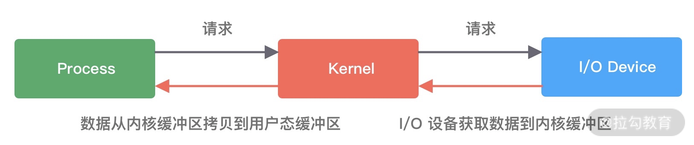
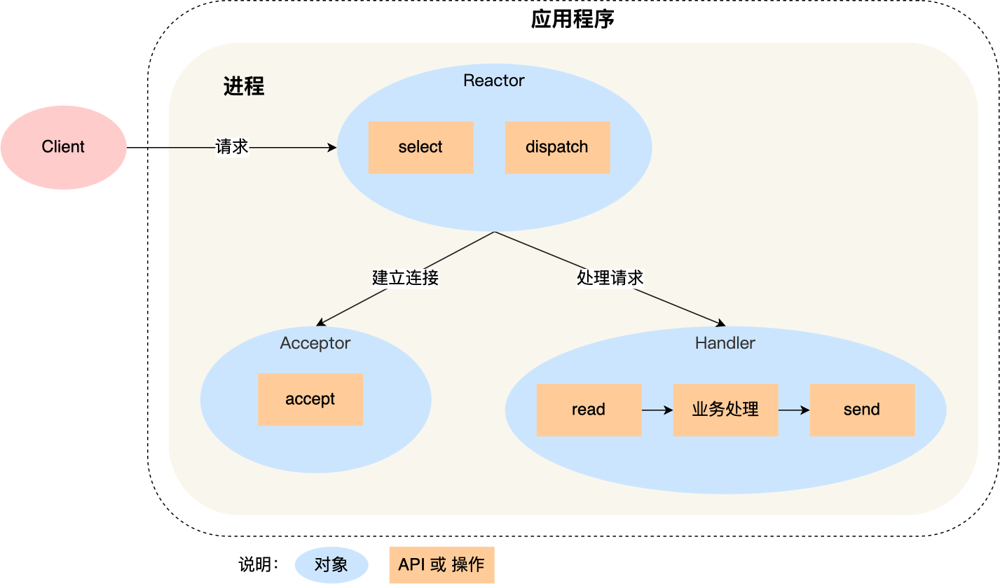
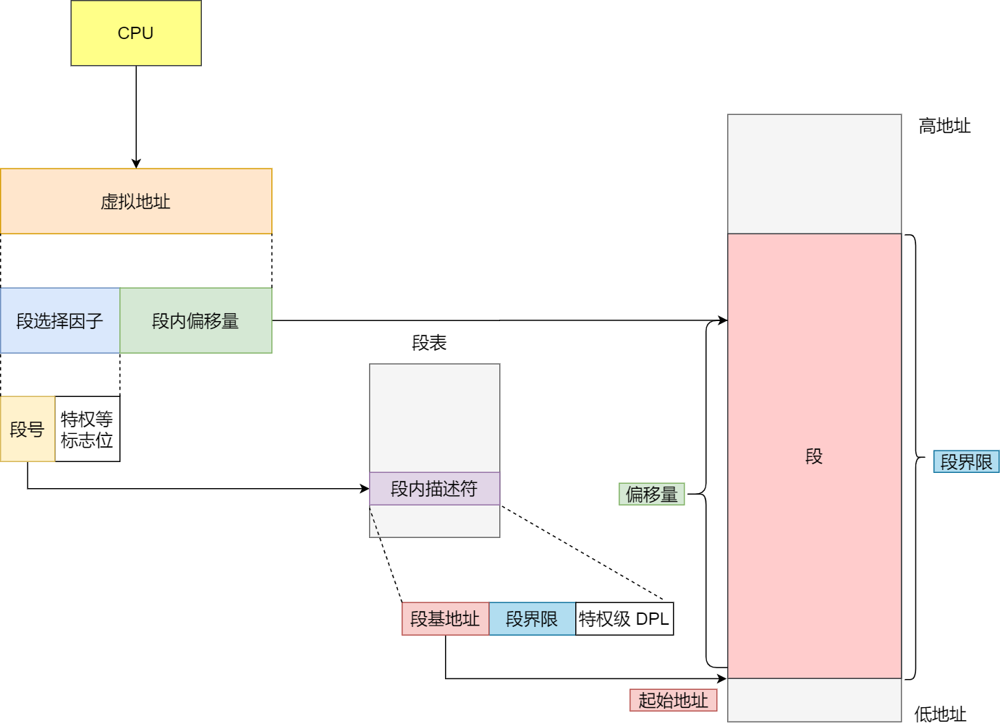
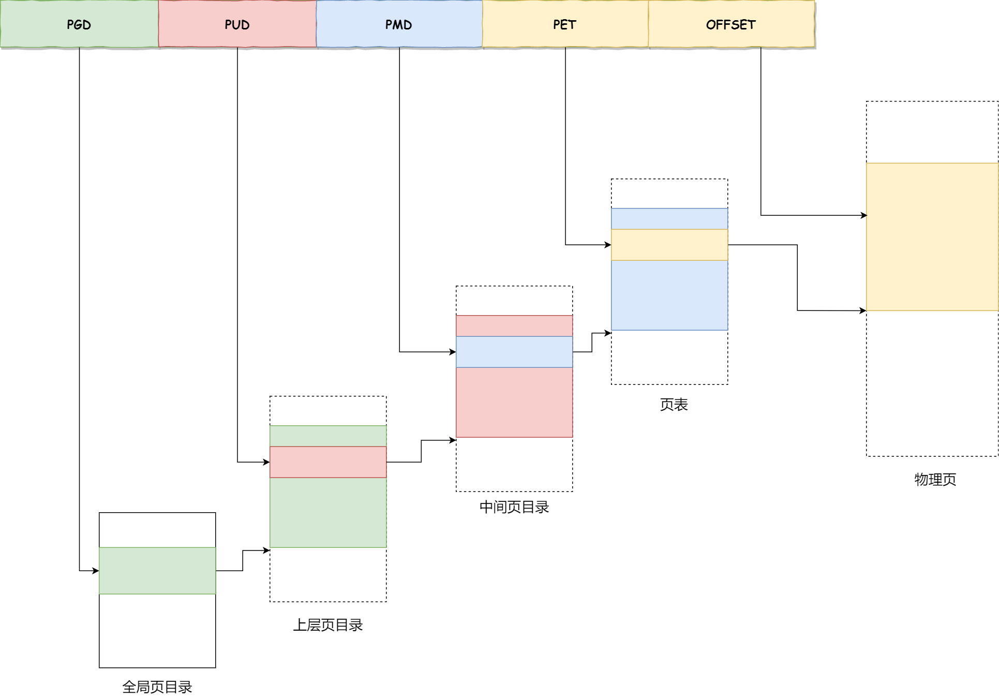
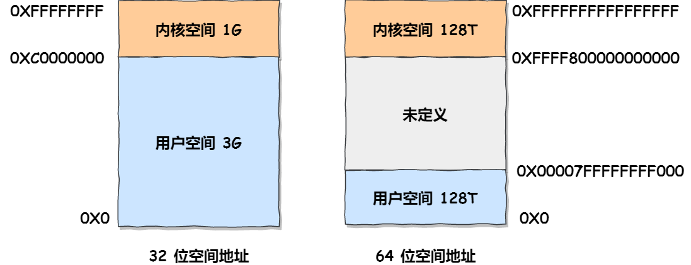

<div style="color:#16b0ff;font-size:50px;font-weight: 900;text-shadow: 5px 5px 10px var(--theme-color);font-family: 'Comic Sans MS';">OS</div>

<span style="color:#16b0ff;font-size:20px;font-weight: 900;font-family: 'Comic Sans MS';">Introduction</span>：收纳技术相关的 `JDK Tools`、`Linux Tools`、`Git` 等总结！

[TOC]

# I/O

Linux/Unix常见IO模型：**阻塞（Blocking I/O）**、**非阻塞（Non-Blocking I/O）**、**IO多路复用（I/O Multiplexing）**、 **信号驱动 I/O（Signal Driven I/O）**（不常用）和**异步（Asynchronous I/O）**。网络IO操作主要涉及到**内核**和**进程**，其主要分为两个过程：

- 内核等待数据可操作（可读或可写）——阻塞与非阻塞
- 内核与进程之间数据的拷贝——同步与异步


## 基础概念



I/O请求可以分为两个阶段，分别为调用阶段和执行阶段。

- 第一个阶段为I/O调用阶段，即用户进程向内核发起系统调用
- 第二个阶段为I/O执行阶段。此时，内核等待I/O请求处理完成返回。该阶段分为两个过程：首先等待数据就绪，并写入内核缓冲区；随后将内核缓冲区数据拷贝至用户态缓冲区


**① 阻塞（Blocking）和非阻塞（Non-blocking）**

阻塞和非阻塞发生在内核等待数据可操作（可读或可写）时，指做事时是否需要等待应答。

- **阻塞：** 内核检查数据不可操作，则不立即返回
- **非阻塞：** 内核检查数据不可操作，则立即返回

**② 同步（Synchronous）和异步（Asynchronous）**

同步和异步发生在内核与进程交互时，进程触发IO操作后是否需要等待或轮询查看结果。

- **同步：** 触发IO操作 → 等待或轮询查看结果
- **异步：** 触发IO操作 → 直接返回去做其它事，IO处理完后内核主动通知进程


### 阻塞I/O(BIO)

阻塞IO情况下，当用户调用`read`后，用户线程会被阻塞，等内核数据准备好并且数据从内核缓冲区拷贝到用户态缓存区后`read`才会返回。阻塞分两个阶段：

- **等待CPU把数据从磁盘读到内核缓冲区**
- **等待CPU把数据从内核缓冲区拷贝到用户缓冲区**


应用进程向内核发起 I/O 请求，发起调用的线程一直等待内核返回结果。一次完整的 I/O 请求称为BIO（Blocking IO，阻塞 I/O），所以 BIO 在实现异步操作时，只能使用多线程模型，一个请求对应一个线程。但是，线程的资源是有限且宝贵的，创建过多的线程会增加线程切换的开销。


### 非阻塞I/O(NIO)

非阻塞的 `read` 请求在数据未准备好的情况下立即返回，可以继续往下执行，此时应用程序不断轮询内核，询问数据是否准备好，当数据没有准备好时，内核立即返回EWOULDBLOCK错误。直到数据准备好后，内核将数据拷贝到应用程序缓冲区，`read` 请求才获取到结果。

**注意**：这里最后一次 `read` 调用获取数据的过程，是一个**同步的过程**，是需要等待的过程。这里的同步指的是**内核态的数据拷贝到用户程序的缓存区这个过程**。


注意，**这里最后一次 read 调用，获取数据的过程，是一个同步的过程，是需要等待的过程。这里的同步指的是内核态的数据拷贝到用户程序的缓存区这个过程。**

应用进程向内核发起 I/O 请求后不再会同步等待结果，而是会立即返回，通过轮询的方式获取请求结果。NIO 相比 BIO 虽然大幅提升了性能，但是轮询过程中大量的系统调用导致上下文切换开销很大。所以，单独使用非阻塞 I/O 时效率并不高，而且随着并发量的提升，非阻塞 I/O 会存在严重的性能浪费。


### I/O多路复用

非阻塞情况下无可用数据时，应用程序每次轮询内核看数据是否准备好了也耗费CPU，能否不让它轮询，当内核缓冲区数据准备好了，以事件通知当机制告知应用进程数据准备好了呢？应用进程在没有收到数据准备好的事件通知信号时可以忙写其他的工作。此时**IO多路复用**就派上用场了。像**select、poll、epoll** 都是I/O多路复用的具体的实现。


多路复用实现了一个线程处理多个 I/O 句柄的操作。多路指的是多个数据通道，复用指的是使用一个或多个固定线程来处理每一个 Socket。select、poll、epoll 都是 I/O 多路复用的具体实现，线程一次 select 调用可以获取内核态中多个数据通道的数据状态。多路复用解决了同步阻塞 I/O 和同步非阻塞 I/O 的问题，是一种非常高效的 I/O 模型。


### 信号驱动I/O

无论 `read` 和 `send` 是 `阻塞I/O`，还是 `非阻塞I/O` 都是同步调用。因为在 `read` 调用时，内核将数据从内核空间拷贝到用户空间的过程都是需要等待的，即这个过程是同步的，如果内核实现的拷贝效率不高，`read` 调用就会在这个同步过程中等待比较长的时间。


信号驱动 I/O 并不常用，它是一种半异步的 I/O 模型。在使用信号驱动 I/O 时，当数据准备就绪后，内核通过发送一个 SIGIO 信号通知应用进程，应用进程就可以开始读取数据了。


### 异步I/O

真正的异步 I/O 是`内核数据准备好` 和 `数据从内核态拷贝到用户态` 这两个过程都不用等待。

当我们发起 `aio_read` （异步 I/O） 之后，就立即返回，内核自动将数据从内核空间拷贝到用户空间，这个拷贝过程同样是异步的，内核自动完成的，和前面的同步操作不一样，应用程序并不需要主动发起拷贝动作。过程如下图：


异步 I/O 最重要的一点是从内核缓冲区拷贝数据到用户态缓冲区的过程也是由系统异步完成，应用进程只需要在指定的数组中引用数据即可。异步 I/O 与信号驱动 I/O 这种半异步模式的主要区别：信号驱动 I/O 由内核通知何时可以开始一个 I/O 操作，而异步 I/O 由内核通知 I/O 操作何时已经完成。


## Reactor模式

`Reactor 模式` 即 I/O 多路复用监听事件，收到事件后根据事件类型分配（Dispatch）给某个进程/线程。其主要由 `Reactor` 和 `处理资源池`  两个核心部分组成：

- **Reactor**：负责监听和分发事件。事件类型包含连接事件、读写事件
- **处理资源池**：负责处理事件。如：read -> 业务逻辑 -> send

Reactor 模式是灵活多变的，可以应对不同的业务场景，灵活在于：

- Reactor 的数量可以只有一个，也可以有多个
- 处理资源池可以是单个进程/线程，也可以是多个进程/线程


将上面的两个因素排列组设一下，理论上就可以有 4 种方案选择：

- **单 Reactor 单进程/线程**
- **单 Reactor 多进程/线程**
- **多 Reactor 单进程/线程**：相比 `单Reactor单进程/线程` 方案不仅复杂而且没有性能优势，因此可以忽略
- **多 Reactor 多进程/线程**


### 单Reactor单进程/单线程

一般来说，C 语言实现的是`单Reactor单进程`的方案，因为 C 语编写完的程序，运行后就是一个独立的进程，不需要在进程中再创建线程。而 Java 语言实现的是「单 Reactor 单线程」的方案，因为 Java 程序是跑在 Java 虚拟机这个进程上面的，虚拟机中有很多线程，我们写的 Java 程序只是其中的一个线程而已。以下是「`单 Reactor单进程`」的方案示意图：




可以看到进程里有 `Reactor`、`Acceptor`、`Handler` 这三个对象：

- `Reactor` 对象的作用是监听和分发事件
- `Acceptor` 对象的作用是获取连接
- `Handler` 对象的作用是处理业务

对象里的 `select`、`accept`、`read`、`send` 是系统调用函数，`dispatch` 和 `业务处理` 是需要完成的操作，其中 `dispatch` 是分发事件操作。


**工作流程**

- `Reactor` 对象通过 `select` （IO多路复用接口） 监听事件，收到事件后通过 `dispatch` 进行分发，具体分发给 `Acceptor` 对象还是 `Handler` 对象，还要看收到的事件类型
- 如果是连接建立的事件，则交由 `Acceptor` 对象进行处理，`Acceptor` 对象会通过 `accept` 方法 获取连接，并创建一个 `Handler` 对象来处理后续的响应事件
- 如果不是连接建立事件， 则交由当前连接对应的 `Handler` 对象来进行响应
- `Handler` 对象通过 `read` -> 业务处理 -> `send` 的流程来完成完整的业务流程


**优缺点**

- **优点**
  - 因为全部工作都在同一个进程内完成，所以实现起来比较简单
  - 不需要考虑进程间通信，也不用担心多进程竞争

- **缺点**
  - 因为只有一个进程，无法充分利用 多核 `CPU` 的性能
  - `Handler`对象在业务处理时，整个进程是无法处理其它连接事件，如果业务处理耗时比较长，那么就造成响应的延迟


**使用场景**

单Reactor单进程的方案`不适用计算机密集型的场景`，`只适用于业务处理非常快速的场景`。如：Redis 是由 C 语言实现的，它采用的正是「单Reactor单进程」的方案，因为 Redis 业务处理主要是在内存中完成，操作的速度是很快的，性能瓶颈不在 CPU 上，所以 Redis 对于命令的处理是单进程的方案。


### 单Reactor多线程/多进程

如果要克服`单 Reactor 单线程/单进程`方案的缺点，那么就需要引入多线程/多进程，这样就产生了**单Reactor多线程/多进程**的方案。具体方案的示意图如下：


**工作流程**

- `Reactor` 对象通过 `select` （IO 多路复用接口） 监听事件，收到事件后通过 `dispatch` 进行分发，具体分发给 `Acceptor` 对象还是 `Handler` 对象，还要看收到的事件类型
- 如果是连接建立的事件，则交由 `Acceptor` 对象进行处理，`Acceptor` 对象会通过 `accept` 方法获取连接，并创建一个 `Handler` 对象来处理后续的响应事件
- 如果不是连接建立事件， 则交由当前连接对应的 `Handler` 对象来进行响应
- `Handler` 对象不再负责业务处理，只负责数据的接收和发送，`Handler` 对象通过 `read` 读取到数据后，会将数据发给子线程里的 `Processor` 对象进行业务处理
- 子线程里的 `Processor` 对象就进行业务处理，处理完后，将结果发给主线程中的 `Handler` 对象，接着由 `Handler` 通过 `send` 方法将响应结果发送给 `client`


**单Reator多线程**

- **优势**：能够充分利用多核 `CPU` 的能力

- **缺点**：带来了多线程竞争资源问题（如需加互斥锁解决）

**单Reactor多进程**

- **缺点**
  - 需要考虑子进程和父进程的双向通信
  - 进程间通信远比线程间通信复杂


另外，`单Reactor` 的模式还有个问题，因为一个 `Reactor` 对象承担所有事件的 `监听` 和 `响应` ，而且只在主线程中运行，在面对瞬间高并发的场景时，容易成为性能瓶颈。


### 多Reactor多进程/多线程

要解决 `单Reactor` 的问题，就是将 `单Reactor` 实现成 `多Reactor`，这样就产生了 **多Reactor多进程/线程** 方案。其方案的示意图如下（以线程为例）：


**工作流程**

- 主线程中的 `MainReactor` 对象通过 `select` 监控连接建立事件，收到事件后通过 `Acceptor` 对象中的 `accept` 获取连接，将新的连接分配给某个子线程
- 子线程中的 `SubReactor` 对象将 `MainReactor` 对象分配的连接加入 `select` 继续进行监听，并创建一个 `Handler` 用于处理连接的响应事件
- 如果有新的事件发生时，`SubReactor` 对象会调用当前连接对应的 `Handler` 对象来进行响应
- `Handler` 对象通过 `read` -> 业务处理 -> `send` 的流程来完成完整的业务流程


**方案优势**

`多Reactor多线程` 的方案虽然看起来复杂的，但是实际实现时比 `单Reactor多线程`的方案要简单的多，原因如下：

- **分工明确**：主线程只负责接收新连接，子线程负责完成后续的业务处理
- **主线程和子线程的交互很简单**：主线程只需要把新连接传给子线程，子线程无须返回数据，直接就可以在子线程将处理结果发送给客户端


**应用场景**

- `多Reactor多线程`：开源软件 `Netty`、`Memcache`

- `多Reactor多进程`：开源软件 `Nginx`。不过 Nginx 方案与标准的多Reactor多进程有些差异，具体差异：
  - 主进程仅用来初始化 socket，并没有创建 mainReactor 来 accept 连接，而由子进程的 Reactor 来 accept 连接
  - 通过锁来控制一次只有一个子进程进行 accept（防止出现惊群现象），子进程 accept 新连接后就放到自己的 Reactor 进行处理，不会再分配给其他子进程


## Proactor模式

**Reactor 和 Proactor 的区别**

- **Reactor 是非阻塞同步网络模式，感知的是就绪可读写事件**
  - 在每次感知到有事件发生（比如可读就绪事件）后，就需要应用进程主动调用 `read` 方法来完成数据的读取，也就是要应用进程主动将 `socket` 接收缓存中的数据读到应用进程内存中，这个过程是同步的，读取完数据后应用进程才能处理数据
  - 简单理解：**来了事件**(有新连接、有数据可读、有数据可写)**操作系统通知应用进程，让应用进程来处理**(从驱动读取到内核以及从内核读取到用户空间)
- **Proactor 是异步网络模式， 感知的是已完成的读写事件**
  - 在发起异步读写请求时，需要传入数据缓冲区的地址（用来存放结果数据）等信息，这样系统内核才可以自动帮我们把数据的读写工作完成，这里的读写工作全程由操作系统来做，并不需要像 Reactor 那样还需要应用进程主动发起 read/write 来读写数据，操作系统完成读写工作后，就会通知应用进程直接处理数据
  - 简单理解：**来了事件**(有新连接、有数据可读、有数据可写)**操作系统来处理**(从驱动读取到内核，从内核读取到用户空间)，**处理完再通知应用进程**

无论是 Reactor，还是 Proactor，都是一种基于「事件分发」的网络编程模式，区别在于 **Reactor 模式是基于「待完成」的 I/O 事件，而 Proactor 模式则是基于「已完成」的 I/O 事件**。


Proactor 模式的示意图如下：


**工作流程**

- Proactor Initiator 负责创建 Proactor 和 Handler 对象，并将 Proactor 和 Handler 都通过
- Asynchronous Operation Processor 注册到内核
- Asynchronous Operation Processor 负责处理注册请求，并处理 I/O 操作；
- Asynchronous Operation Processor 完成 I/O 操作后通知 Proactor
- Proactor 根据不同的事件类型回调不同的 Handler 进行业务处理
- Handler 完成业务处理


**平台支持**

- **Linux**：在 `Linux` 下的 `异步I/O` 是不完善的，`aio` 系列函数是由 `POSIX` 定义的异步操作接口，不是真正的操作系统级别支持的，而是在用户空间模拟出来的异步。并且仅仅支持基于本地文件的 `aio` 异步操作，网络编程中的 `socket` 是不支持的，这也使得基于 `Linux` 的高性能网络程序都是使用 `Reactor` 方案
- **Windows** ：在 `Windows` 下实现了一套完整的支持 `socket` 的异步编程接口，这套接口就是 `IOCP`，是由操作系统级别实现的 `异步I/O`，真正意义上 `异步I/O`，因此在 `Windows` 里实现高性能网络程序可以使用效率更高的 `Proactor` 方案


## select/poll/epoll


**注意**：**遍历**相当于查看所有的位置，**回调**相当于查看对应的位置。


### select


`select` 本质上是通过设置或者检查存放 `fd` 标志位的数据结构来进行下一步处理。

**缺点**

- **单个进程可监视的`fd`数量被限制**。能监听端口的数量有限，数值存在文件：`cat /proc/sys/fs/file-max`
- **需要维护一个用来存放大量fd的数据结构**。这样会使得用户空间和内核空间在传递该结构时复制开销大
- **对fd进行扫描时是线性扫描**。`fd`剧增后，`IO`效率较低，因为每次调用都对`fd`进行线性扫描遍历，所以随着`fd`的增加会造成遍历速度慢的性能问题
- **`select()`函数的超时参数在返回时也是未定义的**。考虑到可移植性，每次在超时之后在下一次进入到`select`之前都需要重新设置超时参数

**优点**

- **`select()`的可移植性更好**。在某些`Unix`系统上不支持`poll()`
- **`select()`对于超时值提供了更好的精度：微秒**。而`poll`是毫秒


### poll


poll本质上和select没有区别，它将用户传入的数组拷贝到内核空间，然后查询每个fd对应的设备状态，如果设备就绪则在设备等待队列中加入一项并继续遍历，如果遍历完所有fd后没有发现就绪设备，则挂起当前进程，直到设备就绪或者主动超时，被唤醒后它又要再次遍历fd。这个过程经历了多次无谓的遍历。poll还有一个特点是“水平触发”，如果报告了fd后，没有被处理，那么下次poll时会再次报告该fd。

**缺点**

- 大量的fd的数组被整体复制于用户态和内核地址空间之间，而不管这样的复制是不是有意义
- 与select一样，poll返回后，需要轮询pollfd来获取就绪的描述符

**优点**

- poll() 不要求开发者计算最大文件描述符加一的大小
- poll() 在应付大数目的文件描述符的时候速度更快，相比于select
- 它没有最大连接数的限制，原因是它是基于链表来存储的


### epoll


epoll支持水平触发和边缘触发，最大的特点在于边缘触发，它只告诉进程哪些fd刚刚变为就需态，并且只会通知一次。还有一个特点是，epoll使用“事件”的就绪通知方式，通过epoll_ctl注册fd，一旦该fd就绪，内核就会采用类似callback的回调机制来激活该fd，epoll_wait便可以收到通知。


**优点**

- **支持一个进程打开大数目的socket描述符(FD)**

  select最不能忍受的是一个进程所打开的FD是有一定限制的，由FD_SETSIZE设置，默认值是1024/2048。对于那些需要支持的上万连接数目的IM服务器来说显然太少了。这时候你一是可以选择修改这个宏然后重新编译内核。不过 epoll则没有这个限制，它所支持的FD上限是最大可以打开文件的数目，这个数字一般远大于2048,举个例子,在1GB内存的机器上大约是10万左右，具体数目可以cat /proc/sys/fs/file-max察看,一般来说这个数目和系统内存关系很大。

- **IO效率不随FD数目增加而线性下降**

  传统的select/poll另一个致命弱点就是当你拥有一个很大的socket集合，不过由于网络延时，任一时间只有部分的socket是"活跃"的，但是select/poll每次调用都会线性扫描全部的集合，导致效率呈现线性下降。但是epoll不存在这个问题，它只会对"活跃"的socket进行操作---这是因为在内核实现中epoll是根据每个fd上面的callback函数实现的。那么，只有"活跃"的socket才会主动的去调用 callback函数，其他idle状态socket则不会，在这点上，epoll实现了一个"伪"AIO，因为这时候推动力在Linux内核。

- **使用mmap加速内核与用户空间的消息传递**

  这点实际上涉及到epoll的具体实现了。无论是select,poll还是epoll都需要内核把FD消息通知给用户空间，如何避免不必要的内存拷贝就很重要，在这点上，epoll是通过内核与用户空间mmap同一块内存实现的。


## 零拷贝(Zero-Copy)

### 数据的四次拷贝与四次上下文切换

很多应用程序在面临客户端请求时，可以等价为进行如下的系统调用：

- File.read(file, buf, len);
- Socket.send(socket, buf, len);

例如消息中间件 Kafka 就是这个应用场景，从磁盘中读取一批消息后原封不动地写入网卡（NIC，Network interface controller）进行发送。在没有任何优化技术使用的背景下，操作系统为此会进行 4 次数据拷贝，以及 4 次上下文切换，如下图所示：


如果没有优化，读取磁盘数据，再通过网卡传输的场景性能比较差：

**4次copy**

- CPU 负责将数据从磁盘搬运到内核空间的 Page Cache 中
- CPU 负责将数据从内核空间的 Socket 缓冲区搬运到的网络中
- CPU 负责将数据从内核空间的 Page Cache 搬运到用户空间的缓冲区
- CPU 负责将数据从用户空间的缓冲区搬运到内核空间的 Socket 缓冲区中

**4次上下文切换**

- read 系统调用时：用户态切换到内核态
- read 系统调用完毕：内核态切换回用户态
- write 系统调用时：用户态切换到内核态
- write 系统调用完毕：内核态切换回用户态

**问题分析**

- CPU 全程负责内存内的数据拷贝还可以接受，因为效率还算可以接受，但是如果要全程负责内存与磁盘、网络的数据拷贝，这将难以接受，因为磁盘、网卡的速度远小于内存，内存又远远小于 CPU
- 4 次 copy 太多了，4 次上下文切换也太频繁了


### 零拷贝技术

零拷贝技术是一个思想，指的是指计算机执行操作时，CPU 不需要先将数据从某处内存复制到另一个特定区域。

可见，零拷贝的特点是 CPU 不全程负责内存中的数据写入其他组件，CPU 仅仅起到管理的作用。但注意，零拷贝不是不进行拷贝，而是 CPU 不再全程负责数据拷贝时的搬运工作。如果数据本身不在内存中，那么必须先通过某种方式拷贝到内存中（这个过程 CPU 可以不参与），因为数据只有在内存中，才能被转移，才能被 CPU 直接读取计算。

零拷贝技术的具体实现方式有很多，例如：

- **sendfile**
- **mmap**
- **splice**
- **直接 Direct I/O**

不同的零拷贝技术适用于不同的应用场景，下面依次进行 sendfile、mmap、Direct I/O 的分析。

- DMA 技术回顾：DMA 负责内存与其他组件之间的数据拷贝，CPU 仅需负责管理，而无需负责全程的数据拷贝；
- 使用 page cache 的 zero copy：
- sendfile：一次代替 read/write 系统调用，通过使用 DMA 技术以及传递文件描述符，实现了 zero copy
- mmap：仅代替 read 系统调用，将内核空间地址映射为用户空间地址，write 操作直接作用于内核空间。通过 DMA 技术以及地址映射技术，用户空间与内核空间无须数据拷贝，实现了 zero copy
- 不使用 page cache 的 Direct I/O：读写操作直接在磁盘上进行，不使用 page cache 机制，通常结合用户空间的用户缓存使用。通过 DMA 技术直接与磁盘/网卡进行数据交互，实现了 zero copy

#### sendfile

snedfile 的应用场景是用户从磁盘读取一些文件数据后不需要经过任何计算与处理就通过网络传输出去。此场景的典型应用是消息队列。在传统 I/O 下，上述应用场景的一次数据传输需要四次 CPU 全权负责的拷贝与四次上下文切换。sendfile 主要使用到了两个技术：

- DMA 技术
- 传递文件描述符代替数据拷贝

**利用DMA技术**

sendfile 依赖于 DMA 技术，将四次 CPU 全程负责的拷贝与四次上下文切换减少到两次，如下图所示：


利用 DMA 技术减少 2 次 CPU 全程参与的拷贝DMA 负责磁盘到内核空间中的 Page cache（read buffer）的数据拷贝以及从内核空间中的 socket buffer 到网卡的数据拷贝。


https://blog.csdn.net/weixin_38726452/article/details/120168360


https://mp.weixin.qq.com/s?__biz=Mzg4MDAxNzkyMw==&mid=2247489694&idx=1&sn=3c9f532eb9d650b2ae2b1db5d0c91b09&chksm=cf7acff2f80d46e431c0bd0d60270a8ce3d31af8a50678e11d5b39bb6c8a9dfa333e7ac56704&mpshare=1&scene=23&srcid=0903RuYh2ynm5j60Y7QtETJO&sharer_sharetime=1638369376739&sharer_shareid=0f9991a2eb945ab493c13ed9bfb8bf4b%23rd


## BIO(同步阻塞I/O)

每个客户端的Socket连接请求，服务端都会对应有个处理线程与之对应，对于没有分配到处理线程的连接就会被阻塞或者拒绝。相当于是`一个连接一个线程`。

用户需要等待read将socket中的数据读取到buffer后，才继续处理接收的数据。整个IO请求的过程中，用户线程是被阻塞的，这导致用户在发起IO请求时，不能做任何事情，对CPU的资源利用率不够。


**特点：**I/O执行的两个阶段进程都是阻塞的。

- 使用一个独立的线程维护一个socket连接，随着连接数量的增多，对虚拟机造成一定压力
- 使用流来读取数据，流是阻塞的，当没有可读/可写数据时，线程等待，会造成资源的浪费


**优点**

- 能够及时的返回数据，无延迟
- 程序简单，进程挂起基本不会消耗CPU时间


**缺点**

- I/O等待对性能影响较大
- 每个连接需要独立的一个进程/线程处理，当并发请求量较大时为了维护程序，内存、线程和CPU上下文切换开销较大，因此较少在开发环境中使用


## NIO(同步非阻塞I/O)

服务器端保存一个Socket连接列表，然后对这个列表进行轮询：

- 如果发现某个Socket端口上有数据可读时说明读就绪，则调用该Socket连接的相应读操作
- 如果发现某个Socket端口上有数据可写时说明写就绪，则调用该Socket连接的相应写操作
- 如果某个端口的Socket连接已经中断，则调用相应的析构方法关闭该端口

这样能充分利用服务器资源，效率得到了很大提高，在进行I/O操作请求时候再用个线程去处理，是`一个请求一个线程`。Java中使用Selector、Channel、Buffer来实现上述效果。

- `Selector`：Selector允许单线程处理多个Channel。如果应用打开了多个连接（通道），但每个连接的流量都很低，使用Selector就会很方便。要使用Selector，得向Selector注册Channel，然后调用他的select方法，这个方法会一直阻塞到某个注册的通道有事件就绪。一旦这个方法返回，线程就可以处理这些事件，事件的例子入有新连接接进来，数据接收等。
- `Channel`：基本上所有的IO在NIO中都从一个Channel开始。Channel有点像流，数据可以从channel**读**到buffer，也可以从buffer**写**到channel。
- `Buffer`：缓冲区本质上是一个可以读写数据的内存块，可以理解成是一个容器对象(含数组)，该对象提供了一组方法，可以更轻松的使用内存块，缓冲区对象内置了一些机制，能够跟踪和记录缓冲区的状态变换情况，Channel提供从文件，网络读取数据的渠道，但是读取或者写入的数据都必须经由Buffer。

用户需要不断地调用read，尝试读取socket中的数据，直到读取成功后，才继续处理接收的数据。整个IO请求过程中，虽然用户线程每次发起IO请求后可以立即返回，但为了等到数据，仍需要不断地轮询、重复请求，消耗了大量的CPU的资源。


**特点：**non-blocking I/O模式需要不断的主动询问kernel数据是否已准备好。

**优点**

- 进程在等待当前任务完成时，可以同时执行其他任务进程不会被阻塞在内核等待数据过程，每次发起的I/O请求会立即返回，具有较好的实时性

**缺点**

- 不断轮询将占用大量CPU时间，系统资源利用率大打折扣，影响性能，整体数据吞吐量下降
- 该模型不适用web服务器


## IO多路复用(异步阻塞I/O)

通过Reactor的方式，可以将用户线程轮询IO操作状态的工作统一交给handle_events事件循环进行处理。用户线程注册事件处理器之后可以继续执行做其他的工作（异步），而Reactor线程负责调用内核的select函数检查socket状态。当有socket被激活时，则通知相应的用户线程（或执行用户线程的回调函数），执行handle_event进行数据读取、处理的工作。


**特点：**通过一种机制能同时等待多个文件描述符，而这些文件描述符（套接字描述符）其中的任意一个变为可读就绪状态，select()/poll()函数就会返回。

**优点**

- 可以基于一个阻塞对象，同时在多个描述符上可读就绪，而不是使用多个线程（每个描述符一个线程），即能处理更多的连接
- 可以节省更多的系统资源

**缺点：**

- 如果处理的连接数不是很多的话，使用select/poll的web server不一定比使用multi-threading + blocking I/O的web server性能更好
- 可能延迟还更大，因为处理一个连接数需要发起两次system call


## AIO(异步非阻塞I/O)

AIO(异步非阻塞IO,即NIO.2)。异步IO模型中，用户线程直接使用内核提供的异步IO API发起read请求，且发起后立即返回，继续执行用户线程代码。不过此时用户线程已经将调用的AsynchronousOperation和CompletionHandler注册到内核，然后操作系统开启独立的内核线程去处理IO操作。当read请求的数据到达时，由内核负责读取socket中的数据，并写入用户指定的缓冲区中。最后内核将read的数据和用户线程注册的CompletionHandler分发给内部Proactor，Proactor将IO完成的信息通知给用户线程（一般通过调用用户线程注册的完成事件处理函数），完成异步IO。


**特点：**第一阶段和第二阶段都是有内核完成。

**优点**

- 能充分利用DMA的特性，将I/O操作与计算重叠，提高性能、资源利用率与并发能力

**缺点**

- 在程序的实现上比较困难
- 要实现真正的异步 I/O，操作系统需要做大量的工作。目前 Windows 下通过 IOCP 实现了真正的异步 I/O。而在 Linux 系统下，Linux 2.6才引入，目前 AIO 并不完善，因此在 Linux 下实现高并发网络编程时都是以 复用式I/O模型为主


## 信号驱动式I/O

信号驱动式I/O是指进程预先告知内核，使得某个文件描述符上发生了变化时，内核使用信号通知该进程。在信号驱动式I/O模型，进程使用socket进行信号驱动I/O，并建立一个SIGIO信号处理函数，当进程通过该信号处理函数向内核发起I/O调用时，内核并没有准备好数据报，而是返回一个信号给进程，此时进程可以继续发起其他I/O调用。也就是说，在第一阶段内核准备数据的过程中，进程并不会被阻塞，会继续执行。当数据报准备好之后，内核会递交SIGIO信号，通知用户空间的信号处理程序，数据已准备好；此时进程会发起recvfrom的系统调用，这一个阶段与阻塞式I/O无异。也就是说，在第二阶段内核复制数据到用户空间的过程中，进程同样是被阻塞的。

**信号驱动式I/O的整个过程图如下：**


**第一阶段（非阻塞）：**

- ①：进程使用socket进行信号驱动I/O，建立SIGIO信号处理函数，向内核发起系统调用，内核在未准备好数据报的情况下返回一个信号给进程，此时进程可以继续做其他事情
- ②：内核将磁盘中的数据加载至内核缓冲区完成后，会递交SIGIO信号给用户空间的信号处理程序

**第二阶段（阻塞）：**

- ③：进程在收到SIGIO信号程序之后，进程向内核发起系统调用（recvfrom）
- ④：内核再将内核缓冲区中的数据复制到用户空间中的进程缓冲区中（真正执行IO过程的阶段），直到数据复制完成
- ⑤：内核返回成功数据处理完成的指令给进程；进程在收到指令后再对数据包进程处理；处理完成后，此时的进程解除不可中断睡眠态，执行下一个I/O操作


**特点：**借助socket进行信号驱动I/O并建立SIGIO信号处理函数

**优点**

- 线程并没有在第一阶段（数据等待）时被阻塞，提高了资源利用率；

**缺点**

- 在程序的实现上比较困难
- 信号 I/O 在大量 IO 操作时可能会因为信号队列溢出导致没法通知。信号驱动 I/O 尽管对于处理 UDP 套接字来说有用，即这种信号通知意味着到达一个数据报，或者返回一个异步错误。但是，对于 TCP 而言，信号驱动的 I/O 方式近乎无用，因为导致这种通知的条件为数众多，每一个来进行判别会消耗很大资源，与前几种方式相比优势尽失


**信号通知机制**

- **水平触发：**指数据报到内核缓冲区准备好之后，内核通知进程后，进程因繁忙未发起recvfrom系统调用；内核会再次发送通知信号，循环往复，直到进程来请求recvfrom系统调用。很明显，这种方式会频繁消耗过多的系统资源
- **边缘触发：**内核只会发送一次通知信号


# TCP

TCP是**面向连接的、可靠的、基于字节流**的传输层通信协议：


- **面向连接**：一定是**一对一**才能连接，不能像UDP协议可以一个主机同时向多个主机发送消息，即一对多是无法做到的

- **可靠的**：无论的网络链路中出现了怎样的链路变化，TCP 都可以保证一个报文一定能够到达接收端

- **字节流**：消息是**没有边界**的，所以无论消息有多大都可以进行传输。并且消息是**有序的**，当**前一个**消息没有收到的时候，即使它先收到了后面的字节已经收到，那么也不能扔给应用层去处理，同时对**重复**的报文会自动丢弃


**TCP头部格式**


- **序列号**：在建立连接时由计算机生成的随机数作为其初始值，通过 SYN 包传给接收端主机，每发送一次数据，就「累加」一次该「数据字节数」的大小。**用来解决网络包乱序问题**
- **确认应答号**：指下一次「期望」收到的数据的序列号，发送端收到这个确认应答以后可以认为在这个序号以前的数据都已经被正常接收。**用来解决不丢包的问题**
- **控制位：**
  - **ACK**：该位为 `1` 时，「确认应答」的字段变为有效，TCP 规定除了最初建立连接时的 `SYN` 包之外该位必须设置为 `1` 
  - **RST**：该位为 `1` 时，表示 TCP 连接中出现异常必须强制断开连接
  - **SYN**：该位为 `1` 时，表示希望建立连接，并在其「序列号」的字段进行序列号初始值的设定
  - **FIN**：该位为 `1` 时，表示今后不会再有数据发送，希望断开连接。当通信结束希望断开连接时，通信双方的主机之间就可以相互交换 `FIN` 位置为 1 的 TCP 段


## 网络模型

谈一谈你对 TCP/IP 四层模型，OSI 七层模型的理解？

### OSI参考模型

OSI（Open System Interconnect），即开放式系统互联。 一般都叫OSI参考模型，是ISO（国际标准化组织）组织在1985年研究的网络互连模型。ISO为了更好的使网络应用更为普及，推出了OSI参考模型。其含义就是推荐所有公司使用这个规范来控制网络。这样所有公司都有相同的规范，就能互联了。


### TCP/IP五层模型

 TCP/IP五层协议和OSI的七层协议对应关系如下：


## TCP状态


- **CLOSED：** 表示初始状态
- **LISTEN：** 表示服务器端的某个SOCKET处于监听状态，可以接受连接了
- **SYN_RCVD：** 表示接收到了SYN报文
- **SYN_SENT：** 表示客户端已发送SYN报文
- **ESTABLISHED：**表示连接已经建立了
- **TIME_WAIT：**表示收到了对方的FIN报文，并发送出了ACK报文，就等2MSL后即可回到CLOSED可用状态了
- **CLOSING：** 表示你发送FIN报文后，并没有收到对方的ACK报文，反而却也收到了对方的FIN报文。如果双方几乎在同时close一个SOCKET的话，那么就出现了双方同时发送FIN报 文的情况，也即会出现CLOSING状态，表示双方都正在关闭SOCKET连接
- **CLOSE_WAIT：** 表示在等待关闭


**如何在 Linux 系统中查看 TCP 状态？**

TCP 的连接状态查看，在 Linux 可以通过 `netstat -napt` 命令查看：


### TIME_WAIT 

**① 为什么需要 TIME_WAIT 状态？**

主动发起关闭连接的一方，才会有 `TIME-WAIT` 状态。需要 TIME-WAIT 状态，主要是两个原因：

- 防止具有相同「四元组」的「旧」数据包被收到
- 保证「被动关闭连接」的一方能被正确的关闭，即保证最后的 ACK 能让被动关闭方接收，从而帮助其正常关闭


**② TIME_WAIT 过多有什么危害？**

如果服务器有处于 TIME-WAIT 状态的 TCP，则说明是由服务器方主动发起的断开请求。过多的 TIME-WAIT 状态主要的危害有两种：

- 第一是内存资源占用
- 第二是对端口资源的占用，一个 TCP 连接至少消耗一个本地端口

第二个危害是会造成严重的后果的，要知道，端口资源也是有限的，一般可以开启的端口为 `32768～61000`，也可以通过如下参数设置指定

```shell
net.ipv4.ip_local_port_range
```

**如果发起连接一方的 TIME_WAIT 状态过多，占满了所有端口资源，则会导致无法创建新连接。**

客户端受端口资源限制：

- 客户端TIME_WAIT过多，就会导致端口资源被占用，因为端口就65536个，被占满就会导致无法创建新的连接

服务端受系统资源限制：

- 由于一个四元组表示 TCP 连接，理论上服务端可以建立很多连接，服务端确实只监听一个端口 但是会把连接扔给处理线程，所以理论上监听的端口可以继续监听。但是线程池处理不了那么多一直不断的连接了。所以当服务端出现大量 TIME_WAIT 时，系统资源被占满时，会导致处理不过来新的连接


**③ 如何优化 TIME_WAIT？**

这里给出优化 `TIME-WAIT` 的几个方式，都是有利有弊：

- 打开 `net.ipv4.tcp_tw_reuse` 和 `net.ipv4.tcp_timestamps` 选项
- `net.ipv4.tcp_max_tw_buckets`
- 程序中使用`SO_LINGER`，应用强制使用`RST`关闭


**④ 为什么 TIME_WAIT 等待的时间是 2MSL？**

`MSL` 是 Maximum Segment Lifetime，**报文最大生存时间**，它是任何报文在网络上存在的最长时间，超过这个时间报文将被丢弃。因为 TCP 报文基于是 IP 协议的，而 IP 头中有一个 `TTL` 字段，是 IP 数据报可以经过的最大路由数，每经过一个处理他的路由器此值就减 1，当此值为 0 则数据报将被丢弃，同时发送 ICMP 报文通知源主机。

**MSL 与 TTL 的区别**： MSL 的单位是时间，而 TTL 是经过路由跳数。所以 **MSL 应该要大于等于 TTL 消耗为 0 的时间**，以确保报文已被自然消亡。

TIME_WAIT 等待 2 倍的 MSL，比较合理的解释是： 网络中可能存在来自发送方的数据包，当这些发送方的数据包被接收方处理后又会向对方发送响应，所以**一来一回需要等待 2 倍的时间**。

比如如果被动关闭方没有收到断开连接的最后的 ACK 报文，就会触发超时重发 Fin 报文，另一方接收到 FIN 后，会重发 ACK 给被动关闭方， 一来一去正好 2 个 MSL。

`2MSL` 的时间是从**客户端接收到 FIN 后发送 ACK 开始计时的**。如果在 TIME-WAIT 时间内，因为客户端的 ACK 没有传输到服务端，客户端又接收到了服务端重发的 FIN 报文，那么 **2MSL 时间将重新计时**。

在 Linux 系统里 `2MSL` 默认是 `60` 秒，那么一个 `MSL` 也就是 `30` 秒。**Linux 系统停留在 TIME_WAIT 的时间为固定的 60 秒**。

其定义在 Linux 内核代码里的名称为 TCP_TIMEWAIT_LEN：

```shell
#define TCP_TIMEWAIT_LEN (60*HZ) /* how long to wait to destroy TIME-WAIT  state, about 60 seconds  */
```

如果要修改TIME_WAIT的时间长度，只能修改Linux内核代码里TCP_TIMEWAIT_LEN的值，并重新编译Linux内核。


## 连接过程


参考文档：https://www.cnblogs.com/jojop/p/14111160.html

### TCP三次握手

开始客户端和服务器都处于CLOSED状态，然后服务端开始监听某个端口，进入LISTEN状态：

- 第一次握手(SYN=1, seq=x)，发送完毕后，客户端进入 SYN_SENT 状态
- 第二次握手(SYN=1, ACK=1, seq=y, ACKnum=x+1)， 发送完毕后，服务器端进入 SYN_RCVD 状态
- 第三次握手(ACK=1，ACKnum=y+1)，发送完毕后，客户端进入 ESTABLISHED 状态，当服务器端接收到这个包时,也进入 ESTABLISHED 状态，TCP 握手，即可以开始数据传输


- 假设一开始客户端和服务端都处于`CLOSED`的状态。然后先是服务端主动监听某个端口，处于`LISTEN`状态

- 【第一个报文】：客户端会随机初始化序号（`client_isn`），将此序号置于 `TCP` 首部的「序号」字段中，同时把 `SYN` 标志位置为 `1` ，表示 `SYN` 报文。接着把第一个 SYN 报文发送给服务端，表示向服务端发起连接，该报文不包含应用层数据，之后客户端处于 `SYN-SENT` 状态

  

- 【第二个报文】：服务端收到客户端的 `SYN` 报文后，首先服务端也随机初始化自己的序号（`server_isn`），将此序号填入 TCP 首部的「序号」字段中，其次把 TCP 首部的「确认应答号」字段填入 `client_isn + 1`, 接着把 `SYN` 和 `ACK` 标志位置为 `1`。最后把该报文发给客户端，该报文也不包含应用层数据，之后服务端处于 `SYN-RCVD` 状态

  

- 【第三个报文】：客户端收到服务端报文后，还要向服务端回应最后一个应答报文，首先该应答报文 TCP 首部 `ACK` 标志位置为 `1` ，其次「确认应答号」字段填入 `server_isn + 1` ，最后把报文发送给服务端，**这次报文可以携带客户到服务器的数据**，之后客户端处于 `ESTABLISHED` 状态

  

- 服务器收到客户端的应答报文后，也进入 `ESTABLISHED` 状态


**第三次握手是否可以携带数据?**

**第三次握手是可以携带数据的，前两次握手是不可以携带数据的**。一旦完成三次握手，双方都处于 `ESTABLISHED` 状态，此时连接就已建立完成，客户端和服务端就可以相互发送数据了。假设第三次握手的报文的`seq`是`x+1`：

- **如果有携带数据**：下次客户端发送的报文，`seq=服务器发回的ACK号`
- **如果没有携带数据**：第三次握手的报文不消耗`seq`，下次客户端发送的报文，`seq`序列号为`x+1`

**① 服务端SYN-RECV流程**


**② 客户端SYN-SEND流程**


- **场景1：sk->sk_write_pending != 0**

  这个值默认是0的，那什么情况会导致不为0呢？答案是协议栈发送数据的函数遇到socket状态不是ESTABLISHED的时候，会对这个变量做++操作，并等待一小会时间尝试发送数据。

- **场景2：icsk->icsk_accept_queue.rskq_defer_accept != 0**

  客户端先bind到一个端口和IP，然后setsockopt(TCP_DEFER_ACCEPT），然后connect服务器，这个时候就会出现rskq_defer_accept=1的情况，这时候内核会设置定时器等待数据一起在回复ACK包。

- **场景3：icsk->icsk_ack.pingpong != 0**

  pingpong这个属性实际上也是一个套接字选项，用来表明当前链接是否为交互数据流，如其值为1，则表明为交互数据流，会使用延迟确认机制。


**为什么是三次握手？不是两次、四次？**

TCP建立连接时，通过三次握手**能防止历史连接的建立，能减少双方不必要的资源开销，能帮助双方同步初始化序列号**。序列号能够保证数据包不重复、不丢弃和按序传输。不使用「两次握手」和「四次握手」的原因：

- **两次握手**：无法防止历史连接的建立，会造成双方资源的浪费，也无法可靠的同步双方序列号
- **四次握手**：三次握手就已经理论上最少可靠连接建立，所以不需要使用更多的通信次数

接下来以三个方面分析三次握手的原因：

- 三次握手才可以阻止重复历史连接的初始化（主要原因）
- 三次握手才可以同步双方的初始序列号
- 三次握手才可以避免资源浪费

**原因一：避免历史连接**

客户端连续发送多次 SYN 建立连接的报文，在**网络拥堵**情况下：

- 一个「旧 SYN 报文」比「最新的 SYN 」 报文早到达了服务端
- 那么此时服务端就会回一个 `SYN + ACK` 报文给客户端
- 客户端收到后可以根据自身的上下文，判断这是一个历史连接（序列号过期或超时），那么客户端就会发送 `RST` 报文给服务端，表示中止这一次连接


如果是两次握手连接，就不能判断当前连接是否是历史连接，三次握手则可以在客户端（发送方）准备发送第三次报文时，客户端因有足够的上下文来判断当前连接是否是历史连接：

- 如果是历史连接（序列号过期或超时），则第三次握手发送的报文是 `RST` 报文，以此中止历史连接
- 如果不是历史连接，则第三次发送的报文是 `ACK` 报文，通信双方就会成功建立连接

所以，TCP 使用三次握手建立连接的最主要原因是**防止历史连接初始化了连接。**

**原因二：同步双方初始序列号**

TCP 协议的通信双方， 都必须维护一个「序列号」， 序列号是可靠传输的一个关键因素，它的作用：  

- 接收方可以去除重复的数据
- 接收方可以根据数据包的序列号按序接收
- 可以标识发送出去的数据包中， 哪些是已经被对方收到的

可见，序列号在 TCP 连接中占据着非常重要的作用，所以当客户端发送携带「初始序列号」的 `SYN` 报文的时候，需要服务端回一个 `ACK` 应答报文，表示客户端的 SYN 报文已被服务端成功接收，那当服务端发送「初始序列号」给客户端的时候，依然也要得到客户端的应答回应，**这样一来一回，才能确保双方的初始序列号能被可靠的同步。**


四次握手其实也能够可靠的同步双方的初始化序号，但由于**第二步和第三步可以优化成一步**，所以就成了「三次握手」。而两次握手只保证了一方的初始序列号能被对方成功接收，没办法保证双方的初始序列号都能被确认接收。

**原因三：避免资源浪费**

如果只有「两次握手」，当客户端的 `SYN` 请求连接在网络中阻塞，客户端没有接收到 `ACK` 报文，就会重新发送 `SYN` ，由于没有第三次握手，服务器不清楚客户端是否收到了自己发送的建立连接的 `ACK` 确认信号，所以每收到一个 `SYN` 就只能先主动建立一个连接，这会造成什么情况呢？如果客户端的 `SYN` 阻塞了，重复发送多次 `SYN` 报文，那么服务器在收到请求后就会**建立多个冗余的无效链接，造成不必要的资源浪费。**


即两次握手会造成消息滞留情况下，服务器重复接受无用的连接请求 `SYN` 报文，而造成重复分配资源。


### TCP四次挥手

- 第一次挥手：**FIN=1，seq=u**，发送完毕后客户端进入**FIN_WAIT_1** 状态
- 第二次挥手：**ACK=1，seq =v，ack=u+1**，发送完毕后服务器端进入**CLOSE_WAIT** 状态，客户端接收到后进入 **FIN_WAIT_2** 状态
- 第三次挥手：**FIN=1，ACK=1，seq=w，ack=u+1**，发送完毕后服务器端进入**LAST_ACK**状态，客户端接收到后进入 **TIME_WAIT**状态
- 第四次挥手：**ACK=1，seq=u+1，ack=w+1**，客户端接收到来自服务器端的关闭请求，发送一个确认包，并进入 TIME_WAIT状态，等待了某个固定时间（两个最大段生命周期，**2MSL**，2 Maximum Segment Lifetime）之后，没有收到服务器端的 ACK ，认为服务器端已经正常关闭连接，于是自己也关闭连接，进入 CLOSED 状态。服务器端接收到这个确认包之后，关闭连接，进入 **CLOSED** 状态


四次挥手过程：

- 客户端打算关闭连接，此时会发送一个 TCP 首部 `FIN` 标志位被置为 `1` 的报文，也即 `FIN` 报文，之后客户端进入 `FIN_WAIT_1` 状态
- 服务端收到该报文后，就向客户端发送 `ACK` 应答报文，接着服务端进入 `CLOSED_WAIT` 状态
- 客户端收到服务端的 `ACK` 应答报文后，之后进入 `FIN_WAIT_2` 状态
- 等待服务端处理完数据后，也向客户端发送 `FIN` 报文，之后服务端进入 `LAST_ACK` 状态
- 客户端收到服务端的 `FIN` 报文后，回一个 `ACK` 应答报文，之后进入 `TIME_WAIT` 状态
- 服务器收到了 `ACK` 应答报文后，就进入了 `CLOSE` 状态，至此服务端已经完成连接的关闭
- 客户端在经过 `2MSL` 一段时间后，自动进入 `CLOSE` 状态，至此客户端也完成连接的关闭


**为什么挥手需要四次？**

再来回顾下四次挥手双方发 `FIN` 包的过程，就能理解为什么需要四次了。

- 关闭连接时，客户端向服务端发送 `FIN` 时，仅仅表示客户端不再发送数据了但是还能接收数据。
- 服务器收到客户端的 `FIN` 报文时，先回一个 `ACK` 应答报文，而服务端可能还有数据需要处理和发送，等服务端不再发送数据时，才发送 `FIN` 报文给客户端来表示同意现在关闭连接。

从上面过程可知，服务端通常需要等待完成数据的发送和处理，所以服务端的 `ACK` 和 `FIN` 一般都会分开发送，从而比三次握手导致多了一次。


## TCP优化

正确有效的使用TCP参数可以提高 TCP 性能。以下将从三个角度来阐述提升 TCP 的策略，分别是：

### TCP三次握手优化


### TCP四次挥手优化


### TCP数据传输优化


## 常见问题

### TCP和UDP

**TCP和UDP的区别？**

- **连接**
  - TCP 是面向连接的传输层协议，传输数据前先要建立连接
  - UDP 是不需要连接，即刻传输数据

- **服务对象**
  - TCP 是一对一的两点服务，即一条连接只有两个端点
  - UDP 支持一对一、一对多、多对多的交互通信

- **可靠性**
  - TCP 是可靠交付数据的，数据可以无差错、不丢失、不重复、按需到达
  - UDP 是尽最大努力交付，不保证可靠交付数据

- **拥塞控制、流量控制**
  - TCP 有拥塞控制和流量控制机制，保证数据传输的安全性
  - UDP 则没有，即使网络非常拥堵了，也不会影响 UDP 的发送速率

- **首部开销**
  - TCP 首部长度较长，会有一定的开销，首部在没有使用「选项」字段时是 `20` 个字节，如果使用了「选项」字段则会变长的
  - UDP 首部只有 8 个字节，并且是固定不变的，开销较小

- **传输方式**
  - TCP 是流式传输，没有边界，但保证顺序和可靠
  - UDP 是一个包一个包的发送，是有边界的，但可能会丢包和乱序

- **分片不同**
  - TCP 的数据大小如果大于 MSS 大小，则会在传输层进行分片，目标主机收到后，也同样在传输层组装 TCP 数据包，如果中途丢失了一个分片，只需要传输丢失的这个分片
  - UDP 的数据大小如果大于 MTU 大小，则会在 IP 层进行分片，目标主机收到后，在 IP 层组装完数据，接着再传给传输层，但是如果中途丢了一个分片，则就需要重传所有的数据包，这样传输效率非常差，所以通常 UDP 的报文应该小于 MTU


### ISN

**① 为什么客户端和服务端的初始序列号 ISN 是不相同的？**

如果一个已经失效的连接被重用了，但是该旧连接的历史报文还残留在网络中，如果序列号相同，那么就无法分辨出该报文是不是历史报文，如果历史报文被新的连接接收了，则会产生数据错乱。所以，每次建立连接前重新初始化一个序列号主要是为了通信双方能够根据序号将不属于本连接的报文段丢弃。另一方面是为了安全性，防止黑客伪造的相同序列号的 TCP 报文被对方接收。


**② 初始序列号 ISN 是如何随机产生的？**

起始 `ISN` 是基于时钟的，每 4 毫秒 + 1，转一圈要 4.55 个小时。RFC1948 中提出了一个较好的初始化序列号 ISN 随机生成算法。

**ISN = M + F (localhost, localport, remotehost, remoteport)**

- `M` 是一个计时器，这个计时器每隔 4 毫秒加 1
- `F` 是一个 Hash 算法，根据源 IP、目的 IP、源端口、目的端口生成一个随机数值。要保证 Hash 算法不能被外部轻易推算得出，用 MD5 算法是一个比较好的选择


### UDP


**总结**

- TCP 向上层提供面向连接的可靠服务 ，UDP 向上层提供无连接不可靠服务
- UDP 没有 TCP 传输可靠，但是可以在实时性要求搞的地方有所作为
- 对数据准确性要求高，速度可以相对较慢的，可以选用TCP


### TCP数据可靠性

一句话：通过`校验和`、`序列号`、`确认应答`、`超时重传`、`连接管理`、`流量控制`、`拥塞控制`等机制来保证可靠性。

**（1）校验和**

在数据传输过程中，将发送的数据段都当做一个16位的整数，将这些整数加起来，并且前面的进位不能丢弃，补在最后，然后取反，得到校验和。

发送方：在发送数据之前计算校验和，并进行校验和的填充。接收方：收到数据后，对数据以同样的方式进行计算，求出校验和，与发送方进行比较。

**（2）序列号**

TCP 传输时将每个字节的数据都进行了编号，这就是序列号。序列号的作用不仅仅是应答作用，有了序列号能够将接收到的数据根据序列号进行排序，并且去掉重复的数据。

**（3）确认应答**

TCP 传输过程中，每次接收方接收到数据后，都会对传输方进行确认应答，也就是发送 ACK 报文，这个 ACK 报文中带有对应的确认序列号，告诉发送方，接收了哪些数据，下一次数据从哪里传。

**（4）超时重传**

在进行 TCP 传输时，由于存在确认应答与序列号机制，也就是说发送方发送一部分数据后，都会等待接收方发送的 ACK 报文，并解析 ACK 报文，判断数据是否传输成功。如果发送方发送完数据后，迟迟都没有接收到接收方传来的 ACK 报文，那么就对刚刚发送的数据进行重发。

**（5）连接管理**

就是指三次握手、四次挥手的过程。

**（6）流量控制**

如果发送方的发送速度太快，会导致接收方的接收缓冲区填充满了，这时候继续传输数据，就会造成大量丢包，进而引起丢包重传等等一系列问题。TCP 支持根据接收端的处理能力来决定发送端的发送速度，这就是流量控制机制。

具体实现方式：接收端将自己的接收缓冲区大小放入 TCP 首部的『窗口大小』字段中，通过 ACK 通知发送端。

**（7）拥塞控制**

TCP 传输过程中一开始就发送大量数据，如果当时网络非常拥堵，可能会造成拥堵加剧。所以 TCP 引入了`慢启动机制`，在开始发送数据的时候，先发少量的数据探探路。


### TCP协议如何提高传输效率

一句话：TCP 协议提高效率的方式有`滑动窗口`、`快重传`、`延迟应答`、`捎带应答`等。

**（1）滑动窗口**

如果每一个发送的数据段，都要收到 ACK 应答之后再发送下一个数据段，这样的话我们效率很低，大部分时间都用在了等待 ACK 应答上了。

为了提高效率我们可以一次发送多条数据，这样就能使等待时间大大减少，从而提高性能。窗口大小指的是无需等待确认应答而可以继续发送数据的最大值。

**（2）快重传**

`快重传`也叫`高速重发控制`。

那么如果出现了丢包，需要进行重传。一般分为两种情况：

情况一：数据包已经抵达，ACK被丢了。这种情况下，部分ACK丢了并不影响，因为可以通过后续的ACK进行确认；

情况二：数据包直接丢了。发送端会连续收到多个相同的 ACK 确认，发送端立即将对应丢失的数据重传。

**（3）延迟应答**

如果接收数据的主机立刻返回ACK应答，这时候返回的窗口大小可能比较小。

- 假设接收端缓冲区为1M，一次收到了512K的数据；如果立刻应答，返回的窗口就是512K；
- 但实际上可能处理端处理速度很快，10ms之内就把512K的数据从缓存区消费掉了；
- 在这种情况下，接收端处理还远没有达到自己的极限，即使窗口再放大一些，也能处理过来；
- 如果接收端稍微等一会在应答，比如等待200ms再应答，那么这个时候返回的窗口大小就是1M；

窗口越大，网络吞吐量就越大，传输效率就越高；我们的目标是在保证网络不拥塞的情况下尽量提高传输效率。

**（4）捎带应答**

在延迟应答的基础上，很多情况下，客户端服务器在应用层也是一发一收的。这时候常常采用捎带应答的方式来提高效率，而ACK响应常常伴随着数据报文共同传输。如：三次握手。


### TCP如何处理拥塞

网络拥塞现象是指到达通信网络中某一部分的分组数量过多，使得该部分网络来不及处理，以致引起这部分乃至整个网络性能下降的现象，严重时甚至会导致网络通信业务陷入停顿，即出现死锁现象。拥塞控制是处理网络拥塞现象的一种机制。

拥塞控制的四个阶段:

- 慢启动
- 拥塞避免
- 快速重传
- 快速恢复


## Socket

基于TCP协议的客户端和服务器工作：


- 服务端和客户端初始化 `socket`，得到文件描述符
- 服务端调用 `bind`，将绑定在 IP 地址和端口
- 服务端调用 `listen`，进行监听
- 服务端调用 `accept`，等待客户端连接
- 客户端调用 `connect`，向服务器端的地址和端口发起连接请求
- 服务端 `accept` 返回用于传输的 `socket` 的文件描述符
- 客户端调用 `write` 写入数据；服务端调用 `read` 读取数据
- 客户端断开连接时，会调用 `close`，那么服务端 `read` 读取数据的时候，就会读取到了 `EOF`，待处理完数据后，服务端调用 `close`，表示连接关闭


> **listen 时候参数 backlog 的意义？**
>
> Linux内核中会维护两个队列：
>
> - 未完成连接队列（SYN 队列）：接收到一个 SYN 建立连接请求，处于 SYN_RCVD 状态；
> - 已完成连接队列（Accpet 队列）：已完成 TCP 三次握手过程，处于 ESTABLISHED 状态；
>
>  
>
> SYN 队列 与 Accpet 队列 
>
> ```shell
> int listen (int socketfd, int backlog)
> ```
>
> - 参数一 socketfd 为 socketfd 文件描述符
> - 参数二 backlog，这参数在历史内环版本有一定的变化
>
> 在早期Linux内核backlog是SYN队列大小，也就是未完成的队列大小。在Linux内核2.2之后，backlog变成accept队列，也就是已完成连接建立的队列长度，**所以现在通常认为backlog是accept队列**。但是上限值是内核参数somaxconn的大小，也就说accpet队列长度=min(backlog, somaxconn)。

> **accept 发送在三次握手的哪一步？**
>
> 我们先看看客户端连接服务端时，发送了什么？
>
> 
>
> - 客户端的协议栈向服务器端发送了 SYN 包，并告诉服务器端当前发送序列号 client_isn，客户端进入 SYNC_SENT 状态
> - 服务器端的协议栈收到这个包之后，和客户端进行 ACK 应答，应答的值为 client_isn+1，表示对 SYN 包 client_isn 的确认，同时服务器也发送一个 SYN 包，告诉客户端当前我的发送序列号为 server_isn，服务器端进入 SYNC_RCVD 状态
> - 客户端协议栈收到 ACK 之后，使得应用程序从 `connect` 调用返回，表示客户端到服务器端的单向连接建立成功，客户端的状态为 ESTABLISHED，同时客户端协议栈也会对服务器端的 SYN 包进行应答，应答数据为 server_isn+1
> - 应答包到达服务器端后，服务器端协议栈使得 `accept` 阻塞调用返回，这个时候服务器端到客户端的单向连接也建立成功，服务器端也进入 ESTABLISHED 状态
>
> 从上面的描述过程，我们可以得知**客户端 connect 成功返回是在第二次握手，服务端 accept 成功返回是在三次握手成功之后。**

> **客户端调用 close 了，连接是断开的流程是什么？**
>
> 我们看看客户端主动调用了 `close`，会发生什么？
>
> 
>
> - 客户端调用 `close`，表明客户端没有数据需要发送了，则此时会向服务端发送FIN报文，进入FIN_WAIT_1状态
> - 服务端接收到了 FIN 报文，TCP协议栈会为 FIN 包插入一个文件结束符 `EOF` 到接收缓冲区中，应用程序可以通过 `read` 调用来感知这个 FIN 包。这个 `EOF` 会被**放在已排队等候的其他已接收的数据之后**，这就意味着服务端需要处理这种异常情况，因为EOF表示在该连接上再无额外数据到达。此时服务端进入 CLOSE_WAIT 状态
> - 接着，当处理完数据后，自然就会读到 `EOF`，于是也调用 `close` 关闭它的套接字，这会使得会发出一个 FIN 包，之后处于 LAST_ACK 状态
> - 客户端接收到服务端的 FIN 包，并发送 ACK 确认包给服务端，此时客户端将进入 TIME_WAIT 状态
> - 服务端收到 ACK 确认包后，就进入了最后的 CLOSE 状态
> - 客户端进过 `2MSL` 时间之后，也进入 CLOSE 状态


## TCP源码

### tcp_v4_connect()

- 描述: 建立与服务器连接，发送SYN段

- 返回值: 0或错误码

- 代码关键路径:

  ```c
  int tcp_v4_connect(struct sock *sk, struct sockaddr *uaddr, int addr_len)
  {
      .....　     
      /* 设置目的地址和目标端口 */
      inet->dport = usin->sin_port;
      inet->daddr = daddr;
      ....     
      /* 初始化MSS上限 */
      tp->rx_opt.mss_clamp = 536;
  
      /* Socket identity is still unknown (sport may be zero).
       * However we set state to SYN-SENT and not releasing socket
       * lock select source port, enter ourselves into the hash tables and
       * complete initialization after this.
       */
      tcp_set_state(sk, TCP_SYN_SENT);/* 设置状态 */
      err = tcp_v4_hash_connect(sk);/* 将传输控制添加到ehash散列表中，并动态分配端口 */
      if (err)
          goto failure;
      ....
      if (!tp->write_seq)/* 还未计算初始序号 */
          /* 根据双方地址、端口计算初始序号 */
          tp->write_seq = secure_tcp_sequence_number(inet->saddr,
                                 inet->daddr,
                                 inet->sport,
                                 usin->sin_port);
  
      /* 根据初始序号和当前时间，随机算一个初始id */
      inet->id = tp->write_seq ^ jiffies;
  
      /* 发送SYN段 */
      err = tcp_connect(sk);
      rt = NULL;
      if (err)
          goto failure;
  
      return 0;
  }
  ```


### sys_accept()

- 描述: 调用tcp_accept(), 并把它返回的newsk进行连接描述符分配后返回给用户空间。

- 返回值: 连接描述符

- 代码关键路径:

  ```c
  asmlinkage long sys_accept(int fd, struct sockaddr __user *upeer_sockaddr, int __user *upeer_addrlen)
  {
      struct socket *sock, *newsock;
      .....     
      sock = sockfd_lookup(fd, &err);/* 获得侦听端口的socket */
      .....    
      if (!(newsock = sock_alloc()))/* 分配一个新的套接口，用来处理与客户端的连接 */ 
      .....     
      /* 调用传输层的accept，对TCP来说，是inet_accept */
      err = sock->ops->accept(sock, newsock, sock->file->f_flags);
      ....    
      if (upeer_sockaddr) {/* 调用者需要获取对方套接口地址和端口 */
          /* 调用传输层回调获得对方的地址和端口 */
          if(newsock->ops->getname(newsock, (struct sockaddr *)address, &len, 2)<0) {
          }
          /* 成功后复制到用户态 */
          err = move_addr_to_user(address, len, upeer_sockaddr, upeer_addrlen);
      }
      .....     
      if ((err = sock_map_fd(newsock)) < 0)/* 为新连接分配文件描述符 */
  
      return err;
  }
  ```


### tcp_accept()

**[注]**: 在内核2.6.32以后对应函数为inet_csk_accept().

- 描述: 通过在规定时间内，判断tcp_sock->accept_queue队列非空，代表有新的连接进入．

- 返回值: (struct sock *)newsk;

- 代码关键路径:

  ```c
  struct sock *tcp_accept(struct sock *sk, int flags, int *err)
  {
      ....
      /* Find already established connection */
      if (!tp->accept_queue) {/* accept队列为空，说明还没有收到新连接 */
          long timeo = sock_rcvtimeo(sk, flags & O_NONBLOCK);/* 如果套口是非阻塞的，或者在一定时间内没有新连接，则返回 */
  
          if (!timeo)/* 超时时间到，没有新连接，退出 */
              goto out;
  
          /* 运行到这里，说明有新连接到来，则等待新的传输控制块 */
          error = wait_for_connect(sk, timeo);
          if (error)
              goto out;
      }
  
      req = tp->accept_queue;
      if ((tp->accept_queue = req->dl_next) == NULL)
          tp->accept_queue_tail = NULL;
  
      newsk = req->sk;
      sk_acceptq_removed(sk);
      tcp_openreq_fastfree(req);
      ....
  
      return newsk;
  }
  ```

### 三次握手

#### 客户端发送SYN段

- 由tcp_v4_connect()->tcp_connect()->tcp_transmit_skb()发送，并置为TCP_SYN_SENT.

- 代码关键路径:

  ```c
  /* 构造并发送SYN段 */
  int tcp_connect(struct sock *sk)
  {
      struct tcp_sock *tp = tcp_sk(sk);
      struct sk_buff *buff;
  
      tcp_connect_init(sk);/* 初始化传输控制块中与连接相关的成员 */
  
      /* 为SYN段分配报文并进行初始化 */
      buff = alloc_skb(MAX_TCP_HEADER + 15, sk->sk_allocation);
      if (unlikely(buff == NULL))
          return -ENOBUFS;
  
      /* Reserve space for headers. */
      skb_reserve(buff, MAX_TCP_HEADER);
  
      TCP_SKB_CB(buff)->flags = TCPCB_FLAG_SYN;
      TCP_ECN_send_syn(sk, tp, buff);
      TCP_SKB_CB(buff)->sacked = 0;
      skb_shinfo(buff)->tso_segs = 1;
      skb_shinfo(buff)->tso_size = 0;
      buff->csum = 0;
      TCP_SKB_CB(buff)->seq = tp->write_seq++;
      TCP_SKB_CB(buff)->end_seq = tp->write_seq;
      tp->snd_nxt = tp->write_seq;
      tp->pushed_seq = tp->write_seq;
      tcp_ca_init(tp);
  
      /* Send it off. */
      TCP_SKB_CB(buff)->when = tcp_time_stamp;
      tp->retrans_stamp = TCP_SKB_CB(buff)->when;
  
      /* 将报文添加到发送队列上 */
      __skb_queue_tail(&sk->sk_write_queue, buff);
      sk_charge_skb(sk, buff);
      tp->packets_out += tcp_skb_pcount(buff);
      /* 发送SYN段 */
      tcp_transmit_skb(sk, skb_clone(buff, GFP_KERNEL));
      TCP_INC_STATS(TCP_MIB_ACTIVEOPENS);
  
      /* Timer for repeating the SYN until an answer. */
      /* 启动重传定时器 */
      tcp_reset_xmit_timer(sk, TCP_TIME_RETRANS, tp->rto);
      return 0;
  }
  ```


#### 服务端发送SYN和ACK处理

服务端接收到SYN段后，发送SYN/ACK处理：

- 由tcp_v4_do_rcv()->tcp_rcv_state_process()->tcp_v4_conn_request()->tcp_v4_send_synack().

- tcp_v4_send_synack()

  - tcp_make_synack(sk, dst, req);  ** 根据路由、传输控制块、连接请求块中的构建SYN+ACK段 **

  - ip_build_and_send_pkt(); * 生成IP数据报并发送出去 *


  - 代码关键路径:

    ```c
    /* 向客户端发送SYN+ACK报文 */
    static int tcp_v4_send_synack(struct sock *sk, struct open_request *req,
                      struct dst_entry *dst)
    {
        int err = -1;
        struct sk_buff * skb;
    
        /* First, grab a route. */
        /* 查找到客户端的路由 */
        if (!dst && (dst = tcp_v4_route_req(sk, req)) == NULL)
            goto out;
    
        /* 根据路由、传输控制块、连接请求块中的构建SYN+ACK段 */
        skb = tcp_make_synack(sk, dst, req);
    
        if (skb) {/* 生成SYN+ACK段成功 */
            struct tcphdr *th = skb->h.th;
    
            /* 生成校验码 */
            th->check = tcp_v4_check(th, skb->len,
                         req->af.v4_req.loc_addr,
                         req->af.v4_req.rmt_addr,
                         csum_partial((char *)th, skb->len,
                                  skb->csum));
    
            /* 生成IP数据报并发送出去 */
            err = ip_build_and_send_pkt(skb, sk, req->af.v4_req.loc_addr,
                            req->af.v4_req.rmt_addr,
                            req->af.v4_req.opt);
            if (err == NET_XMIT_CN)
                err = 0;
        }
    
    out:
        dst_release(dst);
        return err;
    }
    ```


#### 客户端回复确认ACK段

- 由tcp_v4_do_rcv()->tcp_rcv_state_process().当前客户端处于TCP_SYN_SENT状态。

- tcp_rcv_synsent_state_process(); \* tcp_rcv_synsent_state_process处理SYN_SENT状态下接收到的TCP段 *

  - tcp_ack(); ** 处理接收到的ack报文 **

  - tcp_send_ack(); * 在主动连接时，向服务器端发送ACK完成连接，并更新窗口 *

    - alloc_skb(); ** 构造ack段 **
    - tcp_transmit_skb(); ** 将ack段发出 **
    
  - tcp_urg(sk, skb, th); ** 处理完第二次握手后，还需要处理带外数据 **
  
  - tcp_data_snd_check(sk); \* 检测是否有数据需要发送 *
  
    - 检查sk->sk_send_head队列上是否有待发送的数据。
  - tcp_write_xmit(); ** 将TCP发送队列上的段发送出去 **
  
- 代码关键路径:

```c
/* 在SYN_SENT状态下处理接收到的段，但是不处理带外数据 */
static int tcp_rcv_synsent_state_process(struct sock *sk, struct sk_buff *skb,
                   struct tcphdr *th, unsigned len)
{
  struct tcp_sock *tp = tcp_sk(sk);
  int saved_clamp = tp->rx_opt.mss_clamp;

  /* 解析TCP选项并保存到传输控制块中 */
  tcp_parse_options(skb, &tp->rx_opt, 0);

  if (th->ack) {/* 处理ACK标志 */
      /* rfc793:
       * "If the state is SYN-SENT then
       *    first check the ACK bit
       *      If the ACK bit is set
       *    If SEG.ACK =< ISS, or SEG.ACK > SND.NXT, send
       *        a reset (unless the RST bit is set, if so drop
       *        the segment and return)"
       *
       *  We do not send data with SYN, so that RFC-correct
       *  test reduces to:
       */
      if (TCP_SKB_CB(skb)->ack_seq != tp->snd_nxt)
          goto reset_and_undo;

      if (tp->rx_opt.saw_tstamp && tp->rx_opt.rcv_tsecr &&
          !between(tp->rx_opt.rcv_tsecr, tp->retrans_stamp,
               tcp_time_stamp)) {
          NET_INC_STATS_BH(LINUX_MIB_PAWSACTIVEREJECTED);
          goto reset_and_undo;
      }

      /* Now ACK is acceptable.
       *
       * "If the RST bit is set
       *    If the ACK was acceptable then signal the user "error:
       *    connection reset", drop the segment, enter CLOSED state,
       *    delete TCB, and return."
       */

      if (th->rst) {/* 收到ACK+RST段，需要tcp_reset设置错误码，并关闭套接口 */
          tcp_reset(sk);
          goto discard;
      }

      /* rfc793:
       *   "fifth, if neither of the SYN or RST bits is set then
       *    drop the segment and return."
       *
       *    See note below!
       *                                        --ANK(990513)
       */
      if (!th->syn)/* 在SYN_SENT状态下接收到的段必须存在SYN标志，否则说明接收到的段无效，丢弃该段 */
          goto discard_and_undo;

      /* rfc793:
       *   "If the SYN bit is on ...
       *    are acceptable then ...
       *    (our SYN has been ACKed), change the connection
       *    state to ESTABLISHED..."
       */

      /* 从首部标志中获取显示拥塞通知的特性 */
      TCP_ECN_rcv_synack(tp, th);
      if (tp->ecn_flags&TCP_ECN_OK)/* 如果支持ECN，则设置标志 */
          sk->sk_no_largesend = 1;

      /* 设置与窗口相关的成员变量 */
      tp->snd_wl1 = TCP_SKB_CB(skb)->seq;
      tcp_ack(sk, skb, FLAG_SLOWPATH);

      /* Ok.. it's good. Set up sequence numbers and
       * move to established.
       */
      tp->rcv_nxt = TCP_SKB_CB(skb)->seq + 1;
      tp->rcv_wup = TCP_SKB_CB(skb)->seq + 1;

      /* RFC1323: The window in SYN & SYN/ACK segments is
       * never scaled.
       */
      tp->snd_wnd = ntohs(th->window);
      tcp_init_wl(tp, TCP_SKB_CB(skb)->ack_seq, TCP_SKB_CB(skb)->seq);

      if (!tp->rx_opt.wscale_ok) {
          tp->rx_opt.snd_wscale = tp->rx_opt.rcv_wscale = 0;
          tp->window_clamp = min(tp->window_clamp, 65535U);
      }

      if (tp->rx_opt.saw_tstamp) {/* 根据是否支持时间戳选项来设置传输控制块的相关字段 */
          tp->rx_opt.tstamp_ok       = 1;
          tp->tcp_header_len =
              sizeof(struct tcphdr) + TCPOLEN_TSTAMP_ALIGNED;
          tp->advmss      -= TCPOLEN_TSTAMP_ALIGNED;
          tcp_store_ts_recent(tp);
      } else {
          tp->tcp_header_len = sizeof(struct tcphdr);
      }

      /* 初始化PMTU、MSS等成员变量 */
      if (tp->rx_opt.sack_ok && sysctl_tcp_fack)
          tp->rx_opt.sack_ok |= 2;

      tcp_sync_mss(sk, tp->pmtu_cookie);
      tcp_initialize_rcv_mss(sk);

      /* Remember, tcp_poll() does not lock socket!
       * Change state from SYN-SENT only after copied_seq
       * is initialized. */
      tp->copied_seq = tp->rcv_nxt;
      mb();
      tcp_set_state(sk, TCP_ESTABLISHED);

      /* Make sure socket is routed, for correct metrics.  */
      tp->af_specific->rebuild_header(sk);

      tcp_init_metrics(sk);

      /* Prevent spurious tcp_cwnd_restart() on first data
       * packet.
       */
      tp->lsndtime = tcp_time_stamp;

      tcp_init_buffer_space(sk);

      /* 如果启用了连接保活，则启用连接保活定时器 */
      if (sock_flag(sk, SOCK_KEEPOPEN))
          tcp_reset_keepalive_timer(sk, keepalive_time_when(tp));

      if (!tp->rx_opt.snd_wscale)/* 首部预测 */
          __tcp_fast_path_on(tp, tp->snd_wnd);
      else
          tp->pred_flags = 0;

      if (!sock_flag(sk, SOCK_DEAD)) {/* 如果套口不处于SOCK_DEAD状态，则唤醒等待该套接口的进程 */
          sk->sk_state_change(sk);
          sk_wake_async(sk, 0, POLL_OUT);
      }

      /* 连接建立完成，根据情况进入延时确认模式 */
      if (sk->sk_write_pending || tp->defer_accept || tp->ack.pingpong) {
          /* Save one ACK. Data will be ready after
           * several ticks, if write_pending is set.
           *
           * It may be deleted, but with this feature tcpdumps
           * look so _wonderfully_ clever, that I was not able
           * to stand against the temptation 8)     --ANK
           */
          tcp_schedule_ack(tp);
          tp->ack.lrcvtime = tcp_time_stamp;
          tp->ack.ato  = TCP_ATO_MIN;
          tcp_incr_quickack(tp);
          tcp_enter_quickack_mode(tp);
          tcp_reset_xmit_timer(sk, TCP_TIME_DACK, TCP_DELACK_MAX);

discard:
          __kfree_skb(skb);
          return 0;
      } else {/* 不需要延时确认，立即发送ACK段 */
          tcp_send_ack(sk);
      }
      return -1;
  }

  /* No ACK in the segment */

  if (th->rst) {/* 收到RST段，则丢弃传输控制块 */
      /* rfc793:
       * "If the RST bit is set
       *
       *      Otherwise (no ACK) drop the segment and return."
       */

      goto discard_and_undo;
  }

  /* PAWS check. */
  /* PAWS检测失效，也丢弃传输控制块 */
  if (tp->rx_opt.ts_recent_stamp && tp->rx_opt.saw_tstamp && tcp_paws_check(&tp->rx_opt, 0))
      goto discard_and_undo;

  /* 在SYN_SENT状态下收到了SYN段并且没有ACK，说明是两端同时打开 */
  if (th->syn) {
      /* We see SYN without ACK. It is attempt of
       * simultaneous connect with crossed SYNs.
       * Particularly, it can be connect to self.
       */
      tcp_set_state(sk, TCP_SYN_RECV);/* 设置状态为TCP_SYN_RECV */

      if (tp->rx_opt.saw_tstamp) {/* 设置时间戳相关的字段 */
          tp->rx_opt.tstamp_ok = 1;
          tcp_store_ts_recent(tp);
          tp->tcp_header_len =
              sizeof(struct tcphdr) + TCPOLEN_TSTAMP_ALIGNED;
      } else {
          tp->tcp_header_len = sizeof(struct tcphdr);
      }

      /* 初始化窗口相关的成员变量 */
      tp->rcv_nxt = TCP_SKB_CB(skb)->seq + 1;
      tp->rcv_wup = TCP_SKB_CB(skb)->seq + 1;

      /* RFC1323: The window in SYN & SYN/ACK segments is
       * never scaled.
       */
      tp->snd_wnd    = ntohs(th->window);
      tp->snd_wl1    = TCP_SKB_CB(skb)->seq;
      tp->max_window = tp->snd_wnd;

      TCP_ECN_rcv_syn(tp, th);/* 从首部标志中获取显式拥塞通知的特性。 */
      if (tp->ecn_flags&TCP_ECN_OK)
          sk->sk_no_largesend = 1;

      /* 初始化MSS相关的成员变量 */
      tcp_sync_mss(sk, tp->pmtu_cookie);
      tcp_initialize_rcv_mss(sk);

      /* 向对端发送SYN+ACK段，并丢弃接收到的SYN段 */
      tcp_send_synack(sk);
#if 0
      /* Note, we could accept data and URG from this segment.
       * There are no obstacles to make this.
       *
       * However, if we ignore data in ACKless segments sometimes,
       * we have no reasons to accept it sometimes.
       * Also, seems the code doing it in step6 of tcp_rcv_state_process
       * is not flawless. So, discard packet for sanity.
       * Uncomment this return to process the data.
       */
      return -1;
#else
      goto discard;
#endif
  }
  /* "fifth, if neither of the SYN or RST bits is set then
   * drop the segment and return."
   */

discard_and_undo:
  tcp_clear_options(&tp->rx_opt);
  tp->rx_opt.mss_clamp = saved_clamp;
  goto discard;

reset_and_undo:
  tcp_clear_options(&tp->rx_opt);
  tp->rx_opt.mss_clamp = saved_clamp;
  return 1;
}
```


#### 服务端收到ACK段

- 由tcp_v4_do_rcv()->tcp_rcv_state_process().当前服务端处于TCP_SYN_RECV状态变为TCP_ESTABLISHED状态。

- 代码关键路径:

  ```c
  /* 除了ESTABLISHED和TIME_WAIT状态外，其他状态下的TCP段处理都由本函数实现 */ 
  int tcp_rcv_state_process(struct sock *sk, struct sk_buff *skb,
                struct tcphdr *th, unsigned len)
  {
      struct tcp_sock *tp = tcp_sk(sk);
      int queued = 0;
  
      tp->rx_opt.saw_tstamp = 0;
  
      switch (sk->sk_state) {
      .....
      /* SYN_RECV状态的处理 */
      if (tcp_fast_parse_options(skb, th, tp) && tp->rx_opt.saw_tstamp &&/* 解析TCP选项，如果首部中存在时间戳选项 */
          tcp_paws_discard(tp, skb)) {/* PAWS检测失败，则丢弃报文 */
          if (!th->rst) {/* 如果不是RST段 */
              /* 发送DACK给对端，说明接收到的TCP段已经处理过 */
              NET_INC_STATS_BH(LINUX_MIB_PAWSESTABREJECTED);
              tcp_send_dupack(sk, skb);
              goto discard;
          }
          /* Reset is accepted even if it did not pass PAWS. */
      }
  
      /* step 1: check sequence number */
      if (!tcp_sequence(tp, TCP_SKB_CB(skb)->seq, TCP_SKB_CB(skb)->end_seq)) {/* TCP段序号无效 */
          if (!th->rst)/* 如果TCP段无RST标志，则发送DACK给对方 */
              tcp_send_dupack(sk, skb);
          goto discard;
      }
  
      /* step 2: check RST bit */
      if(th->rst) {/* 如果有RST标志，则重置连接 */
          tcp_reset(sk);
          goto discard;
      }
  
      /* 如果有必要，则更新时间戳 */
      tcp_replace_ts_recent(tp, TCP_SKB_CB(skb)->seq);
  
      /* step 3: check security and precedence [ignored] */
  
      /*  step 4:
       *
       *  Check for a SYN in window.
       */
      if (th->syn && !before(TCP_SKB_CB(skb)->seq, tp->rcv_nxt)) {/* 如果有SYN标志并且序号在接收窗口内 */
          NET_INC_STATS_BH(LINUX_MIB_TCPABORTONSYN);
          tcp_reset(sk);/* 复位连接 */
          return 1;
      }
  
      /* step 5: check the ACK field */
      if (th->ack) {/* 如果有ACK标志 */
          /* 检查ACK是否为正常的第三次握手 */
          int acceptable = tcp_ack(sk, skb, FLAG_SLOWPATH);
  
          switch(sk->sk_state) {
          case TCP_SYN_RECV:
              if (acceptable) {
                  tp->copied_seq = tp->rcv_nxt;
                  mb();
                  /* 正常的第三次握手，设置连接状态为TCP_ESTABLISHED */
                  tcp_set_state(sk, TCP_ESTABLISHED);
                  sk->sk_state_change(sk);
  
                  /* Note, that this wakeup is only for marginal
                   * crossed SYN case. Passively open sockets
                   * are not waked up, because sk->sk_sleep ==
                   * NULL and sk->sk_socket == NULL.
                   */
                  if (sk->sk_socket) {/* 状态已经正常，唤醒那些等待的线程 */
                      sk_wake_async(sk,0,POLL_OUT);
                  }
  
                  /* 初始化传输控制块，如果存在时间戳选项，同时平滑RTT为0，则需计算重传超时时间 */
                  tp->snd_una = TCP_SKB_CB(skb)->ack_seq;
                  tp->snd_wnd = ntohs(th->window) <<
                            tp->rx_opt.snd_wscale;
                  tcp_init_wl(tp, TCP_SKB_CB(skb)->ack_seq,
                          TCP_SKB_CB(skb)->seq);
  
                  /* tcp_ack considers this ACK as duplicate
                   * and does not calculate rtt.
                   * Fix it at least with timestamps.
                   */
                  if (tp->rx_opt.saw_tstamp && tp->rx_opt.rcv_tsecr &&
                      !tp->srtt)
                      tcp_ack_saw_tstamp(tp, 0);
  
                  if (tp->rx_opt.tstamp_ok)
                      tp->advmss -= TCPOLEN_TSTAMP_ALIGNED;
  
                  /* Make sure socket is routed, for
                   * correct metrics.
                   */
                  /* 建立路由，初始化拥塞控制模块 */
                  tp->af_specific->rebuild_header(sk);
  
                  tcp_init_metrics(sk);
  
                  /* Prevent spurious tcp_cwnd_restart() on
                   * first data packet.
                   */
                  tp->lsndtime = tcp_time_stamp;/* 更新最近一次发送数据包的时间 */
  
                  tcp_initialize_rcv_mss(sk);
                  tcp_init_buffer_space(sk);
                  tcp_fast_path_on(tp);/* 计算有关TCP首部预测的标志 */
              } else {
                  return 1;
              }
              break;
          .....
          }
      } else
          goto discard;
      .....
  
      /* step 6: check the URG bit */
      tcp_urg(sk, skb, th);/* 检测带外数据位 */
  
      /* tcp_data could move socket to TIME-WAIT */
      if (sk->sk_state != TCP_CLOSE) {/* 如果tcp_data需要发送数据和ACK则在这里处理 */
          tcp_data_snd_check(sk);
          tcp_ack_snd_check(sk);
      }
  
      if (!queued) { /* 如果段没有加入队列，或者前面的流程需要释放报文，则释放它 */
  discard:
          __kfree_skb(skb);
      }
      return 0;
  }
  ```


# HTTP

https://juejin.cn/post/6844903789078675469#heading-23

## HTTP缓存

**HTTP 缓存的好处？**

- 减少亢余的数据传输，节约资源
- 缓解服务器压力，提高网站性能
- 加快客户加载网页的速度


**不想使用缓存的几种方式**

- Ctrl + F5强制刷新，都会直接向服务器提取数据
- 按F5刷新或浏览器的刷新按钮，默认加上Cache-Control：max-age=0，即会走协商缓存


**浏览器的缓存分类**

- 强缓存 200 (from memory cache)和200 (from disk cache)
- 协商缓存 304 (Not Modified)


**刷新操作的缓存策略**

- 正常操作：强制缓存有效，协商缓存有效
- 手动刷新：强制缓存失效，协商缓存有效
- 强制刷新：强制缓存失效，协商缓存失效


### 缓存流程

强制缓存优先于协商缓存进行，若强制缓存(Expires和Cache-Control)生效则直接使用缓存，若不生效则进行协商缓存(Last-Modified / If-Modified-Since和Etag / If-None-Match)，协商缓存由服务器决定是否使用缓存，若协商缓存失效，那么代表该请求的缓存失效，重新获取请求结果，再存入浏览器缓存中；生效则返回304，继续使用缓存，主要过程如下：


### 强制缓存

如果启用了强缓存，请求资源时不会向服务器发送请求，直接从缓存中读取资源，在chrome控制台的network中看到请求返回的200状态码，并在状态码的后面跟着from disk cache 或者from memory cache关键字。两者的差别在于获取缓存的位置不一样。

- **Pragma**：在 http1.1 中被遗弃
- **Cache-Control**：http1.1 时出现的header信息。设置过期时间（绝对时间、时间点），超过了这个时间点就代表资源过期。但是用户的本地时间是可以自行调整的，所以会出现问题。
  - **max-age=x(单位秒)**：缓存内容将在x秒后失效，如 `Cache-Control:max-age=36000`
  - **no-cache**：客户端缓存内容，但是是否使用缓存则需要经过协商缓存来验证决定
  - **no-store**：所有内容都不会被缓存，即不使用强制缓存，也不使用协商缓存
  - **private**：所有内容只有客户端可以缓存，**Cache-Control的默认取值**
  - **public**：所有内容都将被缓存（客户端和代理服务器都可缓存）
- **Expires**：是http1.0的规范，它的值是一个绝对时间的GMT格式的时间字符串。设置过期时长（相对时间、时间段），指定一个时间长度，跟本地时间无关，在这个时间段内缓存是有效的。
  - 同在Response Headers中
  - 同为控制缓存过期
  - 已被Cache-Control代替

**注意**：生效优先级为（从高到低）：**Pragma > Cache-Control > Expires** 。


#### Pragma

在 http1.1 中被遗弃。


#### Cache-Control


**第一步**：浏览器首次发起请求，缓存为空，服务器响应：


浏览器缓存此响应，缓存寿命为接收到此响应开始计时 100s 。

**第二步**：10s 过后，浏览器再次发起请求，检测缓存未过期，浏览器计算 Age: 10 ，然后直接使用缓存，这里是直接去内存中的缓存，from disk 是取磁盘上的缓存：


**第三步**：100s 过后，浏览器再次发起请求，检测缓存过期，向服务器发起验证缓存请求。如果服务器对比文件已发生改变，则如 1；否则不返回文件数据报文，直接返回 304：


#### Expires

Expires是HTTP/1.0控制网页缓存的字段，其值为服务器返回该请求的结果缓存的到期时间，即再次发送请求时，如果客户端的时间小于Expires的值时，直接使用缓存结果。

Expires是HTTP/1.0的字段，但是现在浏览器的默认使用的是HTTP/1.1，那么在HTTP/1.1中网页缓存还是否由Expires控制？到了HTTP/1.1，Expires已经被Cache-Control替代，原因在于Expires控制缓存的原理是使用**客户端的时间**与**服务端返回的时间**做对比，如果客户端与服务端的时间由于某些原因（时区不同；客户端和服务端有一方的时间不准确）发生误差，那么强制缓存直接失效，那么强制缓存存在的意义就毫无意义。


### 协商缓存

协商缓存（对比缓存）就是由服务器来确定缓存资源是否可用，所以客户端与服务器端要通过某种标识来进行通信，从而让服务器判断请求资源是否可以缓存访问，这主要涉及到下面两组header字段。这两组搭档都是成对出现的，即第一次请求的响应头带上某个字段（Last-Modified或者Etag），则后续请求则会带上对应的请求字段（If-Modified-Since或者If-None-Match），若响应头没有Last-Modified或者Etag字段，则请求头也不会有对应的字段。

**注意**：Last-Modified与ETag是可以一起使用的，服务器会优先验证ETag，一致的情况下，才会继续比对Last-Modified，最后才决定是否返回304。


#### ETag/If-None-Match


**Etag**

Etag是服务器响应请求时，返回当前资源文件的一个唯一标识(由服务器生成)，如下：


**If-None-Match**

If-None-Match是客户端再次发起该请求时，携带上次请求返回的唯一标识Etag值，通过此字段值告诉服务器该资源上次请求返回的唯一标识值。服务器收到该请求后，发现该请求头中含有If-None-Match，则会根据If-None-Match的字段值与该资源在服务器的Etag值做对比，一致则返回304，代表资源无更新，继续使用缓存文件；不一致则重新返回资源文件，状态码为200，如下：


**注意**：Etag/If-None-Match优先级高于Last-Modified/If-Modified-Since，同时存在则只有Etag/If-None-Match生效。


#### Last-Modified/If-Modified-Since


**Last-Modified**

Last-Modified是服务器响应请求时，返回该资源文件在服务器最后被修改的时间，如下：


**If-Modified-Since**

If-Modified-Since则是客户端再次发起该请求时，携带上次请求返回的Last-Modified值，通过此字段值告诉服务器该资源上次请求返回的最后被修改时间。服务器收到该请求，发现请求头含有If-Modified-Since字段，则会根据If-Modified-Since的字段值与该资源在服务器的最后被修改时间做对比，若服务器的资源最后被修改时间大于If-Modified-Since的字段值，则重新返回资源，状态码为200；否则则返回304，代表资源无更新，可继续使用缓存文件，如下：


 

**常见问题**

**问题一：为什么要有Etag？**

你可能会觉得使用Last-Modified已经足以让浏览器知道本地的缓存副本是否足够新，为什么还需要Etag呢？HTTP1.1中Etag的出现主要是为了解决几个Last-Modified比较难解决的问题：

> 一些文件也许会周期性的更改，但是他的内容并不改变(仅仅改变的修改时间)，这个时候我们并不希望客户端认为这个文件被修改了，而重新GET；
> 某些文件修改非常频繁，比如在秒以下的时间内进行修改，(比方说1s内修改了N次)，If-Modified-Since能检查到的粒度是s级的，这种修改无法判断(或者说UNIX记录MTIME只能精确到秒)；
> 某些服务器不能精确的得到文件的最后修改时间。

**问题二：如果什么缓存策略都没设置，那么浏览器会怎么处理？**

如果什么缓存策略都没设置，没有Cache-Control也没有Expires，对于这种情况，浏览器会采用一个启发式的算法(LM-Factor)，通常会取响应头中的 Date 减去 Last-Modified 值的 10% （不同的浏览器可能不一样）作为缓存时间。


## 请求方法

截止到HTTP1.1共有下面几种方法：

| 方法    | 描述                                                         |
| ------- | ------------------------------------------------------------ |
| GET     | GET请求会显示请求指定的资源。一般来说GET方法应该只用于数据的读取，而不应当用于会产生副作用的非幂等的操作中。它期望的应该是而且应该是安全的和幂等的。这里的安全指的是，请求不会影响到资源的状态 |
| POST    | 向指定资源提交数据进行处理请求（例如提交表单或者上传文件）。数据被包含在请求体中。POST请求可能会导致新的资源的建立和/或已有资源的修改 |
| PUT     | PUT请求会身向指定资源位置上传其最新内容，PUT方法是幂等的方法。通过该方法客户端可以将指定资源的最新数据传送给服务器取代指定的资源的内容 |
| PATCH   | PATCH方法出现的较晚，它在2010年的RFC 5789标准中被定义。PATCH请求与PUT请求类似，同样用于资源的更新。二者有以下两点不同：1.PATCH一般用于资源的部分更新，而PUT一般用于资源的整体更新。2.当资源不存在时，PATCH会创建一个新的资源，而PUT只会对已在资源进行更新 |
| DELETE  | DELETE请求用于请求服务器删除所请求URI（统一资源标识符，Uniform Resource Identifier）所标识的资源。DELETE请求后指定资源会被删除，DELETE方法也是幂等的 |
| OPTIONS | 允许客户端查看服务器的性能                                   |
| CONNECT | HTTP/1.1协议中预留给能够将连接改为管道方式的代理服务器       |
| HEAD    | 类似于get请求，只不过返回的响应中没有具体的内容，用于获取报头 |
| TRACE   | 回显服务器收到的请求，主要用于测试或诊断                     |


## 头参数

### 常见请求头

| 名称              | 作用                                                         |
| ----------------- | ------------------------------------------------------------ |
| Authorization     | 用于设置身份认证信息                                         |
| User-Agent        | 用户标识，如：OS和浏览器的类型和版本                         |
| If-Modified-Since | 值为上一次服务器返回的 `Last-Modified` 值，用于确认某个资源是否被更改过，没有更改过(304)就从缓存中读取 |
| If-None-Match     | 值为上一次服务器返回的 ETag 值，一般会和`If-Modified-Since`一起出现 |
| Cookie            | 已有的Cookie                                                 |
| Referer           | 表示请求引用自哪个地址，比如你从页面A跳转到页面B时，值为页面A的地址 |
| Host              | 请求的主机和端口号                                           |


### 常见响应头

| 名称              | 作用                                                         |
| ----------------- | ------------------------------------------------------------ |
| Date              | 服务器的日期                                                 |
| Last-Modified     | 该资源最后被修改时间                                         |
| Transfer-Encoding | 取值为一般为chunked，出现在Content-Length不能确定的情况下，表示服务器不知道响应版体的数据大小，一般同时还会出现`Content-Encoding`响应头 |
| Set-Cookie        | 设置Cookie                                                   |
| Location          | 重定向到另一个URL，如输入浏览器就输入baidu.com回车，会自动跳到 https://www.baidu.com ，就是通过这个响应头控制的 |
| Server            | 后台服务器                                                   |


## 状态码

HTTP状态码由三个十进制数字组成，第一个十进制数字定义了状态码的类型，后两个数字没有分类的作用。HTTP状态码共分为5种类型：

| 分类 | 分类描述                                       |
| ---- | ---------------------------------------------- |
| 1xx  | 信息，服务器收到请求，需要请求者继续执行操作   |
| 2xx  | 成功，操作被成功接收并处理                     |
| 3xx  | 重定向，需要进一步的操作以完成请求             |
| 4xx  | 客户端错误，请求包含语法错误或无法完成请求     |
| 5xx  | 服务器错误，服务器在处理请求的过程中发生了错误 |

一般我们只需要知道几个常见的就行，比如 200，400，401，403，404，500，502。


## 请求流程

说下浏览器请求一个网址的过程？

- 首先通过DNS服务器把域名解析成IP地址，通过IP和子网掩码判断是否属于同一个子网
- 构造应用层请求http报文，传输层添加TCP/UDP头部，网络层添加IP头部，数据链路层添加以太网协议头部
- 数据经过路由器、交换机转发，最终达到目标服务器，目标服务器同样解析数据，最终拿到http报文，按照对应的程序的逻辑响应回去


## 常见问题

### http1.1和http2的区别

**HTTP1.1**

- 持久连接
- 请求管道化
- 增加缓存处理（新的字段如cache-control）
- 增加 Host 字段、支持断点传输等

**HTTP2.0**

- 二进制分帧
- 多路复用（或连接共享）
- 头部压缩
- 服务器推送


### HTTP 和HTTPS的区别

（1）HTTPS 协议需要到 CA 申请证书，一般免费证书较少，因而需要一定费用。

（2）HTTP 是超文本传输协议，信息是明文传输，HTTPS 则是具有安全性的 SSL 加密传输协议。

（3）HTTP 和 HTTPS 使用的是完全不同的连接方式，用的端口也不一样，前者是80，后者是443。

（4）HTTP 的连接很简单，是无状态的；HTTPS 协议是由 SSL+HTTP 协议构建的可进行加密传输、身份认证的网络协议，比 HTTP 协议安全。


### 对称加密和非对称加密

对称密钥加密是指加密和解密使用同一个密钥的方式，这种方式存在的最大问题就是密钥发送问题，即`如何安全地将密钥发给对方`;

而非对称加密是指使用一对非对称密钥，即`公钥`和`私钥`，公钥可以随意发布，但私钥只有自己知道。发送密文的一方使用对方的公钥进行加密处理，对方接收到加密信息后，使用自己的私钥进行解密。

由于非对称加密的方式不需要发送用来解密的私钥，所以可以`保证安全性`；但是和对称加密比起来，它比较`慢`，所以我们还是要用对称加密来传送消息，但对称加密所使用的密钥我们可以通过非对称加密的方式发送出去。


### 常见状态码

1×× : 请求处理中，请求已被接受，正在处理

2×× : 请求成功，请求被成功处理 200 OK

3×× : 重定向，要完成请求必须进行进一步处理 301 : 永久性转移 302 ：暂时性转移 304 ：已缓存

4×× : 客户端错误，请求不合法 400：Bad Request,请求有语法问题 403：拒绝请求 404：客户端所访问的页面不存在

5×× : 服务器端错误，服务器不能处理合法请求 500 ：服务器内部错误 503 ：服务不可用，稍等


### Session、Cookie 的区别

- session 在服务器端，cookie 在客户端（浏览器）
- session 默认被存储在服务器的一个文件里（不是内存）
- session 的运行依赖 session id，而 session id 是存在 cookie 中的，也就是说，如果浏览器禁用了 cookie ，同时 session 也会失效（但是可以通过其它方式实现，比如在 url 中传递 session_id）
- session 可以放在 文件、数据库、或内存中都可以。
- 用户验证这种场合一般会用 session


# OS

## 处理器

常见处理器有X86、ARM、MIPS、PowerPC四种。

### X86

X86架构是芯片巨头Intel设计制造的一种微处理器体系结构的统称。如果这样说你不理解，那么当我说出8086,80286等这样的词汇时，相信你肯定马上就理解了，正是基于此，X86架构这个名称被广为人知。

如今，我们所用的PC绝大部分都是X86架构。可见X86架构普及程度，这也和Intel的霸主地位密切相关。

x86采用CISC（Complex Instruction Set Computer，复杂指令集计算机）架构。与采用RISC不同的是，在CISC处理器中，程序的各条指令是按顺序串行执行的，每条指令中的各个操作也是按顺序串行执行的。顺序执行的优点是控制简单，但计算机各部分的利用率不高，执行速度慢。

- 优势
  - 速度快：单挑指令功能强大，指令数相对较少
  - 带宽要求低：还是因为指令数相对少，即使高频率运行也不需要很大的带宽往CPU传输指令
  - 由于X86采用CISC，因此指令均是按顺序串行执行的，每条指令中的各个操作也是按顺序串行执行的，而顺序执行的优点就是控制简单
  - 个人认为其最大的优势就是：产业化规模更大。目前觉大数据的CPU厂商（如AMD，Intel）生产的就是这种处理器
- 劣势
  - 通用寄存器组——X86指令集只有8个通用寄存器。所以，CISC的CPU执行是大多数时间是在访问存储器中的数据，而不是寄存器中的。这就是拖慢了整个系统的速度。而RISC系统往往具有非常多的通用寄存器，并采用了重叠寄存器窗口和寄存器堆等技术使寄存器资源得到充分的利用。
  - 解码——这是X86 CPU才有的东西。其作用是把长度不定的X86指令转换为长度固定的类似于RISC的指令，并交给RISC内核。解码分为硬件解码和微解码，对于简单的X86指令只要硬件解码即可，速度较快，而遇到复杂的X86指令则需要进行微解码，并把它分为若干条简单指令，速度较慢且很复杂
  - 寻址范围小——约束了用户需要
  - 计算机各部分的利用率不高，执行速度慢


### ARM

ARM是高级精简指令集的简称（Advanced RISC Machine），它是一个32位的精简指令集架构，但也配备16位指令集，一般来讲比等价32位代码节省达35%，却能保留32位系统的所有优势。

- 优势：
  - 体积小、低功耗、低成本、高性能——ARM被广泛应用在嵌入式系统中的最重要的原因
  - 支持Thumb（16位）/ARM（32位）双指令集，能很好的兼容8位/16位器件
  - 大量使用寄存器，指令执行速度更快
  - 大多数数据操作都在寄存器中完成
  - 寻址方式灵活简单，执行效率高
  - 流水线处理方式
  - 指令长度固定，大多数是简单指定且都能在一个时钟周期内完成，易于设计超标量与流水线
- 劣势
  - 性能差距稍大。ARM要在性能上接近X86，频率必须比X86处理器高很多，但是频率一高能耗就疯涨，抵消了ARM的优点


### MIPS

MIPS架构（英语：MIPS architecture，为Microprocessor without interlocked piped stages architecture的缩写，亦为Millions of Instructions Per Second的相关语），是一种采取精简指令集（RISC）的处理器架构，1981年出现，由MIPS科技公司开发并授权，广泛被使用在许多电子产品、网络设备、个人娱乐装置与商业装置上。最早的MIPS架构是32位，最新的版本已经变成64位。 它的基本特点是：

- 包含大量的寄存器、指令数和字符
- 可视的管道延时时隙

这些特性使MIPS架构能够提供最高的每平方毫米性能和当今SoC设计中最低的能耗。

- 优势
  - MIPS支持64bit指令和操作，ARM目前只到32bit
  - MIPS有专门的除法器，可以执行除法指令
  - MIPS的内核寄存器比ARM多一倍，所以同样的性能下MIPS的功耗会比ARM更低，同样功耗下性能比ARM更高
  - MIPS指令比ARM稍微多一点，稍微灵活一点
  - MIPS开放
- 劣势
  - MIPS的内存地址起始有问题，这导致了MIPS在内存和Cache的支持方面都有限制，现在的MIPS处理器单内核面对高容量内存时有问题
  - MIPS今后的发展方向时并行线程，类似INTEL的超线程，而ARM未来的发展方向时物理多核，目前看来物理多核占优
  - MIPS虽然结构更加简单，但是到现在还是顺序单发射，ARM已经进化到了乱序双发射


### PowerPC


## 内存管理

### 虚拟内存

单片机是没有操作系统的，所以每次写完代码，都需要借助工具把程序烧录进去，这样程序才能跑起来。另外，单片机的 CPU 是直接操作内存的「物理地址」。


在这种情况下，要想在内存中同时运行两个程序是不可能的。如果第一个程序在 2000 的位置写入一个新的值，将会擦掉第二个程序存放在相同位置上的所有内容，所以同时运行两个程序是根本行不通的，这两个程序会立刻崩溃。


**操作系统的解决方案**


**操作系统会提供一种机制，将不同进程的虚拟地址和不同内存的物理地址映射起来，然后为每个进程分配独立的一套虚拟地址。**如果程序要访问虚拟地址的时候，由操作系统转换成不同的物理地址，不同的进程运行的时候，写入的是不同的物理地址，这样就不会冲突了。于是，这里就引出了两种地址的概念：

- 我们程序所使用的内存地址叫做：**虚拟内存地址**（Virtual Memory Address）
- 实际存在硬件里面的空间地址叫：**物理内存地址**（Physical Memory Address）

操作系统引入了虚拟内存，进程持有的虚拟地址会通过 CPU 芯片中的内存管理单元（MMU）的映射关系，来转换变成物理地址，然后再通过物理地址访问内存，如下图所示：


操作系统管理虚拟地址与物理地址之间关系的方式：

- **内存分段**（比较早提出）
- **内存分页**


### 内存分段

程序是由若干个逻辑分段组成的，如可由代码分段、数据分段、栈段、堆段组成。**不同的段是有不同的属性的，所以就用分段（Segmentation）的形式把这些段分离出来。**


**① 分段机制中的虚拟地址和物理地址映射**

分段机制下的虚拟地址由两部分组成，**段选择因子**和**段内偏移量**。



- **段选择因子**就保存在段寄存器里面。段选择因子里面最重要的是**段号**，用作段表的索引。**段表**里面保存的是这个**段的基地址、段的界限和特权等级**等
- 虚拟地址中的**段内偏移量**应该位于 0 和段界限之间，如果段内偏移量是合法的，就将段基地址加上段内偏移量得到物理内存地址


**② 程序虚拟地址映射**

在上面，知道了虚拟地址是通过**段表**与物理地址进行映射的，分段机制会把程序的虚拟地址分成 4 个段，每个段在段表中有一个项，在这一项找到段的基地址，再加上偏移量，于是就能找到物理内存中的地址，如下图：


如果要访问段 3 中偏移量 500 的虚拟地址，我们可以计算出物理地址为，段 3 基地址 7000 + 偏移量 500 = 7500。分段的办法很好，解决了程序本身不需要关心具体的物理内存地址的问题，但它也有一些不足之处：

- **产生内存碎片**
- **内存交换效率低**


**③ 内存碎片**

内存碎片主要有两类问题：

- 外部内存碎片：产生了多个不连续的小物理内存，导致新的程序无法被装载。
- 内部内存碎片：程序所有内存都被装载到物理内存，但程序有部分的内存可能并不是很常使用，这也会导致内存浪费

**解决方案**

- 解决外部内存碎片的问题就是：**内存交换**。先把占用内存的程序写到硬盘中，然后再从硬盘读到内存中（装在位置已变）


**④ 内存交换效率低**

对于多进程的系统来说，用分段的方式，内存碎片是很容易产生的，产生了内存碎片，那不得不重新 `Swap` 内存区域，这个过程会产生性能瓶颈。因为硬盘的访问速度要比内存慢太多了，每一次内存交换，我们都需要把一大段连续的内存数据写到硬盘上。所以，**如果内存交换的时候，交换的是一个占内存空间很大的程序，这样整个机器都会显得卡顿。**


为了解决**内存分段**的**内存碎片**和**内存交换效率低**的问题，就出现了**内存分页**。


### 内存分页

分段的好处就是能产生连续的内存空间，但是会出现内存碎片和内存交换的空间太大的问题。要解决这些问题，那么就要想出能少出现一些内存碎片的办法。另外，当需要进行内存交换的时候，让需要交换写入或者从磁盘装载的数据更少一点，这样就可以解决问题了。这个办法，也就是**内存分页**（Paging）。


**① 内存分页（Paging）**

**分页是把整个虚拟和物理内存空间切成一段段固定尺寸的大小**。这样一个连续并且尺寸固定的内存空间，我们叫**页**（`Page`）。在 Linux 下，每一页的大小为 `4KB`。虚拟地址与物理地址之间通过**页表**来映射，如下图：


页表实际上存储在 CPU 的**内存管理单元** （MMU） 中，于是 CPU 就可以直接通过 MMU，找出要实际要访问的物理内存地址。而当进程访问的虚拟地址在页表中查不到时，系统会产生一个**缺页异常**，进入系统内核空间分配物理内存、更新进程页表，最后再返回用户空间，恢复进程的运行。


**② 分页解决分段问题**

由于内存空间都是预先划分好的，也就不会像分段会产生间隙非常小的内存，这正是分段会产生内存碎片的原因。而**采用了分页，那么释放的内存都是以页为单位释放的，也就不会产生无法给进程使用的小内存。**

如果内存空间不够，操作系统会把其他正在运行的进程中的「最近没被使用」的内存页面给释放掉，也就是暂时写在硬盘上，称为**换出**（Swap Out）。一旦需要的时候，再加载进来，称为**换入**（Swap In）。所以，一次性写入磁盘的也只有少数的一个页或者几个页，不会花太多时间，**内存交换的效率就相对比较高。**


更进一步地，分页的方式使得我们在加载程序的时候，不再需要一次性都把程序加载到物理内存中。我们完全可以在进行虚拟内存和物理内存的页之间的映射之后，并不真的把页加载到物理内存里，而是**只有在程序运行中，需要用到对应虚拟内存页里面的指令和数据时，再加载到物理内存里面去。**


**③ 分页机制中虚拟地址和物理地址的映射**

在分页机制下，虚拟地址分为两部分，**页号**和**页内偏移**。页号作为页表的索引，**页表**包含物理页每页所在**物理内存的基地址**，这个基地址与页内偏移的组合就形成了物理内存地址，见下图：


总结一下，对于一个内存地址转换，其实就是这样三个步骤：

- 把虚拟内存地址，切分成页号和偏移量
- 根据页号，从页表里面，查询对应的物理页号
- 直接拿物理页号，加上前面的偏移量，就得到了物理内存地址


**④ 简单分页缺陷**

有空间上的缺陷。因为操作系统是可以同时运行非常多的进程的，那这不就意味着页表会非常的庞大。

在 32 位的环境下，每个进程的虚拟地址空间共有 4GB，假设一个页的大小是 4KB（2^12），那么就需要大约 100 万 （2^20） 个页，每个「页表项」需要 4 个字节大小来存储，那么整个 4GB 空间的映射就需要有 `4MB` 的内存来存储页表。

这 4MB 大小的页表，看起来也不是很大。但是要知道每个进程都是有自己的虚拟地址空间的，也就说都有自己的页表。

那么，`100` 个进程的话，就需要 `400MB` 的内存来存储页表，这是非常大的内存了，更别说 64 位的环境了。


**⑤ 多级页表**

要解决上面的问题，就需要采用的是一种叫作**多级页表**（Multi-Level Page Table）的解决方案。

把这个 100 多万个「页表项」的单级页表再分页，将页表（一级页表）分为 `1024` 个页表（二级页表），每个表（二级页表）中包含 `1024` 个「页表项」，形成**二级分页**。如下图所示：


如果使用了二级分页，一级页表就可以覆盖整个 4GB 虚拟地址空间，但**如果某个一级页表的页表项没有被用到，也就不需要创建这个页表项对应的二级页表了，即可以在需要时才创建二级页表**。做个简单的计算，假设只有 20% 的一级页表项被用到了，那么页表占用的内存空间就只有 4KB（一级页表） + 20% * 4MB（二级页表）= `0.804MB`，这对比单级页表的 `4MB` 是不是一个巨大的节约？

那么为什么不分级的页表就做不到这样节约内存呢？我们从页表的性质来看，保存在内存中的页表承担的职责是将虚拟地址翻译成物理地址。假如虚拟地址在页表中找不到对应的页表项，计算机系统就不能工作了。所以**页表一定要覆盖全部虚拟地址空间，不分级的页表就需要有 100 多万个页表项来映射，而二级分页则只需要 1024 个页表项**（此时一级页表覆盖到了全部虚拟地址空间，二级页表在需要时创建）。我们把二级分页再推广到多级页表，就会发现页表占用的内存空间更少了，这一切都要归功于对局部性原理的充分应用。

对于 64 位的系统，两级分页肯定不够了，就变成了四级目录，分别是：

- 全局页目录项 PGD（Page Global Directory）
- 上层页目录项 PUD（Page Upper Directory）
- 中间页目录项 PMD（Page Middle Directory）
- 页表项 PTE（Page Table Entry）




**⑥ TLB**

多级页表虽然解决了空间上的问题，但是虚拟地址到物理地址的转换就多了几道转换的工序，这显然就降低了这俩地址转换的速度，也就是带来了时间上的开销。程序是有局部性的，即在一段时间内，整个程序的执行仅限于程序中的某一部分。相应地，执行所访问的存储空间也局限于某个内存区域。

我们就可以利用这一特性，把最常访问的几个页表项存储到访问速度更快的硬件，于是计算机科学家们，就在 CPU 芯片中，加入了一个专门存放程序最常访问的页表项的 Cache，这个 Cache 就是 TLB（Translation Lookaside Buffer） ，通常称为页表缓存、转址旁路缓存、快表等。


在 CPU 芯片里面，封装了内存管理单元（Memory Management Uni）芯片，它用来完成地址转换和 TLB 的访问与交互。有了 TLB 后，那么 CPU 在寻址时，会先查 TLB，如果没找到，才会继续查常规的页表。TLB 的命中率其实是很高的，因为程序最常访问的页就那么几个。


### 段页式内存管理

内存分段和内存分页并不是对立的，是可以组合起来在同一个系统中使用的，那么组合起来后，通常称为**段页式内存管理**。


段页式内存管理实现的方式：

- 先将程序划分为多个有逻辑意义的段，也就是前面提到的分段机制
- 接着再把每个段划分为多个页，也就是对分段划分出来的连续空间，再划分固定大小的页

这样地址结构就由**段号、段内页号和页内位移**三部分组成。用于段页式地址变换的数据结构是每一个程序一张段表，每个段又建立一张页表，段表中的地址是页表的起始地址，而页表中的地址则为某页的物理页号，如图所示：


段页式地址变换中要得到物理地址须经过三次内存访问：

- 第一次访问段表，得到页表起始地址
- 第二次访问页表，得到物理页号
- 第三次将物理页号与页内位移组合，得到物理地址

可用软、硬件相结合的方法实现段页式地址变换，这样虽然增加了硬件成本和系统开销，但提高了内存的利用率。


### Linux 内存管理

**① Intel处理器的发展历史**

早期 Intel 的处理器从 80286 开始使用的是段式内存管理。但是很快发现，光有段式内存管理而没有页式内存管理是不够的，这会使它的 X86 系列会失去市场的竞争力。因此，在不久以后的 80386 中就实现了对页式内存管理。也就是说，80386 除了完成并完善从 80286 开始的段式内存管理的同时，还实现了页式内存管理。

但是这个 80386 的页式内存管理设计时，没有绕开段式内存管理，而是建立在段式内存管理的基础上，这就意味着，**页式内存管理的作用是在由段式内存管理所映射而成的地址上再加上一层地址映射。**

由于此时由段式内存管理映射而成的地址不再是“物理地址”了，Intel 就称之为“线性地址”（也称虚拟地址）。于是，段式内存管理先将逻辑地址映射成线性地址，然后再由页式内存管理将线性地址映射成物理地址。


- **逻辑地址**：程序所使用的地址，通常是没被段式内存管理映射的地址。即段式内存管理转换前的地址
- **线性地址**：也叫**虚拟地址**，通过段式内存管理映射的地址。页式内存管理转换前的地址


**② Linux管理内存**

**Linux 系统主要采用了分页管理，但是由于 Intel 处理器的发展史，Linux 系统无法避免分段管理**。于是 Linux 就把所有段的基地址设为 `0`，每个段都是从 0 地址开始的整个 4GB 虚拟空间（32 位环境下），也就意味着所有程序的地址空间都是线性地址空间（虚拟地址），相当于屏蔽了 CPU 逻辑地址的概念，所以段只被用于访问控制和内存保护。


**③ Linux的虚拟地址空间分布**

在 Linux 操作系统中，虚拟地址空间的内部又被分为**内核空间和用户空间**两部分，不同位数的系统，地址空间的范围也不同。比如最常见的 32 位和 64 位系统，如下所示：



- `32` 位系统的内核空间占用 `1G`，位于最高处，剩下的 `3G` 是用户空间
- `64` 位系统的内核空间和用户空间都是 `128T`，分别占据整个内存空间的最高和最低处，剩下的中间部分是未定义的


**④ 内核空间与用户空间**

- 进程在用户态时，只能访问用户空间内存
- 只有进入内核态后，才可以访问内核空间的内存；

虽然每个进程都各自有独立的虚拟内存，但是**每个虚拟内存中的内核地址，其实关联的都是相同的物理内存**。这样，进程切换到内核态后，就可以很方便地访问内核空间内存。


**⑤ 32位操作系统中的用户空间分布**

用户空间内存，从**低到高**分别是 7 种不同的内存段：

- 程序文件段，包括二进制可执行代码
- 已初始化数据段，包括静态常量
- 未初始化数据段，包括未初始化的静态变量
- 堆段，包括动态分配的内存，从低地址开始向上增长
- 文件映射段，包括动态库、共享内存等，从低地址开始向上增长（跟硬件和内核版本有关）
- 栈段，包括局部变量和函数调用的上下文等。栈的大小是固定的，一般是 `8 MB`。当然系统也提供了参数，以便我们自定义大小


在这 7 个内存段中，堆和文件映射段的内存是动态分配的。比如说，使用 C 标准库的 `malloc()` 或者 `mmap()` ，就可以分别在堆和文件映射段动态分配内存。


## 进程和线程

### 进程

#### 单进程创建的线程数

**一个进程最多可以创建多少个线程？**这个问题跟两个东西有关系：

- **进程的虚拟内存空间上限**。因为创建一个线程，操作系统需要为其分配一个栈空间，如果线程数量越多，所需的栈空间就要越大，那么虚拟内存就会占用的越多
- **系统参数限制**。虽然 Linux 并没有内核参数来控制单个进程创建的最大线程个数，但是有系统级别的参数来控制整个系统的最大线程个数

**结论**

- 32 位系统：用户态的虚拟空间只有 3G，如果创建线程时分配的栈空间是 10M，那么一个进程最多只能创建 300 个左右的线程
- 64 位系统：用户态的虚拟空间大到有 128T，理论上不会受虚拟内存大小的限制，而会受系统的参数或性能限制


**① 在进程里创建一个线程需要消耗多少虚拟内存大小？**

我们可以执行 ulimit -a 这条命令，查看进程创建线程时默认分配的栈空间大小，比如我这台服务器默认分配给线程的栈空间大小为 8M。


**② 32位Linux系统**

一个进程的虚拟空间是 4G，内核分走了1G，**留给用户用的只有 3G**。那么假设创建一个线程需要占用 10M 虚拟内存，总共有 3G 虚拟内存可以使用。于是可以算出，最多可以创建差不多 300 个（3G/10M）左右的线程。


如果想使得进程创建上千个线程，那么我们可以调整创建线程时分配的栈空间大小，比如调整为 512k：

```shell
$ ulimit -s 512
```


**③ 64位Linux系统**

测试服务器的配置：64位系统、2G 物理内存、单核 CPU。

64 位系统意味着用户空间的虚拟内存最大值是 128T，这个数值是很大的，如果按创建一个线程需占用 10M 栈空间的情况来算，那么理论上可以创建 128T/10M 个线程，也就是 1000多万个线程，有点魔幻。所以按 64 位系统的虚拟内存大小，理论上可以创建无数个线程。事实上，肯定创建不了那么多线程，除了虚拟内存的限制，还有系统的限制。

比如下面这三个内核参数的大小，都会影响创建线程的上限：

- `/proc/sys/kernel/threads-max`：表示系统支持的最大线程数，默认值是 `14553`
- `/proc/sys/kernel/pid_max`：表示系统全局的 PID 号数值的限制，每一个进程或线程都有 ID，ID 的值超过这个数，进程或线程就会创建失败，默认值是 `32768`
- `/proc/sys/vm/max_map_count`：表示限制一个进程可以拥有的VMA(虚拟内存区域)的数量，具体什么意思我也没搞清楚，反正如果它的值很小，也会导致创建线程失败，默认值是 `65530`

在这台服务器跑了前面的程序，其结果如下：


可以看到，创建了 14374 个线程后，就无法在创建了，而且报错是因为资源的限制。前面我提到的 `threads-max` 内核参数，它是限制系统里最大线程数，默认值是 14553。我们可以运行那个测试线程数的程序后，看下当前系统的线程数是多少，可以通过 `top -H` 查看。


左上角的 Threads 的数量显示是 14553，与 `threads-max` 内核参数的值相同，所以我们可以认为是因为这个参数导致无法继续创建线程。那么，我们可以把 threads-max 参数设置成 `99999`:

```shell
echo 99999 > /proc/sys/kernel/threads-max
```

设置完 threads-max 参数后，我们重新跑测试线程数的程序，运行后结果如下图：


可以看到，当进程创建了 32326 个线程后，就无法继续创建里，且报错是无法继续申请内存。此时的上限个数很接近 `pid_max` 内核参数的默认值（32768），那么我们可以尝试将这个参数设置为 99999：

```shell
echo 99999 > /proc/sys/kernel/pid_max
```

设置完 pid_max 参数后，继续跑测试线程数的程序，运行后结果创建线程的个数还是一样卡在了 32768 了。经过查阅资料发现，`max_map_count` 这个内核参数也是需要调大的，但是它的数值与最大线程数之间有什么关系，我也不太明白，只是知道它的值是会限制创建线程个数的上限。然后，我把 max_map_count 内核参数也设置成后 99999：

```shell
echo 99999 > /proc/sys/kernel/pid_max 
```

继续跑测试线程数的程序，结果如下图：


当创建差不多 5 万个线程后，我的服务器就卡住不动了，CPU 都已经被占满了，毕竟这个是单核 CPU，所以现在是 CPU 的瓶颈了。

接下来，我们换个思路测试下，把创建线程时分配的栈空间调大，比如调大为 100M，在大就会创建线程失败。

```shell
ulimit -s 1024000
```

设置完后，跑测试线程的程序，其结果如下：


总共创建了 26390 个线程，然后就无法继续创建了，而且该进程的虚拟内存空间已经高达 25T，要知道这台服务器的物理内存才 2G。为什么物理内存只有 2G，进程的虚拟内存却可以使用 25T 呢？因为虚拟内存并不是全部都映射到物理内存的，程序是有**局部性的特性**，也就是某一个时间只会执行部分代码，所以只需要映射这部分程序就好。

你可以从上面那个 top 的截图看到，虽然进程虚拟空间很大，但是物理内存（RES）只有使用了 400M+。


### 线程

# [硬核操作系统讲解](https://my.oschina.net/u/4511602/blog/4966551)

# 1 冯诺伊曼体系


### 1.1 冯诺伊曼体系简介

现代计算机之父`冯诺伊曼`最先提出程序存储的思想，并成功将其运用在计算机的设计之中，该思想约定了用二进制进行计算和存储，还定义计算机基本结构为 5 个部分，分别是**中央处理器（CPU）、内存、输入设备、输出设备、总线**。


1. **存储器**：代码跟数据在RAM跟ROM中是线性存储， 数据存储的单位是一个二进制位。最小的存储单位是字节。
2. **总线**：总线是用于 CPU 和内存以及其他设备之间的通信，总线主要有三种：

> 1. `地址总线`：用于指定 CPU 将要操作的内存地址。
> 2. `数据总线`：用于读写内存的数据。
> 3. `控制总线`：用于发送和接收信号，比如中断、设备复位等信号，CPU 收到信号后响应，这时也需要控制总线。

1. **输入/输出设备**：输入设备向计算机输入数据，计算机经过计算后，把数据输出给输出设备。比如键盘按键时需要和 CPU 进行交互，这时就需要用到控制总线。
2. **CPU**：中央处理器，类比人脑，作为计算机系统的运算和控制核心，是信息处理、程序运行的最终执行单元。CPU用寄存器存储计算时所需数据，寄存器一般有三种：

> 1. `通用寄存器`：用来存放需要进行运算的数据，比如需进行加法运算的两个数据。
> 2. `程序计数器`：用来存储 CPU 要执行下一条指令所在的内存地址。
> 3. `指令寄存器`：用来存放程序计数器指向的指令本身。

**在冯诺伊曼体系下电脑指令执行的过程**：

1. CPU读取程序计数器获得指令内存地址，CPU控制单元操作地址总线从内存地址拿到数据，数据通过数据总线到达CPU被存入指令寄存器。
2. CPU分析指令寄存器中的指令，如果是计算类型的指令交给逻辑运算单元，如果是存储类型的指令交给控制单元执行。
3. CPU 执行完指令后程序计数器的值通过自增指向下个指令，比如32位CPU会自增4。
4. 自增后开始顺序执行下一条指令，不断循环执行直到程序结束。

**CPU位宽**：32位CPU一次可操作计算4个字节，64位CPU一次可操作计算8个字节，这个是硬件级别的。平常我们说的32位或64位操作系统指的是软件级别的，指的是程序中指令多少位。
**线路位宽**：CPU操作指令数据通过高低电压变化进行数据传输，传输时候可以串行传输，也可以并行传输，多少个并行等于多少个位宽。


### 1.2 CPU 简介

`Central Processing Unit 中央处理器，作为计算机系统的运算和控制核心，是信息处理、程序运行的最终执行单元`。


CPU

1. `CPU核心`：一般一个CPU会有多个CPU核心，平常说的多核是指在一枚处理器中集成两个或多个完整的计算引擎。核跟CPU的关系是：核属于CPU的一部分。

2. `寄存器`：最靠近CPU对存储单元，32位CPU寄存器可存储4字节，64位寄存器可存储8字节。寄存器访问速度一般是半个CPU时钟周期，属于纳秒级别，

3. `L1缓存`：每个CPU核心都有，用来缓存数据跟指令，访问空间大小一般在32～256KB，访问速度一般是2～4个CPU时钟周期。

   ```
   cat /sys/devices/system/cpu/cpu0/cache/index0/size # L1 数据缓存
   cat /sys/devices/system/cpu/cpu0/cache/index1/size # L1 指令缓存
   ```

4. `L2缓存`：每个CPU核心都有，访问空间大小在128KB～2MB，访问速度一般是10～20个CPU时钟周期。

   ```
   cat /sys/devices/system/cpu/cpu0/cache/index2/size # L2 缓存容量大小
   ```

5. `L3缓存`：多个CPU核心共用，访问空间大小在2MB～64MB，访问速度一般是20～60个CPU时钟周期。

   ```
   cat /sys/devices/system/cpu/cpu0/cache/index3/size # L3 缓存容量大小
   ```

6. `内存`：多个CPU共用，现在一般是4G～512G，访问速度一般是200～300个CPU时钟周期。

7. `固体硬盘SSD`：现在台式机主流都会配备，上述的寄存器、缓存、内存都是断电数据立马丢失的，而SSD里不会丢失，大小一般是128G～1T，比内存慢10～1000倍。

8. `机械盘HDD`：很早以前流行的硬盘了，容量可在512G～8T不等，访问速度比内存慢10W倍不等。

9. `访问数据顺序`：CPU在拿数据处理的时候几乎也是按照上面说得流程来操纵的，只有上面一层找不到才会找下一层。

10. `Cache Line` :  CPU读取数据时会按照 Cache Line 方式把数据加载到缓存中，每个Cacheline = 64KB，因为L1、L2是每个核独有到可能会触发**伪共享**，就是 所以可能会将数据划分到不同到CacheLine中来避免伪共享，比如在JDK8 新增加的 LongAdder 就涉及到此知识点。

> 1. **伪共享**：缓存系统中是以缓存行（cache line）为单位存储的，当多线程修改互相独立的变量时，如果这些变量共享同一个缓存行，就会无意中影响彼此的性能，这就是伪共享。

1. `JMM`: 数据经过种种分层会导致访问速度在不断提升，同时也带来了各种问题，多个CPU同时操作相同数据可能会造成各种BU个，需要加锁，这里在[JUC](https://www.oschina.net/action/GoToLink?url=http%3A%2F%2Fmp.weixin.qq.com%2Fs%3F__biz%3DMzI4NjI1OTI4Nw%3D%3D%26mid%3D2247489439%26idx%3D1%26sn%3Ddf404e70a8e55b4019317ef2036fbe7d%26chksm%3Debdef6a7dca97fb1e1a0dfd2eab194fa87f4971cd6b88645db072bcc9c98614b0ad30dc43399%26scene%3D21%23wechat_redirect)并发已详细探讨过。


### 1.3 CPU 访问方式


CPU访问方式


内存数据映射到CPU Cache 时通过公式 `Block N % CacheLineMax`决定内存Block数据放到那个CPU Cache Line 里。CPU Cache 主要有4部分组成。

1. **Cache Line Index** ：CPU缓存读取数据时不是按照字节来读取的，而是按照CacheLine方式存储跟读取数据的。
2. **Valid Bit** : 有效位标志符，值为0时表示无论 CPU Line 中是否有数据，CPU 都会直接访问内存，重新加载数据。
3. **Tag**：组标记，用来标记内存中不同BLock映射到相同CacheLine，用Tag来区分不同的内存Block。
4. **Data**：真实到内存数据信息。

CPU真实访问内存数据时只需要指定三个部分即可。

1. **Cache Line Index** ：要访问到Cache Line 位置。
2. **Tag**：表示用那个数据块。
3. **Offset**：CPU从CPU Cache 读取数据时不是直接读取Cache Line整个数据块，而是读取CPU所需的数据片段，称为Word。如何找到Word就需要个偏移量Offset。


### 1.4 CPU 访问速度


访问耗时对比


如上图所示，CPU访问速度是逐步变慢，所以CPU访问数据时需尽量在距离CPU近的高速缓存区访问，根据摩尔定律CPU访问速度每18个月就会翻倍，而内存的访问每18个月也就增长10% 左右，导致的结果就是CPU跟内存访问性能差距逐步变大，那如何尽可能提高CPU缓存命中率呢？
\1. `数据缓存`：遍历数据时候按照内存布局顺序访问，因为CPU Cache是根据Cache Line批量操作数据的，所以你顺序读取数据会提速，道理跟磁盘顺序写一样。

1. `指令缓存`：尽可能的提供有规律的条件分支语句，让 CPU 的分支预测器发挥作用，进一步提高执行的效率，因为CPU是自带`分支预测器`，自动提前将可能需要的指令放到指令缓存区。
2. `线程绑定到CPU`：一个任务A在前一个时间片用CPU核心1 运行，后一个时间片用CPU核心2 运行，这样缓存L1、L2就浪费了。因此操作系统提供了将进程或者线程绑定到某一颗 CPU 上运行的能力。如 Linux 上提供了 sched_setaffinity 方法实现这一功能，其他操作系统也有类似功能的 API 可用。当多线程同时执行密集计算，且 CPU 缓存命中率很高时，如果将每个线程分别绑定在不同的 CPU 核心上，性能便会获得非常可观的提升。


### 1.5  操作系统


计算机结构


有了冯诺伊曼计算机体系后，电脑想要为用户提供便捷的服务还需要安装个操作系统 `Operation System`，操作系统是覆盖在硬件上的一层特殊软件，它管理计算机的硬件和软件资源，为其他应用程序提供大量服务。可以理解为操作系统是日常应用程序跟硬件之间的接口。日常你经常在用Windows/Linux 系统，操作系统给我们提供了超级大的便利，但是你了解操作系统么？操作系统是如何进行 **内存管理**、 **进程管理**、 **文件管理**、 **输入输出管理**的呢？

# 2 内存管理

你的电脑是32位操作系统，那可支持的最大内存就是4G，你有没有好奇为什么可以同时运行2个以上的2G内存的程序。应用程序不是直接使用的物理地址，操作系统为每个运行的进程分配了一套`虚拟地址`，每个进程都有自己的`虚拟内存地址`，进程是无法直接进行`物理内存地址`的访问的。至于虚拟地址跟物理地址的映射，进程是感知不到的！`操作系统自身会提供一套机制将不同进程的虚拟地址和不同内存的物理地址进行映射`。


虚拟内存


### 2.1  MMU

`Memory Management Unit 内存管理单元`是一种负责处理CPU内存访问请求的计算机硬件。它的功能包括**虚拟地址到物理地址的转换、内存保护、中央处理器高速缓存的控制**。现代 CPU 基本上都选择了使用 MMU。

当进程持有虚拟内存地址的时候，CPU执行该进程时会操作虚拟内存，而MMU会自动的将虚拟内存的操作映射到物理内存上。


MMU


这里提一下，Java操作的时候你看到的地址是 `JVM地址`，不是真正的物理地址。

### 2.2  内存管理方式

操作系统主要采用`内存分段`和`内存分页`来管理虚拟地址与物理地址之间的关系，其中分段是很早前的方法了，现在大部分用的是分页，不过分页也不是完全的分页，是在分段的基础上再分页。

2.2.1 内存分段


JVM内存模型

我们以上图的[JVM](https://www.oschina.net/action/GoToLink?url=https%3A%2F%2Fmp.weixin.qq.com%2Fs%3F__biz%3DMzI4NjI1OTI4Nw%3D%3D%26mid%3D2247489183%26idx%3D1%26sn%3D02ab3551c473bd2c8429862e3689a94b%26scene%3D21%23wechat_redirect)内存模型举例，程序员会认为我们的代码是由代码段、数据段、栈段、堆段组成。不同的段是有不同的属性的，用户并不关心这些元素所在内存的位置，而分段就是支持这种用户视图的内存管理方案。逻辑地址空间是由一组段构成。每个段都有名称和长度。地址指定了段名称和段内偏移。因此用户`段编号`和`段偏移`来指定不同属性的地址。而虚拟内存地址跟物理内存地址中间是通过段表进行映射的，口说无凭，看图吧。


内存分段管理

如上虚拟地址有 5 个段，各段按如图所示来存储。每个段都在段表中有一个条目，它包括段在物理内存内的开始的基地址和该段的界限长度。例如段 2 为 400 字节长，开始于位置 4300。因此对段 2 字节 53 的引用映射成位置 4300 + 53 = 4353。对段 3 字节 852 的引用映射成位置 3200 + 852 = 4052。

分段映射很简单，但是会导致`内存碎片`跟`内存交互效率低`。这里先普及下在内存管理中主要有`内部内存碎片`跟`外部内存碎片`。

1. **内部碎片**：已经被分配出去的的内存空间不经常使用，并且分配出去的内存空间大于请求所需的内存空间。
2. **外部碎片**：指可用空间还没有分配出去，但是可用空间由于大小太小而无法分配给申请空间的新进程的内存空间空闲块。

以上图为例，现在系统空闲是1400 +  800 + 600 = 2800。那如果有个程序想要连续的使用2000，内存分段模式下提供不了啊！上述三个是`外部内存碎片`。当然可以使用系统的`Swap`空间，先把段0写入到磁盘，然后再重新给段0分配空间。这样可以实现最终可用，可是但凡涉及到磁盘读写就会导致`内存交互效率低`。


swap空间利用

2.2.2 内存分页

内存分页，`整个虚拟内存和物理内存切成一段段固定尺寸的大小`。每个固定大小的尺寸称之为`页Page`，在 Linux 系统中Page = 4KB。然后虚拟内存跟物理内存之间通过`页表`来实现映射。

采用**内存分页**时内存的释放跟使用都是以页为单位的，也就不会产生内存碎片了。当空间还不够时根据操作系统调度算法，可能将最少用的内存页面 swap-out换出到磁盘，用时候再swap-in换入，尽可能的减少磁盘刷写量，提高内存交互效率。

分页模式下虚拟地址主要有`页号`跟`页内偏移量`两部分组成。通过页号查询页表找到物理内存地址，然后再配合页内偏移量就找到了真正的物理内存地址。


分页内存寻址

32位操作系统环境下进程可操作的虚拟地址是4GB，假设一个虚拟页大小为4KB，那需要4GB/4KB = `2^20` 个页信息。一行页表记录为4字节，`2^20`等价于4MB页表存储信息。这只是一个进程需要的，如果10个、100个、1000个呢？仅仅是页表存储都占据超大内存了。

为了解决这个问题就需要用到 `多级页表`，核心思想就是**局部性**分配。在32位的操作系统中将将4G空间分为 1024 行页目录项目(4KB)，每个页目录项又对应1024行页表项。如下图所示：


32位系统二级分页


控制寄存器cr3中存放了页目录的物理地址，通过cr3寄存器可以找到页目录，而32位线性地址中的Directory部分决定页目录中的目录项，而页目录项中存放了要找的页表的物理基地址，再结合线性地址中的中间10位页表项，就可以找到页框的页表项。线性地址中的Offset部分占12位，因此页框的物理地址 + 线性地址Offset部分 = 页框中的任何一个字节。

分页后一级页就等价于4G虚拟地址空间，并且如果一级页表中那些地址没有就不需要再创建二级页表了！核心思想就是按需创建，当系统给每个进程分配4G空间，进程不可能占据全部内存的，如果一级目录页只有10%用到了，此时页表空间 = 一级页表4KB + 0.1 * 4MB  。这比单独的每个进程占据4M好用多了！

多层分页的弊端就是访问时间的**增加**。

1. 使用页表时读取内存中一页内容需要2次访问内存，访问页表项 + 并读取的一页数据。
2. 使用二级页表的话需要三次访问，访问页目录项 + 访问页表项 + 访问并读取的一页数据。访存次数的增加也就意味着访问数据所花费的总时间增加。

而对于64位系统，二级分页就无法满足了，Linux 从2.6.11开始采用四级分页模型。

1. Page Global Directory 全局页目录项
2. Page Upper Directory 上层页目录项
3. Page Middle Directory 中间页目录项
4. Page Table Entry 页表项
5. Offset 偏移量。


64位寻址

2.2.2 TLB

Translation Lookaside Buffer 可翻译为`地址转换后援缓冲器`，简称为`快表`，属于CPU内部的一个模块，TLB是MMU的一部分，实质是cache，它所缓存的是最近使用的数据的页表项（虚拟地址到物理地址的映射）。他的出现是为了加快访问数据（内存）的速度，减少重复的页表查找。当然它不是必须要有的，但有它，速度就更快。


TLB


TLB很小，因此缓存的东西也不多。主要缓存最近使用的数据的数据映射。TLB结构如下图： 

TLB查询


如果一个需要访问内存中的一个数据，给定这个数据的虚拟地址，查询TLB，发现有hit，直接得到物理地址，在内存根据物理地址取数据。如果TLB没有这个虚拟地址miss，那么只能费力的通过页表来查找了。日常CPU读取一个数据的流程如下：


CPU读取数据流程图


当进程地址空间进行了 `上下文切换`时，比如现在是进程1运行，TLB中放的是进程1的相关数据的地址，突然切换到进程2，TLB中原有的数据不是进程2相关的，此时TLB刷新数据有两种办法。

1. **全部刷新**：很简单，但花销大，很多不必刷新的数据也进行刷新，增加了无畏的花销。
2. **部分刷新**：根据标志位，刷新需要刷新的数据，保留不需要刷新的数据。

2.2.3 段页式管理

`内存分段`跟`内存分页`不是对立的，这俩可以组合起来在同一个系统中使用的，那么组合起来后通常称为`段页式内存管理`。段页式内存管理实现的方式：

1. 先对数据不同划分出不同的段，也就是前面说的分段机制。
2. 然后再把每一个段进行分页操作，也就是前面说的分页机制。
3. 此时 地址结构 = 段号 + 段内页号 + 页内位移。

每一个进程有一张段表，每个段又建立一张页表，段表中的地址是页表的起始地址，而页表中的地址则为某页的物理页号。


段页式管理


同时我们经常看到两个专业词 `逻辑地址`跟 `线性地址`。

1. `逻辑地址`：指的是没被段式内存管理映射的地址。
2. `线性地址`：通过段式内存管理映射且页式内存管理转换前的地址，俗称虚拟地址。

目前 Intel X86 CPU 采用的是内存分段 +  内存分页的管理方式，其中分页的意思是在由段式内存管理所映射而成的的地址上再加上一层地址映射。


X86内存管理方式

2.2.4 Linux 内存管理

先说结论：Linux系统基于X86 CPU 而做的操作系统，所以也是用的段页式内存管理方式。


我们知道32位的操作系统可寻址范围是4G，操作系统会将4G的可访问内存空间分为 **用户空间**跟 **内核空间**。

1. `内核空间`：操作系统内核访问的区域，独立于普通的应用程序，是受保护的内存空间。内核态下CPU可执行任何指令，可自由访问任何有效地址。
2. `用户空间`：普通应用程序可访问的内存区域。被执行代码会受到CPU众多限制，进程只能访问映射其地址空间的页表项中规定的在用户态下可访问页面的虚拟地址。

那为啥要搞俩空间呢?现在嵌入式环境跟以前的WIN98系统是没有区分俩空间的，须知俩空间是CPU分的，而操作系统是在上面运行的，单一用户、单一任务服务的操作系统，是没有分所谓用户态和内核态的必要。用户态和内核态是因为有多用户，多任务的需求，然后在CPU硬件厂商配合之后，产生的一个操作系统解决多用户多任务需求的方案。方案就是**限制**，通过硬件手段（也只能硬件手段才能做到），限制某些代码，使其无法控制整个物理硬件，进而使各个不同用户，不同任务的代码，无权修改整个物理硬件，再进而保护操作系统的核心底层代码和其他用户的数据不被无意或者有意地破坏和盗取。


后来研究者根据 **CPU**的运行级别，分成了Ring0~Ring3四个级别。Ring0是最高级别，Ring1次之，Rng2更次之，拿Linux+x86来说，  操作系统内核的代码运行在最高运行级别Ring0上，可以使用特权指令，控制中断、修改页表、访问设备等。 应用程序的代码运行在最低运行级别上Ring3上，不能做受控操作，只能访问用户被分配的空间。如果要做访问磁盘跟写文件等操作，那就要通过执行系统调用函数，执行系统调用的时候，CPU的运行级别会发生从Ring3到Ring0的切换，并跳转到系统调用对应的内核代码位置执行，这样内核就为你完成了设备访问，完成之后再从Ring0返回Ring3。这个过程也称作 **用户态和内核态的切换**。

用户态想要使用计算机设备或IO需通过系统调用完成sys call，系统调用就是让内核来做这些操作。而系统调用是影响整个当前进程上下文的，ＣＰＵ提供了个软中断来是实现保护线程，获取系统调用号跟参数，交给内核对应系统调用函数执行。


Linux系统结构


可以看到每个应用程序都各自有独立的虚拟内存地址，但每个虚拟内存中对应的内核地址其实是相同的一大块，这样当进程切换到内核态后可以很方便地访问内核空间内存。比如Java代码创建线程 `new Thread`调用 `start`方法后跟踪 [`JVM`](https://www.oschina.net/action/GoToLink?url=http%3A%2F%2Fmp.weixin.qq.com%2Fs%3F__biz%3DMzI4NjI1OTI4Nw%3D%3D%26mid%3D2247489183%26idx%3D1%26sn%3D02ab3551c473bd2c8429862e3689a94b%26chksm%3Debdef7a7dca97eb17194c3d935c86ade240d3d96bbeaf036233a712832fb94af07adeafa098b%26scene%3D21%23wechat_redirect)源码你会发现是调用 `pthread_create`来创建线程的，这就涉及到了用户态到内核态的切换。

# 3 进程管理


### 3.1 进程基础知识

进程是程序的一次执行，是一个程序及其数据在机器上顺序执行时所发生的活动，是具有独立功能的程序在一个数据集合上的一次运行过程，是系统进行资源分配和调度的一个基本单位。进程的[调度状态](https://www.oschina.net/action/GoToLink?url=http%3A%2F%2Fmp.weixin.qq.com%2Fs%3F__biz%3DMzI4NjI1OTI4Nw%3D%3D%26mid%3D2247489439%26idx%3D1%26sn%3Ddf404e70a8e55b4019317ef2036fbe7d%26chksm%3Debdef6a7dca97fb1e1a0dfd2eab194fa87f4971cd6b88645db072bcc9c98614b0ad30dc43399%26scene%3D21%23wechat_redirect)如下：


状态变化图


重点说下 `挂起`跟 `阻塞`：
 

1. 阻塞一般是当系统执行IO操作时，此时进程进入阻塞状态，等待某个事件的返回。
2. 挂起是指进程没有占有物理内存，被写到磁盘上了。这时进程状态是挂起状态。

> 1. `阻塞挂起`：进程被写入硬盘并等待某个事件的出现。
> 2. `就绪挂起`：进程被写入硬盘，进入内存可直接进入就绪状态。


### 3.2 PCB

为了描述跟控制进程的运行，系统为每个进程定义了一个数据结构——`进程控制块 Process Control Block`，它是进程实体的一部分，是操作系统中最重要的记录型数据结构。

PCB 的作用是**使一个在多道程序环境下不能独立运行的程序，成为一个能独立运行的基本单位，一个能与其它进程并发执行的进程** :

1. 作为独立运行基本单位的标志
2. 实现间断性的运行方式
3. 提供进程管理所需要的信息
4. 提供进程调度所需要的信息
5. 实现与其他进程的同步与通信

3.2.1 PCB 信息

PCB为实现上述功能，内部包含众多信息：

1. **进程标识符**：用于唯一地标识一个进程，一个进程通常有两种标识符：

> 1. `内部进程标识符`：标识各个进程，每个进程都有一个并且唯一的标识符，设置内部标识符主要是为了方便系统使用。
> 2. `外部进程标识符`：它由创建者提供，可设置用户标识，以指示拥有该进程的用户。往往是由用户进程在访问该进程时使用。一般为了描述进程的家族关系，还应设置父进程标识及子进程标识。

1. **处理机状态**：由各种寄存器组成。包含许多信息都放在寄存器中，方便程序restart。

> 1. 通用寄存器、指令计数器、程序状态字PSW、用户栈指针等信息。

1. **进程调度信息**

> 1. 进程状态：指明进程的当前状态，作为进程调度和对换时的依据。
> 2. 进程优先级：用于描述进程使用处理机的优先级别的一个整数，优先级高的进程应优先获得处理机
> 3. 进程调度所需的其它信息：与所采用的进程调度算法有关，如进程已等待CPU的时间总和、进程已执行的时间总和等。
> 4. 事件：指进程由执行状态转变为阻塞状态所等待发生的事件，即阻塞原因。

1. **资源清单**

> 有关内存地址空间或虚拟地址空间的信息，所打开文件的列表和所使用的 I/O 设备信息。

3.2.2 PCB 组织方式

操作系统中有太多 PCB，如何管理是个问题，一般有如下方式。


线下数组

1. **线性方式**：

> 1. 将系统所有PCB都组织在一张线性表中，将该表首地址存在内存的一个专用区域
> 2. 实现简单，开销小，但是每次都需要扫描整张表，适合进程数目不多的系统


索引方式

1. **索引方式**：

> 1. 将同一状态的进程组织在一个索引表中，索引表项指向相应的 PCB，不同状态对应不同的索引表。


链表方式

1. **链接方式**：

> 1. 把同一状态的PCB链接成一个队列，形成就绪队列、阻塞队列、空白队列等。对其中的就绪队列常按进程优先级的高低排列，优先级高排在队前。
> 2. 因为进程创建、销毁、调度频繁，所以**一般采用此模式**。


### 3.3 进程控制

进程控制是进程管理最基本的功能，主要包括`创建新进程`，`终止已完成的进程`，`将发生异常的进程置于阻塞状态`，`将进程唤醒`等。

3.3.1 进程创建

父进程可创建子进程，父进程终止后子进程也会被终止。子进程可继承父进程所有资源，子进程终止需将自己所继承的资源归还父进程。接下来看下创建的大致流程。

1. 为新进程分配唯一进件标识号，然后创建一个空白PCB，需注意PCB数量是有限的，所以可能会创建失败。
2. 尝试为新进程分配所需资源，如果资源不足进程会进入等待状态。
3. 初始化PCB，有如下几个操作。

> 1. 标识信息：将系统分配的标识符和父进程标识符填入新PCB
> 2. 处理机状态信息：使程序计数器指向程序入口地址，使栈指针指向栈顶
> 3. 处理机控制信息：将进程设为就绪/静止状态，通常设为最低优先级

1. 如果进程调度队列能接纳新进程，就将进程插入到就绪队列，等待被调度运行。

3.3.2 进程终止

进程终止情况一般分为正常结束、异常结束、外界干预三种。

1. 正常结束
2. 异常结束

> 1. 越界错：访问的存储区越出该进程的区域
> 2. 保护错：试图访问不允许访问的资源，或以不适当的方式访问（写只读）
> 3. 非法指令：试图执行不存在的指令（可能是程序错误地转移到数据区，数据当成了指令）
> 4. 特权指令出错：用户进程试图执行一条只允许OS执行的指令
> 5. 运行超时：执行时间超过指定的最大值
> 6. 等待超时：进程等待某件事超过指定的最大值
> 7. 算数运算错：试图执行被禁止的运算（被0除）
> 8. I/O故障

1. 外界干预

> 1. 操作员或OS干预（死锁）
> 2. 父进程请求，子进程完成父进程指定的任务时
> 3. 父进程终止，所有子进程都应该结束

**终止过程**：

1. 根据被终止进程的标识符，从PCB集合中检索出该PCB，读取进程状态
2. 若处于执行状态则立即终止执行，将CPU资源分配给其他进程。
3. 若进程有子孙进程则将其所有子孙进程终止。
4. 全部资源还给父进程或操作系统。
5. 该进程的PCB从所在队列/链表中移出。

3.3.3 进程阻塞

意思是该进程执行半路被阻塞，必须由某个事件进程唤醒该进程。常见的就是IO读取操作。常见阻塞时机/事件如下：

1. 请求共享资源失败，系统无足够资源分配
2. 等待某种操作完成
3. 新数据尚未到达（相互合作的进程）
4. 等待新任务

**阻塞流程**：

1. 找到要被阻塞进程标识号对应的 PCB。
2. 将该进程由运行状态转换为阻塞状态。
3. 将该 进程PCB 插入的阻塞队列中去。

3.3.4 进程唤醒

唤醒 原语 wake up，一般和阻塞成对使用。唤醒过程如下：

1. 从阻塞队列找到所需PCB。
2. PCB从阻塞队列溢出，然后变为就绪状态。
3. 从阻塞队列溢出该PCB然后插入到就绪状态队列等待被分配CPU资源。


### 3.4 进程调度

进程数一般会大于CPU个数，进程状态切换主要由调度程序进行调度。一般情况下CPU调度时主要分为`抢占式调度`跟`非抢占式调度`。

1. `非抢占式`：让进程运行直到结束或阻塞的调度方式， 容易实现，适合专用系统。
2. `抢占式`：每个进程获得时间片才可以被CPU调度运行， 可防止单一进程长时间独占CPU 系统开销大。

3.4.1 进程调度原则

1. **CPU 利用率**

> 1. CPU利用率 = 忙碌时间 / 总时间。
> 2. 调度程序应该尽量让 CPU 始终处于忙碌的状态，这可提高 CPU 的利用率。比如当发生IO读取时候，不要傻傻等待，去执行下别的进程。

1. **系统吞吐量**

> 1. 系统吞吐量 = 总共完成多少个作业 / 总共花费时间。
> 2. 长作业的进程会占用较长的 CPU 资源导致降低吞吐量，相反短作业的进程会提升系统吞吐量。

1. **周转时间**

> 1. 周转时间 = 作业完成时间 - 作业提交时间。
> 2. 平均周转时间 = 各作业周转时间和 / 作业数
> 3. 带权周转时间 = 作业周转时间 / 作业实际运行时间
> 4. 平均带权周转时间 = 各作业带权周转时间之和 / 作业数
> 5. 尽可能使周转时间降低。

1. **等待时间**

> 1. 指的是进程在等待队列中等待的时间，一般也需要尽可能短。
> 2. **响应时间**
>    响应时间 = 系统第一次响应时间 - 用户提交时间，在交互式系统中响应时间是衡量调度算法好坏的主要标准。

3.4.2 调度算法

**FCFS 算法**

1. First Come First Severd 先来先服务算法，遵循先来后端原则，每次从就绪队列拿等待时间最久的，运行完毕后再拿下一个。
2. 该模式对长作业有利，适用 CPU 繁忙型作业的系统，不适用 I/O 型作业，因为会导致进程CPU利用率很低。

**SJF 算法**

1. Shortest Job First 最短作业优先算法，该算法会优先选择运行所需时间最短的进程执行，可提高吞吐量。
2. 跟FCFS正好相反，对长作业很不利。

**SRTN 算法**

1. Shortest Remaining Time Next 最短剩余时间优先算法，可以认为是SJF的抢占式版本，当一个新就绪的进程比当前运行进程具有更短完成时间时，系统抢占当前进程，选择新就绪的进程执行。
2. 有最短的平均周转时间，但不公平，源源不断的短任务到来，可能使长的任务长时间得不到运行。

**HRRN 算法**

1. Highest Response Ratio Next 最高响应比优先算法，为了平衡前面俩而生，按照响应优先权从高到低依次执行。属于前面俩的折中权衡。
2. 优先权 = (等待时间 + 要求服务时间) / 要求服务时间

**RR 算法**

1. Round Robin 时间片轮转算法，操作系统设定了个时间片Quantum，时间片导致每个进程只有在该时间片内才可以运行，这种方式导致每个进程都会均匀的获得执行权。
2. 时间片一般20ms~50ms，如果太小会导致系统频繁进行上下文切换，太大又可能引起对短的交互请求的响应变差。

**HPF 算法**

1. Highest Priority First 最高优先级调度算法，从就绪队列中选择最高优先级的进程先执行。
2. 优先级的设置有初始化固定死的那种，也有在代码运转过程中根据等待时间或性能动态调整 这两种思路。
3. 缺点是可能导致低优先级的一直无法被执行。

**MFQ 算法**

1. Multilevel Feedback Queue 多级反馈队列调度算法 ，可以认为是 RR 算法 跟 HPF 算法 的综合体。

2. 系统会同时存在多个就绪队列，每个队列优先级从高到低排列，同时优先级越高获得是时间片越短。

3. 新进程会先加入到最高优先级队列，如果新进程优先级高于当前在执行的进程，会停止当前进程转而去执行新进程。新进程如果在时间片内没执行完毕需下移到次优先级队列。

   

   多级反馈队列调度算法


### 3.5 线程

3.5.1 线程定义

早期操作系统是没有线程概念的，线程是后来加进来的。为啥会有线程呢？那是因为以前在多进程阶段，经常会涉及到进程之间如何通讯，如何共享数据的问题。并且进程关联到PCB的生命周期，管理起来开销较大。为了解决这个问题引入了线程。

线程是进程当中的一个执行流程。同一个进程内的多个线程之间可以共享进程的代码段、数据段、打开的文件等资源。同时每个线程又都有一套独立的寄存器和栈来确保线程的控制流是独立的。

进程有个`PCB`来管理，同理操作系统通过 `Thread Control Block`线程控制块来实现线程的管控。

3.5.2 线程优缺点

**优点**

1. 一个进程中可以同时存在1~N个线程，这些线程可以并发的执行。
2. 各个线程之间可以共享地址空间和文件等资源。

**缺点**

1. 当进程中的一个线程奔溃时，会导致其所属进程的所有线程奔溃。
2. 多线程编程，让人头大的东西。
3. 线程执行开销小，但不利于资源的隔离管理和保护，而进程正相反。

3.5.3 进程跟线程关联

**进程**：

1. 是系统进行资源分配和调度的一个独立单位.
2. 是程序的一次执行，每个进程都有自己的地址空间、内存、数据栈及其他辅助记录运行轨迹的数据

**线程**：

1. 是进程的一个实体，是CPU调度和分派的基本单位,它是比进程更小的能独立运行的基本单位
2. 所有的线程运行在同一个进程中，共享相同的运行资源和环境
3. 线程一般是并发执行的，使得实现了多任务的并行和数据共享。

**进程线程区别**：

1. 一个线程只能属于一个进程，而一个进程可以有多个线程，但至少有一个线程。
2. 线程的划分尺度小于进程(资源比进程少)，使得多线程程序的并发性高。
3. 进程在执行过程中拥有独立的内存单元，而多个线程共享内存，从而极大地提高了程序的运行效率。
4. 资源分配给进程，同一进程的所有线程共享该进程的所有资源。
5. CPU分配资源给进程，但真正在CPU上运行的是线程。
6. 线程不能够独立执行，必须依存在进程中。

**线程快在哪儿**？

1. 线程创建的时有些资源不需要自己管理，直接从进程拿即可，线程管理寄存器跟栈的生命周期即可。
2. 同进程内多线程共享数据，所以进程数据传输可以用zero copy技术，不需要经过内核了。
3. 进程使用一个虚拟内存跟页表，然后多线程共用这些虚拟内存，如果同进程内两个线程进行上下文切换比进程提速很多。

3.5.4 线程实现

在前面的内存管理中说到了内核态跟用户态。相对应的线程的创建也分为`用户态线程`跟`内核态线程`。

3.5.4.1 用户态线程

在用户空间实现的线程，由用户态的线程库来完成线程的管理。操作系统按进程维度进行调度，**当线程在用户态创建时应用程序在用户空间内要实现线程的创建、维护和调度。操作系统对线程的存在一无所知**！操作系统只能看到进程看不到线程。所有的线程都是在用户空间实现。在操作系统看来，每一个进程只有一个线程。


用户态线程

**好处**：

1. 及时操作系统不支持线程模式也可以通过用户层库函数来支持线程模式，TCB 由用户级线程库函数来维护。
2. 使用库函数模式实现线程可以避免用户态到内核态的切换。

**坏处**：

1. CPU不知道线程存在，CPU的时间片切换是以进程为维度的，某个线程因为IO等操作导致线程阻塞，操作系统会阻塞整个进程，即使这个进程中其它线程还在工作。
2. 用户态线程没法打断正在运行中的线程，除非线程主动交出CPU使用权。

3.5.4.2 内核态线程

在内核中实现的线程，是由内核管理的线程，线程对应的 TCB 在操作系统里，这样线程的创建、终止和管理都是由操作系统负责。内线程模式下一个用户线程对应一个内核线程。


内核态线程


**注意**：Linux中的JVM从1.2版以后是基于pthread实现的， `所以现在Java中线程的本质就是操作系统中的线程`。

**优点**：

1. 一个进程中某个线程阻塞不会影响其他内核线程运行。
2. 用户态模式一个时间片分给多个线程，内核态模式直接分配给线程的时间片增加。

**缺点**：

1. 内核级线程调度开销较大。调度内核线程的代价可能和调度进程差不多昂贵，代价要比用户级线程大很多。一个线程默认栈=1M，线程多了会导致内存消耗很大。
2. 线程表是存放在操作系统固定的表格空间或者堆栈空间里，所以内核级线程的数量是有限的。

3.4.4.3 轻量级进程

最初的进程定义都包含程序、资源及其执行三部分，其中程序通常指代码，资源在操作系统层面上通常包括内存资源、IO资源、信号处理等部分，而程序的执行通常理解为执行上下文，包括对CPU的占用，后来发展为线程。在线程概念出现以前，为了减小进程切换的开销，操作系统设计者逐渐修正进程的概念，逐渐允许将进程所占有的资源从其主体剥离出来，允许某些进程共享一部分资源，例如文件、信号，数据内存，甚至代码，这就发展出轻量进程的概念。

Light-weight process **轻量级进程是内核支持的用户线程**，它是基于内核线程的高级抽象，系统只有先支持内核线程才能有 LWP。一个进程可有1~N个LWP，每个 LWP 是跟内核线程一对一映射的，也就是 LWP 都是由一个内核线程支持。


LWP模式

**轻量级进程本质还是进程**，只是跟普通进程相比LWP跟其他进程共享大部分逻辑地址空间跟系统资源，LWP轻量体现在它只有一个最小的执行上下文和调度程序所需的统计信息。他是进程的执行部分，只带有执行相关的信息。

**Linux特性**：

1. Linux中没有真正的线程，因为Linux并没有为线程准备特定的数据结构。在内核看来只有进程而没有线程，在调度时也是当做进程来调度。Linux所谓的线程其实是与其他进程共享资源的进程。但windows中确实有线程。
2. Linux中没有的线程，线程是由进程来模拟实现的。
3. 所以在Linux中在CPU角度看，进程被称作轻量级进程LWP。

3.5.5 协程

3.5.5.1 协程定义

大多数web服务跟互联网服务本质上大部分都是 IO 密集型服务，IO 密集型服务的瓶颈不在CPU处理速度，而在于尽可能快速的完成高并发、多连接下的数据读写。以前有两种解决方案：

1. `多进程`：存在频繁调度切换问题，同时还会存在每个进程资源不共享的问题，需要额外引入进程间通信机制来解决。
2. `多线程`：高并发场景的大量 IO 等待会导致多线程被频繁挂起和切换，非常消耗系统资源，同时多线程访问共享资源存在竞争问题。

此时协程出现了，协程 Coroutines 是一种比线程更加轻量级的微线程。类比一个进程可以拥有多个线程，一个线程也可以拥有多个协程。可以简单的把协程理解成子程序调用，每个子程序都可以在一个单独的协程内执行。


协程


协程运行在线程之上，当一个协程执行完成后，可以选择主动让出，让另一个协程运行在当前线程之上。 **协程并没有增加线程数量，只是在线程的基础之上通过分时复用的方式运行多个协程**，而且协程的切换在用户态完成，切换的代价比线程从用户态到内核态的代价小很多，一般在Python、Go中会涉及到协程的知识，尤其是现在高性能的脚本Go。

3.5.5.2 协程注意事项

协程运行在线程之上，并且协程调用了一个阻塞IO操作，此时操作系统并不知道协程的存在，它只知道线程，因此在协程调用阻塞IO操作时，操作系统会让线程进入阻塞状态，当前的协程和其它绑定在该线程之上的协程都会陷入阻塞而得不到调度。

因此在协程中不能调用导致线程阻塞的操作，比如打印、读取文件、Socket接口等。`协程只有和异步IO结合`起来才能发挥最大的威力。并且**协程只有在IO密集型的任务中才会发挥作用**。


### 3.6 进程通信

进程的用户地址空间是相互独立的，不可以互相访问，但内核空间是进程都共享的，所以进程之间要通信必须通过内核。**进程间通信主要通过管道、消息队列、共享内存、信号量、信号、Socket编程**。

3.6.1 管道

管道主要分为匿名管道跟命名管道两种，可以实现数据的单向流动性。**使用起来很简单，但是管道这种通信方式效率低，不适合进程间频繁地交换数据**。

**匿名管道**：

1. 日常Linux系统中的`|`就是匿名管道。指令的前一个输入是后一个指令的输出。

**命名管道**：

1. 一般通过`mkfifo SoWhatPipe`创建管道。通过`echo "sw" > SoWhatPipe`跟`cat < SoWhatPipe` 实现输入跟输出。

匿名管道的实现依赖`int pipe(int fd[2])`函数，其中`fd[0]`是读取断描述符，`fd[1]`是管道写入端描述符。它的本质就是在内核中创建个属于内存的缓存，从一端输入无格式数据一端输出无格式数据，需注意管道传输大小是有限的。


管道通信底层


匿名管道的通信范围是存在父子关系的进程。由于管道没有实体，也就是没有管道文件，不会涉及到文件系统。只能通过 `fork`子进程来复制父进程 fd 文件描述符，父子进程通过共用特殊的管道文件实现跨进程通信，并且因为管道只能一端写入，另一端读出，所以通常父子进程遵从如下要求：

1. 父进程关闭读取的 fd[0]，只保留写入的 fd[1]。
2. 子进程关闭写入的 fd[1]，只保留读取的 fd[0]。


shell管道通信


需注意Shell执行匿名管道 a | b其实是通过Shell父进程fork出了两个子进程来实现通信的，而ab之间是不存在父子进程关系的。而命名管道是可以直接在不想关进程间通信的，因为有管道文件。

3.6.2 消息队列


消息队列

消息队列是保存在 **内核**中的消息链表， **会涉及到用户态跟内核态到来回切换**，双方约定好消息体到数据结构，然后发送数据时将数据分成一个个独立的数据单元消息体，需注意消息队列及单个消息都有上限，日常我们到 [RabbitMQ](https://www.oschina.net/action/GoToLink?url=http%3A%2F%2Fmp.weixin.qq.com%2Fs%3F__biz%3DMzI4NjI1OTI4Nw%3D%3D%26mid%3D2247490325%26idx%3D1%26sn%3Dab7cfedc7b8f2361cc1fab9418b314b8%26chksm%3Debdefa2ddca9733b76cffbcba2d5f8c0c61bd36d5ebba20aaecb07148aa0fd7a5781e16ab03e%26scene%3D21%23wechat_redirect)、 [Redis ](https://www.oschina.net/action/GoToLink?url=http%3A%2F%2Fmp.weixin.qq.com%2Fs%3F__biz%3DMzI4NjI1OTI4Nw%3D%3D%26mid%3D2247488832%26idx%3D1%26sn%3D5999893d7fe773f54f7d097ac1c2074d%26chksm%3Debdef478dca97d6e2433abdeecf600669ffbb1b68eb2b744e7ed72aac4cd5c4cabf19b0d8f19%26scene%3D21%23wechat_redirect)都涉及到消息队列。

3.6.3 共享内存


共享空间


现代操作系统对内存管理采用的是虚拟内存技术，也就是每个进程都有自己独立的虚拟内存空间，不同进程的虚拟内存映射到不同的物理内存中。所以，即使进程A和进程B虚拟地址是一样的，真正访问的也是不同的物理内存地址，该模式不涉及到用户态跟内核态来回切换，JVM 就是用的共享内存模式。并且并发编程也是个难点。

3.6.4 信号量

既然共享内存容易造成数据紊乱，那为了简单的实现共享数据在任意时刻只能被一个进程访问，此时需要信号量。

**信号量其实是一个整型的计数器，主要用于实现进程间的互斥与同步，而不是用于缓存进程间通信的数据**。

信号量表示资源的数量，核心点在于原子性的控制一个数据的值，控制信号量的方式有**PV两种原子操作**：

1. P 操作会把信号量减去 -1，相减后如果信号量 < 0，则表明资源已被占用，进程需阻塞等待。相减后如果信号量 >= 0，则表明还有资源可使用，进程可正常继续执行。
2. V 操作会把信号量加上 1，相加后如果信号量 <= 0，则表明当前有阻塞中的进程，于是会将该进程唤醒运行。相加后如果信号量 > 0，则表明当前没有阻塞中的进程。

3.6.5 信号

对于异常状态下进程工作模式需要用到信号工作方式来通知进程。比如Linux系统为了响应各种事件提供了很多异常信号`kill -l`，**信号是进程间通信机制中唯一的异步通信机制**，可以在任何时候发送信号给某一进程。比如：

1. kill -9 1412 ，表示给 PID 为 1412 的进程发送 SIGKILL 信号，用来立即结束该进程。
2. 键盘 Ctrl+C 产生 SIGINT 信号，表示终止该进程。
3. 键盘 Ctrl+Z 产生 SIGTSTP 信号，表示停止该进程，但还未结束。

有信号发生时，进程一般有三种方式响应信号：

1. 执行默认操作：Linux操作系统为众多信号配备了专门的处理操作。
2. 捕捉信号：给捕捉到的信号配备专门的信号处理函数。
3. 忽略信号：专门用来忽略某些信号，但 SIGKILL 和 SEGSTOP是无法被忽略的，为了能在任何时候结束或停止某个进程而存在。

3.6.6 Socket编程

前面提到的管道、消息队列、共享内存、信号量和信号都是在同一台主机上进行进程间通信，**那要想跨网络与不同主机上的进程之间通信，就需要 Socket 通信**。

```
int socket(int domain, int type, int protocal)
```

上面是socket编程的核心函数，可以指定IPV4或IPV6类型，TCP或UDP类型。比如[**TCP**](https://www.oschina.net/action/GoToLink?url=http%3A%2F%2Fmp.weixin.qq.com%2Fs%3F__biz%3DMzI4NjI1OTI4Nw%3D%3D%26mid%3D2247490719%26idx%3D1%26sn%3D9590fea26b75698ddb37b24ef34e0c8c%26chksm%3Debdefda7dca974b16ac1e3ae78ff0222c4ad4bd181a70a233df8683cb3fb6199395e14bd65e6%26scene%3D21%23wechat_redirect)协议通信的 socket 编程模型如下：


Socket编程

1. 服务端和客户端初始化 `socket`，得到文件描述符。
2. 服务端调用`bind`，将绑定在 IP 地址和端口。
3. 服务端调用 `listen`，进行监听。
4. 服务端调用 `accept`，等待客户端连接。
5. 客户端调用 `connect`，向服务器端的地址和端口发起连接请求。
6. 服务端 `accept` 返回用于传输的 `socket` 的文件描述符。
7. 客户端调用 `write` 写入数据，服务端调用 `read` 读取数据。
8. 客户端断开连接时，会调用 `close`，那么服务端 `read` 读取数据的时候，就会读取到了`EOF`，待处理完数据后，服务端调用 close，表示连接关闭。
9. 服务端调用 `accept`时，连接成功会返回一个已完成连接的 `socket`，后续用来传输数据。服务端有俩`socket`，一个叫作监听 `socket`，一个叫作已完成连接 `socket`。
10. 成功连接建立之后双方开始通过 read 和 write 函数来读写数据。


UDP传输


UDP比较简单，属于类似广播性质的传输，不需要维护连接。但也需要 bind，每次通信时调用 sendto 和 recvfrom 都要传入目标主机的 IP 地址和端口。

### 3.7 多线程编程

既然多进程开销过大，那平常我们经常使用到的就是多线程编程了。期间可能涉及到内存模型、JMM、Volatile、临界区等等。这些在[Java并发编程专栏](https://www.oschina.net/action/GoToLink?url=https%3A%2F%2Fmp.weixin.qq.com%2Fmp%2Fappmsgalbum%3Faction%3Dgetalbum%26album_id%3D1663052626025840644%26__biz%3DMzI4NjI1OTI4Nw%3D%3D%26uin%3D%26key%3D%26devicetype%3DWindows%2B7%2Bx64%26version%3D63010043%26lang%3Dzh_CN%26ascene%3D7%26fontgear%3D2)有讲。


# 4 文件管理


### 4.1 VFS 虚拟文件系统

文件系统在操作系统中主要负责将文件数据信息存储到磁盘中，起到持久化文件的作用。文件系统的基本组成单元就是文件，文件组成方式不同就会形成不同的文件系统。

文件系统有很多种而不同的文件系统应用到操作系统后需要提供统一的对外接口，此时用到了一个设计理念`没有什么是加一层解决不了的`，在用户层跟不同的文件系统之间加入一个虚拟文件系统层 `Virtual File System`。

虚拟文件系统层`定义了一组所有文件系统都支持的数据结构和标准接口`，这样程序员不需要了解文件系统的工作原理，只需要了解 VFS 提供的统一接口即可。


虚拟文件系统


日常的文件系统一般有如下三种：

1. `磁盘文件系统`：就是我们常见的EXT 2/3/4系列。
2. `内存文件系统`：数据没存储到磁盘，占用内存数据，比如`/sys`、`/proc`。进程中的一些数据映射到/proc中了。
3. `网络文件系统`：常见的网盘挂载NFS等，通过访问其他主机数据实现。


### 4.2 文件组成

以Linux系统为例，在Linux系统中一切皆文件，Linux文件系统会为每个文件分配`索引节点 inode`跟`目录项directory entry`来记录文件内容跟目录层次结构。

4.2.1 inode

要理解`inode`要从文件储存说起。文件存储在硬盘上，硬盘的最小存储单位叫做扇区。每个扇区储存512字节。操作系统读取硬盘的时候，不会一个个扇区的读取，这样效率太低，一般一次性连续读取8个扇区(4KB)来当做一块，这种由多个扇区组成的**块**，是文件存取的最小单位。

文件数据都储存在块中，我们还必须找到一个地方储存文件的元信息，比如inode编号、文件大小、创建时间、修改时间、磁盘位置、访问权限等。几乎除了文件名以为的所有文件元数据信息都存储在一个叫叫索引节点inode的地方。可通过`stat 文件名`查看 inode 信息

每个inode都有一个号码，操作系统用inode号码来识别不同的文件。Unix/Linux系统内部不使用文件名，而使用inode号码来识别文件，用户可通过`ls -i`查看每个文件对应编号。对于系统来说文件名只是inode号码便于识别的别称或者绰号。特殊名字的文件不好删除时可以尝试用inode号删除，移动跟重命名不会导致文件inode变化，当用户尝试根据文件名打开文件时，实际上系统内部将这个过程分成三步：

1. 系统找到这个文件名对应的inode号码。
2. 通过inode号码，获取inode信息，进行权限验证等操作。
3. 根据inode信息，找到文件数据所在的block，读出数据。

需注意 inode也会消耗硬盘空间，硬盘格式化后会被分成**超级块**、**索引节点区**和**数据块区**三个区域：

1. `超级块区`：用来存储文件系统的详细信息，比如块大小，块个数等信息。一般文件系统挂载后就会将数据信息同步到内存。

2. `索引节点区`：用来存储索引节点 inode  table。每个inode一般为128字节或256字节，一般每1KB或2KB数据就需设置一个inode。一般为了加速查询会把索引数据缓存到内存。

3. `数据块区`：真正存储磁盘数据的地方。

   ```
   df -i # 查看每个硬盘分区的inode总数和已经使用的数量
   sudo dumpe2fs -h /dev/hda | grep "Inode size" # 查看每个inode节点的大小
   ```

4.2.2 目录

Unix/Linux系统中**目录directory也是一种文件**，打开目录实际上就是打开目录文件。目录文件内容就是一系列目录项的列，目录项的内容包含**文件的名字、文件类型、索引节点指针以及与其他目录项的层级关系**。

为避免频繁读取磁盘里的目录文件，内核会把已经读过的目录文件用`目录项`这个数据结构缓存在内存，方便用户下次读取目录信息，目录项可包含目录或文件，不要惊讶于可以保存目录，目录格式的目录项里面保存的是目录里面一项一项的文件信息。

4.2.3 软连接跟硬链接


软连接跟硬链接


**硬链接**：老文件A被创建若干个硬链接B、C后。A、B、C三个文件的inode是相同的，所以不能跨文件系统。同时只有ABC全部删除，系统才会删除源文件。
**软链接**：相当于基于老文件A新建了个文件B，该文件B有新的inode，不过文件B内容是老文件A的路径。所以软链接可以跨文件系统。当老文件A删除后，文件B仍然存在，不过找不到指定文件了。

```
[sowhat@localhost ~]$ ln [选项] 源文件 目标文件
选项：
-s：建立软链接文件。如果不加 "-s" 选项，则建立硬链接文件；
-f：强制。如果目标文件已经存在，则删除目标文件后再建立链接文件；
```


### 4.3 文件存储

说文件存储前需了解**文件系统操作基本单位是数据块**，而平常用户操作字节到数据块之间是需要转换的，当然这些文件系统都帮我们对接好了。接下来看文件系统是如何按照数据块， 文件在磁盘中存储时候主要分为`连续空间存储`跟`非连续空间存储`

4.3.1 连续空间存储

1. `实现`：连续空间存储的意思就跟数组存储一样，找个连续的空间一次性把数据存储进去，**文件头**存储起始位置跟数据长度即可。

2. `优势`：读写效率高，磁盘寻址一次即可。

3. `劣势`：容易产生空间碎片，并且文件扩容不方便。

   

   连续存储

4.3.2 非连续空间存储之链表

**隐式链表**

1. `实现`：文件头包含StartBlock、EndBlock。每个BLock有隐藏的next指针，跟单向链表一样。
2. `缺点`：只能通过链式不断往下查找数据，不支持快速直接访问。


隐式链表

**显式链表**

1. `实现`：把每个Block中的next指针存储到内存`文件分配表`中，通过遍历数组方式实现拿到全部数据。

2. `缺点`：前面说1KB就有个inode指针，如果磁盘数据很大那就需要很大的**文件分配表**来存储映射关系了，

   

   显示链表

4.3.3 非连续空间存储之索引

1. `实现`：整个文件类型一本新华字典，真实的数据块在词典实际位置存储着，但文件所需数据块的索引位置会被汇总起来形成目录索引放在字典前头。
2. `优势`：不会产生碎片，文件可动态扩容，并且支持顺序跟随机读写。
3. `劣势`：可能一个小文件都要占用一个目录索引，文件过大导致索引指针一个容不下，可能还需要有`多级索引`或`索引+链表`模式。


索引存储


这些存储方式各有利弊，所以操作系统才存储的时候一般是根据文件的大小进行动态的变化存储方式的，跟STL中的快排底层 = 快排 + 插入排序 + 堆排 一样的道理。

4.3.4 空闲空间管理

为了避免用户存储数据时候遍历全部磁盘空间来寻找可以数据块，一般有如下几种记录方法。

1. `空闲表`：动态的维护一个空闲数据块列表，每行存储空闲块的开始位置跟空闲长度。适合少量有少量空闲数据块时。

   

   空闲表

2. `空闲链表`：将空闲的数据库用next指针串联起来，缺点是不能随机访问。

   

   空闲链表

3. `位图法`：利用Bit的 01 表示数据块可用跟不可用，简单方便，**inode跟空闲数据库都用的此方法**。

   

   位图法


# 5  输入输出管理


### 5.1 设备控制器跟驱动程序

5.1.1 设备控制器


设备控制器


操作系统为统一管理众多的设备并且屏蔽设备之间的差异，给每个设备都安装了个小CPU叫 **设备控制器**。每个设备控制器都知道自己对应外设的功能跟用法，并且每个 **设备控制器**都有独有的寄存器用来跟CPU通信。

1. 读设备寄存器值了解设备状态，是否可以接收新指令。
2. 操作系统给设备寄存器写入一些指令可以实现发送数据、接收数据等等操作。

控制器一般分为**数据寄存器、命令寄存器跟状态寄存器**，CPU 通过读、写设备控制器中的寄存器来便捷的控制设备：

1. `数据寄存器`：CPU 向 I/O 设备写入需要传输的数据，比如打印what，CPU 就要先发送一个w字符给到对应的 I/O 设备。
2. `命令寄存器`：CPU 发送命令来告诉 I/O 设备要进行输入/输出操作，于是就会交给 I/O 设备去工作，任务完成后，会把状态寄存器里面的状态标记为完成。
3. `状态寄存器`：用来告诉 CPU 现在已经在工作或工作已经完成，只有状态寄存标记成已完成，CPU 才能发送下一个字符和命令。

同时输入输出设备可分为`块设备`跟`字符设备`。

1. `块设备`：用来把数据存储在固定大小的块中，每个块有自己的地址，硬盘、U盘等是常见的块设备。块设备一般数据传输较大为避免频繁IO，控制器中有个可读写等**数据缓冲区**。Linux操作系统为屏蔽不同块设备带来的差异引入了**通用块层**，**通用块层**是处于文件系统和磁盘驱动中间的一个块设备抽象层，主要提供如下俩功能：

> 1. 向上为文件系统和应用程序，提供访问块设备的标准接口，向下把各种不同的磁盘设备抽象为统一的块设备，并在内核层面提供一个框架来管理这些设备的驱动程序。
> 2. 通用层还会给文件系统和应用程序发来的 I/O进行**调度**，主要目的是为了提高磁盘读写的效率。

1. `字符设备`：以字符为单位发送或接收一个字符流，字符设备是不可寻址的，也没有任何寻道操作，鼠标是常见的字符设备。

CPU一般通过**IO端口**跟**内存映射IO**来跟设备的控制寄存器和数据缓冲区进行通信

1. `IO端口`：每个控制寄存器被分配一个 I/O 端口，可以通过特殊的汇编指令操作这些寄存器，比如 in/out 类似的指令。
2. `内存映射IO`：将所有控制寄存器映射到内存空间中，这样就可以像读写内存一样读写数据缓冲区。

5.1.2 驱动接口


驱动程序

设备控制器屏蔽了设备细节，但每种设备的控制器的寄存器、缓冲区等使用模式都是不同的，它属于硬件。在操作系统图范畴内为了屏蔽设备控制器的差异，引入了**设备驱动程序**，**不同设备到驱动程序会提供统一接口给操作系统来调用**，这样操作系统内核会像调用本地代码一样使用设备驱动程序接口。

设备发出IO请求就是在**设备驱动程序**中来响应到，它会根据中断类型调用响应到中断处理程序进行处理。


中断请求流程


### 5.2 IO 控制

CPU发送指令让那个设备控制器去读写数据，完毕后如何通知CPU呢？

5.2.1 轮询模式

控制器中有个**状态寄存器**，CPU不断**轮**询查看寄存器状态，该模式会傻瓜式的一直占用CPU。


轮询模式

5.2.2 IO 中断请求


中断模式


控制器有个中断控制器，当设备完成任务后触发中断到中断控制器，中断控制器就通知 CPU来处理中断请求。中断有两种，一种是 **软中断**，比如代码调用 INT 指令触发。一种是 **硬件中断**，硬件通过中断控制器触发的。但中断方式对于频繁读写磁盘数据的操作就不太友好了，会频繁打断CPU。

这里说下磁盘高速缓存 **PageCache**，它是用来缓存最近被CPU访问的数据到内存中，并且还具有预读功能，可能你读前16KB数据，已经把后16KB数据给你缓存好了。

> 1. **pagecache** : 页缓存，当进程需读取磁盘文件时，linux先分配一些内存，将数据从磁盘读区到内存中，然后再将数据传给进程。当进程需写数据到磁盘时，linux先分配内存接收用户数据，然后再将数据从内存写到磁盘。同时pagecache由于大小受限，所以一般只缓存最近被访问的数据，数据不足时还需访问磁盘。

5.2.3 DMA 模式

`Direct Memory Access` 直接内存访问，在硬件DMA控制器的支持下，**在进行 I/O 设备和内存的数据传输的时候，数据搬运的工作全部交给 DMA 控制器，而 CPU 不再参与任何与数据搬运相关的事情，让CPU 去处理别的事**。


DMA模式

可以发现整个数据传输过程中CPU是不会直接参与数据搬运工作，由DMA来直接负责数据读取工作，现如今每个IO设备一般都自带DMA控制器。读数据时候仅仅在传送开始跟结束时需要CPU干预。

5.2.4 Zero Copy

Zero Copy 全程不会通过 CPU 来搬运数据，所有的数据都是通过 DMA 来进行传输的，中间只需要经过2次上下文切换跟2次DMA数据拷贝，相比最原始读写方式至少速度翻倍。其实在Kafka中已经讲过Zero Copy了。

5.2.4.1 老版本读写

老版本的简单读写操作中间不对数据做任何操作。期间会发生**4次用户态跟内核态的切换。2次DMA数据拷贝，2次CPU数据拷贝**。


老式读写


提速方法就是需减少用户态与内核态的上下文切换和内存拷贝的次数。数据传输时从内核的读缓冲区拷贝到用户的缓冲区，再从用户缓冲区拷贝到 socket 缓冲区的这个过程是没有必要的。接下来

接下来按照三个版本说下Zero Copy 发展史。

5.2.4.2  mmap 跟 write


mmap + write


思路就是用 **mmap**替代read函数，mmap调用时会 **直接把内核缓冲区里的数据映射到用户空间**，此时减少了一次数据拷贝，但仍然需要通过 CPU 把内核缓冲区的数据拷贝到 socket 缓冲区里，而且仍然需要 4 次上下文切换，因为系统调用还是 2 次。

```
buf = mmap(file, len);
write(sockfd, buf, len);
```

5.2.4.3 sendfile

Linux 内核版本 2.1版本提供了函数 **sendfile()**。

```
ssize_t sendfile(int out_fd, int in_fd, off_t *offset, size_t count);
out_fd : 目的文件描述符
in_fd:源文件描述符
offset:源文件内偏移量
count:打算复制数据长度
ssize_t:实际上复制数据的长度
```

可以发现一个 sendfile = read + write，避免了2次用户态跟内核态来回切换，并且可以直接把内核缓冲区里的数据拷贝到 socket 缓冲区里，这样就只有 2 次上下文切换，和 3 次数据拷贝。


sendfile模式

5.2.4.4 真正的零拷贝

Linux 内核 2.4如果网卡支持SG-DMA 技术，可以减少通过 CPU 把内核缓冲区里的数据拷贝到 socket 缓冲区的过程。

```
$ ethtool -k eth0 | grep scatter-gather
scatter-gather: on
```

SG-DMA 技术可以直接将内核缓存中的数据拷贝到网卡的缓冲区里，此过程不需要将数据从操作系统内核缓冲区拷贝到 socket 缓冲区中，这样就减少了一次数据拷贝。


ZeroCopy

5.2.4.5 文件传输规则

不要以为会了Zero Copy后，无论大小文件都用Zero Copy。实际工作中一般小文件采用Zero Copy技术，而大文件会用异步IO。至于为啥，且看如下分析：

前面说的数据从磁盘读到内核缓冲区就是读到PageCache中，PageCache具有缓存跟预读功能。但当传输超大文件时PageCache会不失效，因为大文件会快速占满PageCache区，但这些文件又只是一次访问，会造成其他热点小文件无法使用PageCache，所以索性不用PageCache，使用异步IO的了。至于异步IO是啥呢？下文在说。


### 5.3 IO分层


IO分层


Linux 存储系统的 I/O 由上到下可以分为 **文件系统层**、 **通用块层**、 **设备层**。

1. 文件系统层向上为应用程序统一提供了标准的文件访问接口，向下会通过通用块层来存储和管理磁盘数据。
2. 通用块层包括块设备的 I/O 队列和 I/O 调度器，通过IO调度器处理IO请求。
3. 设备层包括硬件设备、设备控制器和驱动程序，负责最终物理设备的 I/O 操作。

Linux系统中的IO**读取提速**：

1. 为提高文件访问效率会使用页缓存、索引节点缓存、目录项缓存等多种缓存机制，目的是为了减少对块设备的直接调用。
2. 为了提高块设备的访问效率， 会使用缓冲区，来缓存块设备的数据。


# 6 End

小3W字，终于吹逼完了。希望读完可以让你对操作系统有个大概的印象，你在用Window，却不知经过30年的基础沉淀，Windows 的完整源代码树的大小超过 0.5 TB，涉及超过56万个文件夹，400 多万个文件，总规模超十亿行。再加上各个功能之间需要兼容性，可维护性，可管理性等这些随着代码的越来越多可推敲，最终产生了这样的一个艺术品！


# 参考

1. MMU：https://www.zhihu.com/question/63375062
2. 安琪拉线程：https://t.1yb.co/hcge
3. 小林OS：https://t.1yb.co/hwm7
