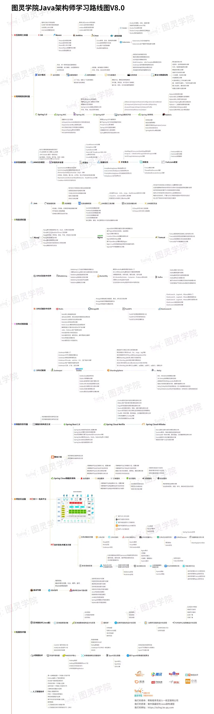

# Guide

在技术方面无论我们怎么学习，总感觉需要提升自已,却又不知道从哪里着手，同时也不知道自己处于哪个水平。

这时候就需要有清晰的指示图来指引我们，这样我们能清楚的知道我们在哪方面不足，以及自己大概处于哪个阶段

和水平。

本项目记录了技术进阶路线图和技术实践！

主要包含 `操作系统`、`JAVA`、`算法`、`数据库`、`中间件`、`解决方案`、`架构`、`DevOps` 和 `大数据` 等技术栈总结！

其中既有个人总结的内容，也有来源于互联网各种经典场景或案例的分享（感谢对应的作者）！

目的在于把常用的技术内容进行归纳整理记录。

用最少的图文来讲解清楚每一个知识点，如果欢迎大家一起加入！

希望大家不忘初心，改变自己！

